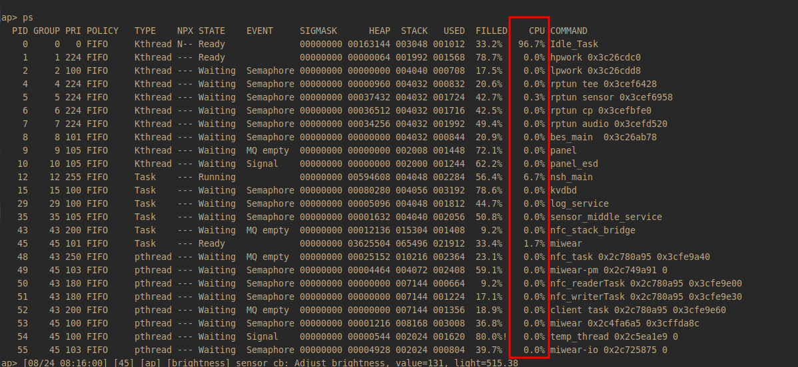

# 使用 cpuload 分析 CPU 负载

\[ [English](./../../../../en/debugging_tools/performance/analysis/cpuload.md) | 简体中文 \]

在嵌入式系统开发中，分析 CPU 负载是定位性能瓶颈、优化任务调度和功耗管理的关键步骤。本文档详细介绍如何在 openvela 操作系统中配置和使用 `cpuload` 功能，以及如何结合高级工具进行深入的性能分

## 一、cpuload 配置方法

openvela 提供了三种不同的 CPU 负载统计模式，开发者可以根据精度要求和硬件资源选择最合适的方案。

### 模式一：基于系统时钟的采样 (默认)

此模式利用系统的核心节拍定时器 (System Tick Timer) 中断，在每个时钟滴答时对当前正在运行的任务进行采样，从而估算 CPU 占用率。

- **工作原理**：在系统时钟中断服务程序中，对当前活动任务的执行时间进行累加。

- **优缺点**：

    - **优点**：配置最简单，不依赖任何额外的硬件定时器。
    - **缺点**：统计精度受限于系统时钟频率，可能无法精确捕捉到短时运行的任务。

- **配置选项**：

    ```Makefile
    CONFIG_SCHED_CPULOAD_SYSCLK=y
    ```

### 模式二：基于外部高精度定时器的采样 (推荐)

此模式使用一个独立的硬件定时器 (External Timer) 以更高的频率进行任务采样，从而提供比系统时钟更精确的 CPU 负载数据。

- **工作原理**：配置一个专用的硬件定时器，以高于系统时钟的频率触发中断，并在中断服务程序中对活动任务进行采样。

- **优缺点**：

    - **优点**：统计精度更高，能更准确地反映任务的瞬时 CPU 占用。
    - **缺点**：需要占用一个额外的硬件定时器，并且需要目标硬件平台 (BSP) 提供相应的驱动适配。

- **配置选项**：

    ```Makefile
    CONFIG_SCHED_CPULOAD_EXTCLK=y
    ```

### 模式三：基于任务实际运行时间的高精度计算 (推荐)

此模式通过 `SCHED_CRITMONITOR` 模块精确记录每个任务的启动和停止时间戳，从而计算出其精确的累计运行时间。这是三种模式中精度最高的方法。

- **工作原理**：利用性能监控器 (Performance Monitor) 记录任务切换的精确时间点，通过累计每个任务的实际执行时长来计算其 CPU 占用率。
- **优缺点**：

    - **优点**：统计精度最高，不受采样频率限制，能真实反映每个任务的 CPU 消耗。
    - **缺点**：会引入轻微的性能开销，因为任务切换时需要记录额外的时间信息。

- **配置选项**：

    **说明**：使用此模式前，必须确保板级支持包 (BSP) 已经正确实现了性能计数器，并调用了 `up_perf_init()` 函数进行初始化。

    ```Makefile
    CONFIG_SCHED_CRITMONITOR=y
    CONFIG_SCHED_CPULOAD_CRITMONITOR=y
    ```

## 二、查看与访问 CPU 负载数据

启用任一 `cpuload` 配置后，您可以通过多种方式获取 CPU 负载信息。

### 1、使用 ps 命令

在 shell 终端中执行 `ps` 命令，可以直接查看到每个线程 (thread) 的 CPU 占用率（`CPU` 列）。



如果只想查看特定线程的信息，可以向 `ps` 命令传递一个或多个线程 ID (PID)。

```Bash
# 示例：查看 PID 为 14 和 23 的线程信息
ps 14 23
```


### 2、通过编程接口访问

#### 用户空间 (Userspace)

应用程序可以通过读取 `/proc` 文件系统中的虚拟文件来获取 CPU 负载数据。

- **获取系统总负载**：`/proc/cpuload`
- **获取指定线程负载**：`/proc/${pid}/cpuload`

#### 内核空间 (Kernel Space)

在内核态代码中，可以直接调用以下 API 函数来获取指定线程的 CPU 负载信息。

```C
#include <nuttx/clock.h>

int clock_cpuload(int pid, FAR struct cpuload_s *cpuload)
```

## 三、使用高级工具进行分析

对于需要更精细、可视化的性能分析场景，`ps` 命令可能不够直观。此时，可以借助专业的系统分析工具。

### 1、使用 SEGGER SystemView

SystemView 是一款功能强大的可视化跟踪诊断工具。通过 J-Link 调试器，它可以实时捕获并展示 openvela 内核的详细调度事件，包括任务切换、中断、API 调用等。

与 `ps` 命令相比，SystemView 提供了更高的时间分辨率和更丰富的上下文信息，使您能够：

- 精确测量每个线程的单次运行时间片。
- 直观地观察任务间的交互与抢占关系。
- 分析特定时间段内的系统整体负载情况。


