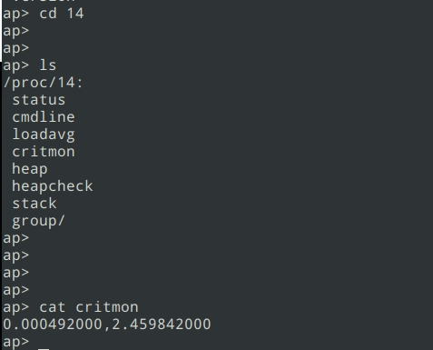

# 使用 irqinfo 和 critmon 进行中断与临界区监控

\[ [English](./../../../../en/debugging_tools/performance/analysis/irqinfo_critmon.md) | 简体中文 \]

本文档为嵌入式开发人员提供在 openvela 系统上使用 `irqinfo` 和 `critmon` 两个核心工具的详细指南。您将学会如何监控中断性能、分析临界区（Critical Section）耗时以及调度器锁（Scheduler Lock）的最长持有时间，从而定位系统性能瓶颈并优化实时行为。

## 一、概述

`irqinfo` 和 `critmon` 是 openvela 系统提供的两个强大的命令行工具，用于实时性能分析。

- `irqinfo`: 专注于中断（IRQ）监控。它统计每个中断的触发频率、发生次数以及中断服务程序（ISR）的最大执行时间。这对于识别“中断风暴”或耗时过长的中断处理至关重要。
- `critmon`: 专注于临界区和调度器锁的耗时监控。它跟踪每个线程（Thread）在禁用中断（进入临界区）或禁用调度器时所花费的最长时间，帮助您发现导致系统响应延迟的关键代码路径。

## 二、系统配置

要使用这些监控工具，您必须在 `defconfig` 文件中启用相应的内核配置选项，并确保 `procfs` 文件系统已正确挂载。

### 1、通用配置：挂载 `procfs`

`irqinfo` 和 `critmon` 都依赖 `procfs` 文件系统来暴露其统计数据。请确保系统中已启用 `CONFIG_FS_PROCFS=y`，并在系统启动后执行以下命令挂载 `procfs`：

```Bash
mount -t procfs /proc
```

### 2、`irqinfo` 专属配置

要启用中断频率和耗时统计功能，请设置以下 Kconfig 选项：

```Makefile
# 启用中断监控功能
CONFIG_SCHED_IRQMONITOR=y

# 启用 procfs 文件系统支持
CONFIG_FS_PROCFS=y
```

### 3、`critmon` 专属配置

要启用临界区、调度锁和线程执行时间统计功能，请设置以下 Kconfig 选项：

```Makefile
# 启用临界区和调度锁监控
CONFIG_SCHED_CRITMONITOR=y  

# 启用 critmon 用户空间命令行工具
CONFIG_SYSTEM_CRITMONITOR=y 

# 启用 procfs 文件系统支持
CONFIG_FS_PROCFS=y
```

**重要提示**：启用 `CONFIG_SCHED_CRITMONITOR` 后，以下两个选项默认值为 `-1`（禁用）。您必须将它们修改为 `0` ，才能开启统计功能。

```Makefile
# 设置为 0 以开启临界区耗时统计
CONFIG_SCHED_CRITMONITOR_MAXTIME_CSECTION=0

# 设置为 0 以开启调度锁耗时统计
CONFIG_SCHED_CRITMONITOR_MAXTIME_PREEMPTION=0
```

## 三、使用 `irqinfo` 进行中断分析

`irqinfo` 工具帮助您深入了解系统的中断行为。

### 1、使用方法

直接在 shell 中执行 `irqinfo` 命令即可查看统计信息。

```Bash
irqinfo
```

- **首次执行**：显示从系统启动到当前时间点的累计中断统计。
- **后续执行**：显示自上一次执行 `irqinfo` 命令以来的增量中断统计。

统计数据在每次读取后会自动清零，以便于进行分段观测。

### 2、解读输出结果

```Bash
ap> irqinfo
IRQ  HANDLER   ARGUMENT     COUNT  RATE    TIME (us)
---  --------  --------     -----  ------  ---------
11   2c604591  00000000       233   0.000         12
39   0005753d  2c786451        18   2.395         83
43   0005753d  00057455       759   0.000        143
```

| **列名**   | **描述**                                                                         |
| :--------- | :------------------------------------------------------------------------------- |
| `IRQ`      | **中断号**。唯一的数字标识符，用于区分不同的中断源。                             |
| `HANDLER`  | **中断处理函数地址**。指向处理该中断的服务程序（ISR）的内存地址。                |
| `ARGUMENT` | **传递给处理函数的参数**。通常为 `0` 或指向特定设备实例的指针。                  |
| `COUNT`    | **中断发生次数**。在统计周期内，该中断被触发的总次数。                           |
| `RATE`     | **中断频率 (次/秒)**。在统计周期内的平均每秒触发次数。                           |
| `TIME`     | **最大执行时间 (μs)**。中断服务程序（ISR）单次执行所花费的最长时间，单位为微秒。 |

### 3、分析技巧

#### 解析中断处理函数 (HANDLER)

您可以使用 `addr2line` 工具将 `HANDLER` 地址转换为具体的文件名和行号，从而定位 ISR 源码。

```Bash
addr2line -fe <your_elf_file> <address>
addr2line -fe nuttx 0005753d
```

示例输出：

```Bash
up_irq_handler
/path/to/nuttx_os.c:55
```

**注意**: 在许多 ARM 架构的实现中，外设中断会共享一个顶层中断入口（如 `up_irq_handler`），此时需要结合 `IRQ` 号来进一步区分具体的中断源。

#### 解析中断号 (IRQ)

`IRQ` 号的含义与硬件平台和架构紧密相关。

- **ARM 平台**

    - **0-15**：通常为系统级中断（如 SVC, PendSV。可通过中断处理函数 (HANDLER) 找到对应中断。
    - **> 15**：硬件中断。要将其映射到板级头文件中定义的 `IRQn` 枚举，请使用公式：`枚举值 = IRQ 号 - 16`。

- **Xtensa 平台**

    - IRQ 定义通常位于特定于平台的板级头文件中，请直接查阅。

**示例分析与代码映射：**

以下 `irqinfo` 输出展示了如何将 IRQ 号与 BSP 头文件中的定义对应起来。

```Bash
ap> irqinfo
IRQ HANDLER  ARGUMENT    COUNT    RATE    TIME
 11 2c604591 00000000          8    0.205    7  # 系统中断，SVC
 39 0005753d 2c786451         37    0.948   62  # 硬件中断，39-16=23 UART0_IRQn
 43 0005753d 00057455       3862   99.015   73  # 硬件中断，43-16=27 Timer11 Interrupt
 ```

 ```C
/* 示例: framework/services/platform/cmsis/inc/best1600.h */
typedef enum IRQn {
    // ...
    UART0_IRQn                =  23,      /*!< UART0 Interrupt                    */
    // ...
    SYS_TIMER11_IRQn          =  27,      /*!< Timer11 Interrupt                  */
    // ...
} IRQn_Type;
```

## 四、使用 `critmon` 进行临界区与调度锁分析

`critmon` 工具帮助您监控线程在禁用中断或禁用调度期间的最长耗时。

### 1、使用方法

`critmon` 提供了一组命令来控制和显示统计信息。

- **`critmon`**:

    显示统计信息。与 `irqinfo` 类似，首次执行显示累计数据，后续执行显示增量数据。数据读取后自动清零。

- **`critmon_start`**:

    在后台启动一个任务，该任务会按照 `CONFIG_SYSTEM_CRITMONITOR_INTERVAL`（默认为 2 秒）的周期自动打印 `critmon` 统计信息。

- **`critmon_stop`**:

    停止后台的自动打印任务。

### 2、解读输出结果

```Bash
ap> critmon
PRE-EMPTION  CALLER      CSECTION     CALLER      RUN          TIME         PID  DESCRIPTION
-----------  ----------  -----------  ----------  -----------  -----------  ---  -----------
1.392849000              0.004460000              -----------  -----------  ---- CPU 0
0.000039000  0x81f88a7   0.000021000  0x81bf457   0.000631000  0.012379000    1  hpwork
0.001204000  0x81ccc6d   0.000029000  0x81bcfa1   0.001750000  0.108839000    3  nsh_main
```

| **列名**                 | **描述**                                                                                                            |
| :----------------------- | :------------------------------------------------------------------------------------------------------------------ |
| `PRE-EMPTION` & `CALLER` | **最长关调度时间 (秒)** 和 **调用者地址**。<br>记录了线程通过 `sched_lock()` 等函数禁用调度器的最长持续时间。       |
| `CSECTION` & `CALLER`    | **最长关中断时间 (秒)** 和 **调用者地址**。<br>记录了线程通过 `enter_critical_section()` 进入临界区的最长持续时间。 |
| `RUN`                    | **单次最长运行时间 (秒)**。<br>线程在两次被抢占（preemption）之间连续运行的最长时间。                               |
| `TIME`                   | **总计运行时间 (秒)**。线程在统计周期内获得 CPU 的总时间。                                                          |
| `PID`                    | **线程** **ID**。                                                                                                   |
| `DESCRIPTION`            | **线程名称**。                                                                                                      |

### 3、分析单个线程的执行时间

您还可以通过读取 `/proc` 文件系统中对应的节点来获取单个线程的监控数据。这对于编写自动化测试脚本或进行精细化分析非常有用。

- **命令**：`cat /proc/<pid>/critmon`
- **功能**：获取指定 PID 线程的单次最长运行时间和总运行时间。



## 五、实现原理

- 中断监控 (`irqinfo`)：系统在每次进入和退出中断服务程序时记录时间戳。通过计算差值，可以得到单次执行时间，并与已记录的最大值进行比较和更新。计数器则在每次中断触发时递增。
- 临界区/调度锁监控 (`critmon`)：

    - 关中断/开中断：`enter_critical_section()` 和 `leave_critical_section()` 函数内置了计时逻辑，用于计算并更新当前线程禁用中断的最长时间。记录关中断时间 MAX 值，开机即开始计时，读完即清空，重新计时
    - 关调度/开调度：`sched_lock()` 和 `sched_unlock()` 函数同样包含计时逻辑，用于计算并更新当前线程禁用调度器的最长时间。同时该工具记录了开关调度的MAX 时间，原理相同

## 附录：关键概念解析

- 中断 (IRQ) 与中断服务程序 (ISR)

    - 中断 (IRQ)：是由硬件或软件发出的信号，通知 CPU 发生了需要立即处理的紧急事件。
    - 中断服务程序 (ISR)：是专门用于处理特定中断事件的一段代码。当一个中断发生时，CPU 会暂停当前任务，转而执行对应的 ISR。
  
- 临界区 (Critical Section)

    - 指一段必须以原子方式执行的代码，即在执行期间不能被中断或被其他任务抢占。在 openvela/NuttX 中，这通常通过**禁用所有中断**来实现。`critmon` 中的 `CSECTION` 列监控的就是线程持有这种最高优先级锁定的时间。长时间占用临界区会严重影响系统的实时响应能力。

- 调度锁 (Scheduler Lock)

    - 是一种比临界区更轻量的锁。它**仅禁用****任务调度****器**，防止操作系统切换到其他任务，但**不会禁用硬件中断**。这意味着在持有调度锁期间，中断仍然可以发生并得到处理。`critmon` 中的 `PRE-EMPTION` 列监控的就是线程持有调度锁的时间。

- `procfs` (Process File System)

    - 一个虚拟文件系统，它并不存储在物理磁盘上，而是由内核在内存中动态生成。它提供了一个用户接口，允许用户通过读写文件的方式查看和修改内核的内部数据结构和状态。`irqinfo` 和 `critmon` 正是通过 `procfs` 将内核中的统计数据暴露给用户空间的命令行工具。
