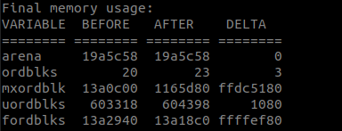
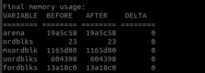

# fstest 文件系统压力测试工具指南

\[ [English](./../../../en/debugging_tools/stress_testing/fstest.md) | 简体中文 \]

## 一、概述

`fstest` 是一个命令行工具，专用于对文件系统的性能和稳定性进行压力测试。

它通过在指定的挂载点上模拟高负载的文件操作（如并发创建、写入、读取和删除文件），全面检验从上层文件系统到下层存储介质（如 eMMC、SD 卡、板载闪存）驱动的整个 I/O 栈。该工具对于评估特定硬件平台上的文件系统性能、定位 I/O 瓶颈以及验证存储驱动的稳定性至关重要。

## 二、命令详解

在 openvela 系统 Shell 中执行 `fstest -h` 可以获取完整的命令行选项帮助。

### 1、命令语法

```Bash
fstest [OPTIONS]
```

### 2、参数说明

| **选项 (Option)** | **参数 (Argument)** | **说明**                                                                             | **默认值** |
| ----------------- | ------------------- | ------------------------------------------------------------------------------------ | ---------- |
| `-h`              | N/A                 | 显示此帮助信息并退出。                                                               | N/A        |
| `-n`              | `[count]`           | 指定测试的循环次数。每次循环都会执行一遍完整的文件创建、写入、读取、校验和删除流程。 | 100        |
| `-m`              | `[path]`            | **（必填）** 指定测试的目标挂载点（路径）。工具将在此目录下创建和操作测试文件。      | N/A        |
| `-o`              | `[num]`             | 指定在单次测试循环中要创建和操作的文件总数。                                         | 512        |
| `-s`              | `[size]`            | 指定每个测试文件的大小，单位为字节 (Byte)。                                          | 8192       |

### 3、原始帮助信息

以下为 `fstest -h` 命令在终端中的原始输出，可供参考。

```Bash
ap>fstest -h 

Usage:fstest [OPTION [ARG]] ...
-h show this help statement 获取 show help message
-n num of test loop e.g. [100] 测试循环次数，默认情况下是100次循环
-m mount point to be tested e.g. [] 指定测试路径
-o num of open file e.g 指定打开的文件数
-s size of every file e.g 指定每个文件大小

注意：-o 与 -s 大小的乘积需要小于整个分区的大小
```

## 三、使用前提

在运行测试前，您必须确保目标分区拥有足够的可用空间以容纳所有测试文件。测试所需的总空间由**文件数量** (`-o`) 和**单个文件大小** (`-s`) 决定，必须满足以下条件：

```
(文件数量 × 单个文件大小) < 目标分区的可用空间
```

如果可用空间不足，测试将因无法创建文件而失败。

## 四、执行与示例

### 1、测试命令示例

以下示例演示了如何在不同的挂载点上执行 `fstest`。

```Bash
# 在 /tmp 目录下执行 100 次测试循环
fstest -n 100 -m /tmp

# 在 /data 目录下执行 100 次测试循环
fstest -n 100 -m /data
```

### 2、示例输出

测试执行后，您将看到类似以下的输出日志。日志会显示测试配置，并分阶段打印文件操作的耗时。

- 执行 `fstest -n 100 -m /tmp` 命令后的测试输出：

    

- 执行 `fstest -n 100 -m /data` 命令后的测试输出：

    

### 3、结果解读

`fstest` 的输出日志主要包含两部分：**性能数据**和**内存使用报告**。

#### 内存使用报告

日志末尾的 `Final memory usage` 表格是诊断内存泄漏的关键依据，它展示了测试运行前后 openvela 内核内存堆（Heap）的变化情况。

- **`BEFORE`** **/** **`AFTER`**：分别表示测试任务开始前和结束后某一内存指标的快照值。
- **`DELTA`**：`AFTER` 与 `BEFORE` 的差值。**对于一个健康的系统，`DELTA` 值应为 `0`**，表示测试过程中动态申请的内存在测试结束后已全部被正确释放。
- **关键指标解读**：

    - `arena`：总堆大小。
    - `ordblks`：空闲内存块（Free Chunks）的数量。
    - `uordblks`：已分配内存块（Allocated Chunks）的总大小。
    - `fordblks`：空闲内存块的总大小。

如果 `DELTA` 列出现非零值，通常意味着存在内存泄漏。例如，在第一个示例输出中，`ordblks` (空闲块) 增加了 3，而 `uordblks` (已用空间) 增加了 1080 字节，这表明测试在 `/tmp` 路径执行时可能触发了未能被正确释放的内存分配。

#### 性能数据

日志中以 `[TMR]` 开头的行展示了各个文件操作阶段的性能数据。

- **成功标志**：当测试完成所有循环且未发生错误时，日志末尾会打印 `fstest success!`。
- **性能指标**：`create file`, `write file`, `read file`, `remove file` 等条目分别对应文件创建、写入、读取和删除阶段。其后的时间值表示完成该阶段所有操作的总耗时（单位通常为毫秒或系统时钟周期，具体单位取决于平台实现）。通过分析这些耗时数据，您可以评估文件系统在不同 I/O 模式下的具体性能表现。