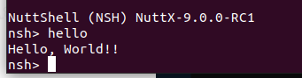

# 添加 Hello World 示例

## 一、概述

openvela 基于开源操作系统 NuttX 构建，进一步提供多种复杂的系统级服务。为了使 openvela 更加完善和功能全面，需要引入完整的开发框架或功能模块。一个完整的开发框架通常包含以下两部分：

- 系统应用：内部开发的系统应用，通常存放于 `framework/` 等文件夹中。
- 第三方系统库：引入第三方库并完成适配，通常存放于 `external/` 等文件夹中。

新功能和框架的目录结构如下图所示：

```Bash
└── vela
    ├── apps
    │   └── examples
    │       ├── hello_main_1
    │       └── hello_main_2
    └── external
        ├── libs_1
        └── libs_2
```

## 二、添加 Hello World 示例

本节介绍如何在 openvela 中添加一个 `Hello World` 示例应用程序，包括主体框架、文件内容以及相关构建配置。

### 1、主体框架

Hello 示例应用程序需要包含以下核心文件：

- `hello_main.c`：定义应用程序的主要逻辑。
- `Kconfig`：定义条件编译宏，用于功能裁剪。
- `CMakeLists.txt`：用于 openvela 中的 `CMake` 构建系统组织。
- `Make.defs`：指示当前目录是否需要被编译，必须被上层目录包含。
- `Makefile`：定义库的内部文件编译规则以及编译标志 (FLAGS)。

目录结构示例如下：

```Bash
apps
 └── examples
     └── hello_main
         ├── hello_main.c
         ├── CMakeLists.txt
         ├── Kconfig
         ├── Make.defs
         └── Makefile
```

### 2、文件内容

#### hello_main.c

文件 `hello_main.c` 应包含基本的 C 应用程序逻辑：

```C
#include <stdio.h>

int main(int argc, char *argv[])
{
    printf("Hello, World!!\n");
    return 0;
}
```

如需添加 C++ 应用程序，入口函数（`main`）需要使用 `extern "C"` 声明，以确保与上层接口兼容：

```C++
#include <iostream>

extern "C" int main(int argc, char *argv[])
{
    std::cout << "Hello, World!!" << endl;
    return 0;
}
```

#### Kconfig

以下是 `Kconfig` 文件的示例内容：

```Plain
config EXAMPLES_HELLO
        tristate "\"Hello, World!\" example"
        default n
        ---help---
                Enable the \"Hello, World!\" example

if EXAMPLES_HELLO
// 下面 <default "hello"> 中的 hello 需要运行的指令
config EXAMPLES_HELLO_PROGNAME
        string "Program name"
        default "hello"
        ---help---
                This is the name of the program that will be used when the NSH ELF
                program is installed.

config EXAMPLES_HELLO_PRIORITY
        int "Hello task priority"
        default 100

config EXAMPLES_HELLO_STACKSIZE
        int "Hello stack size"
        default DEFAULT_TASK_STACKSIZE
        
endif
```

#### CMakeLists.txt

以下是 `CMakeLists.txt` 文件的内容示例，其中所有配置变量可以直接使用：

```CMake
# .config 中的所有配置已加载到 CMake 环境，因此可以直接使用变量  

# Enable Config, 代替原Make.defs configured_apps的配置
if(CONFIG_EXAMPLES_HELLO) # 如果defconfig使能了该feature则加入编译
  # call 添加应用module `nuttx_add_application` 将hello添加为一个builtin app.
  nuttx_add_application(
    NAME                                #参数标志：application唯一名称
    ${CONFIG_EXAMPLES_HELLO_PROGNAME}   #参数值：  取hello Kconfig中的设置值为hello应用名称
    SRCS                                #参数标志：源文件
    hello_main.c                        #参数值：  传入应用的源文件，可以多个，main必须为第一个 
    STACKSIZE                           #参数标志：栈大小
    ${CONFIG_EXAMPLES_HELLO_STACKSIZE}  #参数值：  取Kconfig中的设置值，不传则为CONFIG_DEFAULT_TASK_STACKSIZE
    PRIORITY                            #参数标志：任务优先级
    ${CONFIG_EXAMPLES_HELLO_PRIORITY})  #参数值：  取Kconfig中的设置值，不传则为SCHED_PRIORITY_DEFAULT
endif()
```

`nuttx_add_application()` 的函数定义

该 CMake 函数位于 `nuttx/cmake/nuttx_add_application.cmake` 文件中，用于添加并配置应用程序。

```CMake
nuttx/cmake/nuttx_add_application.cmake

 Usage:
   nuttx_add_application( NAME <string> [ PRIORITY <string> ]
     [ STACKSIZE <string> ] [ COMPILE_FLAGS <list> ]
     [ INCLUDE_DIRECTORIES <list> ] [ DEPENDS <string> ]
     [ DEFINITIONS <string> ] [ MODULE <string> ] [ SRCS <list> ] )

 Parameters:
   NAME                : unique name of application
   PRIORITY            : priority
   STACKSIZE           : stack size
   COMPILE_FLAGS       : compile flags
   INCLUDE_DIRECTORIES : include directories
   DEPENDS             : targets which this module depends on
   DEFINITIONS         : optional compile definitions
   MODULE              : if "m", build module (designed to received
                         CONFIG_<app> value)
   SRCS                : source files
   NO_MAIN_ALIAS       : do not add a main=<app>_main alias(*)
```

#### Makefile

要在 openvela 中添加一个新的应用程序，其核心步骤包括将应用程序的入口文件添加到 `MAINSRC` 中，并正确定义以下三个必要参数：

- `PROGNAME`：应用程序的名称，在 `nsh` 启动时使用。
- `PRIORITY`：应用程序的运行优先级。
- `STACKSIZE`：应用程序的栈大小。

以上三个参数是添加和运行一个应用程序的必备配置。

以下是一个示例的 `Makefile` 配置内容：

```Makefile
include $(APPDIR)/Make.defs

# 定义程序名称，可以从 Kconfig 值中获取，也可以直接定义  
PROGNAME = $(CONFIG_EXAMPLES_HELLO_PROGNAME)
# 或者 PROGNAME = hello

# 定义应用程序的优先级  
PRIORITY = $(CONFIG_EXAMPLES_HELLO_PRIORITY)
# 或者 PRIORITY = 100   （大小根据需要指定）

# 定义应用程序的栈大小  
STACKSIZE = $(CONFIG_EXAMPLES_HELLO_STACKSIZE)
# 或者 STACKSIZE = 4096 （大小根据需要指定） 

# 模块设置  
MODULE = $(CONFIG_EXAMPLES_HELLO)

# 定义 main 函数所在的源文件 
MAINSRC = hello_main.c

# 如果引用了需要的头文件，可在此添加头文件路径，例如：  
CFLAGS += ${INCDIR_PREFIX}$(APPDIR)/external/libs/include
# 等价于 CFLAGS += -I$(APPDIR)/external/libs/include

# 如果是 C++ 项目，对应头文件的配置可添加到 CXXFLAGS 中 
# CXXFLAGS // c++ 相应的头文件
        
# 如果添加内部开发的相应的源文件，需在这里添加相应的文件，如：
# 其中路径的开始为当前路径，即当前 Makefile 所在的路径。
CSRCS += device_example.c

# 如果有 C++ 源文件，按需添加：  
# CXXSRCS += hello_main.cxx   // c++ 相应的源文件

# 包含 openvela 的应用配置  
include $(APPDIR)/Application.mk
```

当项目拥有多个入口文件时，可以在 `Makefile` 中根据配置条件做出灵活调整，例如：

```Bash
ifeq ($(CONFIG_MAIN1),yes)
  PROGNAME += main1
  MAINSRC  += main1.c
endif

ifeq ($(CONFIG_MAIN2),yes)
  PROGNAME += main2
  MAINSRC  += main2.c
endif
```

如果项目中 C++ 源文件的后缀不是 `.cxx`，需要在 `Makefile` 中通过 `CXXEXT` 参数指定后缀。例如：

```Makefile
CXXEXT := .cpp
```

#### Make.defs

在 `Make.defs` 文件中，需将应用的路径添加到 `CONFIGURED_APPS` 中，使 openvela 的编译系统能够正确找到所需路径：

```Makefile
ifneq ($(CONFIG_EXAMPLES_HELLO),)
CONFIGURED_APPS += $(APPDIR)/examples/hello_main
endif
```

## 三、验证测试

新添加的应用需要通过清理并重新编译后才能生效。验证测试的步骤如下：

### 1、清理代码

使用以下命令执行清理操作：

```Bash
# 清理工程  
./build.sh vendor/sim/boards/vela/configs/vela distclean -j8/
```

### 2、配置 Menuconfig

在 `menuconfig` 中启用对应的应用功能：

```Bash
# 启动 menuconfig  
./build.sh vendor/sim/boards/vela/configs/vela menuconfig -j8
```

- 进入 `menuconfig` 后，启用 `hello_main`。

  

### 3、编译和运行

```Bash
# Build: 
./build.sh vendor/sim/boards/vela/configs/vela -j8

# Run:
./nuttx/nuttx
```

运行后，在串口中输入程序名称（*Program name*），程序名称已在文件 `Kconfig` 中定义。例如：`hello`，如下图所示：



## 四、应用自启动

openvela 的启动脚本存放在 `/etc` 目录下，该目录以 `romfs` 的形式与 openvela 的二进制文件链接在一起。在系统启动后会自动被 `nshlib` 挂载，相关配置如下。

### 1、配置项说明

在 `Makefile` 中，需要配置以下选项来支持自启动功能：

```Makefile
CONFIG_FS_ROMFS=y
CONFIG_NSH_ROMFSETC=y
CONFIG_NSH_ROMFSMOUNTPT="/etc"
CONFIG_NSH_SYSINITSCRIPT="init.d/rc.sysinit"
CONFIG_NSH_INITSCRIPT="init.d/rcS"
```

### 2、启动脚本位置

启动脚本的默认位置如下：

```Bash
board/arch/board/board/src/etc/init.d/rc.sysinit   # 系统初始化脚本 
board/arch/board/board/src/etc/init.d/rc           # 用户脚本  
```

### 3、脚本文件示例

以下是 `rcS` 文件的内容示例：

```C++
#include <nuttx/config.h>

#ifdef CONFIG_FS_HOSTFS
mount -t hostfs -o fs=. /data # 挂载 Host 文件系统到 /data  
#endif

hello    # 前台运行 hello
hello &  # 后台运行 hello
```
