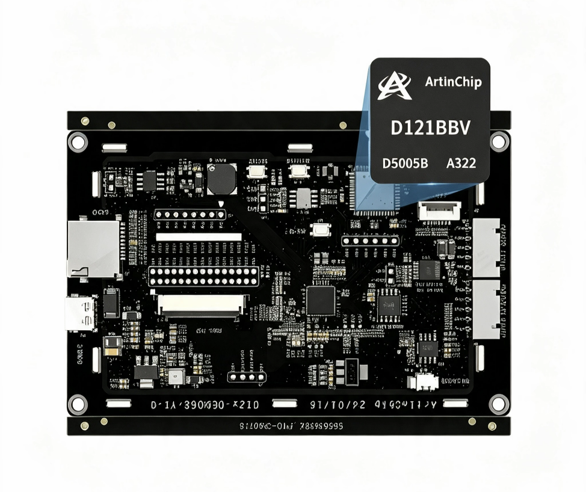
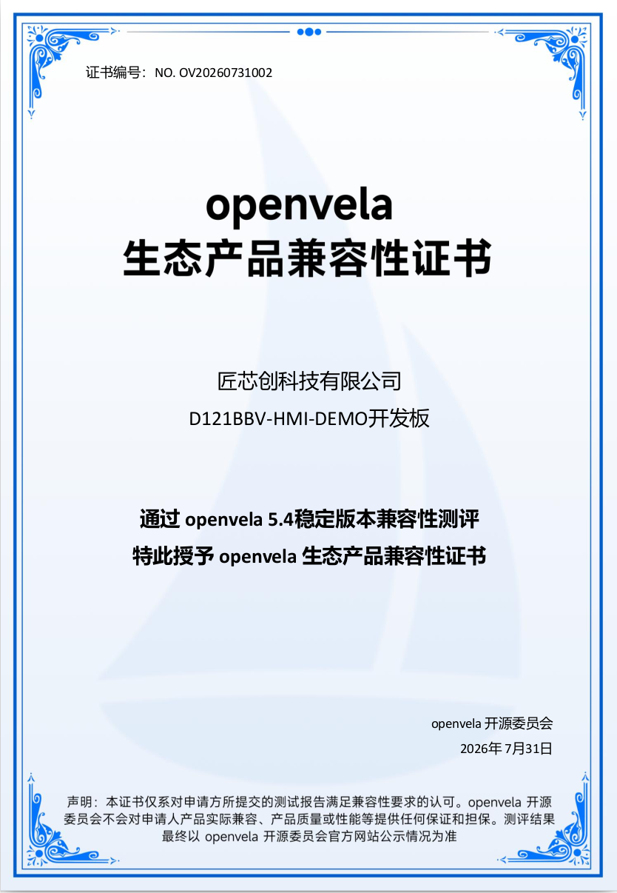

# openvela 兼容性认证开发板

[ [English](../../en/dev_board/Certified_Board.md) | 简体中文 ]

> 本页公示通过 openvela 官方兼容性认证（XTS）的开发板 / 产品。未经认证的开发板适配案例请见 [openvela 开发板案例](./Development_Board.md)。

| 开发板                                                                                                   | 厂商名称           | 芯片型号                    | 认证版本     | 适配案例                                                                                                              | 证书                                                                                                                                                                                       |
| -------------------------------------------------------------------------------------------------------- | ------------------ | --------------------------- | ------------ | --------------------------------------------------------------------------------------------------------------------- | ------------------------------------------------------------------------------------------------------------------------------------------------------------------------------------------ |
|  Gemini-S1                      | 润芯微 (Rivotek)   | 全志 R528（双核 Cortex-A7） | openvela 5.2 | [板级说明](../../../../../vendor_allwinnertech/blob/dev-ai-contest-2026/boards/r528/r528s3-gemini-s1/README_zh-cn.md) |  NO. OV20260412                            |
|  D121BBV-HMI-DEMO | 匠芯创 (ArtInChip) | D121BBV（RISC-V）           | openvela 5.4 | [板级说明](../../../../../vendor_artinchip/blob/trunk/README.md)                                                      |  NO. OV20260731002 |
