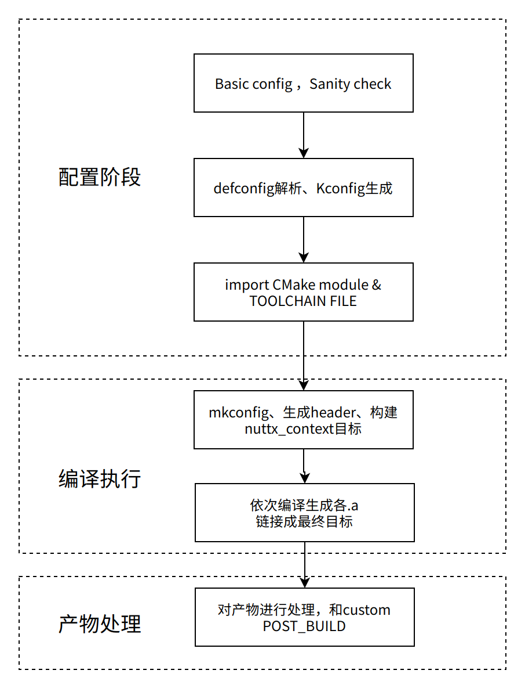

# CMake 深度解析与维护手册

\[ [English](../../../en/device_dev_guide/build/CMake_advanced_guide.md) | 简体中文 \]

本文档旨在为 openvela 的构建系统维护者和资深开发者提供一份深入的技术参考。内容涵盖 CMake 构建系统的内部架构、高级开发实践，以及解决复杂问题的技巧与方案。

在阅读本文前，建议您已熟悉 [CMake 快速入门](./CMake_quick_start.md)中的基础操作。

## 一、CMake 构建系统架构

本章节深入剖析 openvela CMake 构建系统的内部工作流程与核心设计。

### 1、整体构建流程

openvela 的 CMake 构建过程遵循 NuttX 的标准框架，其入口文件为 `nuttx/CMakeLists.txt`。整个流程在 `cmake` 配置阶段生成构建规则，在 `--build` 阶段执行编译，可概括为以下几个关键阶段：

1. **配置与环境检查**：进行 CMake 基础配置，解析 `NuttXDir` 和 `AppDir` 等核心工作目录，并执行基本的完整性（Sanity）检查。
2. **Kconfig** **与配置导入**：解析 `defconfig` 文件，识别并链接 `board`、`chip` 及 `apps` 目录，生成完整的 Kconfig 树。随后，生成 `.config` 文件并将其中的所有宏定义导入 CMake 环境作为缓存变量。
3. **工具链加载**：根据 `CONFIG_ARCH` 等配置，加载对应的 CMake 工具链文件（Toolchain File），完成交叉编译环境的设置。
4. **构建上下文生成**：执行 `mkconfig.cmake` 和 `gen_header.cmake` 等模块，生成 `config.h`、`version.h` 等必要的头文件和配置，确保编译环境就绪。
5. **目标库生成**：CMake 依次遍历 `arch`、`drivers`、`mm`、`sched`、`apps` 等模块目录，将各模块的源文件编译并打包成相应的静态库（`.a` 文件）。
6. **最终产物链接**：链接所有生成的静态库（`${nuttx_libs}`），生成 `nuttx` ELF 可执行文件。
7. **产物后处理**：执行用户定义的 `POST_BUILD` 动作，例如通过 `objcopy` 生成 `.bin` 文件、打包固件等。

其构建步骤如下图所示：



### 2、构建依赖关系

所有模块最终被组织成不同类别的库集合，并链接成最终产物。其依赖关系如下图所示：



## 二、高级开发实践指南

### 1、适配自定义板级与芯片

为您的自定义硬件添加 CMake 支持，需要在相应的 `board` 和 `chip` 目录下创建 `CMakeLists.txt` 文件。

目录结构示例：

```Bash
# 目录位置 vendor/vendor_name
├── boards
│   ├── <chip_name>
│   │   └── <board_name>
│   │       ├── Kconfig       
│   │       ├── CMakeList.txt        <-- 板级顶层 CMake 文件                
│   │       └── src
│   │           ├── Make.defs
│   │           └──  CMakeList.txt   <-- 板级源码 CMake 文件
├── chips
│   └── chip_name
│       ├── Kconfig
│       ├── Make.defs
│       └──  CMakeList.txt      <-- 芯片级 CMake 文件
```

`CMakeLists.txt` 内容示例：

1. `chips/<`**`chip_name`**`>/CMakeLists.txt`:

    ```Makefile
    # 添加芯片相关源文件 (例如启动文件)
    set(SRCS chip_startup.S)
    
    # 将源文件添加到 'arch' 目标，最终会归档至 libarch.a
    target_sources(arch PRIVATE ${SRCS})
    ```

2. `boards/<`**`chip_name`**`>/<`**`board_name`**`>/src/CMakeLists.txt`:

    ```Makefile
    # 添加板级驱动和初始化源文件
    set(SRCS board_source.c)
    
    # 将源文件添加到 'board' 目标，最终会归档至 libboard.a
    target_sources(board PRIVATE ${SRCS})
    ```

3. `boards/<`**`chip_name`**`>/<`**`board_name`**`>/CMakeLists.txt`:

    ```CMake
    # 将 src 目录包含进构建
    add_subdirectory(src)
    
    # 设置链接脚本 (Linker Script) 的路径
    set_property(GLOBAL PROPERTY LD_SCRIPT
    "${NUTTX_BOARD_ABS_DIR}/scripts/app.ld"
    )
    
    # 定义 post_build 目标，用于构建结束时自动处理产物
    add_custom_target(
    TARGET nuttx_post_build
    POST_BUILD
    COMMAND ${NUTTX_DIR}/../vendor/xxx/post_build.sh ${CMAKE_BINARY_DIR}
    )
    ```

### 2、移植第三方库

#### 方法论：何时复用，何时重写？

如果一个第三方库本身已提供 `CMakeLists.txt`，您可以评估是否复用它。

**决策原则**：在选择移植方式时，请遵循以下原则。当存在下列情况时，**不应复用**三方库的 `CMakeLists.txt`，而应为其编写新的适配脚本：

1. 三方库不支持交叉编译或对主机平台有强依赖。
2. 三方库需要作为 openvela 的内置应用进行注册。
3. 三方库的 `CMakeLists.txt` 存在无法在外部控制的编译选项。
4. 三方库的构建脚本定义了过多冗余或与系统冲突的目标。

如果三方库是一个纯粹的静态库且无上述问题，可考虑复用其构建脚本。

#### 方式一（推荐）：编写新 `CMakeLists.txt`

此方法提供了最大的灵活性和控制力，完全重写构建逻辑。详情请参考 CMake 快速入门的[基础移植方法](./CMake_quick_start.md#基础移植方法-推荐)章节。

#### 方式二：通过 `add_subdirectory` 复用

- **描述**：此方法通过 `add_subdirectory()` 将第三方库作为子项目引入，并使用 `nuttx_add_external_library` 将其库目标集成到 openvela 中。

- **特点**：可复用外部脚本，减少移植代码量。但可能引入冗余或冲突的目标，需要仔细评估其 `CMakeLists.txt`。

- **示例** (`libpng`)：

    ```Makefile
    # 在外部设置其 CACHE 变量来控制其构建行为
    set(PNG_SHARED OFF CACHE BOOL "Disable libpng shared library" FORCE)
    set(PNG_EXECUTABLES OFF CACHE BOOL "Disable libpng executable" FORCE)
    set(PNG_TESTS OFF CACHE BOOL "Disable libpng tests program" FORCE)
    # 将三方库作为子目录添加
    add_subdirectory($${CMAKE_CURRENT_SOURCE_DIR}/libpng
                     $${CMAKE_CURRENT_BINARY_DIR}/libpng EXCLUDE_FROM_ALL)
    # 将三方库定义的目标集成到 openvela 构建环境中
    nuttx_add_external_library(png_static)
    ```

#### 方式三：通过 `ExternalProject_Add` 独立构建

- **描述**：此方法会启动一个完全独立的子构建过程来编译第三方库，并将其构建产物作为 `IMPORTED` 库引入。

- **特点**：隔离性好，但过程复杂，需要手动处理工具链传递和产物导入。

- **示例** (`libpng`)：

    ```Makefile
    # 手动将 openvela 的交叉编译工具链信息传递给子构建过程
    set(FLAGS_ARGS "$$<JOIN:$$<TARGET_PROPERTY:nuttx,COMPILE_OPTIONS>, >")
    set(EXTERN_C_FLAGS "$${CMAKE_C_FLAGS} $${FLAGS_ARGS}")
    ExternalProject_Add(
        libpng_external
        SOURCE_DIR $${CMAKE_CURRENT_LIST_DIR}/libpng/
        BINARY_DIR $${CMAKE_BINARY_DIR}/external/libpng_external
        CMAKE_ARGS
            -DCMAKE_C_COMPILER=$${CMAKE_C_COMPILER}
            -DCMAKE_C_FLAGS=$${EXTERN_C_FLAGS}
            -DPNG_SHARED=OFF
            -DPNG_EXECUTABLES=OFF
            -DPNG_TEST=OFF
        TEST_COMMAND ""
        INSTALL_COMMAND ""
    )
    # 将子构建的产物作为 IMPORTED 库引入主构建过程
    add_library(libpng STATIC IMPORTED GLOBAL)
    set_target_properties(libpng PROPERTIES
        IMPORTED_LOCATION $${CMAKE_BINARY_DIR}/external/libpng_external/libpng.a
    )
    add_dependencies(libpng libpng_external)
    set_property(GLOBAL APPEND PROPERTY NUTTX_SYSTEM_LIBRARIES libpng)
    ```

## 三、FAQ

### 1、如何让一个模块的头文件对其他所有模块可见？

使用 `nuttx_export_header()` 函数。

- **背景**：`target_include_directories()` 的 `PUBLIC` 关键字仅对存在显式依赖关系（通过 `target_link_libraries`）的目标有效。在 NuttX 的扁平化模块结构中，模块间通常没有直接的链接依赖，因此 `PUBLIC` 无法传递头文件路径。

- **解决方案**：`nuttx_export_header()` 会将被导出的头文件路径添加到一个全局属性中，使其对所有后续目标可见。

    ```CMake
    # nuttx/cmake/nuttx_export_header.cmake
    
    # Usage:
    #   nuttx_export_header(TARGET <string> INCLUDE_DIRECTORIES <list>)
    
    # 以上文三方库 libtommath为例 ，In CMakeLists.txt of libtommath
    nuttx_export_header(TARGET libtommath INCLUDE_DIRECTORIES ${LIBTOMMATH_DIR})
    ```

- **使用建议**：此方法适用于通用基础库。对于特定库之间的依赖，仍推荐使用 `nuttx_add_dependencies()` 来显式管理。

### 2、如何移除或覆盖全局编译选项？

**问题**：工具链默认的编译选项（如 `-march`, `-mabi`）与特定芯片的要求（如 `-mcpu`）冲突，如何解决？

**方案**：使用 `nuttx_remove_compile_options()` 函数。

- **背景**：在 Makefile 中，可以通过在 `Make.defs` 中重定义 `ARCHCPUFLAGS` 来覆盖工具链的默认设置。CMake 的 `add_compile_options()` 没有直接的反向操作，为此 openvela 提供了增强函数。

- **示例**：

    ```CMake
    # 以某custom riscv arch的定制工具链为例：
    # -march 和 -mabi 与-mcpu冲突
    
    # CMake不提供add_complie_options()的反向操作，此处可以使用增强函数nuttx_remove_compile_options(ARGNS)
    # 以某 RISC-V 架构的定制工具链为例，移除与 -mcpu 冲突的选项
    nuttx_remove_compile_options(-march -mabi)
    
    # 移除前 CFLAGS: -O2 -g -march=rv32if -mabi=ilp32f -mcpu=e907fp
    # 移除后 CFLAGS: -O2 -g -mcpu=e907fp
    ```

## 附录

### 核心 CMake 模块

NuttX 的 CMake 模块定义在 `nuttx/cmake/` 目录下，它们是构建系统的核心扩展，提供了封装好的专用功能，可类比为 Makefile 系统中的 `tools` 和 `.mk` 脚本。

| **模块文件**                         | **功能描述**                                                |
| :----------------------------------- | :---------------------------------------------------------- |
| `menuconfig.cmake`                   | 基于 Kconfig-frontend 定义 `menuconfig` 等配置目标。        |
| `nuttx_add_application.cmake`        | 用于添加 NuttX 内置应用的包装函数。                         |
| `nuttx_add_dependencies.cmake`       | 增强的 `add_dependencies`，可自动传递依赖目标的头文件目录。 |
| `nuttx_add_library.cmake`            | 对 CMake `add_library` 的增强包装函数。                     |
| `nuttx_add_module.cmake`             | 用于生成独立内核模块（`.ko`）的包装函数。                   |
| `nuttx_add_romfs.cmake`              | 用于添加并生成 ROMFS 镜像的包装函数。                       |
| `nuttx_add_subdirectory.cmake`       | 对 CMake `add_subdirectory` 的增强包装函数。                |
| `nuttx_add_symtab.cmake`             | 生成未定义符号的符号表。                                    |
| `nuttx_create_symlink.cmake`         | 创建符号链接（软链接）的方法。                              |
| `nuttx_export_header.cmake`          | 将指定目标的头文件路径导出至全局，使其对所有模块可见。      |
| `nuttx_generate_headers.cmake`       | 定义 `nuttx_context` 目标，用于生成必要的头文件。           |
| `nuttx_generate_outputs.cmake`       | 定义 `objcopy` 等命令，用于生成 `.bin` 等最终产物。         |
| `nuttx_kconfig.cmake`                | Kconfig 解析与 `.config` 生成的核心逻辑。                   |
| `nuttx_mkconfig.cmake`               | 根据 `.config` 文件生成 `include/nuttx/config.h`。          |
| `nuttx_mkversion.cmake`              | 根据 Git 信息生成 `include/nuttx/version.h`。               |
| `nuttx_parse_function_args.cmake`    | 对 CMake 内置 `cmake_parse_arguments` 模块的增强。          |
| `nuttx_redefine_symbols.cmake`       | 用于 `sim` 仿真平台，重命名可能冲突的符号。                 |
| `nuttx_remove_compile_options.cmake` | 对 `add_compile_options` 的逆向操作，用于移除全局编译选项。 |
| `symtab.c.in`                        | 与 `nuttx_add_symtab.cmake` 配合使用的代码生成模板。        |

## 参考文档

- [CMake 快速入门](./CMake_quick_start.md)
- [Makefile 编译系统](./Makefile_guide.md)