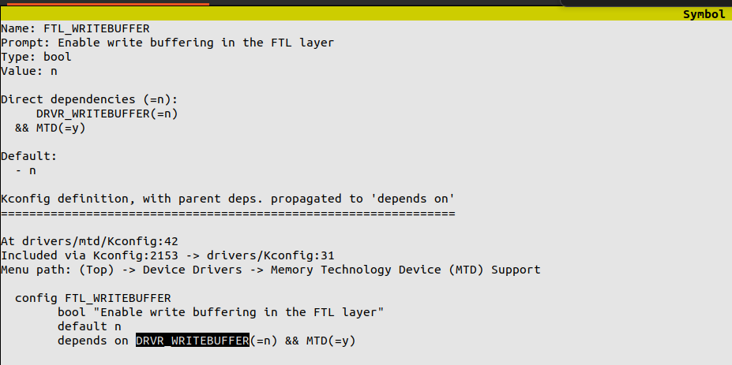
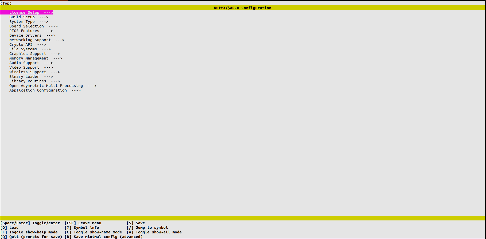
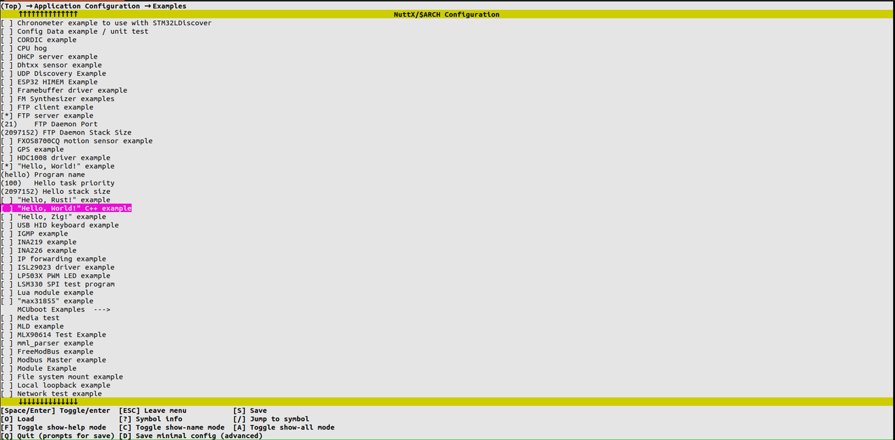

# Kconfig 使用指南

\[ [English](../../../en/device_dev_guide/build/Kconfig.md) | 简体中文 \]

## 一、概述

`Kconfig` 提供了一种支持编译时项目配置的机制，并包含多种类型的配置选项，例如整数、字符串和布尔值等。通过 `Kconfig` 文件，开发者可以定义选项之间的依赖关系、默认值及其组合方式等细节。有关 `Kconfig` 语言的具体信息，可以参考 [Kconfig 文档](https://www.kernel.org/doc/Documentation/kbuild/kconfig-language.txt)。

与大多数大型操作系统类似，openvela 使用 `Kconfig` 来管理项目配置。开发人员可以通过 `menuconfig` 提供的可视化界面进行配置操作，方便地构建和裁剪 openvela 系统。

## 二、使用示例

在项目配置中，如果需要设置某一配置项，可以通过以下步骤检查和设置：

1. 查看配置项状态。

    可以通过 `.config` 文件检查该配置是否已经设置，以及设置的值是否满足预期。如果满足预期，直接使用即可。否则，建议通过 `menuconfig` 工具进行设置。

    > **说明**：使用 `menuconfig` 工具能够保证所有配置的依赖关系完整且正确。

2. 示例：配置 KVDB 存储路径。

    以配置 `KVDB` 的数据库存储路径 `CONFIG_KVDB_PERSIST_PATH` 为例：

    - 默认情况下，配置项使用默认值，因此不会出现在 `defconfig` 文件中。
    - 在 `.config` 文件中可以看到其默认值为 `"/data/persist.db"`。如果您期望的值不同，可以通过 `menuconfig` 查找并设置对应的配置项。
        

3. 示例：打开 `FTL_WRITEBUFFER` 配置。 若需要打开 `FTL_WRITEBUFFER` 配置，请按照以下步骤操作：

    1. 在 `.config` 文件中确认该配置是否存在。如果配置不存在，建议使用 `menuconfig` 打开。不要直接在 `defconfig` 文件中强行添加 `CONFIG_FTL_WRITEBUFFER=y`，因为该配置项依赖其他配置。

        

    2. `CONFIG_FTL_WRITEBUFFER` 依赖于 `CONFIG_DRVR_WRITEBUFFER`，如果未同时启用 `CONFIG_DRVR_WRITEBUFFER`，即使手动修改 `defconfig`，配置也不会生效。

    3. 通过 `menuconfig`，会自动处理所有依赖项，并更新 `defconfig` 文件。更新后的配置如下：

        ```Plain
        CONFIG_FTL_WRITEBUFFER=y  
        CONFIG_DRVR_WRITEBUFFER=y  
        ```

## 三、各文件作用

openvela 在首次启动编译时，通过指定的 `arch` 和 `board` 参数找到对应项目的 `defconfig` 作为系统的初始配置，并基于此文件拓展与组合，最终生成完整配置文件 `.config`。生成的 `.config` 文件会被复制为 `config.h`，以支持代码中的条件编译和运行时使用。

### 1、各文件详细说明

1. `defconfig`

    - 系统配置的最小集合，用于指定默认的基本配置项。系统根据此文件和配置项之间的依赖关系生成完整的 `.config` 配置文件。
    - `defconfig` 文件中所有配置项都会按字母顺序排列。推荐通过 `menuconfig` 工具添加或删除配置项。直接修改 `defconfig` 文件可能会导致冗余配置或顺序不一致的问题。
  
2. `.config`

    - `.config` 文件是基于 `defconfig` 文件生成的完整配置，包含所有扩展和组合后的配置项。
    - `menuconfig` 的操作会读取本地的 `.config` 文件，允许用户根据需求修改配置。工具在完成配置调整后会自动将 `.config` 中的更改同步回 `defconfig` 文件。

3. `config.h`

    - `config.h` 文件从 `.config` 文件生成，包含所有配置信息，用于支持代码的条件编译和运行时操作。

### 2、编译流程示例

以下是一个典型的编译配置流程图：


使用如下命令完成编译过程：

```Bash
./build.sh vendor/sim/boards/vela/config/vela menuconfig
./build.sh vendor/sim/boards/vela/config/vela -j8
```

### 3、文件路径示例

根据 openvela simulator 环境，各文件的典型路径如下：

- `defconfig` 文件路径：`vendor/sim/boards/vela/configs/vela/defconfig`
- `.config` 文件路径：`nuttx/.config`
- `config.h` 文件路径：`nuttx/include/config.h`

## 四、使用方式

以下是使用 openvela 过程中一些有用的配置和操作提示：

1. 禁用某个功能的 Kconfig 配置项。

    在禁用（disable）某个 Kconfig 配置项之前，需要确保它未被其他配置项通过 `select` 关键字选择。如果存在依赖关系，需要先解除依赖。

2. 打开可视化配置界面。

    使用 `menuconfig` 命令可打开可视化的配置界面，例如：

    ```Bash
    ./build.sh vendor/sim/boards/vela/configs/vela menuconfig
    ```

    

3. 快速搜索配置项。

    在 `menuconfig` 界面中，可以输入 `/` 键后跟配置关键字进行搜索。例如，搜索 `EXAMPLES_HELLO`：

    > **说明**：如果搜索结果中存在 `depends on`，需输入 `?` 继续搜索依赖的配置并将其使能（enable）。

    

4. 选择与导航配置项。

    通过方向键上下移动，并按下回车键选择对应的选项。

    

5. 查看配置详情。

    在选中某个配置项后，可以通过按 `Shift` + `?` 键查看该配置的详细说明和所在文件的位置。

    

6. 选择具体选项。

    依据配置提示，例如红框中的选项编号（如“1”），可以进一步进入子选项界面。

    

7. 修改配置项的值。

    在选中的配置项中，可以依据配置的类型输入值：

    - 整型（int）：需要输入具体的整数值。
    - 布尔型（bool）：通过按下 `y`（选择）或空格键来切换状态。

        

    - 字符串型：直接输入字符串作为配置值。

8. 保存或退出。

    - 按 `ESC` 键退出配置界面，并在提示保存时按 `y` 以保存修改。
    - 如果需要强制退出，可以通过 `Ctrl` + `C` 实现，但强制退出可能丢失未保存的更改。

## 五、相关文档

以下链接提供了更多关于 Kconfig 使用的详细信息：

- [Kernel Documentation - Kconfig Language](https://www.kernel.org/doc/html/latest/kbuild/kconfig-language.html)
