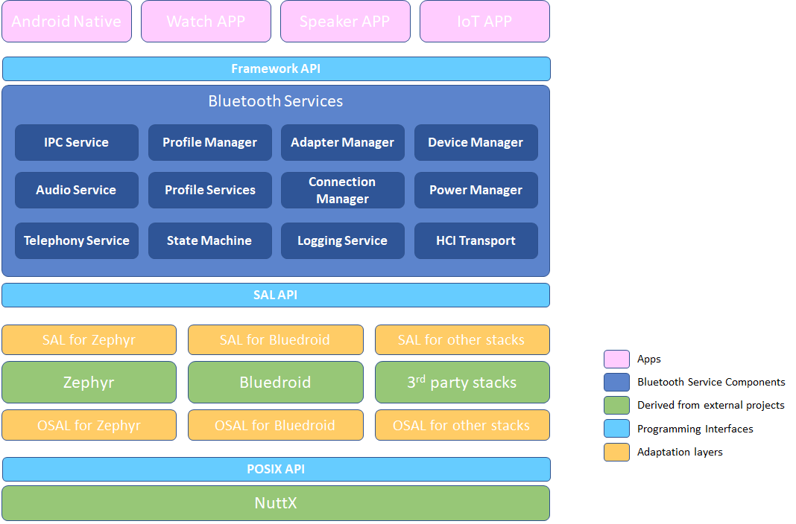
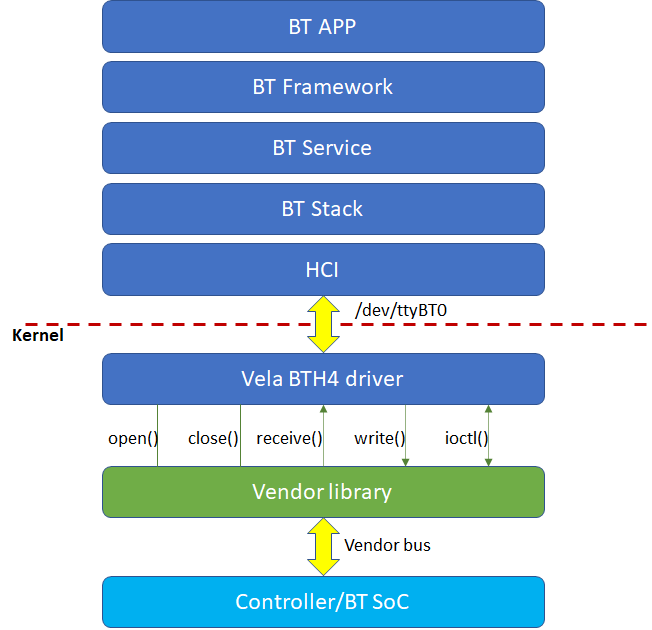

# 蓝牙概述

- [蓝牙概述](#蓝牙概述)
  - [简介](#简介)
  - [架构图](#架构图)
  - [代码目录](#代码目录)
- [开发指南](#开发指南)
  - [蓝牙应用开发](#蓝牙应用开发)
  - [蓝牙驱动开发](#蓝牙驱动开发)
    - [实现驱动](#实现驱动)
    - [注册驱动](#注册驱动)
    - [备注](#备注)

## 简介

openvela 蓝牙已经通过 Bluetooth 5.4 认证。目前支持的蓝牙能力包括：

- Core
  - BR/EDR/BLE
  - GAP
  - L2CAP
  - GATT Client/Server
- A2DP SRC/SNK
- AVRCP CT/TG
- HFP AG/HF
- PAN
- SPP
- HID
- HOGP
- LEA
  - TMAP
  - CAP
  - BAP/ASCS/PACS/BASS
  - CSIP/CSIS
  - MCP/MCS
  - CCP/TBS
  - VCP/VCS
- Mesh

openvela 蓝牙目前还能够支持多种开源、闭源协议栈，如Zephyr、Bluez、Bluedroid、Barrot等。

## 架构图



- openvela 蓝牙 Framework 为 `Android Native`、可穿戴、音箱和 IoT 等应用提供了统一的编程接口 API。
- 这些 API 提供的蓝牙能力包括开关、扫描、连接、配对等，均由一套完善的蓝牙服务组件来完成。
- 为了支持多种协议栈，蓝牙 Framework 定义了一套统一的协议栈适配层接口 `SAL API`，使各个三方协议栈，可以方便地接入 openvela。接入新的协议栈时，除了适配 `SAL API`，还需要针对 `NuttX` 的 `POSIX API` 来适配，从而使其可以更高效地运行在 `NuttX` 上。

## 代码目录

[frameworks_bluetooth](https://github.com/open-vela/frameworks_bluetooth) 仓库下载后，会映射到文件夹 frameworks/connectivity/bluetooth，其代码目录结构如下图所示：

```bash
├── Android.bp                     * Android 编译配置文件 *
├── CMakeLists.txt                 * CMake 编译配置文件 *
├── feature                        * 目录：快应用 Feature API *
│   ├── include
│   ├── jidl
│   └── src
├── framework                      * 目录：蓝牙Framework API *
│   ├── api
│   ├── binder
│   ├── common
│   ├── dbus
│   ├── include                    ** 蓝牙Framework API声明（可被APP引用） **
│   └── socket
├── frameworkBluetooth.go          * Android 编译 go 文件 *
├── img                            * README.md 使用到的图形文件 *
├── Kconfig                        * 编译配置描述文件 *
├── LICENSE                        * License 文件 *
├── Make.defs                      * 在NuttX中增加Bluetooth Framework *
├── Make.dep                       * 编译依赖关系 *
├── Makefile                       * 编译规则配置文件 *
├── Makefile.host                  * 编译规则配置文件 *
├── README.md                      * 仓库说明文档（英文） *
├── README_zh-cn.md                * 仓库说明文档（中文） *
├── service                        * 目录：蓝牙Services *
│   ├── common
│   ├── ipc
│   ├── profiles
│   ├── src
│   ├── stacks
│   ├── utils
│   ├── vendor
│   └── vhal
├── tests                          * 目录：测试Samples代码 *
└── tools                          * 目录：bttool工具代码 *
```

# 开发指南

## 蓝牙应用开发

对于第三方应用开发者，可以使用 openvela  快应用 QuickApp Feature ，它是基于 QuickJS 引擎使用 C++ 实现的一系列 API 接口，为三方应用提供系统访问能力，更多详情请参见[蓝牙接口](https://doc.quickapp.cn/features/system/bluetooth.html)。

另外，蓝牙 Framework 还提供了 NDK 接口来使用蓝牙系统的所有能力。可以参阅目录 framework/include 中的头文件获取更多信息。

## 蓝牙驱动开发

openvela 蓝牙支持多种驱动架构，下文将以目前常用的 BTH4 驱动架构为例，介绍如何实现并注册一个蓝牙驱动。

### 实现驱动

芯片厂商可以实现一个 **struct bt_driver_s** 结构体类型的变量，并为其初始化以下成员函数：

- CODE int (*open)(FAR struct bt_driver_s *btdev);
- CODE int (*send)(FAR struct bt_driver_s *btdev, enum bt_buf_type_e type, FAR void *data, size_t len);
- CODE int (*ioctl)(FAR struct bt_driver_s *btdev, int cmd, unsigned long arg);
- CODE void (*close)(FAR struct bt_driver_s *btdev);

这些成员函数的实现依赖于 HCI 的实际工作方式，也就是 Host 和 Controller 之间的物理总线。

### 注册驱动

实现上述结构体类型的变量后，需要通过 API **bt_driver_register**() 注册该驱动实例。

- int **bt_driver_register**(FAR struct bt_driver_s *drv);

类型定义可参考头文件 nuttx/include/nuttx/wireless/bluetooth/bt_driver.h。调用关系如下图所示：



### 备注

对于 receive() 成员函数，芯片厂商无需定义，BTH4 驱动会为其初始化。

- CODE int (*receive)(FAR struct bt_driver_s *btdev, enum bt_buf_type_e type, FAR void *data, size_t len);

当收到来自芯片的 HCI 数据时，只要调用 **bt_netdev_receive**()即可，它会调用这个 receive()函数来保存收到 HCI 数据。
