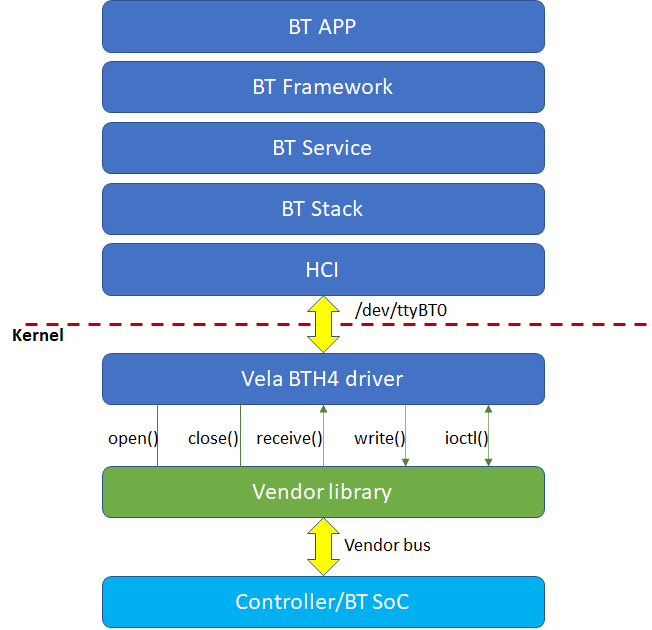

# 如何添加一个蓝牙驱动

## 一、实现驱动

### 概述

开发者或芯片厂商可以实现一个 `struct bt_driver_s` 类型的变量，并为其初始化以下成员函数：

- CODE int (*open)(FAR struct bt_driver_s *btdev);
- CODE int (*send)(FAR struct bt_driver_s *btdev, enum bt_buf_type_e type, FAR void *data, size_t len);
- CODE int (*ioctl)(FAR struct bt_driver_s *btdev, int cmd, unsigned long arg);
- CODE void (*close)(FAR struct bt_driver_s *btdev);

上述成员函数的实现依赖于 `HCI（Hardware Control Interface）` 的实际工作方式，也就是 `Host` 和 `Controller` 之间的物理总线。

### 示例

> **说明**
>
> - 为了便于在 QEMU 环境中快速验证自定义的成员函数与驱动注册功能，本示例将直接在 [drivers_initialize](https://github.com/open-vela/nuttx/blob/dev/drivers/drivers_initialize.c) 函数中实现 `struct bt_driver_s` 的成员函数，并完成驱动注册。
> - 但在实际接入或使用时，建议在 [vendor](https://github.com/open-vela/vendor_template/tree/dev/boards/chip_name/board_name/src) 目录下创建一个独立的文件进行代码编写，以便于维护和版本管理。

1. 在 [drivers_initialize.c](https://github.com/open-vela/nuttx/blob/dev/drivers/drivers_initialize.c) 文件中添加 [bt_driver.h](https://github.com/open-vela/nuttx/blob/dev/include/nuttx/wireless/bluetooth/bt_driver.h) 头文件引用：

    ```C
    #include <nuttx/wireless/bluetooth/bt_driver.h> /* 添加bt_driver.h头文件引用 */
    ```

2. 在 [drivers_initialize.c](https://github.com/open-vela/nuttx/blob/dev/drivers/drivers_initialize.c) 文件中完成成员函数的实现编写。

    > **说明**
    >
    > 在 openvela 中，`struct bt_driver_s` 的 `receive` 成员函数已经在 [uart_bth4.c](https://github.com/open-vela/nuttx/blob/dev/drivers/serial/uart_bth4.c) 文件中提供了默认实现。因此，开发者或厂商无需重新定义或实现此方法。

    ```C
    /* 以下为示例实现，仅做示范。
    * 在实际项目中，你可以在这些函数中添加真正的业务逻辑。
    */

    /* 1. 打开 HCI 传输 */
    static int sample_open(struct bt_driver_s *btdev)
    {
    printf("sample_open called.\n");
    /* 你可以在这里做一些初始化操作 */
    return 0;
    }

    /* 2. 发送数据到 HCI */
    static int sample_send(struct bt_driver_s *btdev,
                        enum bt_buf_type_e type,
                        void *data, size_t len)
    {
    printf("sample_send called. type=%d, data=%p, len=%zu\n",
            type, data, len);
    /* 这里可以实现将数据发送到底层的逻辑 */
    return 0;
    }

    /* 3. 关闭 HCI 传输 */
    static void sample_close(struct bt_driver_s *btdev)
    {
    printf("sample_close called.\n");
    /* 在此进行资源释放或其他关闭操作 */
    }

    /* 4. receive成员函数在驱动注册时由openvela指定 */
    ```

3. 在 [drivers_initialize.c](https://github.com/open-vela/nuttx/blob/dev/drivers/drivers_initialize.c) 文件中，完成 `struct bt_driver_s` 结构体的定义。

   以下代码展示了一个完整的 `struct bt_driver_s` 结构体初始化示例，其中函数指针被赋值为上面定义的示例函数：

   ```C
    /* 初始化一个 bt_driver_s 实例，并将函数指针赋值为上面定义的示例函数 */
    struct bt_driver_s sample_driver =
    {
        .head_reserve = 1,   /* 设置头部预留大小，默认为 1 */
        .open         = sample_open,     /* 指向示例中的 sample_open 函数 */
        .send         = sample_send,     /* 指向示例中的 sample_send 函数 */
        .close        = sample_close,    /* 指向示例中的 sample_close 函数 */
        /* 注意：厂商及开发者请不要自行赋值 .receive 成员函数 */
    };
    ```

## 二、注册驱动

### 概述

实现上述结构体类型的变量后，需要通过如下 API 注册该驱动实例，使用其中一个 API 即可。

- `bt_driver_register()`
- `bt_driver_register_with_id(FAR struct bt_driver_s *driver, int id)`

int bt_driver_register(FAR struct bt_driver_s *drv);

类型定义可参考头文件 [bt_driver.h](https://github.com/open-vela/nuttx/blob/dev/include/nuttx/wireless/bluetooth/bt_driver.h)。调用关系如下图所示：



> **说明**
>
> 对于 receive() 成员函数，厂商或开发者无需定义，BTH4 驱动会为其初始化。

### 示例

完成上述实现驱动示例代码编写后，需要在 [drivers_initialize.c](https://github.com/open-vela/nuttx/blob/dev/drivers/drivers_initialize.c) 文件内的 `drivers_initialize()` 函数末尾，调用驱动注册 API 完成驱动的注册操作：

```C
void drivers_initialize(void)
{
  drivers_trace_begin();

  /* Register devices */
  syslog_initialize();

  /* 中间所有代码请保持一致，不要改动它们 */

  /* 默认情况下，bt_driver_register(&sample_driver) 会注册 /dev/ttyHCI0 设备节点 */
  /* 由于 /dev/ttyHCI0 已被 openvelaQEMU 注册，所以我们使用以下 API 注册其他设备节点 */

  /* 使用 bt_driver_register_with_id(&sample_driver, 2) 注册 /dev/ttyHCI2 节点 */
  bt_driver_register_with_id(&sample_driver, 2);

  drivers_trace_end();
}
```

### 验证

1. 完成注册代码编写后，在终端输入如下命令开始编译代码：

    ```Bash
    ./build.sh vendor/openvela/boards/vela/configs/goldfish-armeabi-v7a-ap -j8
    ```

2. 编译结束后，在终端输入如下命令运行程序：

   ```Bash
   ./emulator.sh vela -no-window -qemu
   ```

3. 查看编写的驱动示例是否成功注册到了 openvela 中，执行如下命令：

   ```Bash
   ls /dev
   ```

    效果如下图所示：

    ```C
    openvela-ap> ls /dev
    /dev:
    audio/
    binder
    charge/
    console
    fb0
    goldfish_pipe
    input0
    kbd0
    log
    null
    ptmx
    ram0
    random
    rtc0
    telnet
    ttyGNSS0
    ttyHCI2    /* 可以看到，ttyHCI2设备节点成功注册 */
    ttyS1
    ttyV0
    uorb/
    urandom
    usensor
    virtblk0
    virtblk1
    zero
    ```

4. 验证驱动成员函数，执行如下命令：

    > **说明**
    >
    > 由于蓝牙驱动所注册文件节点对应的 `file_operations write` 函数，会校验数据是否符合 BTH4 格式，检验成功后，才会再> 将数据传入实现的 `sample_send` 函数。

    ```C
    openvela-ap> echo "Hello openvelabluetooth" > /dev/ttyHCI2
    /* echo指令会将数据发送到设备节点的send函数中 */


    sample_open called.  /* 终端打印open成员函数实现对应log */
    sample_close called. /* 终端打印close成员函数实现对应log */
    ```
