<!-- omit in toc -->
# 蓝牙问题定位指南

\[ [English](../../../../en/device_dev_guide/connection/bluetooth/how_to_analyze_bluetooth_issues.md) | 简体中文 \]

- [适配和启动问题](#适配和启动问题)
  - [分析方法](#分析方法)
    - [一、观察蓝牙驱动是否注册成功](#一观察蓝牙驱动是否注册成功)
      - [1 观察设备节点是否存在](#1-观察设备节点是否存在)
      - [2 观察Vendor驱动注册成功](#2-观察vendor驱动注册成功)
    - [二、检查蓝牙服务是否启动](#二检查蓝牙服务是否启动)
      - [1 确认是否启动bluetoothd](#1-确认是否启动bluetoothd)
      - [2 检查各阶段初始化是否成功](#2-检查各阶段初始化是否成功)
      - [3 检查bluetoothd进程是否运行](#3-检查bluetoothd进程是否运行)
    - [三、检查蓝牙 Enable 是否成功](#三检查蓝牙-enable-是否成功)
      - [1 观察蓝牙驱动节点是否打开成功](#1-观察蓝牙驱动节点是否打开成功)
      - [2 观察Enbale流程是否成功](#2-观察enbale流程是否成功)
  - [典型问题](#典型问题)
    - [一、创建蓝牙 instance 失败](#一创建蓝牙-instance-失败)
- [蓝牙配对问题](#蓝牙配对问题)
  - [分析方法](#分析方法-1)
    - [一、观察是否对方设备未打开可连接模式](#一观察是否对方设备未打开可连接模式)
      - [1 通过第三方设备观察是否连接成功](#1-通过第三方设备观察是否连接成功)
      - [2 通过airlog观察是否Page成功](#2-通过airlog观察是否page成功)
      - [3 通过协议栈syslog观察是否Page成功](#3-通过协议栈syslog观察是否page成功)
      - [4 通过HCI log可观察是否Page成功](#4-通过hci-log可观察是否page成功)
    - [二、观察是否ACL连接超时断开（Connection Timeout）](#二观察是否acl连接超时断开connection-timeout)
      - [1 通过蓝牙服务log可观察是否超时断开](#1-通过蓝牙服务log可观察是否超时断开)
      - [2 观察空口log，是否超时断开ACL连接](#2-观察空口log是否超时断开acl连接)
      - [3 观察snoop log，是否超时断开](#3-观察snoop-log是否超时断开)
    - [三、观察是否已经绑定成功，但是未有Profile连接，ACL主动断开](#三观察是否已经绑定成功但是未有profile连接acl主动断开)
      - [1 观察蓝牙服务log，是否有Profile连接](#1-观察蓝牙服务log是否有profile连接)
      - [2 观察HCI log，是否有Profile连接](#2-观察hci-log是否有profile连接)
      - [3 观察空口log，是否有Profile连接](#3-观察空口log是否有profile连接)
    - [四、观察是否本地配对信息无效（Linkey Missing）](#四观察是否本地配对信息无效linkey-missing)
      - [1 观察HCI log，手表本地配对信息无效，手机保存上次配对信息](#1-观察hci-log手表本地配对信息无效手机保存上次配对信息)
      - [2 观察空口log，手表本地配对信息无效，手机保存上次配对信息](#2-观察空口log手表本地配对信息无效手机保存上次配对信息)
      - [3 观察协议栈log，手表本地配对信息无效，手机保存上次配对信息](#3-观察协议栈log手表本地配对信息无效手机保存上次配对信息)
    - [五、观察是否对方配对信息无效（Linkey Missing）](#五观察是否对方配对信息无效linkey-missing)
      - [1 观察HCI log，手机配对信息无效，本地配对信息有效](#1-观察hci-log手机配对信息无效本地配对信息有效)
      - [2 观察空口log，手机配对信息无效，本地配对信息有效](#2-观察空口log手机配对信息无效本地配对信息有效)
    - [六、观察本地是否打开可连接模式](#六观察本地是否打开可连接模式)
      - [1 观察手表进入蓝牙耳机可连接模式](#1-观察手表进入蓝牙耳机可连接模式)
      - [2 观察miwear syslog，手表进入可连接模式](#2-观察miwear-syslog手表进入可连接模式)
      - [3 观察snoop log、 airlog等，手表进入可连接模式](#3-观察snoop-log-airlog等手表进入可连接模式)
    - [七、观察对方是否发起回连操作](#七观察对方是否发起回连操作)
      - [1 观察蓝牙服务syslog，耳机端发起回连操作](#1-观察蓝牙服务syslog耳机端发起回连操作)
      - [2 观察snoop log，耳机端发起回连操作](#2-观察snoop-log耳机端发起回连操作)
      - [3 观察空口log，耳机端发起回连操作](#3-观察空口log耳机端发起回连操作)
    - [八、观察本地是否收到ACL连接请求](#八观察本地是否收到acl连接请求)
      - [1 观察syslog，本端蓝牙应用是否接收到ACL连接请求](#1-观察syslog本端蓝牙应用是否接收到acl连接请求)
    - [九、观察本端是否同意ACL连接请求](#九观察本端是否同意acl连接请求)
      - [1 观察蓝牙服务syslog，本端蓝牙应用是否同意ACL连接请求](#1-观察蓝牙服务syslog本端蓝牙应用是否同意acl连接请求)
      - [2 观察对端设备snoop log，确认本端是否同意ACL连接请求](#2-观察对端设备snoop-log确认本端是否同意acl连接请求)
    - [十、观察是否成功开启扫描](#十观察是否成功开启扫描)
      - [1 观察蓝牙syslog，看设备是否成功开启扫描](#1-观察蓝牙syslog看设备是否成功开启扫描)
      - [2 观察HCI log，看HCI CMD是否发送成功，HCI EVT是否返回status是否正常](#2-观察hci-log看hci-cmd是否发送成功hci-evt是否返回status是否正常)
    - [十一、确认对端设备存在对应SPP服务](#十一确认对端设备存在对应spp服务)
      - [1 观察对端设备snoop log，确认对端设备是否存在对应的SPP服务](#1-观察对端设备snoop-log确认对端设备是否存在对应的spp服务)
    - [十二、确认SPP连接状态与断连发起方](#十二确认spp连接状态与断连发起方)
      - [1 观察syslog，确认断连发起方](#1-观察syslog确认断连发起方)
      - [2 观察snoop log，确认断连发起方](#2-观察snoop-log确认断连发起方)
      - [3 观察air log，确认断连发起方](#3-观察air-log确认断连发起方)
  - [典型问题](#典型问题-1)
    - [一、经典蓝牙设备主动绑定对方设备失败](#一经典蓝牙设备主动绑定对方设备失败)
    - [二、耳机断开后回连手表失败](#二耳机断开后回连手表失败)
    - [三、经典蓝牙设备未被对端设备成功连接](#三经典蓝牙设备未被对端设备成功连接)
    - [四、低功耗蓝牙扫描不到对端设备](#四低功耗蓝牙扫描不到对端设备)
    - [五、SPP主动连接失败](#五spp主动连接失败)
    - [六、CTKD BLE LTK 生成 BR LinkKey 失败](#六ctkd-ble-ltk-生成-br-linkkey-失败)
      - [1 打开协议栈 Debug 功能](#1-打开协议栈-debug-功能)
      - [2 复现问题](#2-复现问题)
      - [3 日志解读](#3-日志解读)
      - [4 如何确认当前 LinkKey 是否由 CTKD 生成？](#4-如何确认当前-linkkey-是否由-ctkd-生成)
    - [七、设备通过 RPA 地址广播未建立连接](#七设备通过-rpa-地址广播未建立连接)
      - [1 BLE 配对状态机与流程图](#1-ble-配对状态机与流程图)
      - [2 设备通过 RPA 地址广播建立连接过程](#2-设备通过-rpa-地址广播建立连接过程)
      - [3 确认 BLE 配对完成](#3-确认-ble-配对完成)
      - [4 确认 IRK 交换成功](#4-确认-irk-交换成功)
      - [5 确认通过 Identity 地址建立 BR/EDR 连接](#5-确认通过-identity-地址建立-bredr-连接)
      - [6 断连/重启后回连情况](#6-断连重启后回连情况)
      - [7 设备使用 Public 地址未连接成功](#7-设备使用-public-地址未连接成功)
- [音频传输问题](#音频传输问题)
  - [分析方法](#分析方法-2)
    - [一、观察蓝牙和Media之间的transport是否正确建立](#一观察蓝牙和media之间的transport是否正确建立)
    - [二、观察是否建立了AVDTP signaling连接](#二观察是否建立了avdtp-signaling连接)
      - [1 通过snoop log观察是否建立了AVDTP signaling连接，以及观察可能的失败原因](#1-通过snoop-log观察是否建立了avdtp-signaling连接以及观察可能的失败原因)
    - [三、观察是否建立了AVDTP media连接](#三观察是否建立了avdtp-media连接)
      - [1 通过snoop log观察是否建立了AVDTP media连接，以及观察可能的失败原因](#1-通过snoop-log观察是否建立了avdtp-media连接以及观察可能的失败原因)
        - [1.1 AVDTP Discovery](#11-avdtp-discovery)
        - [1.2 AVDTP Get Capabilities](#12-avdtp-get-capabilities)
        - [1.3 AVDTP Set Configuration](#13-avdtp-set-configuration)
        - [1.4 AVDTP Stream Establishment](#14-avdtp-stream-establishment)
        - [1.5 AVDTP media连接成功](#15-avdtp-media连接成功)
      - [2 通过syslog观察是否建立了AVDTP media连接，以及观察可能的失败原因](#2-通过syslog观察是否建立了avdtp-media连接以及观察可能的失败原因)
    - [四、观察Media是否成功设置了codec](#四观察media是否成功设置了codec)
    - [五、观察A2DP SRC是否开始播放音乐](#五观察a2dp-src是否开始播放音乐)
      - [1 通过syslog观察A2DP SRC是否开始播放音乐](#1-通过syslog观察a2dp-src是否开始播放音乐)
      - [2 通过air log观察A2DP SRC是否开始播放音乐](#2-通过air-log观察a2dp-src是否开始播放音乐)
    - [六、观察A2DP SRC是否停止音频流传输](#六观察a2dp-src是否停止音频流传输)
      - [1 通过syslog观察A2DP SRC是否停止音频流传输](#1-通过syslog观察a2dp-src是否停止音频流传输)
      - [2 通过snoop log观察A2DP SRC是否停止传输音频包](#2-通过snoop-log观察a2dp-src是否停止传输音频包)
    - [七、观察AVDTP signaling连接是否断开](#七观察avdtp-signaling连接是否断开)
      - [1 通过syslog观察是否断开了AVDTP signaling连接](#1-通过syslog观察是否断开了avdtp-signaling连接)
      - [2 通过snoop log观察是否断开了AVDTP signaling连接，以及观察可能的失败原因](#2-通过snoop-log观察是否断开了avdtp-signaling连接以及观察可能的失败原因)
    - [八、观察音频包序列号是否连续](#八观察音频包序列号是否连续)
    - [九、观察air log中1秒内发送的音频数据样本点数量](#九观察air-log中1秒内发送的音频数据样本点数量)
    - [十、观察air log中音频数据是否存在重传](#十观察air-log中音频数据是否存在重传)
    - [十一、观察syslog判段A2DP-SNK音乐卡顿原因](#十一观察syslog判段a2dp-snk音乐卡顿原因)
      - [1 观察A2DP-SNK音乐卡顿是否可能由基带芯片引起](#1-观察a2dp-snk音乐卡顿是否可能由基带芯片引起)
      - [2 观察A2DP-SNK音乐卡顿是否可能由mips不足引起](#2-观察a2dp-snk音乐卡顿是否可能由mips不足引起)
      - [3 观察A2DP-SNK音乐卡顿是否可能由Bluetooth service](#3-观察a2dp-snk音乐卡顿是否可能由bluetooth-service)
      - [4 观察A2DP-SNK音乐卡顿是否可能由Media service](#4-观察a2dp-snk音乐卡顿是否可能由media-service)
    - [十二、观察A2DP-SNK卡顿是否来源于基带芯片](#十二观察a2dp-snk卡顿是否来源于基带芯片)
      - [1 通过snoop log观察卡顿是否来源于基带芯片](#1-通过snoop-log观察卡顿是否来源于基带芯片)
      - [2 通过syslog观察卡顿是否来源于基带芯片](#2-通过syslog观察卡顿是否来源于基带芯片)
    - [十三、观察A2DP-SNK卡顿是否来源于mips不足](#十三观察a2dp-snk卡顿是否来源于mips不足)
      - [1 通过ps命令观察cpu负载情况](#1-通过ps命令观察cpu负载情况)
      - [2 通过工具命令观察cpu负载情况](#2-通过工具命令观察cpu负载情况)
    - [十四、观察bluetoothd自身是否被阻塞](#十四观察bluetoothd自身是否被阻塞)
      - [1 通过debug log判断bluetoothd是否被阻塞](#1-通过debug-log判断bluetoothd是否被阻塞)
  - [典型问题](#典型问题-2)
    - [一、连接耳机播放音乐，耳机无声](#一连接耳机播放音乐耳机无声)
    - [二、连接耳机播放音频文件，音频文件开头缺失](#二连接耳机播放音频文件音频文件开头缺失)
    - [三、语音播报，结尾处有pop音](#三语音播报结尾处有pop音)
    - [四、连接两对耳机时，出现断连和无声的问题](#四连接两对耳机时出现断连和无声的问题)
    - [五、连接耳机播放音乐，耳机无声](#五连接耳机播放音乐耳机无声)
    - [六、连接耳机播放音频文件，音频文件开头缺失](#六连接耳机播放音频文件音频文件开头缺失)
    - [七、语音播报，结尾处有pop音](#七语音播报结尾处有pop音)
    - [八、连接手机播放音乐卡顿](#八连接手机播放音乐卡顿)
    - [九、连接手机播放音乐无声](#九连接手机播放音乐无声)
- [音乐播放控制问题](#音乐播放控制问题)
  - [分析方法](#分析方法-3)
    - [一、观察是否建立了AVRCP连接](#一观察是否建立了avrcp连接)
      - [1 通过syslog观察是否建立了AVRCP连接](#1-通过syslog观察是否建立了avrcp连接)
      - [2 通过snoop log观察是否建立了AVRCP连接，以及观察可能的失败原因](#2-通过snoop-log观察是否建立了avrcp连接以及观察可能的失败原因)
      - [3 通过air log观察是否建立了AVRCP连接，以及观察可能的失败原因](#3-通过air-log观察是否建立了avrcp连接以及观察可能的失败原因)
    - [二、观察设备是否支持AVRCP](#二观察设备是否支持avrcp)
      - [1 通过syslog观察本地设备是否打开了AVRCP服务](#1-通过syslog观察本地设备是否打开了avrcp服务)
      - [2 通过snoop log或air log观察双方设备是否支持AVRCP](#2-通过snoop-log或air-log观察双方设备是否支持avrcp)
    - [三、观察是否发送了播放、暂停请求](#三观察是否发送了播放暂停请求)
      - [1 通过syslog观察是否发送了播放、暂停请求](#1-通过syslog观察是否发送了播放暂停请求)
      - [2 通过snoop log或air log观察是否发送了播放、暂停请求](#2-通过snoop-log或air-log观察是否发送了播放暂停请求)
    - [四、观察是否注册了Notification](#四观察是否注册了notification)
      - [1 通过syslog观察是否注册了Notification](#1-通过syslog观察是否注册了notification)
      - [2 通过snoop log或air log观察是否注册了Notification](#2-通过snoop-log或air-log观察是否注册了notification)
    - [五、观察是否正确反馈播放状态](#五观察是否正确反馈播放状态)
      - [1 通过syslog观察是否正确反馈播放状态](#1-通过syslog观察是否正确反馈播放状态)
      - [2 通过snoop log或air log观察是否注册了Notification](#2-通过snoop-log或air-log观察是否注册了notification-1)
    - [六、观察播放状态变化是否由蓝牙引起](#六观察播放状态变化是否由蓝牙引起)
    - [七、观察是否使用了绝对音量](#七观察是否使用了绝对音量)
      - [1 通过syslog观察是否支持绝对音量](#1-通过syslog观察是否支持绝对音量)
      - [2 通过snoop log观察是否支持绝对音量](#2-通过snoop-log观察是否支持绝对音量)
    - [八、观察音乐源设备（手机）是否设置了绝对音量](#八观察音乐源设备手机是否设置了绝对音量)
      - [1 通过snoop log或air log观察手机是否设置了绝对音量](#1-通过snoop-log或air-log观察手机是否设置了绝对音量)
    - [九、观察本地设备是否设置了绝对音量](#九观察本地设备是否设置了绝对音量)
      - [1 通过syslog观察本地设备是否设置了绝对音量](#1-通过syslog观察本地设备是否设置了绝对音量)
    - [十、观察音乐源设备（手机）是否改变了音频幅值](#十观察音乐源设备手机是否改变了音频幅值)
      - [1 通过音频源文件观察音乐源设备（手机）是否改变了音频幅值](#1-通过音频源文件观察音乐源设备手机是否改变了音频幅值)
      - [2 通过air log观察音乐源设备（手机）是否改变了音频幅值](#2-通过air-log观察音乐源设备手机是否改变了音频幅值)
    - [十一、观察是否打开了AVRCP配置](#十一观察是否打开了avrcp配置)
    - [十二、观察音量变化是否由蓝牙引起](#十二观察音量变化是否由蓝牙引起)
    - [十三、观察音量变化由AVRCP或是HFP控制](#十三观察音量变化由avrcp或是hfp控制)
      - [1 通过snoop log观察音量变化由AVRCP或是HFP控制](#1-通过snoop-log观察音量变化由avrcp或是hfp控制)
  - [典型问题](#典型问题-3)
    - [一、不能控制播放、暂停](#一不能控制播放暂停)
    - [二、不能受控播放、暂停](#二不能受控播放暂停)
    - [三、意外的播放、暂停](#三意外的播放暂停)
    - [四、不能受音乐源设备（手机）控制调节音量](#四不能受音乐源设备手机控制调节音量)
    - [五、音量异常变化](#五音量异常变化)
- [通话问题](#通话问题)
  - [分析方法](#分析方法-4)
    - [一、观察是否建立了HFP连接](#一观察是否建立了hfp连接)
      - [1 通过syslog观察是否建立了HFP连接](#1-通过syslog观察是否建立了hfp连接)
      - [2 通过snoop log观察是否建立了HFP连接，以及观察可能的失败原因](#2-通过snoop-log观察是否建立了hfp连接以及观察可能的失败原因)
    - [二、观察设备是否支持HFP](#二观察设备是否支持hfp)
      - [1 通过syslog观察设备是否支持HFP](#1-通过syslog观察设备是否支持hfp)
      - [2 通过snoop log或air log观察双方设备是否支持HFP](#2-通过snoop-log或air-log观察双方设备是否支持hfp)
    - [三、观察是否建立了SCO连接](#三观察是否建立了sco连接)
      - [1 通过syslog观察是否建立了SCO连接](#1-通过syslog观察是否建立了sco连接)
    - [四、观察是否向Media设置了SCO音频参数](#四观察是否向media设置了sco音频参数)
    - [五、观察HF是否向AG发送了Answer请求](#五观察hf是否向ag发送了answer请求)
      - [1 通过syslog观察HF是否向AG发送了Answer请求](#1-通过syslog观察hf是否向ag发送了answer请求)
      - [2 通过snoop log观察HF是否向AG发送了Answer请求](#2-通过snoop-log观察hf是否向ag发送了answer请求)
    - [六、观察AG是否向HF发送了来电信息](#六观察ag是否向hf发送了来电信息)
      - [1 通过syslog观察AG是否向HF发送了来电信息](#1-通过syslog观察ag是否向hf发送了来电信息)
    - [七、观察HF端是否通知了应用AG端有来电](#七观察hf端是否通知了应用ag端有来电)
      - [1 通过syslog观察HF端是否通知了应用AG端有来电](#1-通过syslog观察hf端是否通知了应用ag端有来电)
  - [典型问题](#典型问题-4)
    - [一、AG端接通电话，HF端通话无声](#一ag端接通电话hf端通话无声)
    - [二、HF端接通电话，HF端无声](#二hf端接通电话hf端无声)
    - [三、作为AG端，不能受HF端控制接听电话](#三作为ag端不能受hf端控制接听电话)
    - [四、作为HF端，AG端来电，HF端无来电显示](#四作为hf端ag端来电hf端无来电显示)
- [数据传输问题](#数据传输问题)
  - [分析方法](#分析方法-5)
    - [一、分析GATT理论吞吐](#一分析gatt理论吞吐)
    - [二、bttool测试GATT吞吐](#二bttool测试gatt吞吐)
    - [三、检查是否打开DLE功能](#三检查是否打开dle功能)
      - [1 通过HCI log检查是否支持DLE](#1-通过hci-log检查是否支持dle)
      - [2 通过Air log检查是否支持DLE](#2-通过air-log检查是否支持dle)
    - [四、观察client设备是否发起过Exchange\_MTU规程](#四观察client设备是否发起过exchange_mtu规程)
      - [1 通过syslog观察client设备是否发起过Exchange\_MTU规程](#1-通过syslog观察client设备是否发起过exchange_mtu规程)
      - [2 通过snoop log观察client设备是否发起过Exchange\_MTU规程](#2-通过snoop-log观察client设备是否发起过exchange_mtu规程)
    - [五、分析每个连接间隔的最大Event数量](#五分析每个连接间隔的最大event数量)
    - [六、观察当前空口环境是否复杂](#六观察当前空口环境是否复杂)
      - [1 通过snoop log观察当前空口环境是否复杂](#1-通过snoop-log观察当前空口环境是否复杂)
    - [七、使用GATT OVER BR数据传输模式](#七使用gatt-over-br数据传输模式)
    - [八、使用LE COC数据传输模式](#八使用le-coc数据传输模式)
  - [典型问题](#典型问题-5)
    - [一、GATT数据传输吞吐不达标](#一gatt数据传输吞吐不达标)
- [控制拍照问题](#控制拍照问题)
  - [分析方法](#分析方法-6)
    - [一、观察HID通道连接是否成功](#一观察hid通道连接是否成功)
      - [1. 通过syslog观察HID通道连接是否成功](#1-通过syslog观察hid通道连接是否成功)
      - [2. 通过Airlog或者Snoop log观察HID Control L2CAP Channel是否连接成功](#2-通过airlog或者snoop-log观察hid-control-l2cap-channel是否连接成功)
      - [3. 通过Airlog或者Snoop log观察HID Interrupt L2CAP Channel是否连接成功](#3-通过airlog或者snoop-log观察hid-interrupt-l2cap-channel是否连接成功)
    - [二、观察HID通道手表还是手机断开HID通道](#二观察hid通道手表还是手机断开hid通道)
      - [1. 通过通过Airlog或者Snoop log观察是否对方断开HID Control或者Interrupt L2CAP Channel](#1-通过通过airlog或者snoop-log观察是否对方断开hid-control或者interrupt-l2cap-channel)
    - [三、手机蓝牙设备绑定数量是否超过7个](#三手机蓝牙设备绑定数量是否超过7个)
  - [典型问题](#典型问题-6)
    - [一、手表无法控制手机拍照](#一手表无法控制手机拍照)
- [功耗问题](#功耗问题)
  - [分析方法](#分析方法-7)
    - [一、观察是否进入Sniff模式](#一观察是否进入sniff模式)
      - [1 通过蓝牙service log观察设备进入Sniff模式](#1-通过蓝牙service-log观察设备进入sniff模式)
      - [2 通过协议栈syslog观察设备进入Sniff模式](#2-通过协议栈syslog观察设备进入sniff模式)
      - [3 通过snoop log观察设备进入Sniff模式](#3-通过snoop-log观察设备进入sniff模式)
      - [4 通过空口log观察设备进入Sniff](#4-通过空口log观察设备进入sniff)
    - [二、观察是否退出Sniff模式](#二观察是否退出sniff模式)
      - [1 通过蓝牙service log观察设备退出Sniff模式](#1-通过蓝牙service-log观察设备退出sniff模式)
      - [2 通过协议栈syslog观察设备退出Sniff模式](#2-通过协议栈syslog观察设备退出sniff模式)
      - [3 通过snoop log观察设备退出Sniff模式](#3-通过snoop-log观察设备退出sniff模式)
      - [4 通过空口log观察设备退出Sniff](#4-通过空口log观察设备退出sniff)
    - [三、查找当前Profile工作状态的Sniff允许参数](#三查找当前profile工作状态的sniff允许参数)
    - [四、对方优先请求进入Sniff优先级高于本地](#四对方优先请求进入sniff优先级高于本地)
    - [五、对方优先请求退出Sniff优先级低于本地](#五对方优先请求退出sniff优先级低于本地)
  - [典型问题](#典型问题-7)
    - [一、设备经典蓝牙连接设备功耗异常](#一设备经典蓝牙连接设备功耗异常)


# 适配和启动问题

<a id="蓝牙启动问题分析方法"></a>

## 分析方法

<a id="方法：观察蓝牙驱动是否注册成功"></a>
### 一、观察蓝牙驱动是否注册成功

Vela 支持丰富的设备驱动类型，包括 BTH4，BTH5，BT Bridge 等驱动协议，此外还支持片内蓝牙驱动，以及片外蓝牙驱动，可参考 Vela 蓝牙驱动文档。

#### 1 观察设备节点是否存在

通过`ls /dev/`命令，观察是否存在`ttyHCI0`设备节点，正常输出信息如下：

```text
openvela-ap> ls /dev
/dev:
 audio/
 binder
 ......
 ttyHCI0
 ......
 uorb/
 ......
```

#### 2 观察Vendor驱动注册成功

可在 Vendor 主动注册函数添加 debug log，观察 Vendor 驱动是否注册成功。

<a id="方法：检查蓝牙服务是否启动"></a>

### 二、检查蓝牙服务是否启动

当前Vela蓝牙服务支持两种运行模式：在应用程序进程中，也支持运行在后台。可依据使用场景来配置。若运行在后台模式运行，可通过如下步骤观察蓝牙服务是否存在。

如下蓝牙bluetootd初始log，包括蓝牙log初始过程，Profile初始化过程，蓝牙驱动初始化过程，以及libuv loop初始化等过程。

```text
[    0.054300] [11] [  INFO] [ap] bluetoothd main 34
[    0.074000] [11] [  INFO] [ap] /data/misc/bt folder create: 0
[    0.084300] [11] [ ALERT] [ap] Framework log level: 7, Stack:0, mask:00000000, Snoop: 0
[    0.084800] [11] [ DEBUG] [ap] [195][storage]: bt_storage_init successed
[    0.085100] [11] [ DEBUG] [ap] [129][service_manager]: A2DP-Sink service register success
[    0.085300] [11] [ DEBUG] [ap] [129][service_manager]: AVRCP-CT service register success
[    0.085800] [11] [ DEBUG] [ap] [201][adapter-stm]: Enter, PrevState=(null) ---> NewState=Off
[    0.087400] [11] [  INFO] [ap] [32][stack_manager]: Stack Info: Zblue Ver:5.4 Sal:2
[    0.088100] [11] [  INFO] [ap] <inf> [h4_init] <406>: Bluetooth H4 driver
[    0.088600] [11] [ DEBUG] [ap] [45][stack_manager]: stack_manager_init done
[    0.088700] [11] [ DEBUG] [ap] [257][bt_service]: bt_service_init done
[    0.089100] [11] [ DEBUG] [ap] [260][service_loop]: service loop running now !!!
[    0.089300] [11] [ DEBUG] [ap] [134][service_loop]: service_schedule_loop:0x40288958, async:0x4024d1b4
[    0.090100] [11] [ DEBUG] [ap] [81][service_loop]: set_ready
```

#### 1 确认是否启动bluetoothd
若是通过启动脚本启动bluetoothd服务，请确rcS启动脚本是否配置：

```text
bluetoothd &
```

#### 2 检查各阶段初始化是否成功

按照如上初始化log，可观察到如下初始化过程：

* 检查bt_storage_init是否成功
  
    ```text
    [    0.084800] [11] [ DEBUG] [ap] [195][storage]: bt_storage_init successed
    ```

    若是失败，则检查uv db配置是否打开，请查阅系统相关文档或者联系系统团队解决。

* 检查蓝牙目录是否创建成功

    ```text
    [    0.074000] [11] [  INFO] [ap] /data/misc/bt folder create: 0
    ```

    若是失败，则检查目录是否存在，请查阅系统相关文档或者联系系统团队解决。

* 检查协议栈是否初始化成功

    ```text
        [    0.088600] [11] [ DEBUG] [ap] [45][stack_manager]: stack_manager_init done
    ```

    若是失败，则可能协议栈初始化失败，可联系Vela团队解决。

* 检查libuv loop是否启动成功

    ```text
    [    0.089300] [11] [ DEBUG] [ap] [134][service_loop]: service_schedule_loop:0x40288958, async:0x4024d1b4
    ```

    若是失败，则检查libuv loop是否启动成功，btservice模块开源，可在btservice添加debug信息，可进一步确认。

#### 3 检查bluetoothd进程是否运行

利用`ps`命令，观察蓝牙服务线程是否存在，正常输出信息可以观察到名为`bluetoothd`的线程。

```text
  PID GROUP PRI POLICY   TYPE    NPX STATE    EVENT     SIGMASK             STACK    USED FILLED COMMAND
    0     0   0 FIFO     Kthread   - Ready              0000000000000000  0001968 0000824  41.8%  Idle_Task
    1     0 192 RR       Kthread   - Waiting  Semaphore 0000000000000000  0003968 0000480  12.0%  hpwork 0x4020f954 0x4020f978
    2     0 100 RR       Kthread   - Waiting  Semaphore 0000000000000000  0003968 0000752  18.9%  lpwork 0x4020f91c 0x4020f940
    4     0 100 RR       Kthread   - Ready              0000000000000000  0003968 0000496  12.5%  goldfish_gpu_fb_thread 0x4024c930
    5     0 100 RR       Kthread   - Waiting  Semaphore 0000000000000000  0003968 0000864  21.7%  goldfish_gnss_thread 0x406d4b30
    6     0 100 RR       Kthread   - Waiting  Semaphore 0000000000000000  0003968 0000904  22.7%  goldfish_sensor_thread 0x402e20a0
    7     7 100 RR       Task      - Running            0000000000000000  0003992 0002048  51.3%  nsh_main
    9     9 100 RR       Task      - Waiting  Semaphore 0000000000000000  0004000 0003096  77.4%  kvdbd
   10    10 100 RR       Task      - Waiting  Semaphore 0000000000000000  0004000 0002192  54.8%  adbd
   11    11 103 RR       Task      - Waiting  Semaphore 0000000000000000  0008088 0003340  41.2%  bluetoothd
   12    12 100 RR       Task      - Waiting  Semaphore 0000000000020000  0004000 0001232  30.8%  telnetd
   13    11 110 FIFO     pthread   - Waiting  Semaphore 0000000000000000  0004016 0000600  14.9%  sysworkq 0x71ffa5 0x40700350
```

<a id="方法：检查蓝牙Enable是否成功"></a>

### 三、检查蓝牙 Enable 是否成功

蓝牙Enable包括蓝牙设备驱动打开，蓝牙各Profile初始化，蓝牙绑定信息恢复等过程。可通过如下步骤观察蓝牙Enable是否成功：

#### 1 观察蓝牙驱动节点是否打开成功

```c
int bt_sal_hci_transport_init(const bt_vhal_interface* vhal)
{
    g_hci_rxlen = 0;
    g_vhal = vhal;
    g_tlfd = open(CONFIG_BLUETOOTH_SERVICE_HCI_UART_NAME, O_RDWR | O_BINARY | O_CLOEXEC);
    BT_LOGI("%s: g_tlfd = %d", __func__, g_tlfd);

    if (g_vhal) {
        g_vhal->open(g_tlfd);
    }

    return g_tlfd;
}
```

驱动设备节点打开成功log，如下：

```text
[72][h4]: bt_sal_hci_transport_init: g_tlfd = 16
```
若 fd = -1，蓝牙驱动打开失败， 确认[蓝牙驱动是否注册成功](#一观察蓝牙驱动是否注册成功)，则进一步排查CONFIG_BLUETOOTH_SERVICE_HCI_UART_NAME配置是否正确。

#### 2 观察Enbale流程是否成功

蓝牙启动状态机，可观察到蓝牙Enable过程，如下：

```text
[ap] on_adapter_state_changed_cb: state = 1. ...
[ap] on_adapter_state_changed_cb: state = 2...
```

| 状态值 | 释义                 |
| ------ | -------------------- |
| `0`    | 蓝牙关闭             |
| `1`    | 正在启用 BLE 功能    |
| `2`    | BLE 功能已启用       |
| `3`    | 正在启用 BR/EDR 功能 |
| `4`    | BR/EDR 功能已启用    |
| `5`    | 正在关闭 BR/EDR 功能 |
| `6`    | 正在关闭 BLE 功能    |


<a id="适配启动典型问题"></a>

## 典型问题

### 一、创建蓝牙 instance 失败

当应用程序调用bluetooth_create_instance接口时，蓝牙instance创建失败，如下：

```text
[03-10 20:23:11.549][03/09 17:29:15] [15] [cp] [270][BT]: [VelaBT], bt_log_server_init 270
[03-10 20:23:15.852][03/09 17:29:19] [19] [cp] [BT] bts_adapter_init: create bt instance failed
[03-10 20:23:17.027][03/09 17:29:20] [15] [cp] [278][BT]: [VelaBT], bt_log_server_init 278
```

蓝牙启动过程包括：设备驱动注册、蓝牙驱动初始化、蓝牙Profile初始化、蓝牙驱动打开、蓝牙Enable等过程。

第一步，按照[观察蓝牙驱动是否注册成功](#一观察蓝牙驱动是否注册成功)，检查蓝牙驱动是否注册成功。

第二步，按照[检查蓝牙服务是否启动](#二检查蓝牙服务是否启动)，检查蓝牙服务是否启动成功。

第三步，检查蓝牙instance是否创建成功。当bluetoothd进程启动阶段，蓝牙instance创建失败，则需要应用程序重试。保证蓝牙服务启动成功后，再创建蓝牙instance。

```c
int bt_socket_client_init(bt_instance_t* ins, int family,
    const char* name, const char* cpu, int port)
{
    uv_poll_t* poll;
    int retry = CLIENT_MAX_RETRY; // 10

    ......
        do {
        ins->peer_fd = bt_socket_client_connect(family, name, cpu, port);
        if (ins->peer_fd <= 0 && !retry) {
            /* connect fail, go out */
            bt_socket_client_deinit(ins);
            return BT_STATUS_PARM_INVALID;
        } else if (ins->peer_fd <= 0) {
            /* connect fail, retry after sleep 100ms */
            usleep(CLIENT_DELAY_MS(retry) * 1000);
            continue;
        } else {
            /* success, goto next step */
            break;
        }
    } while (retry--);
    ......
}
```

第四步，按照[方法：检查蓝牙Enable是否成功](#三检查蓝牙-enable-是否成功)，检查蓝牙使能是否成功。

# 蓝牙配对问题

本节介绍 BLE 发现、连接、配对绑定过程中可能遇到的问题分析方法。

<a id="发现连接配对分析方法"></a>

## 分析方法

<a id="方法：观察是否对方设备未打开可连接模式"></a>

### 一、观察是否对方设备未打开可连接模式
通常，可以通过第三方设备、airlog协议流程、协议栈syslog流程、snoop log等方式，观察对方设备是否打开可连接模式。

#### 1 通过第三方设备观察是否连接成功
使用第三个设备，在蓝牙设置界面主动发起绑定过程，观察能否和对方设备绑定成功，排除对方设备未打开可连接模式

#### 2 通过airlog观察是否Page成功
观察空口log，检查是否对方不响应Page过程的ID包，其中，spec标准流程如下:


依据spec流程链路层page ID包发出去后，对方设备是否回复ID。如下空口log看Page过程的ID包，对方未响应，因此对方未打开可连接模式。


#### 3 通过协议栈syslog观察是否Page成功
观察协议栈syslog，检查若是出现PageTimeout，对应错误码04。

```text
[08/09 19:26:38.620200] [28] [ap] ---->[HCI][CMDN][P:1,$:1][-Create_Connection][status:PAGE TIMEOUT | 04]
[08/09 19:26:38.621300] [28] [ap]      [Connection_Complete][T:0x200ed280]
[08/09 19:26:38.622400] [28] [ap] GAP_IND_CONNECTION_EVENT: <addr: 28:02:2e:82:b9:22.0><type: 2><status: 0><error: 4>
```

#### 4 通过HCI log可观察是否Page成功
如下，观察HCI log看Create Connection对应的HCI Connection Complete事件为Page timeout，则表示对方未打开可连接模式。


<a id="方法观察是否ACL连接超时断开"></a>

### 二、观察是否ACL连接超时断开（Connection Timeout）

通常，可以通过蓝牙服务log、airlog协议流程、协议栈syslog流程、snoop log等方式，观察对方设备是否异常超时断开连接。

#### 1 通过蓝牙服务log可观察是否超时断开
如下，可通过btservice的log事件CONNECTION_STATE_DISCONNECTED，08错误表示连接超时断开错误码。

```text
[2024-12-31 20:04:31] [06/04 03:10:58.173500] [26] [ap] [660][adapter-svc]: ACL connection state changed, addr:28:02:2E:82:B9:22, link:0, state:CONNECTION_STATE_DISCONNECTED, status:0, reason:8
```

#### 2 观察空口log，是否超时断开ACL连接

如下，可以通过空口log看，连接数据包在retry多次，直到最终超时断开。


#### 3 观察snoop log，是否超时断开
如下，观察snoop log蓝牙断开连接事件HCI Disconnect Complete事件，对应reason为connection timeout。


<a id="方法观察是否已经绑定成功，但是未有Profile连接，ACL主动断开"></a>

### 三、观察是否已经绑定成功，但是未有Profile连接，ACL主动断开

通常，可以通过蓝牙服务log、airlog协议流程、协议栈syslog流程、snoop log等方式，观察双方是否有Profile连接，导致连接断开。

#### 1 观察蓝牙服务log，是否有Profile连接
观察本地btservice log，设备绑定成功后，没有A2DP、SPP等Profile连接，ACL连接成功一段事件后，出现ACL连接断开事件
如下，从btservice log看acl建立连接成功，SDP完成后，未连接其他Profile连接，最终断开错误码reason:19，表示对方主动断开。

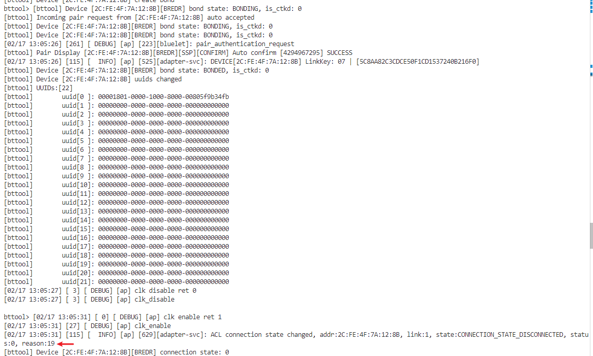

#### 2 观察HCI log，是否有Profile连接
如下，从HCI log看ACL连接成功，设备绑定完成后，SDP服务发现完成，未连接其他Profile，最终设备断开Remote User Terminated Connection（图上是对方主动断开，也很有可能本地协议栈主动断开）。


#### 3 观察空口log，是否有Profile连接
如下，从空口log看ACL连接成功，设备绑定完成后，SDP服务发现完成，未连接其他Profile，最终设备Detach断开（图上是对方主动断开，也很有可能本地协议栈主动断开）。

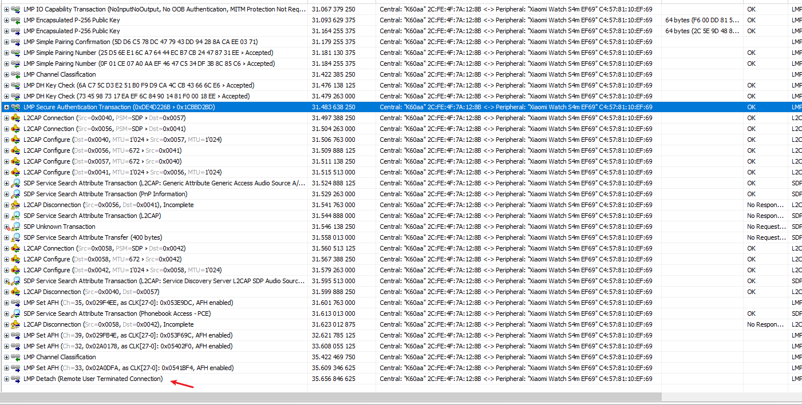

<a id="方法观察是否本地配对信息无效"></a>

### 四、观察是否本地配对信息无效（Linkey Missing）

#### 1 观察HCI log，手表本地配对信息无效，手机保存上次配对信息
如下，HCI log看本地linkkey未空，发起配对时Host端回复Negative Reply，然后重启发起配对，最终在Simple Pairing Complete阶段提示Authentication Fail，断开连接。


#### 2 观察空口log，手表本地配对信息无效，手机保存上次配对信息
如下，从空口log看，手表本地配对信息无效，手机保存上次配对信息,提示DH Key Check失败。


#### 3 观察协议栈log，手表本地配对信息无效，手机保存上次配对信息
如下，观察协议栈log，手表本地配对信息无效，手机保存上次配对信息,从协议栈的HCI log Authentication_Complete时收到PIN OR KEY MISSING，最终配对失败。

```text
[ 1103.523193] [13] [cp]    ->[L2CAP,PSM:3][Out][Request:][RequestNum:0]
[ 1103.526428] [13] [cp] ---->[HCISEC][Go][Link_Bondable][Link_Bonded][Node_Encrypt]
[ 1103.526916] [13] [cp]    ->[Link:P256,LinkKey,Bonded,Bondable[key_type:Unauthenticated Combination Key generated from P256 | 07]
[ 1103.527282] [13] [cp]    ->[SSP_Enable][SC_Enable][SSP:OK][LinkKey_Good]
[ 1103.527526] [13] [cp]    ->[Local_Bondable:General]
[ 1103.528625] [13] [cp] ---->[HCI][CMDN][P:0,$:2][+Authentication_Requested]
[ 1103.532348] [13] [cp] ---->[HCI][*Send][AID:0,PLen:2][Authentication_Requested]
[ 1103.532653] [13] [cp]    ->[connection_handle:0129 | 81,00]
[ 1103.537719] [13] [cp] 
------>FSM Func Start<------
[ 1103.538024] [13] [cp] ---->[HCI][*Recv][AID:0,PLen:4][Command_Status]
[ 1103.538269] [13] [cp]    ->[status:OK | 00]
[ 1103.538574] [13] [cp]    ->[num_hci_command_packets:05 | 05]
[ 1103.538818] [13] [cp]    ->[command_opcode:Authentication_Requested]
[ 1103.542419] [13] [cp] 
------>FSM Func Start<------
[ 1103.542785] [13] [cp] ---->[HCI][*Recv][AID:0,PLen:6][Link_Key_Request]
[ 1103.543029] [13] [cp]    ->[bd:3c,13,5a,d5,a3,f6]
[ 1103.544311] [13] [cp] ---->[HCI][CMDN][P:1,$:2][+Link_Key_Request_Reply]
[ 1103.550903] [13] [cp] ---->[HCI][*Send][AID:0,PLen:22][Link_Key_Request_Reply]
[ 1103.551330] [13] [cp]    ->[bd:3c,13,5a,d5,a3,f6]
[ 1103.551635] [13] [cp]    ->[link_key:22,04,a4,2b,af,19,c3,ac,bc,02,f5,63,19,46,59,8d]
[ 1103.557250] [13] [cp] 
------>FSM Func Start<------
[ 1103.557617] [13] [cp] ---->[HCI][*Recv][AID:0,PLen:10][Command_Complete]
[ 1103.557861] [13] [cp]    ->[num_hci_command_packets:05 | 05]
[ 1103.558166] [13] [cp]    ->[command_opcode:Link_Key_Request_Reply]
[ 1103.558410] [13] [cp]    ->[status:OK | 00]
[ 1103.558654] [13] [cp]    ->[bd:3c,13,5a,d5,a3,f6]
[ 1103.560180] [13] [cp] ---->[HCI][CMDN][P:2,$:2][-Link_Key_Request_Reply][status:OK | 00]
[ 1103.560607] [13] [cp]    ->[COMMAND_COMPLETE][T:0x205658c0]
[ 1103.579223] [13] [cp] 
------>FSM Func Start<------
[ 1103.579528] [13] [cp] ---->[HCI][*Recv][AID:0,PLen:3][Authentication_Complete]
[ 1103.579833] [13] [cp]    ->[status:PIN OR KEY MISSING | 06]
[ 1103.580078] [13] [cp]    ->[connection_handle:0129 | 81,00]
[ 1103.581848] [13] [cp] ---->[HCI][CMDN][P:1,$:2][-Authentication_Requested][status:PIN OR KEY MISSING | 06]
[ 1103.582275] [13] [cp]    ->[Authentication_Complete][T:0x205680e0]
[ 1103.583557] [13] [cp] ---->[HCISEC][ResultEv][Failed:0x6][Ev:Authenticate]
------>FSM Func Start<------
[ 1104.618957] [13] [cp] ---->[HCI][Link][ACL][IdleExpire]
[ 1104.619201] [13] [cp]    ->[Local:[Identity:82,77,16,b2,4e,7b,Pub]]
[ 1104.619506] [13] [cp]    ->[Remote:[BREDR][Identity:3c,13,5a,d5,a3,f6,Pub][LELink:3c,13,5a,d5,a3,f6,Pub]]
[ 1104.619934] [13] [cp]    ->[HDL:0x81][Sending:0][Recv:N:0][Initiator][Connection_Completed][Master][Ref:0][READY_OK][LinkMode:Active]
[ 1104.621215] [13] [cp] ---->[HCI][CMDN][P:0,$:2][+Disconnect]
[ 1104.625915] [13] [cp] ---->[HCI][*Send][AID:0,PLen:3][Disconnect]
[ 1104.626281] [13] [cp]    ->[connection_handle:0129 | 81,00]
[ 1104.626586] [13] [cp]    ->[reason:REMOTE USER TERMINATED CONNECTION | 13]
```

<a id="方法观察是否对方配对信息无效"></a>

### 五、观察是否对方配对信息无效（Linkey Missing）

#### 1 观察HCI log，手机配对信息无效，本地配对信息有效
如下，snoop  log看本地发起绑定过程，上报hci Authentication completed事件，对应的原因是PIN Or Key Missing。


#### 2 观察空口log，手机配对信息无效，本地配对信息有效
如下, air log看本地发起绑定，在LMP Authentication过程，提示LMP Not Accepted，原因是PIN Or Key Missing。

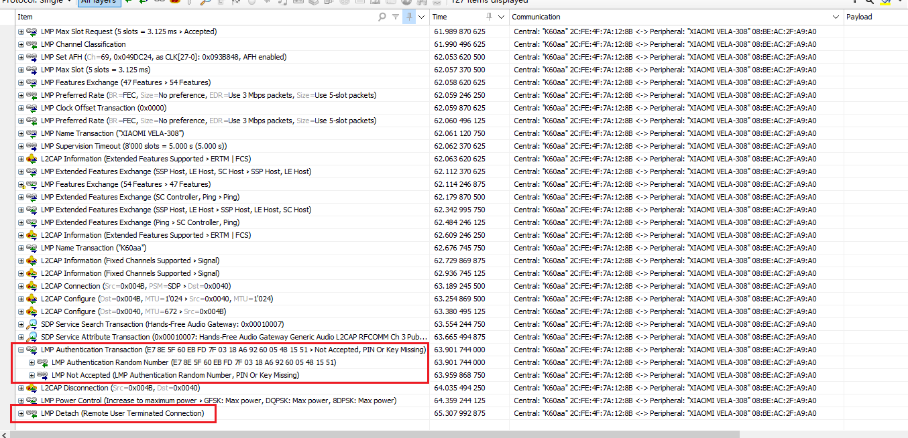

<a id="观察本地是否打开可连接模式"></a>

### 六、观察本地是否打开可连接模式

#### 1 观察手表进入蓝牙耳机可连接模式
如下，进入蓝牙耳机搜索连接页面，让手表进入可连接模式。

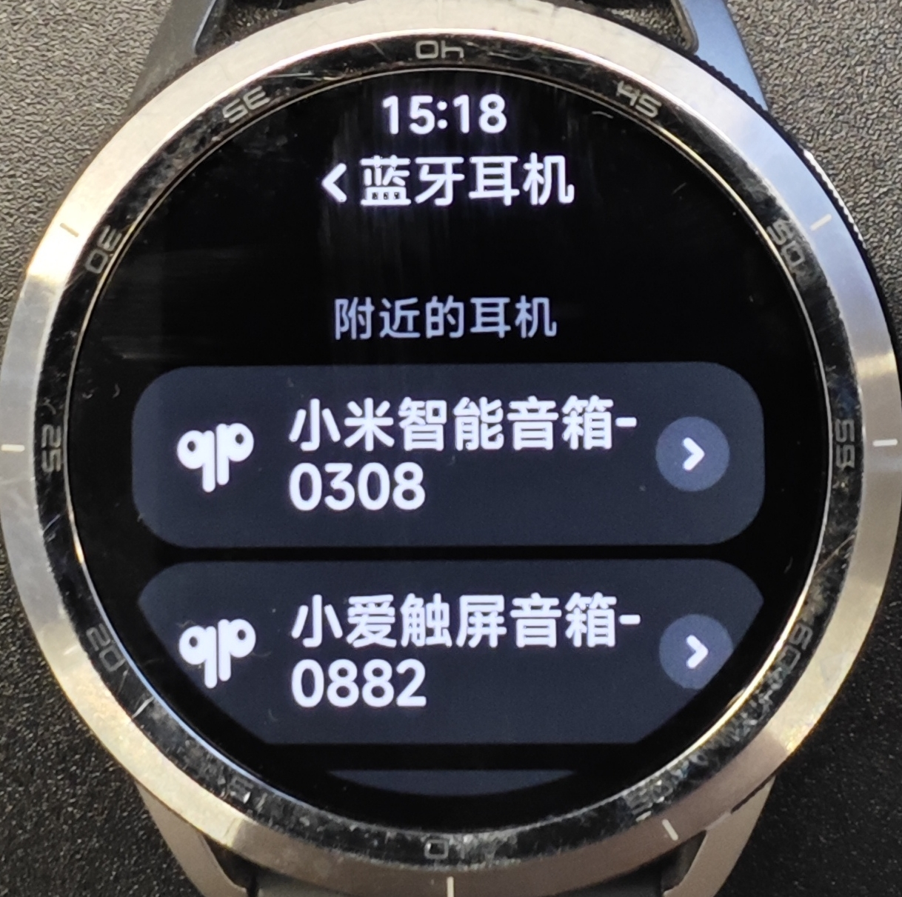


#### 2 观察miwear syslog，手表进入可连接模式
如下，观察miwear syslog，确认手表scan mode会进入CONNECTABLE模式。

```text
[42] [ap] [bt] bind_manager_set_visibility: scan mode: [CONNECTABLE DISCOVERABLE]
```

#### 3 观察snoop log、 airlog等，手表进入可连接模式

通过，如上[观察是否对方设备未打开可连接模式](#方法观察是否对方设备未打开可连接模式)，确认手表scan mode会进入CONNECTABLE模式。

<a id="方法观察对方是否发起回连操作"></a>

### 七、观察对方是否发起回连操作

#### 1 观察蓝牙服务syslog，耳机端发起回连操作

如下，通过蓝牙服务syslog，观察对方是否发起回连接请求。

```text
[27] [ap] [723][adapter-svc]: ACL connection state changed, addr:XX:XX:XX:XX:2E:43, link:1, state:CONNECTION_STATE_CONNECTING, status:0, reason:0
[27] [ap] [723][adapter-svc]: ACL connection state changed, addr:XX:XX:XX:XX:2E:43, link:1, state:CONNECTION_STATE_CONNECTING, status:0, reason:0
[27] [ap] [688][adapter-svc]: ACL Connect Request from :XX:XX:XX:XX:2E:43
```

#### 2 观察snoop log，耳机端发起回连操作

如下，snoop log看耳机端发起回连操作，最终连接成功。


#### 3 观察空口log，耳机端发起回连操作
如下，空口log看手机发起回连操作，最终连接成功。


<a id="方法观察本地是否收到ACL连接请求"></a>

### 八、观察本地是否收到ACL连接请求

#### 1 观察syslog，本端蓝牙应用是否接收到ACL连接请求

蓝牙服务与蓝牙应用均能够接收到ACL连接请求，log如下。

```text
[15] [cp] [723][adapter-svc]: ACL connection state changed, addr:XX:XX:XX:XX:2E:43, link:1, state:CONNECTION_STATE_CONNECTING, status:0, reason:0
[15] [cp] [688][adapter-svc]: ACL Connect Request from :XX:XX:XX:XX:2E:43
[19] [cp] [BT] gap_connection_state_changed_callback: --->Device [XX:XX:XX:XX:2E:43][BREDR] State: CONNECTING
```

当应用无法收到ACL连接请求时，无法做出ACL连接回复，可以观察到如下ACL连接失败的log，输出Error Code 16，即Connection Accept Timeout Exceeded。

```text
[19] [cp] [109][bluelet]: sal_status_translate maybe hcierror code: 16
[14] [cp] [723][adapter-svc]: ACL connection state changed, addr:A4:E2:87:D7:2E:18, link:1, state:CONNECTION_STATE_DISCONNECTED, status:47, reason:0
```

<a id="方法观察本地是否同意ACL连接请求"></a>

### 九、观察本端是否同意ACL连接请求

#### 1 观察蓝牙服务syslog，本端蓝牙应用是否同意ACL连接请求

如果应用未能同意ACL连接请求，可以观察到如下ACL连接失败的log如下，输出ACL status 55，表示本端拒绝了ACL连接请求。

```text
[15] [cp] [723][adapter-svc]: ACL connection state changed, addr:XX:XX:XX:XX:2E:43, link:1, state:CONNECTION_STATE_CONNECTING, status:0, reason:0
[15] [cp] [688][adapter-svc]: ACL Connect Request from :XX:XX:XX:XX:2E:43
......
[15] [cp] [723][adapter-svc]: ACL connection state changed, addr:XX:XX:XX:XX:2E:43, link:1, state:CONNECTION_STATE_DISCONNECTED, status:55, reason:0
```

#### 2 观察对端设备snoop log，确认本端是否同意ACL连接请求

可以看到如下log，ACL连接被拒绝，显示Connection Rejected Due To Limited Resources。


<a id="观察是否成功开启扫描"></a>

### 十、观察是否成功开启扫描

#### 1 观察蓝牙syslog，看设备是否成功开启扫描

status为0表示成功开启扫描，status为1表示关闭扫描。

```
bttool> [bttool] on_scan_start_status_cb, scanner:0xdf7943b0, status:0
[   24.055800] [20] [ DEBUG] [446][scanner]: scan_on_state_changed, state:0
```

#### 2 观察HCI log，看HCI CMD是否发送成功，HCI EVT是否返回status是否正常

如下，HCI log看设备成功发起扫描，最终返回status正常。


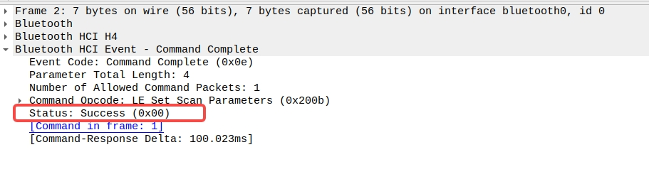

<a id="方法：确认对端设备存在对应SPP服务"></a>

### 十一、确认对端设备存在对应SPP服务

#### 1 观察对端设备snoop log，确认对端设备是否存在对应的SPP服务

spp client发起spp连接，需要获取到对端设备的spp服务信息。可以通过对端设备的snoop log确认是否存在想要的SPP服务。

查询特定服务失败snoop log如下：


<a id="方法：确认SPP连接状态与断连发起方"></a>

### 十二、确认SPP连接状态与断连发起方

#### 1 观察syslog，确认断连发起方

主动断开SPP连接与被动断开SPP连接会呈现不同的SPP连接状态转换log。

主动断开SPP连接,连接状态会从已连接（2）跳转到断连中（3）后，再跳转到断连（4）状态，典型log如下：

```text
[15] [cp] [732][spp]: spp_on_connection_state_chaneged, addr: XX:XX:XX:XX:2E:43, scn: 5, port: 0, state: 1
[15] [cp] [732][spp]: spp_on_connection_state_chaneged, addr: XX:XX:XX:XX:2E:43, scn: 5, port: 0, state: 2
......
[15] [cp] [732][spp]: spp_on_connection_state_chaneged, addr: XX:XX:XX:XX:2E:43, scn: 5, port: 0, state: 3
......
[15] [cp] [732][spp]: spp_on_connection_state_chaneged, addr: XX:XX:XX:XX:2E:43, scn: 5, port: 0, state: 0
```

被动断开SPP连接，连接状态会从已连接（2）直接跳转到断连（0）状态，典型log如下：

```text
[15] [cp] [732][spp]: spp_on_connection_state_chaneged, addr: XX:XX:XX:XX:2E:43, scn: 5, port: 0, state: 1
[15] [cp] [732][spp]: spp_on_connection_state_chaneged, addr: XX:XX:XX:XX:2E:43, scn: 5, port: 0, state: 2
......
[15] [cp] [732][spp]: spp_on_connection_state_chaneged, addr: XX:XX:XX:XX:2E:43, scn: 5, port: 0, state: 0
```

#### 2 观察snoop log，确认断连发起方

#### 3 观察air log，确认断连发起方

<a id="发现连接配对典型问题"></a>

## 典型问题

<a id="问题-经典蓝牙设备主动绑定对方设备失败"></a>

### 一、经典蓝牙设备主动绑定对方设备失败

设备绑定包括设备连接流程、绑定配对流程、协议连接过程。可通过如下方法，进一步定位原因。

第一步检查设备ACL连接状态，确认是否建立成功。若是连接失败，可通过如下手动辅助定位，否则，进入第二步骤检查设备配对状态。
* [观察是否对方设备未打开可连接模式](#方法观察是否对方设备未打开可连接模式)
  * 若是对方设备未打开可连接模式，建议观察手机端未打开可连接模式原因。
  * 否则，建议按照如下步骤进一步分析。

* [观察是否ACL连接超时断开(Connection Timeout)](#方法观察是否ACL连接超时断开)
  * 若是在通信距离有效方位内，出现链路层连接超时，请补充空口log及HCI log，一般需要芯片厂商进一步确认蓝牙Controller行为。
  * 否则，建议按照如下步骤进一步分析。

第二步检查设备配对状态，确认是否配对成功。若是配对失败，可通过如下手段辅助定位，否则，进入第三步骤检查Profile连接状态。
* [观察是否本地配对信息无效(Linkey Missing)](#方法观察是否本地配对信息无效)
  * 若本地Linkey无效或者丢失（离线取消配对），对方绑定信息有效，手表主动发起配对可能失败，符合预期。
  * 否则，建议按照如下步骤进一步分析。

* [观察是否对方配对信息无效(Linkey Missing)](#方法观察是否对方配对信息无效)
  * 若对方Linkey无效或者丢失（离线取消配对），本地绑定信息有效，手表主动发起配对可能失败，符合预期。
  * 否则，建议上传蓝牙服务log、协议栈log、空口log和手机snoop log，再进一步分析。

第三步检查Profile连接状态，确认是否连接成功。若没有Profile连接，可通过如下手段辅助定位，否则，可能蓝牙协议栈问题，建议保存蓝牙服务log、协议栈log、空口log和手机snoop log完整log，联系Vela蓝牙开发工程师求助。
* [观察是否已经绑定成功，但是未有Profile连接，ACL主动断开](#方法观察是否已经绑定成功，但是未有Profile连接，ACL主动断开)
  * 若ACL连接成功后，未连接A2DP、HID等Profile，设备会断开，符合预期。
  * 否则，建议按照如下步骤进一步分析。


<a id="问题-耳机断开后回连手表失败"></a>

### 二、耳机断开后回连手表失败

耳机回连手表行为，是由耳机端发起，同时需要手表打开可发现连接模式。可通过下面方法，进一步定位原因。

* [观察本地是否打开可连接模式](#方法观察本地是否打开可连接模式)
  * 若是手表设备未打开可连接模式，建议手表停留在耳机连接设置页面，保证手表进入可发现连接模式。
  * 否则，建议按照如下步骤进一步分析。
  
* [观察对方是否发起回连操作](#方法观察对方是否发起回连操作)
  * 若耳机未主动发起回连请求， 则需要耳机端进一步分析。
  * 否则，建议上传蓝牙服务log、协议栈log、空口log和手机snoop log，手表端进一步分析。

<a id="问题-经典蓝牙设备未被对端设备成功连接"></a>

### 三、经典蓝牙设备未被对端设备成功连接

对端设备主动连接失败，可通过下面方法，进一步定位原因。

* [观察本地是否打开可连接模式](#方法观察本地是否打开可连接模式)
  * 若是设备未打开可连接模式，建议查看蓝牙应用设置的Scan Mode。
  * 否则，建议按照如下步骤进一步分析。

* [观察本地是否成功收到ACL连接请求](#方法观察是否本地是否收到ACL连接请求)
  * 若是蓝牙服务未输出连接请求信息，则需要确认蓝牙设备处于蓝牙通信范围。
  * 进一步地，可以抓取Air log确认射频以及链路问题，寻求Controller供应商支持。
  * 否则，建议按照如下步骤进一步分析。

* [观察本地是否同意ACL连接请求](#方法观察本地是否同意ACL连接请求)
  * 若是蓝牙应用未同意连接请求，请确认应用端拒绝连接行为逻辑是否符合预期。
  * 否则，建议上传蓝牙服务log、协议栈log，进一步分析。

### 四、低功耗蓝牙扫描不到对端设备

低功耗蓝牙的扫描过程，通常是由central设备开始扫描行为，接收对端发起的广播。可通过下面方法，进一步定位原因。

* [观察是否成功开启扫描](#观察是否成功开启扫描)
  * 若是成功开启，需要保证设置的扫描间隔和扫描窗口是否合适，并且确保此时没有音频业务或其他高吞吐业务占用带宽资源。
  * 否则，建议上传syslog、协议栈log和带广播设备广播包的snoop log进一步分析确认。

### 五、SPP主动连接失败

SPP主动连接失败问题，首先需要按照《发现、连接、配对问题》章节的分析方法，确认ACL连接是否正常建立。在确认ACL连接正常建立后，可以按照下面方法进一步分析。

* [确认对端设备存在对应SPP服务](#方法：确认对端设备存在对应SPP服务)
  * 若对端未注册对应的SPP服务，需要对对端设备进一步分析。
  * 否则，建议按照如下步骤进一步分析。

* [确认SPP连接状态与断连发起方](#方法：确认SPP连接状态与断连发起方)
  * 若是之前的SPP连接尚未断开，则需要确认SPP连接双方是否有发起断连操作。
  * 否则，建议上传蓝牙服务log、协议栈log、空口log和手机snoop log，进一步分析。

### 六、CTKD BLE LTK 生成 BR LinkKey 失败

 Vela CTKD 流程在 Host 端完成，抓取 OTA/HCI 日志可以确认 BLE 配对过程是否正常。CTKD 问题深入分析需配合 vela 协议栈日志进行。

#### 1 打开协议栈 Debug 功能

```c
log enable stack
logmask 1 2 7
```

具体的 mask 掩码定义，请参考《bttool 使用说明文档》-《log 子命令》。

若需打开除掩码 1 和 2 外其他的协议栈 debug 日志功能，请联系 vela 蓝牙开发人员开启对应宏配置并重新编译协议栈静态库。

#### 2 复现问题

按照具体场景进行问题复现，并记录相关日志。

#### 3 日志解读

* 在日志中全局搜索关键字 `SMP` 或 `CTKD`。
* 若日志显示 `CTKD LE2BR OFF [LESC disabled]`，意味着从 BLE 到 BR 方向的 CTKD 功能被关闭，原因是未启用 LESC 功能。
* 若日志显示 `[BR2LE OFF] [Disabled]`，表示 LinkKey 到 LTK 方向的 CTKD 功能被 APP 禁用。

- 在抓取的日志中全局搜索关键字 `SMP` 或 `CTKD`。
- 若日志显示 `CTKD LE2BR OFF [LESC disabled]`，意味着从 BLE 到 BR 方向的 CTKD 功能已被关闭，原因是未启用 LESC 功能；
- 若日志显示 `[BR2LE OFF] [Disabled]`，表示 LinkKey 到 LTK 方向的 CTKD 功能已被 APP 禁用。


#### 4 如何确认当前 LinkKey 是否由 CTKD 生成？

如下日志示例中，`state:2` 和 `ctkd:1` 表示设备已绑定，且使用 CTKD 生成了 LinkKey：

```
[ap] [bt] bind_manager_bond_state_change_handler: [D4:68:AA:16:xx:xx] state:2 ctkd:1
[ap] [bt] bind_manager_send_event: ----> State[START] Event[12:EVENT_BT_CTKD_BONDED_SUCCESS]
```

### 七、设备通过 RPA 地址广播未建立连接

通过抓取空口日志观察 BLE 配对流程是否符合预期。

#### 1 BLE 配对状态机与流程图

- BLE 配对状态机：


- BLE 配对流程图：


#### 2 设备通过 RPA 地址广播建立连接过程

- Ellisys 空口日志中过滤仅保留手表与 iPhone 手机的 RPA 地址：


- 手表通过 RPA 地址发送 Connectable 广播：

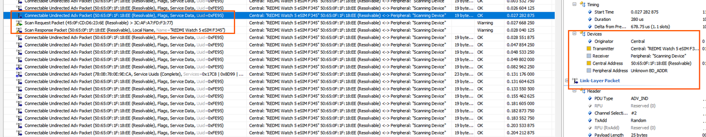

- iPhone 手机发送 Scan Request，手表回复 Scan Response 后，手机发送 Connection Indication Packet 完成连接：


#### 3 确认 BLE 配对完成

- SMP 配对过程顺利完成，双方均支持 LESC，IdKey 分发正常，LinkKey 标志为 1：


#### 4 确认 IRK 交换成功

- IRK 成功交换后，存入 Resolving List：

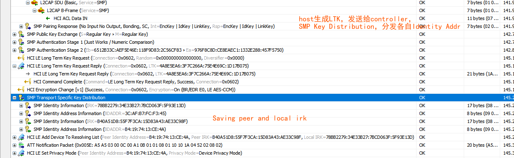

#### 5 确认通过 Identity 地址建立 BR/EDR 连接

- Controller 主动向 Host 请求 LinkKey，并校验通过，无需再次进行 BR/EDR 配对：

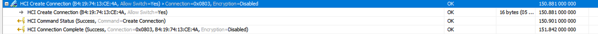

- 从空口日志进一步确认 LinkKey 校验成功：

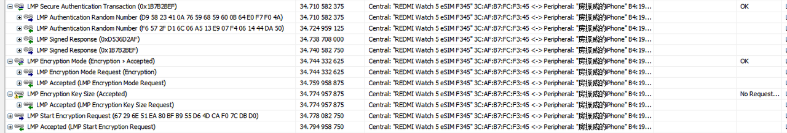

#### 6 断连/重启后回连情况

设备信息参考：

| 设备名称                | 地址                                        | 模式       | 描述               |
| ----------------------- | ------------------------------------------- | ---------- | ------------------ |
| REDMI Watch 5 eSIM F345 | 46:E3:3F:E2:8D:2E (Resolvable)              | Low Energy | REDMI Watch 5 eSIM |
| REDMI Watch 5 eSIM F345 | 3C:AF:B7:FC:F3:45                           | Dual Mode  | REDMI Watch 5 eSIM |
| xxx的 iPhone            | B4:19:74:13:CE:4A                           | Dual Mode  | xxx的 iPhone       |
| xxx的 iPhone            | 6B:FC:EE:54:F0- [适配启动](#适配和启动问题) |

设备重启后，Resolving List 需要更新到 Controller，重新建立连接：


正常断连回连情况：


#### 7 设备使用 Public 地址未连接成功

使用 Public 地址配对时，不生成或分发 IRK，无 IdKey 位：


BR/EDR LinkKey 正常生成：

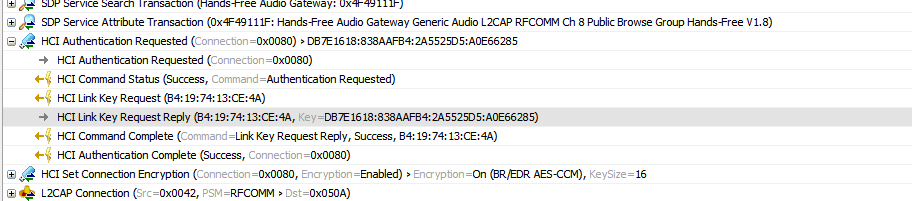

# 音频传输问题

本章介绍Advanced Audio Distribution Profile（A2DP）和Audio/Video Distribution Transport Protocol（AVDTP）相关问题常用的分析、定位方法。AVDTP负责控制音频/视频的传输过程，而A2DP定义了音频数据的编码和传输规范，通过这两个协议配合工作，可以实现在蓝牙设备之间高质量的音频传输。

A2DP是蓝牙音频分发配置协议，包含Source（SRC）和Sink（SNK）两个角色。通常，SRC是音频源，SNK是音频接收方。Vela蓝牙服务框架中，蓝牙音乐源设备（例如手机/手表）可以为A2DP-SRC，蓝牙音乐输出设备（例如音箱/耳机/车机）可以为A2DP-SNK。
AVDTP是蓝牙音频传输控制协议，协议中定义了Stream End Point(SEP) Discovery过程、Get Capabilities/Get All Capabilities过程、Stream Configuration过程、Stream Configuration过程、Stream Establishment、Stream Start、以及Stream Suspend等AVDTP信令过程。AVDTP信令过程的发起方称为Initiator（INT），信令过程的接收方称为Acceptor (ACP)。当两个蓝牙设备间传输音频时，需要预先建立两条AVDTP连接。首先建立的称为AVDTP signaling连接，用于编解码参数的协商和media连接的控制；协商完成后，再次建立一条AVDTP连接，称为AVDTP media连接，用于传输音频数据。A2DP和AVDTP协议栈的层级结构如下图所示


在Vela蓝牙协议栈之上，Vela蓝牙子系统还提供了A2DP服务层，A2DP服务于多媒体子系统中的Media服务之间存在多个传输通路，称为transport channels。这些transport channel可以分为两类：用于传输控制信令的control channel，以及用于传输音频数据的data channel，如下图所示

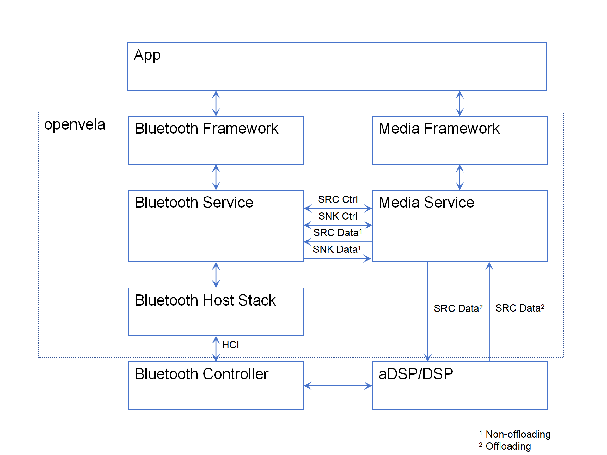

## 分析方法

<a id="方法：观察蓝牙和Media之间的transport是否正确建立"></a>

### 一、观察蓝牙和Media之间的transport是否正确建立

在蓝牙子系统初始化时，A2DP服务会创建socket server，随后，Media服务作为socket client与蓝牙建立连接，从而允许控制信令和音频数据在两个子系统之间传输。通常，可以通过syslog观察蓝牙和Media之间的control channel和data channel是否正确建立。

典型log如下：

* A2DP SRC与Media之间正确建立transport channel
```
[a2dp_control]: a2dp_ctrl_cb, path:[a2dp_source_ctrl], event:TRANSPORT_OPEN_EVT
[a2dp_control]: a2dp_data_cb, path:[a2dp_source_data], event:TRANSPORT_OPEN_EVT
```

* A2DP SNK与Media之间正确建立transport channel
```
[a2dp_control]: a2dp_ctrl_cb, path:[a2dp_sink_ctrl], event:TRANSPORT_OPEN_EVT
[a2dp_control]: a2dp_data_cb, path:[a2dp_sink_data], event:TRANSPORT_OPEN_EVT
```

<a id="观察是否建立了avdtp-signaling连接"></a>

### 二、观察是否建立了AVDTP signaling连接

AVDTP signaling连接是两个蓝牙设备建立音频连接的必要步骤。通常，可以通过snoop log或者air log观察是否建立了AVDTP signaling连接。

#### 1 通过snoop log观察是否建立了AVDTP signaling连接，以及观察可能的失败原因

AVDTP signaling连接成功的典型log如下：


其中：AVDTP连接是一种L2CAP连接，L2CAP连接的种类由PSM标识。两个设备间建立的第一条AVDTP连接自动成为AVDTP signaling连接。

<a id="观察是否建立了avdtp-media连接"></a>

### 三、观察是否建立了AVDTP media连接

建立AVDTP media连接之前，可能会进行Discovery、Get (ALL) Capabilities、Set/Get Configuration、Stream Establishment等过程，其中，Set Configuration和Stream Establishment过程是必要过程。通常，可以通过syslog、snoop log或者air log观察是否建立了AVDTP media连接。

#### 1 通过snoop log观察是否建立了AVDTP media连接，以及观察可能的失败原因

以下几个示例展示了两个设备建立AVDTP media连接的过程。

##### 1.1 AVDTP Discovery

可选的，在建立AVDTP media连接之前，可以发起AVDTP Discovery过程，用于发现对端设备可用的Stream End Point(SEP)。通常，发起AVDTP signaling连接的设备会发起这一过程。典型log如下：

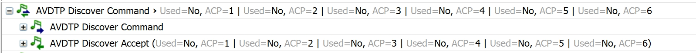

Log显示ACP的序号从1到6，表明该设备的拥有的SEP至少有6个。

##### 1.2 AVDTP Get Capabilities

可选的，在建立AVDTP media连接之前，可以通过Get Capabilities或者Get All Capabilities获取对端设备SEP的具体信息。通常，发起AVDTP signaling连接的设备会发起这一流程。典型log如下：


Log展示了获取编号为1的SEP的具体信息的过程，其中，编码格式为SBC，采样率为44.1kHz。

##### 1.3 AVDTP Set Configuration

在建立AVDTP media连接之前，需要通过Set Configuration过程指定双方的SEP，以及编解码参数。通常，发起AVDTP signaling连接的设备应当发起这一流程。典型log如下：


Log中显示该流程的发起方请求使用1号SEP和对端设备的1号SEP建立连接。

##### 1.4 AVDTP Stream Establishment

在建立AVDTP media连接之前，需要通过Open流程打开双方的SEP。通常，发起AVDTP signaling连接的设备应当发起这一流程。典型log如下：


##### 1.5 AVDTP media连接成功

完成Set Configuration和Stream Establish流程后，需要建立第二条AVDTP连接，也就是AVDTP media连接。通常，发起AVDTP signaling连接的设备应当发起这一流程。典型log如下：


通常，AVDTP Open完成后，随之建立的L2CAP（PSM=AVDTP）是AVDTP media连接。

#### 2 通过syslog观察是否建立了AVDTP media连接，以及观察可能的失败原因

典型log如下：

* 本地设备被连接
```
[a2dp_stm]: ProcessEvent, State=Idle, Peer=[11:22:33:44:55:66], Event=CONNECTED_EVT
[a2dp_stm]: Enter State=Opened, Peer=[11:22:33:44:55:66]
```

* 本地设备主动连接对端设备
```
[a2dp_stm]: ProcessEvent, State=Opening, Peer=[11:22:33:44:55:66], Event=CONNECTED_EVT
[a2dp_stm]: Enter State=Opened, Peer=[11:22:33:44:55:66]
```

<a id="观察Media是否成功设置了codec"></a>

### 四、观察Media是否成功设置了codec

传输或播放音乐前，需要在Media子系统设置编解码参数。可以通过syslog观察Media是否成功设置了编解码参数。

典型log如下：

```
[a2dp_control]: a2dp_recv_ctrl_data: a2dp-ctrl-cmd : A2DP_CTRL_CMD_CONFIG_DONE
```

<a id="观察a2dp-src是否开始播放音乐"></a>

### 五、观察A2DP SRC是否开始播放音乐

通常，可以通过syslog、snoop log或者air log观察A2DP SRC是否开始播放音乐。

#### 1 通过syslog观察A2DP SRC是否开始播放音乐

在A2DP SRC端，Vela蓝牙服务开始播放音乐的流程由来自Media的命令触发，典型log如下：

```
[a2dp_control]: a2dp_recv_ctrl_data: a2dp-ctrl-cmd : A2DP_CTRL_CMD_START
```

当蓝牙服务收到开始播放音乐的命令时，会开始AVDTP Stream Start流程，并在流程成功结束后进入Started状态，典型log如下：

```
[a2dp_stm]: ProcessEvent, State=Opened, Peer=[11:22:33:44:55:66], Event=STREAM_START_REQ
[a2dp_stm]: ProcessEvent, State=Opened, Peer=[11:22:33:44:55:66], Event=STREAM_STARTED_EVT
[a2dp_stm]: Exit  State=Opened, Peer=[11:22:33:44:55:66]
[a2dp_stm]: Enter State=Started, Peer=[11:22:33:44:55:66]
```

#### 2 通过air log观察A2DP SRC是否开始播放音乐

在音频流开始传输之前，A2DP SRC会发起Stream Start流程。在音频流传输过程中，A2DP SRC会向SNK发送media packets，典型log如下：


<a id="观察a2dp-src是否停止传输音频包"></a>

### 六、观察A2DP SRC是否停止音频流传输

通常，可以通过syslog、snoop log或者air log观察A2DP SRC是否停止音频流传输。

#### 1 通过syslog观察A2DP SRC是否停止音频流传输

当Vela设备为A2DP SRC时，蓝牙服务有两个途径终止传输音频数据。

* 当收到Media发送的STOP命令时。

* 当连续2秒不能从Media获取音频数据时。

蓝牙服务收到Media发送的STOP命令时，典型log如下：

```
[a2dp_control]: a2dp_recv_ctrl_data: a2dp-ctrl-cmd : A2DP_CTRL_CMD_STOP
```

蓝牙2秒从media读不到数据，syslog中会打印如下log，且持续时间约2秒：

```
[src_sbc]: a2dp_sbc_send_frames, underflow :6
```

蓝牙服务发起Stream Suspend流程的典型log如下：

```
[a2dp_stm]: ProcessEvent, State=Started, Peer=[11:22:33:44:55:66], Event=STREAM_SUSPEND_REQ
[a2dp_stm]: ProcessEvent, State=Started, Peer=[11:22:33:44:55:66], Event=STREAM_SUSPENDED_EVT
[a2dp_stm]: Exit  State=Started, Peer=[11:22:33:44:55:66]
[a2dp_stm]: Enter State=Opened, Peer=[11:22:33:44:55:66]
```

#### 2 通过snoop log观察A2DP SRC是否停止传输音频包

典型log如下：


### 七、观察AVDTP signaling连接是否断开

AVDTP signaling断开的原因包括以下几种：应用请求Vela蓝牙子系统断开A2DP连接，蓝牙协议栈主动断开连接，已经对端设备请求断开连接。通常，可以通过syslog，snoop log，或者air log观察是否断开了AVDTP signaling连接。

#### 1 通过syslog观察是否断开了AVDTP signaling连接

当应用请求断开A2DP连接时，A2DP状态机会收到DISCONNECT_REQ，并随后断开AVDTP signaling连接，典型log如下：

```
[a2dp_stm]: ProcessEvent, State=Opened, Peer=[11:22:33:44:55:66], Event=DISCONNECT_REQ
```

断开连接完成时的典型log如下：

```
[a2dp_stm]: ProcessEvent, State=Closing, Peer=[11:22:33:44:55:66], Event=DISCONNECTED_EVT
[a2dp_stm]: Exit  State=Closing, Peer=[11:22:33:44:55:66]
[a2dp_stm]: Enter State=Idle, Peer=[11:22:33:44:55:66]
```

#### 2 通过snoop log观察是否断开了AVDTP signaling连接，以及观察可能的失败原因

snoop log中AVDTP signaling连接断开的原因有两种：本地设备主动断开连接，以及对端设备请求断开连接。典型log如下：

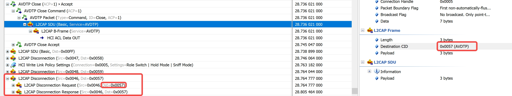

<a id="观察音频包序列号是否连续"></a>

### 八、观察音频包序列号是否连续

AVDTP Media Packet的包头中有一个字段，称为Sequence Number。该字段是音频包的序列号，会随着每一个AVDTP Media Packet发送而递增。
每一次Stream Start过程开始后，Sequence Number都从0开始，每发送一个AVDTP Media Packet，Sequence Number加1。
当该序列号中断或跳跃时，通常表示音频数据缺失。

典型log如下：


<a id="观察air-log中1秒内发送的音频数据样本点数量"></a>

### 九、观察air log中1秒内发送的音频数据样本点数量

AVDTP Media Packet的包头中有一个字段，称为Time Stamp。该字段表示了音频包的采样时刻，即该音频数据包中第一个样本点的编号。

在air log中，截取1秒内的音频包，开始和结束音频包之间的Time Stamp差是该时间段内传输的音频数据样本点数量。

通常，约1秒时间段内音频数据的样本点应当等于或近似等于采样率，典型log如下：

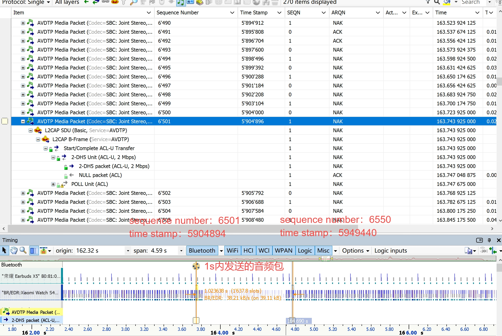

上述log中，实际传输的样本点数量为：5949440 - 5904896 = 44546。由于当前设置的采样率为44.1kHz，实际传输的样本点数量与预期接近。

1秒内音频数据的样本点数量远大于采样率时，通常air log中会看到比正常情形更加密集的包，典型log如下：


上述log中，约1秒时间段内实际传输的样本点数量为：7395456 - 7270656 = 124800，远超预期。

<a id="观察air-log中音频数据是否存在重传"></a>

### 十、观察air log中音频数据是否存在重传

air log中基带包有两个参数可以用来判断包是否存在重传，分别是SEQN和ARQN。正常情况下，SEQN的值在0和1之间交替变化，对端设备回复的ARQN是ACK。若出现重传，基带包中的SEQN值与上一包相同。

空口出现重传的原因有两种：

* 设备发送的包没收到对端的回复

* 设备发送的包收到了对端的回复，但回复的ARQN值为NAK

设备发送的包没收到对端的回复，典型log如下：

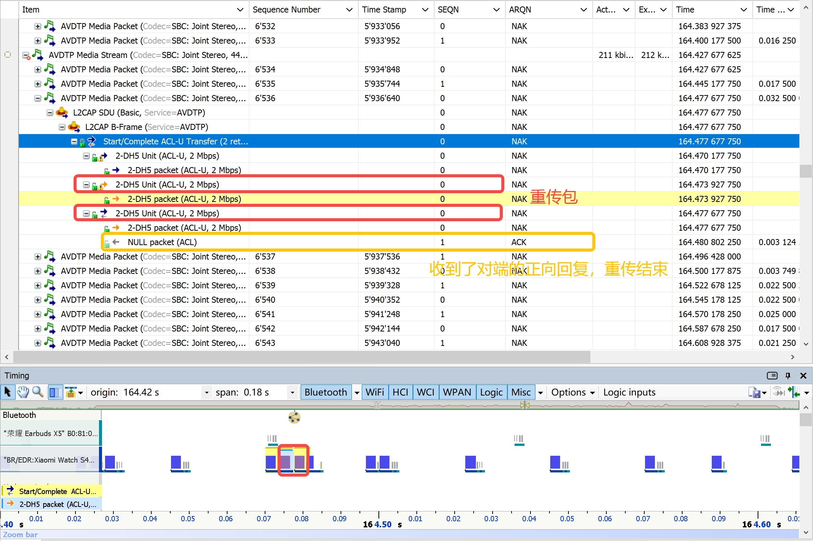

上述log中，设备发了3次2-DH5包，前两次发送的包没有收到对端设备的回复，因此再次重传，SEQN值维持不变；第三次发送的包收到了对端设备的回复，且回复的ARQN是ACK，因此重传结束。再次发送新数据时，可以观察到SEQN发生了变化。

设备发送的包收到了对端的回复，但回复的ARQN是NAK，典型log如下：

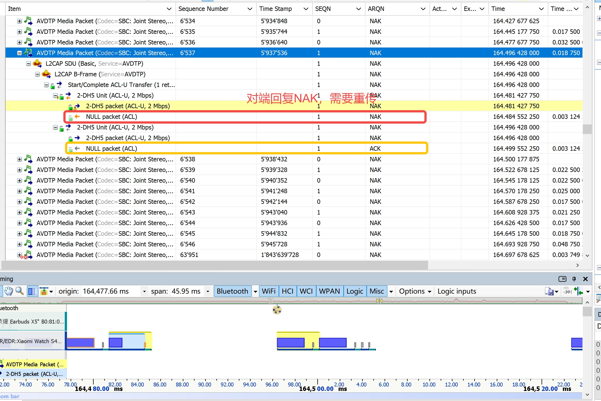

上述log中，设备发了2次2-DH5包，第一次发送的包收到了对端设备的回复，但ARQN为NAK，SEQN值维持不变；第二次的包收到了对端设备的回复，且回复的ARQN是ACK，因此重传结束。

<a id="通过syslog判段a2dp-snk音乐卡顿原因"></a>

### 十一、观察syslog判段A2DP-SNK音乐卡顿原因
A2DP-SNK音乐卡顿问题，Bluetooth service提供以下三个syslog，可以根据以下log进行分析：
```
[a2dp_snk_stream]: a2dp_sink_audio_handle_timer underflow, miss ticks: x

[a2dp_snk_stream]: ===a2dp cpu busy time:y, buff_cnt:z===
[a2dp_snk_stream]: ipc blocking, block ticks: w
```

其中，“underflow, miss ticks: x”表示bluetooth侧的数据buffer在x个ticks（20ms）中为空； “===a2dp cpu busy time: y, buff_cnt: z===”表示发送数据的事件已经 y us未执行，并且当前buffer中数据的个数为z；“ipc blocking, block ticks: w”表示与Media的ipc中阻塞了w个数据包。由于音频链路上有缓存数据的buffer，所以出现以上打印并不一定意味着会出现卡顿，通常x、y、w要大于一定值，才会实际表现出卡顿，具体值取决于Media侧buffer设置的大小。

**注意：该方法仅能进行问题的初步定位**。

#### 1 观察A2DP-SNK音乐卡顿是否可能由基带芯片引起

若未出现“===a2dp cpu busy time: y, buff_cnt: z===”，但存在"underflow, miss ticks: x"，卡顿很有可能是因则优先怀疑音乐卡顿来自于基带芯片。

#### 2 观察A2DP-SNK音乐卡顿是否可能由mips不足引起

若“===a2dp cpu busy time: y, buff_cnt: z===”与“===a2dp cpu busy time: y, buff_cnt: z===”交替出现，应优先怀疑卡顿由mips不足造成。

#### 3 观察A2DP-SNK音乐卡顿是否可能由Bluetooth service

在syslog上，因为Bluetooth service产生的卡顿通常表现的类似于mips不足。

#### 4 观察A2DP-SNK音乐卡顿是否可能由Media service

若出现“ipc blocking, block ticks: w”，说明发送给Media的音频数据没有被及时消费，导致在ipc通道前堆集了w个数据包，在这种情况下应优先考虑Media侧出现问题。

<a id="观察a2dp-snk卡顿是否来源于基带芯片"></a>

### 十二、观察A2DP-SNK卡顿是否来源于基带芯片

#### 1 通过snoop log观察卡顿是否来源于基带芯片

典型log如下：\
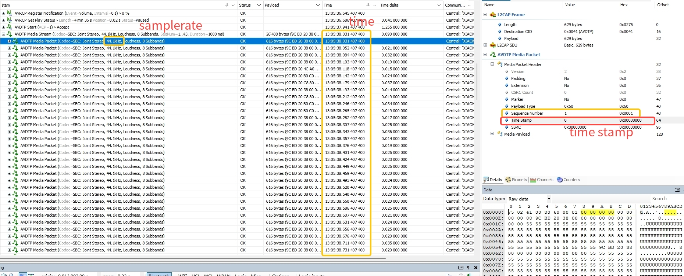

其中，在时间段能收到AVDTP数据的time stamp应大致符合以下关系，（end_time(s) - start_time(s)) * samplerate <= end_time_stamp - start_time_stamp。

#### 2 通过syslog观察卡顿是否来源于基带芯片

在基带芯片驱动处添加syslog可以直接判断音乐卡顿是否来源于基带芯片。\
**该syslog需要能确认基带芯片是否及时上报数据**，若未及时上报数据，则可以怀疑音乐卡顿来自于基带芯片。\
由于不同项目使用的基带芯片不同，所以对应的syslog如何添加/开启应该联系负责基带芯片驱动的工程师。

<a id="观察a2dp-snk卡顿是否来源于mips不足"></a>

### 十三、观察A2DP-SNK卡顿是否来源于mips不足

bluetoothd的优先级在整个系统中往往不是最高，所以如果出现系统mips不足，则有可能出现bluetoothd没有被及时调度去向media发送数据，从而导致Media侧未能及时接收到数据。

#### 1 通过ps命令观察cpu负载情况

对于可持续的长时间卡顿问题，可以直接通过ps命令观察cpu负载情况。若idle task的cpu占用率已经很低/为零，说明存在mips不足的问题，则应先解决系统mips不足的问题。

#### 2 通过工具命令观察cpu负载情况

对于偶现/不可持续的卡顿问题，可以通过抓取发生时间点的trace来分析是否存在短时间内的cpu占用率过高的问题。

<a id="观察bluetoothd自身是否被阻塞"></a>

### 十四、观察bluetoothd自身是否被阻塞

#### 1 通过debug log判断bluetoothd是否被阻塞

需要对整个蓝牙模块进行打点，可以通过脚本对蓝牙模块的所有函数添加打点log，在复现时间点根据打点log和代码流程观察是否有阻塞现象。

## 典型问题

### 一、连接耳机播放音乐，耳机无声

* [观察是否建立了AVDTP signaling连接](#观察是否建立了avdtp-signaling连接)

  * 若两个设备未能正确建立AVDTP signaling连接，建议对比典型log，观察AVDTP signaling连接建立过程中是否出现异常。

  * 若两个设备间正确建立了AVDTP signaling连接，建议[观察是否建立了AVDTP media连接](#观察是否建立了avdtp-media连接)

* [观察是否建立了AVDTP media连接](#观察是否建立了avdtp-media连接)

  * 若两个设备未能正确建立AVDTP media连接，建议对比典型log，观察AVDTP media连接建立过程中是否出现异常。

  * 若两个设备之间正确建立了AVDTP media连接，建议[观察Media是否成功设置了codec](#观察media是否成功设置了codec)

* [观察Media是否成功设置了codec](#观察media是否成功设置了codec)

  * 若Vela Media未能成功设置codec，建议在Vela Media模块观察未能设置codec的原因。

  * 若Vela Media成功设置codec，建议[观察A2DP SRC是否开始播放音乐](#观察a2dp-src是否开始播放音乐)

* [观察是否开始播放音乐](#观察a2dp-src是否开始播放音乐)

  * 若本地设备为A2DP SRC，且Vela Media未能发送音乐开始的命令，建议在Vela Media模块观察未能发送的原因。

  * 若本地设备为A2DP SRC，且Vela Media发送了音乐开始的命令，但耳机端无声，建议对比典型log，观察播放音乐流程中是否出现异常。

### 二、连接耳机播放音频文件，音频文件开头缺失

* [观察音频包序列号是否连续](#观察音频包序列号是否连续)

  * 若air log中出问题的音频流中存在音频包序列号不连续，建议在Vela蓝牙侧观察音频流中音频包的序列号不连续的原因。

  * 若音频包序列号连续，建议Vela Media侧观察发送的音频包是否完整。

### 三、语音播报，结尾处有pop音

### 四、连接两对耳机时，出现断连和无声的问题

Vela A2DP SRC当前不支持多设备连接，典型例子是：一个手表连接连接一对耳机。当手表需要连接另一对耳机时，需要先断开前一对耳机。针对多设备切换导致的无声问题，可以按以下顺序排查：

* [观察是否断开了第一耳机](#观察avdtp-signaling连接是否断开)

  * 若应用未能发送第一耳机断开请求，建议在App侧观察未能发送的原因。

  * 若应用发送了第一耳机断开请求，但未能断开，建议对比典型log，观察断开流程中是否出现异常。

  * 若应用在连接第二耳机前，正确断开了第一耳机，建议[观察是否连接了第二耳机](#观察是否建立了avdtp-media连接)

* [观察是否连接了第二耳机](#观察是否建立了avdtp-media连接)

  * 若应用未能发送第二耳机连接请求，建议在App侧观察未能发送的原因。

  * 若应用发送了第二耳机连接请求，但未能建立AVDTP signaling连接，建议对比典型log，观察建立signaling连接中是否出现异常。

  * 若两个设备之间的AVDTP signaling连接建立成功，但未能建立AVDTP media连接，建议对比典型log，观察建立media连接中是否出现异常。

  * 若两个设备之间的AVDTP media连接建立成功，建议观察[观察Media是否成功设置了codec](#观察media是否成功设置了codec)

* [观察Media是否成功设置了codec](#观察media是否成功设置了codec)

  * 若Vela Media未能成功设置codec，建议在Vela Media模块观察未能设置codec的原因。

  * 若Vela Media成功设置codec，建议观察[观察是否开始播放音乐](#观察a2dp-src是否开始播放音乐)

* [观察是否开始播放音乐](#观察a2dp-src是否开始播放音乐)

  * 若Vela Media未能发送音乐开始的命令，建议在Vela Media模块观察未能发送的原因。

  * 若Vela Media发送了音乐开始的命令，但耳机端无声，建议对比典型log，观察播放音乐流程中是否出现异常。

### 五、连接耳机播放音乐，耳机无声

* [观察是否建立了AVDTP signaling连接](#观察是否建立了avdtp-signaling连接)

  * 若AVDTP signaling连接未建立，建议对比典型log，观察建立signaling连接中是否出现异常。

  * 若两个设备之间的AVDTP signaling连接建立成功，但未能建立AVDTP media连接，建议[观察是否建立了AVDTP media连接](#观察是否建立了avdtp-media连接)

* [观察是否建立了AVDTP media连接](#观察是否建立了avdtp-media连接)

  * 若两个设备之间的AVDTP media连接未建立，建议对比典型log，观察建立media连接中是否出现异常。

  * 若两个设备之间的AVDTP media连接建立成功，建议观察[观察Media是否成功设置了codec](#观察media是否成功设置了codec)

* [观察Media是否成功设置了codec](#观察media是否成功设置了codec)

  * 若Vela Media未能成功设置codec，建议在Vela Media模块观察未能设置codec的原因。

  * 若Vela Media成功设置codec，建议观察[观察是否开始播放音乐](#观察a2dp-src是否开始播放音乐)

* [观察是否开始播放音乐](#观察a2dp-src是否开始播放音乐)

  * 若Vela Media未能发送音乐开始的命令，建议在Vela Media模块观察未能发送的原因。

  * 若Vela Media发送了音乐开始的命令，但耳机端无声，建议对比典型log，观察播放音乐流程中是否出现异常。

### 六、连接耳机播放音频文件，音频文件开头缺失

* [观察sequence number是否连续](#观察air-log中的音频包序列号是否连续)

  * 若air log中出问题的音频流中存在音频包序列号不连续，建议Vela蓝牙测观察音频流中音频包的序列号不连续的原因。

  * 若音频包序列号连续，建议Vela Media测观察发送的音频包是否完整。

### 七、语音播报，结尾处有pop音

### 八、连接手机播放音乐卡顿

对于该问题需要进行以下分析：

  [观察air log中音频数据是否存在重传](#观察air-log中音频数据是否存在重传)\
  [通过syslog判段A2DP-SNK音乐卡顿原因](#通过syslog判段a2dp-snk音乐卡顿原因)

根据推测原因应进行以下分析：
* 若发现重传现象比较严重

* [观察A2DP-SNK卡顿是否来源于基带芯片](#观察a2dp-snk卡顿是否来源于基带芯片)

  * 若观察到snoop log中，AVDTP数据包数量不符合预期，需要进一步确认驱动处的数据包情况

    * 若观察到驱动处数据包数量异常，则需要进一步确认问题发生在基带芯片、空口处或者驱动处

* [观察A2DP-SNK卡顿是否来源于mips不足](#观察a2dp-snk卡顿是否来源于mips不足)

  * 若观察到idle task的cpu占用率过小，需要对系统的mips进行合理分配
  * 若通过trace观察到某一高优先级线程长时间占据cpu，则应该优化该线程的执行逻辑，避免高优先级线程执行计算密集型任务

* [观察bluetoothd自身是否被阻塞](#观察bluetoothd自身是否被阻塞)

  * 若阻塞由于外部调用产生，则需要考虑该阻塞是否符合预期

    * 若不符合预期，则应优化该外部调用
    * 若符合预期，则需要异步执行该阻塞动作

  * 若阻塞由于bluetoothd内部产生，则需要对内部动作进行优化

* 对于Media service未及时消费音频数据的问题，需要联系Media service的开发人员确认。

### 九、连接手机播放音乐无声

# 音乐播放控制问题

本章介绍Audio/Vedio Remote Control Profile（AVRCP）相关问题常用的分析、定位方法。

AVRCP是蓝牙音视频遥控协议，包含Controller（CT）和Target（TG）两个角色。通常，CT是控制方，TG是受控方。Vela蓝牙服务框架中，蓝牙音乐输出设备（例如音箱/耳机/车机）可以为AVRCP-CT，蓝牙音乐源设备（例如手机/手表/手环）可以为AVRCP-TG。
AVCTP是蓝牙音视频控制信令传输协议，协议主要由AV/C数字接口指令集发展而来，规定了控制信令的传输格式。AVRCP和AVCTP协议栈的层级结构如下图所示

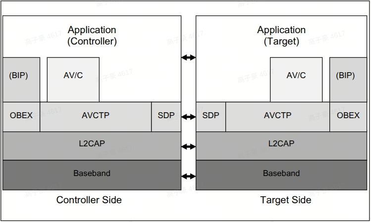

Vela音视频控制模块有多种类型的外部接口。其中，蓝牙子系统通过Media Session与各应用交互音视频控制信息，包括播放器的播放状态、播放进度等；Vela蓝牙子系统通过Media Framework和多媒体子系统交互媒体音量等信息；Vela蓝牙子系统通过蓝牙服务框架与前端应用交互歌曲名称等信息。

## 分析方法

<a id="方法：观察是否建立了AVRCP连接"></a>

### 一、观察是否建立了AVRCP连接

通常，可以通过syslog，snoop log，或者air log观察是否建立了AVRCP连接。

#### 1 通过syslog观察是否建立了AVRCP连接

典型log如下：

* AVRCP CT 连接对端设备（AVRCP TG）成功
```
[avrcp_controller]: avrc ct connnection --> device:[AA:AA:AA:AA:AA:AA], state: 2
```
* AVRCP TG 连接对端设备（AVRCP CT）成功
```
[avrcp_target]: avrc tg connnection --> device:[AA:AA:AA:AA:AA:AA], state: 2
```

#### 2 通过snoop log观察是否建立了AVRCP连接，以及观察可能的失败原因

典型log如下：

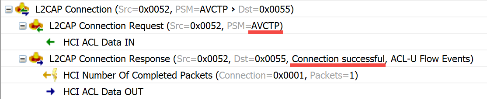

#### 3 通过air log观察是否建立了AVRCP连接，以及观察可能的失败原因

典型log如下：


<a id="方法：观察设备是否支持AVRCP"></a>

### 二、观察设备是否支持AVRCP

当两个设备均未能发起AVRCP连接时，建议观察双方设备是否支持AVRCP。通常，可以通过syslog，snoop log，或者air log观察设备是否支持AVRCP。

#### 1 通过syslog观察本地设备是否打开了AVRCP服务

典型log如下：

* AVRCP CT 服务注册成功
```
[service_manager]: AVRCP-CT service register success
```
* AVRCP CT 服务开启成功
```
[service_manager]: service_on_startup {AVRCP-CT} start ret:1
```
* AVRCP TG 服务注册成功
```
[service_manager]: AVRCP-TG service register success
```
* AVRCP TG 服务开启成功
```
[service_manager]: service_on_startup {AVRCP-TG} start ret:1
```

#### 2 通过snoop log或air log观察双方设备是否支持AVRCP

典型log如下：

* SDP中，声明支持AVRCP-CT角色


* SDP中，声明支持AVRCP-TG角色


<a id="方法：观察是否发送了播放、暂停请求"></a>

### 三、观察是否发送了播放、暂停请求

通过syslog，snoop log，或者air log可以观察是否发送了播放、暂停请求。

#### 1 通过syslog观察是否发送了播放、暂停请求

典型log如下：
* 本地设备发送了播放、暂停请求
```
[avrcp_controller]: avrcp_ct_on_play
[avrcp_controller]: avrcp_ct_on_pause
```
* 对端设备按下播放键、抬起播放键、按下暂停键、抬起暂停键
```
[avrcp_target]: passthrough cmd: 40, state: 0
[avrcp_target]: passthrough cmd: 40, state: 1
[avrcp_target]: passthrough cmd: 42, state: 0
[avrcp_target]: passthrough cmd: 42, state: 1
```

#### 2 通过snoop log或air log观察是否发送了播放、暂停请求

典型log如下：

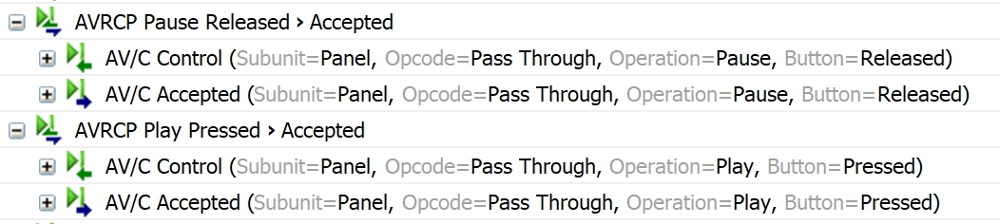

<a id="方法：观察是否注册了Notification"></a>

### 四、观察是否注册了Notification

通过syslog，snoop log，或者air log可以观察是否注册了Notification。

#### 1 通过syslog观察是否注册了Notification

典型log如下：
* 本地设备注册了notification，观察对端设备播放状态
```
[avrcp_controller]: capability support event: 1
```
* 对端设备注册了Notification，观察本地设备播放状态
```
[avrcp_target]: register notification event: 1
```
相似的，不同event数值代表不同的notification事件，syslog内容解析方法相同。

#### 2 通过snoop log或air log观察是否注册了Notification

以播放状态Notification为例，典型log如下：

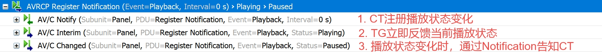

<a id="方法：观察是否正确反馈播放状态"></a>

### 五、观察是否正确反馈播放状态

在CT向TG注册播放状态变化后，TG可以向CT反馈播放状态变化。通过syslog，snoop log，或者air log可以观察TG是否正确向CT反馈播放状态变化。

#### 1 通过syslog观察是否正确反馈播放状态

典型log如下：
* 本地设备向对端设备反馈播放状态变化
```
[avrcp_target]: send playstatus notification --> STOPPED
```
* 对端设备向本地设备反馈播放状态变化
```
[avrcp_controller]: register_notification evt: 1
[avrcp_controller]: playback status changed: PAUSED, get status now...
```

#### 2 通过snoop log或air log观察是否注册了Notification

以播放状态Notification为例，典型log如下：


<a id="方法：观察播放状态变化是否由蓝牙引起"></a>

### 六、观察播放状态变化是否由蓝牙引起

通常，当蓝牙音乐播放器的播放状态异常变化时，可以在相同场景中尝试断开蓝牙连接，观察是否仍然引起了播放状态变化。若仍可见播放状态变化，通常该变化与蓝牙连接无关。

<a id="方法：观察是否使用了绝对音量"></a>

### 七、观察是否使用了绝对音量

AVRCP-CT和AVRCP-TG使用绝对音量的前提是双方均支持绝对音量功能。

#### 1 通过syslog观察是否支持绝对音量

对端设备请求注册volume changed notification（EventID = 0x0D），表明双方均支持绝对音量
```
[avrcp_controller]: register notification event: 13
```

#### 2 通过snoop log观察是否支持绝对音量

绝对音量功能中，音乐源设备（手机）需要在SDP声明支持AVRCP-CT角色，音乐播放设备（耳机）需要在SDP声明支持AVRCP-TG角色。典型log如下：

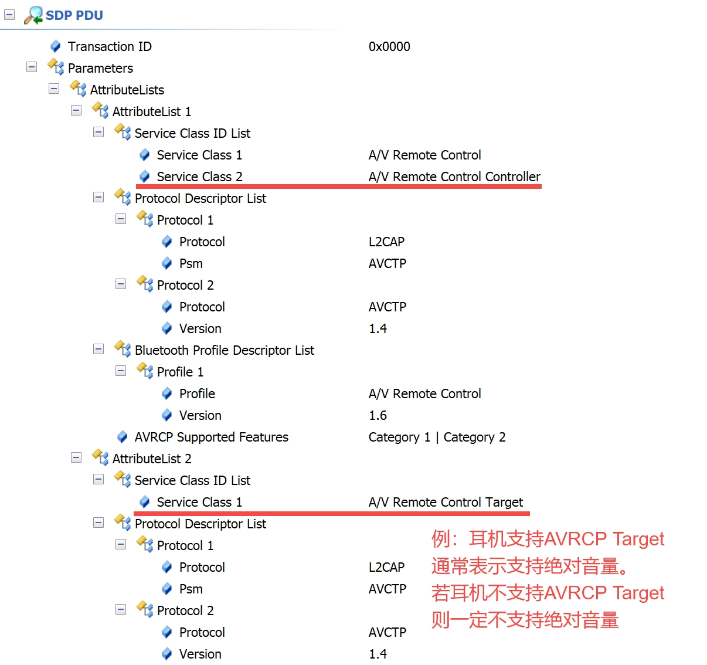

此外，音乐源设备（手机）向音乐播放设备（耳机）注册音量变化事件，表明双方均支持绝对音量。典型log如下：


<a id="方法：观察手机是否设置了绝对音量"></a>

### 八、观察音乐源设备（手机）是否设置了绝对音量

当双方均支持绝对音量时，音乐源设备（手机）需要发送set absolute volume改变音乐播放设备（耳机）的音量。可以通过snoop log，或air log观察手机是否设置了绝对音量。

#### 1 通过snoop log或air log观察手机是否设置了绝对音量

典型log如下：


<a id="方法：观察本地设备是否设置了绝对音量"></a>

### 九、观察本地设备是否设置了绝对音量

若音乐源设备（手机）正确设置了绝对音量，本地却未能生效，需要观察本地音量未能生效的原因。通过syslog可以观察本地设备是否成功设置了绝对音量。

#### 1 通过syslog观察本地设备是否设置了绝对音量

典型log如下：

```
[avrcp_controller]: set absolute volume rsp: status: 0, volume: 50
```

<a id="方法：观察手机是否改变了音频幅值"></a>

### 十、观察音乐源设备（手机）是否改变了音频幅值

#### 1 通过音频源文件观察音乐源设备（手机）是否改变了音频幅值

通常可以通过air log导出音频，解析音乐文件，观察幅值变化。典型的蓝牙音频文件如下：

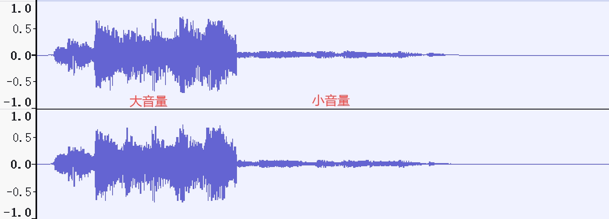

#### 2 通过air log观察音乐源设备（手机）是否改变了音频幅值

对于SBC和AAC编码的音频，可以使用以下方式粗略的分辨音量大小，但不准确。更多的时候，可以用来判断是否静音。

对于SBC编码的音频，可以通过Media Payload中的Scale Factor判断音量。典型log如下：

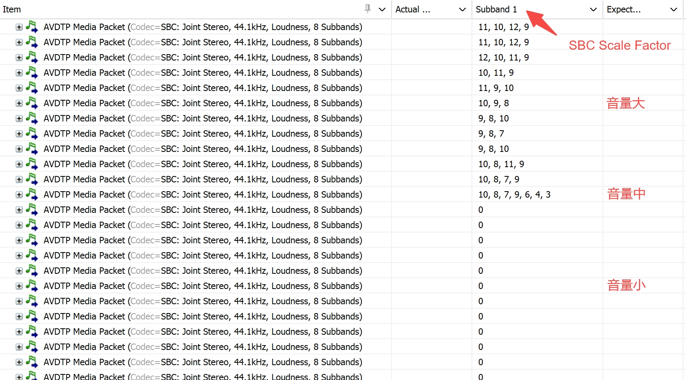

对于AAC编码的音频，可以通过编码帧长度判断音量。典型log如下：

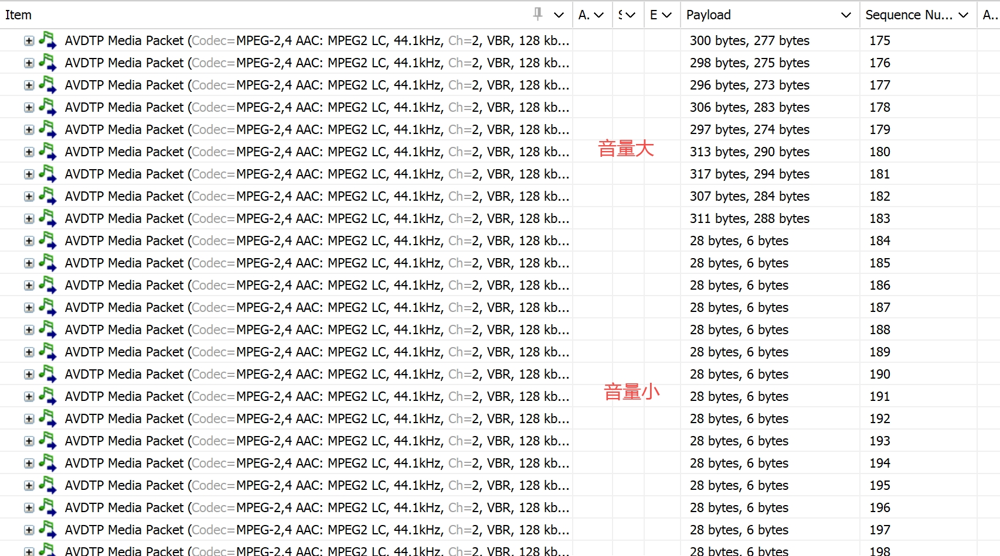

<a id="方法：观察是否打开了AVRCP配置"></a>

### 十一、观察是否打开了AVRCP配置

通常可以通过.config文件观察是否打开了AVRCP配置。在编译产物中，.config文件位于蓝牙服务所在核路径下，例如：
```
image/sim-vela/vela/.config
image/qemu-vela/goldfish-armeabi-v7a-ap/.config
```
AVRCP相关配置如下：

```
CONFIG_BLUETOOTH_AVRCP_TARGET=y
CONFIG_BLUETOOTH_AVRCP_CONTROL=y
```

<a id="方法：观察音量变化是否由蓝牙引起"></a>

### 十二、观察音量变化是否由蓝牙引起

通常，当蓝牙设备音量异常变化时，可以在相同场景中尝试断开蓝牙连接，观察是否仍然引起了音量变化。若仍可见音量变化，通常该音量变化与蓝牙连接无关。

<a id="方法：观察音量变化由AVRCP或是HFP控制"></a>

### 十三、观察音量变化由AVRCP或是HFP控制

在蓝牙规范中，AVRCP和HFP均可以控制音量。通常可以通过snoop log确定音量控制的途径。

#### 1 通过snoop log观察音量变化由AVRCP或是HFP控制

在蓝牙通话中，音量变化通常由HFP协议控制。在其他场景，音量变化通常由AVRCP协议控制。

当双方设备支持AVRCP绝对音量控制时，AVRCP TG（手机）设备可以主动设置绝对音量，典型log如下：


当双方设备支持AVRCP绝对音量控制时，AVRCP CT（耳机）设备可以主动反馈绝对音量变化，典型log如下：

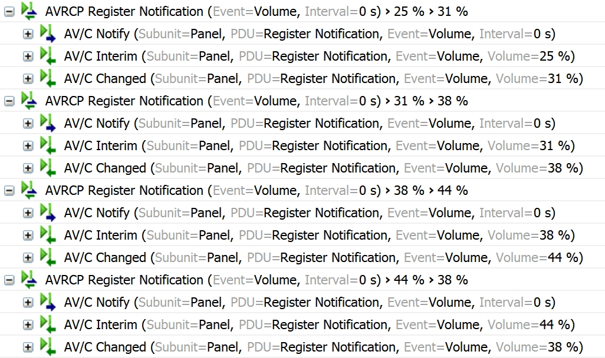

HFP AG（手机）设备可以主动设置通话音量，典型log如下：

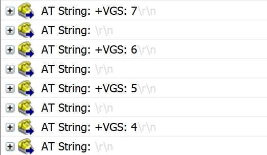

HFP HF（耳机）设备可以主动设置通话音量，典型log如下：

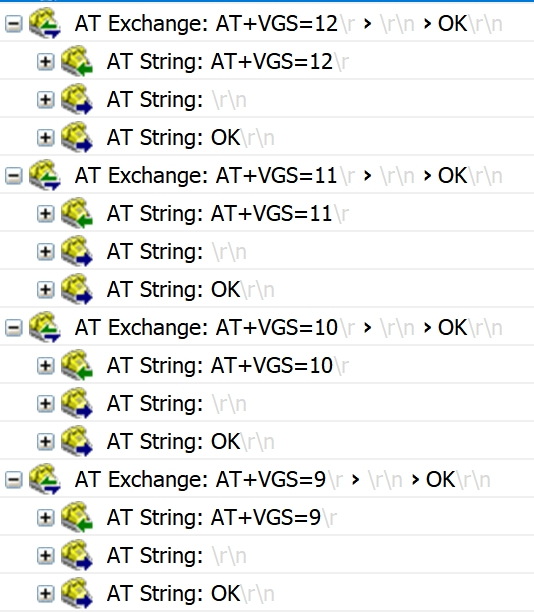

## 典型问题

### 一、不能控制播放、暂停

本地设备不能控制对端设备上的播放器进行播放、暂停，可能有多种原因导致，可考虑的定位方法包括：

* [观察是否建立了AVRCP连接](#方法：观察是否建立了AVRCP连接)

  * 若双方设备中，至少一方发起了连接，但连接失败，建议对比典型log，分析连接失败的原因。

  * 若双方设备均未能发起上述连接，建议[观察双方设备是否支持AVRCP](#方法：观察设备是否支持AVRCP)。

  * 若AVRCP连接成功，建议[观察是否发送了播放、暂停请求](#方法：观察是否发送了播放、暂停请求)。

* [观察设备是否支持AVRCP](#方法：观察设备是否支持AVRCP)

  * 若音乐源设备（A2DP-SRC）不支持AVRCP-TG，或音乐播放设备（A2DP-SNK）不支持AVRCP-CT，则建议[观察是否打开了相应配置](#方法：观察是否打开了AVRCP配置)。
    
  * 若音乐源设备（A2DP-SRC）未能正确的注册或开启AVRCP-TG服务，或者音乐播放设备（A2DP-SNK）未能正确的注册或开启AVRCP-CT服务，则建议根据syslog观察失败原因。
    
  * 若音乐源设备（A2DP-SRC）支持AVRCP-TG，且音乐播放设备（A2DP-SNK）支持AVRCP-CT，则双方应当至少有一方主动发起连接。若双方均未发起连接，则建议首先观察音乐播放设备（A2DP-SNK）为什么没有发起AVRCP连接。

* [观察是否发送了播放、暂停请求](#方法：观察是否发送了播放、暂停请求)

  * 若本地设备未能发送播放、暂停请求，建议在App侧观察是否调用了Media Session相关接口。

  * 若本地设备发送了播放、暂停请求，建议观察手机侧行为异常的原因。

### 二、不能受控播放、暂停

本地设备不能被对端设备控制播放、暂停，可能有多种原因导致，可考虑的定位方法包括：

* [观察是否建立了AVRCP连接](#方法：观察是否建立了AVRCP连接)

  * 若双方设备中，至少一方发起了连接，但连接失败，建议对比典型log，分析连接失败的原因。

  * 若双方设备均未能发起上述连接，建议[观察双方设备是否支持AVRCP](#方法：观察设备是否支持AVRCP)。

  * 若AVRCP连接成功，建议[观察是否发送了播放、暂停请求](#方法：观察是否发送了播放、暂停请求)。
  
* [观察设备是否支持AVRCP](#方法：观察设备是否支持AVRCP)

  * 若音乐源设备（A2DP-SRC）不支持AVRCP-TG，或音乐播放设备（A2DP-SNK）不支持AVRCP-CT，则建议[观察是否打开了相应配置](#方法：观察是否打开了AVRCP配置)。
    
  * 若音乐源设备（A2DP-SRC）未能正确的注册或开启AVRCP-TG服务，或者音乐播放设备（A2DP-SNK）未能正确的注册或开启AVRCP-CT服务，则建议根据syslog观察失败原因。
    
  * 若音乐源设备（A2DP-SRC）支持AVRCP-TG，且音乐播放设备（A2DP-SNK）支持AVRCP-CT，则双方应当至少有一方主动发起连接。若双方均未发起连接，则建议首先观察音乐播放设备（A2DP-SNK）为什么没有发起AVRCP连接。

* [观察是否发送了播放、暂停请求](#方法：观察是否发送了播放、暂停请求)

  * 若对端设备未能发送播放、暂停请求，建议[观察是否注册了Notification](#方法：观察是否注册了Notification)。

  * 若对端设备发送了错误的播放、暂停请求，例如：应当请求播放，却发送了暂停，建议[观察是否正确反馈播放状态](#方法：观察是否正确反馈播放状态)。

  * 若对端设备正确发送了播放、暂停请求，本地设备正确接收，建议在Vela Media或App侧观察未能正确执行的原因。

* [观察是否注册了Notification](#方法：观察是否注册了Notification)

  * 若对端设备未能注册Notification，建议对比典型log，分析对端设备行为异常的原因。

* [观察是否正确反馈播放状态](#方法：观察是否正确反馈播放状态)

  * 若本地设备未能正确反馈播放状态，建议在Vela Media或App侧观察未能正确反馈的原因。

### 三、意外的播放、暂停

当音乐播放器意外的播放、暂停时，通常有以下方法可以逐步缩小范围并定位问题。

* [观察播放状态变化是否由蓝牙引起](#方法：观察播放状态变化是否由蓝牙引起)

  * 若播放状态变化并非由蓝牙连接引起，建议在音乐播放器所在设备（通常是手机）处观察原因。若该设备为Vela设备，建议在Vela App侧观察播放状态变化的原因。

  * 若音量变化可能由蓝牙连接引起，建议[观察是否发送了播放、暂停请求](#方法：观察是否发送了播放、暂停请求)

* [观察是否发送了播放、暂停请求](#方法：观察是否发送了播放、暂停请求)

  * 若CT设备未能发送播放、暂停请求，建议在TG设备App侧观察播放状态变化的原因。

  * 若CT设备发送了播放、暂停请求，建议在CT设备App侧观察播放状态变化的原因。

### 四、不能受音乐源设备（手机）控制调节音量

AVRCP音量调节问题，分为绝对音量和相对音量两种。首先需要判断当前产品使用了哪一种调节方式。可考虑的定位方法包括：

* [观察是否使用了绝对音量](#方法：观察是否使用了绝对音量)

  * 若双方设备均支持绝对音量，则建议[观察音乐源设备是否设置了绝对音量](#方法：观察手机是否设置了绝对音量)。

  * 双方设备未使用绝对音量，则音乐播放设备（耳机）不参与音量调节，由音乐源设备（手机）自行修改音频幅值。建议[观察音乐源设备是否改变了音频幅值](#方法：观察手机是否改变了音频幅值)。

* [观察手机是否设置了绝对音量](#方法：观察手机是否设置了绝对音量)

  * 若音乐源设备（手机）未能设置绝对音量，建议观察手机侧行为异常的原因。

  * 若音乐源设备（手机）设置了绝对音量，但本地未能生效，建议[观察本地设备是否设置了绝对音量](#方法：观察本地设备是否设置了绝对音量)

* [观察本地设备是否设置了绝对音量](#方法：观察本地设备是否设置了绝对音量)

  * 若本地设备设置了绝对音量，但观察不到本地音量变化，建议在Vela Media侧观察音量未能生效的原因。

  * 若本地设备未能正确设置绝对音量，建议根据syslog判断未能设置音量的原因。

* [观察手机是否改变了音频幅值](#方法：观察手机是否改变了音频幅值)

  * 若使用相对音量时，手机未能正确改变音频幅值，建议观察手机侧行为异常的原因。

  * 若使用相对音量时，手机正确改变了音频幅值，建议Vela Media侧观察音量变化未能体现的原因。

### 五、音量异常变化

当遇到蓝牙设备音量异常变化时，通常有以下方法可以逐步缩小范围并定位问题。

* [观察音量变化是否由蓝牙引起](#方法：观察音量变化是否由蓝牙引起)

  * 若音量变化并非由蓝牙连接引起，建议在产生音量变化的设备处观察原因。若该设备为Vela设备，建议在Vela Media侧观察音量变化的原因。

  * 若音量变化可能由蓝牙连接引起，建议[观察音量变化由AVRCP或是HFP控制](#方法：观察音量变化由AVRCP或是HFP控制)

* [观察音量变化由AVRCP或是HFP控制](#方法：观察音量变化由AVRCP或是HFP控制)

  * 若音量改变由AVRCP控制，建议观察控制发起方（CT或TG）发起该改变的原因。若该设备为Vela设备，建议在Vela App或Media侧观察音量改变的原因。

  * 若音量改变由HFP控制，建议观察控制发起方（AG或HF）发起该改变的原因。若该设备为Vela设备，建议在Vela App侧观察音量改变的原因。

# 通话问题

本章介绍Hands-Free Profile（HFP）相关问题常用的分析、定位方法。

HFP是蓝牙通话协议，包含Audio Gateway（AG）和Hands-Free unit （HF）两个角色。通常，AG是音频网关，负责音频设备输入输出，典型设备为手机，HF作为音频网关的远程音频输入/输出设备，典型设备为耳机。HFP协议栈的层级结构如下图所示


## 分析方法

<a id="方法：观察是否建立了HFP连接"></a>

### 一、观察是否建立了HFP连接

在HFP协议中，两个蓝牙设备间的连接包含多个层面。一般来说，Service Level Connection（SLC）的建立标志着HFP连接已经完成。通常，可以通过syslog，snoop log，或者air log观察是否建立了HFP连接。

#### 1 通过syslog观察是否建立了HFP连接

典型log如下：

* HFP HF 连接对端设备（HFP AG）成功
```
[hf_stm]: Enter State=Connected, Peer=[AA:AA:AA:AA:AA:AA]
```
* HFP AG 连接对端设备（HFP HF）成功
```
[ag_stm]: Enter State=Connected, Peer=[AA:AA:AA:AA:AA:AA]
```
#### 2 通过snoop log观察是否建立了HFP连接，以及观察可能的失败原因

在建立SLC连接的过程中，AG和HF设备需要在RFCOMM信道上交互多组AT命令，具体流程可参考下图。其中，实线箭头指代的命令为流程，虚线箭头指代的命令为可选流程。Standard Event Reporting Activation（AT+CMER）是必要流程中的最后一组命令，通常标志着SLC建立完成。

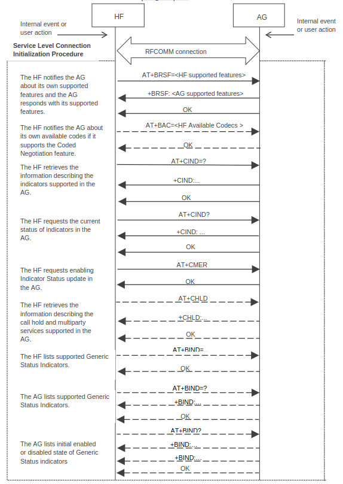

两个蓝牙设备建立HFP连接的典型log如下：


<a id="方法：观察设备是否支持HFP"></a>

### 二、观察设备是否支持HFP

当两个设备均未能发起HFP连接时，建议观察双方设备是否支持HFP。通常，可以通过syslog，snoop log，或者air log观察设备是否支持HFP。

#### 1 通过syslog观察设备是否支持HFP

典型log如下：

* HFP HF 服务注册成功
```
[service_manager]: HFP-HF service register success
```
* HFP HF 服务开启成功
```
[service_manager]: service_on_startup {HFP-HF} start ret:1
```
* HFP AG 服务注册成功
```
[service_manager]: HFP-AG service register success
```
* HFP AG 服务开启成功
```
[service_manager]: service_on_startup {HFP-AG} start ret:1
```

#### 2 通过snoop log或air log观察双方设备是否支持HFP

典型log如下：

* SDP中，声明支持HFP-HF角色


* SDP中，声明支持HFP-AG角色


<a id="方法：观察是否建立了SCO连接"></a>

### 三、观察是否建立了SCO连接

两台设备之间传输通话语音需要建立SCO连接。通常，可以通过syslog，snoop log，或者air log观察SCO是否建立成功。

#### 1 通过syslog观察是否建立了SCO连接

* 本地设备为HF，成功建立了SCO连接
```
[hf_stm]: Enter State=AudioOn, Peer=[AA:AA:AA:AA:AA:AA]
```
* 本地设备为AG，成功建立了SCO连接
```
[ag_stm]: Enter State=AudioOn, Peer=[AA:AA:AA:AA:AA:AA]
```
<a id="方法：观察是否向Media设置了SCO音频参数"></a>

### 四、观察是否向Media设置了SCO音频参数

AG和HF都需要在SCO建立完成之后向Media设置SCO音频参数，包含Codec采样率和设备结点可用的信息，典型log如下：
```
[Media_proxy_once:430] policy:audio:0x20556fd4 HFPSampleRate set_int 16000 _ ret:0 resp:0
[Media_proxy_once:430] policy:audio:0x20556fec AvailableDevices include sco apply ret:0 resp:0
```

<a id="方法：观察HF是否向AG发送了Answer请求"></a>

### 五、观察HF是否向AG发送了Answer请求

当HF请求AG接听来电时，HF端需要发起Answer请求。具体的，HF会向AG发送ATA命令。通常，可以通过syslog，snoop log，或者air log观察AG是否收到了HF的Answer请求。

#### 1 通过syslog观察HF是否向AG发送了Answer请求

在AG端，Vela蓝牙服务有两个途径处理来自HF端的ATA命令，包括：

* 通过Bluetooth Framework向上层应用发送callback，典型log包括：

```
[hfp_ag]: ag_service_notify_call_answered
```

* 通过Telephony模块直接接听电话

```
> RIL_REQUEST_ANSWER
```

在HF端，Vela蓝牙服务可以根据应用请求发送ATA命令，典型log包括：

```
[hf_stm]: Accept incoming call
```

#### 2 通过snoop log观察HF是否向AG发送了Answer请求


<a id="方法：观察AG是否向HF发送了来电信息"></a>

### 六、观察AG是否向HF发送了来电信息

AG端收到来电时，需要向HF端发送+CIEV和RING指令，AG端还需要在+CLCC中描述来电详细信息，通常，可以通过syslog，snoop log，或者air log观察AG是否向HF发送了来电信息。

#### 1 通过syslog观察AG是否向HF发送了来电信息

```
[hf_stm]: ProcessEvent, State=Connected, Peer=[AA:AA:AA:AA:AA:AA], Event=HF_STACK_EVENT_CALLSETUP
[hf_stm]: ProcessEvent, State=Connected, Peer=[AA:AA:AA:AA:AA:AA], Event=HF_STACK_EVENT_RING_INDICATION
[hf_stm]: ProcessEvent, State=Connected, Peer=[AA:AA:AA:AA:AA:AA], Event=HF_STACK_EVENT_CURRENT_CALLS
```

<a id="方法：观察HF端是否通知了应用AG端有来电"></a>

### 七、观察HF端是否通知了应用AG端有来电

HF端收到AG端的来电通知后，需要将电话状态通知给应用，通常，可以通过syslog观察HF端是否通知了应用AG端有来电。

#### 1 通过syslog观察HF端是否通知了应用AG端有来电

```
[hfp_hf]: hf_service_notify_callsetup
[hfp_hf]: hf_service_notify_call_state_changed
```

## 典型问题

<a id="问题：AG端接通电话，HF端通话无声"></a>

### 一、AG端接通电话，HF端通话无声

AG端接通电话，HF端通话无声的问题可能有多种原因导致，可考虑的定位方法包括：

* [观察是否建立了HFP连接](#方法：观察是否建立了HFP连接)

  * 若双方设备中，至少一方发起了连接，但连接失败，建议对比典型log，分析连接失败的原因。

  * 若双方设备均未能发起上述连接，建议[观察双方设备是否支持HFP](#方法：观察设备是否支持HFP)。

* [观察双方设备是否建立了SCO连接](#方法：观察是否建立了SCO连接)

  * 若HFP连接成功，建议观察双方设备是否建立了SCO连接，通常，应当由AG设备发起SCO连接，在AG侧，通常由App发起SCO连接。

  * 若双方均未能发起SCO连接，建议在AG端App侧检查未能发起SCO连接的原因。

  * 若发起SCO连接，但是连接失败，建议对比典型log，分析失败原因。

  * 若SCO建立成功，建议[观察是否向Media设置了SCO音频参数](#方法：观察是否向Media设置了SCO音频参数)。

* [观察是否向Media设置了SCO音频参数](#方法：观察是否向Media设置了SCO音频参数)

  * 若蓝牙成功设置了SCO音频参数，则蓝牙侧完成了音频传输的必要流程，建议在Vela Media侧观察无声的原因。

  * 若未设置SCO音频参数，建议检查蓝牙和Media子系统之间的通信是否出现了异常。


<a id="问题：HF端接通电话，HF端无声"></a>

### 二、HF端接通电话，HF端无声

* [观察HF是否向AG发送了Answer](#方法：观察HF是否向AG发送了Answer请求)

  * 若AG端未收到HF端的Answer请求，建议对比典型log，观察HF未能发送ATA命令，或者AG未能处理ATA命令的原因。

  * 若AG端收到了HF端的Answer请求，建议[观察双方设备是否支持HFP](#方法：观察设备是否支持HFP)。

* [观察双方设备是否建立了SCO连接](#方法：观察是否建立了SCO连接)

  * 若HFP连接成功，建议观察双方设备是否建立了SCO连接，通常，应当由AG设备发起SCO连接，在AG侧，通常由App发起SCO连接。

  * 若双方均未能发起SCO连接，建议在AG端App侧检查未能发起SCO连接的原因。

  * 若发起SCO连接，但是连接失败，建议对比典型log，分析失败原因。

  * 若SCO建立成功，建议[观察是否向Media设置了SCO音频参数](#方法：观察是否向Media设置了SCO音频参数)。

* [观察是否向Media设置了SCO音频参数](#方法：观察是否向Media设置了SCO音频参数)

  * 若蓝牙成功设置了SCO音频参数，则蓝牙侧完成了音频传输的必要流程，建议在Vela Media侧观察无声的原因。

  * 若未设置SCO音频参数，建议检查蓝牙和Media子系统之间的通信是否出现了异常。

<a id="问题：作为AG端，不能受HF端控制接听电话"></a>

### 三、作为AG端，不能受HF端控制接听电话

* [观察HF是否向AG发送了Answer请求](#方法：观察HF是否向AG发送了Answer请求)

  * 若AG端未收到Answer请求，建议对比典型log，观察HF未能发送ATA命令的原因。

  * 若AG端收到了HF端的Answer请求，建议在Vela Telephony侧观察未能接听电话的原因。

<a id="问题：作为HF端，AG端来电，HF端无来电显示"></a>

### 四、作为HF端，AG端来电，HF端无来电显示

* [观察是否建立了HFP连接](#方法：观察是否建立了HFP连接)

  * 若双方设备中，至少一方发起了连接，但连接失败，建议对比典型log，分析连接失败的原因。

  * 若双方设备均未能发起上述连接，建议[观察双方设备是否支持HFP](#方法：观察设备是否支持HFP)。

* [观察AG是否向HF发送了来电信息](#方法：观察AG是否向HF发送了来电信息)

  * 若HF端未收到AG端的来电通知，建议对比典型log，观察AG未能发送来电信息的原因。

  * 若HF端收到了AG端的来电通知，建议[观察HF端是否通知了应用AG端有来电](#方法：观察HF端是否通知了应用AG端有来电)。

* [观察HF端是否通知了应用AG端有来电](#方法：观察HF端是否通知了应用AG端有来电)

  * 若HF端未上报电话状态，建议对比典型log，观察callback失败的原因。

  * 若HF端上报了电话状态，建议在App侧观察未能正确处理来电的原因。

# 数据传输问题

本章介绍数据传输（GATT、 SPP）高吞吐传输过程中相关问题常用的分析、定位方法。
GATT是低功耗蓝牙通用属性协议，包含client和server两个角色。通常，主动发起连接的设备为client，被动接收连接的设备为server。设备可以同时充当client和server。GATT主要应用的高吞吐场景为，IOS OTA数据传输。

## 分析方法

<a id="方法：分析GATT理论吞吐"></a>

### 一、分析GATT理论吞吐

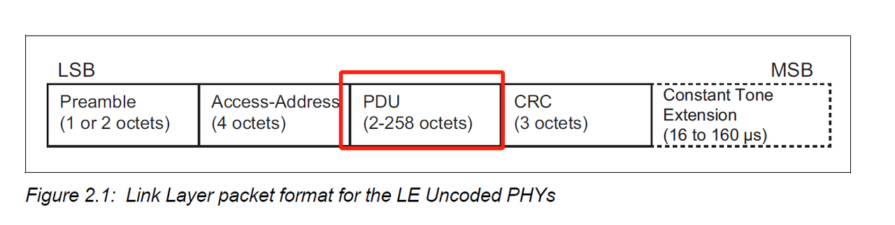

链路层启用2M PHY及启用DLE，258 - 2 - 4 - 3 = 251Bytes，251 bytes / 1400μs = 179.3 kB/s

<a id="观察le数据包格式"></a>

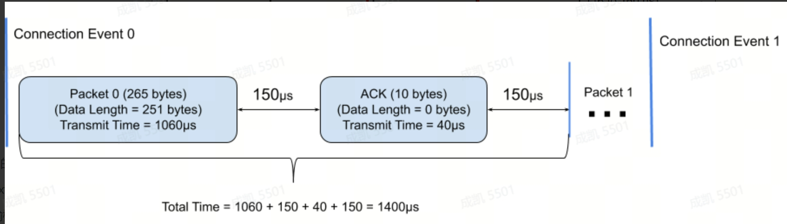

<a id="观察le数据连接间隔"></a>

以7.5ms的连接连接为例，7.5ms/1.4ms = 5.35，（5 * 251B）/ 7.5ms = 167.3KB/s

<a id="bttool测试gatt吞吐"></a>

### 二、bttool测试GATT吞吐

第一步，启动bttool 后的操作步骤如下：

```text
bttool> enable
bttool> gatts register 3
bttool> gatts start 3
bttool> adv start -m legacy -D
```

可参考如下log：

```text
bttool> enable
bttool> [03/13 12:45:42] [10] [cp] [394][adapter-stm]: Process, State=On, Event=SYS_TURN_ON
bttool>
bttool> gatts register 3
[bttool] register service successful, service_id: 3
bttool>
bttool> gatts start 3
bttool> [bttool] gatts add attribute table complete, handle 0x1, status:0
bttool>
bttool> adv start -m legacy -D
[bttool] adv type: legacy
[bttool] Advertising handle:0x2057c8e8
bttool> [bttool] on_advertising_start_cb, handle:0x2057c8e8, adv_id:1, status:0
[03/13 12:46:07] [13] [cp] AdvType:(Flags)
[03/13 12:46:07] [13] [cp] AdvData: (0x2050af8a):
[03/13 12:46:07] [13] [cp] 0000  08                                               .
[03/13 12:46:07] [13] [cp] AdvType:(Manufacturer Specific Data)
[03/13 12:46:07] [13] [cp] AdvData: (0x2050af8d):
[03/13 12:46:07] [13] [cp] 0000  8f 03                                            ..
[03/13 12:46:07] [13] [cp] AdvType:(Complete Local Name)
[03/13 12:46:07] [13] [cp] AdvData: (0x2050af92):
[03/13 12:46:07] [13] [cp] 0000  56 65 6c 61 2d 42 54    
```

第二步，使用手机发现和连接设备：
* 发现'Vela-BT'设备后点击'CONNECT'
* 连接测试设备后使能cccd描述字
* 若是未打开自动确认配对的话，使能cccd描述字会触发配对操作，需要同时在手机和设备上配对确认

可参考如下log：
```text
pair confirm xx:xx:xx:xx:xx:xx 0 1
[bttool] Device [xx:xx:xx:xx:xx:xx] ssp confirmation Accept
bttool> [bttool] Device [xx:xx:xx:xx:xx:xx][BREDR] bond state: BONDED, is_ctkd: 1
[bttool] Device [xx:xx:xx:xx:xx:xx][LE] bond state: BONDED, is_ctkd: 0
[03/13 13:02:34] [12] [cp] [384][bluelet]: link_encryption_state_callback isBRLink: 0, encrypted: 1
[03/13 13:02:35] [12] [cp] [1368][adapter-svc]: adapter_on_le_bonded_device_update
[03/13 13:02:35] [10] [cp] [526][adapter-svc]: DEVICE[xx:xx:xx:xx:xx:xx] LinkKey: 47 | [F61C890E646E82761F6719B350FDA6AD]
[03/13 13:02:35] [10] [cp] [821][adapter-svc]: LE BOND DEVICE[0]: Addr:[xx:xx:xx:xx:xx:xx] Atype:[1] LTK: [B7EE4D046FB572214C378DDB66614D77]
[03/13 13:02:35] [12] [cp] [428][bluelet]: ble_add_resolving_list_callback
[bttool] gatts service TX char ccc changed, addr:xx:xx:xx:xx:xx:xx
[03/13 13:02:35] [15] [cp] new value: (0x20574aa0):
[03/13 13:02:35] [15] [cp] 0000  01 00                                            ..
[03/13 13:02:36] [12] [cp] [384][bluelet]: link_encryption_state_callback isBRLink: 1, encrypted: 1
```

第三步，启动throughput测试：
*  nRF Connect APP调整连接间隔和MTU值
*  bttool中输入以下指令启动throughput测试
  
连接间隔和MTU直接影响throughput测试结果，可根据测试要求调整相应配置。

<a id="检查是否打开dle功能"></a>

### 三、检查是否打开DLE功能

可以在hci log、snoop log、airlog中检查是否打开LE Data Length Extension功能。

#### 1 通过HCI log检查是否支持DLE

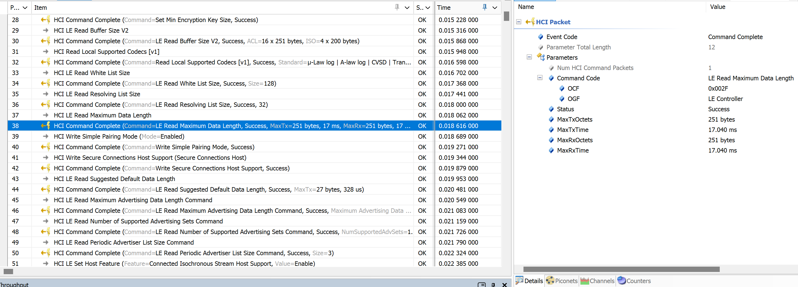

如上图，在初始化阶段，读取本地Feature，是否支持DLE。若是支持，则可以观察在Notification阶段，发送251字节数据包长度。

#### 2 通过Air log检查是否支持DLE


如上图，在BLE连接阶段，可以在链路层请求查询对方Feature，Max 链路层TX和RX数据包是否支持251字节长度。若是支持，则可以观察在Notification阶段，发送251字节数据包长度。

<a id="观察client设备是否发起过exchange-mtu规程"></a>

### 四、观察client设备是否发起过Exchange_MTU规程

#### 1 通过syslog观察client设备是否发起过Exchange_MTU规程

在连接建立完成后，client端一般会主动发起exchange_mtu规程，典型syslog如下：
```
[bttool] gatts_mtu_changed_callback, addr:AA:AA:AA:AA:AA:AA, mtu:514
```
MTU为20时，表示client端未发起exchange_mtu规程，syslog如下：
```
[bttool] gatts_mtu_changed_callback, addr:AA:AA:AA:AA:AA:AA, mtu:20
```

#### 2 通过snoop log观察client设备是否发起过Exchange_MTU规程

典型log如下：


<a id="分析每个连接间隔的最大event数量"></a>

### 五、分析每个连接间隔的最大Event数量

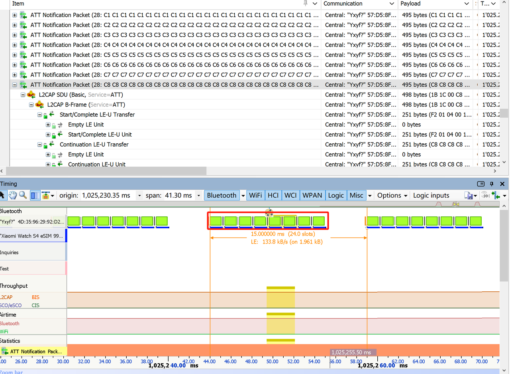

如上图，以连接间隔15ms为例，在一个连接间隔内可最大交互10个Event（15ms/1400us=10.2）

<a id="#六观察当前空口环境是否复杂"></a>

### 六、观察当前空口环境是否复杂

蓝牙使用的2.4GHz ISM频段（2400-2483.5MHz）是免许可的公共频段，广泛用于Wi-Fi、微波炉、ZigBee、无线摄像头等设备。这些设备同时工作时会产生同频干扰，将会破坏数据包的完整性或者丢包现象，最终表现为空口环境中的高重传率。

#### 1 通过snoop log观察当前空口环境是否复杂

可以从图中的粉色柱体看到整个传输过程中的重传率，如下代表信道质量尚可


<a id="使用gatt-over-br数据传输模式"></a>

### 七、使用GATT OVER BR数据传输模式

在经典蓝牙物理连接上传输GATT数据，利用经典蓝牙3M带宽。启动多时隙包3DH5，理论速率可提升到（1021-4-6）/ 0.625 * 6 = 269.6KB/s

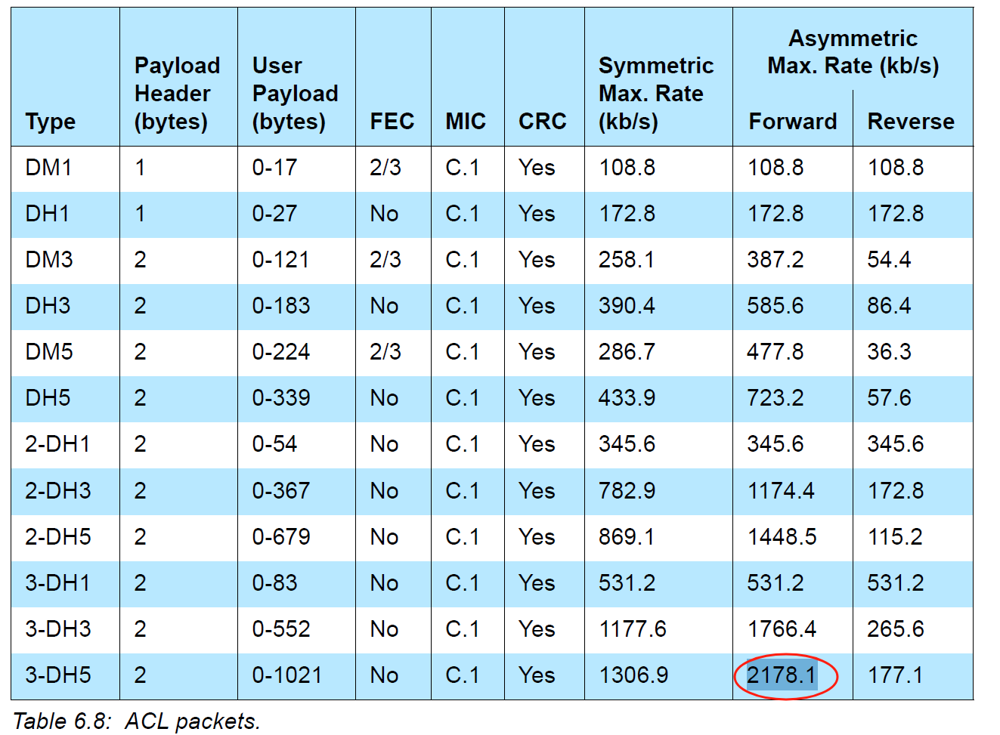

<a id="使用le-coc数据传输模式"></a>

### 八、使用LE COC数据传输模式


from:Bluetooth_5.2_Feature_Overview

ATT传输通道是同步模式，GATT传输使用固定CID=0x04 L2CAP通道，在多个APP请求GATT发送数据可能存在拥塞场景。使用LE COC模式动态建立LE L2CAP通道，避免多APP请求发数据同步延迟。

## 典型问题

### 一、GATT数据传输吞吐不达标

Vela提供GATT吞吐测试工具，可以通过bttool与nRF Connect完成notification或者write through方向吞吐测试。

注意：
* 建议在屏蔽箱环境，避免环境干扰导致重传，影响吞吐有效性。
* 建议关掉本地和对端设备的debug log，避免log刷屏，影响吞吐有效性。

第一步，建议按照[分析GATT理论吞吐](#分析gatt理论吞吐)，计算当前连接参数GATT的理论吞吐，后续测试结果可参考该理论值。

第二步，建议按照[bttool测试GATT吞吐](#bttool测试gatt吞吐)，观察测试结果是否符合预期。不符合预期，则建议按照如下步骤依次排查原因。否则，建议进入第三步。

* 步骤一，建议按照[检查是否打开DLE功能](#检查是否打开dle功能)，确认是否打开DLE功能。
  
* 步骤二，建议按照[观察client设备是否发起过Exchange\_MTU规程](#观察client设备是否发起过exchange-mtu规程)，观察exchange_mtu规程，确认MTU是否为514。
  
* 步骤三，建议按照[分析每个连接间隔的最大Event数量](#分析每个连接间隔的最大event数量)，确认每个连接间隔的event个数是否符合预期，否则，与BTC Vendor进一步确认Controller的行为。

* 步骤四，建议按照方法： [观察当前空口环境是否复杂](#六观察当前空口环境是否复杂)，观察当前空口环境是否复杂。若当前空口环境恶劣导致重传率过高，建议更换环境进行测试验证。

第三步，若是上述分析结果依旧不符合预期，则建议考虑其他方式提高吞吐。比如：LE COC、GATT OVER BR等。

* 若是当前业务支持LE COC通讯，则建议使用COC方案，参考[使用LE COC数据传输模式](#使用le-coc数据传输模式)。
  
* 若是当前业务支持GATT OVER BR通讯，则建议使用GATT OVER BR方案。参考方法：[使用GATT OVER BR数据传输模式](#使用gatt-over-br数据传输模式)。

# 控制拍照问题

## 分析方法

<a id="方法：观察HID通道连接是否成功"></a>

### 一、观察HID通道连接是否成功

#### 1. 通过syslog观察HID通道连接是否成功

如下是典型syslog，通过state字段可以看到HID通道连接成功，其中state字段为1表示连接中，2表示连接成功

```text
[bttool> hidd connect a4:cc:b3:xx:xx:xx
[[bttool] HID device connect host, address:a4:cc:b3:xx:xx:xx
bttool> [bttool] hidd_connection_state_cb, addr:a4:cc:b3:xx:xx:xx, transport: br, state:1
[bttool] hidd_connection_state_cb, addr:a4:cc:b3:xx:xx:xx, transport: br, state:2
```

#### 2. 通过Airlog或者Snoop log观察HID Control L2CAP Channel是否连接成功

如下是典型snoop log，通过蓝色柱体可以看到HID 控制L2CAP Channel连接成功，L2CAP Connection Request和L2CAP Connection Response 对应Channels的连接事件：


#### 3. 通过Airlog或者Snoop log观察HID Interrupt L2CAP Channel是否连接成功

如下是典型snoop log，通过蓝色柱体可以看到HID 中断L2CAP Channel连接成功，L2CAP Connection Request和L2CAP Connection Response 对应Channels的连接事件：

<a id="方法：观察HID通道手表还是手机断开HID通道"></a>

### 二、观察HID通道手表还是手机断开HID通道

#### 1. 通过通过Airlog或者Snoop log观察是否对方断开HID Control或者Interrupt L2CAP Channel

如下是典型snoop log，通过蓝色柱体可以看到HID L2CAP Channel连接断开，L2CAP Disconnection Request和L2CAP Disconnection Response 对应Channels的断开事件：


可以看到，HID L2CAP Channel连接断开，手机端主动发起断开L2CAP通道。

<a id="手机蓝牙设备绑定数量是否超过7个"></a>

### 三、手机蓝牙设备绑定数量是否超过7个

进入设置->蓝牙->手机蓝牙设备，查看手机蓝牙设备绑定数量是否超过7个。若是，则需要解绑手机蓝牙设备。

## 典型问题

<a id="问题：手表无法控制手机拍照"></a>

### 一、手表无法控制手机拍照

通常，可以通过蓝牙服务log、airlog协议流程、协议栈syslog流程、snoop log等方式，观察双方是否有ACL连接、 HID L2CAP连接等，导致无法控制手机拍照。

* [观察HID通道连接是否成功](#方法：观察HID通道连接是否成功)

  * 若是HID L2CAP通道没有连接成功，则打开协议栈syslog，进一步确认手表是否发起HID控制通道建立过程。
  * 若是HID L2CAP通道连接成功，则进一步确认是否是手机端主动断开连接。

* [观察HID通道手表还是手机断开HID通道](#方法：观察HID通道手表还是手机断开HID通道)

  * 若是手表端断开连接，则打开协议栈syslog进一步排查。
  * 若是手机端断开连接，则进一步手机蓝牙设备绑定数量是否超过7个。

* [手机蓝牙设备绑定数量是否超过7个](#三手机蓝牙设备绑定数量是否超过7个)

  * 若是手机蓝牙设备绑定数量超过7个，则需要解绑手机蓝牙设备。
  * 否则，则检查手机端是否支持HID，让手机同学进一步分析。

# 功耗问题

## 分析方法

<a id="方法：观察是否进入Sniff模式"></a>

### 一、观察是否进入Sniff模式

正常情况下，可以通过蓝牙service log、协议栈的syslog、snoop log及空口log观察设备是否进入Sniff模式

#### 1 通过蓝牙service log观察设备进入Sniff模式

```text
[20240906_11:33:55_242]#[01/01 01:19:13] [126] [ DEBUG] [ap] [392][pm_mgr]: pm_request_sniff, peer_addr:XX:XX:XX:D7:B4:85, max:800, min:400, attempt:4, timeout:1

[20240906_11:33:55_302]#[01/01 01:19:13] [126] [ DEBUG] [ap] [784][pm_mgr]: bt_pm_remote_link_mode_changed, addr:XX:XX:XX:D7:B4:85, mode:1, sniff_interval:800
```

#### 2 通过协议栈syslog观察设备进入Sniff模式

```text
[20240906_11:33:55_242]#[01/01 01:19:13] [200] [ DEBUG] [ap] ---->[HCI][Cbk][Reg:1][0x60ba2b51]
[20240906_11:33:55_242]#[01/01 01:19:13] [200] [ DEBUG] [ap]      [OP][Sniff_Mode]
[20240906_11:33:55_242]#[01/01 01:19:13] [200] [ DEBUG] [ap] 
[20240906_11:33:55_242]#------>FSM Func Start<------
[20240906_11:33:55_242]#[01/01 01:19:13] [200] [ DEBUG] [ap] ---->[HCI][CMDN][P:0,$:1][+Sniff_Mode]
[20240906_11:33:55_242]#[01/01 01:19:13] [200] [ DEBUG] [ap] ---->[HCI][*Send][AID:0,PLen:10][Sniff_Mode]
[20240906_11:33:55_242]#[01/01 01:19:13] [200] [ DEBUG] [ap]      [connection_handle:2050 | 02,08]
[20240906_11:33:55_242]#[01/01 01:19:13] [200] [ DEBUG] [ap]      [sniff_max_interval:0x320 * 0.625 = 500.00ms | 20,03]
[20240906_11:33:55_242]#[01/01 01:19:13] [200] [ DEBUG] [ap]      [sniff_min_interval:0x190 * 0.625 = 250.00ms | 90,01]
[20240906_11:33:55_242]#[01/01 01:19:13] [200] [ DEBUG] [ap]      [sniff_attempt:0x4 * 1.250 = 5.00ms | 04,00]
[20240906_11:33:55_242]#[01/01 01:19:13] [200] [ DEBUG] [ap]      [sniff_timeout:0x1 * 1.250 = 1.25ms | 01,00]
[20240906_11:33:55_242]#[01/01 01:19:13] [200] [ DEBUG] [ap] [HCI][*Send][Command]: 4+10=14
[20240906_11:33:55_252]#[01/01 01:19:13] [200] [ DEBUG] [ap] 0000: 01 03 08 0A 02 08 20 03 90 01 04 00 01 00         ...... .......  
[20240906_11:33:55_262]#[01/01 01:19:13] [200] [ DEBUG] [ap] clk enable ret 1
[20240906_11:33:55_262]#[01/01 01:19:13] [200] [ DEBUG] [ap] clk_enable
[20240906_11:33:55_262]#[01/01 01:19:13] [126] [ DEBUG] [ap] [HCI][*Recv][Event]: 3+4=7
[20240906_11:33:55_262]#[01/01 01:19:13] [126] [ DEBUG] [ap] 0000: 04 0F 04 00 01 03 08                              .......         
[20240906_11:33:55_262]#[01/01 01:19:13] [200] [ DEBUG] [ap] 
[20240906_11:33:55_262]#------>FSM Func Start<------
[20240906_11:33:55_262]#[01/01 01:19:13] [200] [ DEBUG] [ap] ---->[HCI][*Recv][AID:0,PLen:4][Command_Status]
[20240906_11:33:55_262]#[01/01 01:19:13] [200] [ DEBUG] [ap]      [status:OK | 00]
[20240906_11:33:55_262]#[01/01 01:19:13] [200] [ DEBUG] [ap]      [num_hci_command_packets:01 | 01]
[20240906_11:33:55_272]#[01/01 01:19:13] [200] [ DEBUG] [ap]      [command_opcode:Sniff_Mode]
[20240906_11:33:55_282]#[01/01 01:19:13] [126] [ DEBUG] [ap] [HCI][*Recv][Event]: 3+6=9
[20240906_11:33:55_282]#[01/01 01:19:13] [126] [ DEBUG] [ap] 0000: 04 14 06 00 02 08 02 20 03                        ....... .       
[20240906_11:33:55_282]#[01/01 01:19:13] [200] [ DEBUG] [ap] 
[20240906_11:33:55_282]#------>FSM Func Start<------
[20240906_11:33:55_282]#[01/01 01:19:13] [200] [ DEBUG] [ap] ---->[HCI][*Recv][AID:0,PLen:6][Mode_Change]
[20240906_11:33:55_282]#[01/01 01:19:13] [200] [ DEBUG] [ap]      [status:OK | 00]
[20240906_11:33:55_292]#[01/01 01:19:13] [200] [ DEBUG] [ap]      [connection_handle:2050 | 02,08]
[20240906_11:33:55_292]#[01/01 01:19:13] [200] [ DEBUG] [ap]      [current_mode:Sniff | 02]
[20240906_11:33:55_292]#[01/01 01:19:13] [200] [ DEBUG] [ap]      [interval:0x320 * 0.625 = 500.00ms | 20,03]
[20240906_11:33:55_292]#[01/01 01:19:13] [200] [ DEBUG] [ap] ---->[HCI][CMDN][P:1,$:1][-Sniff_Mode][status:OK | 00]
[20240906_11:33:55_292]#[01/01 01:19:13] [200] [ DEBUG] [ap]      [Mode_Change][T:0x61c81320]
```

#### 3 通过snoop log观察设备进入Sniff模式
#### 4 通过空口log观察设备进入Sniff

<a id="方法：观察是否退出Sniff模式"></a>

### 二、观察是否退出Sniff模式

正常情况下，可以通过蓝牙service log、协议栈的syslog、snoop log及空口log观察设备是否退出Sniff模式

#### 1 通过蓝牙service log观察设备退出Sniff模式

```text
[20240909_15:56:55_246]#[09/09 07:56:52] [26] [ DEBUG] [ap] [420][pm_mgr]: pm_request_active, peer_addr:XX:XX:XX:XX:B4:85

[20240909_15:56:55_338]#[09/09 07:56:02] [26] [ DEBUG] [ap] [784][pm_mgr]: bt_pm_remote_link_mode_changed, addr:XX:XX:XX:XX:B4:85, mode:0, sniff_interval:0
```

#### 2 通过协议栈syslog观察设备退出Sniff模式

```text
[20240913_11:54:44_358]#[09/13 03:54:43] [14] [cp] 
[20240913_11:54:44_358]#------>FSM Func Start<------
[20240913_11:54:44_358]#[09/13 03:54:43] [14] [cp] ---->[HCI][Cbk][Reg:1][0x14102341]
[20240913_11:54:44_358]#[09/13 03:54:43] [14] [cp]      [OP][Exit_Sniff_Mode]
[20240913_11:54:44_358]#[09/13 03:54:43] [14] [cp] 
[20240913_11:54:44_358]#------>FSM Func Start<------
[20240913_11:54:44_362]#[09/13 03:54:43] [14] [cp] ---->[HCI][CMDN][P:0,$:1][+Exit_Sniff_Mode]
[20240913_11:54:44_366]#[09/13 03:54:43] [14] [cp] ---->[HCI][*Send][AID:0,PLen:2][Exit_Sniff_Mode]
[20240913_11:54:44_366]#[09/13 03:54:43] [14] [cp]      [connection_handle:0129 | 81,00]
[20240913_11:54:44_366]#[09/13 03:54:43] [14] [cp] [HCI][*Send][Command]: 4+2=6
[20240913_11:54:44_366]#[09/13 03:54:43] [14] [cp] 0000: 01 04 08 02 81 00                                 ......          
[20240913_11:54:44_366]#[09/13 03:54:44] [14] [cp] 
[20240913_11:54:44_366]#------>FSM Func Start<------
[20240913_11:54:44_366]#[09/13 03:54:44] [14] [cp] ---->[HCI][CMDN][P:1,$:0][+Exit_Sniff_Mode]
[20240913_11:54:44_370]#[09/13 03:54:44] [14] [cp] ---->[HCI][TXQOS][0x430081|L|62][Tail][NewIn][Num:0]
[20240913_11:54:44_370]#[09/13 03:54:44] [10] [cp] [HCI][*Recv][Event]: 3+4=7
[20240913_11:54:44_370]#[09/13 03:54:44] [10] [cp] 0000: 04 0F 04 00 05 04 08                              .......         
[20240913_11:54:44_374]#[09/13 03:54:44] [14] [cp] 
[20240913_11:54:44_374]#------>FSM Func Start<------
[20240913_11:54:44_374]#[09/13 03:54:44] [14] [cp] ---->[HCI][*Recv][AID:0,PLen:4][Command_Status]
[20240913_11:54:44_374]#[09/13 03:54:44] [14] [cp]      [status:OK | 00]
[20240913_11:54:44_378]#[09/13 03:54:44] [14] [cp]      [num_hci_command_packets:05 | 05]
[20240913_11:54:44_386]#[09/13 03:54:44] [14] [cp]      [command_opcode:Exit_Sniff_Mode]

[20240913_11:54:44_739]#[09/13 03:54:44] [10] [cp] [HCI][*Recv][Event]: 3+6=9
[20240913_11:54:44_739]#[09/13 03:54:44] [10] [cp] 0000: 04 14 06 00 81 00 00 00 00                        .........       
[20240913_11:54:44_743]#[09/13 03:54:44] [14] [cp] 
[20240913_11:54:44_747]#------>FSM Func Start<------
[20240913_11:54:44_747]#[09/13 03:54:44] [14] [cp] ---->[HCI][*Recv][AID:0,PLen:6][Mode_Change]
[20240913_11:54:44_747]#[09/13 03:54:44] [14] [cp]      [status:OK | 00]
[20240913_11:54:44_747]#[09/13 03:54:44] [14] [cp]      [connection_handle:0129 | 81,00]
[20240913_11:54:44_747]#[09/13 03:54:44] [14] [cp]      [current_mode:Active | 00]
[20240913_11:54:44_747]#[09/13 03:54:44] [14] [cp]      [interval:0x0 * 0.625 = 0.00ms | 00,00]
[20240913_11:54:44_747]#[09/13 03:54:44] [14] [cp] ---->[HCI][CMDN][P:2,$:1][Pend:Exit_Sniff_Mode][-Exit_Sniff_Mode][status:OK | 00]
[20240913_11:54:44_747]#[09/13 03:54:44] [14] [cp]      [Mode_Change][T:0x2059f160]   
```

#### 3 通过snoop log观察设备退出Sniff模式

#### 4 通过空口log观察设备退出Sniff

<a id="方法：查找当前Profile工作状态的Sniff允许参数"></a>

### 三、查找当前Profile工作状态的Sniff允许参数

Vela支持如下各Profile的Sniff场景管理，其中每个Profile对应8种状态，每个状态对应的Sniff参数允许模式如下定义。

```c
static const bt_pm_spec_table_t g_pm_spec[] = {
    /* HF AG: 0(BT_PM_SPEC_INDEX_0) */
    { (BT_PM_SNIFF), /* allow sniff */
        (0), /* the SSR entry */
        {
            { BT_PM_SNIFF, 7000 }, /* conn open */
            { BT_PM_NO_PREF, 0 }, /* conn close  */
            { BT_PM_NO_ACTION, 0 }, /* app open */
            { BT_PM_NO_ACTION, 0 }, /* app close */
            { BT_PM_SNIFF3, 7000 }, /* sco open */
            { BT_PM_SNIFF, 7000 }, /* sco close */
            { BT_PM_SNIFF, 7000 }, /* idle */
            { BT_PM_ACTIVE, 0 } /* busy */
        } },

    /* AV: 1(BT_PM_SPEC_INDEX_1) */
    { (BT_PM_SNIFF), /* allow sniff */
        (0), /* the SSR entry */
        {
            { BT_PM_SNIFF, 7000 }, /* conn open */
            { BT_PM_NO_PREF, 0 }, /* conn close */
            { BT_PM_NO_ACTION, 0 }, /* app open */
            { BT_PM_NO_ACTION, 0 }, /* app close */
            { BT_PM_NO_ACTION, 0 }, /* sco open */
            { BT_PM_NO_ACTION, 0 }, /* sco close */
            { BT_PM_SNIFF, 7000 }, /* idle */
            { BT_PM_ACTIVE, 0 } /* busy */
        } },

    /* SPP: 2(BT_PM_SPEC_INDEX_2) */
    { (BT_PM_SNIFF), /* allow sniff */
        (0), /* the SSR entry */
        {
            { BT_PM_ACTIVE, 0 }, /* conn open */
            { BT_PM_NO_PREF, 0 }, /* conn close */
            { BT_PM_ACTIVE, 0 }, /* app open */
            { BT_PM_NO_ACTION, 0 }, /* app close */
            { BT_PM_NO_ACTION, 0 }, /* sco open */
            { BT_PM_NO_ACTION, 0 }, /* sco close */
            { BT_PM_SNIFF, 1000 }, /* idle */
            { BT_PM_ACTIVE, 0 } /* busy */
        } },

    /* PAN: 3(BT_PM_SPEC_INDEX_3) */
    { (BT_PM_SNIFF), /* allow sniff */
        (0), /* the SSR entry */
        {
            { BT_PM_ACTIVE, 0 }, /* conn open */
            { BT_PM_NO_PREF, 0 }, /* conn close */
            { BT_PM_ACTIVE, 0 }, /* app open */
            { BT_PM_NO_ACTION, 0 }, /* app close */
            { BT_PM_NO_ACTION, 0 }, /* sco open */
            { BT_PM_NO_ACTION, 0 }, /* sco close */
            { BT_PM_SNIFF, 5000 }, /* idle */
            { BT_PM_ACTIVE, 0 } /* busy */
        } },

    /* HID: 4(BT_PM_SPEC_INDEX_4) */
    { (BT_PM_SNIFF), /* allow sniff */
        (0), /* the SSR entry */
        {
            { BT_PM_SNIFF, 5000 }, /* conn open */
            { BT_PM_NO_PREF, 0 }, /* conn close */
            { BT_PM_NO_ACTION, 0 }, /* app open */
            { BT_PM_NO_ACTION, 0 }, /* app close */
            { BT_PM_NO_ACTION, 0 }, /* sco open */
            { BT_PM_NO_ACTION, 0 }, /* sco close */
            { BT_PM_SNIFF2, 5000 }, /* idle */
            { BT_PM_SNIFF4, 200 } /* busy */
        } },
};
```

Vela一共定义7种Sniff模式，各种Sniff mode对应的Interval、Attempt和Timeout参数如下表，其中mode越高表示Sniff间隔越短。

```c
#ifndef BT_PM_SNIFF_MAX
#define BT_PM_SNIFF_MAX 800
#define BT_PM_SNIFF_MIN 400
#define BT_PM_SNIFF_ATTEMPT 4
#define BT_PM_SNIFF_TIMEOUT 1
#endif

#ifndef BT_PM_SNIFF1_MAX
#define BT_PM_SNIFF1_MAX 400
#define BT_PM_SNIFF1_MIN 200
#define BT_PM_SNIFF1_ATTEMPT 4
#define BT_PM_SNIFF1_TIMEOUT 1
#endif

#ifndef BT_PM_SNIFF2_MAX
#define BT_PM_SNIFF2_MAX 54
#define BT_PM_SNIFF2_MIN 30
#define BT_PM_SNIFF2_ATTEMPT 4
#define BT_PM_SNIFF2_TIMEOUT 1
#endif

#ifndef BT_PM_SNIFF3_MAX
#define BT_PM_SNIFF3_MAX 150
#define BT_PM_SNIFF3_MIN 50
#define BT_PM_SNIFF3_ATTEMPT 4
#define BT_PM_SNIFF3_TIMEOUT 1
#endif

#ifndef BT_PM_SNIFF4_MAX
#define BT_PM_SNIFF4_MAX 18
#define BT_PM_SNIFF4_MIN 10
#define BT_PM_SNIFF4_ATTEMPT 4
#define BT_PM_SNIFF4_TIMEOUT 1
#endif

#ifndef BT_PM_SNIFF5_MAX
#define BT_PM_SNIFF5_MAX 36
#define BT_PM_SNIFF5_MIN 30
#define BT_PM_SNIFF5_ATTEMPT 2
#define BT_PM_SNIFF5_TIMEOUT 0
#endif

#ifndef BT_PM_SNIFF6_MAX
#define BT_PM_SNIFF6_MAX 18
#define BT_PM_SNIFF6_MIN 14
#define BT_PM_SNIFF6_ATTEMPT 1
#define BT_PM_SNIFF6_TIMEOUT 0
#endif
```

<a id="方法：对方优先请求进入Sniff优先级高于本地"></a>

### 四、对方优先请求进入Sniff优先级高于本地

本地和对方均可以主动发起请求进入Sniff模式，可以通过上述“分析方法：观察是否进入Sniff模式”章节，若是对方优先调度请求进入Sniff，当Controller协商通过时，设备Sniff参数以对方发起协商为准。

```c
void bt_pm_remote_link_mode_changed(bt_address_t* addr, uint8_t mode, uint16_t sniff_interval)
{
    bt_pm_device_t* device;
    bt_pm_manager_t* manager = &g_pm_manager;

    BT_LOGD("%s, addr:%s, mode:%d, sniff_interval:%" PRId16, __func__, bt_addr_str(addr), mode, sniff_interval);
    
    ......
   
    switch (mode) {
    case BT_LINK_MODE_ACTIVE: {
        pm_stop_timer(addr);
        pm_mode_request(addr, BT_PM_RESTART, manager->last_profile_id);
    } break;
    case BT_LINK_MODE_SNIFF: { //对方进入sniff，则暂停本地Sniff调度
        pm_stop_timer(addr); 
    } break;
    default:
        break;
    }
}
```

<a id="方法：对方优先请求退出Sniff优先级低于本地"></a>

### 五、对方优先请求退出Sniff优先级低于本地

本地和对方均可以主动发起请求进入Sniff模式，可以通过上述“分析方法：观察是否退出Sniff模式”章节，若是对方优先调度请求退出Sniff，当Controller协商通过，设备进入Active模式后，重新请求调度本地Sniff状态。

```c
void bt_pm_remote_link_mode_changed(bt_address_t* addr, uint8_t mode, uint16_t sniff_interval)
{
    bt_pm_device_t* device;
    bt_pm_manager_t* manager = &g_pm_manager;

    BT_LOGD("%s, addr:%s, mode:%d, sniff_interval:%" PRId16, __func__, bt_addr_str(addr), mode, sniff_interval);
    
    ......
   
    switch (mode) {
    case BT_LINK_MODE_ACTIVE: { //若是对方请求退出Sniff，则本地请求重新调度
        pm_stop_timer(addr);
        pm_mode_request(addr, BT_PM_RESTART, manager->last_profile_id);
    } break;
    case BT_LINK_MODE_SNIFF: {
        pm_stop_timer(addr); 
    } break;
    default:
        break;
    }
}
```

<a id="功耗典型问题"></a>

## 典型问题

<a id="问题-设备经典蓝牙连接设备功耗异常"></a>

### 一、设备经典蓝牙连接设备功耗异常
一般情况下，设备在连接状态下，若是设备未发送数据，会进入Sniff模式。若是设备正在发送数据，则会进入Active模式。设备功耗异常，我们需要确认是否在Sniff模式，以及Sniff参数是否符合预期。

Sniff间隔越大，功耗越低，但会导致设备响应变慢。反之，Sniff间隔越小，功耗越高，但会导致设备响应变快。因此，我们需要根据实际场景，选择合适的Sniff间隔。

第一步检查设备Sniff状态，确认是否进入Sniff模式。若是未进入Sniff模式，请按照如下步骤进一步分析。否则，进入第二步骤检查设备Sniff参数是否合理。
* [方法：观察是否进入Sniff模式](#方法：观察是否进入Sniff模式)
  * 若是设备未进入Sniff模式，请进一步确认当前是否正在发送数据，比如：听歌、SPP传数据等操作。
  * 否则，建议按照如下步骤进一步分析。

第二步检查设备Sniff参数是否合理。依据当前Profile工作状态，查找当前Profile工作状态的Sniff允许参数。
* [方法：查找当前Profile工作状态的Sniff允许参数](#方法：查找当前Profile工作状态的Sniff允许参数)
  * 若是Sniff参数异常，建议进一步确认，当前是否有其他Profile连接影响，比如在待机场景下，若是HID的处于连接状态，则Sniff优先级高于SPP的Sniff参数，导致待机功耗增加。
  * 否则,建议按照如下步骤进一步分析。

* [方法：对方优先请求进入Sniff优先级高于本地](#方法：对方优先请求进入Sniff优先级高于本地)
  * 若是对方请求进入Sniff，并且Sniff参数更严格，则会导致当前连接状态下，功耗异常。
  * 否则,建议按照如下步骤进一步分析。