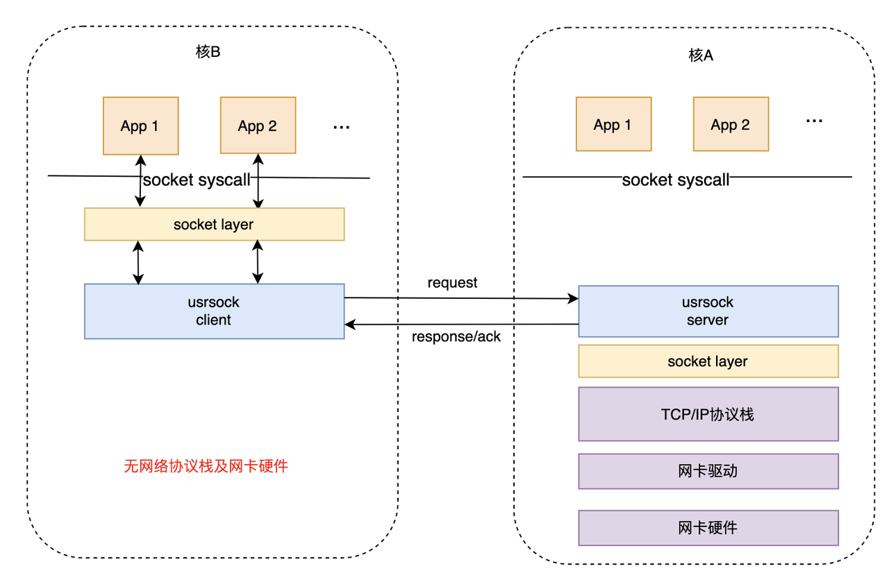

# 网络协议栈简介

\[ [English](../../../../../en/device_dev_guide/connection/network/protocol_stack/NetProtocolStackIntro.md) | 简体中文 \]

## 一、简介

### 1、OS 网络协议栈的功能

OS 网络协议栈主要用于处理网络通信过程中涉及的二层、三层和四层协议。以下是 OSI 七层网络模型与 TCP/IP 四层模型的对比，以及它们在网络通信中的对应协议：

<table>
  <thead>
    <tr>
      <th>TCP/IP 四层模型</th>
      <th>OSI 七层模型</th>
      <th>对应网络协议举例</th>
    </tr>
  </thead>
  <tbody>
    <tr>
      <td rowspan="3"><b>应用层</b></td>
      <td>应用层</td>
      <td>HTTP, FTP, SMTP, DNS, Telnet</td>
    </tr>
    <tr>
      <td>表示层</td>
      <td>JPEG, ASCII, TLS, SSL</td>
    </tr>
    <tr>
      <td>会话层</td>
      <td>RPC, NetBIOS</td>
    </tr>
    <tr>
      <td><b>传输层</b></td>
      <td>传输层</td>
      <td>TCP, UDP</td>
    </tr>
    <tr>
      <td><b>网络层</b></td>
      <td>网络层</td>
      <td>IP, ICMP, ARP, RARP</td>
    </tr>
    <tr>
      <td rowspan="2"><b>网络接口层</b></td>
      <td>数据链路层</td>
      <td>Ethernet (以太网), PPP, SLIP</td>
    </tr>
    <tr>
      <td>物理层</td>
      <td>电缆, 集线器 (Hub), 中继器</td>
    </tr>
  </tbody>
</table>

### 2、openvela 网络协议栈的能力

openvela 网络协议栈提供了从驱动到用户态的全栈网络通信能力，支持多种协议和工具。以下是其核心功能的示意图：



### 3、用户态接口

Socket 接口是网络通信的核心，openvela 网络协议栈支持标准的 POSIX Socket 接口，用于实现高效的用户态网络通信。以下是常用的 Socket 接口函数及其功能说明。

```C
int socket(int domain, int type, int protocol);
int socketpair(int domain, int type, int protocol, int sv[2]);
int bind(int sockfd, FAR const struct sockaddr *addr, socklen_t addrlen);
int connect(int sockfd, FAR const struct sockaddr *addr, socklen_t addrlen);

int listen(int sockfd, int backlog);
int accept(int sockfd, FAR struct sockaddr *addr, FAR socklen_t *addrlen);
int accept4(int sockfd, FAR struct sockaddr *addr, FAR socklen_t *addrlen,
            int flags);

ssize_t send(int sockfd, FAR const void *buf, size_t len, int flags);
ssize_t sendto(int sockfd, FAR const void *buf, size_t len, int flags,
               FAR const struct sockaddr *to, socklen_t tolen);

ssize_t recv(int sockfd, FAR void *buf, size_t len, int flags);
ssize_t recvfrom(int sockfd, FAR void *buf, size_t len, int flags,
                 FAR struct sockaddr *from, FAR socklen_t *fromlen);

int shutdown(int sockfd, int how);

int ioctl(int fd, int req, ...);

int setsockopt(int sockfd, int level, int option,
               FAR const void *value, socklen_t value_len);
int getsockopt(int sockfd, int level, int option,
               FAR void *value, FAR socklen_t *value_len);

int getsockname(int sockfd, FAR struct sockaddr *addr,
                FAR socklen_t *addrlen);
int getpeername(int sockfd, FAR struct sockaddr *addr,
                FAR socklen_t *addrlen);

ssize_t recvmsg(int sockfd, FAR struct msghdr *msg, int flags);
ssize_t sendmsg(int sockfd, FAR struct msghdr *msg, int flags);

int poll(FAR struct pollfd *fds, nfds_t nfds, int timeout);
int select(int nfds, FAR fd_set *readfds, FAR fd_set *writefds,
           FAR fd_set *exceptfds, FAR struct timeval *timeout);
```

## 二、协议栈基础能力

openvela 网络协议栈支持多种网络层和传输层协议，包括 IPv4、IPv6、TCP、UDP 和 ICMP，为开发者提供全面的网络通信能力。以下是各协议的功能简要介绍。

### 1、IPv4 / IPv6 能力

openvela 网络协议栈同时支持 IPv4 和 IPv6 协议，并提供以下扩展功能：

- ARP 和 NDP 协议。
- DHCP/DHCPv6：支持 DHCP 客户端和服务器功能。
- 分片支持：支持 IPv4 分片和 IPv6 分片功能。
- 6LoWPAN：支持低功耗无线个域网协议。
- 多地址支持：单张网卡可配置多个 IPv6 地址。
- IPv6 自动配置：支持接收和发送 IPv6 路由通告（Router Advertisement），可自动配置自身 IPv6 地址，并作为路由器为其他设备提供前缀。

### 2、TCP 能力

openvela 网络协议栈支持在 IPv4 和 IPv6 上运行 TCP 协议，并提供以下功能：

- 标准 socket 接口支持：
    - 提供 `bind`、`listen`、`connect`、`accept`、`send`、`recv`、`shutdown`、`poll` 等标准 POSIX Socket 接口。
- TCP 特性支持：
    - Backlog：支持连接队列的管理。
    - Keepalive：支持 TCP 保活机制。
    - SACK / Delayed ACK：支持选择性确认（SACK）和延迟确认（Delayed ACK）。
    - Send / Recv Buffer：支持发送和接收缓冲区管理。
    - Fast Retransmit：支持快速重传机制。
    - Zero Window Probe：支持零窗口探测功能。
    - 拥塞控制算法：支持 New Reno 拥塞控制算法。
    - RTT 估算：支持往返时间（RTT）估算功能。

### 3、UDP / ICMP / ICMPv6 能力

openvela 网络协议栈支持 UDP、ICMP 和 ICMPv6 协议，具体功能如下：

#### UDP 能力

- 标准 Socket 接口支持：
    - 提供 `bind`、`listen`、`connect`、`send`、`recv`、`poll` 等标准 POSIX Socket 接口。
- UDP 特性支持：
    - Recv Buffer：支持接收缓冲区管理。
    - Multicast & Broadcast：支持组播和广播功能。
    - Bind to Device：支持绑定到特定设备的功能。

#### ICMP / ICMPv6 能力

- ICMP 报文支持：
    - 在适当时机发送 ICMP 和 ICMPv6 报文，例如：
        - 对 ECHO 请求（如 ping）进行响应。
        - 对 TTL（生存时间）过期的报文进行回复。
        - 对不可达的地址或端口发送错误报文。

## 三、协议栈进阶能力

openvela 网络协议栈除了基础的网络通信能力外，还提供了一系列进阶功能，适用于多核架构、复杂路由场景以及高性能网络需求。以下是进阶能力的详细介绍。

### 1、Usrsock 代理能力

Rpmsg Usrsock 是 openvela 实现的一种代理机制，用于将用户态的套接字操作通过 RPMsg 等方式代理到 Server 侧执行。它分为 Client 侧和 Server 侧，分别负责请求转发和实际处理。如下图所示：



#### 工作原理

- Usrsock Client 侧：
    - 用户态程序的所有套接字操作（如 `send`、`recv` 等）都会通过 RPMsg 等代理方式转发到 Server 侧。
- Usrsock Server 侧：
    - 负责实际处理套接字操作。
    - 将 Client 侧传递的套接字参数应用到 Server 侧的网络协议栈中，完成操作。

#### 应用场景

- 多核 openvela 产品：
    - 在多核设备中，通过 RPMsg 实现 Usrsock，仅在一个 openvela 实例上运行网络协议栈，其他核通过代理访问网络功能。
- 模拟器上网：
    - 在模拟器环境中，通过直接系统调用实现 Usrsock，相当于 openvela 内部的应用程序调用宿主 Linux 的套接字接口。

### 2、路由与转发能力

当设备具有多张网卡时，openvela 网络协议栈提供了强大的路由和转发功能，支持复杂的网络拓扑和高效的报文处理。

- 基础转发能力：
    - 当设备收到目标地址非本机的 IP 报文时，可在网卡间转发报文。
    - 转发时会将报文的 TTL（生存时间）减 1，并从其他网卡发出。
- 路由表及最长前缀匹配：
    - 支持基于路由表的转发，采用最长前缀匹配算法选择最佳路由。
- 错误处理与 ICMP 报文：
    - 遇到错误时发送 ICMP 和 ICMPv6 报文，例如：
        - TTL 过期：当报文的 TTL 减为 0 时发送错误报文。
        - 地址不可达：当目标地址不可达时发送错误报文。
- IPv4/IPv6 NAT 支持：
    - 提供类似 Linux iptables 的 NAT（网络地址转换）功能，支持 IPv4 和 IPv6。

### 3、其他高级能力

openvela 网络协议栈还支持以下高级功能，满足高性能和复杂网络需求：

- 零拷贝（Zero-Copy）：
    - 支持定长缓冲区的零拷贝（IOB Offloading）。
    - 即将支持变长缓冲区的零拷贝功能，进一步提升性能。
- GRO/GSO：
    - GRO（Generic Receive Offload）：减少接收端的协议栈处理开销。
    - GSO（Generic Segmentation Offload）：减少发送端的分段处理开销。
- 防火墙：
    - 提供基础防火墙功能，用于过滤和管理网络流量。
- VLAN 支持：
    - 支持虚拟局域网（VLAN）功能，适用于复杂网络拓扑。

## 四、驱动接口

Netdev 是 openvela 网络协议栈的驱动接口层，负责连接网络协议栈与底层硬件驱动。通过标准化的接口，Netdev 提供了灵活的网络设备管理能力，包括设备的注册、数据收发、无线网络操作等。

```C
typedef struct iob_s netpkt_t;

struct netdev_ops_s
{
  int (*ifup)(FAR struct netdev_lowerhalf_s *dev);
  int (*ifdown)(FAR struct netdev_lowerhalf_s *dev);

  int (*transmit)(FAR struct netdev_lowerhalf_s *dev, FAR netpkt_t *pkt);
  FAR netpkt_t *(*receive)(FAR struct netdev_lowerhalf_s *dev);

  int (*addmac)(FAR struct netdev_lowerhalf_s *dev, FAR const uint8_t *mac);
  int (*rmmac)(FAR struct netdev_lowerhalf_s *dev, FAR const uint8_t *mac);
  int (*ioctl)(FAR struct netdev_lowerhalf_s *dev, int cmd, unsigned long arg);
}

typedef int (*iw_handler_rw)(FAR struct netdev_lowerhalf_s *dev,
                             FAR struct iwreq *iwr, bool set);
typedef int (*iw_handler_ro)(FAR struct netdev_lowerhalf_s *dev,
                             FAR struct iwreq *iwr);

struct wireless_ops_s
{
  int (*connect)(FAR struct netdev_lowerhalf_s *dev);
  int (*disconnect)(FAR struct netdev_lowerhalf_s *dev);

  iw_handler_rw essid;
  iw_handler_rw bssid;
  iw_handler_rw passwd;
  iw_handler_rw mode;
  iw_handler_rw auth;
  iw_handler_rw freq;
  iw_handler_rw bitrate;
  iw_handler_rw txpower;
  iw_handler_rw country;
  iw_handler_rw sensitivity;
  iw_handler_rw scan;
  iw_handler_ro range;
};

struct netdev_lowerhalf_s
{
  FAR const struct netdev_ops_s *ops;
  FAR const struct wireless_ops_s *iw_ops;
  int quota[NETPKT_TYPENUM]; /* Max # of buffer held by driver */

  ...
};

int netdev_lower_register(FAR struct netdev_lowerhalf_s *dev,
                          enum net_lltype_e lltype);
int netdev_lower_unregister(FAR struct netdev_lowerhalf_s *dev);
int netdev_lower_carrier_on(FAR struct netdev_lowerhalf_s *dev);
int netdev_lower_carrier_off(FAR struct netdev_lowerhalf_s *dev);

void netdev_lower_rxready(FAR struct netdev_lowerhalf_s *dev);
void netdev_lower_txdone(FAR struct netdev_lowerhalf_s *dev);
```

## 五、特殊网卡支持

openvela 网络协议栈支持多种特殊网卡，适用于虚拟化和嵌入式场景。以下是支持的特殊网卡类型：

- RNDIS（远程网络驱动接口规范）。
- CDCNCM（USB 通信设备类 - 网络控制模型）。
- CDCMBIM（USB 通信设备类 - 多路广播接口模型）。
- SLIP（串行线路 IP）。
- TUN（虚拟网络设备）。
- VirtIO-Net（虚拟化网络设备）。
