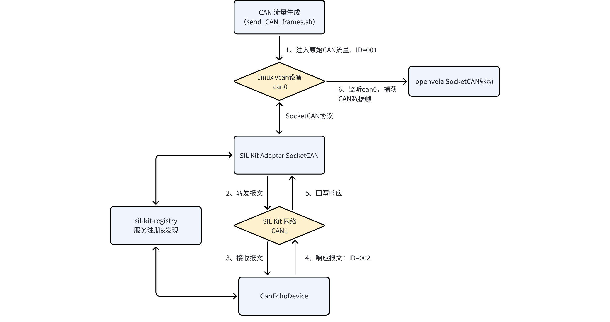
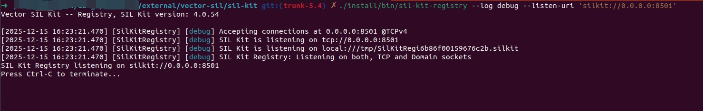
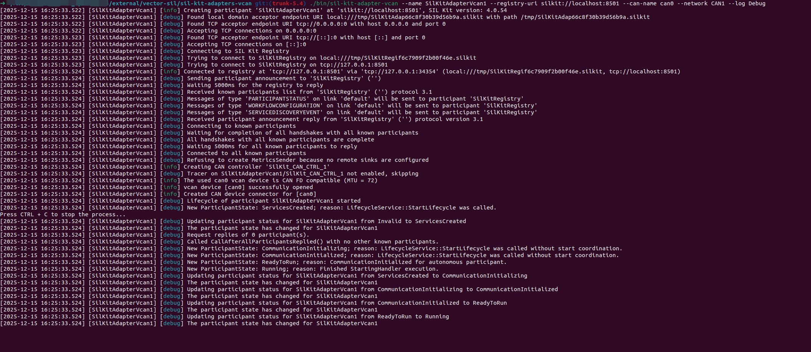
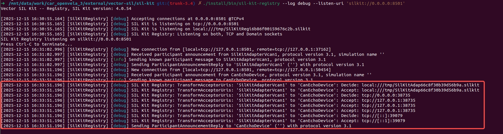
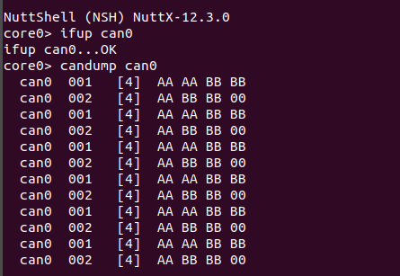

# SIL SocketCAN 功能测试指南

[ [English](../../../../../en/device_dev_guide/connection/network/socketcan/sil_socketcan_test.md) | 简体中文 ]

## 一、概述

本指南旨在演示如何在软件在环 (SIL) 环境下，使用 openvela 进行 SocketCAN 功能测试。

通过本示例，您将构建并运行 Vector SIL Kit 工具链，打通 Linux 主机的虚拟 CAN 接口 (vcan) 与 openvela 仿真目标机，实现 CAN 报文的发送、接收与回环响应测试。

## 二、测试架构与原理

在执行具体操作前，理解各个组件之间的关系和数据流向至关重要。

### 1、核心组件说明

本测试方案涉及四个核心组件，它们共同构成了一个闭环测试环境：

| **组件名称**             | **类型**        | **功能说明**                                                                                                          |
| :----------------------- | :-------------- | :-------------------------------------------------------------------------------------------------------------------- |
| **openvela**             | OS / SUT        | 运行于模拟环境中的嵌入式操作系统（被测系统），通过 SocketCAN 接口监控网络流量。                                       |
| **SIL** **Kit Registry** | Infrastructure  | SIL Kit 网络的“指挥塔”，负责服务发现和协调各个参与者（Participants）的连接。                                          |
| **SIL Kit Adapter**      | Bridge          | **连接器**。它一端连接 Linux 内核的 vcan设备`can0` ，另一端连接虚拟的 SIL Kit 网络，实现两个异构网络间的报文转发。    |
| **Echo Device**          | Simulation Node | **测试节点**。运行在 SIL Kit 网络上的虚拟设备，用于模拟外部 ECU。它会自动响应接收到的报文，用于验证通信链路是否通畅。 |

### 2、架构与数据流向图



**数据流向解析：**

1. **注入**：脚本向 Linux `can0` 发送 ID 为 `001` 的原始报文。
2. **桥接**：`SIL Kit Adapter` 从 `can0` 捕获该报文，将其封装并转发至 SIL Kit 虚拟总线。
3. **处理**：`Echo Device` 从虚拟总线上收到报文，进行处理（ID+1，数据位移）。
4. **响应**：`Echo Device` 将处理后的 ID `002` 报文发回虚拟总线。
5. **回写**：`SIL Kit Adapter` 收到响应报文，将其解包并写入 Linux `can0`。
6. **验证**：`openvela` 始终监听 `can0`，因此能同时捕获到原始报文（001）和响应报文（002）。

## 三、前置准备

在开始之前，请确保您的开发主机 (Ubuntu) 已满足以下要求。

### 1、基础环境搭建

请参照官方文档[快速入门（Ubuntu）](../quickstart/openvela_ubuntu_quick_start.md)，完成 openvela 基础开发环境的搭建和源代码下载。

### 2、SocketCAN 功能验证

请参照官方文档 [SocketCAN 功能使用指南](./socketcan_guide.md)完成 SocketCAN 功能的运行，确保您已熟悉如何在 openvela 中启用 SocketCAN 功能。

## 四、组件构建

本节将指导您编译 Vector SIL Kit 及其适配器组件。

### 1、编译 SIL Kit 核心库

Vector SIL Kit 是用于连接软件在环组件的开源库。

> **参考资源**：关于 SIL Kit 的介绍可见：[GitHub - vectorgrp/sil-kit](https://github.com/vectorgrp/sil-kit)

请在 `openvela` 源码根目录下，执行以下命令：

```Bash
# 1. 进入依赖目录
cd ./external/vector-sil

# 2. 初始化并编译 SIL Kit
cd ./sil-kit
git submodule update --init --recursive 

# 配置 CMake (禁用文档和测试以加速编译)
cmake -S. -Bbuild -DSILKIT_BUILD_DOCS=OFF -DCMAKE_INSTALL_PREFIX=./install -DSILKIT_BUILD_TESTS=OFF

# 执行安装
cmake --build build --target install -j16
```

### 2、编译 SocketCAN 适配器

适配器用于桥接 SIL Kit 网络与 Linux SocketCAN 设备。

```Bash
# 1. 进入适配器目录
cd ../sil-kit-adapters-vcan

# 2. 初始化并编译适配器
git submodule update --init --recursive

# 配置 CMake (指定 SIL Kit 安装路径)
cmake -S. -Bbuild -DSILKIT_PACKAGE_DIR=../sil-kit/install -DCMAKE_BUILD_TYPE=Debug 

# 执行编译
cmake --build build --parallel
```

## 五、执行测试

本测试需要开启 **5 个独立的终端窗口**来分别运行不同的组件。请按照以下顺序操作。

### 步骤 1：启动 openvela 模拟平台 (终端 1)

参考前置准备中的说明，启动 openvela 模拟器。

1. 启动成功后，终端将显示如下 NSH (NuttShell) 界面：

    

2. 在 NSH 中执行以下命令，启动 CAN 设备：

    ```Bash
    ifup can0
    ```

**预期输出：**

`ifup can0...OK` 表明 can0 设备启动成功。

### 步骤 2：启动 SIL Kit 注册中心 (终端 2)

在 `openvela/external/vector-sil/sil-kit/` 目录下执行：

```Bash
./install/bin/sil-kit-registry --log debug --listen-uri 'silkit://0.0.0.0:8501'
```

**预期输出：**

成功后服务启动并监听 8501 端口。



### 步骤 3：启动 vcan 适配器 (终端 3)

此步骤将 SIL Kit 的虚拟网络 `CAN1` 与 Linux 主机的 `can0` 接口桥接。

在 `openvela/external/vector-sil/sil-kit-adapters-vcan` 目录下执行：

```Bash
./bin/sil-kit-adapter-vcan --name SilKitAdapterVcan1 --registry-uri silkit://localhost:8501 --can-name can0 --network CAN1 --log Debug 
```

**预期输出**：适配器成功连接到注册中心，开始桥接 `can0` 和 `CAN1` 网络。



此时，**终端 2 (注册中心)** 也会刷新日志，显示检测到新连接：


### 步骤 4：启动 Echo 演示设备 (终端 4)

创建 `CanEchoDevice` 连接到  SIL Kit CAN1 网络，`CanEchoDevice` 响应接收到的数据（CAN ID 加一，数据左移一字节），并将响应发送到 SIL Kit CAN1 网络。

在 `openvela/external/vector-sil/sil-kit-adapters-vcan` 目录下执行：

```Bash
./bin/sil-kit-demo-can-echo-device
```

**预期输出：**


**终端 2 (注册中心)** 将显示 Echo 设备已连接：



### 步骤 5：监控数据与注入流量

1. 开启监控 (终端 1)。

    回到运行 openvela 的终端，在 NSH 中开启 CAN 数据转储监控：

    ```Bash
    candump can0
    ```

2. 注入流量 (终端 5)。

    在 Linux 主机上运行脚本，向 `can0` 接口发送测试报文。

    在 `openvela/external/vector-sil/sil-kit-adapters-vcan` 目录下执行：

    ```Bash
    ./SocketCAN/demos/shell_scripts/send_CAN_frames.sh can0
    ```

    持续地生成 CAN 消息（ CAN ID = 001, Data=AAAABBBB）并将其发送到 vcan 设备 CAN0。

    

## 六、结果验证与分析

### 1、数据流向分析

测试启动后，数据流向如下：

1. **终端 5** 发送原始报文 (ID: 001) -> Linux `can0`。
2. **终端 3** (Adapter) 从 `can0` 读取报文 -> 转发至 SIL Kit 网络 `CAN1`。
3. **终端 4** (Echo Device) 收到报文 -> 处理 (ID+1, Shift Left) -> 发送响应报文 (ID: 002) 至 `CAN1`。
4. **终端 3** (Adapter) 从 `CAN1` 收到响应 -> 写入 Linux `can0`。
5. **终端 1** (openvela) 通过 `candump` 读取到原始报文和响应报文。

### 2、验证结果

**终端 1 (openvela NSH) 输出：**

在终端 1 中，监控到了完整的流量交互：



**终端 3 (Adapter) 日志：**

适配器详细记录了报文的转换过程：


**结论**：

- CAN ID 为 001 的 CAN 帧为脚本 send_CAN_frames.sh 注入 vcan 设备 can0 的数据。
- CAN ID 为 002 的 CAN 帧为 sil-kit-demo-can-echo-device 对消息的响应，其 CAN ID 增加 1 并且数据向左移动 1 个字节。
- openvela 成功通过 SocketCAN 接口监控到了完整的交互过程，在 SIL 环境下完成了 SocketCAN 通信功能的简单测试。

进一步，可将 CANoe 等其他测试软件作为参与者连接到 SIL Kit，完成对 SocketCAN 功能的更全面测试。