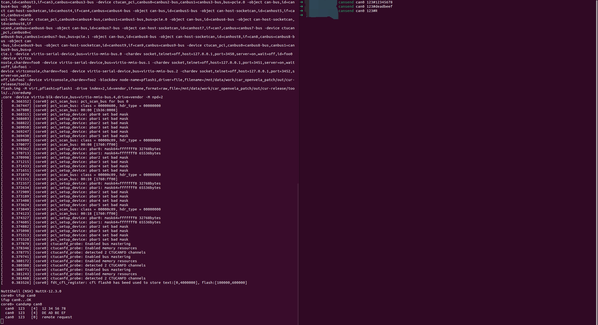
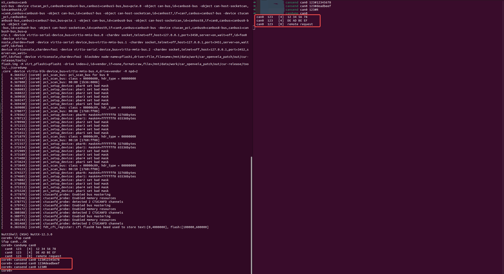

# SocketCAN 功能使用指南

[ [English](../../../../../en/device_dev_guide/connection/network/socketcan/socketcan_guide.md) | 简体中文 ]

## 一、SocketCAN 简介

**SocketCAN** 是 Linux 内核中为 CAN (Controller Area Network) 协议开发的一套开源驱动和网络栈。与传统的字符设备驱动不同，SocketCAN 使用 Berkeley Socket API 网络编程接口，将 CAN 总线抽象为网络接口（如 `can0`），这使得 CAN 协议的开发与以太网编程高度相似。

在 openvela 操作系统中引入 SocketCAN 支持，具有以下显著优势：

- **标准化接口**：应用层可通过标准的 `socket`、`bind`、`write`、`read` 系统调用访问 CAN 总线。
- **多路复用**：支持多个应用程序同时访问同一个 CAN 接口，无需处理复杂的并发锁。
- **工具生态**：原生兼容 `can-utils` 等强大的 Linux 标准调试工具（如 `candump`、`cansend`）。

本指南将引导您在 openvela 的 SIL (Software-in-the-Loop) 仿真环境中配置并使用这一强大的功能。

## 二、概述

本实验旨在通过 QEMU 仿真器，在 Linux 宿主机与 openvela 实例之间建立虚拟 CAN 网络，验证双向数据通信的可行性。

**完成本实验后，您将达成以下目标：**

1. 成功构建并启动支持 SocketCAN 协议栈的 openvela 系统。
2. 掌握在宿主机与 openvela 之间互发 CAN 数据帧的方法。

## 三、前置准备

请在开发主机（Ubuntu 环境）上完成以下软件安装与源码准备。

### 1、搭建基础开发环境

请首先参照官方文档[快速入门（Ubuntu）](../quickstart/openvela_ubuntu_quick_start.md)，完成 openvela 编译环境的搭建及源代码的下载。

### 2、安装 CAN 调试工具

在宿主机终端中执行以下命令，安装 `can-utils` 工具包，用于在 Linux 端进行 CAN 数据调试：

```bash
sudo apt-get install can-utils
```

## 四、系统配置与构建

本章节以 `openvela sil` 平台为例，指导如何启用 SocketCAN 核心功能。

### 1、配置功能选项 (Menuconfig)

执行以下命令，进入 `core0` 的配置界面：

```bash
./build.sh vendor/openvela/boards/sil/configs/ksil_arm32r_nsh_core0 --cmake menuconfig
```

请在配置菜单中定位并启用以下关键配置项（或确认 `.config` 文件中包含以下内容）：

```Makefile
# CAN Controller Support
CONFIG_CAN_CTUCANFD=y
CONFIG_CAN_CTUCANFD_SOCKET=y

# PCI & Bus Support
CONFIG_PCI=y
CONFIG_PCI_MSIX=y

# Networking Support
CONFIG_NET=y
CONFIG_NET_CAN=y
CONFIG_NET_SOCKOPTS=y
CONFIG_NETDEV_LATEINIT=y
CONFIG_NETDEV_IFINDEX=y

# BSD Compatibility
CONFIG_ALLOW_BSD_COMPONENTS=y

# CAN Utilities (NuttX side)
CONFIG_CANUTILS_LIBCANUTILS=y
CONFIG_CANUTILS_CANSEND=y
CONFIG_CANUTILS_CANDUMP=y

# Disable unrelated CAN drivers to avoid conflicts
CONFIG_CAN=n
CONFIG_CAN_KVASER=n
```

### 2、编译项目

使用 `protect` 模式分别构建 Bootloader (BL) 和核心系统 (Core0)。

#### 步骤 1：执行编译命令

```Bash
# 编译构建 BL
./build.sh vendor/openvela/boards/sil/configs/ksil_arm32r_nsh_bl --cmake -j8

# 编译构建 Core0
./build.sh vendor/openvela/boards/sil/configs/ksil_arm32r_nsh_core0 --cmake -j8
```

#### 步骤 2：部署编译产物

创建发布目录并移动 ELF 镜像文件：

```Bash
mkdir ./cmake_out/cur-release/

#拷贝编译产物
cp ./cmake_out/sil_ksil_arm32r_nsh_core0/vela_core0.elf ./cmake_out/cur-release/ &&
cp ./cmake_out/sil_ksil_arm32r_nsh_core0/vela_core0_user.elf ./cmake_out/cur-release/
```

## 五、仿真环境运行

### 1、创建虚拟 CAN 网络

在**宿主机（Ubuntu）终端**执行以下命令，加载 `vcan` 模块并创建虚拟 CAN 节点。

**注意**：此步骤需要 `sudo` 权限。

```Bash
cp -r ./vendor/openvela/boards/sil/tools ./cmake_out/cur-release 

# 虚拟CAN节点的创建，创建10个vcan节点
sudo modprobe vcan; \
for i in {0..9}; do \
        sudo ip link add dev can$i type vcan; \
        sudo ip link set up can$i; \
done
# 添加完后可以执行ifconfig查看这些接口是否已存在且running
```

### 2、启动 openvela 仿真

执行启动脚本运行 QEMU 环境：

```Bash
./cmake_out/cur-release/tools/run_arm32r_qemu_ctu_canfd.sh 10 3 protect 1
```

**参数说明**：

- `10`：映射的 CAN 设备数量（需与前一步创建的 vcan 数量匹配）。
- `3`：串口设备数量。
- `protect`：启动模式。
- `1`：启动核心数。

系统启动成功后，终端将显示 `core0>` 提示符：


## 六、功能验证实验

本节将验证宿主机与 openvela 之间的双向通信。

### 场景一：openvela 接收 CAN 数据

#### 步骤 1：目标机设置 (openvela)

在 `openvela` 的 NSH 终端中启动 CAN 接口并监听数据：

```Bash
ifup can0
candump can0
```

#### 步骤 2：宿主机发送 (Ubuntu)

打开一个新的 Ubuntu 终端窗口，向 `can0` 发送测试数据：

```Bash
# 发送标准帧 (ID: 123, Data: 12 34 56 78)
cansend can0 123#12345678

# 发送标准帧 (ID: 123, Data: deadbeef)
cansend can0 123#deadbeef

# 发送远程请求帧 (RTR)
cansend can0 123#R
```

#### 步骤 3：结果验证

观察 openvela 终端，应显示接收到的数据帧：



### 场景二：openvela 发送 CAN 数据

#### 步骤 1：宿主机监听 (Ubuntu)

在 Ubuntu 终端中执行监听命令：

```bash
candump can0
```

#### 步骤 2：目标机发送 (openvela)

在 openvela 的 NSH 终端中执行发送命令：

```Bash
# 确保接口已启动
ifup can0

# 发送测试数据
cansend can0 123#12345678
cansend can0 123#deadbeef
cansend can0 123#R
```

#### 步骤 3：结果验证

观察 Ubuntu 终端，应接收到来自 openvela 的数据帧：

