# Telephony 概述

\[ [English](../../../../en/device_dev_guide/connection/telephony/overview_of_telephony.md) | 简体中文 \]

## 一、背景

当前 openvela 已广泛应用于多类消费终端产品中。其中部分终端（如轻智能 eSIM 手表）需要支持蜂窝通信功能。为了满足这一需求，openvela 需要构建一个标准化、兼容性良好且可持续演进的 openvela Telephony 子系统，以管理蜂窝通信相关的核心功能和外围接口。这将进一步丰富和促进 openvela 生态系统的发展。

## 二、为什么选择 oFono 作为基础

oFono 是一个面向基于 Linux 的嵌入式移动设备和桌面系统的 Telephony Host Stack（电话主机栈）。它采用了 GPLv2 协议。oFono 使用 C 语言、GLib 和 DBus 实现，支持多种类型的调制解调器（Modem），例如：

- ATModem（基于 AT 命令的调制解调器）
- RILModem（集成 AOSP RIL 格式的调制解调器）
- ISIModem（集成 SIM 调制解调器）

基于 oFono 的技术优势和开源生态，openvela 选择 oFono 作为基础，扩展开发 Telephony 子系统，以满足蜂窝通信的功能需求。

## 三、移动通信解决方案

openvela 将 oFono 集成到系统中，并增强了其移动通信能力，例如支持 VoLTE（Voice over LTE）语音通话，从而提升了物联网实时操作系统的移动通信能力。通过层级封装和解耦，以及多样化的芯片平台集成方式，openvela 系统的整体移动通信解决方案能够让上层应用程序（APP） 实现跨平台复用，为用户提供最佳的通信体验。

基于 oFono 作为 Telephony 的服务层，系统对外提供 TAPI（Telephony API） 接口，下层对接 RIL（Radio Interface Layer） 层，实现完整的 Telephony 功能。

### 1、Telephony API（TAPI）说明

#### TAPI 功能概述

TAPI 是一个基于 DBus Lib 库的 oFono D-Bus 接口封装层，主要目标包括：

1. 基于 DBus Lib 对 oFono Stack 的所有 D-Bus 接口进行二次封装，使外部应用程序对 D-Bus 或 oFono 无感知。
2. TAPI 和 oFono 之间基于 C/S 架构通信，通过 D-Bus 实现消息的分发和订阅。

#### TAPI 架构图

以下是 Telephony API 的架构图：

#### TAPI 模块化设计

TAPI 内部按照业务功能划分为多个模块，每个模块的功能和代码说明如下：

| **模块** | **文件**                           | **说明**                    |
| :------- | :--------------------------------- | :-------------------------- |
| 公共接口 | `tapi_manager.c` `tapi.h`       | 提供 Telephony 公共接口。   |
| 工具接口 | `tapi_utils.c/h`                   | 提供 Telephony 工具类接口。 |
| 通话接口 | `tapi_call.c/h` `tapi_ussd.c/h` | 通话管理接口。              |
| 网络接口 | `tapi_network.c/h`                 | 网络注册接口。              |
| 数据接口 | `tapi_gprs.c/h`                    | 提供数据服务接口。          |
| SIM 接口 | `tapi_sim.c/h` `tapi_stk.c/h`   | SIM 卡管理接口。            |
| 短信接口 | `tapi_sms.c/h`                     | 短信管理接口。              |
| IMS 接口 | `tapi_ims.c/h`                     | 提供 IMS 服务接口。         |
| 测试工具 | `telephony_tools.c`                | 提供客户端模拟工具。        |

### 2、RIL 说明

#### RIL 功能概述

Telephony 通过 RIL 机制与调制解调器（Modem）交互。Telephony 层通过 Socket 与 RILD 进程通信，而 RILD 进程内嵌 Vendor RIL，用于与 Modem 交互。

#### RIL 设计原则

- 对标 AOSP：openvela RIL 接口参考 Android 12 RIL AOSP 的设计。
    - oFono 原生已支持 Android 4.3 的 RIL 接口，其参数与 Android 4.3 一致。
    - openvela基于Android 12 RIL接口，根据 openvela 的业务需求挑选，RIL 参数保持与 Android 一致。
    - 对于 Android 定义的 CDMA 和 NR5G 相关接口，由于无业务需求，openvela 不支持。
    - 对于 IMS 相关接口，由于没有 AOSP 的统一规范，按照 openvela 需求独立设计。
    - openvela 按照业务需求扩展定制部分接口。
- 数据结构：请求参数和响应参数均参考 oFono 源码 gril/parcel.h 中的 Socket 字节流数据结构定义。

### 3、Reference RIL 介绍

#### Reference RIL 的功能

Reference RIL 提供了一套适用于 QEMU Emulator 的参考实现，用于模拟电话、短信、上网等 Telephony 功能，方便在 QEMU 模拟器上调试应用程序的 Telephony 功能。

#### Reference RIL 的模块划分

Reference RIL 将 RIL 模块拆分为以下两部分：

1. openvela LibRIL：openvela RIL 的接口标准。
2. Reference QEMU RIL：适用于 QEMU 模拟器的参考实现。
调制解调器（Modem）芯片厂商可以参考 Reference QEMU RIL 实现 Vendor RIL 模块，通过 Vendor RIL 与 Modem 实现控制面交互。在商用产品中，openvela LibRIL 和 Vendor RIL 共同实现完整的 RIL 功能。

## 四、Telephony 业务适配

在 openvela 系统上实现 Telephony 功能，需要完成以下适配工作：

- 蜂窝应用层 APP：调用 TAPI（Telephony API）接口，实现 UI 应用的控制和显示。
- 蜂窝控制面逻辑 Vendor RIL：实现与 Modem 的控制面交互，参考 openvela Reference QEMU RIL。
- 蜂窝数据面：适配语音流和数据流的传输逻辑。

以下分别介绍语音流和数据流的适配方案。

### 1、Voice 语音适配

#### 语音控制面

语音控制面的逻辑通道为：

TAPI -> oFono voice -> RIL -> Modem

#### 语音数据面

语音数据面由 Modem 与 Audio DSP 直接交互，完成语音流的收发和编解码。当前 Telephony 支持以下语音功能：

- LTE IMS 的 VoLTE 语音。
- GSM 和 WCDMA 下的 CS 语音。

语音数据面的适配需要芯片厂商开发 openvela 的音频驱动（Audio Driver）。

### 2、Data 数据服务

#### 数据控制面

数据服务的控制面通过以下逻辑通道实现：

oFono gprs -> RIL -> Modem

在数据激活流程中，Vendor RIL 在收到 Modem 返回的 IP 信息后，负责创建 openvela OS 的网卡并填充 IP 等信息。当前 openvela 的蜂窝网卡可以通过以下两种方式创建：

1. 在 Vendor RIL 中创建。
2. 在 Modem 芯片厂商的 openvela 驱动适配层中创建。

芯片厂商可根据需求选择适合的蜂窝网卡适配方案。

#### 蜂窝网卡驱动实现

蜂窝网卡的驱动实现主要由以下两部分组成：

1. Modem 硬件交互：负责与外界进行数据收发的 Modem 驱动。
2. 网络设备结构体实现：包含协议栈所需的回调函数，并将结构注册到协议栈中。

在这两个模块之间，需要实现数据的高效传递：

- 第一部分由 Modem 驱动开发人员负责。
- 第二部分与协议栈相关。

#### 推荐方案：基于 TUN 虚拟网卡

建议采用基于 TUN 虚拟网卡的实现方案。此方案的特点如下：

- 适用场景：适用于对带宽要求不高、不需要极限网络性能的场景。
- 性能限制：可能存在性能瓶颈。
- 操作便利性：用户态程序可以直接调用，操作简单。
