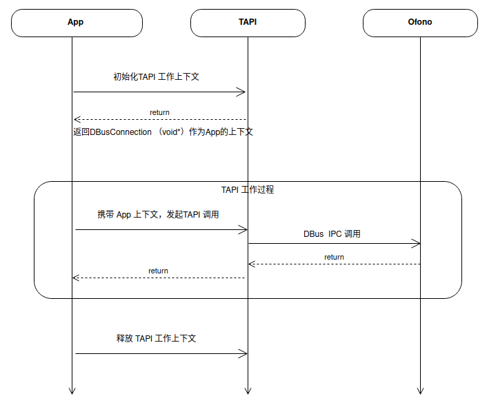

# Telephony API 开发指南

\[ [English](../../../../en/device_dev_guide/connection/telephony/tapi_developer_guide.md) | 简体中文 \]

本文档为应用开发者提供在 openvela 操作系统上使用 Telephony 应用编程接口（Telephony API, TAPI）的详细指南。

## 一、概述

Telephony 是 openvela 操作系统中用于处理通信功能的框架和 API 集合。Framework/telephony 是 openvela 通信对应用层提供的接口层，又称为 TAPI（Telephony API）。TAPI 提供了一组功能丰富的工具和接口，这些接口设计使得应用开发者无需深入了解 Telephony 的内部业务逻辑（Telephony 内部业务由 oFono 实现），只需调用 API 即可轻松获取与 Telephony 相关的信息，完成应用开发。另外，Telephony 还支持灵活的扩展和定制，可满足不断变化的通信需求。

### 1、核心功能模块

Telephony 提供的一系列 API 包括：

- **通用管理 (Common)**：提供 Telephony 服务的总控接口，负责通信功能的初始化与启停。这是使用所有其他 Telephony 业务的前提。
- **通话管理 (Call)**：使应用能够实现拨打、接听、挂断、保持、电话号码的备注显示、多路通话切换等通话功能。
- **补充业务 (Supplementary Service, SS)**：允许应用实现呼叫限制、呼叫转移、呼叫等待等运营商提供的补充服务。
- **短信 (SMS)**：支持应用发送、接收短信，以及管理短信服务中心地址（Short Message Service Center, SMSC）。
- **网络 (Network)**：支持应用查询当前注册网络信息，如网络服务状态及信号强度相关信息。
- **数据 (Data)**：蜂窝数据是无线通信技术标准的一种，从数据的传输到交换都采用分组技术（Packet Switch），能够为移动设备提供话音、数据、音视频等业务。
- **SIM 卡 (SIM)**：允许应用获取 SIM 卡状态、运营商名称、集成电路卡识别码（Integrated Circuit Card Identifier, ICCID）等信息。
- **IP 多媒体子系统 (IP Multimedia Subsystem, IMS)**：为应用提供音视频通话、即时消息、会议协作等多媒体通信能力。通过调用该 API，开发者可接入 IMS 服务，实现高清语音（VoLTE）功能，并管理网络状态，设置 IMS 能力等。

### 2、调试与测试

Telephony 还提供了调试命令行工具与单元测试方案：

- **Telephony 调试命令行**：一款专为开发和调试 Telephony 相关功能而设计的工具。它将 TAPI 接口封装为命令形式，用户可通过 telephonytool 命令实现拨号、接听、挂断、发送短信等操作，详情请参考 [telephonytool 命令](./telephonytool/telephonytool_cmd_desc.md)。
- **Telephony 单元测试方案**：基于 CMocka 测试框架构建的高可靠性测试套件，通过模拟 SIM 卡状态、网络信令、异常信号等真实场景，对 Telephony 核心代码进行功能验证、性能压测及稳定性防护，覆盖从物理层交互到协议栈处理的完整通信链路。

## 二、工作原理

TAPI 采用异步、事件驱动的工作模式，通过 D-Bus 与系统底层的 Telephony 服务通信。其工作流程遵循标准的**初始化 -> 调用 -> 释放**生命周期模型。

1. **初始化**：应用调用 `tapi_open()` 初始化 TAPI 客户端，与系统服务建立连接并获取一个上下文句柄（`tapi_context`）。
2. **调用**：应用使用此句柄调用各功能模块的 API。这些操作大多是异步的，通过注册的回调函数接收执行结果。
3. **释放**：应用在退出或不再需要通信功能时，调用 `tapi_close()` 释放句柄和相关资源。




## 三、开发前置条件

### 1、系统构建配置

在开始开发前，您必须在项目的 `Kconfig` 配置文件中启用以下选项，以将 Telephony 框架及其依赖项编译到系统中。

```Makefile
CONFIG_ALLOW_MIT_COMPONENTS=y
# 启用 D-Bus 支持，TAPI 依赖 D-Bus 进行进程间通信
CONFIG_LIB_DBUS=y
# 启用 Telephony 核心框架
CONFIG_TELEPHONY=y
```

### 2、导入头文件

在您的 C 源文件中包含 TAPI 的主头文件，以引入所有 API 声明和数据类型。

```C
#include "tapi.h"
```

## 四、核心开发步骤

本章节详细说明应用开发者集成 TAPI 服务所需的标准流程。

### 步骤 1：初始化 TAPI 上下文

在使用任何 TAPI 功能前，必须调用 `tapi_open()` 函数来初始化 Telephony 库并获取一个上下文句柄。此句柄是后续所有 TAPI 调用的凭证。

#### 函数原型

```C
tapi_context tapi_open(const char* client_name, 
                       tapi_client_ready_function callback, 
                       void* user_data);
```

#### 功能描述

初始化 TAPI 客户端，并与系统 Telephony 服务建立 D-Bus 连接。这是一个异步过程，当服务准备就绪时，系统将调用您提供的 `callback` 函数。

#### 参数说明

| **参数名称**  | **类型**                     | **含义**                                                                                                                                |
| :------------ | :--------------------------- | :-------------------------------------------------------------------------------------------------------------------------------------- |
| `client_name` | `const char*`                | 客户端的唯一名称。<br>必须符合 D-Bus 命名规范（例如 `com.yourcompany.yourapp`）。                                                       |
| `callback`    | `tapi_client_ready_function` | 当 TAPI 服务准备就绪时调用的回调函数。<br>定义为 `typedef void (*tapi_client_ready_function)(const char* client_name, void* user_data)` |
| `user_data`   | `void*`                      | 传递给 `callback` 函数的用户自定义数据。                                                                                                |

#### 返回值

| **返回值**     | **含义**                                         |
| :------------- | :----------------------------------------------- |
| `tapi_context` | 成功时返回一个非空的 TAPI 上下文句柄 `(void*)`。 |
| `NULL`         | 初始化失败。                                     |

#### 示例代码

```C++
#include "tapi.h"

// TAPI 服务就绪回调函数
static void on_tapi_client_ready(const char* client_name, void* user_data)
{
    if (client_name != NULL)
        info("tapi is ready for %s\n", client_name);
        
    // 在此回调之后，可以安全地调用其他 TAPI 业务 API
}

// 初始化 TAPI
static bool init_tapi(void)
{
    tapi_context t_context =
        tapi_open("telephone.tapi_test", on_tapi_client_ready, NULL);
    if (t_context == NULL) {
        return false;
    }

    return true;
}
```

### 步骤 2：调用 Telephony 模块 API

初始化成功后，您可以使用获取到的 `tapi_context` 句柄调用各个功能模块的 API。大多数操作都是异步的，通过回调函数返回执行结果。

#### 异步操作与回调

大多数 TAPI 操作是异步执行的，结果通过回调函数返回。所有异步 API 的回调函数都接收一个 `tapi_async_result` 结构体指针，用于传递操作结果。

```C++
typedef struct {
    int msg_id;                  // 调用者传入的事件 ID，用于在回调中区分不同请求
    tapi_message_type msg_type;  // 消息类型 (当前未使用)
    int status;                  // 操作结果状态，0 表示成功，负数表示失败
    int arg1;                    // 通用参数 1 (例如：slot_id)
    int arg2;                    // 通用参数 2
    void* data;                  // 指向返回数据的指针 (例如：call_id 字符串)
    void* user_obj;              // 用户自定义对象 (当前未使用)
} tapi_async_result;
```

> **注意**：`arg1`、`arg2` 和 `data` 成员的具体含义取决于所调用的 API。

#### 示例 1：启用 Modem

Modem 是所有蜂窝业务（通话、短信、数据）的硬件基础，使用前必须启用。

##### 函数原型

```C
int tapi_enable_modem(tapi_context context, 
                      int slot_id, 
                      int event_id, 
                      bool enable, 
                      tapi_async_function p_handle);
```

##### 功能描述

异步启用或禁用指定卡槽（`slot_id`）的 Modem。

##### 参数

| **参数名称** | **类型**              | **含义**                                                          |
| :----------- | :-------------------- | :---------------------------------------------------------------- |
| `context`    | `tapi_context`        | `tapi_open()` 返回的上下文句柄。                                  |
| `slot_id`    | `int`                 | 卡槽 ID（通常为 0）。                                             |
| `event_id`   | `int`                 | 用户定义的事件 ID，将在回调函数中原样返回。                       |
| `enable`     | `bool`                | `true` 表示启用，`false` 表示禁用。                               |
| `p_handle`   | `tapi_async_function` | 回调函数指针，结果状态封装到 `tapi_async_result` 的 `status` 域。 |

##### 异步回调

在 `p_handle` 函数中，`tapi_async_result` 结构体成员的含义如下：

- `status`: 操作结果，`0` 表示成功。
- `arg1`: 操作的 `slot_id`。

##### 代码示例

（可选）调用`tapi_get_modem_status`查看当前通讯状态。

```C
#define EVENT_MODEM_ENABLE_DONE 101

// Modem 启用/禁用操作的回调函数
static void on_modem_enable_done(tapi_async_result* result)
{
    if (result->msg_id == EVENT_MODEM_ENABLE_DONE) {
        if (result->status == 0) {
            printf("Enable modem on slot %d succeeded.\n", result->arg1);
        } else {
            printf("Enable modem on slot %d failed.\n", result->arg1);
        }
    }
}

// 调用接口启用 Modem
int enable_modem(void)
{
    if (g_tapi_context == NULL) {
        return -1;
    }
    // 启用 0 号卡槽的 Modem
    return tapi_enable_modem(g_tapi_context, 0, EVENT_MODEM_ENABLE_DONE, true, on_modem_enable_done);
}
```

#### 示例 2：拨打电话

拨打电话是通话管理模块的核心功能。

##### 函数原型

```C++
int tapi_call_dial(tapi_context context,
                   int slot_id,
                   const char* number,
                   int hide_callerid,
                   int event_id,
                   tapi_async_function p_handle);
```

##### 功能描述

使用指定卡槽发起一通电话。

##### 参数说明

| **参数名称**    | **类型**              | **含义**                                                                                                                                                                                                            |
| :-------------- | :-------------------- | :------------------------------------------------------------------------------------------------------------------------------------------------------------------------------------------------------------------ |
| `context`       | `tapi_context`        | 上下文句柄。                                                                                                                                                                                                        |
| `slot_id`       | `int`                 | 卡槽 ID。                                                                                                                                                                                                           |
| `number`        | `const char*`         | 要拨打的电话号码。                                                                                                                                                                                                  |
| `hide_callerid` | `int`                 | 设置主叫号码显示限制 (CLIR)。<br>`0`: 默认，`1`: 限制（隐藏），`2`: 不限制（显示）。<br>`0`：default (use subscription default value)`1`：enabled (restrict CLI presentation)`2`：disabled (allow CLI presentation) |
| `event_id`      | `int`                 | 用户定义的事件 ID。                                                                                                                                                                                                 |
| `p_handle`      | `tapi_async_function` | 接收操作结果的回调函数。                                                                                                                                                                                            |

| **通话状态**                 | **说明**             |
| :--------------------------- | :------------------- |
| CALL_STATUS_UNKNOW = -1      | 状态未知/异常        |
| CALL_STATUS_ACTIVE = 0       | 正在通话中           |
| CALL_STATUS_HELD = 1         | 通话被暂停           |
| CALL_STATUS_DIALING = 2      | 拨号中               |
| CALL_STATUS_ALERTING = 3     | 对方响铃中           |
| CALL_STATUS_INCOMING = 4     | 当前无任何通话时来电 |
| CALL_STATUS_WAITING = 5      | 已有一路通话后来电   |
| CALL_STATUS_DISCONNECTED = 6 | 挂断通话             |

##### 异步回调

在 `p_handle` 函数中，`tapi_async_result` 结构体成员的含义如下：

- `status`: 操作结果，`0` 表示成功。
- `arg1`: 操作的 `slot_id`。
- `data`: `(char*)` 类型，指向通话的唯一标识符（`call_id`），如 `/ril_0/voicecall01`。
  
    **注意**：此 `call_id` 是后续操作（如挂断）此路通话所必需的。

##### 示例代码

调用 `tapi_call_dial` 接口实现拨号。`tapi_call_dial` 回调函数中获取 `call_id` 以便后续操作通话。

```C
#define EVENT_REQUEST_DIAL_DONE 1

// 用于保存通话 ID
static char g_call_id[64] = {0};

// 拨号操作的回调函数
static void on_dial_done(tapi_async_result* result)
{
    if (result->msg_id == EVENT_REQUEST_DIAL_DONE) {
        if (result->status == 0 && result->data != NULL) {
            printf("Dialing succeeded. Call ID: %s\n", (char*)result->data);
            // 保存 call_id 以便后续操作（如挂断）
            strncpy(g_call_id, (char*)result->data, sizeof(g_call_id) - 1);
        } else {
            printf("Dialing failed.\n");
        }
    }
}

// 调用接口拨打电话
int start_call(const char* phone_number)
{
    if (g_tapi_context == NULL || phone_number == NULL) {
        return -1;
    }
    return tapi_call_dial(g_tapi_context, 0, phone_number, 0,
                          EVENT_REQUEST_DIAL_DONE, on_dial_done);
}

// 使用示例
// start_call("10010");
```

#### 示例 3：设置呼叫等待

呼叫等待：允许用户在通话过程中接收新来电提示，并能在不中断当前通话的前提下选择接听或拒绝新呼叫。

##### 函数原型

```C
int tapi_ss_set_call_waiting(tapi_context context,
                             int slot_id,
                             int event_id,
                             bool enable,
                             tapi_async_function p_handle);
```

##### 功能描述

异步设置或取消呼叫等待功能。

##### 参数说明

| **参数名称** | **类型**              | **含义**                    |
| :----------- | :-------------------- | :-------------------------- |
| `context`    | `tapi_context`        | 上下文句柄。                |
| `slot_id`    | `int`                 | 卡槽 ID。                   |
| `event_id`   | `int`                 | 事件识别号。                |
| `enable`     | `bool`                | `true` 启用，`false` 取消。 |
| `p_handle`   | `tapi_async_function` | 接收操作结果的回调函数。    |

##### 异步回调

- `status`: 操作结果，`0` 表示成功。

##### 代码示例

```C
#define EVENT_REQUEST_CALL_WAITING_DONE 2

// 设置呼叫等待的回调函数
static void on_set_call_waiting_done(tapi_async_result* result)
{
    if (result->msg_id == EVENT_SET_CALL_WAITING_DONE) {
        if (result->status == 0) {
            printf("Set call waiting succeeded.\n");
        } else {
            printf("Set call waiting failed.\n");
        }
    }
}

// 调用接口设置呼叫等待
int set_call_waiting_service(int slot_id, bool enable)
{
    if (g_tapi_context == NULL) {
        return -1;
    }
    return tapi_ss_set_call_waiting(g_tapi_context, slot_id,
                EVENT_SET_CALL_WAITING_DONE, enable, on_set_call_waiting_done);
}
```

#### 示例 4：发送短信

当设备激活 eSIM 业务并启用蜂窝通信能力后，开发者可通过调用 `Sms` 模块的 API 发送短信。

##### 函数原型

```C++
int tapi_sms_send_message(tapi_context context,
                          int slot_id,
                          int sms_id,
                          const char* number,
                          const char* text,
                          int event_id,
                          tapi_async_function p_handle);
```

##### 功能描述

发送一条文本短信。

##### 参数说明

| **参数名称** | **类型**              | **含义**                 |
| :----------- | :-------------------- | :----------------------- |
| `context`    | `tapi_context`        | 上下文句柄。             |
| `slot_id`    | `int`                 | 卡槽 ID。                |
| `sms_id`     | `int`                 | 短信标识。               |
| `number`     | `const char*`         | 接收方的手机号码。       |
| `text`       | `const char*`         | 短信内容字符串。         |
| `event_id`   | `int`                 | 用户定义的事件 ID。      |
| `p_handle`   | `tapi_async_function` | 接收操作结果的回调函数。 |

##### 异步回调

在 `p_handle` 函数中，`tapi_async_result` 结构体成员的含义如下：

- `status`: 操作结果，`0` 表示成功。
- `data`: `(char*)` 类型，指向短信的唯一标识符（UUID）。

##### 代码示例

```C
#define EVENT_SEND_MESSAGE_DONE 3

// 短信发送操作的回调函数
static void on_send_sms_done(tapi_async_result* result)
{
    if (result->msg_id == EVENT_SEND_MESSAGE_DONE) {
        if (result->status == 0 && result->data != NULL) {
            printf("Send message succeeded. UUID: %s\n", (char*)result->data);
        } else {
            printf("Send message failed.\n");
        }
    }
}

// 调用接口发送短信
int send_sms(const char* recipient, const char* message)
{
    if (g_tapi_context == NULL || recipient == NULL || message == NULL) {
        return -1;
    }
    return tapi_sms_send_message(g_tapi_context, 0, 0, recipient, message,
                                 EVENT_SEND_MESSAGE_DONE, on_send_sms_done);
}
```

#### 示例 5：启用蜂窝数据

设备支持独立 4G 联网能力（不依赖蓝牙/Wi-Fi 中继），但需手动启用移动数据功能，方可访问地图、音乐流媒体及社交应用等互联网服务。

##### 函数原型

```C
int tapi_data_enable_data(tapi_context context, bool enabled);
```

##### 功能描述

同步打开或关闭蜂窝数据。这是一个同步接口，调用后会阻塞直到操作完成。

##### 参数说明

| **参数名称** | **类型**       | **含义**                            |
| :----------- | :------------- | :---------------------------------- |
| `context`    | `tapi_context` | 上下文句柄。                        |
| `enabled`    | `bool`         | `true` 表示开启，`false` 表示关闭。 |

##### 返回值

| **返回值** | **描述**               |
| :--------- | :--------------------- |
| `0`        | 成功。                 |
| 负数       | 失败，表示一个错误码。 |

##### 代码示例

```C
bool set_data_connection(bool enable)
{
    if (g_tapi_context == NULL) {
        return false;
    }

    int ret = tapi_data_enable_data(g_tapi_context, enable);
    if (ret == 0) {
        printf("Data connection status set to %s successfully.\n", enable ? "enabled" : "disabled");
        return true;
    } else {
        printf("Failed to set data connection status.\n");
        return false;
    }
}
```

### 步骤 3：释放 TAPI 上下文

当应用不再需要使用 Telephony 服务时，调用 `tapi_close()` 以断开连接并释放资源，避免内存和 D-Bus 连接泄漏。

#### 函数原型

```C
int tapi_close(tapi_context context);
```

#### 代码示例

```C
static void tapi_close_test()
{
    if (t_context != NULL) {
        tapi_close(t_context);
        t_context = NULL;
    }
}
```

## 五、调试工具

`telephonytool` 是一款交互式命令行工具，可用于在设备上直接调用 TAPI 功能，进行快速调试和验证。

### 1、配置

在 `Kconfig` 中开启以下配置项以构建 `telephonytool`：

```C
CONFIG_TELEPHONY_TOOL=y
```

> **运行环境**：建议在 openvela Emulator 环境中运行 `telephonytool`，因为它需要 Modem Simulator 的支持。请参考[快速入门](../../../quickstart/Set_up_the_development_environment_zh-cn.md)搭建环境。

### 2、使用说明

1. 在系统的 NSH 命令行中输入 `telephonytool` 启动工具：

    ```Bash
    goldfish-armv7a-ap> telephonytool
    [   39.370900] [29] [ DEBUG] [ap] tapi is ready for vela.telephony.tool
    ...
    telephonytool>
    ```

2. 进入 `telephonytool` 工具后，可通过 `help` 命令查看详细的命令说明：

    ```Bash
    telephonytool> help
    =========  Telephony Tool Manual  =========
    ***** 1: Radio TAPI Instruction       *****
    ***** 2: Call TAPI Instruction        *****
    ***** 3: Data TAPI Instruction        *****
    ***** 4: SIM TAPI Instruction         *****
    ***** 5: SMS & CBS TAPI Instruction   *****
    ***** 6: Network TAPI Instruction     *****
    ***** 7: SS TAPI Instruction          *****
    ***** 8: IMS TAPI Instruction         *****
    ***** 9: Phonebook TAPI Instruction   *****
    ***** 10: TAPI open&close Instruction *****
    ***** 11: Quit                        *****
    ***** 12: Help                        *****
    Please enter your choice: (1~11)
    ```

3. 选择模块编号查看具体命令。例如，输入 `2` 查看通话（Call）相关命令：

    ```Shell
    Please enter your choice: (1~11)
    2
    
    listen-call                         call manger event callback (enter example : listen-call 0 1 [event_id]
    unlisten-call                       call unlisten event callback (enter example : unlisten-call [watch_id] [watch_id, one uint value returned from "listen-call"]
    listen-call-slot-change             register call slot change callback (enter example : listen-call-slot-change)
    dial                                Dial (enter example : dial 0 10086 0 [slot_id][number][hide_call_id, 0:show 1:hide])
    
    ...
    ```

## 六、测试工具

Telephony 模块提供了基于 CMocka 框架的单元测试套件，用于对核心代码进行自动化测试。

### 1、配置

在 `Kconfig` 中开启以下配置项以构建测试代码：

```Bash
CONFIG_TELEPHONY=y
CONFIG_TESTING_CMOCKA=y
CONFIG_TELEPHONY_TEST=y
```

### 2、运行测试

在 NSH 命令行中执行以下命令，即可运行所有 Telephony 相关的单元测试用例：

```Bash
goldfish-armv7a-ap> cmocka_telephony_test
```

输入完后自动运行所有 Telephony 相关 cases，并在最后生成结果：

```Bash
[ 3728.347500] [48] [  INFO] [ap] [ RUN      ] TestTeleFunc_CallDialingThirdCall
[ 3728.348000] [48] [  INFO] [ap] [       OK ] TestTeleFunc_CallDialingThirdCall
[ 3728.348100] [48] [  INFO] [ap] [==========] CallTestSuites: 91 test(s) run.
[ 3728.348200] [48] [  INFO] [ap] [  PASSED  ] 91 test(s).
```
