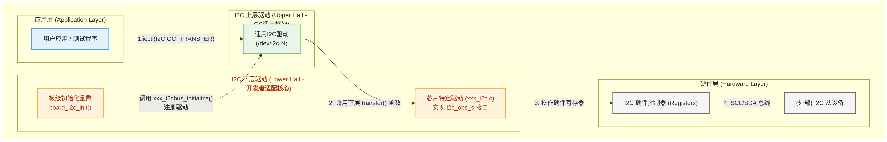

# 开始 I2C 驱动适配

[ [English](../../../../../en/device_dev_guide/driver/bus_driver/I2C/i2c_overview.md) | 简体中文 ]

本指南是 openvela I2C 驱动开发的中心入口，旨在为驱动开发者和应用工程师提供一个清晰、全面的学习路径。无论您是需要将新的 I2C 控制器移植到 openvela 内核，还是希望在应用层与 I2C 设备通信，都能在这里找到所需的指引。

## 一、基础概念

在深入驱动适配细节之前，本章将介绍 I2C 总线的基本原理以及 openvela 系统中 I2C 驱动的通用分层模型，帮助您快速建立整体认知。

### 1、I2C 总线简介

I2C (Inter-Integrated Circuit) 是一种简单、双向、半双工的串行总线，最初由 Philips (现 NXP) 公司设计。它仅需两根信号线即可实现设备间的通信，因此在嵌入式系统中被广泛用于连接微控制器 (MCU) 与外围设备（如传感器、EEPROM、RTC 等）。

**核心特性：**

- **两线制**：

    - `SCL` (Serial Clock): 串行时钟线，由主设备产生，用于同步数据传输。
    - `SDA` (Serial Data): 串行数据线，用于传输数据。

- **主从架构 (Master-Slave)**：

    - **主设备 (Master)**：负责发起通信、生成 SCL 时钟并控制总线。
    - **从设备 (Slave)**：被动响应主设备，每个从设备在总线上都有一个唯一的地址。

- **多设备支持**：一条 I2C 总线可以挂载多个从设备，甚至支持多个主设备（多主模式）。
- **开漏输出与上拉电阻**：I2C 的 SCL 和 SDA 均为开漏 (Open-Drain) 输出。这意味着总线上的设备只能将信号线拉低至低电平，而不能主动输出高电平。因此，**必须在 SCL 和 SDA 线上各连接一个上拉电阻到 VCC**，以在总线空闲时将其置于高电平状态。这是 I2C 硬件电路设计的关键一环，也是常见问题的根源。

### 2、openvela I2C 驱动框架模型

openvela 采用了标准的**上/下层 (Upper/Lower Half)**驱动模型来解耦通用逻辑与硬件相关的实现。这使得驱动适配工作变得清晰、高效。

**I2C 驱动框架分为三层，各司其职：**

| **层级**                       | **角色**       | **核心职责**                                                                                                                                      | **开发者关注点**                                                                                        |
| :----------------------------- | :------------- | :------------------------------------------------------------------------------------------------------------------------------------------------ | :------------------------------------------------------------------------------------------------------ |
| **应用层 (Application Layer)** | 驱动使用者     | 通过标准的 POSIX 文件接口 (`open`, `ioctl` 等) 访问 I2C 设备。                                                                                    | 如何调用 `ioctl` 发送 `I2CIOC_TRANSFER` 命令来与从设备通信。                                            |
| **I2C 上层驱动(Upper Half)**   | OS 内核提供    | 实现了 `/dev/i2c-N` 字符设备驱动的通用逻辑。它负责解析来自应用层的 `ioctl` 请求，将其转换为标准的 I2C 消息，并调用下层驱动的 `transfer` 函数。    | **开发者无需修改此层。**                                                                                |
| **I2C 下层驱动(Lower Half)**   | **驱动开发者** | **这是您需要适配的核心部分。** 负责实现特定芯片的硬件操作，如初始化 I2C 控制器、配置时钟/GPIO、处理中断，并最终通过操作硬件寄存器来完成数据传输。 | 实现 `struct i2c_ops_s` 接口，特别是 `transfer` 函数，并提供一个 `xxx_i2cbus_initialize()` 初始化函数。 |

简而言之，您的开发工作就是编写**下层驱动**，并将其提供的标准句柄（`struct i2c_master_s *`）注册到**上层驱动**，从而让**应用层**可以通过设备节点来使用它。

## 二、驱动开发指南导航

根据您的开发目标，请选择以下指南深入学习：

- [适配 I2C Master 驱动](./i2c_master_guide.md)

    - 学习如何为芯片适配一个标准的 I2C Master 驱动，使其能主动与从设备通信。这是最常见的开发场景。

- [适配 I2C Slave 驱动](./i2c_slave_guide.md)

    - 学习如何将芯片的 I2C 配置为 Slave 模式，使其能作为外设被动响应 Master 的请求。

- [适配 I2C Bit-Banging 驱动](./i2c_bitbang_guide.md)

    - 学习在没有硬件 I2C 控制器时，如何使用普通 GPIO 引脚模拟 I2C 协议。

- [I2C 驱动的验证与调试](./i2c_verification_guide.md)

    - 学习如何使用 BMI160 传感器验证驱动功能，以及如何利用 `i2ctool`、Simulator 和逻辑分析仪排查问题。
