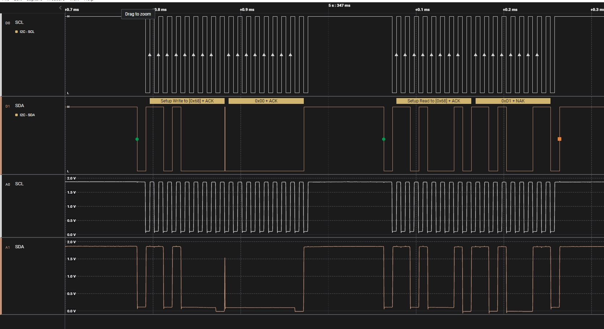
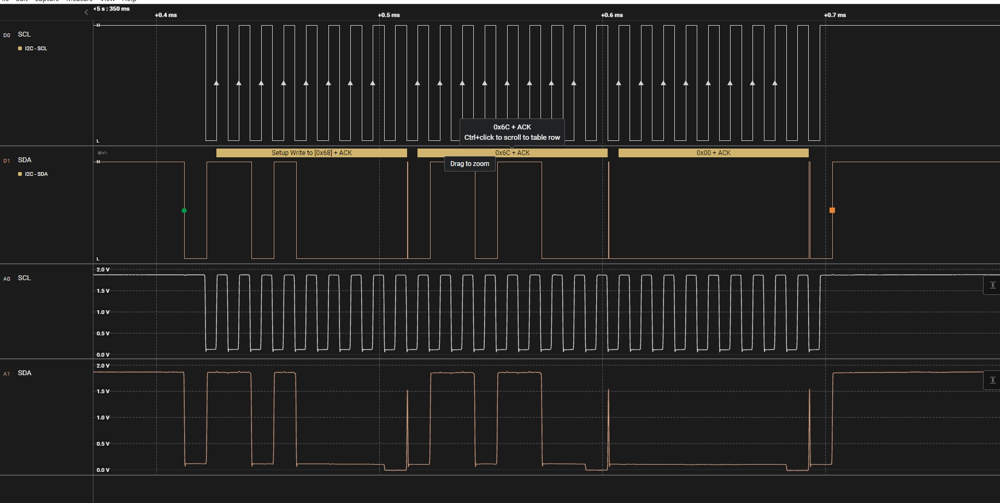

# I2C 驱动的验证与调试

[ [English](../../../../../en/device_dev_guide/driver/bus_driver/I2C/i2c_verification_guide.md) | 简体中文 ]

## 一、I2C 功能验证

本章节说明如何通过与真实传感器通信来验证 I2C 驱动（无论是硬件驱动还是 Bit-bang 驱动）的正确性。

我们以 **BMI160** 六轴惯性传感器作为标准测试设备。如果您的开发板上已集成其他 I2C 传感器，openvela 也接受使用该传感器进行测试，但您需要相应地提供完整的测试用例和操作说明。

### 1、测试准备

#### 硬件准备

- **开发板**：已完成 I2C 南向适配。
- **BMI160 传感器模块**：可从线上渠道购买，例如[此链接](https://item.m.jd.com/product/10031826295758.html)。

#### 硬件连接

请根据您为 I2C 总线选择的 GPIO 引脚，将 BMI160 模块与开发板正确连接，接线参考如下：

```Plain
                        VCC   GND                      
┌────────────────┐      ─┬─   ─┬─     ┌───────────────┐
│             VCC├───────┘     │      │               │
│                │             │      │               │
│             3V3├───          │      │               │
│                │             │      │               │
│             GND├─────────────┘      │               │
│BMI60           │                    │               │
│             SCL├────────────────────┤SCL  Host      │
│I2C Test Wire   │                    │               │
│             SDA├────────────────────┤SDA            │
│                │                    │               │
│SA0:          CS├─                   │               │
│  LOW  0x68     │                    │               │
│  HIGH 0x69  SA0├────────────────────┤SA0            │
└────────────────┘                    └───────────────┘
 
 0x68 BMI160_I2C_ADDR_68=y                             
 0x69 BMI160_I2C_ADDR_69=y                             
 
 BMI   Host
 SCL -- SCL
 SDA -- SDA
 SA0 -- SA0
```

#### 板级代码适配

在板级启动文件（如 `boards/.../<board>/src/xxx_bringup.c`）中，添加初始化 I2C 总线并注册 BMI160 传感器的代码。此操作会创建一个路径为 `/dev/accel0` 的设备节点。

- 参考代码：`sim/boards/vela/src/ap.c`

<details>
<summary>点击展开代码</summary>

```C
#ifdef CONFIG_SIM_I2CBUS
  /* 1. 初始化 I2C Master 总线 (根据您的适配调用硬件或 bit-bang 初始化函数) */
  i2cbus = sim_i2cbus_initialize(CONFIG_SIM_I2CBUS_ID);
  if (i2cbus == NULL)
    {
      syslog(LOG_ERR, "ERROR: sim_i2cbus_initialize failed.\n");
    }
  else
    {
      /* 2. 将 I2C Master 注册为 /dev/i2c-0，方便调试 */
      ret = i2c_register(i2cbus, 0);
      if (ret < 0)
        {
          syslog(LOG_ERR, "ERROR: Failed to register I2C%d driver: %d\n",
                 0, ret);
          sim_i2cbus_uninitialize(i2cbus);
        }
#if defined(CONFIG_SENSORS_BMI160) && defined(CONFIG_SENSORS_BMI160_I2C)
      else
        {
          /* 3. 注册 BMI160 传感器驱动 */
          bmi160_register("/dev/accel0", i2cbus);
        }
#endif
    }

#endif 
```

</details>

### 2、测试执行

#### Kconfig 配置

确保以下配置项已启用：

<details>
<summary>点击展开代码</summary>

```Makefile
# I2C 基础配置
CONFIG_I2C=y
CONFIG_I2C_DRIVER=y

# BMI160 传感器驱动配置
CONFIG_SENSORS_BMI160=y
CONFIG_SENSORS_BMI160_I2C=y

# BMI160 从机地址配置 (根据您的 SA0 接线二选一)
0x68 BMI160_I2C_ADDR_68=y                             
# 0x69 BMI160_I2C_ADDR_69=y 

# Cmocka 测试框架配置
TESTING_CMOCKA=y
TESTING_DRIVER_TEST=y
```

</details>

#### 运行测试

编译并烧录固件后，在 NSH 命令行中执行以下命令：

```Bash
nsh> cmocka_driver_i2c_spi
```

该测试用例（位于 `apps/testing/drivertest/drivertest_i2c_spi.c`）会尝试打开 `/dev/accel0` 并读取传感器数据。

**预期结果**：测试通过，并打印出读取到的传感器数据。多次执行命令，可以看到数据（如加速度值）发生变化。

### 3、常见问题排查

#### 问题 1：设备节点 `/dev/accel0` 未创建或 `bmi160_register` 失败

1. 检查 BMI160 初始化代码是否添加。
2. 检查硬件连接：确保 VCC/GND/SCL/SDA 连接牢固无误。
3. 检查从机地址：`bmi160_register` 函数在初始化时会尝试读取传感器的 CHIP_ID (`0xD1`)。如果读取失败，注册就会失败。请务必确认 `SA0` 引脚的接线与 Kconfig 中配置的从机地址（`0x68` 或 `0x69`）完全一致。
4. 使用 I2C 工具调试：如果使能了 `CONFIG_SYSTEM_I2CTOOL`，可以在 NSH 中使用 `i2c` 命令手动探测总线，确认传感器是否能被发现。

#### 问题 2：I2C 波形异常

检查南向适配接口、从机地址、读写数据是否和上半部传递的一致。

## 二、附录：调试工具与参考资料

### 1、标准 I2C 通信波形参考

在使用逻辑分析仪抓取 I2C 波形进行调试时，了解标准读写操作的序列至关重要。以下以与 BMI160 (从机地址 `0x68`) 通信为例，说明两种典型操作的波形序列。

#### 复合读取：读取 CHIP_ID 寄存器 (0x00)

此操作首先写入要读取的寄存器地址，然后通过一个**重复启动信号 (Repeated Start)**，紧接着读取数据。

- 从机地址：0x68  
- 寄存器地址：0x00




#### 主机向从机 0x6C 地址写入数据 0x00 的波形

此操作用于向从机的特定寄存器写入一个字节的数据。

- 从机地址：0x68  
- 寄存器地址：0x6c




### 2、Simulator 仿真支持

openvela 仿真环境 (Simulator) 支持将宿主机（如 Linux PC）的物理 I2C 总线 (/dev/i2c-*) 映射到 openvela 仿真实例中，从而允许开发者在没有物理开发板的情况下，连接真实传感器进行驱动开发和调试。

- 实现框架

    

- Kconfig 配置：

    ```Makefile
    CONFIG_I2C_DRIVER=y
    CONFIG_SIM_I2CBUS=y         # 启用 SIM I2C 功能
    CONFIG_SIM_I2CBUS_LINUX=y   # 使用 Linux host 的 I2C 总线
    CONFIG_SIM_I2CBUS_ID=0      # 指定使用的 host I2C 总线号 (例如，对应 /dev/i2c-0)
    ```

### 3、命令行调试工具：i2ctool

openvela 提供了强大的命令行工具 `i2ctool`，允许开发者在 NSH 终端下直接与 I2C 设备交互，是排查硬件问题和驱动问题的利器。

- 参考链接：[i2c](https://github.com/apache/nuttx-apps/tree/master/system/i2c)

#### Kconfig 配置

```Makefile
CONFIG_I2C=y
CONFIG_I2C_DRIVER=y    # must be defined as yes, prerequesite for i2c tools
CONFIG_SYSTEM_I2CTOOL=y

CONFIG_I2C_SLAVE=y     # I2C slave if needed
CONFIG_I2C_BITBANG=y   # bit-bang I2C if needed
CONFIG_I2C_RESET=y     # if needed
```

#### 使用示例

1. 扫描总线，确认设备是否存在。 这是最基本的第一步，用于确认 I2C 总线本身工作正常，且传感器已被硬件识别。

    ```Bash
    # 扫描 I2C 总线 0
    nsh> i2c dev -b 0
    ```

    <details>
    <summary>点击展开代码</summary>

    ```Bash
    nsh> i2c
    Usage: i2c <cmd> [arguments]
    Where <cmd> is one of:
    
    Show help     : ?
    List buses    : bus
    List devices  : dev [OPTIONS] <first> <last>
    Read register : get [OPTIONS] [<repetitions>]
    Dump register : dump [OPTIONS] [<num bytes>]
    Show help     : help
    Write register: set [OPTIONS] <value> [<repetitions>]
    Verify access : verf [OPTIONS] [<value>] [<repetitions>]
    
    Where common "sticky" OPTIONS include:
    [-a addr] is the I2C device address (hex).  Default: 03 Current: 03
    [-b bus] is the I2C bus number (decimal).  Default: 0 Current: 0
    [-w width] is the data width (8 or 16 decimal).  Default: 8 Current: 8
    [-s|n], send/don't send start between command and data.  Default: -n Current: -n
    [-i|j], Auto increment|don't increment regaddr on repetitions.  Default: NO Current: NO
    [-f freq] I2C frequency.  Default: 400000 Current: 400000
    
    Special non-sticky options:
    [-r regaddr] is the I2C device register index (hex).  Default: not used/sent
    
    NOTES:
    o An environment variable like $PATH may be used for any argument.
    o Arguments are "sticky". For example, once the I2C address is
    specified, that address will be re-used until it is changed.
    
    WARNING:
    o The I2C dev command may have bad side effects on your I2C devices.
    Use only at your own risk.
    nsh>
    ```

    </details>

2. 读取寄存器，验证通信。使用 `get` 命令读取 BMI160 的 CHIP_ID 寄存器（地址 `0x00`），其值为 `0xD1`。

    ```Bash
    server> i2c get -b 0 -a 0x68 -r 0x00
    READ Bus: 0 Addr: 68 Subaddr: 00 Value: d1
    ```

    **参数说明**：

    `-b`: Bus number (总线号)
    `-a`: Address (从机地址)
    `-r`: Register address (寄存器地址)
