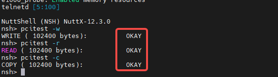
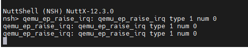

# PCI 子系统技术详解

\[ [English](../../../../../en/device_dev_guide/driver/bus_driver/PCI/pci.md) | 简体中文 \]

## 一、PCI 子系统框架概述

openvela 操作系统中的 PCI (Peripheral Component Interconnect) 子系统，其核心设计在很大程度上遵循了 Linux PCI 子系统的成熟模型。因此，熟悉 Linux 内核的开发者可以快速掌握其核心概念。

openvela 的 PCI 框架主要由以下三个核心部分构成：

- **PCI 控制器初始化与总线枚举**：负责系统启动时扫描 PCI 总线，发现所有连接的设备并分配资源。
- **PCI RC(Root Complex) 驱动注册**：管理面向 RC 的设备驱动，实现设备与驱动的匹配和初始化。
- **PCI EPC (Endpoint Controller) 框架**：支持将系统配置为 PCI Endpoint 设备，并管理其功能。

## 二、PCI 控制器初始化与总线枚举

### 1、初始化流程

系统上电后，PCI Host Bridge（主桥）驱动会调用 `pci_register_controller()` 函数启动 PCI 子系统的初始化。整个过程遵循标准的 PCI 总线枚举（Bus Enumeration）流程。


其详细步骤如下：

1. **初始化根总线**：

    系统为根总线（Bus 0）申请资源并初始化相关的链表结构。这包括将总线节点挂载到全局总线列表 `g_pci_buses`，并初始化其 `children`（子总线）和 `devices`（设备）链表。

2. **深度优先遍历设备**：

    包括 PCI-to-PCI 桥和 Endpoint 节点设备，通过调用 `pci_alloc_device` 申请相应 `struct pci_device_s` 设备，并填充数据结构的相关成员。

    - **如果是 PCI-to-PCI 桥设备：**申请一个新的 PCI 从属总线（原总线的 `child_bus`），挂载到当前总线的`children` 链表上。接着，从桥设备往下继续扫描 `childbus`，完成子总线遍历，并填充桥设备的配置空间，主要包括 I/O `base Addr` 和 IO `limit`、内存地址的 `base` 和 `start`、预取内存地址的 `start` 和 `limit Addr` 三部分。

    - **对于 PCI Endpoint 设备**：系统调用 `pci_alloc_device()` 为其分配一个 `struct pci_device_s` 实例，并填充 BDF（Bus/Device/Function）号等信息。随后，系统会根据 BAR (Base Address Register) 空间类型（I/O、可预取内存、非预取内存）为其分配相应的 PCI 域地址。最后，将该设备挂载到所在总线的 `devices` 链表，为后续的驱动匹配过程做准备。

3. **注册设备到系统**：

    遍历完 PCI 子系统的资源后，则调用 `pci_register_bus_devices(bus)` 函数。该函数会遍历总线上的 `devices` 和 `children` 链表，并调用 `pci_register_device(dev)` 将链表上的设备注册到系统中。如果此时已有匹配的驱动程序被注册，系统将自动调用该驱动的 `probe` 回调函数；否则，设备将仅注册在总线上，等待未来驱动的加载。

### 2、核心数据结构

#### `struct pci_controller_s`

该结构定义了 PCI 控制器的资源池和操作。

```C
/* PCI controller资源配置数据 */
struct pci_controller_s 
{
  struct pci_resource_s io;                /* IO 类型 PCI 资源 /
  struct pci_resource_s mem;               /* Non pref Mem 类型 PCI 资源 /
  struct pci_resource_s mem_pref;          /*  pref Mem 类型 PCI 资源 */
  FAR const struct pci_ops_s *ops;

  FAR struct pci_bus_s *bus;               /*指向root bus */
  uint8_t busno;                           /*pci root bus */
  struct list_node node;                   /* pci 控制器链表节点，挂人全局链表 */
};
```

#### `struct pci_ops_s`

该结构定义了底层硬件控制器需要实现的钩子函数，用于抽象硬件操作。

```C
/*pci control 的相关钩子函数 */
struct pci_ops_s
{
  CODE int (*read)(FAR struct pci_bus_s *bus, uint32_t devfn, int where,
                   int size, FAR uint32_t *val);
  CODE int (*write)(FAR struct pci_bus_s *bus, uint32_t devfn, int where,
                    int size, uint32_t val);

  /* Return memory address for pci resource */

  CODE uintptr_t (*map)(FAR struct pci_bus_s *bus, uintptr_t start,
                        uintptr_t end);
  CODE int (*read_io)(FAR struct pci_bus_s *bus, uintptr_t addr,
                      int size, FAR uint32_t *val);
  CODE int (*write_io)(FAR struct pci_bus_s *bus, uintptr_t addr,
                       int size, uint32_t val);

  /* Get interrupt number associated with a given INTx line */

  CODE int (*get_irq)(FAR struct pci_bus_s *bus, uint32_t devfn,
                      uint8_t line, uint8_t pin);

  /* Allocate interrupt for MSI/MSI-X */

  CODE int (*alloc_irq)(FAR struct pci_bus_s *bus, uint32_t devfn,
                        FAR int *irq, int num);

  CODE void (*release_irq)(FAR struct pci_bus_s *bus, FAR int *irq, int num);

  /* Connect interrupt for MSI/MSI-X */

  CODE int (*connect_irq)(FAR struct pci_bus_s *bus, FAR int *irq,
                          int num, FAR uintptr_t *mar, FAR uint32_t *mdr);
};
```

#### `struct pci_bus_s`

该结构代表一条 PCI 总线。

```C
/* PCI bus 数据结构 */
struct pci_bus_s
{
  FAR struct pci_controller_s *ctrl;     /* Associated host controller */
  FAR struct pci_bus_s *parent_bus;  /* Parent bus */

  struct list_node node;     /* Node in list of buses */
  struct list_node children; /* List of child buses */
  struct list_node devices;  /* List of devices on this bus */

  uint8_t number;             /* Bus number */
};
```

### 3、核心 API

PCI 子系统初始化的核心就是注册 PCI 控制器：

| **函数原型**                                                     | **功能描述**                              |
| :--------------------------------------------------------------- | :---------------------------------------- |
| `int pci_register_controller(FAR struct pci_controller_s *ctrl)` | 注册一个 PCI 控制器，并启动总线枚举流程。 |
| `int pci_register_device(FAR struct pci_device_s *dev)`          | 将一个 PCI 设备注册到 PCI 核心层。        |

## 三、PCI RC (Root Complex) 设备驱动注册

当 PCI 设备和驱动都注册到 PCI 总线后，PCI 核心层会尝试为设备匹配合适的驱动。匹配成功后，系统会调用驱动提供的 `probe` 回调函数，启动设备初始化。

以 PCI EDU (Educational) 虚拟设备驱动为例，其标准流程如下：


1. **注册驱动**：

    驱动开发者实现 `struct pci_driver_s`，填充设备 ID 表（`id_table`）和 `probe` 等回调函数，然后调用 `pci_register_driver()` 将驱动注册到全局设备链表中。

2. **设备与驱动匹配**：

    当设备链表上的设备和驱动成功匹配后，则调用驱动的 `probe` 函数进行初始化配置。

3. **执行 `probe` 函数**：

    匹配成功后，系统调用驱动的 `probe` 函数，并传入 `pci_device_s` 实例作为参数。驱动在此函数中执行设备初始化，主要包括：

    - 调用 `pci_enable_device()` 使能设备。
    - 调用 `pci_set_master()` 设置配置空间，使设备能够作为总线主控方发起 I/O 和内存访问。
    - 使用 `pci_map_bar()` 映射 BAR (Base Address Register) 空间，获取可供 CPU 访问的虚拟地址。

4. **中断配置**：

    - **INT-x 的 Legacy 中断**：调用 `pci_get_irq()` 获取中断号，然后注册中断服务程序（ISR）并使能中断。
    - **消息信号中断 (MSI/MSI-X)**：调用 `pci_alloc_irq()` 申请中断资源，然后通过 `pci_connect_irq()` 配置中断能力（Capability）寄存器。同样，获取中断号后需注册 ISR 并使能。

### 1、核心数据结构

#### `struct pci_driver_s`

该结构定义了一个 PCI 设备驱动。

```C
/*PCI driver 数据成员 */
struct pci_driver_s
{
  FAR const struct pci_device_id_s *id_table;           // pci 设备id表

  /* New device inserted */

  CODE int (*probe)(FAR struct pci_device_s *dev);      //probe 钩子函数

  /* Device removed (NULL if not a hot-plug capable driver) */

  CODE void (*remove)(FAR struct pci_device_s *dev);    //remove 钩子函数

  struct list_node node;                                //driver 链表节点，挂入到全局驱动链表上
};
```

#### `struct pci_device_s`

该结构代表一个 PCI 设备。

```C
/*PCI device 数据成员 */
struct pci_device_s
{
  struct list_node node;               /* device链表节点，挂载全局pci device链表上 */
  struct list_node bus_list;           /* Node in per-bus list，挂入dev->bus->devices 链表 */
  FAR struct pci_bus_s *bus;           /* Bus this device is on */
  FAR struct pci_bus_s *subordinate;   /* Bus this device bridges to 指向从属子总线 */

  uint32_t devfn;  /* Encoded device & function index */
  uint16_t vendor; /* Vendor id */
  uint16_t device; /* Device id */
  uint16_t subsystem_vendor;
  uint16_t subsystem_device;
  uint32_t class;   /* 3 bytes: (base,sub,prog-if) */
  uint8_t revision; /* PCI revision, low byte of class word */
  uint8_t hdr_type; /* PCI header type (`multi' flag masked out) */

  /* I/O and memory regions + expansion ROMs */

  struct pci_resource_s resource[PCI_NUM_RESOURCES];

  FAR struct pci_driver_s *drv;
  FAR void *priv;                                 /* Used by pci driver */
};
```

### 2、核心 API

| **函数原型**                                                                | **功能描述**                          |
| :-------------------------------------------------------------------------- | :------------------------------------ |
| `int pci_register_driver(FAR struct pci_driver_s *drv)`                     | 注册一个 PCI 设备驱动。               |
| `int pci_enable_device(FAR struct pci_device_s *dev)`                       | 使能 PCI 设备，分配 I/O 和内存资源。  |
| `void pci_set_master(FAR struct pci_device_s *dev)`                         | 启动 PCI 设备内存和 IO 读写请求控制。 |
| `void *pci_map_bar(FAR struct pci_device_s *dev, int bar)`                  | 映射指定 BAR 空间到 CPU 地址空间。    |
| `int pci_get_irq(FAR struct pci_device_s *dev)`                             | 获取设备使用的 PCI Legacy 中断号。    |
| `void pci_enable_irq(FAR struct pci_device_s *dev, int irq)`                | 使能指定的 PCI Legacy 中断号。        |
| `void pci_disable_irq(FAR struct pci_device_s *dev)`                        | 禁用 PCI Legacy 中断。                |
| `int pci_alloc_irq(FAR struct pci_device_s *dev, FAR int *irq, int num)`    | 申请 MSI/MSI-X 中断。                 |
| `void pci_release_irq(FAR struct pci_device_s *dev, FAR int *irq, int num)` | 释放已申请的 MSI/MSI-X 中断。         |
| `int pci_connect_irq(FAR struct pci_device_s *dev, FAR int *irq, int num)`  | 配置 MSI/MSI-X 中断能力寄存器。       |

### 3、实践：使用 QEMU 启动 PCI EDU 设备

EDU (Educational) 设备是 QEMU 提供的一个虚拟 PCI 设备，非常适合用于学习和调试 PCI 驱动开发。您可以在 QEMU 环境下便捷地完成驱动测试。

**启动命令示例：**

```bash
sudo qemu-system-aarch64 \
    -m 32g \
    -cpu cortex-a53 \
    -machine virt,virtualization=on,gic-version=2 \
    -kernel /path/to/your/nuttx \
    -nographic \
    -chardev stdio,id=con,mux=on \
    -serial chardev:con \
    -mon chardev=con,mode=readline \
    -device edu \
    -D ./nuttx_edu.log
```

> **说明**：
>
> 请根据您的实际环境修改命令中的本地路径 `/path/to/your/nuttx`。

## 四、PCI EPC (Endpoint Controller) 框架

PCI EPC (Endpoint Controller) 允许系统作为 PCI 总线上的一个 Endpoint 设备存在。其设计同样借鉴了 Linux 的三层模型，自上而下分别是：

1. **Endpoint 设备功能驱动层 (EP Function Driver)**：实现设备具体功能的驱动。
2. **Endpoint 核心框架层 (EP Framework)**：提供统一的接口，连接功能驱动与控制器驱动。
3. **Endpoint 控制器驱动层 (EP Controller Driver)**：直接与硬件交互的底层驱动。


### 1、EPF (Endpoint Function) 驱动流程

1. **创建 EPC 设备**：

    EP Controller 是一个 PCI 设备， EPC 驱动作为一个标准的 PCI 设备驱动，当系统探测到 EP Controller 硬件时，会调用其 `probe` 函数。在该函数中，除了完成常规的 PCI 初始化外，还会调用 `pci_epc_create()` 创建一个 EPC 设备，并将其加入全局列表 `g_pci_epc_device_list`。

2. **注册 EPF 设备与驱动**：

    PCI EPF 设备通过 `pci_epf_device_register()` 注册，PCI EPF 驱动通过 `pci_epf_register_driver()` 注册，匹配成功后会调用相关驱动的 `probe` 函数。

3. **绑定 EPF 与 EPC**：

    当 EPF 设备与驱动匹配成功后，核心层会调用 `pci_epf_bind()`。该函数会触发驱动的 `bind` 回调。在 `bind` 回调中，EPF 驱动会关联到具体的 EPC 设备，初始化配置空间和 BAR 空间。

4. **启动 EPF**：

    `bind` 完成后，上层应用可以发起 `start` 请求，最终会调用 EPC 驱动的 `start` 回调函数。

5. **配置硬件**：

    在 `start` 回调中，EPC 驱动根据 EPF 的特性（如是否支持 MSI/MSI-X）配置相关硬件寄存器，使能 PCI Link。

### 2、核心数据结构

#### `struct pci_epc_ctrl_s`

该结构代表一个 Endpoint 控制器。

```C
/* PCI EPC control 数据成员 */
struct pci_epc_ctrl_s
{
  struct list_node epf;                               //ep func 链表，epf将挂在该链表上
  FAR const struct pci_epc_ops_s *ops;
  FAR struct pci_epc_mem_s *mem;                      //epc address space
  unsigned int num_windows;                           // ob 的 map个数
  uint8_t max_functions;                             //最大function 8
  struct list_node node;                             //挂到全局pci_epc_device 链表上
  
  /* Mutex to protect against concurrent access of EP controller */
  mutex_t lock;
  unsigned long funcno_map;                                       //func no 的bitmap
  FAR void *priv;
  char name[0];
};

/*epc ops 定义的钩子函数 */
static const struct pci_epc_ops_s g_qemu_epc_ops =
{
  .write_header = qemu_epc_write_header,
  .set_bar      = qemu_epc_set_bar,
  .clear_bar    = qemu_epc_clear_bar,
  .map_addr     = qemu_epc_map_addr,
  .unmap_addr   = qemu_epc_unmap_addr,
  .raise_irq    = qemu_epc_raise_irq,
  .start        = qemu_epc_start,
  .get_features = qemu_epc_get_features,
  .set_msi      = qemu_epc_set_msi,
  .get_msi      = qemu_epc_get_msi,
  .set_msix     = qemu_epc_set_msix,
  .get_msix     = qemu_epc_get_msix,
};
```

#### `struct pci_epf_driver_s`

该结构定义了一个 Endpoint 功能驱动。

```C
/* PCI epf driver 数据成员 */
struct pci_epf_driver_s
{
  CODE int (*probe)(FAR struct pci_epf_device_s *epf);
  CODE void (*remove)(FAR struct pci_epf_device_s *epf);

  struct list_node node;                               //挂载全局pci_epf_device链表
  FAR struct pci_epf_ops_s *ops;                       //见下表g_pci_epf_test_ops 
  FAR const struct pci_epf_device_id_s *id_table;      //见下表g_pci_epf_test_id_table
};

static const struct pci_epf_ops_s g_pci_epf_test_ops =
{
  .unbind = pci_epf_test_unbind,
  .bind   = pci_epf_test_bind,
};

static const struct pci_epf_device_id_s g_pci_epf_test_id_table[] =
{
  {.name = "pci_epf_test_0", },
  {.name = "pci_epf_test_1", },
  {}
};
```

### 3、核心 API

| **函数原型**                                           | **功能描述**                                |
| :----------------------------------------------------- | :------------------------------------------ |
| `FAR struct pci_epc_ctrl_s *pci_epc_create(...)`       | 创建一个 Endpoint 控制器设备。              |
| `void pci_epc_destroy(FAR struct pci_epc_ctrl_s *epc)` | 注销并释放一个 Endpoint 控制器设备。        |
| `int pci_epc_start(FAR struct pci_epc_ctrl_s *epc)`    | 启动 EPC，使能 PCI Link。                   |
| `void pci_epc_stop(FAR struct pci_epc_ctrl_s *epc)`    | 停止 EPC，断开 PCI Link。                   |
| `int pci_epc_raise_irq(...)`                           | 通过 EPC 发起一个中断（INTx, MSI, MSI-X）。 |
| `int pci_epc_set_bar(...)`                             | 为指定的 Function 配置 BAR 空间。           |
| `int pci_epc_add_epf(...)`                             | 将一个 EPF 设备关联到一个 EPC 上。          |
| `int pci_epf_device_register(...)`                     | 注册一个 EPF 设备。                         |
| `int pci_epf_register_driver(...)`                     | 注册一个 EPF 驱动。                         |

## 五、调试工具：pciutils

`pciutils` 包含一个用于访问 PCI 总线配置寄存器的可移植库和基于这个库开发的多个实用程序。`pciutils` 支持不同的 OS 平台，通过 OS 特有的方法来访问 PCI 设备，所以 `pciutils` 能够兼容不同 OS。

为了在 openvela 上支持 `pciutils`，NuttX 系统采用的方法是移植了 OpenBSD 的 PCI `ioctl` 接口。

- 代码位置：`external/pciutils`
- 编译：在 menuconfig 中使能 `CONFIG_PCIUTILS=y`

**使用示例 (****`lspci`****)：**


## 六、测试工具：pcitest

`pcitest` 是一个集成在 `apps/testing` 目录下的 PCI Endpoint 测试应用程序。它需要与 `pci_ep_test.c` 驱动配合使用，用于验证 RC 与 EP 之间的通信。

- 应用位置：`apps/testing/pcitest`
- 编译配置：

    - 使能 `CONFIG_TESTING_PCITEST=y` 以编译 `pcitest` 应用。
    - 使能 `CONFIG_EP_TEST=y` 以编译 `pci_ep_test.c` 驱动。

**运行示例：**

- RC端 `pcitest` 测试输出：

    

- EP 端测试输出：

    
