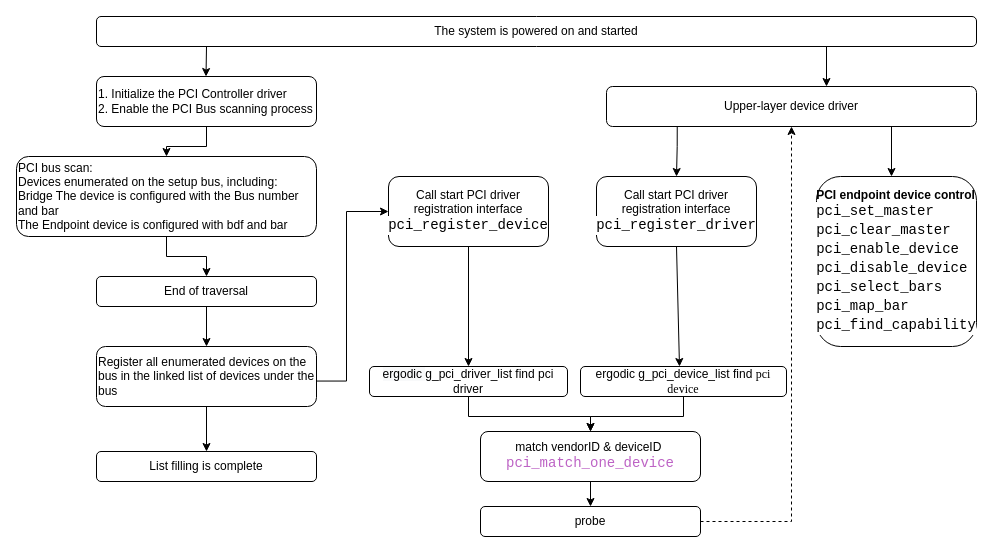
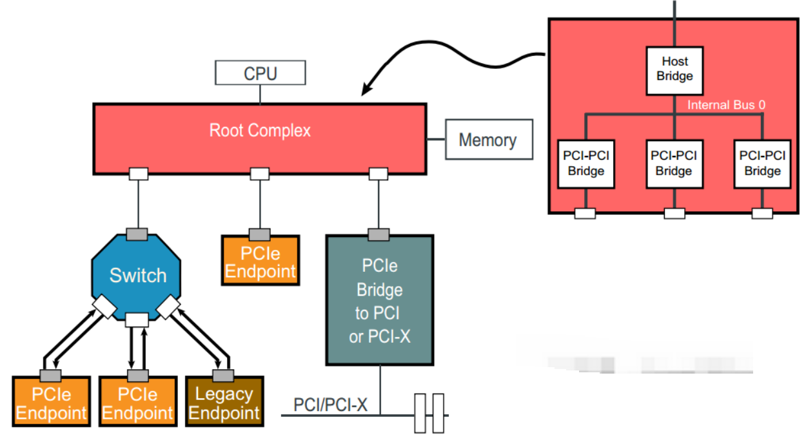
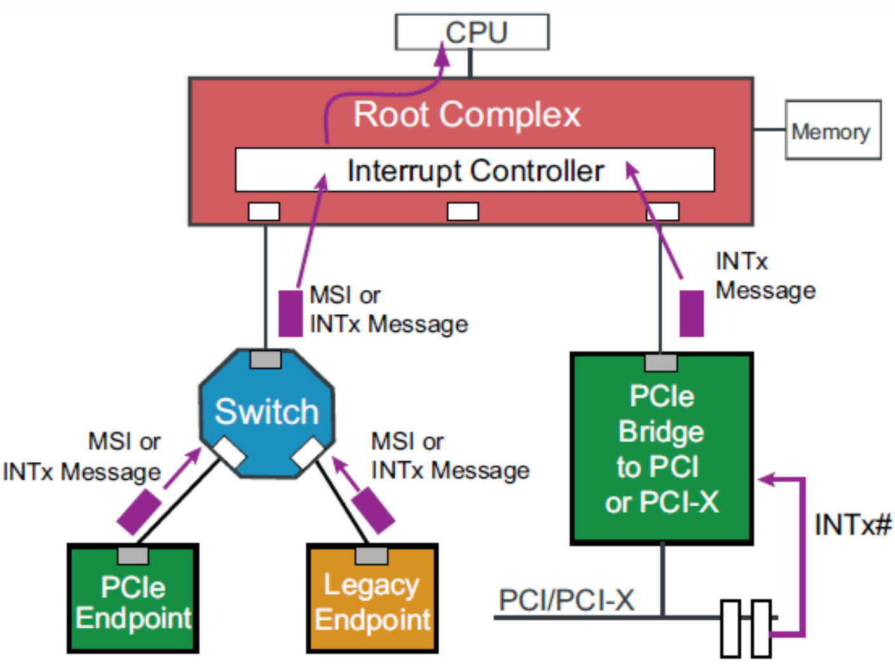
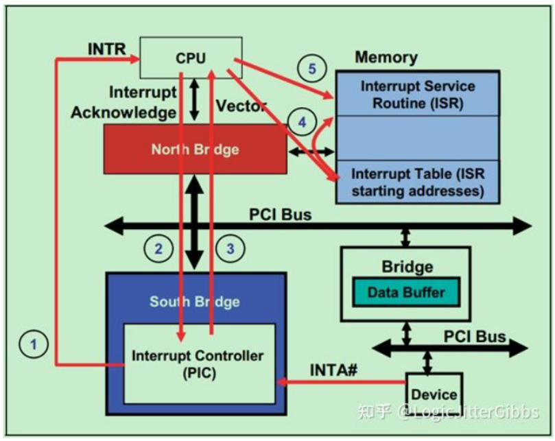
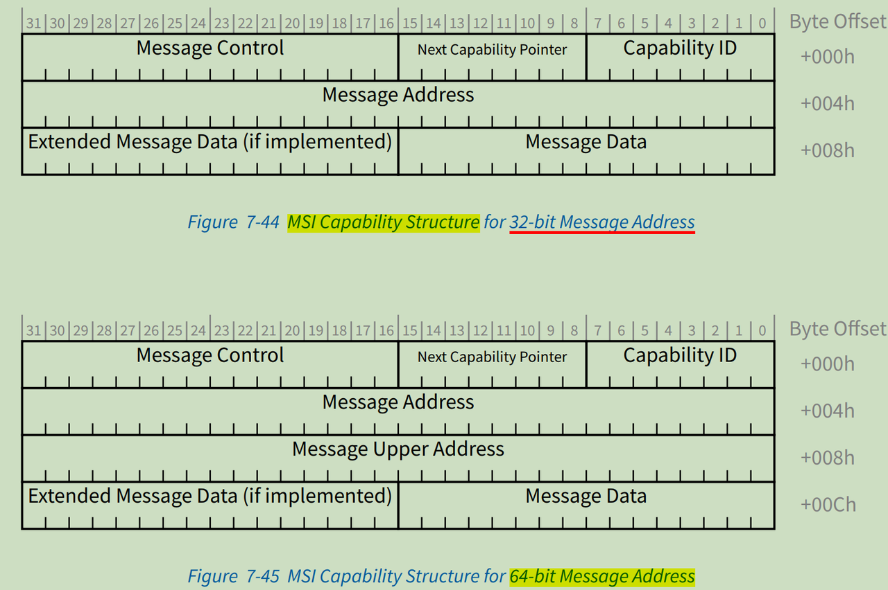
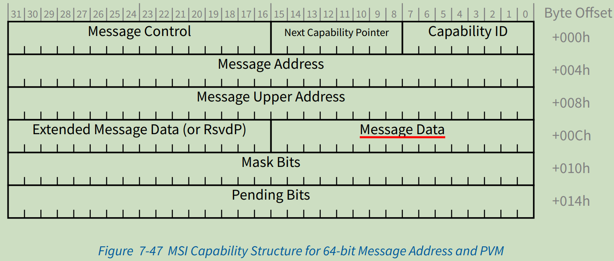
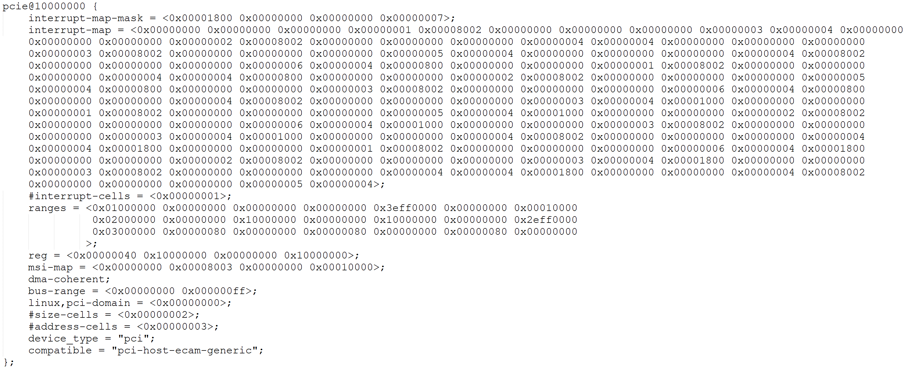

# PCI/PCIe Host 驱动框架开发指南

\[ [English](../../../../../en/device_dev_guide/driver/bus_driver/PCI/pci_host.md) | 简体中文 \]

本文档作为 openvela 中 PCI/PCIe 主机（Host）框架的综合开发指南，旨在为驱动开发者和系统工程师提供清晰、完整的参考。内容涵盖了从 PCI/PCIe 核心概念到操作系统中的软件架构、驱动开发 API、平台配置及 QEMU 实践的全过程。

## 一、概述

外设组件互连标准（Peripheral Component Interconnect, PCI）架构作为 ISA 标准的替代品，其设计旨在实现三个核心目标：

- **提升性能**：实现主机与外设之间更高的数据传输速率。
- **平台无关性**：最大程度地减少对特定硬件平台的依赖。
- **简化扩展**：简化添加和移除外设的流程。

PCI 设备采用无跳线设计，系统引导时可自动完成配置。每个 PCI 功能（Function）由唯一的**总线号（Bus Number）**、**设备号（Device Number）** 和**功能号（Function Number）** 组成的三元组（BDF）进行标识。系统可以通过 PCI 桥（Bridge）连接多个总线，从而构建出复杂的设备拓扑。

## 二、术语

| **术语/缩写** | **英文全称**                            | **中文释义及说明**                                  |
| :------------ | :-------------------------------------- | :-------------------------------------------------- |
| **PCI**       | Peripheral Component Interconnect       | 外设组件互连标准。                                  |
| **PCIe**      | PCI Express                             | PCI Express，PCI 的高速串行化版本。                 |
| **RC**        | Root Complex                            | 根联合体，连接 CPU 和 PCIe 总线系统的核心组件。     |
| **EP**        | Endpoint                                | 终端设备，如网卡、显卡等。                          |
| **BAR**       | Base Address Register                   | 基地址寄存器，用于映射设备的内存或 I/O 空间。       |
| **MSI**       | Message Signaled Interrupt              | 消息信号中断，一种现代的中断机制。                  |
| **MSI-X**     | MSI-Extended                            | MSI 的扩展，支持更多中断向量且无需连续。            |
| **CAM**       | Configuration Access Mechanism          | PCI 兼容的配置访问机制。                            |
| **ECAM**      | Enhanced Configuration Access Mechanism | PCIe 增强型配置访问机制。                           |
| **BDF**       | Bus, Device, Function                   | 总线号、设备号、功能号，用于唯一标识一个 PCI 功能。 |

## 三、PCI 框架设计与初始化流程

openvela 的 PCI 框架负责在系统启动时初始化 PCI 控制器、枚举总线上的所有设备，并完成设备与驱动程序的匹配与绑定。整个流程主要分为两个阶段：**控制器初始化与总线枚举**和**设备与驱动的匹配与探测**。



### 1、控制器初始化与总线枚举

此阶段由 PCI 控制器驱动（Controller Driver）在系统启动早期触发，旨在完成底层硬件的初始化和设备发现。

1. **初始化资源：**

    控制器驱动首先为 PCI 子系统配置并初始化所需的地址空间，包括 I/O 空间、非预取（Non-Prefetchable）内存空间和预取（Prefetchable）内存空间。

2. **枚举 PCI 总线树：**

    系统从根总线（Bus 0）开始，递归地扫描所有 PCI 总线以发现连接的设备。

    - 系统遍历总线上的每个设备，为其分配唯一的 BDF（总线号、设备号、功能号）标识。
    - 系统识别设备类型（Endpoint 或 Bridge），并初始化其 BAR（基地址寄存器）。
    - 系统将发现的设备（Bridge 或 Endpoint）添加到其所在总线的设备链表（`devices`）中。
    - 如果发现 Bridge 设备，系统将递归进入其下的次级总线（Secondary Bus）继续扫描，直至遍历完整个总线树。

3. **构建全局设备链表：**

    总线枚举完成后，系统会遍历所有总线下的设备链表。随后，系统调用 `pci_register_device` 接口，将每个发现的设备注册到全局设备链表 `g_pci_device_list` 中。

### 2、设备与驱动的匹配与探测（Probe）

openvela 采用动态匹配机制，确保设备无论何时注册，都能与其对应的驱动程序正确绑定。此过程主要分为以下两种场景：

#### 场景一：设备注册时，驱动已存在

这是系统启动过程中的常见场景，此时驱动程序通常已先于设备被注册。

1. 在 `pci_register_device` 函数中，当一个新设备被添加到 `g_pci_device_list` 后，系统会立即遍历全局驱动链表 `g_pci_driver_list`。
2. 系统通过比较设备与驱动的 `vendorID` 和 `deviceID` 进行匹配。
3. 一旦找到首个匹配的驱动，系统立即调用该驱动的 `probe` 函数来初始化设备。
4. `probe` 函数执行成功后，匹配过程终止，`pci_register_device` 函数返回成功。

#### 场景二：驱动注册时，设备已存在

此场景适用于可动态加载的驱动模块，此时设备可能已经存在于全局设备链表中。

1. 当一个新驱动通过 `pci_register_driver` 接口注册到 `g_pci_driver_list` 时，系统会立即遍历全局设备链表 `g_pci_device_list`。
2. 系统同样通过 `vendorID` 和 `deviceID` 进行匹配。
3. 如果找到一个匹配的设备，系统会为该设备调用此新驱动的 `probe` 函数。
4. 与场景一不同，系统会继续遍历整个设备链表，以确保所有已存在的、符合条件的设备都能被该驱动接管。

### 3、驱动接管与设备控制

一旦设备与驱动匹配成功且 `probe` 函数执行完毕，驱动程序就会获得一个指向 `struct pci_device_s` 结构体的有效指针。通过此指针，驱动可以完全控制该 PCI 设备，例如调用 `pci_set_master()` 启用总线主控功能，或通过访问 BAR 映射的地址空间与设备进行通信。

## 四、PCIe 核心概念



### 1、特点

- **高速串行通信**：PCIe 采用点对点串行连接和差分信号传输，可实现全双工通信，速率远超并行总线。
- **拓扑核心**：PCIe 主机（Host）驱动对应于拓扑中的根联合体（Root Complex），其功能类似于传统 PCI 的主桥（Host Bridge）。

### 2、系统组件

一个典型的 PCIe 系统由以下几种关键设备构成：

- **Root Complex (RC)：**

    根联合体，作为 CPU 与 PCIe 总线系统的接口。它位于拓扑树的“根部”，生成 PCIe 总线域，并通过其根端口（Root Port）与下游设备通信。RC 可能包含几个组件(处理器接口、DRAM 接口等)，甚至可能包含几个芯片。广义上RC 可以理解为**系统 CPU** 和 **PCle 拓扑**之间的**接口**，PCle 端口**在配置空间中**被标记为**根端口**。

- **Bridge：**

    桥，提供 PCIe 总线与其他总线（如 PCI、PCI-X、甚至是另一个 PCle 总线）之间的接口。
  
    - **Forward Bridge**：允许旧的 PCI/PCI-X 设备接入新的 PCIe 系统。
    - **Reverse Bridge**：允许新的 PCIe 设备接入旧的 PCI/PCI-X 系统。

- **Switch：** 提供扩展或聚合能力，并允许更多的设备连接到一个 PCle 端口。它们充当包路由器，根据地址或其他路由信息识别给定包需要走哪条路径。是一种 PCIe 转 PCIe 的桥。
- **Endpoint (EP)：** 终端设备，位于 PCIe 拓扑的叶子节点，是 I/O 操作的最终发起者（Initiator）或完成者（Completer）。例如 PCIe 网卡、NVMe SSD 等。显然，Endpoint 只能接受来自上级拓扑的数据包或者向上级拓扑发送数据包。

### 3、PCIe 拓扑结构

PCIe 系统呈现为一个倒置的树形拓扑结构。


- **Root Complex (RC)**：作为树的根节点，它内部实现了一个主桥（Host Bridge），用于在 CPU 地址域和 PCI 地址域之间转换。RC 同时生成内部总线（Bus 0），并通过多个根端口（Root Port，本质是 PCI-to-PCI Bridge）向下扩展。PCI Bridge 用于系统的扩展，没有地址转换功能。
- **Switch**：作为树的枝干，用于进一步扩展总线。每个 Switch 包含一个上游端口和多个下游端口，每个端口都等效于一个 PCI-to-PCI Bridge。
- **Endpoint (EP)**：作为树的叶子节点，是最终的功能设备，比如 PCIe 网卡，显卡，NVMe 卡等。

### 4、PCIe 配置访问机制

PCIe 支持两种配置空间访问机制：

- **PCI-compatible Configuration Access Mechanism (CAM)**：兼容传统 PCI 的配置访问方式，通过 I/O 端口 `0xCF8` 和 `0xCFC` 访问。
- **PCI** **Express Enhanced Configuration Access Mechanism (ECAM)**：增强型配置访问机制，将所有设备的配置空间映射到一片连续的内存地址，CPU 可直接通过内存访问（Memory-Mapped I/O, MMIO）进行读写。

### 5、PCIe 基址寄存器 BAR

#### 功能与作用

基地址寄存器（Base Address Registers, BAR）是 PCIe 设备向系统软件展示其内部资源需求的关键机制。

1. **资源发现**：设备通过 BAR 向系统软件声明其所需的地址空间大小、类型（内存或 I/O）和属性（如是否可预取）。
2. **地址分配**：系统软件读取 BAR 的信息后，从可用的系统地址池中为设备分配一个连续的地址范围，并将该范围的基地址写回 BAR。
3. **地址映射**：完成配置后，CPU 便可通过访问这段映射的地址来与设备进行通信。

#### BAR 空间大小计算

系统软件通过以下标准步骤来确定 BAR 所需的空间大小：

1. 向目标 BAR 寄存器写入全 `1`（`0xFFFFFFFF`）。
2. 回读该寄存器的值。由于只有地址掩码位是可读写的，硬件会返回一个形如 `0xFFFFF000` 的值（低位由硬件固定）。
3. 对回读的值按位取反，然后加 1，即可得到该 BAR 请求的地址空间大小。例如 `~0xFFFFF000 + 1 = 0x1000`，表示需要 4KB 空间。
4. 该寄存器定义了这段地址空间的访问类型（Memory 方式还是 IO 方式）。

#### BAR 字段解析

基址寄存器（Base Address Register, BAR）是一个 32 位的寄存器，其内部的位域共同定义了设备所需资源的类型、属性，并用于确定所需地址空间的大小。系统软件在配置设备时，会首先读取这些信息，然后将分配好的基地址写回该寄存器。

下表详细解析了 BAR 寄存器中各个位域的功能：

| **位域**                                                     | **字段名称**                 | **描述**                                                                                                                                                                                                                              |
| :----------------------------------------------------------- | :--------------------------- | :------------------------------------------------------------------------------------------------------------------------------------------------------------------------------------------------------------------------------------ |
| **Bit 0**                                                    | **资源类型 (Resource Type)** | **只读**。用于标识资源是内存空间还是 I/O 空间。 <br>- `0`: 表示该 BAR 用于映射**内存空间 (Memory Space)**。<br> - `1`: 表示该 BAR 用于映射 **I/O 空间 (I/O Space)**。                                                                 |
| **Bits 2:1**                                                 | **内存空间类型 (Type)**      | 仅当 **Bit 0 为** **`0`** 时有效。**只读**。<br> `00b`: 32 位地址。表示该 BAR 可映射到 4GB 以下的任意内存地址。<br> `10b`: 64 位地址。表示该 BAR 可映射到 4GB 以上的内存地址。此时，它会与下一个相邻的 BAR 共同组成一个 64 位基地址。 |
| **Bit 3**                                                    | **可预取 (Prefetchable)**    | 仅当 **Bit 0 为** **`0`** 时有效。**只读**。 <br>`0`: 不可预取。表示读取该区域可能产生副作用，系统不应投机性地读取。 <br> `1`: 可预取。表示该内存区域没有读副作用，系统可以安全地预取数据以提升性能。                                 |
| **Bits 31:4**  **(内存空间)**  **Bits 31:2**  **(I/O 空间)** | **基地址 / 大小掩码**        | 这个位域具有双重作用： <br>1.  **大小探测阶段**：这些可读写的位作为掩码，用于计算设备所需的空间大小。 <br>2.  **地址配置阶段**：在大小确定后，系统软件将分配的内存或 I/O 基地址写入这些位。                                           |

#### 配置头类型与 BAR 布局

PCIe 设备的配置空间根据其在拓扑结构中的角色，分为两种不同的头部（Header）布局：**0 型配置头（Type 0 Header）** 和 **1 型配置头（Type 1 Header）**。这两种布局在所支持的基地址寄存器（BAR）数量和功能上存在显著差异。


- 0 型配置头 (Type 0 Header)：

    - 适用设备：终端设备（Endpoint），如网卡、显卡等非桥接设备。
    - BAR 数量：支持多达 **6 个** 32 位 BAR 寄存器，为设备提供了丰富的地址空间映射能力。

- 1 型配置头 (Type 1 Header)：

    - 适用设备：桥接设备（Bridge），包括根联合体（RC）的根端口（Root Port）和交换机（Switch）的端口。
    - BAR 数量：仅支持 **2 个** 32 位 BAR 寄存器。
    - 关键路由寄存器：除了 BAR，1 型头还包含用于总线枚举和事务路由的关键寄存器，如下表所示。

    | **寄存器名称** | **英文全称**           | **描述**                                             |
    | :------------- | :--------------------- | :--------------------------------------------------- |
    | **主总线号**   | Primary Bus Number     | 桥自身所在的上游总线的编号。                         |
    | **次总线号**   | Secondary Bus Number   | 桥下游直接连接的总线的编号。                         |
    | **从总线号**   | Subordinate Bus Number | 该桥下游（包括所有子桥）可达的所有总线中的最大编号。 |

### 6、PCIe 地址空间

PCIe 规范定义了四种物理地址空间，与 PCI 完全兼容：

- **配置空间（Configuration Space）**：用于设备发现、配置和资源分配。
- **内存空间（Memory Space）**：用于映射设备内存，CPU 可通过内存读写指令访问。
- **I/O 空间（I/O Space）**：用于映射设备 I/O 寄存器，CPU 需通过专用的 I/O 指令访问。
- **消息事务（Message Transactions）**


### 7、PCIe 中断机制与 Capability

PCIe 为实现向下兼容，继承了 PCI 的中断机制，但实现方式有所不同。为了减少物理引脚，PCIe 将所有中断信号都转换为在串行总线上传输的**消息事务（Message Transaction）**。根据规范，所有 PCIe 设备都**必须**支持 MSI 或 MSI-X 中断机制。



#### 传统中断

INTx 是 PCI 定义的传统中断机制，在 PCI 总线中通过 `INTA#`, `INTB#`, `INTC#`, `INTD#` 四个独立的**边带信号（Sideband Signal）** 物理引脚来触发。

在 PCIe 体系中，为了保持兼容性并减少引脚，物理的 INTx 信号被废除。取而代之的是，当设备需要触发一个传统中断时，它会发送一个特定类型的**消息事务**（例如 `Assert_INTA`），该消息在总线上传输至根联合体（RC），最终由 RC 转换为系统可以识别的传统中断信号。这是一种对传统机制的**带内模拟（In-band Emulation）**。



#### MSI/MSI-X 消息信号中断

消息信号中断（Message Signaled Interrupt, MSI/MSI-X）是现代 PCIe 设备推荐并广泛使用的中断机制。它彻底摒弃了边带信号，通过向一个特定的内存地址写入一个特定的数据值来直接触发中断。

- **工作原理**：设备通过总线发送一个**内存写事务（Memory Write TLP）**。当根联合体（RC）收到这个写事务后，会解析其目标地址和数据，并将其路由到相应的 CPU 中断控制器，从而触发一个中断。
- **MSI vs. MSI-X 对比**：

    - **MSI**：最多支持 32 个中断向量，且要求这些向量在物理上是连续的。
    - **MSI-X**：是 MSI 的扩展，功能更强大。它最多可支持 2048 个中断向量，不要求向量连续，并且每个中断都可以拥有独立的地址和数据，为驱动程序提供了极大的灵活性。


#### PCI Capability 结构

系统软件如何知道一个设备支持哪些高级功能（如 MSI/MSI-X、电源管理等）？答案是通过 **Capability 链表**。

PCI/PCIe 设备通过在其配置空间中实现一个单向链表来宣告其支持的各种能力（Capabilities）。

- **Capabilities Pointer**：位于配置空间头部的 `0x34` 偏移处，它是一个指针，指向链表中的第一个 Capability 结构。如果该值为 0，则表示设备不支持任何 Capability。
- **Capability 结构**：链表中的每个节点都是一个 Capability 结构。它至少包含两个字段：
  
    - **Capability ID**：一个 8 位的 ID，用于唯一标识该能力的类型（如 `0x05` 代表 MSI）。
    - **Next Capability Pointer**：一个 8 位的指针，指向链表中的下一个 Capability 结构。链表末尾的节点此指针为 0。


#### MSI Capability 结构

当系统在 Capability 链表中找到 ID 为 `0x05` 的节点时，就发现了 MSI 能力。其后的寄存器定义了 MSI 的具体配置。MSI Capability 支持 4 种结构方式：






#### MSI-X Capability 结构

同理，ID 为 `0x11` 的节点代表 MSI-X 能力。其结构指向一个独立的 MSI-X 表（Table），提供了更灵活的配置方式。


## 五、PCI 驱动框架与接口

本章旨在介绍 openvela 中 PCI/PCIe 驱动框架的软件架构、核心 API、平台配置方法。

### 1、核心软件架构：模型与组件

该 PCI 框架围绕四个核心数据结构构建，形成了一个层次分明的模型：

| **核心结构**            | **英文**           | **角色与职责**                                                                                                  | **关键注册函数**            |
| :---------------------- | :----------------- | :-------------------------------------------------------------------------------------------------------------- | :-------------------------- |
| **控制器 (Controller)** | `pci_controller_s` | 代表一个 PCI 主机控制器（Host Bridge/RC）。管理总线号、I/O 及内存地址空间资源，并提供对配置空间的底层读写操作。 | `pci_register_controller()` |
| **总线 (Bus)**          | `pci_bus_s`        | 代表一条 PCI 总线。形成一个树状结构，根节点为 0 号总线，每个桥设备下会分出新的子总线。                          | `pci_scan_bus`              |
| **设备 (Device)**       | `pci_device_s`     | 代表一个 PCI/PCIe 设备（Endpoint 或 Bridge）。包含其 Vendor/Device ID、配置空间信息、BAR 资源等。               | `pci_register_device()`     |
| **驱动 (Driver)**       | `pci_driver_s`     | 软件逻辑单元。用于驱动一类或一个特定的 PCI 设备。通过 `probe` 函数与设备绑定，通过 `remove` 函数解绑。          | `pci_register_driver()`     |

**初始化与枚举流程：**

1. **控制器注册**：平台启动时，`pci_ecam.c` 等平台相关代码根据设备树（DTS）信息，调用 `pci_register_controller()` 注册一个 PCI 主机控制器。
2. **总线扫描**：控制器注册成功后，框架内部自动调用 `pci_scan_bus()`，从 0 号总线开始进行深度优先的设备扫描（枚举）。
3. **设备发现与配置**：扫描过程中，为发现的每个设备（Endpoint 或 Bridge）创建 `pci_device_s` 结构，并调用 `pci_setup_device()` 分配 BAR 资源。
4. **驱动匹配与绑定**：对于每个被发现的设备，框架会遍历已注册的驱动列表（通过 `pci_register_driver()` 注册），根据 Vendor/Device ID 进行匹配。匹配成功后，调用驱动的 `probe` 函数，完成设备与驱动的绑定。

### 2、设备驱动开发接口 (API)

框架为设备驱动开发者提供了一套标准的 API，用于与设备交互。

#### 设备使能与资源管理

| **函数/宏**                   | **描述**                                              |
| :---------------------------- | :---------------------------------------------------- |
| `int pci_enable_device(dev)`  | 使能 PCI 设备 command 寄存器的 I/O 或 Memory 等能力。 |
| `void pci_set_master(dev)`    | 启动设备发出 Memory 和 I/O 读写请求控制能力。         |
| `void *pci_map_bar(dev, bar)` | 对 PCI 设备中的 BAR 进行地址映射。                    |
| `pci_select_bars`             | 获取 PCI 设备某种资源类型的 BAR Mask 数据.            |

#### 配置空间访问

| **函数/宏**                                            | **描述**                     |
| :----------------------------------------------------- | :--------------------------- |
| `pci_read/write_config_xxx`<br>`pci_read/write_io_xxx` | PCI 设备配置地址空间读写宏。 |
| `uint8_t pci_find_capability(dev, cap)`                | 获取 PCI 设备的指定`cap`。   |

#### 资源信息获取

| **宏**                         | **描述**                                                      |
| :----------------------------- | :------------------------------------------------------------ |
| `pci_resource_start(dev, bar)` | 获取指定 BAR 的物理起始地址。                                 |
| `pci_resource_end(dev, bar)`   | 获取指定 BAR 的物理结束地址。                                 |
| `pci_resource_len(dev, bar)`   | 获取指定 BAR 的空间大小。                                     |
| `pci_resource_flags(dev, bar)` | 获取指定 BAR 的资源类型标志（如 I/O、Memory、Prefetchable）。 |

### 5、关键源文件概览

| **文件名**        | **描述**                                                                                                                                                                               |
| ----------------- | -------------------------------------------------------------------------------------------------------------------------------------------------------------------------------------- |
| `pci.c`           | **框架核心**。实现了 PCI 总线、设备、驱动的模型，以及总线扫描和驱动匹配的通用逻辑。                                                                                                    |
| `pci_ecam.c`      | PCI 配置空间的一种基址，包括配置空间地址初始化，读写操作初始化及 `generic` 读写操作函数的实现。                                                                                        |
| `pci_drivers.c`   | **驱动注册入口**。通过宏条件编译，调用不同虚拟设备驱动（如 `ivshmem`, `qemu-test`, `qemu-edu`）的注册函数。                                                                            |
| `pci_qemu_test.c` | 一个具体的**设备驱动示例**，用于匹配 QEMU 提供的 `pci-testdev` 虚拟设备（VID: `1b36`, DID: `0005`）。详情请参见 [QEMU 官网](https://www.qemu.org/docs/master/specs/pci-testdev.html)。 |
| `pci_qemu_edu.c`  | 另一个**设备驱动示例**，用于匹配 QEMU 的 `edu` 教学虚拟设备（VID: `1234`, DID: `11e8`）。详情请参见 [QEMU 官方文档](https://www.qemu.org/docs/master/specs/edu.html)。                 |
| `pci_ids.h`       | 标准化的 Vendor ID、Device ID、Class Code 等宏定义。                                                                                                                                   |
| `pci_regs.h`      | 标准化的 PCI 配置空间寄存器偏移量和 Capability ID 宏定义。                                                                                                                             |

### 6、平台集成：设备树 (DTS) 配置

PCI 主机控制器（Host Controller）需要通过设备树向操作系统描述其硬件资源和特性。这是 PCI 驱动框架能够正确初始化的前提。

以下是 QEMU `virt` 机器中 `aarch64` 架构下 PCIe 主机控制器的典型 DTS 配置节点。



#### 关键属性解析

| **DTS** **属性**                | **示例值**                         | **作用与解释**                                                                                                                                                                                                                                                                                                                                         |
| :------------------------------ | :--------------------------------- | :----------------------------------------------------------------------------------------------------------------------------------------------------------------------------------------------------------------------------------------------------------------------------------------------------------------------------------------------------- |
| `compatible`                    | `pci-host-ecam-generic`            | **声明控制器类型**。<br>`ecam` 表示这是一个使用 ECAM 方式访问配置空间的通用 PCI 主机控制器。操作系统会据此选择 `pci_ecam.c` 中的驱动逻辑。                                                                                                                                                                                                             |
| `reg`                           | `<0x40 0x10000000 0x0 0x10000000>` | **定义 ECAM 配置空间**。<br>它告诉系统，用于访问所有 PCI 设备配置头部的内存窗口位于物理地址 `0x4010000000`，大小为 `0x10000000` (256MB)。                                                                                                                                                                                                              |
| `ranges`                        | `...`                              | **定义地址空间映射**。<br>这是最核心的属性，它建立了 PCI 总线地址和 CPU 物理地址之间的转换关系。该示例定义了三类映射： <br>1. **I/O 空间**：将 PCI 的 I/O 地址映射到 CPU 物理地址。 <br>2. **32 位非预取内存**：将 PCI 的 32 位内存地址映射到 CPU 物理地址。 <br>3. **64 位预取内存**：将 PCI 的 64 位可预取（Cacheable）内存地址映射到 CPU 物理地址。 |
| `bus-range`                     | `<0x00 0xff>`                      | **声明总线号范围**。<br>表示该控制器管理的 PCI 总线号范围为 0 到 255。                                                                                                                                                                                                                                                                                 |
| `#address-cells`, `#size-cells` | `<3>`, `<2>`                       | **定义地址编码格式**。<br>规定了子节点（即 PCI 设备）的地址需要用 3 个 `u32` (96位) 来表示，其大小需要用 2 个 `u32` (64位) 来表示。这是 PCIe DT-Binding 的标准要求。                                                                                                                                                                                   |

#### 示例解析

```Plain
A. PCI-e Address Mapping：

ranges = <0x01000000 0x00000000 0x00000000 0x00000000 0x3eff0000 0x00000000 0x00010000
          0x02000000 0x00000000 0x10000000 0x00000000 0x10000000 0x00000000 0x2eff0000
          0x03000000 0x00000080 0x00000000 0x00000080 0x00000000 0x00000080 0x00000000
         >;

第一组为：I/O space
第二组为：32 bit memory space
第三组为：64 bit memory space

PCI-e的子节点地址分为三个部分:
phys.hi: npt000ss bbbbbbbb dddddfff rrrrrrrr
phys.mid: hhhhhhhh hhhhhhhh hhhhhhhh hhhhhhhh
phys.low: llllllll llllllll llllllll llllllll

PCI-e地址总长为64位，地址是在phys.mid与phys.low里面，而phys.hi中的bit则有着特殊的意义:
n: is 0 if the address is relocatable, 1 otherwise (doesn’t play a role here)
p: is 1 if prefetchable (cacheable) region flag
t: is 1 if the address is aliased (for non-relocatable I/O), below 1 MB (for Memory), or below 64 KB (for relocatable I/O)
ss: space code
00: configuration space
01: I/O space
10: 32 bit memory space
11: 64 bit memory space

B. PCI-e Configuration Space

reg = <0x00000040 0x10000000 0x00000000 0x10000000>;

address region: 0x00000040 0x10000000 => 0x0000004010000000
address region size: 0x00000000 0x10000000 => 0x0000000010000000 => 0x10000000

C. bus-range
bus-range = <0x00000000 0x000000ff>;

第一个cell记录的是这条总线被分配的总线号， 第二个cell是它下属PCI总线的最大总线号。
```

## 六、实践指南：QEMU 模拟与测试

本框架支持在 QEMU 环境下，通过虚拟 PCI 设备进行功能验证。以 `ivshmem`（Inter-VM Shared Memory）设备为例，以下是完整的操作步骤：

### 第 1 步：准备环境（Host 主机）

在 Host 主机上启动 `ivshmem-server`，它为 QEMU 中的 `ivshmem` 虚拟设备提供后端共享内存服务。

```Bash
# 创建一个可供 2 个客户端连接的共享内存服务器
# "-n 2" 表示最多允许两个 QEMU 实例共享这块内存
sudo ivshmem-server -n 2
```

> **说明**: 您需要保持该服务在前台或后台运行。

### 第 2 步：系统配置与编译

在项目的 menuconfig 中，确保 PCIe 支持以及相关的测试驱动已被启用。

1. 进入配置菜单，打开日志：

    ```Bash
    ./build.sh vendor/qemu/boards/vela/configs/qemu-arm64-v8a-ap/ menuconfig
    ```

    

2. 编译系统：

    ```Bash
    ./build.sh vendor/qemu/boards/vela/configs/qemu-arm64-v8a-ap/ -j8
    ```

### 第 3 步：运行 QEMU

在 QEMU 启动命令中，使用 `-device` 参数来动态添加一个虚拟 PCI 设备。

```Bash
qemu-system-aarch64 \
  -cpu cortex-a53 \
  -machine virt,virtualization=on,gic-version=3 \
  -nographic -net none \
  -kernel path/to/your/nuttx \
  \
  # --- 关键参数：添加 ivshmem PCI 设备 ---
  # 1. 创建一个 ivshmem-doorbell 虚拟设备，并将其命名为 "ivshmem"
  -device ivshmem-doorbell,chardev=ivshmem \
  # 2. 创建一个 socket 字符设备后端，并将其连接到之前启动的 server
  -chardev socket,path=/tmp/ivshmem_socket,id=ivshmem
```

系统启动后，您应该可以在控制台日志中看到 PCI 总线扫描过程，以及 `ivshmem` 设备被成功识别并由其驱动 `probe` 的信息。

## 七、参考文档

为方便读者深入研究 PCI/PCIe 技术和相关实现，特整理以下核心参考资料。

1. 官方核心规范 (PCI-SIG)：这是 PCI/PCIe 技术的权威来源，是所有硬件设计和软件驱动开发的根本依据。

    - **[PCI Express® Base Specification](https://pcisig.com/specifications/pciexpress)**
    - **描述**：由 PCI-SIG（PCI 特别兴趣小组）发布的官方基础规范。定义了 PCIe 的物理层、数据链路层和事务层，是理解 PCIe 协议的必备文档。

2. 开源项目实现参考：通过研究成熟的开源实现，可以极大地帮助我们理解驱动框架的设计模式。

    - **[Zephyr RTOS: PCIe Host Driver](https://github.com/zephyrproject-rtos/zephyr/tree/main/drivers/pcie/host)**
    - **描述**：Zephyr 项目中的 PCIe 主机控制器驱动。其代码结构清晰，支持多种控制器，是一个非常优秀的学习和借鉴对象，尤其是在设备枚举、资源分配和中断处理方面。

3. 技术文章与博客：以下文章对理解 PCIe 的特定概念（如地址空间）提供了很好的补充。

    - **[PCI 与 PCIe基础](http://blog.chinaaet.com/justlxy/p/5100053251)**
