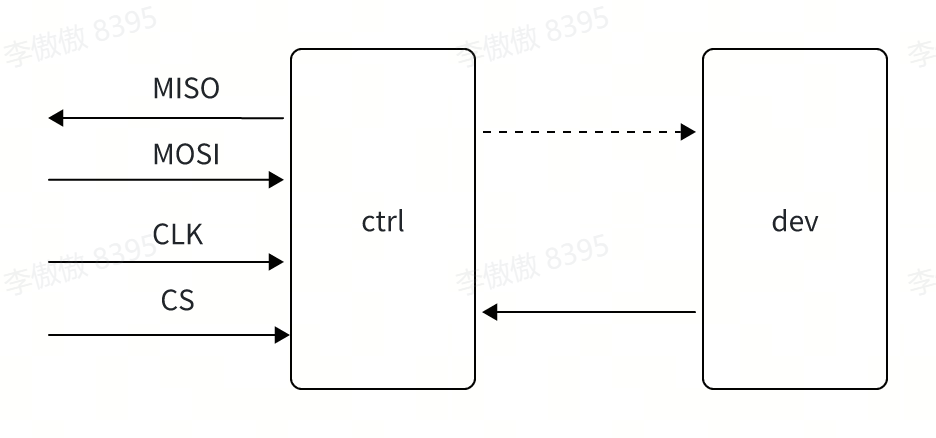

# SPI 驱动适配与使用指南

\[ [English](../../../../../en/device_dev_guide/driver/bus_driver/SPI/SPI.md) | 简体中文 \]

## 一、概括介绍

SPI（Serial Peripheral Interface，串行外围设备接口）是一种常见的同步串行通信协议，主要用于处理器和各种外围设备之间通信。其采用一组固定的信号线实现主设备（Master）与从设备（Slave）之间的数据传输：

- **SCLK（Serial Clock）**：时钟信号线，由主设备提供，用于同步数据传输。
- **MOSI（Master Output，Slave Input）**：主设备输出，从设备输入。主设备通过这条线向从设备发送数据。
- **MISO（Master Input，Slave Output）**：主设备输入，从设备输出。从设备通过这条线向主设备发送数据。
- **SS/CS（Slave Select/Chip Select）**：从设备选择信号线。主设备通过拉低某个从设备的 SS/CS 引脚来启用该从设备。如果有多个从设备，每个从设备都需要独立的 SS/CS 引脚。

SPI 具备如下的传输特点：

- **主从架构**：SPI 采用主从模式，总线中只有一个主设备，但可以连接多个从设备。
- **全双工通信**：数据可以在主设备和从设备之间同时双向传输。
- **高速传输**：SPI 通信速率通常较高，可以达到几兆比特每秒（Mbps），适合对数据传输速度要求较高的场景。
- **灵活性高**：通过配置时钟极性和相位（CPOL 和 CPHA），SPI 可以适配工作在四种模式下的不同设备。其中，CPOL 决定时钟线在空闲时的状态：如果为 0，表示 SPI 总线空闲的时候，时钟线为低电平；如果为 1，那么 SPI 总线空闲的时候，时钟线为高电平。CPHA 决定采样时机：如果为 0，表示在 SCLK 第一个边缘沿采样，如果为 1，表示在 SCLK 的第二个边缘进行采样。


openvela 中有两套 SPI 驱动框架，分别为 SPI master 和 SPI slave 制定，下文将分别对其框架及适配过程进行介绍。

## 二、SPI master

openvela 中的 SPI master 框架只是对 SPI master 的控制和传输操作进行了抽象，了解各接口函数的定义即可知道如何操作或适配 SPI master 控制器。

### 1、驱动框架层级

在动手适配之前，先建立对整体框架的认知。openvela 采用上/下层（Upper/Lower Half）模型对 SPI master 进行解耦，一次完整的适配通常涉及三个层级：

| 层级 | 所在位置 | 职责 | 适配者关注点 |
| :--- | :--- | :--- | :--- |
| 驱动层（Lower Half / 南向） | `arch/<arch>/src/<chip>/<chip>_spi.c` | 实现芯片相关的 SPI 寄存器操作，填充 `struct spi_ops_s`，并对外提供初始化入口 `<chip>_spibus_initialize()` | **适配的核心**：实现 `spi_ops_s` 中的各回调函数 |
| 板级层（Board） | `boards/<arch>/<chip>/<board>/src/<board>_bringup.c`、`<board>_spi.c` | 系统启动时调用 `<chip>_spibus_initialize()` 拿到总线句柄；实现与板级走线相关的片选（CS）和状态回调；按需调用 `spi_register()` 注册字符设备 | 配置 CS 引脚、把句柄注册成 `/dev/spiN` 或直接传给上层驱动 |
| 应用层（Application） | 应用程序 / 内核上层驱动 | 通过 `/dev/spiN` 字符设备（配合 SPI tool）或直接持有 `spi_dev_s` 句柄访问 SPI 设备 | 用 SPI tool 或上层驱动完成数据传输 |

各层之间的数据流向是：应用层（或上层驱动）→ 框架对外接口宏（如 `SPI_EXCHANGE`）→ 驱动层实现的 `spi_ops_s` 回调 → 操作 SPI 控制器硬件。框架本身不含硬件逻辑，只负责把统一的接口宏转发到 vendor 实现的 `ops` 上。

> 说明：片选（`select`）和状态（`status`）与具体单板的 GPIO 走线强相关。许多芯片家族（如 STM32、i.MX RT、Kinetis 等）把通用 SPI 逻辑放在 `arch` 公共驱动中，并要求**板级**提供 `<chip>_spiNselect()` / `<chip>_spiNstatus()` 回调；也有部分较简单的驱动（如 bl602）直接在驱动层的 `select` 中操作 CS。具体由芯片驱动的实现方式决定，适配时以所选芯片的公共驱动约定为准。

### 2、对外接口

openvela 中定义了如下接口，用于 SPI master 的控制和数据传输：

#### 1. SPI_LOCK

```c
#define SPI_LOCK(d,l) (d)->ops->lock(d,l)

/* 参数说明
 * d : spi device
 * l : true: Lock spi bus, false: unlock SPI bus
 */
```

该接口用于 SPI 总线的上锁/解锁。当一个 SPI 总线上挂载了多个 SPI 从设备时，在访问其中的一个从设备之前应当首先执行 `SPI_LOCK` 获得总线独占权，并在访问结束之后释放总线独占权。

#### 2. SPI_SELECT

```c
#define SPI_SELECT(d,id,s) ((d)->ops->select(d,id,s))

/* 参数说明
 * d  : spi device
 * id : Identifies the device to select
 * s  : true: slave selected, false: slave de-selected
 */
```

该接口用于 SPI 从设备的片选/取消。其中，id 为一个 `uint32_t` 类型的数据，其高 16 位为 SPI 设备的类型，低 16 位为该从设备在此类 SPI 设备的索引：

```c
#define SPIDEV_ID(type,index) ((((uint32_t)(type)  & 0xffff) << 16) | \
                                ((uint32_t)(index) & 0xffff))

#define SPIDEVID_TYPE(devid)   (((uint32_t)(devid) >> 16) & 0xffff)
#define SPIDEVID_INDEX(devid)  ((uint32_t)(devid)        & 0xffff)
```

openvela 中定义的 SPI 设备类型包括：

```c
#define SPIDEV_NONE(n)          SPIDEV_ID(SPIDEVTYPE_NONE,          (n))
#define SPIDEV_MMCSD(n)         SPIDEV_ID(SPIDEVTYPE_MMCSD,         (n))
#define SPIDEV_FLASH(n)         SPIDEV_ID(SPIDEVTYPE_FLASH,         (n))
#define SPIDEV_ETHERNET(n)      SPIDEV_ID(SPIDEVTYPE_ETHERNET,      (n))
#define SPIDEV_DISPLAY(n)       SPIDEV_ID(SPIDEVTYPE_DISPLAY,       (n))
#define SPIDEV_CAMERA(n)        SPIDEV_ID(SPIDEVTYPE_CAMERA,        (n))
#define SPIDEV_WIRELESS(n)      SPIDEV_ID(SPIDEVTYPE_WIRELESS,      (n))
#define SPIDEV_TOUCHSCREEN(n)   SPIDEV_ID(SPIDEVTYPE_TOUCHSCREEN,   (n))
#define SPIDEV_EXPANDER(n)      SPIDEV_ID(SPIDEVTYPE_EXPANDER,      (n))
#define SPIDEV_MUX(n)           SPIDEV_ID(SPIDEVTYPE_MUX,           (n))
#define SPIDEV_AUDIO_DATA(n)    SPIDEV_ID(SPIDEVTYPE_AUDIO_DATA,    (n))
#define SPIDEV_AUDIO_CTRL(n)    SPIDEV_ID(SPIDEVTYPE_AUDIO_CTRL,    (n))
#define SPIDEV_EEPROM(n)        SPIDEV_ID(SPIDEVTYPE_EEPROM,        (n))
#define SPIDEV_ACCELEROMETER(n) SPIDEV_ID(SPIDEVTYPE_ACCELEROMETER, (n))
#define SPIDEV_BAROMETER(n)     SPIDEV_ID(SPIDEVTYPE_BAROMETER,     (n))
#define SPIDEV_TEMPERATURE(n)   SPIDEV_ID(SPIDEVTYPE_TEMPERATURE,   (n))
#define SPIDEV_IEEE802154(n)    SPIDEV_ID(SPIDEVTYPE_IEEE802154,    (n))
#define SPIDEV_CONTACTLESS(n)   SPIDEV_ID(SPIDEVTYPE_CONTACTLESS,   (n))
#define SPIDEV_CANBUS(n)        SPIDEV_ID(SPIDEVTYPE_CANBUS,        (n))
#define SPIDEV_USBHOST(n)       SPIDEV_ID(SPIDEVTYPE_USBHOST,       (n))
#define SPIDEV_LPWAN(n)         SPIDEV_ID(SPIDEVTYPE_LPWAN,         (n))
#define SPIDEV_ADC(n)           SPIDEV_ID(SPIDEVTYPE_ADC,           (n))
#define SPIDEV_MOTOR(n)         SPIDEV_ID(SPIDEVTYPE_MOTOR,         (n))
#define SPIDEV_IMU(n)           SPIDEV_ID(SPIDEVTYPE_IMU,           (n))
#define SPIDEV_USER(n)          SPIDEV_ID(SPIDEVTYPE_USER,          (n))
```

#### 3. SPI_SETFREQUENCY

```c
#define SPI_SETFREQUENCY(d,f) ((d)->ops->setfrequency(d,f))

/* 参数说明
 * d : spi device
 * f : The SPI frequency requested
 */
```

该接口用于设置 SPI 传输时的时钟频率。该接口必须在 SPI 传输开始之前调用。

#### 4. SPI_SETDELAY

```c
#ifdef CONFIG_SPI_DELAY_CONTROL
#  define SPI_SETDELAY(d,a,b,c,i) ((d)->ops->setdelay(d,a,b,c,i))
#endif

/* 参数说明
 * d : spi device
 * a : The delay between CS active and first CLK
 * b : The delay between last CLK and CS inactive
 * c : The delay between CS inactive and CS active again
 * i : The delay between frames
 */
```

该接口用于配置 SPI 时钟信号的参数。当指定的 SPI 控制器支持对 SPI master 产生的时钟信号进行配置时，可使用该接口对其进行配置，在使用之前需要使能 `CONFIG_SPI_DELAY_CONTROL`。

#### 5. SPI_SETMODE

```c
#define SPI_SETMODE(d,m) \
  do { if ((d)->ops->setmode) (d)->ops->setmode(d,m); } while (0)

/* 参数说明
 * d : spi device
 * m : The SPI mode requested
 */
```

该接口用于设置 SPI master 的工作模式。SPI 存在四种工作模式，openvela 对其定义如下：

```c
enum spi_mode_e
{
  SPIDEV_MODE0 = 0,     /* CPOL=0 CPHA=0 */
  SPIDEV_MODE1,         /* CPOL=0 CPHA=1 */
  SPIDEV_MODE2,         /* CPOL=1 CPHA=0 */
  SPIDEV_MODE3,         /* CPOL=1 CPHA=1 */
  SPIDEV_MODETI,        /* CPOL=0 CPHA=1 TI Synchronous Serial Frame Format */
};
```

SPI master 的工作模式需要与 SPI slave 的工作模式保持一致。

#### 6. SPI_SETBITS

```c
#define SPI_SETBITS(d,b) \
  do { if ((d)->ops->setbits) (d)->ops->setbits(d,b); } while (0)

/* 参数说明
 * d : spi device
 * b : The number of bits in an SPI word.
 */
```

该接口用于配置 SPI master 中一个传输 word 所包含的 bit 数。SPI master 在数据传输时以 word 为单位，该接口定义了 SPI master 一次传输的大小。

#### 7. SPI_HWFEATURES

```c
#ifdef CONFIG_SPI_HWFEATURES
#  define SPI_HWFEATURES(d,f) \
  (((d)->ops->hwfeatures) ? (d)->ops->hwfeatures(d,f) : ((f) == 0 ? OK : -ENOSYS))
#else
#  define SPI_HWFEATURES(d,f) (((f) == 0) ? OK : -ENOSYS)
#endif

/* 参数说明
 * d : spi device
 * f : H/W feature flags
 */
```

该接口用于使能 SPI master 硬件的特定功能。参数 f 为一系列硬件功能标志位的集合，当前 openvela 定义了如下几种类型的硬件功能标志位：

```c
Bit 0: HWFEAT_CRCGENERATION                    //硬件 crc 校验（默认状态需为未使能）
Bit 1: HWFEAT_FORCE_CS_INACTIVE_AFTER_TRANSFER //每次传输后 CS 拉高，即使立即提供新数据
Bit 2: HWFEAT_FORCE_CS_ACTIVE_AFTER_TRANSFER   //传输后 CS 不自动拉高，即使长时间无数据
Bit 3: HWFEAT_ESCAPE_LASTXFER                  //目前是针对 SAMV7 使用的硬件能力标志位
Bit 4: HWFEAT_AUTO_CS_CONTROL                  //由硬件控制器按可编程时序自动控制 CS
Bit 5: HWFEAT_INVERT_CS_LEVEL                  //反转 CS 电平（高电平有效）
Bit 6: HWFEAT_LSBFIRST                         //SPI 传输时低位优先（默认状态需为 MSB）
Bit 7: Turn deferred trigger mode on or off.   //延迟触发功能，当前主要用在 DMA 发送情况下，只有在调用了 spi_trigger 的情况下，DMA 才启动发送

#  ifdef CONFIG_SPI_CRCGENERATION
#    define HWFEAT_CRCGENERATION                     (1 << 0)
#  endif

#  ifdef CONFIG_SPI_CS_CONTROL
#    define HWFEAT_FORCE_CS_CONTROL_MASK             (31 << 1)
#    define HWFEAT_FORCE_CS_INACTIVE_AFTER_TRANSFER  (1 << 1)
#    define HWFEAT_FORCE_CS_ACTIVE_AFTER_TRANSFER    (1 << 2)
#    define HWFEAT_ESCAPE_LASTXFER                   (1 << 3)
#    define HWFEAT_AUTO_CS_CONTROL                   (1 << 4)
#    define HWFEAT_INVERT_CS_LEVEL                   (1 << 5)
#  endif

#  ifdef CONFIG_SPI_BITORDER
#    define HWFEAT_MSBFIRST                          (0 << 6)
#    define HWFEAT_LSBFIRST                          (1 << 6)
#  endif

#  ifdef CONFIG_SPI_TRIGGER
#    define HWFEAT_TRIGGER                           (1 << 7)
#  endif
```

当 SPI master 硬件有独特的硬件能力需要使能时，可以借用 `SPI_HWFEATURES` 对其进行配置，并同时使能对应的控制宏。

#### 8. SPI_STATUS

```c
#define SPI_STATUS(d,id) \
  ((d)->ops->status ? (d)->ops->status(d, id) : SPI_STATUS_PRESENT)

/* 参数说明
 * d  : spi device
 * id : Identifies the device to report status on
 */
```

该接口针对从设备，而非 SPI master 硬件本身，用于获取当前 SPI MMC/SD 的状态。当前支持的状态如下：

```c
#define SPI_STATUS_PRESENT     0x01 /* Bit 0=1: MMC/SD card present */
#define SPI_STATUS_WRPROTECTED 0x02 /* Bit 1=1: MMC/SD card write protected */
```

#### 9. SPI_CMDDATA

```c
#ifdef CONFIG_SPI_CMDDATA
#  define SPI_CMDDATA(d,id,cmd) ((d)->ops->cmddata(d,id,cmd))
#endif

/* 参数说明
 * d  : spi device
 * id : Identifies the device
 * cmd: TRUE: The following word is a command; FALSE: the following words are data
 */
```

该接口针对从设备，而非 SPI master 硬件本身，用于告知从设备接下来的数据传输是 CMD 数据还是 DATA 数据。主要应用在从设备对 CMD 和 DATA 数据有明确状态切换的场景。使用前需使能 `CONFIG_SPI_CMDDATA`。

#### 10. SPI_SEND

```c
#define SPI_SEND(d,wd) ((d)->ops->send(d,wd))

/* 参数说明
 * d  : spi device
 * wd : The word to send.
 */
```

该接口用于向从设备发送一个 word，该 word 的实际长度应该与 `SPI_SETBITS` 中设置的 bit 数保持一致，如 `SPI_SETBITS` 设置 8，则 wd 应为一个 8 bit 的数据，即使传入的为 16 bit 的数据，SPI master 也只会发送 8 bit 给从设备。

#### 11. SPI_EXCHANGE

```c
#ifdef CONFIG_SPI_EXCHANGE
#  define SPI_EXCHANGE(d,t,r,l) ((d)->ops->exchange(d,t,r,l))
#endif

/* 参数说明
 * d : spi device
 * t : A pointer to the buffer of data to be sent
 * r : A pointer to the buffer in which to receive data
 * l : The length of data to be exchanged in units of words
 */
```

该接口用于与从设备进行双向传输，在本次传输过程中，SPI master 将 tx buffer 中的数据发送到对端，并同时接收对端的数据到 rx buffer，数据长度以 `SPI_SETBITS` 中设置的 nbits 为单位。当 SPI master 和 SPI slave 支持双向的传输时，需要实现这个接口，并使能 `CONFIG_SPI_EXCHANGE`，四线 SPI 通常需要实现这个接口。

#### 12. SPI_SNDBLOCK

```c
#ifdef CONFIG_SPI_EXCHANGE
#  define SPI_SNDBLOCK(d,b,l) ((d)->ops->exchange(d,b,0,l))
#else
#  define SPI_SNDBLOCK(d,b,l) ((d)->ops->sndblock(d,b,l))
#endif

/* 参数说明
 * d : spi device
 * b : A pointer to the buffer of data to be sent
 * l : The length of data to send from the buffer in number of words.
 */
```

该接口用于向从设备发送一组数据，长度以 word 为单位。当 SPI master 和 SPI slave 之间支持双向传输（即使能了 `CONFIG_SPI_EXCHANGE`）时，直接调用 `SPI_EXCHANGE` 接口即可。否则，需实现单向的传输函数。通常三线 SPI 只能够进行半双工通讯，需要额外实现 `SPI_SNDBLOCK` 和 `SPI_RECVBLOCK`。

#### 13. SPI_RECVBLOCK

```c
#ifdef CONFIG_SPI_EXCHANGE
#  define SPI_RECVBLOCK(d,b,l) ((d)->ops->exchange(d,0,b,l))
#else
#  define SPI_RECVBLOCK(d,b,l) ((d)->ops->recvblock(d,b,l))
#endif

/* 参数说明
 * d : spi device
 * b : A pointer to the buffer in which to receive data
 * l : The length of data that can be received in the buffer in number of words
 */
```

该接口用于从从设备读取一组数据，长度以 word 为单位。与 `SPI_SNDBLOCK` 相同，当 SPI master 和 SPI slave 之间支持双向传输（即使能了 `CONFIG_SPI_EXCHANGE`）时，直接调用 `SPI_EXCHANGE` 接口即可。

#### 14. SPI_REGISTERCALLBACK

```c
#define SPI_REGISTERCALLBACK(d,c,a) \
  ((d)->ops->registercallback ? (d)->ops->registercallback(d,c,a) : -ENOSYS)

/* 参数说明
 * d : spi device
 * c : The function to call on the media change
 * a : A caller provided value to return with the callback
 */
```

该接口用于向 SPI 注册一个回调函数，主要是为 media 设备提供，用于检测 media 设备状态的转换。回调函数遵循的格式为：

```c
typedef CODE void (*spi_mediachange_t)(FAR void *arg);
```

当然，如果对应的设备非 media 设备，也可以借用该接口实现自己的回调以完成相应的功能。

#### 15. SPI_TRIGGER

```c
#  define SPI_TRIGGER(d) \
  (((d)->ops->trigger) ? ((d)->ops->trigger(d)) : -ENOSYS)

/* 参数说明
 * d : spi device
 */
```

该接口用于实际触发此前配置好的 DMA 传输。当硬件支持延迟 DMA 触发的硬件特性时，需要实现并使能对应的宏。

### 3、驱动适配

openvela 中 SPI 框架只是对于公用接口的抽象，其下均是直接调用 vendor 实现的 `struct spi_ops_s`，vendor 根据该结构体进行适配即可，各函数含义参见上节：

```c
//include/nuttx/spi/spi.h

struct spi_ops_s
{
  CODE int      (*lock)(FAR struct spi_dev_s *dev, bool lock);
  CODE void     (*select)(FAR struct spi_dev_s *dev, uint32_t devid,
                  bool selected);
  CODE uint32_t (*setfrequency)(FAR struct spi_dev_s *dev,
                  uint32_t frequency);
#ifdef CONFIG_SPI_DELAY_CONTROL
  CODE int      (*setdelay)(FAR struct spi_dev_s *dev, uint32_t a,
                  uint32_t b, uint32_t c, uint32_t i);
#endif
  CODE void     (*setmode)(FAR struct spi_dev_s *dev, enum spi_mode_e mode);
  CODE void     (*setbits)(FAR struct spi_dev_s *dev, int nbits);
#ifdef CONFIG_SPI_HWFEATURES
  CODE int      (*hwfeatures)(FAR struct spi_dev_s *dev,
                  spi_hwfeatures_t features);
#endif
  CODE uint8_t  (*status)(FAR struct spi_dev_s *dev, uint32_t devid);
#ifdef CONFIG_SPI_CMDDATA
  CODE int      (*cmddata)(FAR struct spi_dev_s *dev, uint32_t devid,
                  bool cmd);
#endif
  CODE uint32_t (*send)(FAR struct spi_dev_s *dev, uint32_t wd);
#ifdef CONFIG_SPI_EXCHANGE
  CODE void     (*exchange)(FAR struct spi_dev_s *dev,
                  FAR const void *txbuffer, FAR void *rxbuffer,
                  size_t nwords);
#else
  CODE void     (*sndblock)(FAR struct spi_dev_s *dev,
                  FAR const void *buffer, size_t nwords);
  CODE void     (*recvblock)(FAR struct spi_dev_s *dev, FAR void *buffer,
                  size_t nwords);
#endif
#ifdef CONFIG_SPI_TRIGGER
  CODE int      (*trigger)(FAR struct spi_dev_s *dev);
#endif
  CODE int      (*registercallback)(FAR struct spi_dev_s *dev,
                  spi_mediachange_t callback, void *arg);
};

struct spi_dev_s
{
  FAR const struct spi_ops_s *ops;
};
```

下面以一个名为 `<chip>` 的芯片为例，分步演示如何从零完成一个 SPI master 控制器驱动的适配。示例代码以仓库中现有驱动（如 `arch/risc-v/src/bl602/bl602_spi.c`）为蓝本，实际适配时请替换为目标芯片的寄存器操作。

#### 步骤 1：实现各回调函数

在芯片驱动文件 `arch/<arch>/src/<chip>/<chip>_spi.c` 中，按 `spi_ops_s` 的原型实现各回调。其中 `lock`、`select`、`setfrequency`、`send` 为必须实现的接口，其余按硬件能力和使能的配置选择实现。各回调要完成的工作如下：

| 回调 | 必需 | 主要工作 |
| :--- | :--- | :--- |
| `lock` | 是 | 获取/释放总线互斥锁，保证多设备共享总线时的独占访问 |
| `select` | 是 | 拉低/拉高对应从设备的 CS（部分芯片在板级实现，见框架层级说明） |
| `setfrequency` | 是 | 配置 SCLK 时钟频率，返回实际生效的频率 |
| `setmode` | 否 | 配置 CPOL/CPHA 工作模式 |
| `setbits` | 否 | 配置一个 word 的位宽 |
| `send` | 是 | 收发一个 word（发送的同时返回收到的 word） |
| `exchange` | 视配置 | 使能 `CONFIG_SPI_EXCHANGE` 时实现，完成一组数据的双向收发 |
| `sndblock`/`recvblock` | 视配置 | 未使能 `CONFIG_SPI_EXCHANGE` 时实现，完成单向收/发 |

```c
/* arch/<arch>/src/<chip>/<chip>_spi.c */

static int      <chip>_spi_lock(FAR struct spi_dev_s *dev, bool lock);
static void     <chip>_spi_select(FAR struct spi_dev_s *dev,
                                  uint32_t devid, bool selected);
static uint32_t <chip>_spi_setfrequency(FAR struct spi_dev_s *dev,
                                        uint32_t frequency);
static void     <chip>_spi_setmode(FAR struct spi_dev_s *dev,
                                   enum spi_mode_e mode);
static void     <chip>_spi_setbits(FAR struct spi_dev_s *dev, int nbits);
static uint32_t <chip>_spi_send(FAR struct spi_dev_s *dev, uint32_t wd);
static void     <chip>_spi_exchange(FAR struct spi_dev_s *dev,
                                    FAR const void *txbuffer,
                                    FAR void *rxbuffer, size_t nwords);

static uint32_t <chip>_spi_setfrequency(FAR struct spi_dev_s *dev,
                                        uint32_t frequency)
{
  FAR struct <chip>_spi_priv_s *priv = (FAR struct <chip>_spi_priv_s *)dev;

  /* 根据输入频率计算并写入分频寄存器，返回实际生效的频率 */

  ...
  return actual_frequency;
}

/* 其余回调实现略，均操作本芯片的 SPI 寄存器 */
```

#### 步骤 2：填充 ops 表并定义设备实例

把实现好的回调挂到一张 `spi_ops_s` 表上，再用它初始化 `spi_dev_s`（通常内嵌在芯片私有结构体 `<chip>_spi_priv_s` 的首个成员，便于在回调中通过指针强转拿到私有数据）：

```c
static const struct spi_ops_s <chip>_spi_ops =
{
  .lock         = <chip>_spi_lock,
  .select       = <chip>_spi_select,
  .setfrequency = <chip>_spi_setfrequency,
  .setmode      = <chip>_spi_setmode,
  .setbits      = <chip>_spi_setbits,
#ifdef CONFIG_SPI_HWFEATURES
  .hwfeatures   = <chip>_spi_hwfeatures,
#endif
  .status       = <chip>_spi_status,
  .send         = <chip>_spi_send,
#ifdef CONFIG_SPI_EXCHANGE
  .exchange     = <chip>_spi_exchange,
#else
  .sndblock     = <chip>_spi_sndblock,
  .recvblock    = <chip>_spi_recvblock,
#endif
  .registercallback = NULL,
};

struct <chip>_spi_priv_s
{
  struct spi_dev_s spi_dev;   /* 必须是首个成员 */
  /* 以下为芯片私有数据 */
  uint32_t base;              /* 寄存器基地址 */
  ...
};

static struct <chip>_spi_priv_s <chip>_spi_priv =
{
  .spi_dev =
  {
    .ops = &<chip>_spi_ops
  },
  ...
};
```

#### 步骤 3：提供初始化入口

对外提供一个初始化函数，按惯例命名为 `<chip>_spibus_initialize()`，入参为总线号/端口号，完成硬件初始化后返回 `spi_dev_s` 句柄供上层使用：

```c
/****************************************************************************
 * Name: <chip>_spibus_initialize
 *
 * Description:
 *   初始化指定的 SPI 总线，返回 SPI 设备句柄。
 ****************************************************************************/

FAR struct spi_dev_s *<chip>_spibus_initialize(int port)
{
  FAR struct <chip>_spi_priv_s *priv = &<chip>_spi_priv;

  /* 使能时钟、配置引脚复用、复位控制器、设置默认频率/模式/位宽等 */

  ...

  return (FAR struct spi_dev_s *)priv;
}
```

#### 步骤 4：在板级 bringup 中注册

在板级文件 `boards/<arch>/<chip>/<board>/src/<board>_bringup.c` 中调用初始化入口拿到句柄，并按需求注册为字符设备。若该总线仅供内核其它驱动（如板载 FLASH、传感器）使用，也可不注册字符设备，直接把句柄传给对应驱动的注册函数：

```c
#ifdef CONFIG_SPI_DRIVER
  FAR struct spi_dev_s *spi;

  spi = <chip>_spibus_initialize(0);
  if (spi == NULL)
    {
      return -ENODEV;
    }

  ret = spi_register(spi, 0);   /* 注册为 /dev/spi0 */
  if (ret < 0)
    {
      spierr("ERROR: spi_register failed: %d\n", ret);
    }
#endif
```

至此一个 SPI master 控制器驱动适配完成，可继续进行下一节的配置与测试。

### 4、使用

#### 1. 使能配置

```c
CONFIG_SPI=y
```

除使能基础配置之外，当硬件支持其他硬件特性时，需要按需使能对应的宏，如 `CONFIG_SPI_EXCHANGE` 等。

#### 2. 驱动测试

openvela 在应用层提供了一个 SPI tool 用于对 SPI master 的驱动适配进行测试，该 tool 以文件节点的形式访问 SPI 设备，并进行数据传输。openvela 在内核层提供了一个驱动程序，用于向文件系统中注册一个字符设备，使得应用可以以访问文件的方式访问 SPI 设备。使用该测试程序需要：

1. 配置

```c
CONFIG_SPI_DRIVER=y
CONFIG_SPI_EXCHANGE=y //SPI_DRIVER 依赖 CONFIG_SPI_EXCHANGE，即需要驱动程序适配 SPI_EXCHANGE 接口
CONFIG_SYSTEM_SPITOOL=y
```

2. 注册

在 SPI 驱动初始化之后需要调用如下接口将其注册到文件系统中：

```c
#ifdef CONFIG_SPI_DRIVER
int spi_register(FAR struct spi_dev_s *spi, int bus);
#endif

/* 参数说明
 * spi : spi device
 * bus : The SPI bus number.  This will be used as the SPI device minor
 *     number.  The SPI character device will be registered as /dev/spiN
 *     where N is the minor number
 */
```

3. 使用

使能了相关配置的 SPI tool 在 nsh 中以命令的形式执行，其使用方法可通过 `spi help` 进行查询：

```bash
nsh> spi
nsh> Usage: spi <cmd> [arguments]

Where <cmd> is one of:

  Show help     : ?
  List buses    : bus
  SPI Exchange  : exch [OPTIONS] [<hex senddata>]
  Show help     : help

Where common _sticky_ OPTIONS include:
  [-b bus] is the SPI bus number (decimal).  Default: 0 Current: 2 //总线号
  [-f freq] SPI frequency.  Default: 4000000 Current: 4000000 //频率
  [-m mode] Mode for transfer.  Default: 0 Current: 0 //spi 模式，4 种
  [-u udelay] Delay after transfer in uS.  Default: 0 Current: 0 //每次传输后延时
  [-w width] Width of bus.  Default: 8 Current: 8 //字宽度，默认 8bit
  [-x count] Words to exchange.  Default: 1 Current: 4  //传输长度
nsh>
```

该 tool 的测试覆盖面可以基本囊括所有的对外接口，除和从设备相关联的 `SPI_STATUS`、`SPI_TRIGGER`、`SPI_REGISTERCALLBACK`。

## 三、SPI slave

根据 SPI 总线主从架构的特性，作为 SPI slave 工作的设备只能被动地接收和发送数据。openvela 将 SPI slave 的驱动框架划分成为了两层：控制器层和设备层：



设备层通过调用控制器层的接口进行数据的发送和查询，控制器层通过设备层的接口将控制器层中接收到的数据读取到设备层。基于 SPI slave 控制器的驱动程序需要适配控制器层，基于其上的设备驱动需要适配设备层。

### 1、驱动框架层级

SPI slave 的分层与 master 略有不同，它由两套相互绑定的接口构成。理解二者的"谁调用谁"是适配 slave 的关键：

| 层级 | 实现者 | 提供的接口 | 角色 |
| :--- | :--- | :--- | :--- |
| 控制器层（Controller） | SPI slave 控制器的下层驱动，位于 `arch/<arch>/src/<chip>/<chip>_spi_slave.c` | `struct spi_slave_ctrlrops_s`（`bind`/`unbind`/`enqueue`/`qfull`/`qflush`/`qpoll`） | 直接操作 SPI slave 控制器硬件，负责数据的实际收发 |
| 设备层（Device） | 基于 slave 之上的设备驱动（如字符设备 `spi_slave_driver.c`，或自定义协议设备） | `struct spi_slave_devops_s`（`select`/`cmddata`/`getdata`/`receive`/`notify`/`getrecvbuf`） | 作为回调被控制器层调用，处理收到的数据、提供待发送数据 |

两层的调用方向是**双向**的：

- **设备层 → 控制器层**：设备驱动通过 `SPIS_CTRLR_ENQUEUE` 把待发送数据交给控制器，通过 `SPIS_CTRLR_QPOLL` 驱动控制器把收到的数据回吐给自己。
- **控制器层 → 设备层**：控制器在检测到片选、收到数据、收发完成等事件时，反过来回调设备层的 `select`/`receive`/`notify` 等方法。

绑定关系通过 `SPIS_CTRLR_BIND` 建立：设备驱动初始化时，把自己的 `spi_slave_dev_s` 传给控制器，绑定完成后控制器即"武装就绪"，可随时响应对端 master 发起的传输。

> 提示：控制器层与设备层往往需要**同时适配**。若只想验证控制器层驱动是否正常，可直接复用 openvela 内置的字符设备设备层驱动（`CONFIG_SPI_SLAVE_DRIVER`，见本章"使用"小节），无需自己实现设备层。

### 2、控制器层接口

#### 1. SPIS_CTRLR_BIND

```c
#define SPIS_CTRLR_BIND(c,d,m,n) ((c)->ops->bind(c,d,m,n))

/* 参数说明
 * c : SPI Slave controller interface instance
 * d : SPI Slave device interface instance
 * m : The SPI Slave mode requested
 * n : The number of bits requested.
 *     If value is greater than 0, then it implies MSB first
 *     If value is less than 0, then it implies LSB first with -nbits
 */
```

该接口用于绑定设备和控制器，在该接口内需要完成 SPI slave 的模式、nbits、MSB/LSB 的硬件配置，并同时使能 SPI slave 控制器。调用该接口时传入的模式、nbits 需要与对端的 SPI master 的配置保持一致。

#### 2. SPIS_CTRLR_UNBIND

```c
#define SPIS_CTRLR_UNBIND(c) ((c)->ops->unbind(c))

/* 参数说明
 * c : SPI Slave controller interface instance
 */
```

该接口用于控制器的解绑，解绑时应失能 SPI 控制器。

#### 3. SPIS_CTRLR_ENQUEUE

```c
#define SPIS_CTRLR_ENQUEUE(c,v,l)  ((c)->ops->enqueue(c,v,l))

/* 参数说明
 * c : SPI Slave controller interface instance
 * v : Pointer to the command/data mode data to be shifted out.
 * l : Number of units of "nbits" wide to enqueue
 */
```

该接口用于向控制器中发送数据，待下次 SPI master 发起传输时，该数据将会被 SPI slave 控制器发送出去。

#### 4. SPIS_CTRLR_QFULL

```c
#define SPIS_CTRLR_QFULL(c)  ((c)->ops->qfull(c))

/* 参数说明
 * c : SPI Slave controller interface instance
 */
```

该接口用于查询控制器中发送缓冲区是否已满。

#### 5. SPIS_CTRLR_QFLUSH

```c
#define SPIS_CTRLR_QFLUSH(c)  ((c)->ops->qflush(c))

/* 参数说明
 * c : SPI Slave controller interface instance
 */
```

该接口用于清空控制器发送缓冲区中的内容。

#### 6. SPIS_CTRLR_QPOLL

```c
#define SPIS_CTRLR_QPOLL(c)  ((c)->ops->qpoll(c))

/* 参数说明
 * c : SPI Slave controller interface instance
 */
```

该接口用于查询控制器接收缓冲区的数据长度，如果控制器缓冲区中包含数据，则控制器层需要调用设备层提供的接口 `SPIS_DEV_RECEIVE` 读取接收缓冲区的数据到设备层。openvela 将设备读取控制器层接收缓冲区数据的过程内置在了 `SPIS_CTRLR_QPOLL` 中，而不是先调用 `SPIS_CTRLR_QPOLL` 再调用 `SPIS_DEV_RECEIVE` 进行读取。

### 3、设备层接口

#### 1. SPIS_DEV_RECEIVE

```c
#define SPIS_DEV_RECEIVE(d,v,n)  ((d)->ops->receive(d,v,n))

/* 参数说明
 * d : SPI Slave device interface instance
 * v : Pointer to the new data that has been shifted in
 * n : Length of the new data in units of nbits wide
 */
```

该接口用于将控制器层接收缓冲区中的数据接收到设备层。其中，参数 v 是指向控制器层的接收缓冲区地址，参数 n 为缓冲区中包含的有效数据长度，返回值为实际接收到设备层的数据长度，数据长度以 `SPIS_CTRLR_BIND` 中设置的 nbits 为单位。设备层在调用 `SPIS_CTRLR_QPOLL` 时，控制器层应该在该函数中多次调用 `SPIS_DEV_RECEIVE` 将接收到的数据返回给设备层，直到控制器层接收缓冲区为空，或者是 `SPIS_DEV_RECEIVE` 的返回值小于传入的参数 n（代表控制器层已经无法接收更多数据了），`SPIS_CTRLR_QPOLL` 才返回。

#### 2. SPIS_DEV_GETDATA

```c
#define SPIS_DEV_GETDATA(d,v)  ((d)->ops->getdata(d,v))

/* 参数说明
 * d : SPI Slave device interface instance
 * v : Pointer to the data buffer pointer to be shifted out
 */
```

该接口用于从设备层获取待发送数据，这段数据在下一次 SPI master clk 到来时会被发送出去。

#### 3. SPIS_DEV_GETRECVBUF

```c
#define SPIS_DEV_GETRECVBUF(d,b)  ((d)->ops->getrecvbuf(d,b))

/* 参数说明
 * d : SPI Slave device interface instance
 * b : Pointer to the receive buffer pointer to be shifted in
 */
```

该接口用于支持零拷贝（nocopy）传输。当设备层希望进行零拷贝传输时调用该接口，若控制器获取到的缓冲区指针非 NULL，则会将 enqueue 的数据直接传输到该缓冲区。返回值为本次可接收的数据单元数量。

#### 4. SPIS_DEV_NOTIFY

```c
#define SPIS_DEV_NOTIFY(d,s)  ((d)->ops->notify(d,s))

/* 参数说明
 * d : SPI Slave device interface instance
 * s : The Receive and send state, type of state is spi_slave_state_t
 */
```

该接口用于通知设备层一次发送或接收过程完成。设备层可以根据控制器返回的状态继续发送或者接收数据：

```c
typedef enum
{
  SPISLAVE_RX_COMPLETE = 0,
  SPISLAVE_TX_COMPLETE,
  SPISLAVE_TRANSFER_FAILED
} spi_slave_state_t;
```

#### 5. SPIS_DEV_SELECT

```c
#define SPIS_DEV_SELECT(d,s) ((d)->ops->select(d,s))

/* 参数说明
 * d : SPI Slave device interface instance
 * s : Indicates whether the chip select is in active state
 */
```

该接口用于通知设备层控制器检测到的片选事件。

#### 6. SPIS_DEV_CMDDATA

```c
#define SPIS_DEV_CMDDATA(d,i) ((d)->ops->cmddata(d,i))

/* 参数说明
 * d : SPI Slave device interface instance
 * i : True: Data is selected, False: Cmd is selected
 */
```

该接口用于通知设备层 CMD/DATA 数据状态的切换。

### 4、驱动适配

SPI slave 驱动适配一般是指控制器层，负责 SPI 数据的传输。基于 SPI slave 之上的设备驱动则需要适配设备层，两者往往关联较为紧密，需要同时适配，适配时按照 SPI slave 提供的接口进行实现即可。两层各自要实现的 vtable 如下：

```c
//include/nuttx/spi/slave.h

struct spi_slave_ctrlrops_s
{
  CODE void     (*bind)(FAR struct spi_slave_ctrlr_s *ctrlr,
                        FAR struct spi_slave_dev_s *sdev,
                        enum spi_slave_mode_e mode, int nbits);
  CODE void     (*unbind)(FAR struct spi_slave_ctrlr_s *ctrlr);
  CODE int      (*enqueue)(FAR struct spi_slave_ctrlr_s *ctrlr,
                           FAR const void *data, size_t nwords);
  CODE bool     (*qfull)(FAR struct spi_slave_ctrlr_s *ctrlr);
  CODE void     (*qflush)(FAR struct spi_slave_ctrlr_s *ctrlr);
  CODE size_t   (*qpoll)(FAR struct spi_slave_ctrlr_s *ctrlr);
};

struct spi_slave_devops_s
{
  CODE void     (*select)(FAR struct spi_slave_dev_s *sdev, bool selected);
  CODE void     (*cmddata)(FAR struct spi_slave_dev_s *sdev, bool data);
  CODE size_t   (*getdata)(FAR struct spi_slave_dev_s *sdev,
                           FAR const void **data);
  CODE size_t   (*receive)(FAR struct spi_slave_dev_s *sdev,
                           FAR const void *data, size_t nwords);
  CODE void     (*notify)(FAR struct spi_slave_dev_s *sdev,
                          spi_slave_state_t state);
  CODE size_t   (*getrecvbuf)(FAR struct spi_slave_dev_s *sdev,
                              FAR void **buffer);
};
```

下面以名为 `<chip>` 的芯片为例，分步演示控制器层的适配。示例以仓库中现有的 slave 控制器驱动（如 `arch/risc-v/src/common/espressif/esp_spi_slave.c`、`arch/arm/src/samv7/sam_spi_slave.c`）为蓝本，实际适配时请替换为目标芯片的寄存器操作。

#### 步骤 1：实现控制器层各回调

在 `arch/<arch>/src/<chip>/<chip>_spi_slave.c` 中按 `spi_slave_ctrlrops_s` 的原型实现各回调，各回调要完成的工作如下：

| 回调 | 主要工作 |
| :--- | :--- |
| `bind` | 保存设备层句柄 `sdev`，按入参完成模式、nbits、MSB/LSB 的硬件配置并使能控制器；通常在此调用一次设备层 `getdata` 预取首个待发送 word |
| `unbind` | 解除与设备层的绑定，失能控制器，恢复初始状态 |
| `enqueue` | 把设备层提供的待发送数据写入发送队列/缓冲区，返回成功入队的数据单元数 |
| `qfull` | 返回发送队列是否已满 |
| `qflush` | 清空发送队列中尚未发出的数据 |
| `qpoll` | 把接收缓冲区的数据通过回调设备层 `receive` 交还给设备层，返回队列中剩余的数据单元数 |

```c
/* arch/<arch>/src/<chip>/<chip>_spi_slave.c */

static void   <chip>_spislave_bind(FAR struct spi_slave_ctrlr_s *ctrlr,
                                   FAR struct spi_slave_dev_s *sdev,
                                   enum spi_slave_mode_e mode, int nbits);
static void   <chip>_spislave_unbind(FAR struct spi_slave_ctrlr_s *ctrlr);
static int    <chip>_spislave_enqueue(FAR struct spi_slave_ctrlr_s *ctrlr,
                                      FAR const void *data, size_t nwords);
static bool   <chip>_spislave_qfull(FAR struct spi_slave_ctrlr_s *ctrlr);
static void   <chip>_spislave_qflush(FAR struct spi_slave_ctrlr_s *ctrlr);
static size_t <chip>_spislave_qpoll(FAR struct spi_slave_ctrlr_s *ctrlr);

static void <chip>_spislave_bind(FAR struct spi_slave_ctrlr_s *ctrlr,
                                 FAR struct spi_slave_dev_s *sdev,
                                 enum spi_slave_mode_e mode, int nbits)
{
  FAR struct <chip>_spislave_priv_s *priv =
    (FAR struct <chip>_spislave_priv_s *)ctrlr;
  FAR const void *data = NULL;

  priv->sdev = sdev;            /* 保存设备层句柄，后续回调用 */

  /* 配置硬件模式/位宽，使能控制器中断等 */

  ...

  /* 预取首个待发送数据，"prime the pump" */

  SPIS_DEV_SELECT(sdev, true);
  SPIS_DEV_GETDATA(sdev, &data);
  ...
}

/* 其余回调实现略，均操作本芯片的 SPI slave 寄存器 */
```

控制器在中断中收到数据、检测到片选变化或一次收发完成时，需要反向回调设备层接口，常用的有：`SPIS_DEV_SELECT`（片选变化）、`SPIS_DEV_RECEIVE`（交还收到的数据）、`SPIS_DEV_NOTIFY`（通知收发完成）。

#### 步骤 2：填充 ops 表并定义控制器实例

把回调挂到 `spi_slave_ctrlrops_s` 上，并内嵌到控制器私有结构体（`spi_slave_ctrlr_s` 须为首个成员）：

```c
static const struct spi_slave_ctrlrops_s <chip>_spislave_ops =
{
  .bind    = <chip>_spislave_bind,
  .unbind  = <chip>_spislave_unbind,
  .enqueue = <chip>_spislave_enqueue,
  .qfull   = <chip>_spislave_qfull,
  .qflush  = <chip>_spislave_qflush,
  .qpoll   = <chip>_spislave_qpoll,
};

struct <chip>_spislave_priv_s
{
  struct spi_slave_ctrlr_s ctrlr;          /* 必须是首个成员 */
  FAR struct spi_slave_dev_s *sdev;        /* bind 时保存的设备层句柄 */
  /* 以下为芯片私有数据：寄存器基址、收发缓冲区等 */
  ...
};

static struct <chip>_spislave_priv_s <chip>_spislave_priv =
{
  .ctrlr = { .ops = &<chip>_spislave_ops },
  ...
};
```

#### 步骤 3：提供控制器初始化入口

对外提供初始化函数，按惯例命名为 `<chip>_spislave_ctrlr_initialize()`，入参为端口号，返回 `spi_slave_ctrlr_s` 句柄：

```c
/****************************************************************************
 * Name: <chip>_spislave_ctrlr_initialize
 *
 * Description:
 *   初始化指定的 SPI slave 控制器，返回控制器句柄。
 ****************************************************************************/

FAR struct spi_slave_ctrlr_s *<chip>_spislave_ctrlr_initialize(int port)
{
  FAR struct <chip>_spislave_priv_s *priv = &<chip>_spislave_priv;

  /* 使能时钟、配置引脚复用、复位控制器、注册中断等 */

  ...

  return (FAR struct spi_slave_ctrlr_s *)priv;
}
```

#### 步骤 4：在板级 bringup 中注册

在板级文件中调用初始化入口拿到控制器句柄，再调用 `spi_slave_register()` 绑定内置字符设备设备层并注册为 `/dev/spislvN`：

```c
#ifdef CONFIG_SPI_SLAVE_DRIVER
  FAR struct spi_slave_ctrlr_s *ctrlr;

  ctrlr = <chip>_spislave_ctrlr_initialize(0);
  if (ctrlr == NULL)
    {
      return -ENODEV;
    }

  ret = spi_slave_register(ctrlr, 0);   /* 注册为 /dev/spislv0 */
  if (ret < 0)
    {
      spierr("ERROR: spi_slave_register failed: %d\n", ret);
    }
#endif
```

若要对接自定义的设备层（而非内置字符设备），则改为由你的设备驱动构造 `spi_slave_dev_s` 并调用 `SPIS_CTRLR_BIND` 与控制器绑定。

### 5、使用

#### 1. 使能配置

```c
CONFIG_SPI_SLAVE=y
```

#### 2. 驱动测试

openvela 中提供一个设备层的驱动程序，用于向文件系统中注册一个字符设备，使得应用可以以访问文件的方式访问 SPI slave 设备，可以对控制器层的驱动进行简单的测试。使用该测试程序需要：

1. 配置

```c
CONFIG_SPI_SLAVE_DRIVER=y
CONFIG_SPI_SLAVE_DRIVER_MODE=0  //SPI slave 对应的工作模式，可以根据需要配置成为 0/1/2/3
CONFIG_SPI_SLAVE_DRIVER_WIDTH=8 //SPI slave 对应的 nbits，同样根据实际情况配置
CONFIG_SPI_SLAVE_DRIVER_BUFFER_SIZE //SPI 字符设备接收缓冲区大小，按实际需要分配
```

2. 注册

在 SPI slave 驱动初始化之后需要调用如下接口将其注册到文件系统中，注册后的字符设备节点为 `/dev/spislvN`（N 为 minor number）：

```c
#ifdef CONFIG_SPI_SLAVE_DRIVER
int spi_slave_register(FAR struct spi_slave_ctrlr_s *ctrlr, int bus);
#endif
```
