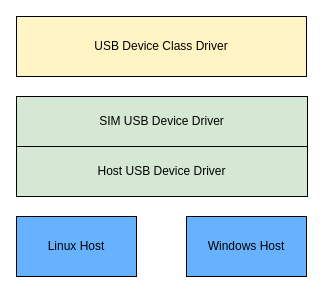

# USB Device 模拟 (SIM) 驱动程序指南

\[ [English](../../../../../../en/device_dev_guide/driver/bus_driver/USB/sim/usb_device_sim_guide.md) | 简体中文 \]

本文档详细介绍 openvela 的 USB 设备模拟 (SIM) 驱动程序。该驱动程序允许您在没有真实 USB 硬件的开发环境中，通过软件模拟一个功能完备的 USB 设备。这套机制对于在主机（当前仅支持 Linux）上进行 USB 功能的开发、测试和验证至关重要。

## 一、体系架构

SIM USB 驱动程序的体系架构分为两个核心部分：

- 在 openvela 模拟器中运行的 **SIM 端驱动(SIM USB Device Driver)**。
- 以及在 Linux 主机上运行的**主机端驱动(Host USB Device Driver)**。



### 1、SIM 端驱动(SIM USB Device Driver)

此部分运行在 openvela 模拟环境中，其主要职责是：

- **实现标准接口**：实现 openvela 的 `usbdev` 和 `usbdev_ep` 标准操作接口，使上层 USB 类驱动（如 CDC/ACM、ADB）能够无感知地运行。
- **抽象主机接口**：提供一个抽象的主机 USB 驱动接口，以便将 USB 请求转发至不同的主机操作系统（如 Linux），增强了系统的可移植性。

#### 复合设备配置

默认情况下，SIM 环境中的 USB 设备以复合（Composite）设备的形式存在，支持多组不同的设备功能组合。您可以通过 `boardctl` 命令来动态选择并激活不同的配置。

| **配置**  | **组合功能**                            |
| :-------- | :-------------------------------------- |
| `config1` | ADB (Android Debug Bridge) + RNDIS      |
| `config2` | CDC/ACM (虚拟串口) + CDC/ECM (虚拟网卡) |
| `config3` | CDC/NCM                                 |
| `config4` | CDC-MBIM                                |

**说明**：关于复合设备配置的详细实现，您可以参考源代码文件 `nuttx/boards/sim/sim/sim/src/sim_composite.c`。

### 2、Linux 主机端驱动(Linux USB Device Driver)

主机端驱动利用 Linux 内核的 **USB** **Gadget** 框架来模拟真实的 USB 硬件，它提供了一套标准的 API，由 USB 设备控制器 (USB Device Controller, UDC)驱动来实现这套 API。框架示意图如下图所示：


由于 SIM 环境没有真实的 USB 设备控制器 (USB Device Controller, UDC)，我们采用以下两个内核模块来构建一个纯软件的模拟方案：

- **Dummy UDC**：一个软件模拟的 UDC，它在内核中创建了一个虚拟的 USB 设备控制器。
- **Raw Gadget**：一个特殊的 Gadget 驱动，它不实现任何具体的 USB 功能（如 Mass Storage、CDC/ACM）。相反，它将所有来自 Dummy UDC 的底层 USB 事件和数据请求，直接透传到用户空间的 openvela 应用程序进行处理。

通过这种方式，openvela 应用程序能够完全控制 USB 设备的枚举流程和数据传输，从而实现了对真实 USB 硬件行为的高度模拟。

#### Raw Gadget 驱动

Raw Gadget 是 Linux 提供的由用户空间使用，用于和底层控制器交互的一个 Gadget 驱动。它拥有和其它 Gadget 一样的接口，只是 Raw Gadget 内部不会处理任何的 USB function，它会将与 USB 控制器的交互透传到用户空间。

- **手动绑定**：Raw Gadget 需要手动选择绑定的 UDC，这样我们就可以创建多个 Raw Gadget 实例绑定在不同的 UDC 上。
- **同步操作**：现有 Raw Gadget 软件版本中，端点读写操作只支持同步模式，也就是说只有当读或写操作完全完成后函数才会返回。
- **控制接口 (`ioctl`)**：Raw Gadget 通过一系列 `ioctl` 命令来管理 USB 设备的生命周期。

Raw Gadget 现已支持的 ioctl 命令如下：

| IOCTL                       | 描述                                                                                                                                                  |
| --------------------------- | ----------------------------------------------------------------------------------------------------------------------------------------------------- |
| USB_RAW_IOCTL_INIT          | 初始化 Raw Gadget 实例。                                                                                                                              |
| USB_RAW_IOCTL_RUN           | 启动 Raw Gadget，将其绑定到 UDC 并开始枚举 USB 设备。                                                                                                 |
| USB_RAW_IOCTL_EVENT_FETCH   | 以阻塞方式获取 Raw Gadget 事件，当前支持的 event 类型如下： <br>USB_RAW_EVENT_INVALID = 0 <br>USB_RAW_EVENT_CONNECT = 1 <br>USB_RAW_EVENT_CONTROL = 2 |
| USB_RAW_IOCTL_EP0_WRITE     | 在 EP0 上执行写请求(IN 事务)。                                                                                                                        |
| USB_RAW_IOCTL_EP0_READ      | 在 EP0 上执行读请求(OUT事务)。                                                                                                                        |
| USB_RAW_IOCTL_EP_ENABLE     | 使能指定 EP，如果 EP 和描述符不符，则返回失败。                                                                                                       |
| USB_RAW_IOCTL_EP_DISABLE    | 禁用指定 EP。                                                                                                                                         |
| USB_RAW_IOCTL_EP_WRITE      | 在 EP 上执行写请求(IN 事务)。                                                                                                                         |
| USB_RAW_IOCTL_EP_READ       | 在 EP 上执行读请求(OUT事务)。                                                                                                                         |
| USB_RAW_IOCTL_CONFIGURE     | 切换 Raw Gadget 到配置状态。                                                                                                                          |
| USB_RAW_IOCTL_VBUS_DRAW     | 限制 UDC VBUS 的 power。                                                                                                                              |
| USB_RAW_IOCTL_EPS_INFO      | 获取当前绑定的 UDC 的 endpoint 信息。                                                                                                                 |
| USB_RAW_IOCTL_EP0_STALL     | 将 EP0 置为 STALL 状态。                                                                                                                              |
| USB_RAW_IOCTL_EP_SET_HALT   | 挂起 (Halt) 指定的 endpoint.                                                                                                                          |
| USB_RAW_IOCTL_EP_CLEAR_HALT | 清除指定端点的挂起 (Halt) 状态。                                                                                                                      |
| USB_RAW_IOCTL_EP_SET_WEDGE  | 设置端点进入 STALL 状态。                                                                                                                             |

#### Dummy UDC 驱动

Dummy UDC 是 Linux 提供的一个软件模拟的 UDC 驱动，该驱动中同时包含了 Host Controller 和 Device Controller 部分，可以实现在同一台机器上进行 Host 到 Device 端的传输。

Dummy UDC 中支持的所有端点信息如下，配置端点时需要根据此端点信息选择合适的端点使用。

```C
  /* everyone has ep0 */
  EP_INFO(ep0name,
    USB_EP_CAPS(USB_EP_CAPS_TYPE_CONTROL, USB_EP_CAPS_DIR_ALL)),
  /* act like a pxa250: fifteen fixed function endpoints */
  EP_INFO("ep1in-bulk",
    USB_EP_CAPS(USB_EP_CAPS_TYPE_BULK, USB_EP_CAPS_DIR_IN)),
  EP_INFO("ep2out-bulk",
    USB_EP_CAPS(USB_EP_CAPS_TYPE_BULK, USB_EP_CAPS_DIR_OUT)),
  ...

  /* or like sa1100: two fixed function endpoints */
  EP_INFO("ep1out-bulk",
    USB_EP_CAPS(USB_EP_CAPS_TYPE_BULK, USB_EP_CAPS_DIR_OUT)),
  EP_INFO("ep2in-bulk",
    USB_EP_CAPS(USB_EP_CAPS_TYPE_BULK, USB_EP_CAPS_DIR_IN)),

  /* and now some generic EPs so we have enough in multi config */
  EP_INFO("ep-aout",
    USB_EP_CAPS(TYPE_BULK_OR_INT, USB_EP_CAPS_DIR_OUT)),
  EP_INFO("ep-bin",
    USB_EP_CAPS(TYPE_BULK_OR_INT, USB_EP_CAPS_DIR_IN)),
  ...
```

## 二、环境准备与配置

在使用 SIM USB 功能之前，您需要在 Linux 主机上完成必要的环境配置。

### 1、安装主机端内核模块 (Raw Gadget)

Linux 内核自 5.7 版本起已原生包含 Raw Gadget 功能。如果您的内核版本低于 5.7，则需要手动下载、编译并安装相关模块。具体步骤如下：

1. 下载 Raw Gadget 代码：

    ```Bash
    git clone https://github.com/xairy/raw-gadget
    ```

2. 修改代码 (按需)：

    根据您主机的内核版本，可能需要对代码进行适配。

    

    - **修改点 1**: 适配不同内核版本的 Gadget 驱动注册接口。新版本内核使用 `usb_gadget_register_driver`，旧版本可能使用 `usb_gadget_probe_driver`。如果编译失败，请参考此项进行修改。
    - **修改点 2**: 调整数据包大小限制。为了支持 NCM (Network Control Model) 等需要大数据包传输的 USB 类，建议移除或注释掉对 `PAGE_SIZE` 的检查，以避免通信异常。

3. 编译并安装 Raw Gadget：

    ```Bash
    $ cd dummy_hcd
    $ make
    $ ./insmod.sh
    
    $ cd raw_gadget
    $ make
    $ ./insmod.sh
    ```

#### 故障排查

- **问题**: `insmod: ERROR: could not insert module ./dummy_hcd.ko: Operation not permitted`
  
    

    **解决方案**: 此问题通常由 BIOS/UEFI 的**安全启动 (Secure Boot)** 选项导致，该选项禁止加载未签名的内核模块。请进入 BIOS/UEFI 设置，暂时禁用安全启动。

- **问题**: `insmod: ERROR: could not insert module ./dummy_hcd.ko: Invalid module format` 

    **解决方案**: 此错误表明模块与当前运行的内核不兼容。请尝试执行项目中的更新脚本 (如 `update.sh`)，然后重新编译并安装。

## 三、使用指南：USB 功能测试

环境配置完成后，您可以开始测试具体的 USB 功能。以下步骤展示了如何配置和使用 ADB、RNDIS、CDC/ACM 和 CDC/ECM。

### 1、使用 ADB (Android Debug Bridge)

#### 步骤 1：在主机端添加 udev 规则

```bash
sudo vi /etc/udev/rules.d/51-android.rules

# 添加以下内容。其中 idVendor 和 idProduct 需要与 openvela 中配置的保持一致。
# 示例中使用 1630 和 0042。
SUBSYSTEM=="usb", ATTR{idVendor}=="1630", ATTR{idProduct}=="0042", MODE="0666", GROUP="plugdev"

# 利用lsusb查看输出，如下中18d1为idVendor， 4e11为idProduct 
# lsusb
# Bus 001 Device 058: ID 18d1:4e11 Google Inc. Nexus One
```

保存后，重新插拔设备使规则生效。

#### 步骤 2：在 openvela 端编译并启动 adbd 服务

1. 开启 Kconfig 编译选项：

    ```Makefile
    CONFIG_USBDEV_COMPOSITE=y
    CONFIG_USBADB=y
    CONFIG_USBADB_COMPOSITE=y
    CONFIG_SYSTEM_ADBD=y
    CONFIG_ADBD_USB_SERVER=y
    CONFIG_ADBD_FILE_SERVICE=y
    CONFIG_ADBD_FILE_SYMLINK=y
    CONFIG_ADBD_SHELL_SERVICE=y
    ```

2. 编译并运行 usbdev，注意需要使用管理员权限运行：

    ```Bash
    ./build.sh sim:usbdev -j8
    sudo ./nuttx/nuttx
    ```

3. 连接 USB 复合设备 0 并启动 adbd：

    ```Bash
    NuttShell (NSH) NuttX-12.0.0-RC0
    nsh> adbd &
    ```

#### 步骤 3：在主机端连接设备并测试

1. 检查设备列表：

    ```Bash
    adb devices
    
    List of devices attached
    * daemon not running; starting now at tcp:5037
    * daemon started successfully
    0101        device
    ```

    如果看到如上所示的 `device` 状态，表示连接成功。

2. 使用 adb 命令：

    ```Bash
    # 进入设备的 shell
    adb shell
    
    nsh> help
    help usage:  help [-v] [<cmd>]
    
    .         cp        env       insmod    mkrd      readlink  test      uptime    
    [         cmp       exec      kill      mount     rm        time      usleep    
    ?         dirname   exit      ln        mv        rmdir     true      xd        
    basename  dd        false     ls        poweroff  rmmod     truncate  
    break     df        free      lsmod     printf    set       uname     
    cat       dmesg     help      mkdir     ps        sleep     umount    
    cd        echo      hexdump   mkfifo    pwd       source    unset     
    
    Builtin Apps:
    adbd    ostest  sh      nsh 
    nsh> exit
    
    # 从主机推送文件到设备
    adb push ./Make.defs /tmp
    ./Make.defs: 1 file pushed. 0.0 MB/s (6999 bytes in 0.467s)
    
    # 从设备拉取文件到主机
    adb pull /tmp/Make.defs ./Make.defs.recv
    /tmp/Make.defs: 1 file pulled. 0.0 MB/s (6999 bytes in 0.361s)
    ```

### 2、使用 RNDIS (虚拟网卡)

#### 步骤 1：在 openvela 端配置 RNDIS

1. 开启 Kconfig 编译选项：

    ```Makefile
    CONFIG_USBDEV_COMPOSITE=y
    CONFIG_RNDIS=y
    CONFIG_RNDIS_COMPOSITE=y
    CONFIG_EXAMPLES_DHCPD=y
    CONFIG_NETUTILS_DHCPD=y
    
    // 使能ICMP和PING
    CONFIG_NET_ICMP=y
    CONFIG_NET_ICMP_SOCKET=y
    CONFIG_SYSTEM_PING=y
    ```

2. 编译并运行 `usbdev`，需要使用管理员权限：

    ```Bash
    ./build.sh sim:usbdev -j8
    sudo ./nuttx/nuttx
    ```

#### 步骤 2：在主机端配置网络

运行 openvela 提供的脚本，它会创建名为 `nuttx0` 的虚拟网卡并配置路由。

```Bash
# eno1 是您主机用于连接外网的网卡名，请根据实际情况修改
sudo nuttx/tools/simhostroute.sh eno1 on
```

执行后，您可以使用 `ifconfig nuttx0` 查看，该网卡 IP 地址应为 `10.0.1.1`。

```Bash
nuttx0: flags=4099<UP,BROADCAST,MULTICAST>  mtu 1500
        inet 10.0.1.1  netmask 255.255.255.0  broadcast 0.0.0.0
```

#### 步骤 3：在 openvela 端连接复合设备 0

在 NSH 命令行中执行：

```Bash
# 连接复合设备配置 0 (ADB+RNDIS)
nsh> conn 0 
```

连接成功后，openvela 内部会创建一个名为 `eth0` 的网络接口，其 IP 地址默认为 `10.0.1.2`。您可以通过 `ifconfig` 命令确认。

```Bash
nsh> ifconfig
eth0        Link encap:Ethernet HWaddr 42:00:d7:82:13:6b at RUNNING mtu 1500
        inet addr:10.0.1.2 DRaddr:10.0.1.1 Mask:255.255.255.0
        inet6 addr: fe80::4000:d7ff:fe82:136b/64
        inet6 DRaddr: ::
```

#### 步骤 4：验证网络连通性

- 在 openvela 端 ping 主机：

    ```Bash
    nsh> ping 10.0.1.1
    PING 10.0.1.1 56 bytes of data
    56 bytes from 10.0.1.1: icmp_seq=0 time=0.0 ms
    ...
    ```

- 在主机端 ping openvela：

    ```Bash
    ping 10.0.1.2
    PING 10.0.1.2 (10.0.1.2) 56(84) bytes of data.
    64 bytes from 10.0.1.2: icmp_seq=1 ttl=64 time=0.512 ms
    ...
    ```

- 使用 Telnet：

    ```Bash
    # 使能 Telnet 配置
    CONFIG_NETUTILS_TELNETC=y
    CONFIG_NETUTILS_TELNETD=y
    
    # 在 openvela 端启动 telnetd 服务
    nsh> telnetd &
    
    # 在主机端连接
    telnet 10.0.1.2
    ```

### 3、使用 CDC/ACM (虚拟串口)

1. 开启编译选项：

    ```Makefile
    CONFIG_USBDEV_COMPOSITE=y
    CONFIG_CDCACM=y
    CONFIG_CDCACM_COMPOSITE=y
    ```

2. 编译运行 `usbdev`，需使用管理员权限运行：

    ```Bash
    ./build.sh sim:usbdev -j8
    sudo ./nuttx/nuttx
    ```

3. 连接 USB 复合设备 1：

    ```Bash
    # 连接复合设备配置 1 (CDC/ACM + CDC/ECM)
    nsh> conn 1
    ```

    成功后，在 openvela 和主机两端都会出现一个名为 `/dev/ttyACM0` 的设备节点。

    ```Bash
    nsh> ls /dev
    /dev:
    console
    log
    null
    oneshot
    ptmx
    ttyACM0
    ```

4. 验证通信

    - openvela 端发送数据：

        ```Bash
        nsh> echo hello > /dev/ttyACM0
        ```

    - 主机端接收数据：

        ```Bash
        cat /dev/ttyACM0
        hello
        ```

### 4、使用 CDC/ECM (虚拟网卡)

1. 开启编译选项：

    ```Makefile
    CONFIG_USBDEV_COMPOSITE=y
    CONFIG_NET_CDCECM=y
    CONFIG_CDCECM_COMPOSITE=y
    CONFIG_EXAMPLES_DHCPD=y
    CONFIG_NETUTILS_DHCPD=y
    ```

2. 编译运行 `usbdev`，需要使用管理员权限运行：

    ```Bash
    ./build.sh sim:usbdev -j8
    sudo ./nuttx/nuttx
    ```

3. 连接 USB 复合设备 1：

    ```Bash
    NuttShell (NSH) NuttX-12.0.0-RC0
    nsh> ifconfig
    eth0        Link encap:Ethernet HWaddr 00:00:00:00:00:00 at RUNNING mtu 1504
            inet addr:10.0.1.2 DRaddr:10.0.1.1 Mask:255.255.255.0
            inet6 addr: fe80::200:ff:fe00:0/64
            inet6 DRaddr: ::
    
    # 连接复合设备配置 1
    nsh> conn 1
    conn_main: Performing architecture-specific initialization
    conn_main: Exiting
    
    # 连接后会新增一个 eth1 网卡，使用 dhcpd 为其分配 IP
    nsh> ifconfig
    eth0        Link encap:Ethernet HWaddr 00:00:00:00:00:00 at RUNNING mtu 1504
            inet addr:10.0.1.2 DRaddr:10.0.1.1 Mask:255.255.255.0
            inet6 addr: fe80::200:ff:fe00:0/64
            inet6 DRaddr: ::
    
    eth1        Link encap:Ethernet HWaddr 00:e0:de:ad:be:ef at UP mtu 1504
            inet addr:0.0.0.0 DRaddr:0.0.0.0 Mask:0.0.0.0
            inet6 addr: ::/0
            inet6 DRaddr: ::
    ```

4. 通过 dhcpd 来为 eth1 分配 IP地址：

    ```Bash
    nsh> dhcpd_start eth1
    nsh> ifconfig
    eth0        Link encap:Ethernet HWaddr 00:00:00:00:00:00 at RUNNING mtu 1504
            inet addr:10.0.1.2 DRaddr:10.0.1.1 Mask:255.255.255.0
            inet6 addr: fe80::200:ff:fe00:0/64
            inet6 DRaddr: ::
    
    eth1        Link encap:Ethernet HWaddr 00:e0:de:ad:be:ef at UP mtu 1504
            inet addr:10.0.0.1 DRaddr:0.0.0.0 Mask:255.255.255.0
            inet6 addr: ::/0
            inet6 DRaddr: ::
    ```

5. 主机上使用 `ifconfig` 查看名为 `enx020000112233` 的网卡，其 IP 为 `10.0.0.2` 时表示可用。

    ```Bash
    $ ifconfig
    enx020000112233: flags=4163<UP,BROADCAST,RUNNING,MULTICAST>  mtu 576
            inet 10.0.0.2  netmask 255.255.255.0  broadcast 10.0.0.255
            ether 02:00:00:11:22:33  txqueuelen 1000  (以太网)
            RX packets 0  bytes 0 (0.0 B)
            RX errors 0  dropped 0  overruns 0  frame 0
            TX packets 58  bytes 9143 (9.1 KB)
            TX errors 0  dropped 0 overruns 0  carrier 0  collisions 0
    ```

6. 您可以像 RNDIS 一样使用 `ping` 和 `telnet` 来验证网络连通性。

## 四、参考资料

- 具体驱动开发可以参考 [USB 设备驱动开发指南](./../usb_driver_dev_guide.md)