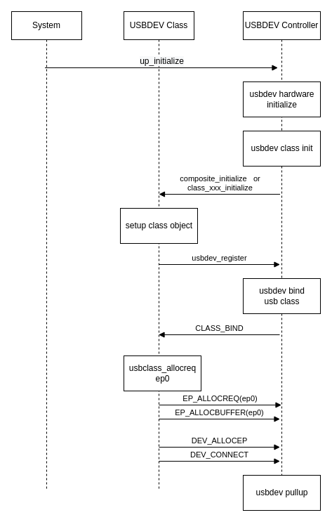

# USB Device 驱动开发指南

\[ [English](../../../../../en/device_dev_guide/driver/bus_driver/USB/usb_driver_dev_guide.md) | 简体中文 \]

## 一、架构概览

openvela USB 设备驱动框架采用分层架构，主要由 **USB 设备控制器驱动（usbdev_controller）** 和 **USB 设备类驱动（usbdev_class）** 两部分组成。


- **USB 设备控制器驱动(`usbdev_controller`)**

    这是与硬件相关的底层驱动，需由**芯片供应商**实现。它直接与 USB 设备控制器硬件交互，主要职责包括：

    - **端点管理**：配置或禁用硬件端点。
    - **资源管理**：申请和释放端点资源。
    - **数据传输**：传输或停止传输请求报 IPR，即 `struct usbdev_req_s`。
    - **状态管理**：挂起 (Stall) 或恢复 (Resume) 指定端点。
    - **功耗管理**：处理自供电 (Self-powered) 和远程唤醒 (Wakeup) 等功能。
    - **特定 I/O 控制**：处理特定于设备的 `ioctl` 命令。
    - 其它特殊的IO命令的处理。

- **USB 设备类驱动(`usbdev_class`)**

    这是与硬件无关的上层驱动，通常由 openvela 提供，用于实现标准的 USB 类规范。其职责包括：
  
    - **配置功能**：负责将类驱动与 `usbdev_controller` 进行绑定和解绑。
    - **I/O 资源管理**：申请 IPR 资源，供 USB 端点使用。
    - **描述符管理**：接收和发送描述符信息。
    - **功耗管理**：响应来自 USB 主机的挂起或唤醒事件。

目前，openvela 已支持以下 USB 设备类：

- 安卓调试桥 (ADB, Android Debug Bridge)
- 通信设备类 (CDC-ACM)
- 通信设备类 (CDC-ECM)
- 媒体传输协议 (MTP, Media Transfer Protocol)
- PL2303 (USB 转串口)
- 远程网络驱动接口规范 (RNDIS, Remote NDIS)
- 大容量存储设备 (Mass Storage)
- 复合设备 (Composite Device)

## 二、API 参考

USB 设备驱动框架的所有核心结构体和接口函数均定义在头文件 `/include/nuttx/usb/usbdev.h` 中。本节将分两部分详细介绍这些接口。

### 1、USB 设备控制器驱动(`usbdev_controller`)-需要厂商实现

供应商需要实现以下结构体及其关联的操作函数，以适配特定的 USB 控制器。

#### `struct usbdev_s`

每个 USB 设备控制器驱动都必须实例化一个 `struct usbdev_s` 对象，该结构体代表一个底层的 USB 设备。需要实现的接口信息如下：

```C++
struct usbdev_s
{
  FAR const struct usbdev_ops_s *ops; /* Access to hardware specific features */
  FAR struct usbdev_ep_s *ep0;        /* Endpoint zero */
  uint8_t speed;                      /* Current speed of the host connection */
  uint8_t dualspeed:1;                /* 1:supports high and full speed operation */
};
```

其核心逻辑通过 `struct usbdev_ops_s` 中的函数指针实现。

- `allocep`：根据端点物理编号、方向和类型，申请一个硬件端点实例。

    ```C
    CODE FAR struct usbdev_ep_s *(*allocep)(FAR struct usbdev_s *dev,
                                            uint8_t epphy, bool in,
                                            uint8_t eptype);
    ```

- `freeep`：释放一个先前申请的端点实例。

    ```C
    CODE void (*freeep)(FAR struct usbdev_s *dev, FAR struct usbdev_ep_s *ep);
    ```

- `getframe`：获取当前 USB 帧号。

    ```C
    CODE int (*getframe)(FAR struct usbdev_s *dev);
    ```

- `wakeup`：唤醒 USB 设备。

    ```C
    CODE int (*wakeup)(FAR struct usbdev_s *dev);
    ```

- `selfpowered`：配置设备是否支持自供电(selfpowered)。

    ```C
    CODE int (*selfpowered)(FAR struct usbdev_s *dev, bool selfpowered);
    ```

- `pullup`：指示与 USB 主机 host 连接或断开。

    ```C
    CODE int (*pullup)(FAR struct usbdev_s *dev, bool enable);
    ```

- `ioctl`：执行 USB 设备特有的 I/O 命令。

    ```C
    CODE int (*ioctl)(FAR struct usbdev_s *dev, unsigned code,
                        unsigned long param);
    ```

#### `struct usbdev_ep_s`

每个 USB 端口必须包含此实例，需要实现的接口信息如下：

```C++
struct usbdev_ep_s
{
  FAR const struct usbdev_epops_s *ops; /* Endpoint operations */
  uint8_t  eplog;                       /* Logical endpoint address */
  uint16_t maxpacket;                   /* Maximum packet size for this endpoint */
  FAR void *priv;                       /* For use by class driver */
  FAR void *fs;                         /* USB fs device this ep belongs */
};
```

端点的特定操作在 `struct usbdev_epops_s` 中定义：

- `configure`：根据端点描述符信息配置端点，只有在端点成功配置后才能使用。

    ```C
    CODE int (*configure)(FAR struct usbdev_ep_s *ep,
                            FAR const struct usb_epdesc_s *desc, bool last);
    ```

- `disable`：禁止指定端点，同时禁止该端点的所有传输。

    ```C
    CODE int (*disable)(FAR struct usbdev_ep_s *ep);
    ```

- `allocreq`：为此端点申请一个 I/O 请求结构体 (`struct usbdev_req_s`)。

    ```C
    CODE FAR struct usbdev_req_s *(*allocreq)(FAR struct usbdev_ep_s *ep);
    ```

- `freereq`：释放一个先前申请的 I/O 请求结构体。

    ```C
    CODE void (*freereq)(FAR struct usbdev_ep_s *ep,
                           FAR struct usbdev_req_s *req);
    ```

- `allocbuffer`：为 I/O 请求申请数据缓冲区。此接口通常用于支持 DMA 的硬件。

    ```C
    CODE FAR void *(*allocbuffer)(FAR struct usbdev_ep_s *ep, uint16_t nbytes);
    ```

- `freebuffer`：释放一个先前申请的数据缓冲区，与 `allocbuffer` 配对使用。

    ```C
    CODE void (*freebuffer)(FAR struct usbdev_ep_s *ep, FAR void *buf);
    ```

- `submit`：发送指定 I/O 请求。

    ```C
    CODE int (*submit)(FAR struct usbdev_ep_s *ep,
                         FAR struct usbdev_req_s *req);
    ```

- `cancel`：取消指定端点上当前正在传输的 I/O 请求。

    ```C
    CODE int (*cancel)(FAR struct usbdev_ep_s *ep,
                           FAR struct usbdev_req_s *req);
    ```

#### `usbdev register`

此函数向系统注册一个 USB 设备类驱动，并通过调用类驱动的 `bind()` 方法，将其与底层的 USB 设备控制器驱动进行绑定。

```C
int usbdev_register(struct usbdevclass_driver_s *driver)
```

参考实现：

> **说明**：以下示例代码中的 `xxx_` 和 `g_xx_` 前缀是通用占位符。
> 在实际开发中，厂商应将其替换为特定于芯片或平台的名称（如 `dwc_` 或 `stm32_`）。

```C++
****************************************************************************
 * Name: usbdev_register
 *
 * Description:
 *   Register a USB device class driver. The class driver's bind() method
 *   will be called to bind it to a USB device driver.
 *
 ****************************************************************************/
 
int usbdev_register(struct usbdevclass_driver_s *driver)
{
  /* priv point to vendor usb controller struct */
  struct xxx_usbdev_s *priv = &g_xx_usbdev;
  int ret;

  usbtrace(TRACE_DEVREGISTER, 0);
  
#ifdef CONFIG_DEBUG_FEATURES
  if (!driver || !driver->ops->bind || !driver->ops->unbind ||
      !driver->ops->disconnect || !driver->ops->setup)
    {
      usbtrace(TRACE_DEVERROR(BES_TRACEERR_INVALIDPARMS), 0);
      return -EINVAL;
    }

  if (priv->driver)
    {
      usbtrace(TRACE_DEVERROR(BES_TRACEERR_DRIVER), 0);
      return -EBUSY;
    }
#endif

  /* First hook up the driver */
  priv->driver = driver;

  /* Then bind the class driver */
  ret = CLASS_BIND(driver, &priv->usbdev);
  if (ret)
    {
      usbtrace(TRACE_DEVERROR(SIM_TRACEERR_BINDFAILED), (uint16_t) - ret);
      priv->driver = NULL;
    }
  else
    {
      /* add you code */
      /* Enable USB controller interrupts or pull up usb */
    }

  return ret;
}
```

#### `usbdev_unregister`

此函数用于注销一个 USB 设备类驱动。如果设备正连接到主机，它会首先断开连接，然后调用类驱动的 `unbind()` 方法清理资源。

```C++
/****************************************************************************
 * Name: usbdev_unregister
 *
 * Description:
 *   Un-register usbdev class driver.If the USB device is connected to a
 *   USB host, it will first disconnect().  The driver is also requested to
 *   unbind() and clean up any device state, before this procedure finally
 *   returns.
 *
 ****************************************************************************/

int usbdev_unregister(struct usbdevclass_driver_s *driver)
{
  /* At present, there is only a single OTG FS device support. Hence it is
   * pre-allocated as g_otgfsdev.  However, in most code, the private data
   * structure will be referenced using the 'priv' pointer (rather than the
   * global data) in order to simplify any future support for multiple
   * devices.
   */

    FAR struct xxx_usbdev_s *priv = &g_xx_usbdev;
    irqstate_t flags;

    usbtrace(TRACE_DEVUNREGISTER, 0);

#ifdef CONFIG_DEBUG_FEATURES
    if (driver != priv->driver) {
        usbtrace(TRACE_DEVERROR(DWC2_TRACEERR_INVALIDPARMS), 0);
        return -EINVAL;
    }
#endif

  /* Reset the hardware and cancel all requests.  All requests must be
   * canceled while the class driver is still bound.
   */

    flags = enter_critical_section();
    xxx_usbreset(priv);
    leave_critical_section(flags);
    
    CLASS_DISCONNECT(driver, &priv->usbdev);

    /* Unbind the class driver */

    CLASS_UNBIND(driver, &priv->usbdev);

    /* Disable USB controller interrupts */

    flags = enter_critical_section();
    up_disable_irq(XXX_IRQ);

    /* Disconnect device */

    xxx_pullup(&priv->usbdev, false);

    /* Unhook the driver */

    priv->driver = NULL;
    leave_critical_section(flags);

    return OK;
}
```

### 2、USB 设备类驱动(`usbdev_class`)

USB 设备类驱动必须实现 `struct usbdevclass_driver_s` 接口，才能集成到 USB 设备栈中。

#### `struct usbdevclass_driver_s`

该结构体定义了一个类驱动及其支持的最高速度。

```C++
struct usbdevclass_driver_s
{
  FAR const struct usbdevclass_driverops_s *ops;
  uint8_t speed;                  /* Highest speed that the driver handles */
};
```

类驱动的具体行为由 `struct usbdevclass_driverops_s` 中的函数指针定义，包含如下接口：

- `bind`：将类驱动绑定到指定的 USB 设备控制器。

    ```C
    CODE int  (*bind)(FAR struct usbdevclass_driver_s *driver,
                      FAR struct usbdev_s *dev);
    ```

- `unbind`：将类驱动从 USB 设备控制器解绑，并释放相关资源。

    ```C
    CODE void (*unbind)(FAR struct usbdevclass_driver_s *driver,
                        FAR struct usbdev_s *dev);
    ```

- `setup`：处理发送到端点 ep0 的标准请求和类特定请求。

    ```C
    CODE int  (*setup)(FAR struct usbdevclass_driver_s *driver,
                       FAR struct usbdev_s *dev, FAR const struct usb_ctrlreq_s *ctrl,
                       FAR uint8_t *dataout, size_t outlen);
    ```

- `disconnect`：通知类驱动设备已从主机断开。

    ```C
    CODE void (*disconnect)(FAR struct usbdevclass_driver_s *driver,
                            FAR struct usbdev_s *dev);
    ```

- `suspend`：通知类驱动 USB 总线已进入挂起状态。

    ```C
    CODE void (*suspend)(FAR struct usbdevclass_driver_s *driver,
                         FAR struct usbdev_s *dev);
    ```

- `resume`：通知类驱动 USB 总线已从挂起状态恢复。

    ```C
    CODE void (*resume)(FAR struct usbdevclass_driver_s *driver,
                        FAR struct usbdev_s *dev);
    ```

## 三、主要工作流程

下面对 USB 设备的几个关键过程进行说明。

### 1、初始化流程

系统初始化上电后，需要对 USB 设备进行初始化。包括设备硬件初始化、设备类驱动(`usbdev_class`)绑定和设备控制器驱动(`usbdev_controller`)注册等过程。



### 2、端点 ep0 传输流程

初始化完成后，USB 主机通过与端点 ep0 通信来枚举设备。此流程处理控制传输：


### 3、数据端点 ep 传输流程

设备枚举和配置完成后，数据端点即可用于通信。此流程展示了数据如何在类驱动和 USB 主机之间通过控制器驱动进行传输。


## 四、驱动适配指南：以 SIM 驱动为例

本节以 openvela 的模拟（SIM）USB 驱动为例，演示如何适配一个 `usbdev_controller` 驱动。SIM 驱动是一个纯软件实现，它不涉及具体硬件，因此是理解驱动框架的绝佳参考。

关于 SIM 驱动的详细配置和使用方法，请参考[USB 设备模拟 (SIM) 驱动程序指南](./usb_sim_guide.md) 文档。

要启用详细的 USB 日志输出，请在配置中设置以下选项：

```Bash
CONFIG_DEBUG_USB=y
CONFIG_DEBUG_USB_ERROR=y
CONFIG_DEBUG_USB_WARN=y
CONFIG_DEBUG_USB_INFO=y
```

### 1、初始化适配（厂商实现）

初始化过程有两个函数需要实现：

- `sim_usbdev_initialize()`： 在系统早期启动阶段（`up_initialize()` 过程）被调用，主要负责配置引脚、时钟以及 USB 设备控制器硬件的初始化，在 OS 调度启动之前调用。由于 SIM 驱动不操作实体硬件，该函数体为空。
- `usbdev_register()`：在 OS 调度启动之后，由 `usbdev_class_initialize` 函数调用，主要负责初始化 `usbdev` 软件资源并绑定类驱动。

以下是 SIM 驱动的实现示例：

```C
/****************************************************************************
 * Name: sim_usbdev_initialize
 *
 * Description:
 *   Initialize the USB driver
 *
 ****************************************************************************/

void sim_usbdev_initialize(void)
{
}

/****************************************************************************
 * Name: usbdev_register
 *
 * Description:
 *   Register a USB device class driver. The class driver's bind() method
 *   will be called to bind it to a USB device driver.
 *
 ****************************************************************************/
 
int usbdev_register(struct usbdevclass_driver_s *driver)
{
  struct sim_usbdev_s *priv = &g_sim_usbdev;
  int ret;

  usbtrace(TRACE_DEVREGISTER, 0);

  /* First hook up the driver */
  sim_usbdev_devinit(priv);
  priv->driver = driver;

  /* Then bind the class driver */
  ret = CLASS_BIND(driver, &priv->usbdev);
  if (ret)
    {
      usbtrace(TRACE_DEVERROR(SIM_TRACEERR_BINDFAILED), (uint16_t) - ret);
    }
  else
    {
      /* Setup the USB host controller */
#ifdef CONFIG_USBDEV_DUALSPEED
      host_usbdev_init(SIM_USB_SPEED);
#else
      host_usbdev_init(USB_SPEED_FULL);
#endif
    }

  return ret;
}

/****************************************************************************
 * Name: usbdev_unregister
 *
 * Description:
 *   Un-register usbdev class driver.If the USB device is connected to a USB
 *   host, it will first disconnect().  The driver is also requested to
 *   unbind() and clean up any device state, before this procedure finally
 *   returns.
 *
 ****************************************************************************/

int usbdev_unregister(struct usbdevclass_driver_s *driver)
{
  /* At present, there is only a single OTG FS device support. Hence it is
   * pre-allocated as g_otgfsdev.  However, in most code, the private data
   * structure will be referenced using the 'priv' pointer (rather than the
   * global data) in order to simplify any future support for multiple
   * devices.
   */
  struct sim_usbdev_s *priv = &g_sim_usbdev;
  irqstate_t flags;

  usbtrace(TRACE_DEVUNREGISTER, 0);

  /* Reset the hardware and cancel all requests.  All requests must be
   * canceled while the class driver is still bound.
   */
  flags = enter_critical_section();
  host_usbdev_deinit();
  leave_critical_section(flags);

  /* Unbind the class driver */
  CLASS_UNBIND(driver, &priv->usbdev);

  /* Disable USB controller interrupts */
  flags = enter_critical_section();

  /* Disconnect device */
  host_usbdev_pullup(false);

  /* Unhook the driver */
  priv->driver = NULL;
  leave_critical_section(flags);

  return OK;
}
```

### 2、实现 `operations` 回调

控制器驱动的核心功能是通过实现 `usbdev_ops_s` 和 `usbdev_epops_s` 两个回调结构体来提供的。代码如下所示：

```C
static const struct usbdev_epops_s g_epops =
{
  .configure   = sim_ep_configure,
  .disable     = sim_ep_disable,
  .allocreq    = sim_ep_allocreq,
  .freereq     = sim_ep_freereq,
  .submit      = sim_ep_submit,
  .stall       = sim_ep_stall,
  .cancel      = sim_ep_cancel,
};

static const struct usbdev_ops_s g_devops =
{
  .allocep     = sim_usbdev_allocep,
  .freeep      = sim_usbdev_freeep,
  .selfpowered = sim_usbdev_selfpowered,
  .pullup      = sim_usbdev_pullup,
  .getframe    = sim_usbdev_getframe,
  .wakeup      = sim_usbdev_wakeup,
};
```

### 3、使用 `boardctl` 实现动态初始化

如果需要实现动态初始化或者热插拔功能，可以通过 `boardctl` 命令。该功能目前支持 ADB、CDC-ACM、PL2303、MSC 和复合设备等类。下面以 ADB 为例进行说明：

- 首先，在 Kconfig 中使能 `boardctl` 支持：

    ```makefile
    CONFIG_BOARDCTL=y
    CONFIG_BOARDCTL_USBDEVCTRL=y
    ```

- 设备初始化 (ADB 示例)

    ```C++
    #include <sys/boardctl.h>
    
    FAR void *g_adb_handle = NULL;
    
    void adb_board_init(void)
    {
    struct boardioc_usbdev_ctrl_s ctrl;

    /* Perform architecture-specific initialization */
    ctrl.usbdev   = BOARDIOC_USBDEV_ADB;
    ctrl.action   = BOARDIOC_USBDEV_INITIALIZE;
    ctrl.instance = 0;
    ctrl.config   = 0;
    ctrl.handle   = NULL;

    boardctl(BOARDIOC_USBDEV_CONTROL, (uintptr_t)&ctrl);

    /* Initialize the USB composite device device */
    ctrl.usbdev   = BOARDIOC_USBDEV_ADB;
    ctrl.action   = BOARDIOC_USBDEV_CONNECT;
    ctrl.instance = 0;
    ctrl.config   = 0;
    ctrl.handle   = &g_adb_handle;

    boardctl(BOARDIOC_USBDEV_CONTROL, (uintptr_t)&ctrl);
    }
    ```

- 设备反初始化 (ADB 示例)

    ```C++
    void adb_board_uninit(void)
    {
    struct boardioc_usbdev_ctrl_s ctrl;
    
    ctrl.usbdev   = BOARDIOC_USBDEV_ADB;
    ctrl.action   = BOARDIOC_USBDEV_DISCONNECT;
    ctrl.instance = 0;
    ctrl.config   = 0;
    ctrl.handle   = &g_adb_handle;

    boardctl(BOARDIOC_USBDEV_CONTROL, (uintptr_t)&ctrl);
    }
    ```

## 五、参考文档

- [USB 设备模拟 (SIM) 驱动程序指南](./usb_sim_guide.md)
