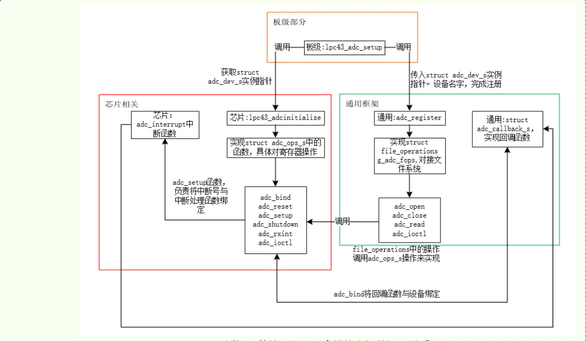

# 驱动开发

## 一、概述

openvela 的驱动框架相对简单，并未提供像 Linux 系统中那样复杂的驱动模型（例如 Device、Driver、Bus、Class 等）。相较于 Linux，openvela 的驱动框架具有以下特点：

- 驱动注册接口：通过简单的驱动注册接口，将驱动注册到文件系统中。
- 函数集实现：实现  `file_operations` 操作函数集，供上层调用。
- 系统调用支持：上层应用通过标准的系统调用，间接调用底层驱动完成设备操作。

这种简化的设计使得 openvela 的驱动框架更易于理解和实现。

接下来将以字符设备驱动为例，详细阐述 openvela 的驱动框架。

## 1、数据结构与接口

### 1.1 数据结构

在 openvela 中，应用层通过系统调用访问驱动，其调用流程如下：

**系统调用 -> VFS（Virtual File System）-> 驱动**。

为了理解驱动如何注册到文件系统中，需要先了解相关的数据结构。这些数据结构的定义位于 `include/nuttx/fs/fs.h` 文件中。

#### 驱动注册与`inode`

当驱动注册到文件系统后，会创建一个 `inode`，并将其与设备文件关联。`inode` 是文件系统中用于表示文件或设备的核心数据结构。以下是与驱动注册相关的关键字段和操作函数集的说明。

```C
/* This structure represents one inode in the Nuttx pseudo-file system */
struct inode
{
  FAR struct inode *i_peer;     /* Link to same level inode */
  FAR struct inode *i_child;    /* Link to lower level inode */
  int16_t           i_crefs;    /* References to inode */
  uint16_t          i_flags;    /* Flags for inode */
  union inode_ops_u u;          /* Inode operations */
#ifdef CONFIG_FILE_MODE
  mode_t            i_mode;     /* Access mode flags */
#endif
  FAR void         *i_private;  /* Per inode driver private data */
  char              i_name[1];  /* Name of inode (variable) */
};
```

##### `i_flags`字段

`struct inode` 结构体中的 `i_flags` 字段用于标记该 `inode` 的文件类型，例如驱动文件或消息队列。为了设置或判断 `i_flags` 是否为驱动文件，提供了以下宏定义：

```C
#define INODE_IS_DRIVER(i)    INODE_IS_TYPE(i,FSNODEFLAG_TYPE_DRIVER)

#define INODE_SET_DRIVER(i)   INODE_SET_TYPE(i,FSNODEFLAG_TYPE_DRIVER)
```

- `INODE_IS_DRIVER`：用于判断指定的 `inode` 是否为驱动文件。
- `INODE_SET_DRIVER`：用于将指定的 `inode` 标记为驱动文件。

##### `inode_ops_u`字段

`struct inode` 结构体中的 `inode_ops_u` 字段是一个联合体，用于描述操作函数集。根据 `inode` 的类型，该字段可以包含以下操作函数集之一：

- 字符设备驱动操作函数集。
- 块设备驱动操作函数集。
- 挂载点操作函数集。

##### 驱动操作函数集

字符设备驱动的操作函数集由 `struct file_operations` 定义，其结构如下：

```C
struct file_operations
{
  /* The device driver open method differs from the mountpoint open method */
  int     (*open)(FAR struct file *filep);

  /* The following methods must be identical in signature and position because
   * the struct file_operations and struct mountp_operations are treated like
   * unions.
   */
  int     (*close)(FAR struct file *filep);
  ssize_t (*read)(FAR struct file *filep, FAR char *buffer, size_t buflen);
  ssize_t (*write)(FAR struct file *filep, FAR const char *buffer, size_t buflen);
  off_t   (*seek)(FAR struct file *filep, off_t offset, int whence);
  int     (*ioctl)(FAR struct file *filep, int cmd, unsigned long arg);

  /* The two structures need not be common after this point */
#ifndef CONFIG_DISABLE_POLL
  int     (*poll)(FAR struct file *filep, struct pollfd *fds, bool setup);
#endif
#ifndef CONFIG_DISABLE_PSEUDOFS_OPERATIONS
  int     (*unlink)(FAR struct inode *inode);
#endif
};
```

- 低层驱动需要实现 `struct file_operations` 中的函数，例如 `open`、`read`、`write` 等，这些函数定义了设备文件的具体操作行为。
- 驱动的操作函数集会被设置到设备文件对应的 `inode` 中。
- 当系统调用操作设备文件时，会根据设备文件对应的 `inode` 找到并调用相应的函数。

### 1.2 `register_driver`接口

#### 代码实现

驱动注册的时候，会调用 `register_driver()` 接口，以下是 `register_driver` 接口的代码实现：

```C
/****************************************************************************
 * Name: register_driver
 *
 * Description:
 *   Register a character driver inode the pseudo file system.
 *
 * Input parameters:
 *   path - The path to the inode to create
 *   fops - The file operations structure
 *   mode - inmode priviledges (not used)
 *   priv - Private, user data that will be associated with the inode.
 *
 * Returned Value:
 *   Zero on success (with the inode point in 'inode'); A negated errno
 *   value is returned on a failure (all error values returned by
 *   inode_reserve):
 *
 *   EINVAL - 'path' is invalid for this operation
 *   EEXIST - An inode already exists at 'path'
 *   ENOMEM - Failed to allocate in-memory resources for the operation
 *
 ****************************************************************************/

int register_driver(FAR const char *path, FAR const struct file_operations *fops,
                    mode_t mode, FAR void *priv)
{
  FAR struct inode *node;
  int ret;

  /* Insert a dummy node -- we need to hold the inode semaphore because we
   * will have a momentarily bad structure.
   */

  inode_semtake();
  ret = inode_reserve(path, &node);
  if (ret >= 0)
    {
      /* We have it, now populate it with driver specific information.
       * NOTE that the initial reference count on the new inode is zero.
       */

      INODE_SET_DRIVER(node);

      node->u.i_ops   = fops;
#ifdef CONFIG_FILE_MODE
      node->i_mode    = mode;
#endif
      node->i_private = priv;
      ret             = OK;
    }

  inode_semgive();
  return ret;
}
```

#### 功能说明

`register_driver` 接口的主要功能是将字符设备驱动注册到伪文件系统中。它完成以下几个关键操作：

1. 创建或查找 `inode`。

   - 根据传入的 `path` 参数（通常对应设备文件路径，例如 `/dev/xxxx`），检查是否存在对应的 `inode`。
   - 如果不存在，则为该路径创建一个新的 `inode`。

2. 更新 `inode` 的驱动信息。

   - 将实际驱动实现的 `struct file_operations`（即 `fops`）更新到 `inode` 中。
   - 如果启用了权限配置（`CONFIG_FILE_MODE`），还会设置 `inode` 的权限信息。

3. 设置私有数据。

- 将 `priv` 数据存储到 `inode` 的私有字段中。
- 该字段通常用于存放驱动的私有数据，例如硬件相关的上下文信息。

## 二 驱动内部结构

### 1、驱动类型与层次结构

openvela 支持多种设备驱动，主要分为以下三种类型：

- 字符设备驱动
- 块设备驱动
- 特殊设备驱动

这些驱动按照功能划分为两层：

1. Upper Half

   - 驱动通过 `register_driver` 或 `register_blockdriver` 将自身注册到 openvela 系统中。
   - 提供高层次的系统调用接口（如 `read`、`write`、`close` 等）。
   - 通过回调函数与 Lower Half 交互。

2. Lower Half

   - 负责实现与硬件设备和架构的交互。
   - 涉及总线、外设等底层硬件的具体操作。

### 2、驱动模型的特点

与 Linux 设备驱动模型相比，openvela 的驱动模型更为简化，具有以下特点：

- 无匹配和探测机制：openvela 中不存在 `bus`、`device` 和 `driver` 的匹配（match）和探测（probe）过程。
- 无设备类型和设备号：不使用设备类型或设备号（major/minor）的概念。
- 设备节点注册：设备节点由驱动通过 `register_driver()` 或 `register_blockdriver()` 接口手动注册。

这种设计显著降低了驱动模型的复杂性，使 openvela 更适合资源受限的 MCU 环境。

### 3、Pseudo Root File System

openvela 的设备驱动依赖于 Pseudo Root File System，类似于 Linux 的 `/dev`（`devtmpfs`）。但与 Linux 不同，其特点如下：

- 仅占用 RAM：不依赖存储介质或块设备驱动。
- 设备节点不是实际文件：设备节点只是设备在根文件系统中的入口，表示设备已初始化并可供使用。

换句话说，只有设备驱动可以创建设备节点，设备节点的存在表示设备已经注册并准备就绪。

### 4、驱动目录结构

根据驱动的类型，openvela 将驱动代码放置在不同的目录中：

- Shareable 驱动：存放在 `drivers` 目录下，适用于通用的设备驱动。
- Custom 驱动：存放在板级目录 `nuttx/boards/<arch>/<chip>/<board>/src`下。

### 5、驱动工作流程

以下是 openvela 驱动的工作流程图，展示了从应用程序到硬件的完整路径：


这些结构体定义了设备驱动的核心操作逻辑，驱动开发者需要根据具体设备实现对应的接口。

### 6、非标准接口：`boardctl`

除了字符设备驱动外，openvela 提供了一个非标准的 OS 接口 `boardctl`，用于应用程序通过 `ioctl` 的方式控制板级逻辑。常见功能包括：

- 板级初始化：`board_app_init`、`board_app_finalinit`
- 电源管理：`board_poweroff`、`board_pmctl`
- 系统复位：`board_reset`

> 说明
>
> 正常情况下，应用程序应通过字符设备驱动的 `ioctl` 接口控制板级逻辑，而不是直接调用 `boardctl`。

## 三、示例：ADC 驱动流程分析

在 openvela 的驱动代码中，驱动通常被分为两部分：Upper half 和 Lower half。以下以 ADC 驱动为例，分析其实现流程。

### 1、驱动分层设计

1. 上半部分（Upper Half）

   - 提供应用程序级的通用接口，主要实现 `file_operations` 中的函数集。
   - 针对 ADC 驱动，`drivers/analog/adc.c` 文件描述了 Upper Half 的操作逻辑。
   - Upper Half 的实现是通用的，适用于所有 ADC 设备，无需针对具体硬件进行修改。

2. 下半部分（Lower Half）

- 基于特定平台的硬件驱动程序，负责实现硬件级的控制，例如寄存器操作。
- 针对特定硬件的实现，例如 `arch/arm/src/lpc43xx/lpc43_adc.c` 文件，描述了 LPC43xx 平台的 ADC 硬件驱动。

### 2、驱动框架

整体驱动框架如下图所示：



1. 芯片相关（Lower Half）

   - 负责硬件的实际操作，例如寄存器读写和中断处理。
   - 在中断处理函数中，会回调 Upper half 的接口，例如通过消息队列通知上层应用数据已准备好。

2. 通用框架（Upper Half）

   - 提供系统调用接口，例如 `open`、`read` 等。
   - 在实现 `file_operations` 函数集时，会调用 Lower half 的接口完成具体操作。

3. 板级部分

   - 负责将 Upper half 和 Lower half 绑定在一起，建立连接并注册到文件系统中。
   - 该部分的接口通常在系统启动（boot）阶段被调用。

### 3、其他驱动的实现

openvela 中的其他驱动实现机制与 ADC 驱动类似，均采用分层设计：

- 上半部分：对接应用系统调用，提供通用接口。
- 下半部分：实现硬件级操作，适配具体平台。

这种分层设计是一种合理的做法，具有以下优点：

- 通用性：上半部分作为通用框架，不需要改动，适用于所有同类设备。
- 灵活性：下半部分针对不同硬件实现具体的操作接口，便于适配多种平台。
- 模块化：上下半部分职责分离，降低耦合性，便于代码维护和扩展。

通过这种分层设计，openvela 的驱动开发既能满足硬件适配的需求，又能保持代码的通用性和可维护性。

