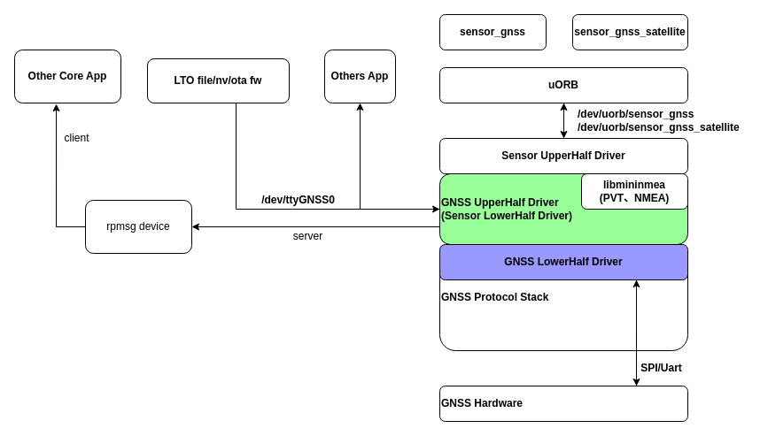

# GNSS 驱动框架开发指南

[ [English](../../../../../en/device_dev_guide/driver/peripheral_driver/gnss/gnss_driver_guide.md) | 简体中文 ]

本文档为在 openvela 操作系统中开发和使用全球导航卫星系统 (Global Navigation Satellite System, GNSS) 驱动提供了全面的技术指导。

## 一、概述

openvela 实现了一套统一的 GNSS 驱动框架。该框架基于 Sensor 驱动模型的上/下半部 (Upper/Lower-Half) 分层思想设计，旨在简化硬件驱动的移植工作，并无缝对接到 uORB 消息总线。

### 1、框架架构

GNSS 框架将驱动逻辑清晰地划分为两层，明确了框架与驱动开发者的职责：

- **上层驱动 (Upper-Half)**：由 openvela 框架提供。它负责处理与具体硬件无关的通用逻辑，包括：

    - 解析标准的 NMEA (National Marine Electronics Association) 消息。
    - 将解析后的结构化数据发布为 uORB 主题 (Topic) 上报给 Sensor 驱动框架。
    - 注册字符设备节点 (`/dev/ttyGNSS[n]`)，供应用层直接访问原始数据流 (raw data)。

- **下层驱动 (Lower-Half)：由驱动开发者实现**。它负责封装所有与特定 GNSS 模组硬件相关的操作，如串口通信、电源管理和数据读取。

这种分层设计使得驱动开发者可以专注于硬件本身，而无需关心复杂的上层系统集成。




## 二、驱动开发指南 (南向接口)

本章节面向**驱动开发者**，指导您如何将一个新的 GNSS 模组接入 openvela 系统。您需要完成下层驱动（Lower-Half）的实现。

开发流程遵循以下四个核心步骤：

### 步骤 1：实现硬件操作接口 (`gnss_ops_s`)

首先，您需要实现 `struct gnss_ops_s` 结构中定义的一组函数指针。这些函数封装了对 GNSS 硬件的底层控制逻辑。包括如何打开、控制 GNSS、设置采样率和注入数据等。

```C
struct gnss_ops_s
{
  /* 激活或关闭 GNSS 设备 */
  CODE int (*activate)(FAR struct gnss_lowerhalf_s *lower,
                       FAR struct file *filep, bool enable);

  /* 设置采样率，即 GNSS 模组的数据上报周期（单位：微秒） */
  CODE int (*set_interval)(FAR struct gnss_lowerhalf_s *lower,
                           FAR struct file *filep,
                           FAR uint32_t *period_us);

  /* 控制 GNSS：提供一个通用的 I/O 控制接口，用于处理特定命令 */
  CODE int (*control)(FAR struct gnss_lowerhalf_s *lower,
                      FAR struct file *filep,
                      int cmd, unsigned long arg);

  /* 向 GNSS 模组注入数据，如辅助定位数据 (A-GNSS)、星历或固件更新 */
  CODE ssize_t (*inject_data)(FAR struct gnss_lowerhalf_s *lower,
                              FAR struct file *filep,
                              FAR const void *buffer, size_t buflen);
};
```

### 步骤 2：实现数据上报

当 GNSS 模组通过串口等方式上报数据时，您的驱动（通常在中断服务程序或工作线程中）需要调用上层驱动提供的回调函数，将数据推送给框架进行处理。

框架提供了两种上报函数，由驱动开发者根据数据类型选择调用：

| **函数原型**                                   | **使用场景**                                                                                                                                   |
| :--------------------------------------------- | :--------------------------------------------------------------------------------------------------------------------------------------------- |
| `gnss_push_data_t(priv, data, bytes, is_nmea)` | 用于推送**原始数据流**（raw data）。<br>如果数据是 NMEA 格式，请将 `is_nmea` 设为 `true`，否则设为 `false`。<br>上层驱动将负责解析 NMEA 数据。 |
| `gnss_push_event_t(priv, data, bytes, type)`   | 用于推送已由驱动自行解析好的**结构化数据**。<br>例如 `sensor_gnss` 或 `sensor_gnss_satellite`。`type` 参数用于指明数据类型。                   |

```C++
/* 回调函数原型，由上层驱动提供，在注册时填充到 lower->push_data */
typedef CODE void (*gnss_push_data_t)(FAR void *priv, FAR const void *data,
                                      size_t bytes, bool is_nmea);

/* 回调函数原型，由上层驱动提供，在注册时填充到 lower->push_event */
typedef CODE void (*gnss_push_event_t)(FAR void *priv, FAR const void *data,
                                       size_t bytes, int type);
```

**关键说明**：调用时，`priv` 参数必须传入 `lower->priv`，这是上层驱动的私有上下文句柄。

### 步骤 3：实例化并注册下层驱动

接下来，您需要实例化一个 `struct gnss_lowerhalf_s` 结构体，并将其注册到 GNSS 框架中。

1. **实例化 `gnss_lowerhalf_s`**：

    该结构体是连接上层与下层驱动的桥梁。

    ```C
    struct gnss_lowerhalf_s
    {
        /* 指向您在步骤1中实现的硬件操作函数集 */
        FAR const struct gnss_ops_s *ops;
        
        /* 由上层驱动填充，用于推送原始数据 */
        gnss_push_data_t push_data;
        
        /* 由上层驱动填充，用于推送结构化事件 */
        gnss_push_event_t push_event;
        
        /* 由上层驱动填充，作为回调函数的上下文 */
        FAR void *priv;
    };
    ```

2. **调用 `gnss_register()` 注册：**

    使用 `gnss_register()` 函数将您的下层驱动实例注册到系统中。

    ```C
    int gnss_register(FAR struct gnss_lowerhalf_s *dev, int devno,
                      uint32_t nbuffer);
    ```

    **参数说明**

    - `dev`: 指向您实例化的 `gnss_lowerhalf_s` 结构体。
    - `devno`: 分配给该 GNSS 设备的序列号 (例如 0, 1, ...)。
    - `nbuffer`: 指定上层驱动内部环形缓冲区的大小。推荐值为 `1`，表示缓冲区最多缓存一条 GNSS 数据，新的数据会覆盖旧的数据。

    注册成功后，框架会自动创建以下设备节点：

    - `/dev/ttyGNSS[devno]`
    - `/dev/uorb/sensor_gnss[devno]`
    - `/dev/uorb/sensor_gnss_satellite[devno]`
    - 以及其他相关的 uORB 节点。

### 步骤 4：开发示例 (`fakesensor_uorb.c`)

openvela 的 `simulator` 中提供了一个完整的 `fakesensor` GNSS 驱动，可作为下层驱动开发的最佳实践参考。我们强烈建议开发者在开始编写新驱动前，仔细研究此文件的实现方式，以理解完整的上下文和交互流程。

- 参考价值：该文件完整演示了 `gnss_ops_s` 的实现、下层结构的实例化，以及向框架注册的全过程。
- 代码路径：`drivers/sensors/fakesensor_uorb.c`

```C
/* 1. 定义硬件操作函数 */
static int fakegnss_activate(FAR struct gnss_lowerhalf_s *lower,
                             FAR struct file *filep, bool enable)
{
  /* ... 实现硬件使能/禁能逻辑 ... */
  return 0;
}

static int fakegnss_set_interval(FAR struct gnss_lowerhalf_s *lower,
                                 FAR struct file *filep,
                                 FAR uint32_t *period_us)
{
  /* ... 实现硬件采样率设置逻辑 ... */
  return 0;
}

/* 2. 实例化操作函数集 */
static struct gnss_ops_s g_fakegnss_ops =
{
  .activate     = fakegnss_activate,
  .set_interval = fakegnss_set_interval,
};

/* 3. 在驱动初始化函数中，分配并注册下层设备 */
int my_gnss_driver_initialize(int devno)
{
    // 为下层设备分配内存
    FAR struct gnss_lowerhalf_s *gnss = kmm_zalloc(sizeof(*gnss));
    if (gnss == NULL)
      {
        return -ENOMEM;
      }

    // 关联硬件操作函数集
    gnss->ops = &g_fakegnss_ops;

    // 注册设备到 GNSS 框架
    int ret = gnss_register(gnss, devno, 1);
    if (ret < 0)
      {
        kmm_free(gnss);
        return ret;
      }

    return 0;
}
```

## 三、应用层开发指南 (北向接口)

本章节面向**应用开发者**，介绍如何从应用层获取和使用 GNSS 数据。

### 1、访问方式

openvela 提供两种主要方式供应用访问 GNSS 数据：

1. **通过 uORB 订阅结构化数据 (推荐)：**

    这是最常用和推荐的方式。上层驱动会自动解析标准的 NMEA 数据（或接收由下层驱动直接推送的结构化数据），并将其发布为多个 uORB 主题。应用程序可以通过标准的 uORB API 订阅这些主题，以获取解析好的、即取即用的位置、速度和卫星信息。
​

    **主要 uORB 节点：**

    - `/dev/uorb/sensor_gnss[n]`：主要的定位信息 (经纬度、海拔、速度等)。
    - `/dev/uorb/sensor_gnss_satellite[n]`：可视卫星信息 (卫星ID、仰角、方位角、信噪比等)。
    - `/dev/uorb/sensor_gnss_clock[n]`
    - `/dev/uorb/sensor_gnss_measurement[n]`
    - `/dev/uorb/sensor_gnss_geofence_event[n]`

2. **读取原始 NMEA/Raw 数据：**

    对于某些高级应用场景，例如需要解析 GNSS 模组厂商的私有 NMEA 消息，或者需要进行数据回放和分析，可以通过直接读写字符设备节点来完成。

    - **设备节点**：`/dev/ttyGNSS[n]`
    - **使用方法**：像操作普通串口设备一样 `open()` 和 `read()` 此节点，即可获得未经处理的原始数据流。
    - **NMEA 解析库**：为方便应用开发者处理原始 NMEA 数据，openvela 系统内置了 `minmea` 轻量级解析库。

        - **头文件**：`#include <minmea/minmea.h>`
        - **使用**：应用代码可直接调用 `minmea_parse_xxx()` 系列函数来解析各类 NMEA 语句。
        - **参考**：您也可以参考 `drivers/sensors/gnss_uorb.c` 文件中的 `gnss_parse()` 函数，了解上层驱动是如何利用 `minmea` 库进行解析的。

## 四、实战与测试

openvela 的 `simulator` 默认已启用 `fakesensor` 模拟 GNSS 设备。编译并运行模拟器后，您可以使用以下命令来测试和验证 GNSS 功能。

### 1、订阅 uORB 主题

使用 `uorb_listener` 命令可以实时监听 uORB 主题并打印数据。

- **监听 `sensor_gnss` 主题：**

    ```Bash
    ap> uorb_listener -r 1 sensor_gnss
    [    6.544200] [43] [  INFO] [ap] 
    Mointor objects num:2
    [    6.545000] [43] [  INFO] [ap] object_name:sensor_gnss, object_instance:0
    ...
    ```

- **同时监听 `sensor_gnss` 和 `sensor_gnss_satellite` 主题：**

    ```Bash
    ap> uorb_listener -r 1 sensor_gnss,sensor_gnss_satellite
    [   71.427800] [59] [  INFO] [ap] 
    Mointor objects num:4
    [   71.428200] [59] [  INFO] [ap] object_name:sensor_gnss, object_instance:0
    ...
    ```

### 2、读取原始数据

使用 `hexdump` 命令可以直接查看从 `/dev/ttyGNSS0` 节点输出的原始数据流。

```bash
ap> hexdump ttyGNSS0
ttyGNSS0 at 00000000:
...
```
