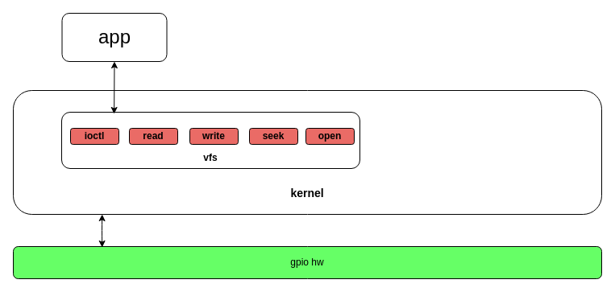

# GPIO 应用开发指南

[ [English](../../../../../en/device_dev_guide/driver/peripheral_driver/gpio/gpio_app_development_guide.md) | 简体中文 ]

本指南面向**应用程序开发者**，详细介绍如何在 openvela 实时操作系统中，通过标准 POSIX 接口来使用通用输入/输出（GPIO）功能。读完本文，您将学会如何通过读写设备文件来控制 LED、读取按键状态等。

本文档遵循“一切皆文件”的设计哲学，内容组织如下：

- **基本概念**：用通俗的语言解释 GPIO 及其核心特性，为后续操作提供理论基础。
- **北向接口 (应用层)**：重点介绍如何使用 `open`, `read`, `write`, `ioctl` 等函数来与 GPIO 设备文件交互。
- **验证与测试**：提供一个开箱即用的用户空间测试工具，帮助您快速验证 GPIO 功能。

## 一、基本概念

在深入技术细节之前，我们先了解几个 GPIO 开发中最基础的概念。

### 1、什么是引脚 (Pin)

您可以将芯片（如 CPU 或微控制器）想象成一个微型的大脑，而**引脚**就是这个大脑伸出的“触手”或“天线”。它在物理上是芯片边缘排列的微小金属管脚或焊盘。

- **作用**：引脚是芯片内部数字世界与外部物理世界进行电气连接的桥梁。所有的数据和控制信号都通过这些引脚流入或流出芯片。
- **类比**：如果芯片是一座大楼，那么引脚就是这座大楼所有的“门窗”。每个门窗都有一个唯一的编号，负责特定的“人流”（信号）进出。

### 2、什么是 GPIO

**GPIO** 是“通用输入/输出（General-Purpose Input/Output）”的缩写。它是一种特殊的、功能灵活的引脚。

- **通用 (General-Purpose)**：意味着这个引脚的用途不是固定的。开发者可以通过编程，根据需求动态地定义它的功能，就像给一个万能工具分配具体任务一样。
- **输入 (Input)**：当配置为输入模式时，GPIO 可以“感知”或“读取”外部世界的状态。它就像芯片的“眼睛”或“耳朵”。

    - **示例**：连接一个按钮，通过读取 GPIO 的电平高低来判断按钮是否被按下。

- **输出 (Output)**：当配置为输出模式时，GPIO 可以“控制”或“驱动”外部设备。它就像芯片的“手”。

    - **示例**：连接一个 LED 灯，通过 GPIO 输出高电平来点亮它，输出低电平来熄灭它。

简单来说，**GPIO** **就是芯片上一种可被编程的、既能当“眼睛”又能当“手”的数字接口**，让程序有能力与硬件世界进行最基本的交互。

### 3、GPIO 的核心特性

除了基本的输入/输出，理解以下特性对于 GPIO 开发至关重要：

#### 引脚复用 (Pin Multiplexing)

现代芯片的引脚通常是“一脚多用”的。同一个引脚，除了可以作为通用 GPIO 外，还可以被配置为其他专用外设的功能，例如：

- `UART_TX` (串口发送)
- `I2C_SCL` (I2C 时钟线)
- `SPI_MOSI` (SPI 主机输出线)
- `PWM_OUT` (脉宽调制输出)

这种机制称为**引脚复用** (或备用功能 Alternate Function, AF)。因此，在使用一个引脚作为 GPIO 之前，通常需要通过编程确保它已被正确配置为“GPIO”功能，而不是其他外设功能。

#### 输入模式：浮空、上拉与下拉

当 GPIO 配置为输入模式时，如果它未连接到任何有效的信号源（例如，一个未按下的按钮），其电平状态将是不确定的，这被称为**浮空状态 (Floating State)**。这种不确定的状态可能导致程序读到错误的电平值。

为了解决这个问题，芯片内部通常会为 GPIO 提供**上拉电阻 (Pull-up)** 和 **下拉电阻 (Pull-down)**：

- **上拉 (Pull-up)**：在引脚内部连接一个电阻到高电平 (VCC)。当引脚悬空时，它会被这个电阻“拉”到高电平，从而获得一个确定的默认状态。
- **下拉 (Pull-down)**：与上拉相反，它将引脚通过电阻连接到地 (GND)，使悬空时的默认状态为低电平。

> **类比**：可以将上拉/下拉想象成一扇弹簧门。上拉弹簧总是把门关到“开”的位置，而下拉弹簧总是把门关到“关”的位置，除非有外力（外部信号）来推它。

#### 输入模式：中断 (Interrupt)

除了让 CPU 主动去“读取”引脚状态（称为**轮询 Polling**），GPIO 还提供了一种更高效的方式：**中断 (Interrupt)**。

您可以将 GPIO 配置为在特定事件发生时（如电平从低变高、从高变低或两者都有），主动向 CPU 发送一个“通知”信号。CPU 收到这个信号后，会立即暂停当前任务，去处理这个 GPIO 事件。

> **类比**：轮询就像每隔几秒钟就通过猫眼看一下是否有人来访，而中断就像安装了一个门铃，只有在客人按下门铃时你才需要去开门。显然，中断更高效。

## 二、GPIO 北向接口 (应用层)

openvela 将每个 GPIO 引脚（Pin）抽象为一个字符设备文件。应用程序通过标准的 POSIX 文件操作（如 `open`, `read`, `write`, `ioctl`）来控制位于 `/dev/` 目录下的相应设备文件（例如 `/dev/gpio0`），从而实现对硬件引脚的控制。此接口可用于驱动 LED、蜂鸣器、继电器、风扇等外设。下面详细介绍下 openvela 中提供的 GPIO 北向接口。

Vela把每个pin当作一个gpio设备，对每个pin的控制都可以通过控制/dev/gpiox文件达到效果。应用场景方面借助北向接口可以用来控制led，蜂鸣器，继电器及小风扇等。下面详细介绍下Vela中提供的gpio北向接口。



### 1、启用 GPIO 驱动框架

您必须开启该选项，GPIO 模块代码才会参与编译，否则任何关于 GPIO 设备控制都将出错。

```Makefile
CONFIG_DEV_GPIO=y
```

### 2、POSIX API 参考

#### open

使用 `open()` 函数打开一个 GPIO 设备，成功时返回一个文件描述符（File Descriptor），失败时返回 -1 并设置 `errno`。

```C
#include <sys/types.h>
#include <sys/stat.h>
#include <fcntl.h>
int open (const char *devname, int flags);
```

- **`devname`**：GPIO 设备文件的路径，例如 `"/dev/gpio0"`。
- **`flags`**：必须包含 `O_RDONLY`、`O_WRONLY` 或 `O_RDWR` 之一，分别指定以只读、只写或读写模式打开设备。您可以对此参数按位或（OR）上其他标志以修改 `open()` 的行为。更多信息请参考 [POSIX open 文档](https://pubs.opengroup.org/onlinepubs/9699919799.2013edition/functions/open.html)。

**示例：** 以只读方式打开 GPIO 设备。

```C
int fd;
fd = open("/dev/gpio0", O_RDONLY);
if (fd == -1)
    /* error */
```

> **注意**：进程必须拥有足够的权限才能成功打开设备文件。

#### read/write

使用 `read()` 和 `write()` 函数与已打开的 GPIO 设备进行数据交互。

- **`read()`**

    ```C
    #include <unistd.h>
    ssize_t read(int fd, void *buf, size_t nbytes);
    ```

    此函数从文件描述符 `fd` 读取 `nbytes` 字节到缓冲区 `buf` 中。对于 GPIO 设备，即使 `nbytes` 大于 1，也只会读取 1 字节（`'0'` 或 `'1'`）。每次 `read()` 操作后，文件读写位置会前进。**为确保每次都能从起始位置读取，您必须在调用** **`read()`** **之前使用** **`lseek()`** **将文件位置重置为 0。**

- **`write()`**

    ```C
    #include <unistd.h>
    ssize_t write(int fd, const void *buf, size_t nbytes);
    ```

    此函数将缓冲区 `buf` 中的 `nbytes` 字节数据写入文件描述符 `fd`。同样，即使 `nbytes` 大于 1，也只会写入 1 字节（`'0'` 或 `'1'`）来设置引脚电平。

#### lseek

使用 `lseek()` 函数设置文件读写位置。

```C
#include <sys/types.h>
#include <unistd.h>
off_t lseek(int fd, off_t offset, int whence)
```

对于 openvela 中的 GPIO 设备，`lseek()` 仅支持以下特定操作：

- **`whence`**：必须为 `SEEK_SET`。
- **`offset`**：必须为 `0`。

**示例：** 重置文件位置。

```C
off_t ret;
ret = lseek(fd, 0, SEEK_SET);
if (ret == (off_t) -1)
    /* error */
```

#### ioctl

使用 `ioctl()` 函数执行标准文件操作无法覆盖的特殊设备控制命令。

```C
#include <sys/ioctl.h>
#include <nuttx/ioexpander/gpio.h>
int ioctl (int fd, int cmd, ...);
```

- **`fd`**：目标设备的文件描述符。
- **`cmd`**：设备控制命令码，定义于 `nuttx/ioexpander/gpio.h`。
- **`...`**：一个可选的参数，通常是 `unsigned long` 类型的整数或指针。

以下是常用的 GPIO `ioctl` 命令：

| **命令**           | **描述**                                              | **示例**                                                                                                                                                   |
| :----------------- | :---------------------------------------------------- | :--------------------------------------------------------------------------------------------------------------------------------------------------------- |
| `GPIOC_WRITE`      | 对 `fd` 所引用的文件写操作。                          | `bool out_val = true;` `ret = ioctl(fd, GPIOC_WRITE, (unsigned long)out_val);`                                                                             |
| `GPIOC_READ`       | 对 `fd` 所引用的文件读操作。                          | `bool in_val;` `ret = ioctl(fd, GPIOC_READ, (unsigned long)((uintptr_t)&invalue));`                                                                        |
| `GPIOC_PINTYPE`    | 获得当前 GPIO 的引脚类型。                            | `enum gpio_pintype_e type;``ret = ioctl(fd, GPIOC_PINTYPE, (unsigned long)((uintptr_t)&pintype));`                                                         |
| `GPIOC_SETPINTYPE` | 设置当前 GPIO 的引脚类型                              | `enum gpio_pintype_e new_type = GPIO_OUTPUT_PIN;` `ret = ioctl(fd, GPIOC_SETPINTYPE, (unsigned long) newpintype);`                                         |
| `GPIOC_REGISTER`   | 为引脚注册一个中断信号。                              | `struct sigevent notify;` `notify.sigev_notify = SIGEV_SIGNAL;` `notify.sigev_signo  = SIGINT;` `ret = ioctl(fd, GPIOC_REGISTER, (unsigned long)&notify);` |
| `GPIOC_UNREGISTER` | 取消已注册的中断信号，GPIO 中断产生时不触发进程信号。 | `ioctl(fd, GPIOC_UNREGISTER, 0);`                                                                                                                          |

**关于 `GPIOC_REGISTER`：** 此命令将一个 POSIX 信号与 GPIO 中断关联。当硬件中断触发时，内核会向指定进程发送该信号。您可以利用此特性测试中断功能，例如注册 `SIGINT` 信号，当中断发生时，如果未定义自定义信号处理函数，将触发终止进程的默认行为（等同于 Ctrl+C）。如需自定义处理，请参考 [POSIX signal 文档](https://pubs.opengroup.org/onlinepubs/9699919799/functions/signal.html)。

### 3、示例代码

openvela 在 NuttX 应用仓库中提供了北向接口的示例程序 `gpio_main.c`，可用于验证 GPIO 功能。

- **源代码**：[apps/examples/gpio/gpio_main.c](https://github.com/apache/nuttx-apps/blob/master/examples/gpio/gpio_main.c)

### 4、重要注意事项

1. **`read()`** **操作**：在调用 `read()` 之前，必须先调用 `lseek(fd, 0, SEEK_SET)` 将文件偏移量重置为 0，否则将无法读取到数据。`ioctl()` 的 `GPIOC_READ` 命令没有此限制。
2. **`read()`****/****`write()`** **数据格式**：这两个函数读写的数据是字符 `'0'` 或 `'1'`（ASCII 值），而非布尔值 `true`/`false` 或整数 `0`/`1`。
3. **中断注册**：要成功使用 `GPIOC_REGISTER` 和 `GPIOC_UNREGISTER`，引脚必须首先被配置为支持中断的类型（如 `GPIO_INTERRUPT_PIN`）。

## 三、验证与测试

openvela 提供了一个用户空间测试程序 [examples/gpio](https://github.com/apache/nuttx-apps/tree/master/examples/gpio)，用于验证 GPIO 驱动的正确性。此程序依赖于已成功注册到用户空间的 GPIO 设备文件。

### 1、启用测试程序

在系统配置中开启以下选项，将 GPIO 测试程序编译进固件：

```Bash
CONFIG_EXAMPLES_GPIO=y
```

### 2、使用方法

在目标设备的 Shell 中，直接运行 `gpio` 命令可查看帮助信息。


该工具支持设置引脚类型、读写引脚电平以及配置中断信号。以下所有示例均以操作 `/dev/gpiox` 设备为例。

#### 写引脚测试

使用 `-o` 参数设置输出引脚的电平。

```Bash
# 命令：将引脚设置为高电平
gpio -o 1 /dev/gpiox

# 输出示例：
Driver: /dev/gpiox
  Output pin:    Value=1
  Writing:       Value=1
  Verify:        Value=1
```

#### 读引脚测试

虽然没有专用的读操作参数，但测试工具允许您在引脚配置为**输入模式**时，使用 `-o` 参数来触发读取操作并显示当前状态。

```Bash
# 前提：引脚已被设为输入模式
# 命令：读取引脚电平
gpio -o 0 /dev/gpiox

# 输出示例：
Driver: /dev/gpiox
  Input pin:     Value=1
```

#### 设置引脚类型测试

使用 `-t` 参数和对应的类型 ID 设置引脚模式。

```Bash
# 命令：将引脚设置为输入模式 (ID 0)
gpio -t 0 /dev/gpiox

# 输出示例：
Driver: /dev/gpiox
```

#### 中断测试

中断功能通过 POSIX 信号进行验证。基本思路是：配置一个 GPIO 中断，并将其关联一个信号（如 `SIGINT`）。当硬件中断触发时，内核会向正在等待的 `gpio` 进程发送该信号，如果信号是 `SIGINT`，进程的默认行为是终止（等同于按下 Ctrl+C）。

以下是测试步骤：

```Bash
# 1. 设置引脚为下降沿中断触发模式 (ID 9)
gpio -t 9 /dev/gpiox

# 2. 注册中断，使其在触发时向当前进程发送 SIGINT 信号 (信号编号 2)
#    -w 参数用于注册中断信号
gpio -w 2 /dev/gpiox

# 3. 此时，gpio 进程会阻塞并等待信号。
#    从外部触发一次硬件下降沿中断（例如，将引脚电平从高拉到低）。
#    如果 gpio 进程立即退出，则表示中断功能正常。
```

## 四、接下来

至此，您已经掌握了在 openvela 中进行 GPIO 应用开发所需的全部知识。

如果您对 GPIO 驱动的底层实现感兴趣，想了解如何为一款新的芯片或开发板适配 GPIO 驱动，请继续阅读我们的进阶指南：[GPIO 驱动开发指南](./gpio_driver_development_guide.md)。