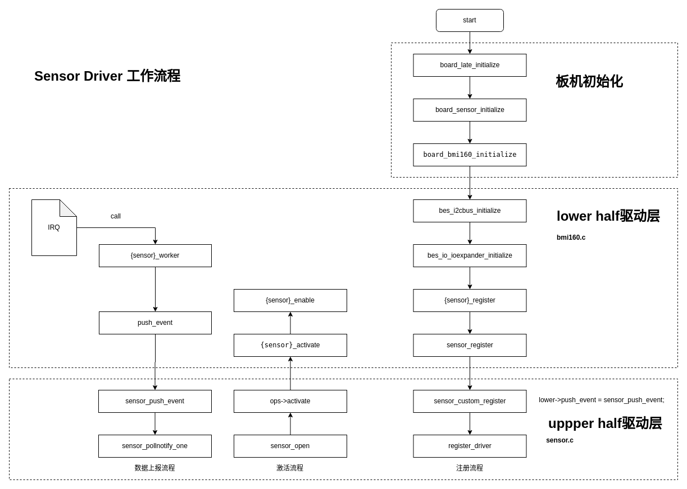

# 基于 Sensor 驱动框架的厂商驱动适配指南

\[ [English](../../../../../en/device_dev_guide/driver/peripheral_driver/sensor/sensor_config.md) | 简体中文 \]

## 一、概述

本文档为驱动开发者提供一份详尽的指南，指导您如何将特定的传感器（Vendor-Specific Sensor）适配到 openvela 的标准化 Sensor 驱动框架中。阅读本文后，您将能够为新的传感器芯片编写符合 openvela 规范的 `lower-half` 驱动，并将其成功集成到系统中。

在开始之前，我们建议您先熟悉 openvela 的 Sensor 驱动框架和 uORB 消息机制。相关背景资料请参阅：

- **Sensor 驱动框架**：[Sensor 驱动开发指南](./sensor_driver_development_guide.md.md)
- **uORB 框架**：[uORB 框架开发指南](../../../middleware/uorb_developer_guide.md)

### 1、框架与启动流程

openvela 的 Sensor 驱动采用分层设计，`upper half` 作为上层，提供标准化的字符设备接口；您需要编写的 `vendor driver` 作为下层（lower half），负责与具体硬件交互。两者通过 `sensor_lowerhalf_s` 结构体进行连接，并通过 uORB 机制进行数据上报。

下图展示了 Sensor 驱动在系统中的位置和核心交互流程。



### 2、支持的传感器类型与数据标准

openvela 为重力、光线、加速度、陀螺仪等通用传感器定义了标准的单位和数据结构。为了确保数据的准确性和上层应用的可移植性，您在适配驱动时**必须**遵循这些标准。

详细的接口定义和数据结构，请参阅以下内核头文件：

- **Sensor 核心接口**：[nuttx/include/nuttx/sensors/sensor.h](https://github.com/apache/nuttx/blob/master/include/nuttx/sensors/sensor.h)
- **uORB 接口**：[nuttx/include/nuttx/uorb.h](https://github.com/apache/nuttx/blob/master/include/nuttx/uorb.h)

## 二、核心适配步骤

本章节以 BMI160 传感器（I2C 接口）为例，详细阐述驱动适配的四个核心步骤。

### 步骤一：启用内核配置 (Kconfig)

首先，您需要在系统的 Kconfig 中启用 Sensor 框架、uORB、相关的总线以及目标传感器驱动。

以 I2C 接口的 BMI160 传感器为例（驱动源码参考：[nuttx/drivers/sensors/bmi160.c](https://github.com/apache/nuttx/blob/master/drivers/sensors/bmi160.c)），适配所需的 Kconfig 配置项如下：

<details>
<summary>点击展开代码</summary>

```Makefile
# sensor 模块的配置
CONFIG_DEBUG_SENSORS=y
CONFIG_DEBUG_USENSORS=y
CONFIG_DEBUG_SENSORS_ERROR=y
CONFIG_DEBUG_SENSORS_INFO=y
CONFIG_DEBUG_SENSORS_WARN=y

# uorb模块配置
CONFIG_UORB=y
CONFIG_UORB_PRIORITY=100
CONFIG_UORB_STACKSIZE=2048
CONFIG_UORB_LISTENER=y

# i2c配置
CONFIG_DEBUG_I2C=y
CONFIG_DEBUG_I2C_ERROR=y
CONFIG_DEBUG_I2C_INFO=y
CONFIG_DEBUG_I2C_WARN=y

# bmi160 传感器配置
CONFIG_SENSORS_BMI160=y
CONFIG_SENSORS_BMI160_I2C=y
```

</details>

---

### 步骤二：实现 Sensor Lower-Half 驱动

`lower-half` 驱动是连接通用 Sensor 框架与特定硬件的桥梁。您需要实现驱动的初始化、操作回调以及数据采集逻辑。

#### 1、实现驱动注册入口

`bmi160a_register` 函数是驱动的入口。在此函数中，您需要完成以下关键任务：

1. 为传感器（如加速度计、陀螺仪）分配私有数据结构 `bmi160_dev_s`。
2. 初始化 `sensor_lowerhalf_s` 结构体，这是与上层驱动交互的核心。
3. 执行必要的硬件初始化，如检查设备 ID、设置初始功耗模式等。
4. 调用 `sensor_register()` 将 `lower-half` 实例注册到系统中。

<details>
<summary>点击展开代码</summary>

```C
// 驱动注册入口函数
int bmi160a_register(int devno, FAR const struct bmi160_config_s *config)
{
  FAR struct bmi160_dev_s *accel_priv;
  FAR struct bmi160_dev_s *gyro_priv;
  int ret = 0;

  /* Sanity check */
  DEBUGASSERT(config != NULL);

  /* Initialize the BMI160 device structure */
  accel_priv = kmm_zalloc(sizeof(*accel_priv));
  if (accel_priv == NULL)
  {
    return -ENOMEM;
  }

  gyro_priv = kmm_zalloc(sizeof(*gyro_priv));
  if (gyro_priv == NULL)
  {
    return -ENOMEM;
  }

  // 1. 初始化加速度计的 lower-half 结构体
  accel_priv->config = config; // bus总线地址信息
  accel_priv->lower.ops = &g_bmi160_accel_ops; // 关联操作函数集
  accel_priv->lower.type = SENSOR_TYPE_ACCELEROMETER; // 设置传感器类型
  accel_priv->lower.uncalibrated = true; // 是否校准
  accel_priv->interval = BMI160_DEFAULT_INTERVAL; // 设置默认采样周期
  accel_priv->lower.nbuffer = 1; // 设置事件缓冲区大小

  // 2. 初始化陀螺仪的 lower-half 结构体 (类似)
  gyro_priv->config = config;
  gyro_priv->lower.ops = &g_bmi160_gyro_ops;
  gyro_priv->lower.type = SENSOR_TYPE_GYROSCOPE;
  gyro_priv->lower.uncalibrated = true;
  gyro_priv->interval = BMI160_DEFAULT_INTERVAL;
  gyro_priv->lower.nbuffer = 1;

  // 3. 硬件初始化：检查设备ID
  ret = bmi160_checkid(accel_priv);
  if (0 != ret)
  {
    kmm_free(accel_priv);
    kmm_free(gyro_priv);
    return ret;
  }
   
  // 4. 硬件初始化：设置初始功耗模式
  bmi160_putreg8(accel_priv->config, BMI160_PMU_TRIGGER, 0);

  // 5. 调用 sensor_register 将 lower-half 注册到 Sensor 框架
  ret = sensor_register(&accel_priv->lower, devno);
  if (ret != 0)
  {
    sensor_unregister(&accel_priv->lower, devno);
    kmm_free(accel_priv);
    BMI160_ERR("register accel fail");
  }

  ret = sensor_register(&gyro_priv->lower, devno);
  if (ret != 0)
  {
    sensor_unregister(&gyro_priv->lower, devno);
    kmm_free(gyro_priv);
    BMI160_ERR("register gyro fail");
  }

  BMI160_INFO("register bmi160 done!", ret);

  return ret;
}
```

</details>

#### 2、实现 `sensor_ops_s` 操作集

您需要为每种传感器实现一个 `sensor_ops_s` 结构体，它定义了上层驱动可以调用的标准操作。以 BMI160 为例：

```C
static const struct sensor_ops_s g_bmi160_accel_ops =
{
    .activate = bmi160_activate,
    .set_interval = bmi160_set_interval,
    .batch = NULL,
    .fetch = NULL,
    .selftest = NULL,
    .set_calibvalue = NULL,
    .calibrate = NULL,
    .control = NULL
};
```

- **`activate`**: 当应用程序启动或停止传感器时，上层驱动会调用此函数。您需要在此函数中：

    - **启用 (****`enable=true`****)**: 启动硬件，并使用 `work_queue` 调度一个周期性的 worker 任务来采集数据。

    - **禁用 (****`enable=false`****)**: 停止硬件，并使用 `work_cancel` 取消之前调度的 worker 任务，以节省功耗。

        <details>
        <summary>点击展开代码</summary>

        ```C
        // activate 函数的实现
        static int bmi160_accel_activate(FAR struct sensor_lowerhalf_s *lower,
                                        FAR struct file *filep,
                                        bool enable)
        {
        BMI160_INFO("sensor call accel activate!");
        
        FAR struct bmi160_dev_s *priv = (FAR struct bmi160_dev_s *)lower;
        int ret;
        
        if (lower->type == SENSOR_TYPE_ACCELEROMETER)
        {
            if (priv->activated != enable)
            {
            // 根据 enable 标志调用内部的使能/禁用函数
            ret = bmi160_accel_enable(priv, enable);
            if (ret != 0)
            {
                return ret;
            }
        
            priv->activated = enable;
            }
        }
        else
        {
            return -EINVAL;
        }
        
        return OK;
        }
        
        // 内部的使能/禁用逻辑
        static int bmi160_accel_enable(FAR struct bmi160_dev_s *priv,
                                    bool enable)
        {
        int ret = 0;
        
        if (enable)
        {
            // 启动硬件，设置工作模式和采样率
            bmi160_putreg8(priv->config, BMI160_CMD, ACCEL_PM_NORMAL);
            up_mdelay(30);
        
            float freq = (1 * 1000 * 1000) / priv->interval;
        
            int idx = bmi160_findodr(&freq, g_bmi160_accel_odr, sizeof(g_bmi160_accel_odr));
            bmi160_setodr(priv, g_bmi160_accel_odr[idx].regval);
        
            // 调度一个周期性 worker 任务来采集数据
            ret = work_queue(HPWORK, &priv->work,
                    bmi160_accel_worker, priv,
                    priv->interval / USEC_PER_TICK);
        
            BMI160_INFO("sensor call accel enable[%d],[%d],[%x]!", enable, ret, g_bmi160_accel_odr[idx].regval);
        }
        else
        {
            // 取消 worker 任务
            work_cancel(HPWORK, &priv->work);
            
            // 让硬件进入低功耗模式
            bmi160_putreg8(priv->config, BMI160_CMD, ACCEL_PM_SUSPEND);
            BMI160_INFO("sensor call accel disable[%d],[%d]!", enable, ret );
        }
        
        return ret;
        }
        ```

        </details>

- **`set_interval`**: 当应用程序设置新的采样周期时调用。您需要根据传入的周期值（单位：微秒）来配置硬件的采样率（ODR, Output Data Rate）。

    <details>
    <summary>点击展开代码</summary>

    ```C
    // set_interval 函数的实现
    static int bmi160_set_accel_interval(FAR struct sensor_lowerhalf_s *lower,
                                        FAR struct file *filep,
                                        FAR unsigned long *period_us)
    {
    FAR struct bmi160_dev_s *priv = (FAR struct bmi160_dev_s *)lower;
    float freq = 0.0f;
    int i = 0;

    /* Sanity check. */

    if (NULL == priv || NULL == period_us)
    {
        return -1;
    }

    // 1. 将周期 (us) 转换为频率 (Hz)
    /* 1s => us / period us => HZ/s */
    freq = (1 * 1000 * 1000 * 1.0f) / *period_us;

    // 2. 根据频率查找最匹配的硬件寄存器配置值
    /* bmi160_odr_s cnt */
    int num = sizeof(g_bmi160_accel_odr) / sizeof(struct bmi160_odr_s);

    for (i = 0; i < num; i++)
    {
        if (freq <= g_bmi160_accel_odr[i].odr)
        {
        freq = g_bmi160_accel_odr[i].odr;
        break;
        }
    }
    BMI160_INFO("sensor call accel interval[%ul][%x]!", period_us, g_bmi160_accel_odr[i].regval);
    
    // 3. 将配置写入硬件寄存器
    bmi160_putreg8(priv->config, BMI160_ACCEL_CONFIG,
                    ACCEL_NORMAL_AVG4 | g_bmi160_accel_odr[i].regval);
    return 0;
    }
    ```

    </details>

#### 3、实现数据采集与上报 (Worker 线程)

`worker` 函数是驱动的核心数据泵。它由 `work_queue` 周期性触发，负责以下工作：

1. 从传感器硬件读取原始数据。
2. 将原始数据填充到 openvela 标准的 Sensor 数据结构中（例如 `struct sensor_accel`）。
3. 调用 `lower->push_event()` 函数，将数据发布到 uORB 总线。
4. **重新调度自己**，以实现下一次的周期性采集。

<details>
<summary>点击展开代码</summary>

```C
static void bmi160_accel_worker(FAR void *arg)
{
  FAR struct bmi160_dev_s *priv = arg;
  struct sensor_accel accel;

  DEBUGASSERT(priv != NULL);

  // 1. 重新调度 worker 任务，确保周期性采集
  work_queue(HPWORK, &priv->work,
             bmi160_accel_worker, priv,
             priv->interval / USEC_PER_TICK);


  // 2. 从硬件寄存器读取 X, Y, Z 轴数据和时间戳
  FAR struct accel_t p;

  bmi160_getregs(priv->config, BMI160_DATA_14, (uint8_t *)&p, 6);
  
  // 3. 填充到标准数据结构
  accel.x = p.x;
  accel.y = p.y;
  accel.z = p.z;

  uint32_t time = 0;
  bmi160_getregs(priv->config, BMI160_SENSORTIME_0, (uint8_t *)&time, 3);

  /* Adjust sensing time into 24 bit */

  time >>= 8;
  accel.timestamp = time;

  BMI160_INFO("sensor accel read: x:[%f],y:[%f]",accel.x, accel.y);
  BMI160_INFO("sensor accel read: z:[%f]time[%d]!", accel.z, time);

  // 4. 通过 push_event 发布数据到 uORB
  priv->lower.push_event(priv->lower.priv, &accel, sizeof(accel));
  
}
```

</details>

### 步骤三：完成板级初始化

板级支持包（BSP）中的初始化代码负责将 `lower-half` 驱动与实际的硬件总线连接起来。您需要在板级的初始化函数（例如 `board_sensor_initialize`）中完成：

1. 初始化传感器所连接的物理总线（例如 I2C）。
2. 为传感器驱动配置总线句柄、设备地址等信息。
3. 调用驱动的注册入口函数（例如 `bmi160a_register`）。

<details>
<summary>点击展开代码</summary>

```C
#define bmi160_I2C_ADDRESS 0x68
#define bmi160_I2C_FREQUENCY 4 * 100 * 1000

int board_bmi160_initialize(int devno, int busno)
{
  int ret;
  FAR struct i2c_master_s *i2cbus;

#ifdef CONFIG_I2C_DRIVER
  /* Initialize the i2c master bus device */

  syslog(LOG_INFO, "apollo4x_i2cbus_initialize CONFIG_I2C_DRIVER.\n");

  // 1. 初始化 I2C 总线
  i2cbus = apollo4x_i2cbus_initialize(busno);
  if (i2cbus == NULL)
  {
    syslog(LOG_ERR, "apollo4x_i2cbus_initialize failed.\n");
    return -ENODEV;
  }
  else
  {
    ret = i2c_register(i2cbus, busno);
    if (ret < 0)
    {
      syslog(LOG_ERR, "Failed to register I2C%d driver: %d\n", 0, ret);
      return -ENODEV;
    }
#if defined(CONFIG_SENSORS_BMI160) && defined(CONFIG_SENSORS_BMI160_I2C)
    else
    {

      FAR struct bmi160_config_s *bmi160_config;

      // 2. 为 BMI160 配置总线信息
      bmi160_config = kmm_zalloc(sizeof(*bmi160_config));
      if (bmi160_config == NULL)
      {
        return -ENOMEM;
      }

      bmi160_config->i2c = i2cbus;
      // bmi160_config->ioedev = NULL;
      bmi160_config->addr = bmi160_I2C_ADDRESS;
      bmi160_config->freq = bmi160_I2C_FREQUENCY;

      /* Then register the barometer sensor */
      // 3. 调用驱动注册函数，完成驱动和板级的绑定
      ret = bmi160a_register(devno, bmi160_config);
      if (ret != 0)
      {

        BMI160_ERR("init fail! ret[%d]", ret);
        kmm_free(bmi160_config);
        return ret;
      }

      BMI160_INFO("init done");
    }
#endif
  }

#endif

  return 0;
}
```

</details>

### 步骤四：测试与验证

完成以上步骤后，您可以使用 `uorb_listener` 工具来验证驱动是否正常工作。

首先，查看该工具的帮助信息：

```Bash
nsh> uorb_listener -h
Utility to listen on uORB topics and print the data to the console.
...
Commands:
    <topics_name> Topic name. Multi name are separated by ','
    [-n <val> ]  Number of messages, default: 0
    [-r <val> ]  Subscription rate (in Hz), default: 0
...
```

然后，订阅您传感器对应的 uORB 主题。对于 BMI160 的未校准加速度计，主题名通常为 `sensor_accel_uncal0`。执行以下命令，以 25Hz 的速率订阅 20 条消息：

```Bash
nsh> uorb_listener -n 20 -r 25 sensor_accel_uncal0
```

如果您看到类似以下的日志输出，则表明驱动已成功工作：

<details>
<summary>点击展开日志</summary>

```Bash
NuttShell (NSH) NuttX-12.0.0-vela                                                                                  
nsh> uorb_listener -n 20 -r 25 sensor_accel_uncal0   
# 1. uorb_listener 工具启动，打开并配置 sensor 设备节点                                                              
sensor_ioctl: cmd=a80 arg=100266bc    # IOCTL 调用，激活传感器                                                                             
                                                                                                                   
Mointor objects num:1                                                                                              
object_name:sensor_accel_uncal, object_instance:0     

# 2. 驱动 activate 回调被触发，启动硬件和 worker                                                             
[BMI160]sensor call accel activate!                                                                                
[BMI160]sensor call accel enable,[1], ret[0] [8]!      

# 3. 驱动 set_interval 回调被触发，设置采样率                                                            
sensor_ioctl: cmd=a81 arg=00009c40        # IOCTL 调用，设置间隔                                                                         
[B[BMI160]sensor accel be getreg: x:[0.000000],y:[0.000000],z:[0.000000]                                           
MI160]sen[BMI160]sensor accel af getreg: x:[0.000000],y:[0.000000],z:[0.000000]                                    
sor ca[BMI160]sensor accel read: x:[15065.000000],y:[5789.000000]                                                  
[BMI160]sensor accel read: z:[1300.000000]time[19335]!                                                             
ll accel interval[268592868l][6]!   

# 4. worker 线程开始周期性读取数据并上报
#    每一条 read log 都代表 worker 成功执行并上报了一次数据                                                                               
[BMI160]sensor accel be getreg: x:[0.000000],y:[5789.000000],z:[0.0000                                             
[BMI160]sensor accel af getreg: x:[0.000000],y:[5789.000000],z:[0.0000                                             
[BMI160]sensor accel read: x:[15065.000000],y:[5789.000000]                                                        
[BMI160]sensor accel read: z:[1300.000000]time[19339]!                                                             
# ... (此处省略中间18条数据) ...

# 5. 达到指定的 20 条消息后，uorb_listener 退出
#    驱动的 activate 回调被再次触发，禁用传感器以省电                                                          
call accel activate!                                                                                               
[BMI160]sensor call accel disable,[0],ret[0]!                                                                      
Object name:sensor_accel_uncal0, recieved:20                                                                       
Total number of received Message:20/20                                                                             
nsh>
```

</details>

---

这个清晰的日志流表明了从应用层配置、驱动响应到数据上报的完整链路都已成功打通。

## 三、总结

适配一个新的传感器驱动到 openvela 主要涉及以下四个关键环节：

1. **Kconfig 配置**：确保所有相关的内核组件和驱动都被编译进系统。
2. **实现 Lower-Half 驱动**：编写与硬件交互的逻辑，核心是填充 `sensor_lowerhalf_s` 和实现 `sensor_ops_s` 操作集，并利用 `work_queue` 周期性上报数据。
3. **板级初始化**：在 BSP 中将驱动与具体的硬件总线进行绑定和注册。
4. **测试验证**：使用 `uorb_listener` 等工具验证 uORB 主题的数据是否正确。

遵循这一标准化流程，可以大大提高驱动开发效率和代码的可维护性。
