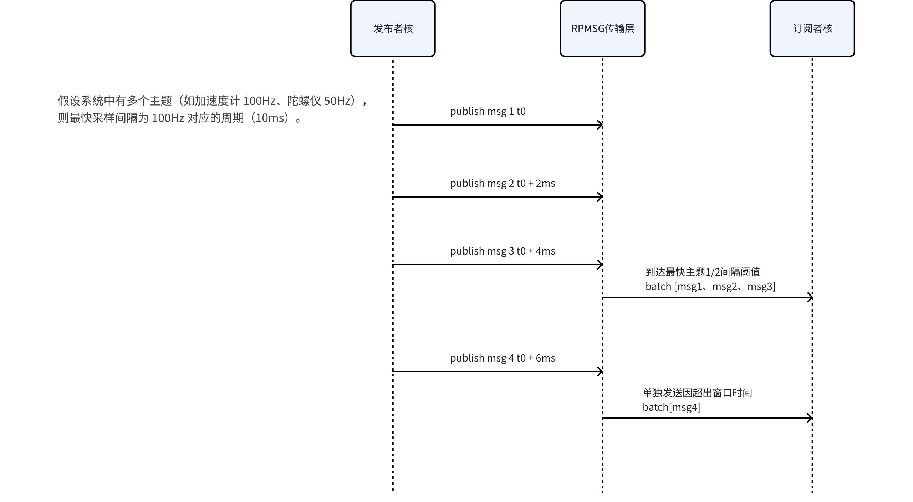
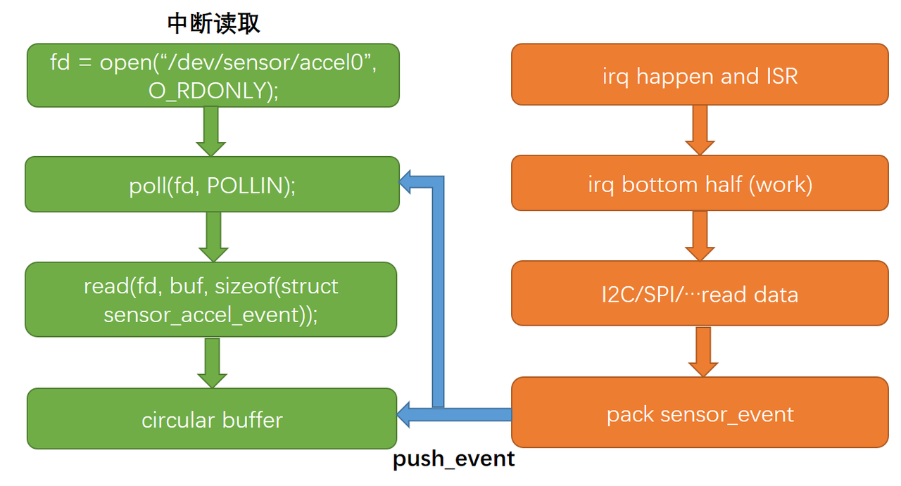
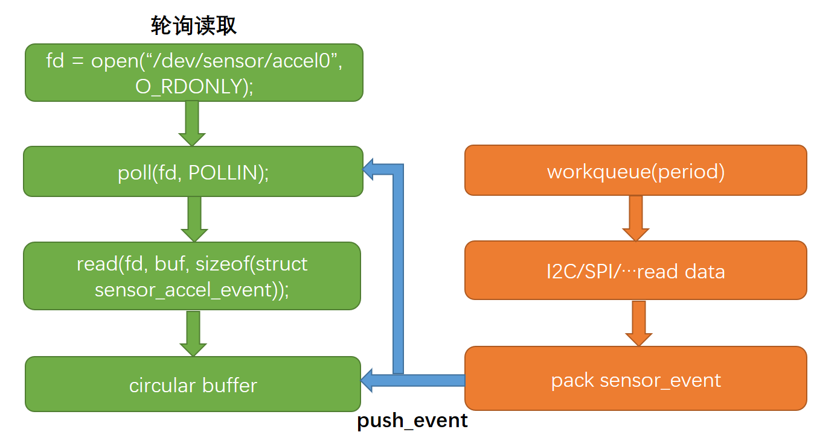
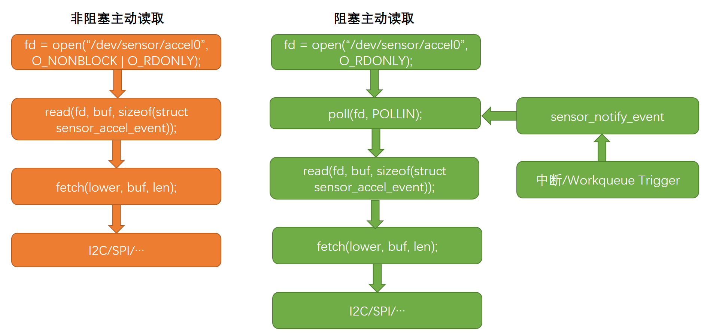

# Sensor 驱动开发指南

[ [English](../../../../../en/device_dev_guide/driver/peripheral_driver/sensor/sensor_driver_development_guide.md.md) | 简体中文 ]

本文档旨在帮助您理解 openvela 的传感器框架，并指导您完成一个标准传感器驱动的编写。

**学习目标：**

- 理解 openvela 传感器框架的设计理念与核心特性。
- 掌握编写一个传感器驱动的具体步骤和方法。

## 一、框架概述

openvela 传感器框架借鉴了 Linux `IIO (Industrial I/O)` 子系统的设计思想，旨在提供一个统一、高效的传感器管理平台。其核心是**分层架构**，通过将通用功能抽象到上半区，让驱动开发者可以更专注于与物理硬件的交互逻辑。

这种设计不仅统一了所有传感器的管理方式，还有效地复用了公共代码，减少了固件的最终体积。

### 1、驱动核心职责：聚焦物理传感器

openvela 的设计哲学明确了驱动开发者的核心职责范围：

- **驱动层关注物理传感器 (Physical Sensor)**： openvela 的传感器驱动（Driver）主要负责与**物理传感器**的硬件直接交互。开发者的核心任务是编写下半区（Lower Half）驱动，实现与传感器芯片的通信、数据采集和控制。
- **应用层处理虚拟传感器 (Virtual Sensor)**： 对于通过数据融合生成的**虚拟传感器**（例如，结合加速度计和陀螺仪数据计算出的“设备姿态”），框架将其设计为在**应用层**通过 `uORB` 的发布/订阅机制来实现，这并非内核驱动的职责。

对于集成了多种功能的物理器件（如 IMU），驱动开发者需要在下半区为**每一种物理功能**（如加速度、陀螺）分别实例化 `lowerhalf` 结构，并通过 `sensor_register` API 将它们注册为独立的设备节点。

### 2、上下半区驱动模型 (Upper/Lower Half)

openvela 传感器框架将驱动逻辑明确地划分为两个层次：

- **上半区 (Upper Half)**

    - **作用**: 作为框架的通用层，处理所有与具体硬件无关的公共逻辑。
    - **核心职责**:

        - 创建和管理设备节点 (`/dev/sensor/*`)。
        - 实现标准文件操作接口 (`file_operations`)，如 `open`、`read` 和 `ioctl`。
        - 管理多用户并发访问。
        - 维护用于数据交换的环形缓冲区 (Ring Buffer)。
        - 执行数据降采样 (Down-sampling) 和低功耗管理。

- **下半区 (Lower Half)**

    - **作用**: 作为特定传感器的硬件抽象层，负责与物理传感器直接通信。
    - **核心职责**:
        - 实现 `sensor_ops_s` 操作集，定义传感器的具体行为（如 `activate`, `set_interval` 等）。
        - 通过 I2C/SPI 等总线与传感器寄存器交互。
        - 在中断或轮询模式下采集数据，并将传感器事件 (Sensor Event) 推送至上半区的环形缓冲区。
    - **实现分类**:
        - **通用下半区 (Generic Lower Half)**: 直接与物理硬件交互的驱动。
        - **RPMSG 下半区 (RPMSG Lower Half)**: 负责与远程 CPU 核心进行跨核数据订阅与发布的代理驱动。

## 二、开发准备：代码与配置

### 1、关键文件位置

- **框架核心**:

    - `nuttx/driver/sensor/sensor.c`: 传感器上半区实现。
    - `nuttx/driver/sensor/sensor_rpmsg.c`: RPMSG 下半区实现。
    - `nuttx/driver/sensor/usensor.c`: 用户空间传感器注册实现。

- **头文件**:

    - `nuttx/include/nuttx/sensors/sensor.h`: 传感器内部数据类型定义。
    - `nuttx/include/nuttx/sensors/ioctl.h`: `ioctl` 命令定义。
    - `nuttx/include/nuttx/uorb.h`: uORB 统一消息结构定义。

### 2、内核配置项 (Kconfig)

您需要在 `menuconfig` 中启用以下配置来支持传感器框架：

- `CONFIG_SENSORS`: 启用 openvela 传感器框架。
- `CONFIG_USENSORS`: 启用用户空间传感器定义与注册功能。
- `CONFIG_SENSORS_RPMSG`: 启用多核传感器通信能力。

## 三、关键数据结构

### 1、传感器类型与主题

`openvela` 预定义了 53 种标准传感器类型，覆盖了大部分物理传感器。所有类型定义在 `include/nuttx/sensors/sensor.h` 中。这些类型定义同时也被用作 `uORB (micro Object Request Broker)` 的通信主题。

若需新增类型，必须明确其物理用途和数据单位规范。

**示例：加速度计 (****`SENSOR_TYPE_ACCELEROMETER`****)**

其事件数据结构定义如下：

```C
/*
 * 加速度计 (Accelerometer)
 * 用于测量设备沿三个正交轴的加速度矢量。
 */
struct sensor_event_accel   /* Type: Accelerometer */
{
  uint64_t timestamp;       /* 时间戳，单位: 微秒 (us) */
  float x;                  /* X 轴加速度，单位: m/s^2 */
  float y;                  /* Y 轴加速度，单位: m/s^2 */
  float z;                  /* Z 轴加速度，单位: m/s^2 */
  float temperature;        /* 器件温度，单位: 摄氏度 (°C) */
};
```

### 2、下半区接口结构: `sensor_lowerhalf_s`

该结构是连接上半区与下半区的核心桥梁。在编写驱动时，您需要实例化并填充此结构中的指定字段。

<details>
<summary>点击展开代码</summary>

```C++
struct sensor_lowerhalf_s
{
  /* --- 由下半区驱动填充 --- */
  int type;
  unsigned long nbuffer;
  bool uncalibrated;
  FAR const struct sensor_ops_s *ops;
  bool persist;

  /* --- 由上半区填充，供下半区调用 --- */
  union
    {
      sensor_push_event_t push_event;
      sensor_notify_event_t notify_event;
    };

  CODE void (*sensor_lock)(FAR void *priv);
  CODE void (*sensor_unlock)(FAR void *priv);

  FAR void *priv;
};
```

</details>

---

**字段说明**

| **成员 (Member)**               | **填充方** | **描述**                                                                                                                               |
| :------------------------------ | :--------- | :------------------------------------------------------------------------------------------------------------------------------------- |
| `type`                          | 下半区     | **必需**。指定传感器类型，如 `SENSOR_TYPE_ACCELEROMETER`。                                                                             |
| `nbuffer`                       | 下半区     | **必需**。设置上半区环形缓冲区的大小（以事件数量计）。                                                                                 |
| `uncalibrated`                  | 下半区     | **可选**。用于表示下半区驱动上报数据是否为未校准数据，设为 `true` 表示上报的是原始未校准数据。注册的设备节点会自动添加 `_uncal` 后缀。 |
| `ops`                           | 下半区     | **必需**。指向驱动实现的 `sensor_ops_s` 操作集结构体。                                                                                 |
| `persist`                       | 下半区     | **可选**。设为 `true` 表示该主题为通知类主题。                                                                                         |
| `push_event`                    | 上半区     | **推荐使用**。下半区调用此函数将采集到的数据推送到环形缓冲区。                                                                         |
| `notify_event`                  | 上半区     | 仅与 `fetch` 模式配合使用，用于在阻塞读取时通知上半区数据已就绪。                                                                      |
| `sensor_lock` / `sensor_unlock` | 上半区     | 导出的锁，供下半区使用以避免递归死锁（目前仅由 `sensor_rpmsg` 使用）。                                                                 |
| `priv`                          | 上半区     | 指向上半区上下文的私有指针，供 `push_event` 等函数内部使用。                                                                           |

### 3、驱动实现模式

根据硬件特性，您的驱动实现可能遵循以下模式：

- **单芯片单传感器**:

    - **描述**: 一个芯片只提供一种传感器功能（如仅有三轴加速度的 IAM20381）。
    - **实现**: 实例化一个 `sensor_lowerhalf_s` 结构并注册一次。

- **单芯片多传感器**:

    - **描述**: 一个芯片集成了多种传感器功能（如包含加速度计、陀螺仪、磁力计的 ICM20948 IMU）。
    - **实现**: 您需要为每一种传感器功能分别实例化一个 `sensor_lowerhalf_s` 结构，并调用 `sensor_register` 多次，将它们注册为独立的设备节点（如 `/dev/sensor/accel0`, `/dev/sensor/gyro0` 等）。


## 四、核心 API 与驱动操作集

本章节介绍 openvela 传感器框架为下半区驱动提供的核心接口，包括辅助 API 和必须实现的驱动操作集 `sensor_ops_s`。

### 1、上半区辅助 API

上半区导出了一些辅助函数，供下半区驱动在实现过程中调用。

#### 设备注册与注销

- `sensor_register` / `sensor_unregister`

    - **用途**: 用于注册和注销**标准类型**的传感器设备。
    - **说明**: 注册成功后，会在 `/dev/sensor/` 目录下生成对应的设备节点，例如 `accel0`。`devno` 参数是设备名索引，用于区分同类型的多个设备。

- `sensor_custom_register` / `sensor_custom_unregister`

    - **用途**: 用于注册和注销**自定义类型**的传感器，注册成功则生成字符设备节点。
    - **说明**: 允许开发者指定字符设备路径 `path` 和事件数据大小 `esize`，提供了更高的灵活性。

<details>
<summary>点击展开代码</summary>

```C
/* 注册/注销标准类型传感器 */
int sensor_register(FAR struct sensor_lowerhalf_s *dev, int devno);
void sensor_unregister(FAR struct sensor_lowerhalf_s *dev, int devno);

/* 注册/注销自定义类型传感器 */
int sensor_custom_register(FAR struct sensor_lowerhalf_s *dev,
                           FAR const char *path, unsigned long esize);
void sensor_custom_unregister(FAR struct sensor_lowerhalf_s *dev,
                              FAR const char *path);
```

</details>

#### 获取时间戳

此函数返回一个微秒（us）精度的系统时间戳，下半区驱动在封装传感器事件时应调用此接口来填充 `timestamp` 字段。

```C
static inline uint64_t sensor_get_timestamp(void)；
```

### 2、下半区操作集: `sensor_ops_s`

`sensor_ops_s` 结构体定义了一组函数指针（回调函数），是下半区驱动的核心。开发者必须实现这些接口，以响应来自上半区的控制请求。这组接口的设计参考了主流传感器框架，并选取了最关键的操作，而其他固定配置（如量程、分辨率）则建议在驱动初始化时作为参数传入。

<details>
<summary>点击展开代码</summary>

```C
struct sensor_ops_s
{
  CODE int (*open)(FAR struct sensor_lowerhalf_s *lower, FAR struct file *filep);
  CODE int (*close)(FAR struct sensor_lowerhalf_s *lower, FAR struct file *filep);
  CODE int (*activate)(FAR struct sensor_lowerhalf_s *lower, FAR struct file *filep, bool enable);
  CODE int (*set_interval)(FAR struct sensor_lowerhalf_s *lower, FAR struct file *filep, FAR unsigned long *period_us);
  CODE int (*batch)(FAR struct sensor_lowerhalf_s *lower, FAR struct file *filep, FAR unsigned long *latency_us);
  CODE int (*fetch)(FAR struct sensor_lowerhalf_s *lower, FAR struct file *filep, FAR char *buffer, size_t buflen);
  CODE int (*selftest)(FAR struct sensor_lowerhalf_s *lower, FAR struct file *filep, unsigned long arg);
  CODE int (*calibrate)(FAR struct sensor_lowerhalf_s *lower, FAR struct file *filep, unsigned long arg);
  CODE int (*set_calibvalue)(FAR struct sensor_lowerhalf_s *lower, FAR struct file *filep, unsigned long arg);
  CODE int (*get_info)(FAR struct sensor_lowerhalf_s *lower, FAR struct file *filep, FAR struct sensor_device_info_s *info);
  CODE int (*flush)(FAR struct sensor_lowerhalf_s *lower, FAR struct file *filep);
  CODE int (*control)(FAR struct sensor_lowerhalf_s *lower, int cmd, unsigned long arg);
};
```

</details>

#### 操作函数详解

- `open` / `close`

    - **作用**: 打开和关闭设备。
    - **说明**: 此接口通常不由物理传感器驱动实现，主要由 `sensor_rpmsg lowerhalf` 使用。

- `activate`

    - **作用**: 激活 (`enable = true`) 或禁用 (`enable = false`) 传感器。这是启动和停止数据采集的核心控制。
    - **注意**: 不应在 `activate` 函数内部调用 `push_event`。

- `set_interval`

    - **作用**: 设置传感器的采样周期（数据输出速率 ODR）。
    - **参数**: `period_us` 是期望的采样周期，单位为微秒。驱动应设置一个最接近硬件支持的周期，并通过此指针**返回实际设置的值**。

- `batch`

    - **作用**: 设置批处理模式下的最大上报延迟时间。
    - **参数**: `latency_us` 是最大延迟时间，单位为微秒。
    - **说明**: 此功能主要针对具有硬件 FIFO 的传感器，允许数据在 FIFO 中缓存一段时间再上报，以降低功耗。

- `fetch`

    - **作用**: 主动从传感器拉取单次数据。
    - **说明**: 适用于非事件驱动（中断或轮询）的场景。对于采用 `push_event` 方式上报数据的驱动，此接口可置为 `NULL`。

- `selftest`

    - **作用**: 执行传感器自检程序。
    - **说明**: 主要用于生产测试或设备诊断场景。

- `calibrate` / `set_calibvalue`

    - **作用**: `calibrate` 用于触发传感器校准流程，并通过 `arg` 返回校准结果；`set_calibvalue` 用于将外部校准数据写入传感器。

- `get_info`

    - **作用**: 获取传感器的设备信息。
    - **说明**: 驱动需要填充 `sensor_device_info_s` 结构体，包含设备名称、版本、量程等信息。

- `flush`

    - **作用**: 请求清空硬件 FIFO 中的所有缓存数据并立即上报。
    - **说明**: 仅适用于带硬件 FIFO 的传感器。操作完成的标志是驱动需要调用一次 `push_event(..., 0)`，即推送一个长度为 0 的事件，以通知上半区 `flush` 已结束。

- `control`

    - **作用**: 提供一个自定义控制通道。
    - **说明**: 当以上标准接口无法满足特定的控制需求时（如设置量程、滤波器等），可通过此接口实现私有 `ioctl` 命令。

## 五、框架特性

### 1、数据降采样 (Down-sampling)

数据降采样是**传感器上半区**提供的一项核心能力，它允许数据订阅者以低于硬件采样率的频率获取数据，而无需驱动本身进行干预。

- **机制**: 发布者（驱动）以硬件设定的速率向环形缓冲区写入数据。当订阅者请求数据时，上半区会根据订阅者设置的频率（`interval`）和发布者的频率，智能地从缓冲区中选取最合适的数据点，跳过中间多余的样本。
- **优势**:

    - **解耦**: 驱动只需以固定频率工作，无需为每个订阅者动态调整硬件采样率。
    - **高效**: 避免了不必要的数据拷贝和处理，降低了 CPU 负载。
    - **灵活**: 支持对齐和非对齐的降采样，能适应不同的数据消费场景。

### 2、多核通信机制

openvela 通过 **`sensor_rpmsg`** **下半区驱动**实现了跨 CPU 核心的传感器数据共享，其核心是 `Proxy`（代理）和 `Stub`（存根）模型。

- **核心原理**: `sensor_rpmsg` 作为一个特殊的下半区驱动，它本身不与物理硬件交互，而是作为跨核通信的桥梁。

    - 当一个核心上的应用**订阅**一个远程核心上的传感器时，会在本地创建一个 `Proxy` 对象。这个 `Proxy` **在本地代表了远程的发布者**。
    - 相应地，在发布者所在的核心上，会为这个远程订阅创建一个 `Stub` 对象。这个 `Stub` **在本地代表了远程的订阅者**。
    - 之后，所有的数据和控制命令都在这对 `Proxy` 和 `Stub` 之间通过 `RPMSG` (Remote Processor Messaging) 协议进行交换。

- **工作流程**:

    - **发现与绑定**: 当应用首次订阅或发布主题时，会通过 `RPMSG` 广播进行跨核发现。如果匹配成功，双方就会建立绑定关系，并创建对应的 `Proxy` 和 `Stub`。
    - **控制流 (订阅者 -> 发布者)**: 当本地订阅者修改采样率时，这个请求会通过本地的 `Proxy` 发送到远程的 `Stub`，`Stub` 再调用其所在核心上真实物理驱动的 `set_interval` 接口，完成硬件设置。
    - **数据流 (发布者 -> 订阅者)**: 远程物理驱动采集到数据后，`Stub` 会接收到数据，并通过 `RPMSG` 将其转发给所有绑定的 `Proxy`，最终送达订阅者。

- **性能优化**: 为了降低跨核通信（IPC）的频率和功耗，`sensor_rpmsg` 会将一段时间内（通常是最快主题采样间隔的一半）的所有消息打包，进行**批量发送**。




## 六、驱动实现：数据采集模式

openvela 传感器驱动支持三种主要的数据采集和上报模式，开发者应根据传感器硬件特性和应用需求选择最合适的方案。

### 1、中断模式 (推荐)

- **描述**: 常用的传感器都以中断方式工作，当中断发生时，在中断处理的下半部（如 worker thread）中读取数据，之后通过 I2C、SPI 等总线获取传感器数据，并调用 `push_event` 函数将数据推送到上半部的环形缓冲区。

- **适用场景**:

    - 对数据实时性要求较高的场景。
    - 建议采样率高于**25Hz** 配置中断引脚。

- **实现要点**:

    - 每一次中断的下半部产生的数据都会被推送到上半部的环形缓冲区，上层应用直接从缓冲区读取数据，当缓冲区没有数据时，将会依照 `f_oflags` 中阻塞标志判断是否进行等待。
    - 在中断处理函数中调用 `lower->push_event()`。



### 2、轮询模式

- **描述**: 对于不支持硬件中断的传感器，通过定时轮询采集传感器数据，然后调用 `push_event` 推送到环形缓冲区。
- **适用场景**:

    - 不支持中断功能的低成本传感器。
    - 对功耗和实时性要求不高的应用。

- **实现要点**:

    - 驱动内部需要管理一个定时器。
    - 定时器的周期应根据 `set_interval` 的设置动态调整。
    - 与中断模式类似，使用 `push_event()` 上报数据。



### 3、主动获取模式 (`fetch`)

- **描述**: 上层应用每次调用 `read()` 时，当字符设备节点以非阻塞方式打开，`fetch` 函数将直接通过 I2C/SPI 总线读取寄存器，并且 `poll` 操作总是成功；当以阻塞方式打开，`read` 时若没有准备好的数据，可使用 `poll` 函数对其监控，若产生 `POLLIN` 事件，便立即调用 `read` 函数读取。

- **适用场景**:

    - 采样率极低、数据量小的传感器。
    - **注意：官方不推荐常规场景下使用此模式。**

- **实现要点**:

    - 驱动必须实现 `sensor_ops_s` 中的 `fetch` 函数。
    - 上半区在此模式下会自动禁用环形缓冲区。

- **优缺点**:

    - **优点**: 可以直接将数据读入用户提供的缓冲区，减少一次内存拷贝。
    - **缺点**:

        - **阻塞应用**: 总线访问速度较慢，会阻塞上层应用。
        - **数据陈旧**: 获取到的数据是“此刻”的，但可能不是最新的，无法准确反映传感器状态变化。



### 4、缓冲区大小建议 (`nbuffer`)

在使用中断或轮询模式时，需要通过 `sensor_lowerhalf_s` 的 `nbuffer` 字段设置环形缓冲区大小（单位：事件个数）。

- **高采样率传感器**: 建议设置为 2-3，以应对可能的调度延迟。
- **低采样率传感器**: 设置为 1 即可。

## 七、测试工具 `sensortest`

`sensortest` 是一个命令行测试工具，用于在系统运行时与传感器驱动进行交互，验证其控制和数据读取功能的正确性。

### 1、功能

通过标准的系统调用 (`open`, `ioctl`, `read`, `close`) 对指定传感器设备节点进行操作。

### 2、使用方法

```C
sensortest <device_node> [options]
```

- `device_node`: 必需，指定要测试的设备节点，如 `accel0`。
- `options`: 可选，用于指定测试参数。

### 3、常用命令

- **查看帮助**:

    ```Bash
    sensortest -h
    ```

- **以默认采样率持续读取**: 默认采样间隔为 1,000,000 微秒 (1秒)。

    ```Bash
    sensortest accel0
    ```

- **指定采样率持续读取**: 使用 `-i` 参数设置采样间隔（单位：微秒）。

    ```Bash
    # 以 20Hz (50000 us) 的频率读取加速度计数据
    sensortest accel0 -i 50000
    ```

**注意**: 设备节点名必须是 `/dev/sensor/` 目录下的有效节点。

## 八、进一步阅读

- 关于 Sensor 框架设计及其详细说明请参考[ Sensor 框架指南](./sensor_framework_guide.md)。
