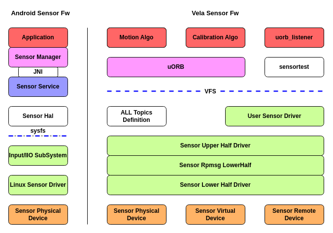

# Sensor 框架指南

[ [English](../../../../../en/device_dev_guide/driver/peripheral_driver/sensor/sensor_framework_guide.md) | 简体中文 ]

## 一、概述

传感器（Sensor）是物联网（IoT）系统的感知中枢，负责将物理世界的变化（如运动、光照、温度等）转换为数字信号。为了应对日益增长的传感器种类和由此带来的应用开发复杂性，一个统一、高效的软件框架至关重要。

## 二、架构演进

openvela Sensor 框架经历了从简单到复杂的演进过程，以适应不断变化的产品需求。

### 1、早期模型：原生字符设备

openvela 最初的 Sensor 驱动模型以简单交互的字符设备为主。应用程序通过标准的系统调用（`open`, `read`, `ioctl`）直接访问 `/dev/xxx` 设备节点来操作传感器。

这种模型的缺点在于将传感器管理的复杂性完全暴露给了上层应用。

### 2、Sensor 框架 2.0：分层与消息驱动

随着对低功耗、多核通信和标准化需求的提升，openvela 对 Sensor 框架进行了重大重构，形成了当前稳定、高效的 2.0 架构。

最新的 Sensor 框架（图右侧 **Vela Sensor Fw**）基于两大核心设计原则：**分层解耦**和**消息驱动**。它主要由 **Sensor 驱动栈**和 **uORB 中间件**两部分构成。

## 三、核心架构详解

最新的 Vela Sensor 软件架构主要由 **Sensor 驱动栈 (Driver Stack)** 和 **uORB 中间件 (Middleware)** 两部分组成，二者协同工作，实现了硬件与应用之间的分层解耦。

### 1、Sensor 驱动栈 (Driver Stack)

Sensor 驱动栈负责与物理硬件交互，并为上层提供统一的接口。为实现代码复用和逻辑分离，驱动栈被设计为 **Upper Half** 和 **Lower Half** 两层。

#### Upper Half Driver (通用层)

该层不直接与硬件交互，而是为所有 Sensor 驱动提供一套通用的框架和服务。其主要职责包括：

- **设备节点管理**：自动创建标准化的设备节点，如 `/dev/sensor/accel0`。
- **系统调用接口**：提供标准的 `file_operations` 集合，响应来自内核的请求。
- **资源管理**：通过引用计数实现多用户访问控制。
- **数据缓冲**：内置高效的环形缓冲区（Circular Buffer），用于缓存传感器事件。
- **高级功能**：管理 Batch 模式，并提供统一的 `ioctl` 控制接口。

#### Lower Half Driver (硬件适配层)

该层是真正的硬件驱动程序，由**驱动开发者**根据具体的传感器芯片实现。其核心职责是：

- **硬件交互**：通过 I2C/SPI 等总线配置和控制传感器硬件。
- **实现标准接口**：实现 `activate` (激活/去激活)、`set_interval` (设置采样率)、`batch` (配置批处理) 等标准回调函数。
- **数据采集与上报**：通过中断或轮询方式从硬件获取数据，并将其封装成 `sensor_event`，送入 Upper Half 的环形缓冲区。
- **多核通信支持 (Rpmsg Lower Half)**：作为一种特殊的 Lower Half，它实现了跨核的传感器数据通信。一个核心上的 CPU 可以透明地订阅另一个核心发布的 Topic，反之亦然，为多核异构系统提供了分布式传感能力。

### 2、uORB 中间件 (Middleware)

uORB 是连接驱动与应用的关键桥梁，它采用发布/订阅模型，并实现了对传感器的自动功耗管理。

- **发布/订阅模型**:

    - **应用层**: 应用程序不再直接访问设备节点，而是通过 uORB 提供的 API **订阅 (Subscribe)** 感兴趣的传感器主题 (Topic) 来获取数据。
    - **驱动层**: Sensor 驱动在初始化时，向 uORB **发布 (Advertise)** 相应的主题。

- **自动功耗管理**:

    - uORB 监控所有 Topic 的订阅状态。
    - 当一个 Topic **首次**被订阅时，uORB 会自动通过驱动框架调用底层驱动的 `activate` 函数来**开启**传感器。
    - 当一个 Topic 的**最后一个订阅者**取消订阅时，uORB 会自动调用 `activate` 函数**关闭**传感器，从而实现智能、高效的功耗管理。

为了帮助不同角色的开发人员高效地使用该框架，下面将分别从应用开发者和驱动开发者的视角进行阐述。
