# Arch Timer 驱动框架开发指南

\[ [English](../../../../../en/device_dev_guide/driver/timer_driver/timer/Arch_Timer.md) | 简体中文 \]

## 一、概述

本文主要介绍基于 Timer Driver 的 Arch Timer 驱动框架实现，以及相关接口的使用和具体实现说明。本文适用于以下场景：

- 应用开发者或测试人员：可以参考文档中的[测试实例](#七测试实例)进行开发或测试。
- 驱动开发者：可以参考[驱动适配实例](#五驱动适配实例)完成符合需求的驱动开发。

### 1、什么是 Arch Timer

Arch Timer 是基于 Timer Driver 实现的间隔定时器。它提供了一系列 timer 接口，供操作系统中的 `sched` 模块使用，同时支持以下两种工作模式：

- Tickless 模式：允许更灵活高效的系统调度。
- Tick 模式：提供固定时间间隔的调度机制。

Arch timer 在系统中的位置框架如下图所示：


### 2、Arch Timer 的驱动框架

Arch Timer 的整体架构和相关接口设计如下图所示。

- `upper-half` 部分：由 openvela 提供，其中 `up_timer_initialize` 接口需由芯片厂商实现。
- `lower-half` 部分：需芯片厂商进行适配。
- 应用程序可通过标准的 POSIX API 接口 或 `ioctl` 接口，调用 `upper-half` 或 `lower-half` 接口，完成相应功能。



## 二、Arch Timer 接口

`sched` 模块依赖于由 `arch` 模块提供的定时器接口，这些接口均定义在 `/include/nuttx/arch.h` 头文件中。

在 Tickless 模式下，这些接口根据时间单位的不同划分为两组：

- 基于微秒（`us`）的接口。
- 基于计时单元（`tick`）的接口。

开发者可以通过配置选项 `CONFIG_SCHED_TICKLESS_TICK_ARGUMENT` 来选择启用哪一种接口。为了减少 `sched` 和 `arch` 模块之间的时间单位转换，`arch timer` 默认支持 `tick` 接口，以确保运行效率。

以下对接口功能进行简要说明。

### Arch Timer 接口说明

1. `up_timer_set_lowerhalf`

    初始化 Arch Timer 定时器，设置一个 `timer_lowerhalf_s` 实例，并启动定时器。

    ```C
    void up_timer_set_lowerhalf(FAR struct timer_lowerhalf_s *lower)
    ```

2. `up_timer_tick_start`

    启动定时器，仅在 `Tickless` 模式下使用。该函数的参数为定时器的超时时间，单位为 `tick`。

    ```C
    int weak_function up_timer_tick_start(clock_t ticks)
    ```

3. `up_timer_tick_cancel`

    停止 Arch Timer 定时器，仅在 `Tickless` 模式中使用。执行时会返回定时器当前剩余的 `tick` 数。

    ```C
    int weak_function up_timer_tick_cancel(FAR clock_t *ticks)
    ```

4. `up_timer_getmask`

    获取定时器支持的时间掩码（`mask`）的值。

    ```C
    void weak_function up_timer_getmask(FAR clock_t *mask)
    ```

5. `up_timer_gettick`

    获取定时器当前已经经过的 `tick` 数值。

    ```C
    int weak_function up_timer_gettick(FAR clock_t *ticks)
    ```

6. `up_udelay`

    实现以微秒（`us`）为单位的延时操作，用于精确延时。

    ```C
    void weak_function up_udelay(useconds_t microseconds)
    ```

7. `up_mdelay`

    实现以毫秒（`ms`）为单位的延时操作，用于较长的延时需求。

    ```C
    void weak_function up_mdelay(unsigned int milliseconds)
    ```

## 三、Timer Driver 简介

openvela 提供了一个通用的定时器（Timer）驱动。该驱动依据 openvela 的驱动框架，分为两个层级：

- `upper half`： 为应用级别的程序提供 `timer` 的通用接口。此层已由 openvela 提供，应用开发者无需修改。
- `lower half`： 基于特定平台的驱动程序，用于实现硬件级别的控制和适配。此层是驱动开发者的重点工作对象。

Timer 驱动相关接口的定义可以在 `/include/nuttx/timers/timer.h` 文件中找到，接口同样分为 `upper half` 和 `lower half` 两层。

### 1、配置说明

在 **board** 适配时，需要配置以下三个关键选项来启用和调整 Timer Driver 功能。

#### 配置驱动

1. 启用 Timer Driver。 通过设置 `CONFIG_TIMER`，启用 Timer Driver 功能，使定时器驱动可用。
2. 使能 Arch Timer。 配置 `CONFIG_TIMER_ARCH` 选项以启用 `arch`` ``timer` 模块。该选项允许在体系结构层面支持架构相关的定时器功能。
3. 启用 Tickless 模式。 配置 `CONFIG_SCHED_TICKLESS` 可启用 Tickless 模式。

    - Tickless 模式的特点： 无周期性时钟中断。在没有任务执行时，系统进入空闲（Idle）模式，并在下一次任务执行或中断时恢复。

#### 配置文件路径

以下是 Tickless 模式下 Timer Driver 的相关配置文件路径：

1. 文件：`sched/Kconfig`

    ```Shell
    # sched/Kconfig
    config SCHED_TICKLESS
        depends on ARCH_HAVE_TICKLESS

    config SCHED_TICKLESS_TICK_ARGUMENT
    config SCHED_TICKLESS_LIMIT_MAX_SLEEP
    ```

2. 文件：`drivers/timers/Kconfig`

    ```Shell
    # drivers/timers/Kconfig
    config TIMER
    ......
    if TIMER
    config TIMER_ARCH
            select ARCH_HAVE_TICKLESS
            select ARCH_HAVE_TIMEKEEPING
            select SCHED_TICKLESS_LIMIT_MAX_SLEEP  if SCHED_TICKLESS
            select SCHED_TICKLESS_TICK_ARGUMENT  if SCHED_TICKLESS
    #endif
    ```

#### 配置检查命令

通过以下命令检查是否正确配置了相关选项，该命令会搜索 `nuttx` 配置文件中的以下选项，并验证是否已启用：

```Shell
grep -rE "CONFIG_TIMER|CONFIG_TIMER_ARCH|CONFIG_ARCH_HAVE_TICKLESS|CONFIG_ARCH_HAVE_TIMEKEEPING|CONFIG_SCHED_TICKLESS_TICK_ARGUMENT|CONFIG_SCHED_TICKLESS_LIMIT_MAX_SLEEP" nuttx/.config
```

### 2、初始化

在 **board** 初始化过程，需要调用具体 **Vendor** 实现的 `***_timer_initialize` 函数完成初始化。该函数会完成以下操作：

1. 分配并初始化 [struct timer_lowerhalf_s](../../../../../../../../nuttx/blob/dev-ai-contest-2026/include/nuttx/timers/timer.h) 结构实例。
2. 利用 [timer_register](../../../../../../../../nuttx/blob/dev-ai-contest-2026/drivers/timers/timer.c) 函数将 `timer_lowerhalf_s` 实例注册为 Timer 驱动。

    - 注册过程会生成 `/dev/timer` 设备节点。
    - 同时将 `struct file_operations` 和 `g_timerops` 实例绑定到 `timer_lowerhalf_s` 实例。

在平台代码中，需要实现 `up_timer_initialize` 函数，用于调用 `up_timer_set_lowerhalf` 函数，将 `***_timer_initialize` 返回的实例绑定到系统中，作为系统定时器。

相关接口定义在：[/include/nuttx/timers/timer.h](../../../../../../../../nuttx/blob/dev-ai-contest-2026/include/nuttx/timers/timer.h)。

#### `timer_register` 函数说明

以下是 `timer_register` 函数的详细说明，此函数将 `lower half` 的 Timer 驱动实例与 `upper half` 的 Timer 设备绑定，并注册设备以供应用程序使用。

```C
/****************************************************************************
 * Name: timer_register
 *
 * Description:
 *   This function binds an instance of a "lower half" timer driver with the
 *   "upper half" timer device and registers that device so that can be used
 *   by application code.
 *
 *   When this function is called, the "lower half" driver should be in the
 *   disabled state (as if the stop() method had already been called).
 *
 *   NOTE:  Normally, this function would not be called by application code.
 *   Rather it is called indirectly through the architecture-specific
 *   initialization.
 *
 * Input Parameters:
 *   dev path - The full path to the driver to be registered in the NuttX
 *     pseudo-filesystem.  The recommended convention is to name all timer
 *     drivers as "/dev/timer0", "/dev/timer1", etc.  where the driver
 *     path differs only in the "minor" number at the end of the device name.
 *   lower - A pointer to an instance of lower half timer driver.  This
 *     instance is bound to the timer driver and must persists as long as
 *     the driver persists.
 *
 * Returned Value:
 *   On success, a non-NULL handle is returned to the caller.  In the event
 *   of any failure, a NULL value is returned.
 *
 ****************************************************************************/

FAR void *timer_register(FAR const char *path,
                         FAR struct timer_lowerhalf_s *lower);
```

### 3、`upper-half` 接口

`upper-half` 接口为内核中的各个模块提供标准化的 Timer 功能，并支持以下模式：

- Tickless 模式：根据时间单位不同，接口分为两组：`struct timespec` 和 `tick` 接口。
- Tick 模式：默认支持 `tick` 接口，以减少 `sched` 和 `arch` 模块的时间转换工作。

开发者可以通过配置选项 `CONFIG_SCHED_TICKLESS_TICK_ARGUMENT` 以选择启用哪种接口。

`upper-half` 接口主要供 `sched` 调用。`sched` 所需的 Timer 接口定义可以在 `/include/nuttx/arch.h` 文件中找到，接口说明参见 [Arch Timer 接口](#二arch-timer-接口)。

### 4、`lower-half` 接口

`lower-half` 驱动通过提供标准化的 `struct timer_ops_s` 接口，供以下组件使用：

- `upper-half`
- `ioctl` 系统调用
- 其他驱动程序
- 内核模块

#### 接口分组

- `lower-half` 的接口根据时间单位分为两组：

    - 以 `struct timespec` 为单位。
    - 以 `tick` 为单位。

- 开发者根据所需的精度和性能需求选择实现其中一组接口。未被实现的接口已在 `timer.h` 头文件中提供默认实现。

#### 接口定义

以下是 [struct timer_ops_s](../../../../../../../../nuttx/blob/dev-ai-contest-2026/include/nuttx/timers/timer.h) 的详细定义：

```C
struct timer_ops_s
{
  /* Required methods *******************************************************/
  CODE int (*start)(FAR struct timer_lowerhalf_s *lower);
  CODE int (*stop)(FAR struct timer_lowerhalf_s *lower);
  CODE int (*getstatus)(FAR struct timer_lowerhalf_s *lower,
                        FAR struct timer_status_s *status);
  CODE int (*settimeout)(FAR struct timer_lowerhalf_s *lower,
                         uint32_t timeout);
  CODE void (*setcallback)(FAR struct timer_lowerhalf_s *lower,
                           CODE tccb_t callback, FAR void *arg);
  CODE int (*maxtimeout)(FAR struct timer_lowerhalf_s *lower,
                         FAR uint32_t *maxtimeout);
  CODE int (*ioctl)(FAR struct timer_lowerhalf_s *lower, int cmd,
                  unsigned long arg);
  CODE int (*tick_getstatus)(FAR struct timer_lowerhalf_s *lower,
                             FAR struct timer_status_s *status);
  CODE int (*tick_setttimeout)(FAR struct timer_lowerhalf_s *lower,
                               uint32_t timeout);
  CODE int (*tick_maxtimeout)(FAR struct timer_lowerhalf_s *lower,
                              FAR uint32_t *maxtimeout);
};
```

以下是部分接口的功能说明。

1. `TIMER_START`

    启动 Timer 定时器。传入的启动时间为相对时间。

    ```C
    /*
    * 函数：start
    * 参数：struct timer_lowerhalf_s *lower
    * 返回：
    * 说明：启动alarm定时器，只在Tickless模式使用，入参为alarm的超时时间，单位为tick，
    *      相对时间；
    */
    /* 以struct timespec为单位的接口 */
    CODE int (*start)(FAR struct timer_lowerhalf_s *lower);
    
    ```

2. `TIMER_STOP`

    停止 Timer 定时器。

    ```C
    /* 停止timer计时器 */ 
    CODE int (*stop)(FAR struct timer_lowerhalf_s *lower);
    ```

3. `TIMER_GETSTATUS/TIMER_TICK_GETSTATUS`

    获取 Timer 定时器的当前状态。接口以两种单位实现：

    - 微秒 (us)：

        ```C
        /* 以us为单位的接口 */ 
        CODE int (*getstatus)(FAR struct timer_lowerhalf_s *lower,
                                FAR struct timer_status_s *status);
        ```

    - `tick`

        ```C
        /* 以tick为单位的接口 */
        CODE int (*tick_getstatus)(FAR struct timer_lowerhalf_s *lower,
                                    FAR struct timer_status_s *status);
        ```

4. `TIMER_MAXTIMEOUT/TIMER_TICK_MAXTIMEOUT`

    获取 Timer 支持的最大超时时间。

    - 以微秒 (us) 为单位:

        ```C
        /* 以us为单位的接口 */ 
        CODE int (*maxtimeout)(FAR struct timer_lowerhalf_s *lower,
                                FAR uint32_t *maxtimeout);
        ```

    - 以 `tick` 为单位:

        ```C
        /* 以tick为单位的接口 */
        CODE int (*tick_maxtimeout)(FAR struct timer_lowerhalf_s *lower,
                                    FAR uint32_t *maxtimeout);
        ```

5. `TIMER_SETCALLBACK`

    设置 Timer 的超时回调函数。

    ```C++
    CODE void (*setcallback)(FAR struct timer_lowerhalf_s *lower,
                            CODE tccb_t callback, FAR void *arg);
    ```

6. `TIMER_IOCTL`

    `lower-half` 的 `ioctl` 接口，用于处理 `upper-half` 驱动未识别的命令。

    ```C++
    CODE int (*ioctl)(FAR struct timer_lowerhalf_s *lower, int cmd,
                    unsigned long arg);
    ```

`lower-half` 接口的实现请参见 [lower-half 接口实现](#2实现-lower-half-接口)。

## 四、调用流程说明

在 Tickless 模式和 Tick 模式下，Arch Timer 与其他模块的调用关系存在差异。具体如下所示。

### 1、Tickless 模式

#### 模式概述

在 Tickless 模式下：

- `sched`（调度模块）动态管理软件定时器（`wd`），选择当前最短时长的 `wd` 作为下一次超时的定时器时长。
- 具体实现中，`sched` 会根据当前 `wd` 的状态动态调用 `timer` 定时器的启动或停止函数。

#### 调用流程图

以下为 `Tickless` 模式下的调用流程图：


1. 初始化定时器。

    - 在系统初始化阶段，`arch timer` 完成初始化，同时调用 `up_timer_set_lowerhalf` 绑定定时器实例。

2. 计算超时。

    - `sched` 查询所有当前已注册的 `wd`，选择最短的超时时间作为下一次待执行的时间。

3. 配置定时器。

    - 调用 `TIMER_TICK_SETTIMEOUT` 设置新定时器超时时间。
    - 调用 `up_timer_tick_start` 启动定时器。

4. 触发超时回调。

    - 当定时器超时时，触发 `timer_callback` 回调函数，通知 `sched` 超时事件。

5. 后续调度。

    - `nxsched_resume_timer` 重新为定时器分配超时时长，并根据需要启动下一个定时器或任务。

### 2、Tick 模式

#### 模式概述

在 Tick 模式下：

- `sched` 启用一个固定时间间隔的周期性定时器（`arch timer`）。
- 定时器的时间间隔按照 `CONFIG_USEC_PER_TICK` 微秒配置，并随着系统工作周期而固定运行。
- 系统在初始化 `arch timer` 时即启动周期性定时器，无需频繁调用 `start` 和 `stop` 接口。

#### 流程描述

1. 定时器初始化。

    - `arch timer` 在初始化阶段直接启动周期性定时器，时间间隔为 `CONFIG_USEC_PER_TICK` 微秒。

2. 周期性触发。

    - 定时器按照固定周期触发事件，无需动态计算超时时间。
    - 减少了 `start` 和 `stop` 接口的调用频率。

3. 实时性保证。

    - 每次定时器超时，触发调度器进行调度，以满足周期性任务的执行需求。

## 五、驱动适配实例

以 `nrf52`（基于 ARMv7-M 架构）为例，`arch timer` 驱动适配主要包括两部分工作：

1. 实现初始化接口 `up_timer_initialize` 并注册 `timer_register`。
2. 实现 `lower-half` 接口以控制硬件运行。

以下将分别介绍这两部分的具体实现。

### 1、实现接口 `up_timer_initialize`

在初始化阶段，需调用 `up_timer_initialize` 和 `timer_register` 来完成定时器的注册。`timer_register` 接口已实现，开发者需要在平台特定代码中实现 `up_timer_initialize`。

#### 初始化调用流程

以下为定时器初始化的调用关系参考：

```Shell
nx_start
-> clock_initialize
   -> up_timer_initialize      #开发者实现
      -> systick_initialize    #开发者实现
         -> timer_register
      -> up_timer_set_lowerhalf
```

相关代码文件路径：`arch/arm/src/armv7-m/arm_systick.c`

#### 示例代码

以下为 `systick_initialize` 的实现参考：

```C
struct timer_lowerhalf_s *systick_initialize(bool coreclk,
                                             unsigned int freq, int minor)
{
  struct systick_lowerhalf_s *lower =
    (struct systick_lowerhalf_s *)&g_systick_lower;

  ...

  /* Register the timer driver if need */

  if (minor >= 0)
    {
      char devname[32];

      sprintf(devname, "/dev/timer%d", minor);
      timer_register(devname, (struct timer_lowerhalf_s *)lower);
    }

  return (struct timer_lowerhalf_s *)lower;
}
```

### 2、实现 `lower-half` 接口

`lower-half` 是实现硬件功能的驱动接口部分，开发者需要实现并定义各具体方法。以下为开发者需要关注的内容：

#### `lower-half` 方法

在 ARMv7-M 的 Arch Timer 适配中，`lower-half` 方法的出现形式如下：

文件路径： [arch/arm/src/armv7-m/arm_systick.c](../../../../../../../../nuttx/blob/dev-ai-contest-2026/arch/arm/src/armv7-m/arm_systick.c)

```C
/* "Lower half" driver methods */
static const struct timer_ops_s g_systick_ops =
{
  .start       = systick_start,
  .stop        = systick_stop,
  .getstatus   = systick_getstatus,
  .settimeout  = systick_settimeout,
  .setcallback = systick_setcallback,
  .maxtimeout  = systick_maxtimeout,
};
```

## 六、POSIX API 简介

本章节简要介绍定时器和时钟相关的 POSIX API 接口，开发者可参考这些接口进行定时器操作。接口的详细用法请参见[测试实例](#七测试实例)。

### 1、TIMER API

以下是定时相关 POSIX API 的简要概述，这些接口的具体使用方法请参考相关的 `man` 页面。

头文件位置：[include/time.h](../../../../../../../../nuttx/blob/dev-ai-contest-2026/include/time.h)

1. `timer_create`

    ```C
    /*
    * 函数：timer_create
    * 参数：clockid，定时类型；evp,sigevent结构体，用来指定定时器到期时如何相应
    *       timerid，返回一个timerid
    * 返回：0 success | -1 error
    * 说明：创建一个定时器
    */
    int timer_create(clockid_t clockid, FAR struct sigevent *evp,
                    FAR timer_t *timerid);
    ```

2. `timer_delete`

    ```C
    /*
    * 函数：timer_delete
    * 参数：timerid，执行timer_create返回的timerid
    * 返回：0 success | -1 error
    * 说明：删除一个定时器
    */
    int timer_delete(timer_t timerid);
    ```

3. `timer_settime`

    ```C
    /* 设置定时器
    * 函数：timer_settime
    * 参数：timerid：id
    *      flags：相对时间/绝对时间
    *      value：定时时间和间隔
    *      ovalue：若不为NULL，则返回上次定时的剩余到期时间 
    * 返回：0 success | -1 error
    * 说明：设置定时
    */
    int timer_settime(timer_t timerid, int flags,
                    FAR const struct itimerspec *value,
                    FAR struct itimerspec *ovalue);
    ```

4. `timer_gettime`

    ```C
    /*
    * 函数： timer_gettime
    * 参数： timerid：id
    *       value：传入itimerspec
    * 返回值：0 success | -1 error
    * 说明：  获取当前定时器的剩余到期时间
    * 
    */
    int timer_gettime(timer_t timerid, FAR struct itimerspec *value);
    ```

5. `timer_getoverrun`

    ```C
    /*
    * 函数：   up_timer_gettime
    * 参数：   timerid
    * 返回值： 定时器超时次数
    */
    int timer_getoverrun(timer_t timerid);
    ```

### 2、IOCTL 接口

应用级别的程序可以通过 `ioctl` 函数直接操作定时器（前提是在 `bringup` 过程中已注册 `/dev/timer` 设备节点）。

#### 支持的 IOCTL 命令

以下是当前支持的 IOCTL 命令，相关接口定义在 [include/nuttx/timers/timer.h](../../../../../../../../nuttx/blob/dev-ai-contest-2026/include/nuttx/timers/timer.h) 中：

- `TCIOC_START`：启动定时器。
- `TCIOC_STOP`：停止定时器。
- `TCIOC_GETSTATUS`：获取当前定时器的状态，参数类型为 `struct timer_status_s*`。
- `TCIOC_SETTIMEOUT`：设置定时器间隔时间，参数为 32 位的定时器时长，以微秒（us）为单位。
- `TCIOC_NOTIFICATION`：设置定时器超时消息，参数类型为 `struct timer_notify_s*`。
- `TCIOC_MAXTIMEOUT`：获取定时器最大时延，参数类型为 `uint32_t *`，单位为微秒（us）。

## 七、测试实例

本章介绍如何通过 IOCTL 接口 和 POSIX API 测试定时器的功能，使用开源测试框架 `cmocka` 进行验证，测试实例包括：

- API 测试
- IOCTL 接口测试

下面分别说明和展示代码实现。

### 1、TIMER API 测试实例

此部分介绍如何测试定时器相关功能，通过 `cmocka` 测试框架验证 POSIX API 的工作，包括创建、配置、以及删除定时器的全过程。

- 代码位置：`apps/testing/drivertest/drivertest_posix_timer.c`

- 测试框架：`cmocka`

- 依赖配置：

    - `TESTING_CMOCKA`
    - `TESTING_DRIVER_TEST`
    - `CONFIG_SIG_EVTHREAD`

- 运行步骤：

    1. 启用上述配置，并构建固件。

    2. 在 NuttShell（NSH）中运行以下命令：

        ```Bash
        nsh> cmocka_posix_timer
        ```

#### 测试说明

该实例通过定时器的 POSIX API 测试以下功能：

1. 定时器创建：测试 `timer_create` API，实现定时器的创建。
2. 定时器配置：测试 `timer_settime` 和 `timer_gettime` API，验证定时器的时间设置和获取。
3. 定时器触发：测试定时器使用期间的回调函数工作。
4. 定时器删除：通过 `timer_delete` 验证定时器资源是否正确释放。

下面是代码的具体说明，每一步均配有注释，便于理解。

#### 代码实现

该实例为 openvela 的嵌入式定时器测试提供了完整实用的参考代码，适用于驱动开发和功能验证的实际场景。以下是完整的测试代码：

```C
/****************************************************************************
 * Included Files
 ****************************************************************************/

#include <nuttx/config.h>
#include <stdio.h>
#include <signal.h>
#include <time.h>
#include <string.h>
#include <unistd.h>
#include <setjmp.h>
#include <cmocka.h>
#include <syslog.h>
#include <nuttx/timers/timer.h>

/****************************************************************************
 * Pre-processor Definitions
 ****************************************************************************/

#define DEFAULT_TIME_OUT   2
#define DEFAULT_INTERVAL   1
#define SLEEPSECONDS       5
#define COMEINCALLBACK     0

#define OPTARG_TO_VALUE(value, type, base)                            \
  do                                                                  \
    {                                                                 \
      FAR char *ptr;                                                  \
      value = (type)strtoul(optarg, &ptr, base);                      \
      if (*ptr != '\0')                                               \
        {                                                             \
          printf("Parameter error: -%c %s\n", ch, optarg);            \
          show_usage(argv[0], EXIT_FAILURE);                          \
        }                                                             \
    } while (0)

/****************************************************************************
 * Private Types
 ****************************************************************************/

struct posix_timer_state_s
{
  struct itimerspec it;
};

/****************************************************************************
 * Private Data
 ****************************************************************************/

/****************************************************************************
 * Private Functions
 ****************************************************************************/

/****************************************************************************
 * Name: show_usage
 ****************************************************************************/

static void show_usage(FAR const char *progname, int exitcode)
{
  printf("Usage: %s"
         " -s <seconds> -i <interval>\n",
         progname);

  exit(exitcode);
}

/****************************************************************************
 * Name: parse_commandline
 ****************************************************************************/

static void parse_commandline(
  FAR struct posix_timer_state_s *posix_timer_state,
  int argc, FAR char **argv)
{
  int ch;
  int converted;

  while ((ch = getopt(argc, argv, "s:i:")) != ERROR)
    {
      switch (ch)
        {
          case 's':
            OPTARG_TO_VALUE(converted, uint32_t, 10);
            if (converted < 1 || converted > INT_MAX)
              {
                printf("signal out of range: %d\n", converted);
                show_usage(argv[0], EXIT_FAILURE);
              }

            posix_timer_state->it.it_value.tv_sec = (uint32_t)converted;
            break;

          case 'i':
            OPTARG_TO_VALUE(converted, uint32_t, 10);
            if (converted < 1 || converted > INT_MAX)
              {
                printf("signal out of range: %d\n", converted);
                show_usage(argv[0], EXIT_FAILURE);
              }

            posix_timer_state->it.it_interval.tv_sec = (uint32_t)converted;
            break;

          case '?':
            printf("Unsupported option: %s\n", optarg);
            show_usage(argv[0], EXIT_FAILURE);
            break;
        }
    }
}

/****************************************************************************
 * Name: posix_timer_callback
 ****************************************************************************/

static void posix_timer_callback(union sigval unused)
{
  syslog(LOG_DEBUG, "callback trigger!!!\n");
}

/****************************************************************************
 * Name: test_case_posix_timer
 ****************************************************************************/

static void test_case_posix_timer(FAR void **state)
{
  int ret;
  timer_t timerid;
  struct sigevent event;
  FAR struct posix_timer_state_s *posix_timer_state;
  struct itimerspec it;

  memset(&it, 0, sizeof(it));
  posix_timer_state = (FAR struct posix_timer_state_s *)*state;

  event.sigev_notify = SIGEV_THREAD;
  event.sigev_notify_function = posix_timer_callback;
  event.sigev_notify_attributes = NULL;

  /* Create the timer */

  ret = timer_create(CLOCK_MONOTONIC, &event, &timerid);
  assert_return_code(ret, OK);

  /* Start the timer */

  ret = timer_settime(timerid, 0, &(posix_timer_state->it), NULL);
  assert_return_code(ret, OK);

  /* Get the timer status */

  ret = timer_gettime(timerid, &it);
  assert_return_code(ret, OK);
  assert_in_range(it.it_value.tv_sec, 0,
                  posix_timer_state->it.it_value.tv_sec);
  assert_return_code(it.it_interval.tv_sec,
                     posix_timer_state->it.it_interval.tv_sec);

  sleep(SLEEPSECONDS);

  /* Delete the timer */

  ret = timer_delete(timerid);
  assert_return_code(ret, OK);
}

int main(int argc, FAR char *argv[])
{
  struct posix_timer_state_s posix_timer_state =
  {
    .it.it_value.tv_sec     = DEFAULT_TIME_OUT,
    .it.it_value.tv_nsec    = 0,
    .it.it_interval.tv_sec  = DEFAULT_INTERVAL,
    .it.it_interval.tv_nsec = 0
  };

  const struct CMUnitTest tests[] =
  {
    cmocka_unit_test_prestate(test_case_posix_timer, &posix_timer_state)
  };

  parse_commandline(&posix_timer_state, argc, argv);

  return cmocka_run_group_tests(tests, NULL, NULL);
}
```

### 2、IOCTL 测试实例

本章介绍如何通过 IOCTL 接口测试定时器功能，测试代码使用了开源框架 `cmocka`。

- 代码路径：`apps/testing/drivertest/drivertest_timer.c`

- 测试框架：`cmocka`

- 依赖配置：

    - `TESTING_CMOCKA`
    - `TESTING_DRIVER_TEST`

- 测试步骤：

    1. 启用依赖配置，并构建功能完整的固件。
    2. 在 NuttShell（NSH）中运行以下命令：

        ```Bash
        nsh> cmocka_driver_timer
        ```

#### 测试说明

通过 IOCTL 接口的命令控制定时器设备（如 `/dev/timerX`），实现如下功能：

1. 启动定时器：通过 `TCIOC_START` 控制指令启动定时器。
2. 停止定时器：通过 `TCIOC_STOP` 控制指令停止定时器。
3. 设置定时器间隔：使用 `TCIOC_SETTIMEOUT` 动态调整触发间隔。
4. 注册回调：通过 `TCIOC_NOTIFICATION` 注册定时器超时后的 SIG 动作。
5. 校验时间间隔准确性：通过对时间戳的采样和校验，验证定时器的时间精度。

#### 代码实现

以下是实现上述功能的核心代码及其说明。

```C
/****************************************************************************
 * Included Files
 ****************************************************************************/

#include <nuttx/config.h>

#include <sys/ioctl.h>
#include <stdio.h>
#include <stdlib.h>
#include <unistd.h>
#include <fcntl.h>
#include <signal.h>
#include <errno.h>
#include <string.h>

#include <stdarg.h>
#include <stddef.h>
#include <setjmp.h>
#include <stdint.h>
#include <cmocka.h>

#include <nuttx/timers/timer.h>

/****************************************************************************
 * Pre-processor Definitions
 ****************************************************************************/

#define TIMER_DEFAULT_DEVPATH "/dev/timer0"
#define TIMER_DEFAULT_INTERVAL 1000000
#define TIMER_DEFAULT_NSAMPLES 20
#define TIMER_DEFAULT_SIGNO 17
#define TIMER_DEFAULT_RANGE 1

#define OPTARG_TO_VALUE(value, type, base)                            \
  do                                                                  \
    {                                                                 \
      FAR char *ptr;                                                  \
      value = (type)strtoul(optarg, &ptr, base);                      \
      if (*ptr != '\0')                                               \
        {                                                             \
          printf("Parameter error: -%c %s\n", ch, optarg);            \
          show_usage(argv[0], timer_state, EXIT_FAILURE);             \
        }                                                             \
    } while (0)

/****************************************************************************
 * Private Types
 ****************************************************************************/

struct timer_state_s
{
  char devpath[PATH_MAX];
  uint32_t interval;
  uint32_t nsamples;
  uint32_t signo;
  uint32_t range;
};

/****************************************************************************
 * Private Data
 ****************************************************************************/

/****************************************************************************
 * Private Functions
 ****************************************************************************/

/****************************************************************************
 * Name: get_timestamp
 ****************************************************************************/

static uint32_t get_timestamp(void)
{
  struct timespec ts;
  uint32_t ms;
  clock_gettime(CLOCK_MONOTONIC, &ts);
  ms = ts.tv_sec * 1000 + ts.tv_nsec / 1000000;
  return ms;
}

/****************************************************************************
 * Name: show_usage
 ****************************************************************************/

static void show_usage(FAR const char *progname,
                       FAR struct timer_state_s *timer_state, int exitcode)
{
  printf("Usage: %s"
         " -d <devpath> -i <interval> -n <nsamples> -r <range> -s <signo>\n",
         progname);
  printf("  [-d devpath] selects the TIMER device.\n"
         "  Default: %s Current: %s\n",
         TIMER_DEFAULT_DEVPATH, timer_state->devpath);
  printf("  [-i interval] timer interval in microseconds.\n"
         "  Default: %d Current: %" PRIu32 "\n",
         TIMER_DEFAULT_INTERVAL, timer_state->interval);
  printf("  [-n nsamples] timer samples will be collected numbers.\n"
         "  Default: %d Current: %" PRIu32 "\n",
         TIMER_DEFAULT_NSAMPLES, timer_state->nsamples);
  printf("  [-r range] the max range of timer delay.\n"
         "  Default: %d Current: %" PRIu32 "\n",
         TIMER_DEFAULT_RANGE, timer_state->range);
  printf("  [-s signo] used to notify the test of timer expiration events.\n"
         "  Default: %d Current: %" PRIu32 "\n",
         TIMER_DEFAULT_SIGNO, timer_state->signo);
  printf("  [-h] = Shows this message and exits\n");

  exit(exitcode);
}

/****************************************************************************
 * Name: parse_commandline
 ****************************************************************************/

static void parse_commandline(FAR struct timer_state_s *timer_state,
                              int argc, FAR char **argv)
{
  int ch;
  int converted;

  while ((ch = getopt(argc, argv, "d:i:n:r:s:h")) != ERROR)
    {
      switch (ch)
        {
          case 'd':
            strncpy(timer_state->devpath, optarg,
                    sizeof(timer_state->devpath));
            timer_state->devpath[sizeof(timer_state->devpath) - 1] = '\0';
            break;

          case 'i':
            OPTARG_TO_VALUE(converted, uint32_t, 10);
            if (converted < 1 || converted > INT_MAX)
              {
                printf("signal out of range: %d\n", converted);
                show_usage(argv[0], timer_state, EXIT_FAILURE);
              }

            timer_state->interval = (uint32_t)converted;
            break;

          case 'n':
            OPTARG_TO_VALUE(converted, uint32_t, 10);
            if (converted < 1 || converted > INT_MAX)
              {
                printf("signal out of range: %d\n", converted);
                show_usage(argv[0], timer_state, EXIT_FAILURE);
              }

            timer_state->nsamples = (uint32_t)converted;
            break;

          case 'r':
            OPTARG_TO_VALUE(converted, uint32_t, 10);
            if (converted < 1 || converted > INT_MAX)
              {
                printf("signal out of range: %d\n", converted);
                show_usage(argv[0], timer_state, EXIT_FAILURE);
              }

            timer_state->range = (uint32_t)converted;
            break;

          case 's':
            OPTARG_TO_VALUE(converted, uint32_t, 10);
            if (converted < 1 || converted > INT_MAX)
              {
                printf("signal out of range: %d\n", converted);
                show_usage(argv[0], timer_state, EXIT_FAILURE);
              }

            timer_state->signo = (uint32_t)converted;
            break;

          case '?':
            printf("Unsupported option: %s\n", optarg);
            show_usage(argv[0], timer_state, EXIT_FAILURE);
            break;
        }
    }
}

/****************************************************************************
 * Name: test_case_timer
 ****************************************************************************/

static void test_case_timer(FAR void **state)
{
  int i;
  int fd;
  int ret;
  uint32_t range;
  uint32_t tim;
  struct sigaction act;
  struct timer_notify_s notify;
  FAR struct timer_state_s *timer_state;

  timer_state = (FAR struct timer_state_s *)*state;

  /* Open the timer device */

  fd = open(timer_state->devpath, O_RDONLY);
  assert_true(fd > 0);

  /* Show the timer status before setting the timer interval */

  ret = ioctl(fd, TCIOC_SETTIMEOUT, timer_state->interval);
  assert_return_code(ret, OK);

  act.sa_sigaction = NULL;
  act.sa_flags     = SA_SIGINFO;
  sigfillset(&act.sa_mask);
  sigdelset(&act.sa_mask, timer_state->signo);

  ret = sigaction(timer_state->signo, &act, NULL);
  assert_in_range(ret, 0, timer_state->signo);

  /* Register a callback for notifications using the configured signal.
   * NOTE: If no callback is attached, the timer stop at the first interrupt.
   */

  notify.pid      = getpid();
  notify.periodic = true;
  notify.event.sigev_notify = SIGEV_SIGNAL;
  notify.event.sigev_signo  = timer_state->signo;
  notify.event.sigev_value.sival_ptr = NULL;

  ret = ioctl(fd, TCIOC_NOTIFICATION, (unsigned long)((uintptr_t)&notify));
  assert_return_code(ret, OK);

  /* Start the timer */

  ret = ioctl(fd, TCIOC_START, 0);
  assert_return_code(ret, OK);

  /* Set the timer interval */

  for (i = 0; i < timer_state->nsamples; i++)
    {
      tim = get_timestamp();
      usleep(2 * timer_state->interval);
      tim = get_timestamp() - tim;
      range = abs(timer_state->interval / 1000 - tim);
      assert_in_range(range, 0, timer_state->range);
    }

  /* Stop the timer */

  ret = ioctl(fd, TCIOC_STOP, 0);
  assert_return_code(ret, OK);

  /* Detach the signal handler */

  act.sa_handler = SIG_DFL;
  sigaction(timer_state->signo, &act, NULL);

  /* Close the timer driver */

  close(fd);
}

/****************************************************************************
 * Public Functions
 ****************************************************************************/

/****************************************************************************
 * Name: drivertest_timer_main
 ****************************************************************************/

int main(int argc, FAR char *argv[])
{
  struct timer_state_s timer_state =
  {
    .devpath = TIMER_DEFAULT_DEVPATH,
    .interval = TIMER_DEFAULT_INTERVAL,
    .nsamples = TIMER_DEFAULT_NSAMPLES,
    .range = TIMER_DEFAULT_RANGE,
    .signo = TIMER_DEFAULT_SIGNO
  };

  parse_commandline(&timer_state, argc, argv);

  const struct CMUnitTest tests[] =
  {
    cmocka_unit_test_prestate(test_case_timer, &timer_state)
  };

  return cmocka_run_group_tests(tests, NULL, NULL);
}
```
