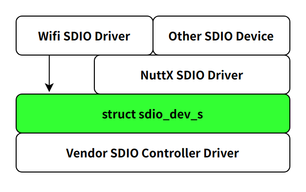

# 块设备驱动开发指南

## 一、概述

本文档指导开发者如何为 `openvela` 系统适配块设备，重点以通过 SDIO 总线接口连接的 eMMC 或 SD 卡为例。您将学习如何实现 SDIO 驱动的下半部，并将其与通用的 `mmcsd` 块设备驱动上半部进行绑定。

### 1、前提条件

在开始之前，请确保您已经熟悉 `openvela` 的存储驱动框架。建议您先阅读 [openvela 存储驱动框架指南](./storage_driver_framework_guide.md)。

### 2、架构概览

`openvela` 通过分层架构来支持 eMMC/SD 卡：

1. **块设备驱动上半部 (`mmcsd`)**：实现了与 eMMC/SD 卡协议相关的所有通用逻辑，如卡识别、初始化、命令收发等。此部分由 `openvela` 提供。
2. **SDIO 驱动下半部**：负责与具体的 SDIO 主机控制器硬件交互。**这是芯片或板卡供应商(Vendor) 需要实现的部分**。

您的核心任务是实现 `struct sdio_dev_s` 接口，作为连接上层 `mmcsd` 和底层硬件的桥梁。


### 3、核心数据结构

- **`struct sdio_dev_s`**: 定义了 SDIO 主机控制器的底层操作。
- **`struct block_operations`**: 定义了标准的块设备操作接口，由 `mmcsd` 上半部实现，您只需调用 `register_blockdriver` 注册即可。

## 二、块设备驱动开发流程

开发基于 SDIO 的块设备驱动，通常遵循以下步骤：

1. **实现 SDIO 控制器接口**：根据硬件手册，编写 `reset`, `sendcmd`, `recvsetup`, `dmasendsetup` 等函数的具体实现。
2. **实例化 `sdio_dev_s`**：定义一个静态的 `sdio_dev_s` 结构体变量，并将上一步实现的函数指针赋值给它。
3. **提供 SDIO 初始化函数**：编写一个全局的初始化函数（如 `my_chip_sdio_initialize()`），该函数返回已实例化的 `sdio_dev_s` 结构体指针。
4. **绑定 `mmcsd` 与 SDIO** **驱动**：在板级初始化代码中，调用 `mmcsd_slotinitialize()`，将您的 SDIO 驱动实例与 `mmcsd` 上半部驱动绑定。此函数会自动完成卡的初始化并调用 `register_blockdriver` 注册块设备节点（如 `/dev/mmcsd0`）。

## 三、实现 SDIO 下半部接口

您需要提供一个 `struct sdio_dev_s` 的实例。软件分层如下：



以下是其中一些关键接口的说明：

```C
// 定义于 nuttx/include/nuttx/sdio.h
struct sdio_dev_s {
  /* 互斥访问 */
  int (*lock)(FAR struct sdio_dev_s *dev, bool lock);

  /* 初始化与配置 */
  void (*reset)(FAR struct sdio_dev_s *dev);
  sdio_capset_t (*capabilities)(FAR struct sdio_dev_s *dev);
  void (*widebus)(FAR struct sdio_dev_s *dev, bool enable); // 设置总线宽度
  void (*clock)(FAR struct sdio_dev_s *dev, enum sdio_clock_e rate); // 设置时钟
  int (*attach)(FAR struct sdio_dev_s *dev); // 挂载中断

  /* 命令与数据传输 */
  int (*sendcmd)(FAR struct sdio_dev_s *dev, uint32_t cmd, uint32_t arg);
  int (*recv_r1)(FAR struct sdio_dev_s *dev, uint32_t cmd, uint32_t *r1);
  // ... 其他响应接收函数 (R2-R7)
  
  /* 非 DMA 数据传输设置 */
  int (*recvsetup)(FAR struct sdio_dev_s *dev, FAR uint8_t *buffer, size_t nbytes);
  int (*sendsetup)(FAR struct sdio_dev_s *dev, FAR const uint8_t *buffer, size_t nbytes);
  
  /* DMA 数据传输设置 (如果支持) */
#ifdef CONFIG_SDIO_DMA
  int (*dmarecvsetup)(FAR struct sdio_dev_s *dev, FAR uint8_t *buffer, size_t buflen);
  int (*dmasendsetup)(FAR struct sdio_dev_s *dev, FAR const uint8_t *buffer, size_t buflen);
#endif

  // ... 其他事件与回调接口
};
```

#### **关键接口实现要点：**

- **`capabilities`**: 返回您的 SDIO 控制器支持的特性，如是否支持 4-bit/8-bit 模式、是否支持 DMA 等。
- **`status`**: 返回卡的状态，最重要的是 `SDIO_STATUS_PRESENT` (卡是否插入)。
- **`sendcmd`/`recv_r\*`**: 实现向卡发送命令和接收响应的底层逻辑。
- **`*setup` 函数**: 这些函数用于准备数据传输。例如，`dmarecvsetup` 应该配置好 DMA 控制器，准备从 SDIO 接口接收数据到指定 `buffer`。实际的数据传输由 `mmcsd` 上半部通过 `sdio_io_rw_extended` 等接口触发。

## 四、绑定与注册

完成 `sdio_dev_s` 的实现和实例化后，最后一步是在板级初始化代码中将其与 `mmcsd` 绑定。

```C
// 引用自 nuttx/boards/arm/sama5/sama5d3-xplained/src/sam_mmcsd.c 的典型实现
#include <nuttx/sdio.h>
#include <nuttx/mmcsd.h>

int my_board_mmcsd_init(void)
{
  FAR struct sdio_dev_s *sdio;
  int ret;
  
  // 1. 获取您实现的 SDIO 下半部驱动实例
  //    (假设 my_chip_sdio_initialize(0) 初始化第 0 个 SDIO 接口)
  sdio = my_chip_sdio_initialize(0);
  if (!sdio) {
    // 错误处理
    return -ENODEV;
  }
  
  // 2. 将 SDIO 实例与 mmcsd 上半部绑定
  //    (假设将此卡注册为次设备号 0, 即 /dev/mmcsd0)
  ret = mmcsd_slotinitialize(0, sdio);
  if (ret != OK) {
    // 错误处理
    return ret;
  }
  
  // 3. (可选) 配置卡检测中断
  // ...
  
  return OK;
}
```

`mmcsd_slotinitialize()` 会完成所有后续工作，包括：

- 与 SD 卡进行通信，完成初始化序列。
- 获取卡的几何信息（扇区大小、数量等）。
- 调用 `register_blockdriver()` 将其注册为块设备。

## 五、测试与验证

`openvela` 提供了丰富的测试工具来验证您的块设备驱动：

- **fstest**：一个综合性的文件系统压力测试工具。您可以先在 `/dev/mmcsd0` 上创建文件系统（如 `mkfatfs`），然后将其挂载并使用 `fstest` 进行测试。
- **cmocka_block_test**：可以直接对 `/dev/mmcsd0` 设备节点进行底层的块读写测试，用于验证 `read` 和 `write` 接口的正确性和性能。

请参考相关测试工具的文档，对您的驱动进行充分验证。

- [fstest]()
- [blktest]()