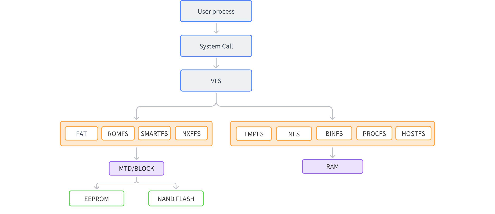

# 文件系统

\[ [English](../../../en/device_dev_guide/file_system/file_system.md) | 简体中文 \]

## 一、概述

文件系统是一种用于组织存储设备上数据和元数据的机制，是操作系统管理持久性数据的核心子系统，提供数据存储和访问功能。

将文件系统与存储设备关联的过程称为挂载（mount）。挂载时，文件系统会附加到当前文件系统的层次结构中（通常是根目录）。执行挂载操作时，需要指定以下内容：

1. 文件系统类型
2. 文件系统本身
3. 挂载点

### 1、文件系统介绍

openvela 提供了一个可选的、可扩展的文件系统。值得注意的是，openvela 并不依赖任何文件系统的存在，因此该文件系统可以完全省略。

#### 伪根文件系统

通过将 `CONFIG_NFILE_DESCRIPTORS` 设置为非零值，可以启用内存中的伪文件系统。

伪文件系统是一种内存文件系统，不需要任何存储介质或块驱动程序的支持。其内容通过标准文件系统操作（如 `open`、`close`、`read`、`write` 等）实时生成，因此被称为伪文件系统（类似于 Linux 的 `/proc` 伪文件系统）。

伪文件系统的特点包括：

- 支持访问用户提供的任意数据并执行相关逻辑。
- 支持将字符设备驱动和块设备驱动节点嵌入到伪文件系统的任意目录中。按照惯例，这些节点通常放置在 `/dev` 目录下。

#### 文件系统挂载

伪文件系统可以通过挂载块设备来扩展，从而支持大容量存储设备，实现真正的文件系统访问。

openvela 支持标准的 `mount()` 命令，该命令允许将块驱动程序绑定到伪文件系统中的挂载点。目前，openvela 主要支持以下文件系统：

- EXFAT
- ROMFS
- LITTLEFS
- TMPFS
- NXFFS

#### 与 Linux 的比较

从编程角度来看，openvela 的文件系统与 Linux 文件系统非常相似，但存在一个根本区别：

- openvela 的根文件系统是伪文件系统，真正的文件系统可以挂载到伪文件系统中。
- Linux 的根文件系统通常是一个真正的文件系统，伪文件系统则挂载在真正的根文件系统中。

这种设计使 openvela 能够支持从资源受限的小型嵌入式平台到具有一定计算能力的中型设备平台，提供更好的可扩展性。

### 2、文件描述符（fd）与任务创建的关系

在 openvela 中，不同任务创建方式对文件描述符（fd）的处理方式如下：

- `pthread_create`

    - 新任务不会创建新的任务组（group）。
    - 不会复制文件描述符（fd），直接使用父任务组的 fd 列表。

- `kthread_create`

    - 新任务不会创建新的任务组（group）。
    - 不会复制文件描述符（fd），使用内核公共的 fd 列表，即 `g_kthread_group` 的 fd 列表。

- `task_create`

    - 新任务会创建新的任务组（group）。
    - 会复制父任务的文件描述符（fd）列表。

## 二、数据结构

### 1、`struct inode`

`inode` 是文件系统中最重要的数据结构之一，用于存储文件的基本信息。其定义如下：

```C
struct inode
{
  FAR struct inode *i_peer;     /* Link to same level inode */
  FAR struct inode *i_child;    /* Link to lower level inode */
  int16_t           i_crefs;    /* References to inode */
  uint16_t          i_flags;    /* Flags for inode */
  union inode_ops_u u;          /* Inode operations */
#ifdef CONFIG_FILE_MODE
  mode_t            i_mode;     /* Access mode flags */
#endif
  FAR void         *i_private;  /* Per inode driver private data */
  char              i_name[1];  /* Name of inode (variable) */
};
```

字段说明

- `i_peer` 和 `i_child`

    这两个字段将 `inode` 组织成树状结构，便于管理和访问。

- `i_flags`

    包含标志位，用于标识文件类型及其他状态。例如：

    - `Character driver`
    - `Block driver`
    - `Mount point`
    - `Special OS type`
    - `Named semaphore`
    - `Message Queue`
    - `Shared memory region`
    - `Soft link`

- `i_private`

    在驱动程序中，通常用于存放私有数据。

- `union inode_ops_u u`

    存储对 `inode` 的操作函数集合。针对不同类型的 `inode`，该字段包含不同的操作函数。

#### `union inode_ops_u`

`union inode_ops_u` 是 `inode` 的操作集合，用于为不同类型的文件系统和设备提供统一的操作接口。它通过函数指针的方式定义了一组操作函数，支持文件操作、块设备操作、挂载点操作以及特殊资源管理。其定义如下：

```C
union inode_ops_u
{
  FAR const struct file_operations     *i_ops;    /* Driver operations for inode */
#ifndef CONFIG_DISABLE_MOUNTPOINT
  FAR const struct block_operations    *i_bops;   /* Block driver operations */
  FAR struct mtd_dev_s                 *i_mtd;    /* MTD device driver */
  FAR const struct mountpt_operations  *i_mops;   /* Operations on a mountpoint */
#endif
#ifdef CONFIG_FS_NAMED_SEMAPHORES
  FAR struct nsem_inode_s              *i_nsem;   /* Named semaphore */
#endif
#ifdef CONFIG_PSEUDOFS_SOFTLINKS
  FAR char                             *i_link;   /* Full path to link target */
#endif
};
```

主要有四个操作函数集，另外 VFS（虚拟文件系统）维护了如 `Named semaphores` 这类特殊资源，这些资源不像其他类型的文件有对应的函数操作集，属于特殊情况，它们相关的处理逻辑也被整合到这个结构中。

`union inode_ops_u` 主要包含以下几类操作函数集：

##### `struct file_operations`

`struct file_operations` 是用于存储驱动程序的操作函数集合。开发者在实现驱动程序时，需要根据具体需求实现该结构体中的函数操作。

```C
struct file_operations
{
  /* The device driver open method differs from the mountpoint open method */

  int     (*open)(FAR struct file *filep);

  /* The following methods must be identical in signature and position because
   * the struct file_operations and struct mountp_operations are treated like
   * unions.
   */

  int     (*close)(FAR struct file *filep);
  ssize_t (*read)(FAR struct file *filep, FAR char *buffer, size_t buflen);
  ssize_t (*write)(FAR struct file *filep, FAR const char *buffer, size_t buflen);
  off_t   (*seek)(FAR struct file *filep, off_t offset, int whence);
  int     (*ioctl)(FAR struct file *filep, int cmd, unsigned long arg);

  /* The two structures need not be common after this point */

#ifndef CONFIG_DISABLE_POLL
  int     (*poll)(FAR struct file *filep, struct pollfd *fds, bool setup);
#endif
#ifndef CONFIG_DISABLE_PSEUDOFS_OPERATIONS
  int     (*unlink)(FAR struct inode *inode);
#endif
};
```

##### `struct block_operations`

`struct block_operations` 是块设备驱动的操作集合，为文件系统与块设备之间的交互提供了标准化的接口。通过这些接口，文件系统可以正确地访问块设备。

`struct block_operations` 提供以下常见操作：

- 读操作：从块设备中读取数据。

- 写操作：向块设备中写入数据。

- 同步操作：将缓存中的数据同步到块设备，确保数据一致性。

这些操作接口的设计使文件系统能够高效、可靠地与底层块设备协作。

```C
struct block_operations
{
  int     (*open)(FAR struct inode *inode);
  int     (*close)(FAR struct inode *inode);
  ssize_t (*read)(FAR struct inode *inode, FAR unsigned char *buffer,
            size_t start_sector, unsigned int nsectors);
  ssize_t (*write)(FAR struct inode *inode, FAR const unsigned char *buffer,
            size_t start_sector, unsigned int nsectors);
  int     (*geometry)(FAR struct inode *inode, FAR struct geometry *geometry);
  int     (*ioctl)(FAR struct inode *inode, int cmd, unsigned long arg);
#ifndef CONFIG_DISABLE_PSEUDOFS_OPERATIONS
  int     (*unlink)(FAR struct inode *inode);
#endif
};
```

##### `struct mountpt_operations`

`struct mountpt_operations` 是挂载点的操作集合，为文件系统与挂载点之间的交互提供了标准化接口。通过该结构，文件系统可以在挂载点上实现正常的文件操作和管理功能。

```C
struct inode;
struct fs_dirent_s;
struct stat;
struct statfs;
struct mountpt_operations
{
  /* The mountpoint open method differs from the driver open method
   * because it receives (1) the inode that contains the mountpoint
   * private data, (2) the relative path into the mountpoint, and (3)
   * information to manage privileges.
   */

  int     (*open)(FAR struct file *filep, FAR const char *relpath,
            int oflags, mode_t mode);

  /* The following methods must be identical in signature and position
   * because the struct file_operations and struct mountp_operations are
   * treated like unions.
   */

  int     (*close)(FAR struct file *filep);
  ssize_t (*read)(FAR struct file *filep, FAR char *buffer, size_t buflen);
  ssize_t (*write)(FAR struct file *filep, FAR const char *buffer,
            size_t buflen);
  off_t   (*seek)(FAR struct file *filep, off_t offset, int whence);
  int     (*ioctl)(FAR struct file *filep, int cmd, unsigned long arg);

  /* The two structures need not be common after this point. The following
   * are extended methods needed to deal with the unique needs of mounted
   * file systems.
   *
   * Additional open-file-specific mountpoint operations:
   */

  int     (*sync)(FAR struct file *filep);
  int     (*dup)(FAR const struct file *oldp, FAR struct file *newp);
  int     (*fstat)(FAR const struct file *filep, FAR struct stat *buf);

  /* Directory operations */

  int     (*opendir)(FAR struct inode *mountpt, FAR const char *relpath,
            FAR struct fs_dirent_s *dir);
  int     (*closedir)(FAR struct inode *mountpt,
            FAR struct fs_dirent_s *dir);
  int     (*readdir)(FAR struct inode *mountpt,
            FAR struct fs_dirent_s *dir);
  int     (*rewinddir)(FAR struct inode *mountpt,
            FAR struct fs_dirent_s *dir);

  /* General volume-related mountpoint operations: */

  int     (*bind)(FAR struct inode *blkdriver, FAR const void *data,
            FAR void **handle);
  int     (*unbind)(FAR void *handle, FAR struct inode **blkdriver,
            unsigned int flags);
  int     (*statfs)(FAR struct inode *mountpt, FAR struct statfs *buf);

  /* Operations on paths */

  int     (*unlink)(FAR struct inode *mountpt, FAR const char *relpath);
  int     (*mkdir)(FAR struct inode *mountpt, FAR const char *relpath,
            mode_t mode);
  int     (*rmdir)(FAR struct inode *mountpt, FAR const char *relpath);
  int     (*rename)(FAR struct inode *mountpt, FAR const char *oldrelpath,
            FAR const char *newrelpath);
  int     (*stat)(FAR struct inode *mountpt, FAR const char *relpath,
            FAR struct stat *buf);

  /* NOTE:  More operations will be needed here to support:  disk usage
   * stats file stat(), file attributes, file truncation, etc.
   */
};
```

### 2、`struct file`  

当一个文件被打开时，系统会为其分配一个 `struct file` 结构。该结构在文件打开期间代表该文件，用于管理和跟踪文件的当前状态。`struct file` 包含指向对应 `inode` 的指针，以及其他与文件操作相关的信息。

#### 结构定义

```C
struct file
{
  int               f_oflags;   /* Open mode flags */
  off_t             f_pos;      /* File position */
  FAR struct inode *f_inode;    /* Driver or file system interface */
  void             *f_priv;     /* Per file driver private data */
};
```

#### 文件管理与`struct filelist`

在每个进程中，`struct tcb_s` 结构包含一个 `struct filelist` 结构，用于维护该进程已打开的文件。`struct filelist` 的主要作用是通过文件数组存储进程打开的文件对应的 `struct file` 结构信息。

```C
struct filelist
{
  sem_t   fl_sem;               /* Manage access to the file list */
  struct file fl_files[CONFIG_NFILE_DESCRIPTORS];
}
```

#### 文件描述符与文件操作

当一个进程调用 POSIX 标准的 `open()` 接口打开文件时，系统会为该文件分配一个唯一的文件描述符。文件描述符是 `struct filelist` 中文件数组的索引值，用于标识进程已打开的文件。

通过文件描述符，进程可以方便地访问和操作对应的文件。系统会根据文件描述符找到对应的 `struct file` 结构，从而完成文件的读写、关闭等操作。

## 三、原理分析

文件系统的架构和挂载流程是操作系统中文件管理的核心部分。以下内容从架构框架和挂载流程两个方面进行详细分析。

### 1、框架分析

架构图如下所示：



#### 用户层

- 功能：用户层是文件系统的入口，应用程序通过系统调用与文件系统交互。
- 特点：用户可以在该层发起文件操作请求，例如文件的打开、读写和关闭等。
- 作用：通过调用标准接口，用户层将操作请求传递给下层的VFS（Virtual File System）。

#### VFS层

- 功能：VFS 层是文件系统的适配层，屏蔽了底层文件系统的差异，为用户层提供统一的文件操作接口。
- 特点：
    - 用户层应用程序无需关心底层文件系统的具体类型。
    - VFS 提供了通用接口，使得文件操作具有一致性。
- 作用：通过适配不同的实际文件系统，VFS 层实现了文件系统的抽象化，简化了用户层的操作复杂度。

#### 实际文件系统层

- 功能：实际文件系统层负责实现具体的文件系统逻辑，包括数据的存储和管理。
- 特点：
    - 需要块设备支持的文件系统：
        - 通过块设备驱动实现数据存储和读取。
        - 示例：FAT、ROMFS、SMARTFS、NXFFS。
    - 不需要块设备支持的文件系统：
        - 直接管理数据，适用于特殊场景。
        - 示例：BINFS、PROCFS、NFS、TMPFS。
- 作用：根据文件系统的特点，以不同的方式管理和存储数据。

#### MTD（`Memory Technology Devices`）层

- 功能：MTD 层是文件系统与底层存储硬件之间的桥梁。
- 特点：
    - 向上提供统一的 MTD 接口，供文件系统访问。
    - 向下对接不同的硬件设备，处理与存储硬件的交互。
- 作用：通过抽象硬件差异，MTD 层使文件系统能够在多种存储硬件上正常工作。

### 2、挂载流程

`mount()` 函数是文件系统挂载的核心接口，其主要作用是将指定的文件系统与目标路径关联起来，使用户能够通过该路径访问文件系统中的文件和目录。

#### 函数定义

`mount()`函数定义如下：

```C
int mount(FAR const char *source, FAR const char *target,
          FAR const char *filesystemtype, unsigned long mountflags,
          FAR const void *data);
```

- `source`：块设备路径（如果需要）。
- `target`：挂载点路径。
- `filesystemtype`：文件系统类型。
- `mountflags`：挂载标志。
- `data`：文件系统特定的挂载参数。

#### 相关数据结构

##### `struct fsmap_t`

`fsmap_t` 用于映射文件系统名称与其操作函数集。该结构体在 `mount()` 函数执行时，根据文件系统名称查找对应的操作函数集 `struct mountpt_operations`。

```C
struct fsmap_t
{
  FAR const char                      *fs_filesystemtype;
  FAR const struct mountpt_operations *fs_mops;
};
```

- `fs_filesystemtype`：文件系统类型名称。
- `fs_mops`：指向文件系统挂载点操作函数集的指针。

##### `struct mountpt_operations`

`mountpt_operations` 是文件系统的操作函数集，在上文中已有介绍。其中，`bind()` 函数是挂载流程中的关键部分。

```C
/**
 * bind - 将文件系统与某个块设备驱动进行绑定
 * @blkdriver: 指向块设备驱动对应的 inode 结构体的指针
 * @data: 指向与绑定操作相关的数据的指针
 * @handle: 用于返回绑定操作的句柄的指针
 *
 * 该函数的作用是将文件系统与指定的块设备驱动进行绑定，
 * 成功绑定后，文件系统可以通过该块设备驱动进行数据的读写操作。
 *
 * 返回值:
 * 成功时返回 0，失败时返回一个负的错误码。
 */

int (*bind)(FAR struct inode *blkdriver, FAR const void *data, FAR void **handle);
```

#### 关键代码

`mount()`关键代码如下：

```C
int nx_mount(FAR const char *source, FAR const char *target,
             FAR const char *filesystemtype, unsigned long mountflags,
             FAR const void *data)
{
  ...
  /* Find the specified filesystem.  Try the block driver file systems first */

#ifdef BDFS_SUPPORT
  if (source && (mops = mount_findfs(g_bdfsmap, filesystemtype)) != NULL)
    {
      /* Make sure that a block driver argument was provided */

      DEBUGASSERT(source);

      /* Find the block driver */

      ret = find_blockdriver(source, mountflags, &blkdrvr_inode);
      if (ret < 0)
        {
          ferr("ERROR: Failed to find block driver %s\n", source);
          errcode = -ret;
          goto errout;
        }
    }
  else
#endif /* BDFS_SUPPORT */
#ifdef NONBDFS_SUPPORT
  if ((mops = mount_findfs(g_nonbdfsmap, filesystemtype)) != NULL)
    {
    }
  else
#endif /* NONBDFS_SUPPORT */
    {
      ferr("ERROR: Failed to find file system %s\n", filesystemtype);
      errcode = ENODEV;
      goto errout;
    }

  inode_semtake();

#ifndef CONFIG_DISABLE_PSEUDOFS_OPERATIONS
  /* Check if the inode already exists */

  SETUP_SEARCH(&desc, target, false);

  ret = inode_find(&desc);
  if (ret >= 0)
    {
      /* Successfully found.  The reference count on the inode has been
       * incremented.
       */

      mountpt_inode = desc.node;
      DEBUGASSERT(mountpt_inode != NULL);

      /* But is it a directory node (i.e., not a driver or other special
       * node)?
       */

      if (INODE_IS_SPECIAL(mountpt_inode))
        {
          ferr("ERROR: target %s exists and is a special node\n", target);
          errcode = -ENOTDIR;
          inode_release(mountpt_inode);
          goto errout_with_semaphore;
        }
    }
  else
#endif

  /* Insert a dummy node -- we need to hold the inode semaphore
   * to do this because we will have a momentarily bad structure.
   * NOTE that the new inode will be created with an initial reference
   * count of zero.
   */

    {
      ret = inode_reserve(target, &mountpt_inode);
      if (ret < 0)
        {
          /* inode_reserve can fail for a couple of reasons, but the most likely
           * one is that the inode already exists. inode_reserve may return:
           *
           *  -EINVAL - 'path' is invalid for this operation
           *  -EEXIST - An inode already exists at 'path'
           *  -ENOMEM - Failed to allocate in-memory resources for the operation
           */

          ferr("ERROR: Failed to reserve inode for target %s\n", target);
          errcode = -ret;
          goto errout_with_semaphore;
        }
    }

  /* Bind the block driver to an instance of the file system.  The file
   * system returns a reference to some opaque, fs-dependent structure
   * that encapsulates this binding.
   */

  if (!mops->bind)
    {
      /* The filesystem does not support the bind operation ??? */

      ferr("ERROR: Filesystem does not support bind\n");
      errcode = EINVAL;
      goto errout_with_mountpt;
    }

  /* Increment reference count for the reference we pass to the file system */

#ifdef BDFS_SUPPORT
#ifdef NONBDFS_SUPPORT
  if (blkdrvr_inode)
#endif
    {
      blkdrvr_inode->i_crefs++;
    }
#endif

  /* On failure, the bind method returns -errorcode */

#ifdef BDFS_SUPPORT
  ret = mops->bind(blkdrvr_inode, data, &fshandle);
#else
  ret = mops->bind(NULL, data, &fshandle);
#endif
  if (ret != 0)
    {
      /* The inode is unhappy with the blkdrvr for some reason.  Back out
       * the count for the reference we failed to pass and exit with an
       * error.
       */

      ferr("ERROR: Bind method failed: %d\n", ret);
#ifdef BDFS_SUPPORT
#ifdef NONBDFS_SUPPORT
      if (blkdrvr_inode)
#endif
        {
          blkdrvr_inode->i_crefs--;
        }
#endif
      errcode = -ret;
      goto errout_with_mountpt;
    }

  /* We have it, now populate it with driver specific information. */

  INODE_SET_MOUNTPT(mountpt_inode);

  mountpt_inode->u.i_mops  = mops;
#ifdef CONFIG_FILE_MODE
  mountpt_inode->i_mode    = mode;
#endif
  mountpt_inode->i_private = fshandle;
  inode_semgive();

  /* We can release our reference to the blkdrver_inode, if the filesystem
   * wants to retain the blockdriver inode (which it should), then it must
   * have called inode_addref().  There is one reference on mountpt_inode
   * that will persist until umount2() is called.
   */
...
}
```

 文件系统挂载操作主要完成如下关键步骤：

1. （可选）查找文件系统操作函数集和块设备驱动。

    - 调用 `mount_findfs()` 函数，根据传入的参数 `filesystemtype` 查找对应的文件系统操作函数集 `mops`。
    - 如果文件系统需要块设备支持，则调用 `find_blockdriver()` 函数，根据传入的参数 `source` 查找对应的块设备驱动。

    目的：确定文件系统的操作方式，并关联相应的块设备驱动（如果需要），为后续的挂载操作做准备。

    **注意**: 如果 `mount_findfs()` 查找失败，可能会返回错误信息，导致挂载操作无法继续。

2. 查找或创建挂载点的 `inode` 节点。

    根据传入的参数 `target`，查找需要挂载的路径对应的 `inode` 节点：

    - 如果找到对应的 `inode`，检查其是否为有效的目录节点。
    - 如果未找到对应的 `inode`，调用 `inode_reserve()` 函数创建一个新的 `mountpt_inode` 节点。

    目的：确定挂载点在文件系统中的位置，确保后续可以将文件系统挂载到指定路径。

    **注意**: 挂载点必须是有效的目录节点，不能是特殊节点（如设备节点）。如果 `inode_reserve()` 失败，可能是因为路径无效、节点已存在或内存不足。

3. （可选）绑定文件系统与块设备驱动。

    调用 `mops->bind()` 函数将文件系统与块设备驱动进行绑定：

    - 对于不需要块设备支持的文件系统，`bind()` 函数可能无需特殊处理。
    - 对于需要块设备支持的文件系统，`bind()` 函数会将文件系统的整体状态保存在`fshandle` 中。

    目的：实现文件系统与块设备驱动的关联（如果需要），使文件系统能够通过块设备进行数据读写操作。

    **注意**: 如果 `bind()` 函数返回错误，系统会回滚挂载操作并释放相关资源。

4. 更新挂载点 `inode` 节点的内容。

    更新挂载点 `mountpt_inode` 的内容，包括：

    - 设置操作函数集 `mops`。
    - 将文件系统的整体状态（`fshandle`）存储到 `mountpt_inode` 的 `i_private` 字段中。

    目的：完成挂载点的最终设置，使文件系统成功挂载到指定路径。

    说明: 挂载完成后，用户可以通过挂载点访问文件系统中的文件和目录。当打开挂载点 `mountpt_inode` 时，系统会根据 `i_private` 字段取出对应的文件系统信息。
