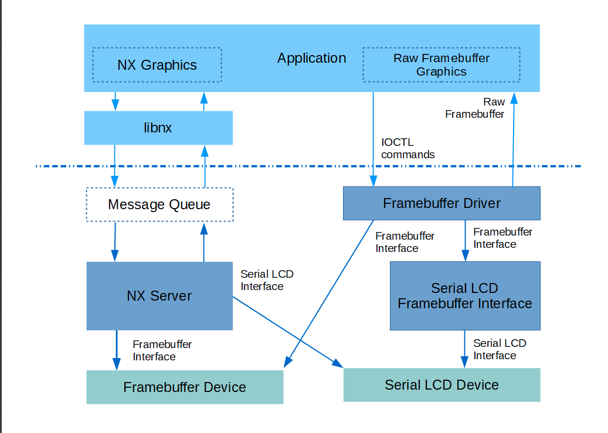

# Display 驱动

## 一、openvela 图形框架

### 1、NX Graphics

openvela 已集成图形库 NxWM，但由于其功能相对简单，无法满足更复杂的需求。

目前，openvela 系统采用功能更强大的 **LVGL** 图形库，以支持更广泛的应用场景。

### 2、Graphics Drivers

常用的屏幕类型根据数据传输总线的模式，可分为以下两种：

- Universal Mode
- Image Transfer (Video Mode)

在驱动层面，相应地分为以下两种驱动类型：

- Framebuffer Driver
    - 针对 Image Transfer (Video Mode) 传输模式的屏幕。
    - 常见应用场景包括：
        - TTL RGB
        - MIPI-DSI
- LCD Driver
    - 针对 Universal Mode 传输模式的屏幕。
    - 常见应用场景包括：
        - SPI (QSPI)
        - I2C

## 二、相关文档

关于 Graphics Driver 的适配方法，请参见：

- [Framebuffer_Driver](./Framebuffer_Driver.md)
- [LCD_Driver](./LCD_Driver.md)
