# VSync

\[ [English](../../../en/device_dev_guide/graphics/VSync.md) | 简体中文 \]

## 一、概述

本文主要介绍 VSync 相关的知识，以及适配硬件驱动的方法，适合想要了解渲染器和 Display 相互配合过程的同学。

## 二、VSync 是什么

首先设想一种最简单的场景：

1. LCD 控制器以固定 60Hz（周期大约为 16ms）的频率搬运 Framebuffer 的内容到屏幕上，每次数据搬运时间为8ms。
2. 渲染器（Render）以 100Hz（周期 10ms）的频率在 Framebuffer 上进行渲染，每次的渲染时间为 8ms。渲染的内容为一个蓝色矩形从左往右做平移动画。

    

在实体机上进行验证，发现屏幕上显示的内容不是一个完整的矩形，而是一个上下断裂的矩形，和预期显示的内容并不一致。这个现象叫 [Screen Tearing](https://zh.wikipedia.org/zh-hans/畫面撕裂)（**画面撕裂**），如下图所示：


导致画面撕裂的根本原因其实就是内存踩踏。LCD 在读取 Framebuffer 的过程中，渲染器又往 Framebuffer 写入了新的数据，导致屏幕上同时显示了新帧和旧帧。时序如下图所示：


要解决这种情况，就需要引入一种同步机制，用来保证渲染器和 LCD buffer 操作之间不会有踩踏情况的发生，从而避免出现画面撕裂的情况。

这种同步机制称为 VSync(Vertical Synchronization)，也叫垂直同步。

## 三、VSync 实现

### 1、实现原理

要实现 VSync，就要保证渲染器写 buffer 的操作和 LCD 读 buffer 的操作，时间和空间上不能发生重叠，这意味着渲染器不能在任意时刻进行绘制，而是要等 LCD 完整读取完 Framebuffer 的时候再开始写入新帧。

那是不是只要简单地将渲染放到 LCD 发送 buffer 之后再做呢？如下图所示：


看似解决了问题，但是要注意的一点是，渲染器的性能会受很多因素影响，比如系统调度、页面复杂程度、GPU 绘制性能。这就导致渲染时间是不固定的，渲染时间有可能很短，也有可能很长，如果渲染时间大于 LCD 两次 buffer 发送的间隔时间，依然会导致画面撕裂的发生，如下图所示：



为了解决渲染耗时不固定的问题，需要再引入一帧 buffer，原因有以下几点：

1. 两帧之间总是有一帧是可写而另外一帧则是可读的，经过合理协调不会发生内存踩踏的情况发生。
2. 渲染器写操作和 LCD 读操作可以并行，保证最大渲染效率。
3. 渲染器可以长时间占用一帧进行渲染，当渲染超过 LCD 发送间隔时间时，LCD 只要取旧的一帧进行显示，保证画面是完整的。

### 2、屏幕驱动模式

市面上主要有两种类型的屏幕，分别为 Video 屏和 Command 屏，它们分别有以下特征：

#### Video 屏

1. 需要 LCD 控制器定时搬运一帧数据，来刷新整个屏幕（一般刷新频率为 60Hz），保持画面不丢失。
2. 在画面不动的情况下，LCD 控制器也需要刷新整个屏幕，所以功耗较高。
3. 硬件成本较低，常用于成本敏感但是功耗不敏感的产品。

#### Command 屏

1. 屏幕内置了可以保存一帧数据的 RAM，外界只要负责修改这块 RAM 的内容，屏幕的刷新过程由屏幕内部的控制器自动完成。
2. 只需要在 Framebuffer 内容有更新的情况下再启动传输，而且支持只传输变化的部分，减少发送的数据量，功耗相对于 Video 屏更低。
3. 由于硬件上增加了 LCD 控制器和 RAM，所以成本相对于 Video 屏更高，常用于功耗敏感的产品，比如手环手表这种使用电池供电的穿戴设备。

### 3、中断服务函数

> **说明**
>
> 中断相关内容介绍请参见 [Interrupt](https://en.wikipedia.org/wiki/Interrupt)。

微控制单元（Microcontroller Unit，MCU）和屏幕的简化版硬件连接如下图：



- TE（Tearing Effect）：用于接收屏幕发送过来的同步信号，屏幕硬件会在每次即将显示新的帧之前，改变这个引脚的电平，MCU 通过 GPIO 中断接收和处理 TE 事件。
- MIPI（Mobile Industry Processor Interface）：用于传输命令和数据的接口，LCD 控制器和 LCD 之间沟通的桥梁，CPU 通过操作 LCD 控制器来控制屏幕显示的内容，LCD 控制器也会在每次传输完毕后，通过中断来通知 CPU buffer 已经发送完成。

LCD 驱动程序需要提供两个中断服务函数，用于接收和处理 LCD 发送过来的事件。

- TE（Tearing Effect）中断服务函数：在 LCD 即将开始发送的时候会被调用，用于将被发送的 buffer 地址写入 LCD 控制器。

    ```C
    static void lcdc_te_irq(int irq, void *context, void *arg)
    {
    }
    ```

- Framebuffer 传输完成中断服务函数：由 LCD 控制器触发，在 LCD 发送结束的时候会被调用。

    ```C
    static void lcdc_framedone_irq(int irq, void *context, void *arg)
    {
    }
    ```

下图显示了 TE IRQ 和 Framedone IRQ 产生事件的时间点。需要注意的是，TE IRQ 要提前于 LCD 传输启动时间点，这段时间用于配置寄存器。


**说明**

在注册中断服务函数时，需要将驱动程序的 `priv` 传入 `arg`，这样可以避免使用全局变量传递参数，示例代码如下：

```C
static void lcdc_irqconfig(void)
{
  struct lcdcdev_s *priv = &g_lcdcdev;

  /* Attach TE interrupt vector */

  /* g_lcdcdev为用户自己定义的全局变量，具体数据结构排列方式可以参考STM32 LTDC驱动：
   * nuttx/arch/arm/src/stm32/stm32_ltdc.c
   */

  irq_attach(priv->irq, lcdc_te_irq, priv);

  /* Enable the IRQ at the NVIC */

  up_enable_irq(priv->irq);

  ...
}
```

## 四、VSync 适配

实现 VSync 同步机制有如下两种方式。

### 1、（推荐）非阻塞方式

在大部分的业务场景中，是基于 [libuv](https://libuv.org/) 进行开发的，这意味着上层不能使用任何诸如 `sem_wait`、`usleep` 等同步阻塞等待接口，否则会影响整个事件循环的运行。

libuv 的核心是基于 [poll](https://man7.org/linux/man-pages/man2/poll.2.html) 实现的，poll 相对于传统的信号量，最核心的优点是可以同时监控多个事件是否发生。只要有一个事件发生，poll 就会退出阻塞状态，libuv 原理如下图所示：



openvela 的 Framebuffer 驱动框架提供了 `poll` 所需要的[接口](../../../../../../nuttx/blob/dev-ai-contest-2026/drivers/video/fb.c)，用于监控 Framebuffer 是否处于可写状态：

```C
/****************************************************************************
 * Name: fb_poll
 *
 * Description:
 *   Wait for framebuffer to be writable.
 *
 ****************************************************************************/

static int fb_poll(FAR struct file *filep, struct pollfd *fds, bool setup)
{
  FAR struct inode *inode;
  FAR struct fb_chardev_s *fb;
  FAR struct fb_priv_s *priv;
  FAR struct circbuf_s *panbuf;
  FAR struct pollfd **pollfds;
  irqstate_t flags;
  int ret = OK;

  /* Get the framebuffer instance */

  DEBUGASSERT(filep != NULL && filep->f_inode != NULL);
  inode = filep->f_inode;
  fb    = (FAR struct fb_chardev_s *)inode->i_private;
  priv  = (FAR struct fb_priv_s *)filep->f_priv;

  DEBUGASSERT(fb->vtable != NULL && priv != NULL);

  flags = enter_critical_section();

  if (setup)
    {
      pollfds = get_free_pollfds(fb, priv->overlay);
      if (pollfds == NULL)
        {
          ret = -EBUSY;
          goto errout;
        }

      *pollfds = fds;
      fds->priv = pollfds;
      
      /* If panbuf queue is not full, notify upper layer directly */
      panbuf = fb_get_panbuf(fb, priv->overlay);
      if (!circbuf_is_full(panbuf))
        {
          poll_notify(pollfds, 1, POLLOUT);
        }
    }
  else if (fds->priv != NULL)
    {
      /* This is a request to tear down the poll. */

      FAR struct pollfd **slot = (FAR struct pollfd **)fds->priv;
      *slot = NULL;
      fds->priv = NULL;
    }

errout:
  leave_critical_section(flags);
  return ret;
}
```

在 Framebuffer 中引入一个队列机制，称为 `panbuf` 队列。`panbuf` 队列本质上是一个简单的环形缓冲区，里面保存的是渲染完成即将发送的 buffer 信息 `union fb_paninfo_u`。

对于支持 Framebuffer overlay 的 LCD 控制器，每一个 overlay 层都有自己对应的 panbuf 队列。

```C
union fb_paninfo_u
{
  struct fb_planeinfo_s planeinfo;
#ifdef CONFIG_FB_OVERLAY
  struct fb_overlayinfo_s overlayinfo;
#endif
};
```

引入 panbuf 队列的好处是将渲染和屏幕发送的逻辑进行了解耦，渲染器负责产生新帧推入队列，LCD 控制器则负责消耗队列中的帧，不用互相关心对方的节拍快慢，达到自适应的效果。

从渲染器的视角看，当队列里有空位时，开始渲染并推入队列，队列占满时，则停止渲染，等待 LCD 控制器释放已经传输完成的 Framebuffer。

从 LCD 控制器的视角看，在每次准备发送前先检查队列是否有待发送 buffer，如果有则取出一帧开始发送，如果没有则维持旧的一帧进行显示。


渲染器通过调用 `FBIOPAN_DISPLAY` ioctl 接口向底层的 panbuf 队列推入数据。

对于支持 FB overlay 的 LCD 控制器，使用 `FBIOPAN_OVERLAY` ioctl 接口向 overlay panbuf 队列推送数据。

```C
/****************************************************************************
 * Name: fb_ioctl
 *
 * Description:
 *   The standard ioctl method.
 *
 ****************************************************************************/

static int fb_ioctl(FAR struct file *filep, int cmd, unsigned long arg)
{
  FAR struct inode *inode;
  FAR struct fb_chardev_s *fb;
  int ret;

  ginfo("cmd: %d arg: %ld\n", cmd, arg);

  /* Get the framebuffer instance */

  DEBUGASSERT(filep != NULL && filep->f_inode != NULL);
  inode = filep->f_inode;
  fb    = (FAR struct fb_chardev_s *)inode->i_private;

  /* Process the IOCTL command */

  switch (cmd)
    {
      ...
#ifdef CONFIG_FB_OVERLAY
      ...
       case FBIOPAN_OVERLAY:
        {
          FAR struct fb_overlayinfo_s *oinfo =
            (FAR struct fb_overlayinfo_s *)((uintptr_t)arg);
          union fb_paninfo_u paninfo;

          DEBUGASSERT(oinfo != 0 && fb->vtable != NULL);

          memcpy(&paninfo, oinfo, sizeof(*oinfo));
          ret = fb_add_paninfo(fb->vtable, &paninfo, oinfo->overlay);

          if (ret >= 0 && fb->vtable->panoverlay)
            {
              fb->vtable->panoverlay(fb->vtable, oinfo);
            }
        }
        break;
      ...
#endif /* CONFIG_FB_OVERLAY */
      
      case FBIOPAN_DISPLAY:
        {
          FAR struct fb_planeinfo_s *pinfo =
            (FAR struct fb_planeinfo_s *)((uintptr_t)arg);
          union fb_paninfo_u paninfo;

          DEBUGASSERT(pinfo != NULL && fb->vtable != NULL);

          memcpy(&paninfo, pinfo, sizeof(*pinfo));
          ret = fb_add_paninfo(fb->vtable, &paninfo, FB_NO_OVERLAY);

          if (ret >= 0 && fb->vtable->pandisplay)
            {
              fb->vtable->pandisplay(fb->vtable, pinfo);
            }
        }
        break;
        ...
    }
}
```

驱动程序使用 `fb_remove_paninfo` 函数向上层发起通知，表示该 buffer 已经不再使用，`fb_remove_paninfo` 会主动去通知当前阻塞等待绘制的线程。

```C
/****************************************************************************
 * Name: fb_remove_paninfo
 * Description:
 *   Remove a frame from pan info queue of the specified overlay.
 *
 * Input Parameters:
 *   vtable  - Pointer to framebuffer's virtual table.
 *   overlay - Overlay index.
 *
 * Returned Value:
 *   Zero is returned on success; a negated errno value is returned on any
 *   failure.
 ****************************************************************************/

int fb_remove_paninfo(FAR struct fb_vtable_s *vtable, int overlay)
{
  FAR struct circbuf_s *panbuf;
  FAR struct fb_chardev_s *fb;
  irqstate_t flags;
  ssize_t ret;

  fb = vtable->priv;
  if (fb == NULL)
    {
      return -EINVAL;
    }

  panbuf = fb_get_panbuf(fb, overlay);
  if (panbuf == NULL)
    {
      return -EINVAL;
    }

  flags = enter_critical_section();

  /* Attempt to take a frame from the pan info. */

  ret = circbuf_skip(panbuf, sizeof(union fb_paninfo_u));
  DEBUGASSERT(ret <= 0 || ret == sizeof(union fb_paninfo_u));

  /* Re-enable interrupts */

  leave_critical_section(flags);

  if (ret == sizeof(union fb_paninfo_u))
    {
      fb_pollnotify(vtable, overlay);
    }

  return ret <= 0 ? -ENOSPC : OK;
}
```

#### LCD 驱动送显适配方法

在新的 panbuf 队列机制下，驱动适配 VSync 需要使用如下 API 接口：

- fb_peek_paninfo : 读取 panbuf 队列第一帧的信息。
- fb_remove_paninfo : 删除 panbuf 队列第一帧。
- fb_paninfo_count ：获取 panbuf 队列的 paninfo 个数。

```C
/****************************************************************************
 * Name: fb_peek_paninfo
 * Description:
 *   Peek a frame from pan info queue of the specified overlay.
 *
 * Input Parameters:
 *   vtable  - Pointer to framebuffer's virtual table.
 *   info    - Pointer to pan info.
 *   overlay - Overlay index.
 *
 * Returned Value:
 *   Zero is returned on success; a negated errno value is returned on any
 *   failure.
 ****************************************************************************/

int fb_peek_paninfo(FAR struct fb_vtable_s *vtable,
                    FAR union fb_paninfo_u *info,
                    int overlay);
/****************************************************************************
 * Name: fb_remove_paninfo
 * Description:
 *   Remove a frame from pan info queue of the specified overlay.
 *
 * Input Parameters:
 *   vtable  - Pointer to framebuffer's virtual table.
 *   overlay - Overlay index.
 *
 * Returned Value:
 *   Zero is returned on success; a negated errno value is returned on any
 *   failure.
 ****************************************************************************/

int fb_remove_paninfo(FAR struct fb_vtable_s *vtable, int overlay);

/****************************************************************************
 * Name: fb_paninfo_count
 * Description:
 *   Get pan info count of specified overlay pan info queue.
 *
 * Input Parameters:
 *   vtable  - Pointer to framebuffer's virtual table.
 *   overlay - Overlay index.
 *
 * Returned Value:
 *   a non-negative value is returned on success; a negated errno value is
 *   returned on any failure.
 ****************************************************************************/

int fb_paninfo_count(FAR struct fb_vtable_s *vtable, int overlay);
```

##### Command 屏

由于Command屏幕内置一帧缓存，所以当帧发送完成后，可以立即从 panbuf 队列中删除。TE 信号来临时，只需要检查panbuf 队列中是否有新帧，有则取出地址信息进行发送。

```C
static void lcdc_te_irq(int irq, void *context, void *arg)
{
  struct lcdcdev_s *priv = arg;
  union fb_paninfo_u info;
  irqstate_t flags;
  ssize_t ret;

  if (fb_peek_paninfo(&priv->vtable, &info, FB_NO_OVERLAY) == OK)
    {
      uintptr_t buf = (uintptr_t)priv->pinfo.fbmem +
                                 priv->pinfo.stride * info.planeinfo.yoffset;
    
      /* Write the sent buffer address to the LCD controller. */
        
      lcdc_set_bufaddr(buf);
    }
    
#ifdef CONFIG_FB_OVERLAY
  for (i = 0; i < priv->overlaynum; i++)
    {
      if (fb_peek_paninfo(&priv->vtable, &info, i) == OK)
        {
          uintptr_t buf = (uintptr_t)priv->overlayinfo[i].fbmem +
                                     priv->overlayinfo[i].stride * info.overlayinfo.yoffset;
        
          /* Write the sent buffer address to the LCD controller. */
            
          lcdc_set_overlay_addr(buf, i);
        }
    }
#endif
}

static void lcdc_framedone_irq(int irq, void *context, void *arg)
{
  struct lcdcdev_s *priv = arg;
  union fb_paninfo_u info;

  /* After the sending is completed, remove it from the panbuf queue.
   */
  
  fb_remove_paninfo(&priv->vtable, FB_NO_OVERLAY);
  
#ifdef CONFIG_FB_OVERLAY
  for (i = 0; i < priv->overlaynum; i++)
    {
      fb_remove_paninfo(&priv->vtable, i);
    }
#endif
}
```

##### Video 屏

由于 Video 屏每个 VSync 周期都需要发送 Framebuffer，所以当 TE 信号来时，需要判断是否有新的 Framebuffer 进入 panbuf 队列。如果有，则删除旧 Framebuffer，取新 Framebuffer 发送数据。

```C
static void lcdc_te_irq(int irq, void *context, void *arg)
{
  struct lcdcdev_s *priv = arg;
  union fb_paninfo_u info;
  int count;
  
  count = fb_paninfo_count(&priv->vtable, FB_NO_OVERLAY);
  if (count > 0)
    {
      if (count > 1)
        {
          fb_remove_paninfo(&priv->vtable, FB_NO_OVERLAY);
        }
      
      if (fb_peek_paninfo(&priv->vtable, &info, FB_NO_OVERLAY) == OK)
        {
          uintptr_t buf = (uintptr_t)priv->pinfo.fbmem +
                                     priv->pinfo.stride * info.planeinfo.yoffset;
        
          /* Write the sent buffer address to the LCD controller. */
          
          lcdc_set_bufaddr(buf);
        }
    }
    
    /* 如果驱动有多个overlay layer，对overlay layer 也需要做同样的操作 */
#ifdef CONFIG_FB_OVERLAY
  for (i = 0; i < priv->overlaynum; i++)
    {
      count = fb_paninfo_count(&priv->vtable, i);
      if (count  > 0)
        {
          if (count > 1)
            {
              fb_remove_paninfo(&priv->vtable, i);
            }
          
          if (fb_peek_paninfo(&priv->vtable, &info, i) == OK)
            {
              uintptr_t buf = (uintptr_t)priv->overlayinfo[i].fbmem +
                                         priv->overlayinfo[i].stride * info.overlayinfo.yoffset;
            
              /* Write the sent buffer address to the LCD controller. */
              
              lcdc_set_overlay_addr(buf, i);
            }
        }
    }
#endif
}
```

### 2、（不推荐）阻塞方式

使用信号量进行同步，相当于对 Framebuffer 进行加锁操作，渲染器每次开始渲染时都需要拿到锁才能进行绘制，否则就会处于阻塞状态，代码请参见此 [链接](../../../../../../nuttx/blob/dev-ai-contest-2026/arch/arm/src/stm32/stm32_ltdc.c)。

## 五、相关仓库

- [nuttx](https://github.com/open-vela/nuttx)