# 启动流程

## 板级初始化顺序

openvela 板级初始化流程如下：

```C
nx_start->
    board_early_initialize->
           //启动AppBringup_task CONFIG_BOARD_INITTHREAD_STACKSIZE
           board_late_initialize->
                   //启动nsh_task CONFIG_INIT_STACKSIZE
                   board_app_initialize->
                       rc.sysinit->
                           board_app_finalinitialize->
                                   rcS->
```

- `nx_start`：openvela OS 入口。
- `board_early_initialize`：用于板级早期初始化，依赖于 CONFIG_BOARD_EARLY_INITIALIZE，执行上下文是 idle task，不能等待任何事件，不能调用任何可能阻塞的函数（比如sem_wait，因为 OS 的基础组件还没有进行初始化）。
- `board_late_initialize`：相对于 board_early_initialize 较晚执行，OS 基础组件已经就绪，是板级大部分驱动的初始化入口，依赖于 CONFIG_BOARD_LATE_INITIALIZE，执行上下文是内核临时的 AppBringup thread 中，可以等待事件。芯片大部分驱动初始化在此过程中。
- `board_app_initialize`：用于应用初始化，通过 boardctl（BOARDIOC_INIT）被调用，执行上下文是 nsh task。注意这个阶段不能访问文件系统。
- `rc.sysinit`：openela 的启动脚本分为两个阶段，目前为第一阶段脚本，主要用于文件系统挂载和核心启动服务初始化，执行时机是 nsh 可输入前。
- `board_app_finalinitialize`：用于板级最终的初始化，通过 boardctl（BOARDIOC_FINALINIT）被调用，执行上下文是 nsh task。有对文件访问需求的驱动初始化（TP、Charger、Audio PA 、BMI、PPG 和 GPS）需要挪到这个里面，可直接操作文件，不需要使用 delay work 的方式推后执行。
- `rcS`：第二阶段脚本，主要用于启动其他的应用程序，包含 miwear、algo_service、gpsd 和 healthd 等，执行时机是 nsh 可输入前。

## 启动脚本

openvela 的启动脚本 rcS 和 rc.sysinit，是由 nsh task 通过 nshlib 进行加载和解析的，启动脚本的位置由 config 指定：
1. CONFIG_ETC_ROMFSMOUNTPT/CONFIG_NSH_SYSINITSCRIPT
2. CONFIG_ETC_ROMFSMOUNTPT/CONFIG_NSH_INITSCRIPT

通常启动脚本被放置在 `/etc` 下，`etc` 目录内容以 romfs 的形式与 openvela binary 编译链接在一起，启动之后会自动被内核进行 mount，相关配置如下：

```Makefile
CONFIG_FS_ROMFS=y
CONFIG_ETC_ROMFS=y
CONFIG_ETC_ROMFSMOUNTPT="/etc"
CONFIG_NSH_SYSINITSCRIPT="init.d/rc.sysinit"
CONFIG_NSH_INITSCRIPT="init.d/rcS"
```

openvela etc 由不同的 board 来生成，可以用 genromfs 和 xxd 工具生成 etc_romfs.c，编译到内核。

例如：boards/arm/at32/at32f437-mini/src/etc_romfs.c，由脚本 boards/arm/at32/at32f437-mini/tool/mkromfs.sh 生成。

更常用的方式是，etc 内容由对应 board/arch/board/board/src/etc 目录下的内容生成。
例如：boards/sim/sim/sim/src/etc。

`etc` 下所有的内容受 `etc/` 前一级目录的 Makefile 控制，RCSRCS 用于指定启动脚本，RCRAWS 用于指定加入 etc 目录下的其他文件和目录。

```Makefile
ifeq ($(CONFIG_ETC_ROMFS),y)
  RCSRCS = etc/init.d/rc.sysinit etc/init.d/rcS
  RCRAWS = etc/group etc/passwd
endif
```

## 调用关系

下面流程图展示了 openvela 启动流程中的调用关系，具体准确流程，以实际代码为准。



## 相关链接

[(Clickable) Call Graph for Apache NuttX Real-Time Operating System (lupyuen.github.io)](https://lupyuen.github.io/articles/unicorn2)