# Rpmsg 简介

## 一、简介

RPMsg（Remote Processor Messaging） 是一种轻量级的消息传递框架，用于在异构多核系统中实现核间通信。它通过定义标准化的二进制接口，允许不同处理器核心之间高效地交换数据。

RPMsg 主要应用于 AMP（Asymmetric Multiprocessing，非对称多处理） 系统。在 AMP 系统中，不同的核心可能运行不同的操作系统或实时操作系统（RTOS）。RPMsg 是 Linux 原生实现的 IPC（Inter-Process Communication，进程间通信） 协议，OpenAMP 项目将该协议扩展到嵌入式设备中。

openvela 基于 OpenAMP 实现了自己的 RPMsg 框架，但由于原有的 OpenAMP 实现的 RPMsg 无法完全满足 openvela 的需求，openvela 对 RPMsg 的接口进行了扩展，开发了新的 RPMsg 框架，并完善了对多传输层的支持。

## 二、框架

### 1、Rpmsg 架构图



### 2、RPMsg 框架的功能描述

#### 2.1 服务层 API

RPMsg 框架基于 OpenAMP 扩展了统一的 API，位于 `nuttx/include/nuttx/rpmsg/rpmsg.h`。 RPMsg 服务可以通过调用这些 API，与不同框架的传输层进行交互。

以下是 RPMsg 框架为服务层提供的主要 API：

```C
/* Rpmsg框架为Rpmsg Services提供的API */
int rpmsg_wait(FAR struct rpmsg_endpoint *ept, FAR sem_t *sem);
int rpmsg_post(FAR struct rpmsg_endpoint *ept, FAR sem_t *sem);

FAR const char *rpmsg_get_cpuname(FAR struct rpmsg_device *rdev);

int rpmsg_get_tx_buffer_size(FAR struct rpmsg_device *rdev);
int rpmsg_get_rx_buffer_size(FAR struct rpmsg_device *rdev);

int rpmsg_register_callback(FAR void *priv,
                            rpmsg_dev_cb_t device_created,
                            rpmsg_dev_cb_t device_destroy,
                            rpmsg_match_cb_t ns_match,
                            rpmsg_bind_cb_t ns_bind);
void rpmsg_unregister_callback(FAR void *priv,
                               rpmsg_dev_cb_t device_created,
                               rpmsg_dev_cb_t device_destroy,
                               rpmsg_match_cb_t ns_match,
                               rpmsg_bind_cb_t ns_bind);
```

#### 2.2 传输层 API

传输层 API 用于支持 RPMsg 的底层数据传输和设备管理。

```C
/* Rpmsg框架为Rpmsg传输层提供的API */
void rpmsg_ns_bind(FAR struct rpmsg_device *rdev,
                   FAR const char *name, uint32_t dest);
void rpmsg_ns_unbind(FAR struct rpmsg_device *rdev,
                     FAR const char *name, uint32_t dest);
void rpmsg_device_created(FAR struct rpmsg_s *rpmsg);
void rpmsg_device_destory(FAR struct rpmsg_s *rpmsg);
int rpmsg_register(FAR const char *path, FAR struct rpmsg_s *rpmsg,
                   FAR const struct rpmsg_ops_s *ops);
void rpmsg_unregister(FAR const char *path, FAR struct rpmsg_s *rpmsg);
```

#### 2.3 内核公共接口

RPMsg 框架还暴露了一些公共接口，供内核模块使用。

```C
/* Rpmsg框架暴露给内核的公共接口 */
int rpmsg_ioctl(FAR const char *cpuname, int cmd, unsigned long arg);
int rpmsg_panic(FAR const char *cpuname);
void rpmsg_dump_all(void);
```

### 3、传输层的 `ops` 实现

RPMsg 框架对传输层暴露了两个 `ops`，传输层需要实现这些接口以支持数据传输和服务绑定。

#### 3.1 OpenAMP 框架要求的 `ops`

OpenAMP 框架定义的 `ops` 主要用于数据传输相关的功能：

```C
/* nuttx/openamp/open-amp/lib/include/openamp/rpmsg.h */
struct rpmsg_device_ops {
        int (*send_offchannel_raw)(struct rpmsg_device *rdev,
                                   uint32_t src, uint32_t dst,
                                   const void *data, int len, int wait);
        void (*hold_rx_buffer)(struct rpmsg_device *rdev, void *rxbuf);
        void (*release_rx_buffer)(struct rpmsg_device *rdev, void *rxbuf);
        void *(*get_tx_payload_buffer)(struct rpmsg_device *rdev,
                                       uint32_t *len, int wait);
        int (*send_offchannel_nocopy)(struct rpmsg_device *rdev,
                                      uint32_t src, uint32_t dst,
                                       const void *data, int len);
        int (*release_tx_buffer)(struct rpmsg_device *rdev, void *txbuf);
};
```

#### 3.2 openvela 扩展的 `ops`

openvela 扩展的 `ops` 主要用于服务绑定流程和调试功能：

```C
/* nuttx/include/nuttx/rpmsg/rpmsg.h */
struct rpmsg_ops_s
{
  CODE int (*wait)(FAR struct rpmsg_s *rpmsg, FAR sem_t *sem);
  CODE int (*post)(FAR struct rpmsg_s *rpmsg, FAR sem_t *sem);
  CODE int (*ioctl)(FAR struct rpmsg_s *rpmsg, int cmd, unsigned long arg);
  CODE void (*panic)(FAR struct rpmsg_s *rpmsg);
  CODE void (*dump)(FAR struct rpmsg_s *rpmsg);
  CODE FAR const char *(*get_cpuname)(FAR struct rpmsg_s *rpmsg);
  CODE int (*get_tx_buffer_size)(FAR struct rpmsg_s *rpmsg);
  CODE int (*get_rx_buffer_size)(FAR struct rpmsg_s *rpmsg);
};
```

### 4、字符设备支持

RPMsg 框架实现了一个字符设备，方便用户层通过以下方式与内核 RPMsg 框架交互：

- 打开设备：`open(/dev/rpmsg/xxx)`
- 使用 IO 控制命令：`ioctl(fd, RPMSGIOC_XXX, arg)`
- 使用 `rpmsg` 命令直接交互。

## 三、适配传输层

### 1、添加新传输层

如果需要为 RPMsg 框架添加一个新的传输层，需要按照以下步骤进行操作：

1. 实现传输层接口。 实现上述 `struct rpmsg_ops_s` 中定义的接口。 这些接口主要用于支持服务绑定、调试功能以及传输层的基本操作。
2. 注册传输层。 在框架初始化时，调用 `struct rpmsg_register`，将实现的  `struct rpmsg_ops_s` 注册到 RPMsg 框架中。 注册后，RPMsg 框架可以识别并使用该传输层。
3. 初始化传输层设备接口。 各传输层需要对 `struct rpmsg_device_ops` 进行初始化。 这些接口主要用于数据传输相关的操作，例如发送、接收和缓冲区管理。

完成上述步骤后，上层 RPMsg 服务即可通过 RPMsg 框架使用不同的传输层进行通信。