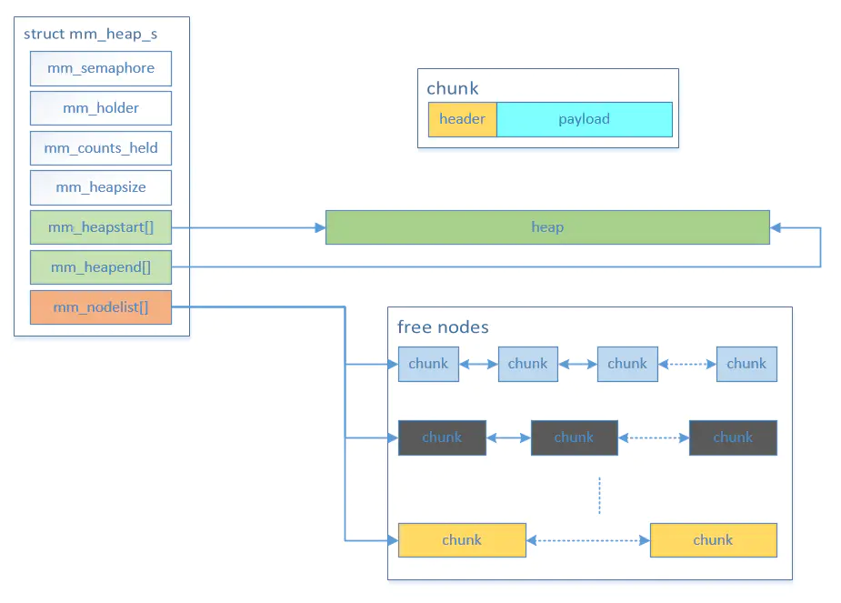
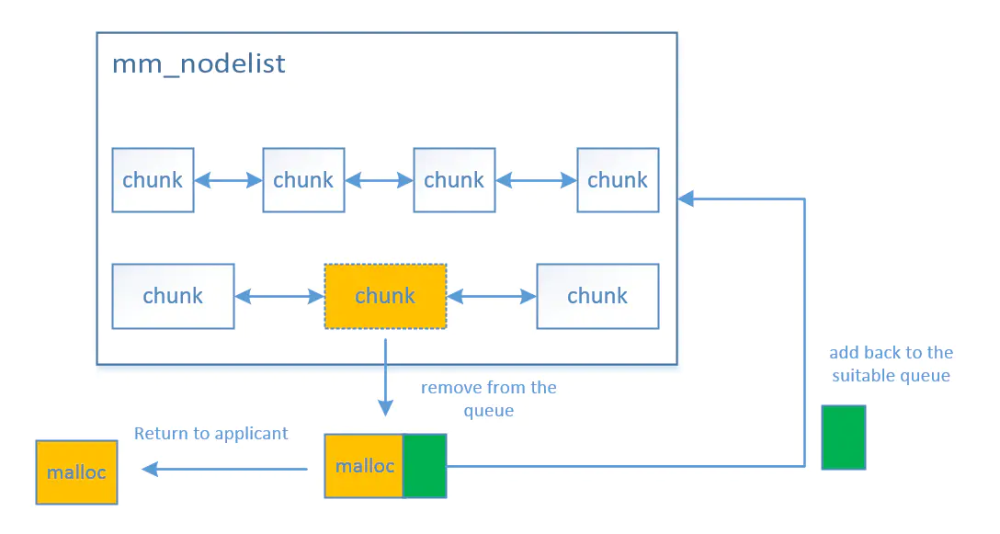
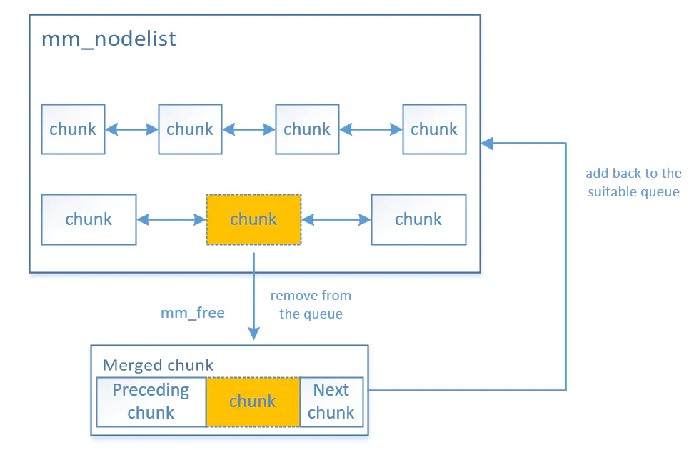
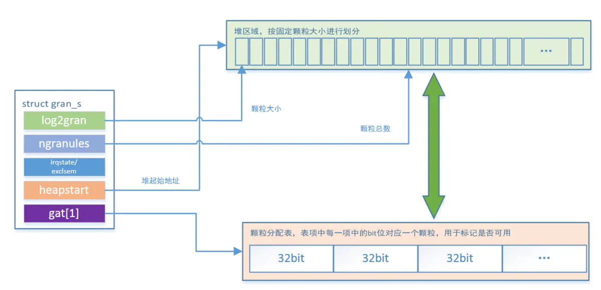
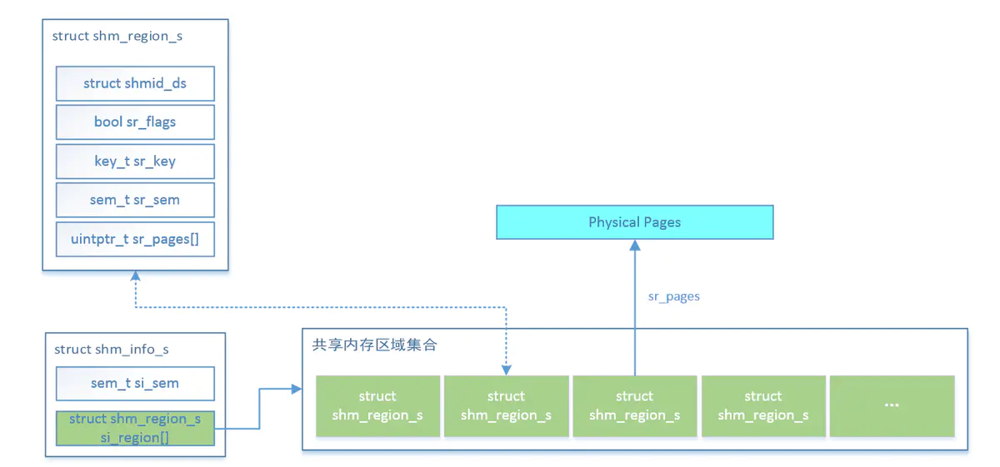

# 内存管理

## 一、简介

openvela 的内存管理模块代码位于 `nuttx/mm` 目录下，包含以下子目录：

- `mm_heap`：通用堆分配器相关代码。
- `umm_heap`：用户模式下堆分配器相关代码。
- `kmm_heap`：内核模式下堆分配器相关代码。
- `mm_gran`：颗粒分配器相关代码。
- `shm`：共享内存相关代码。

`nuttx/mm` 目录实现了 openvela 的内存管理单元逻辑，主要包括以下功能。

### 1、标准内存管理函数

#### 标准函数

内存管理模块提供了一组标准函数接口，与 `stdlib.h` 中描述的接口一致，并遵循 **IEEE Std 1003.1-2003** 标准。相关文件包括：

- 标准接口：
  - `mm_malloc.c`
  - `mm_calloc.c`
  - `mm_realloc.c`
  - `mm_memalign.c`
  - `mm_free.c`
- 非标准接口：
  - `mm_zalloc.c`
  - `mm_mallinfo.c`
- 内部实现接口：
  - `mm_initialize.c`
  - `mm_lock.c`
- 编译和配置文件：
  - `Kconfig`
  - `Makefile`

#### 内存模型

内存管理模块支持两种内存模型，分别适用于不同的硬件环境：

##### 小内存模型

- 适用场景：当 MCU 仅支持 16-bit 数据寻址时，系统会自动使用小内存模型。
- 堆大小限制：最大为 64 KB。
- 强制使用：通过配置 `CONFIG_MM_SMALL`，可以在支持更宽寻址的 MCU 上强制启用小内存模型。

##### 大内存模型

- 适用场景：支持堆大小最大为 4 GB 的系统。
- 实现方式：通过可变长分配器实现，具有以下特点：
  - 开销：每次分配的开销为 8 字节（小内存模型为 4 字节）。
  - 对齐：分配的内存按 8 字节对齐（小内存模型为 4 字节对齐）。

#### 堆分配的多种实现

内存管理模块支持管理多个堆实例。堆的描述使用 `struct_mm_heap_s` 数据结构，该结构定义在 `include/nuttx/mm/mm.h` 文件中。

##### 创建堆实例

要创建一个堆实例，通常需要静态分配堆结构。例如：

```C
#include <nuttx/mm/mm.h>  
static struct mm_heap_s g_myheap;
```

##### 初始化堆实例

使用 `mm_initialize()` 接口初始化堆实例：

```C
mm_initialize(&g_myheap, myheap_start, myheap_size);
```

##### 使用堆实例

初始化后的堆实例可以通过以下接口进行内存分配和管理：

- `mm_malloc()`
- `mm_realloc()`
- `mm_free()`

这些接口与标准的 `malloc()`、`realloc()` 和 `free()` 类似，但需要将堆实例作为参数传递。例如：

```C%2B%2B
void *ptr = mm_malloc(&g_myheap, size);
```

实际上，`malloc()`、`realloc()` 和 `free()` 的底层实现均调用了 `mm_malloc()`、`mm_realloc()` 和 `mm_free()`。

#### 用户/内核堆

通过内核配置选项，可以支持用户模式堆和内核模式堆。相关子目录包括：

- `mm/mm_heap`：存放所有堆分配器的基础逻辑。
- `mm/umm_heap`：存放用户模式堆分配接口。
- `mm/kmm_heap`：存放内核模式堆分配接口。

### 2、颗粒分配器

`mm_gran` 目录提供了颗粒分配器，支持以固定大小的块分配内存，并允许分配与用户提供的地址边界对齐。颗粒分配器的接口定义在 `nuttx/include/nuttx/mm/gran.h` 头文件中，其实现逻辑包含以下文件：

- `mm_gran.h`
- `mm_granalloc.c`
- `mm_grancritical.c`
- `mm_granfree.c`
- `mm_graninit.c`

#### 功能概述

在 openvela 中，颗粒分配器常用于 KERNEL 模式下内存页分配或于支持 DMA 内存对齐分配等场景。

> **注意**
>
- > 每个颗粒可能需要对齐，且分配以颗粒大小为单位，因此颗粒大小的选择至关重要。
- > 较大的颗粒可以提升性能并减少开销，但可能因量化浪费导致更多内存损失。
- > 对齐可能引入额外的内存浪费，因此仅在以下情况下使用堆对齐：
     > - 使用颗粒分配器管理 DMA 内存。
     > - 硬件对内存对齐有特定需求。

#### 使用示例

以下是颗粒分配器的典型使用流程：

1. 定义 DMA 堆。

    使用 GCC 的 `section` 属性将 DMA 堆定位到特定内存区域（例如，通过链接脚本将 `.dmaheap` 分配给 DMA 内存）：

    ```C
    FAR uint32_t g_dmaheap[DMAHEAP_SIZE] __attribute__((section(.dmaheap)));
    ```

2. 初始化颗粒分配器。

    调用 `gran_initialize()` 接口创建堆。例如，假设颗粒大小为 64 字节，按 16 字节对齐：

    ```C
    GRAN_HANDLE handle = gran_initialize(g_dmaheap, DMAHEAP_SIZE, 6, 4);
    ```

    此时，`GRAN_HANDLE`能被用于分配内存了（如果`CONFIG_GRAN_SINGLE=y`的话，`GRAN_HANDLE`不会被定义）。

3. 分配内存。

    使用 `gran_alloc()` 接口分配内存。例如：

    ```C
    FAR uint8_t *dma_memory = (FAR uint8_t *)gran_alloc(handle, 47);
    ```

    在此示例中，实际分配的内存为 64 字节（浪费 17 字节），并且会对齐到至少 `(1 << log2align)`。

### 3、页分配器

页分配器是基于颗粒分配器的一种特殊用途的内存分配器，主要用于为具有内存管理单元（MMU）的系统分配物理内存页。

页分配器的逻辑代码也位于 `mm_gran` 目录下。

### 4、共享内存管理

当 openvela 编译为内核模式时，地址空间是分离的。特权内核地址空间与非特权用户模式地址空间之间的内存共享需要进行管理。

共享内存区域是用户可访问的内存区域，可以附加到用户进程的地址空间中，以便在用户进程之间共享数据。

共享内存的逻辑代码位于 `mm/shm` 目录下。

## 二、数据结构

内存管理模块中包含三个关键数据结构，分别用于描述已分配内存块、空闲内存块以及整个堆的管理。代码如下所示：

```C
/* This describes an allocated chunk.  An allocated chunk is
 * distinguished from a free chunk by bit 15/31 of the 'preceding' chunk
 * size.  If set, then this is an allocated chunk.
 */

struct mm_allocnode_s
{
  mmsize_t size;           /* Size of this chunk */
  mmsize_t preceding;      /* Size of the preceding chunk */
};

/* This describes a free chunk */

struct mm_freenode_s
{
  mmsize_t size;                   /* Size of this chunk */
  mmsize_t preceding;              /* Size of the preceding chunk */
  FAR struct mm_freenode_s *flink; /* Supports a doubly linked list */
  FAR struct mm_freenode_s *blink;
};

/* This describes one heap (possibly with multiple regions) */

struct mm_heap_s
{
/* Mutex for controling access to this heap */

  mutex_t mm_lock;

  /* This is the size of the heap provided to mm */

  size_t mm_heapsize;

  /* This is the heap maximum used memory size */

  size_t mm_maxused;

  /* This is the current used size of the heap */

  size_t mm_curused;

  /* The first and last allocated nodes of each region */

  FAR struct mm_allocnode_s *mm_heapstart[CONFIG_MM_REGIONS];
  FAR struct mm_allocnode_s *mm_heapend[CONFIG_MM_REGIONS];

#if CONFIG_MM_REGIONS > 1
  int mm_nregions;
#endif

  /* All free nodes are maintained in a doubly linked list.  This
   * array provides some hooks into the list at various points to
   * speed up searching of free nodes.
   */

  struct mm_freenode_s mm_nodelist[MM_NNODES];

  /* Free delay list, as sometimes we can't do free immdiately. */

  FAR struct mm_delaynode_s *mm_delaylist[CONFIG_SMP_NCPUS];

#if CONFIG_MM_FREE_DELAYCOUNT_MAX > 0
  size_t mm_delaycount[CONFIG_SMP_NCPUS];
#endif

  /* The is a multiple mempool of the heap */

#ifdef CONFIG_MM_HEAP_MEMPOOL
  size_t                         mm_threshold;
  FAR struct mempool_multiple_s *mm_mpool;
#endif

#if defined(CONFIG_FS_PROCFS) && !defined(CONFIG_FS_PROCFS_EXCLUDE_MEMINFO)
  struct procfs_meminfo_entry_s mm_procfs;
#endif
};
```

下面分别介绍这三个数据结构。

### 1、`struct mm_allocnode_s`

`mm_allocnode_s` 用于描述已分配的内存块，其关键字段说明如下：

- `size`
  - 描述：当前内存块的大小。
  - 说明：
    - **bit0**：标识当前节点（`node`）是否已分配（`allocated`）。
    - **bit1**：标识物理上前一个节点是否为空闲（`free`）。

- `preceding`
  - 描述：与物理上前一个节点的关系。
  - 说明：
    - 如果物理上前一个节点为空闲（`free`），则该字段表示前一个内存块的大小。
    - 如果物理上前一个节点已分配，则该字段值为用户内存，属于物理上前一个节点。

### 2、`struct mm_freenode_s`

`mm_freenode_s` 用于描述空闲的内存块，并将所有空闲块组织成一个双向链表。通过双向链表的设计，空闲内存块可以高效地进行插入、删除和查找操作。

### 3、`struct mm_heap_s`

`struct mm_heap_s` 用于描述堆的整体结构，支持多区域内存管理。以下是其关键设计点：

#### 堆的起始和结束

- `mm_heapstart` 和 `mm_heapend`：

  - 这两个字段分别描述堆的起始和结束位置，充当哨兵节点。
  - 内存分配仅在这两个哨兵之间进行，确保分配操作的安全性。
  - 在这两个哨兵之间会创建内存节点，用于实际的内存分配和管理。

#### 空闲内存块管理

- `mm_nodelist`：

  - 存储所有空闲内存块的数组，每个数组元素是一个双向链表。
  - 数组大小为`MM_NNODES`，其值为 `(MM_MAX_SHIFT - MM_MIN_SHIFT + 1)`，具体定义如下：
    - `MM_MIN_SHIFT`：最小块大小（4，对应 16 字节）。
    - `MM_MAX_SHIFT`：最大块大小（22，对应 4 MB）。

  - 这种设计类似于 Linux 的 Buddy System，通过 2 的幂次划分内存块：
    - 每个链表对应一个特定大小的内存块（如 16 字节、32 字节、64 字节等）。
    - 这种机制可以加速内存分配和释放操作。

#### 内存块的底层结构

在底层，内存分配以 chunk 块为单位进行组织。每个块包含两部分：

1. header（头部信息）：存储内存块的元数据（如大小和前块信息）。
2. payload（实际可用内存）：供用户使用的内存区域。

内存块的结构如下图所示：



## 三、原理分析

### 1、内存管理机制

以 `mm_malloc()` 和 `mm_free()` 为例，分析内存分配和释放的工作原理。

#### 内存块管理

- `mm_nodelist[]`：
  - 存储不同大小内存块的双向链表。
  - 内存块按 2 的幂次划分，例如 16、32、64、128、256、512 等。
  - 如果内存块大小在 16 到 32 之间，则存放在对应于 16 的双向链表中，并按大小排序。
  - 这种设计便于快速查找和管理空闲内存块。

#### 内存分配

##### 工作流程

内存分配（`mm_malloc()`）的工作流程如下：

1. 调整内存大小。
   - 对申请的内存大小（`size`）进行对齐调整，确保满足内存对齐要求。
   - 根据调整后的 `size`，对 2 进行幂运算，计算出 `mm_nodelist[]` 的索引值，从而定位到最匹配的双向链表。

2. 查找合适的内存块。

   - 遍历双向链表（链表已按大小排序），找到第一个大于等于申请 `size` 的内存块（`chunk`）。

3. 分割内存块。

   - 如果找到的内存块（`chunk`）大于申请的 `size`，则将其分割为两个部分：

     - 申请部分（`node`）：用于满足当前申请，并从链表中移除。
     - 剩余部分（`remainder`）：重新添加回堆结构中。
       - 根据 `remainder` 的大小，对 2 进行幂运算，找到对应的空闲链表，并将其插入到链表中。

4. 标记内存块已分配。

   - 在分配的内存块描述符中，将 `size` 成员的 `MM_ALLOC_BIT` 位设置为 1，标记该内存块已被分配。

> 说明：
>
- > 双向链表中的内存块是离散组织的，但物理内存块在实际分配时是一片连续的区域。
- > 这种设计既保证了内存分配的灵活性，又能高效管理空闲内存块。

##### 流程图



#### 内存释放

内存释放（`mm_free`）函数用于释放已分配的内存块，其工作流程如下：

1. 定位内存块描述符。

   1. 从传入的内存地址（`payload`）减去 `SIZEOF_MM_ALLOCNODE` 偏移量，得到对应内存块的描述符（`chunk`）。
   2. 将该内存块标记为空闲状态。

2. 合并相邻内存块。
   1. 检查下一个内存块：
      - 如果当前内存块的下一个节点为空闲状态，则将两个内存块合并为一个更大的块。

   2. 检查上一个内存块：
      - 如果当前内存块的上一个节点为空闲状态，则将两个内存块合并为一个更大的块。

    > **注意**
    >
    - > 合并操作基于物理内存块的相邻关系，而非逻辑链表中的顺序。
    - > 由于内存块大小可能不一致，描述这些块的数据结构可能位于不同的链表中。

    以下示意图展示了内存块的物理连接关系及其可能的链表分布：
    

3. 标准库函数的实现。

   - 标准库中的 `malloc()` 和 `free()` 函数通过调用 `mm_malloc()` 和 `mm_free()` 接口实现。
   - 在 `malloc()` 中，还会调用 `sbrk()` 函数扩展堆的区域。
   - `sbrk()` 的底层实现依赖于 `mm_sbrk()` 接口，用于扩展堆的尾部区域。
   - 堆结构中的成员 `mm_heapend` 存储堆的尾部地址，`mm_sbrk()` 会更新该地址以扩大堆的空间。

4. 用户堆与内核堆的实现。

   - 用户模式堆（`umm_heap/`） 和 内核模式堆（`kmm_heap/`） 的实现逻辑一致。
   - 两者均通过调用 `mm_heap/` 目录中的接口实现内存分配和释放。

### 2、内存分配

在 openvela 系统中，页分配机制基于颗粒分配器实现。颗粒分配器的核心逻辑代码位于 `mm_gran` 目录下，其关键数据结构为 `struct gran_s`，用于描述颗粒分配器的状态。

#### `struct gran_s`

以下是 `struct gran_s` 的定义及其关键字段说明：

```C
/* This structure represents the state of one granule allocation */
struct gran_s
{
  uint8_t    log2gran;  /* Log base 2 of the size of one granule */
  uint8_t    log2align; /* Log base 2 of required alignment */
  uint16_t   ngranules; /* The total number of (aligned) granules in the heap */
#ifdef CONFIG_GRAN_INTR
  irqstate_t irqstate;  /* For exclusive access to the GAT */
  spinlock_t lock;
#else
  mutex_t    lock;       /* For exclusive access to the GAT */
#endif
  uintptr_t  heapstart; /* The aligned start of the granule heap */
  uint32_t   gat[1];    /* Start of the granule allocation table */
};
```

##### 字段说明

- `log2gran`：
  - 表示颗粒大小的对数值（以 2 为底）。
  - 例如，`log2gran = 4` 表示颗粒大小为 16 字节（2^4 = 16）。

- `log2align`：
  - 表示颗粒对齐要求的对数值（以 2 为底）。

- `ngranules`：
  - 表示堆中颗粒的总数。

- `irqstate`/ `lock`：
  - 用于对颗粒分配表（GAT，Granule Allocation Table）的互斥访问，确保线程安全。

- `heapstart`：
  - 堆的起始地址，经过对齐处理。

- `gat[]`：

  - 颗粒分配表本质上是一个位数组，为了提高处理效率，按 32 位字数组存储。这种设计利用了 CPU 在内存存取时按字（word）操作的高效性。
  - 数组长度为 `ceil(ngranules / 32)`，其中 `ngranules` 表示颗粒的总数。
  - 颗粒分配表数组元素位的每一位用于标记对应颗粒的分配状态：
    - 0： 表示未分配。
    - 1： 表示已分配。

##### 原理图



#### `gran_alloc()`

`gran_alloc()` 函数通过调用 `gran_search()` 和 `gran_set()` 完成内存分配，具体流程如下：

1. 计算所需颗粒数。
   - 根据申请的内存大小（`size`），计算需要分配的颗粒数量（`ngran`）。
2. 查询颗粒分配表，在颗粒分配表中查找 `ngran` 个连续的空闲颗粒区域：
   1. 从前向后遍历颗粒分配表，搜索足够大的连续空闲区域。
   2. 匹配时从后向前检查，这样在失败时可以立即返回最后占用的位置。
   3. 下次搜索时跳过此前的位置，继续进行遍历。

3. 更新颗粒分配表，对找到的空闲区域进行置位，标记它们为已分配状态。

   1. 基于辅助的 `gran_range_s` 数据结构按字（word）进行操作。
   2. 对首尾字使用结构中的 `smask` 和 `emask` 进行置位。
   3. 对中间字直接标记为全 1 的字常数（`0xFFFFFFFF`）。

#### `gran_free()`

`gran_free()` 函数通过调用 `gran_clear()` 接口完成内存释放，具体流程如下：

1. 计算颗粒索引号。
   - 根据释放的内存地址，得出第一个颗粒的索引号。
2. 计算释放颗粒范围。
   - 根据释放的内存大小（`size`），计算需要释放的颗粒范围，并使用 `gran_range_s` 数据结构表示。

3. 更新颗粒分配表，基于 `gran_range_s` 结构按 32 位字（word）进行释放：
   - 对首尾元素，利用结构中的 `smask` 和 `emask` 进行清位。
   - 对中间字直接置零。

### 3、`shm`

> 说明
>
> 共享内存只有 openvela 在内核编译模式下（`CONFIG_BUILD_KERNEL=y`）时才可用。

#### 数据结构

核心数据结构如下：

```C
/* Unsigned integer used for the number of current attaches that must be
 * able to store values at least as large as a type unsigned short.
 */

typedef unsigned short shmatt_t;

struct shmid_ds
{
  struct ipc_perm shm_perm;   /* Operation permission structure */
  size_t          shm_segsz;  /* Size of segment in bytes */
  pid_t           shm_lpid;   /* Process ID of last shared memory operation */
  pid_t           shm_cpid;   /* Process ID of creator */
  shmatt_t        shm_nattch; /* Number of current attaches */
  time_t          shm_atime;  /* Time of last shmat() */
  time_t          shm_dtime;  /* Time of last shmdt() */
  time_t          shm_ctime;  /* Time of last change by shmctl() */
};

/* This structure represents the state of one shared memory region
 * allocation.  Cast compatible with struct shmid_ds.
 */
/* Bit definitions for the struct shm_region_s sr_flags field */
#define SRFLAG_AVAILABLE 0        /* Available if no flag bits set */
#define SRFLAG_INUSE     (1 << 0) /* Bit 0: Region is in use */
#define SRFLAG_UNLINKED  (1 << 1) /* Bit 1: Region perists while references */


struct shm_region_s
{
  struct  shmid_ds sr_ds;  /* Region info */
  bool    sr_flags;        /* See SRFLAGS_* definitions */
  key_t   sr_key;          /* Lookup key */
  mutex_t sr_lock;         /* Manages exclusive access to this region */

  /* List of physical pages allocated for this memory region */

  uintptr_t sr_pages[CONFIG_ARCH_SHM_NPAGES];
};

/* This structure represents the set of all shared memory regions.
 * Access to the region 
 */

struct shm_info_s
{
  mutex_t si_lock;         /* Manages exclusive access to the region list */
  struct shm_region_s si_region[CONFIG_ARCH_SHM_MAXREGIONS];
};
```

1. `struct shm_info_s`：

    - 描述所有共享内存区域的集合。
    - 通过全局变量 `g_shminfo` 表示所有共享内存区域，并控制互斥访问。

2. `struct shm_region_s`：

   - 描述单个共享内存区域的信息，包括共享内存区域的标记、键值（`key`）和大小等。

3. `struct shmid_ds`：

   - 描述共享内存区域的基本信息，包括权限、进程 ID 和操作时间。



#### 核心接口

1. `void *shmat(int shmid, FAR const void *shmaddr, int shmflg)`
   - 功能：获取 `key` 对应的共享内存描述符。

2. `shmget()`
   - 功能：创建或获取共享内存区域。
   - 工作流程：
     1. 查找现有共享内存区域。
        - 根据指定的键值（`key`），在共享内存区域集合中逐一查找，判断是否存在匹配的结构。

     2. 创建新的共享内存区域。
        - 如果未找到匹配的区域，则调用 `shm_create()` 接口创建新的共享内存区域。共享内存区域是静态预留的，只需在 `struct shm_region_s si_region[]` 数组中找到一个可用的区域，并完成初始化设置。
        - 如果找到匹配的区域，但其大小小于申请的大小，则调用 `shm_extend()` 接口扩展共享内存区域的物理大小。

3. `void *shmat(int shmid, FAR const void *shmaddr, int shmflg)`
   - 功能：将共享内存区域附加到调用进程的地址空间。
   - 工作流程：
     1. 调用颗粒分配器（`gran_alloc()`）为共享内存分配一段虚拟地址空间。
     2. 调用架构相关的函数（如 `up_shmat()`），将虚拟地址空间映射到共享内存的物理地址空间。
     3. 修改页表项以完成虚拟地址到物理地址的映射。

4. `int shmctl(int shmid, int cmd, FAR struct shmid_ds *buf)`
   - 功能：提供由 `cmd` 指定的各种共享内存控制操作。

5. `int shmdt(FAR const void *shmaddr)`
   - 功能：将共享内存区域从调用进程的地址空间中分离。
   - 工作流程：
     1. 清除页表项内容，解除虚拟地址和物理地址之间的映射。
     2. 释放分配的虚拟地址空间。

## 四、总结

openvela 的内存管理核心分为以下两部分：

1. `mm_heap`

   - 使用类似 Buddy System 的机制对物理内存进行分配。
   - 适用于 `plat mode` 编译模式。

2. `mm_gran`

   - 提供颗粒分配器，是分页机制的基础，同时也是共享内存使用的基础。
   - 适用于内核编译模式。
