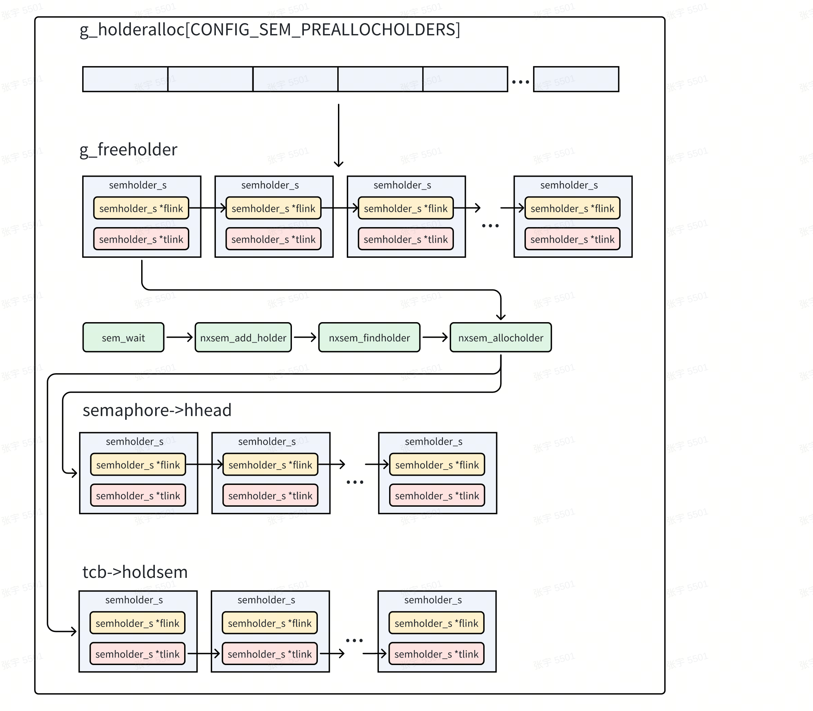
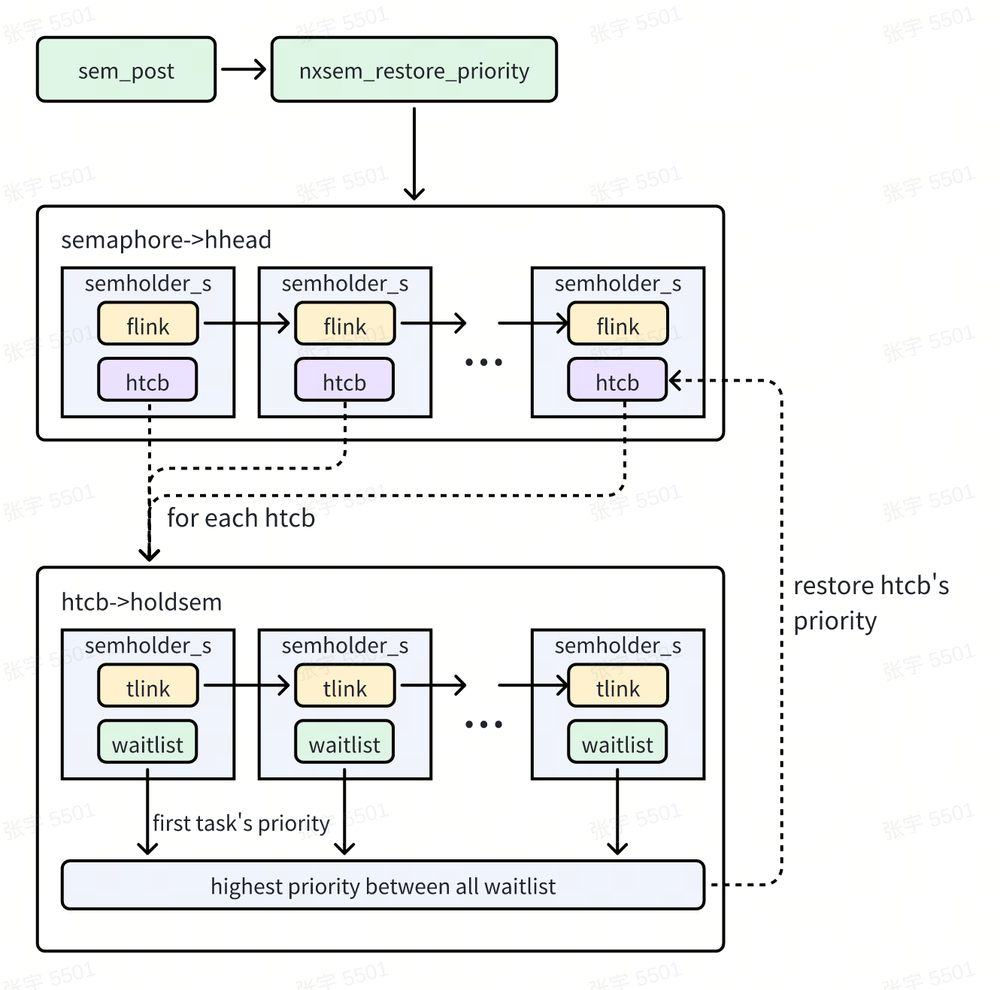
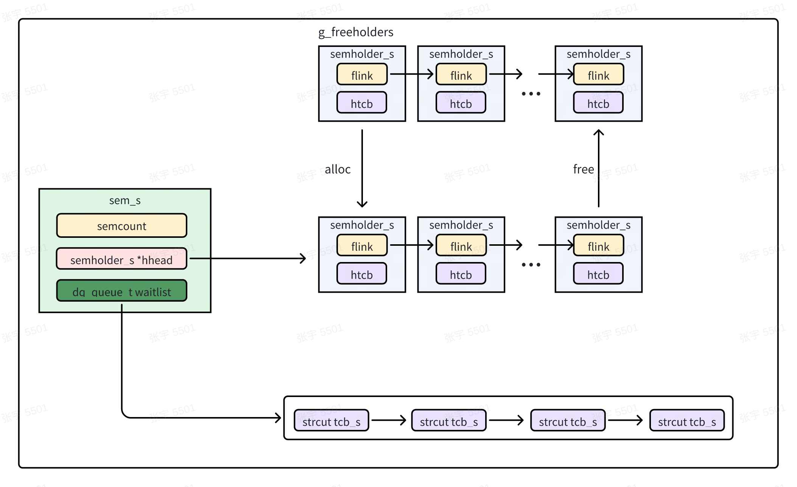

# 信号量机制

## 一、概述

### 1、信号量

在 openvela 中，信号量是实现同步和互斥操作的基础机制，且支持 POSIX 信号量标准。

信号量是对资源进行独占访问的首选机制。尽管 `sched_lock()` 和 `sched_unlock()` 接口也可以实现类似功能，但它们可能会对系统性能产生不良影响：

- `sched_lock()`：会禁止高优先级任务的运行，即使这些任务并不依赖于受信号量保护的资源。这会降低系统的响应能力。

因此，建议优先使用信号量来实现资源的独占管理。

### 2、优先级反转

正确使用信号量可以避免 `sched_lock()` 带来的问题，但在某些情况下，仍可能出现优先级反转的问题。优先级反转是指高优先级任务因低优先级任务持有的资源而被阻塞，导致系统性能下降的现象。

以下是一个典型的优先级反转场景：

1. 低优先级任务 `Task C` 获取信号量，从而独占对受保护资源的访问。
2. `Task C` 被挂起，操作系统切换到高优先级任务 `Task A`。
3. `Task A` 试图获取信号量，但由于信号量被 `Task C` 持有，`Task A` 被阻塞。
4. 操作系统允许 `Task C` 再次运行，但此时中等优先级任务 `Task B` 抢占了 `Task C` 的运行时间。
5. 在 `Task B`（以及可能其他中等优先级任务）完成之前，`Task C` 无法释放信号量，导致高优先级任务 `Task A` 无法执行。

这种现象表现为：高优先级任务 `Task A` 的执行被中等优先级任务 `Task B` 阻塞，看起来 `Task A` 的优先级比 `Task B` 更低。这就是优先级反转。

#### 解决优先级反转

在一些操作系统中，可以通过以下机制来避免优先级反转问题：

1. 优先级保护（Priority Ceiling Protocol）：

    在任务获取信号量时，将任务的优先级提升到信号量所保护资源的最高优先级，确保其他任务无法抢占该任务。

2. 优先级继承（Priority Inheritance Protocol）：

    当高优先级任务被阻塞时，将持有信号量的低优先级任务的优先级提升到与被阻塞任务相同的优先级，直到信号量被释放。

通过这些机制，可以有效降低优先级反转对系统性能的影响，确保高优先级任务能够按预期执行。

### 3、优先级保护

#### 概述

在 openvela 中，可以通过配置项 `CONFIG_PRIORITY_PROTECT` 启用信号量的优先级保护功能。相比于优先级继承，优先级保护的实现相对简单，主要基于优先级天花板的思想。

当一个任务获取某个信号量时，系统会将该任务的优先级直接提升到信号量预设的优先级天花板。直到任务释放信号量时，任务的优先级才会恢复到原始值。

这种机制确保任何持有信号量的任务都能以足够高的优先级运行，从而避免高优先级任务被低优先级任务阻塞。

#### 优先级保护的实现

以下是优先级保护的两个核心函数：`nxsem_protect_wait` 和 `nxsem_protect_post`。

1. nxsem_protect_wait

    该函数用于尝试锁定受保护的信号量，并将任务的优先级提升到信号量的优先级天花板。

    ```C
    /****************************************************************************
    * Name: nxsem_protect_wait
    *
    * Description:
    *   This function attempts to lock the protected semaphore, set the
    *   holder tcb priority to ceiling priority.
    *
    ****************************************************************************/
    int nxsem_protect_wait(FAR sem_t *sem)
    {
    if ((sem->flags & SEM_PRIO_MASK) == SEM_PRIO_PROTECT)
        {
        FAR struct tcb_s *rtcb = this_task();

        // 检查当前任务优先级是否高于信号量的优先级天花板  
        if (rtcb->sched_priority > sem->ceiling)
            {
            // 返回错误，表示优先级不符合要求  
            return -EINVAL; 
            }

        // 保存当前任务的优先级，并将其提升到信号量的优先级天花板  
        sem->saved = rtcb->sched_priority;
        rtcb->sched_priority = sem->ceiling;
        }

    // 成功锁定信号量  
    return OK;
    }
    ```

2. 该函数用于解锁受保护的信号量，并恢复任务的原始优先级。

    ```C
    /****************************************************************************
    * Name: nxsem_protect_post
    *
    * Description:
    *   This function attempts to unlock the protected semaphore, restore the
    *   holder tcb priority.
    *
    ****************************************************************************/

    void nxsem_protect_post(FAR sem_t *sem)
    {
    if (sem->saved > 0)
        {
        // 恢复任务的原始优先级  
        nxsched_set_priority(this_task(), sem->saved);
        // 清除保存的优先级
        sem->saved = 0;
        }
    }
    ```

### 4、优先级继承

#### 概述

在 openvela 中，优先级继承功能基于 POSIX 信号量 实现。这是因为信号量是 openvela 中最基础的等待机制，大多数其他等待方式（如互斥锁）都依赖于信号量。因此，为 POSIX 信号量实现优先级继承功能，也意味着大多数等待机制都具备了优先级继承的能力。

通过配置项 `CONFIG_PRIORITY_INHERITANCE`，可以启用信号量的优先级继承功能。相比优先级保护，优先级继承的实现稍显复杂，因为信号量可能同时被多个任务持有。为了实现优先级继承，系统需要分配内部数据结构来管理信号量与任务之间的关系。

#### 数据结构

优先级继承的实现依赖以下两个核心数据结构：`semholder_s` 和 `sem_s`。

1. semholder_s

    `semholder_s` 描述了信号量的持有者及其相关信息。其主要数据成员包括：

    - `tcb_s *htcb`：指向信号量持有者的任务控制块（TCB）。
    - `sem_s *sem`：指向持有的信号量。
    - `semholder_s *flink`：信号量持有者链表的下一个节点（一个信号量可能被多个任务持有）。
    - `semholder_s *tlink`：任务持有信号量链表的下一个节点（一个任务可能持有多个信号量）。
    - `int32_t counts`：当前持有者对某个信号量的持有次数。

    ```C
    /* This structure contains information about the holder of a semaphore */
    struct semholder_s
    {
    #if CONFIG_SEM_PREALLOCHOLDERS > 0
    FAR struct semholder_s *flink;  /* List of semaphore's holder            */
    #endif
    FAR struct semholder_s *tlink;  /* List of task held semaphores          */
    FAR struct sem_s *sem;          /* Ths corresponding semaphore           */
    FAR struct tcb_s *htcb;         /* Ths corresponding TCB                 */
    int32_t counts;                 /* Number of counts owned by this holder */
    };    
    ```

2. sem_s

    `sem_s` 描述了信号量本身及其相关信息。

    其主要数据成员包括：

    - `int32_t semcount`：信号量的计数值。
        - 大于 0 表示信号量可用的资源数量。
        - 小于 0 表示等待信号量的任务数量。

    - `uint8_t flags`：信号量的协议属性值。

    - `dq_queue_t waitlist`：信号量的阻塞任务列表。

    - `semholder_s *hhead`：优先级继承下的信号量持有者链表。

    - `semholder_s holder`: 非优先级继承下的信号量持有者。

    - `uint8_t ceiling`：优先级保护下的优先级天花板（仅在优先级保护启用时使用）。

    - `uint8_t saved`：存储优先级保护下任务的原始优先级。

    ```C
    /* This is the generic semaphore structure. */
    struct sem_s
    {
    volatile int32_t semcount;     /* >0 -> Num counts available */
                                    /* <0 -> Num tasks waiting for semaphore */

    /* If priority inheritance is enabled, then we have to keep track of which
    * tasks hold references to the semaphore.
    */

    uint8_t flags;                 /* See SEM_PRIO_* definitions */

    dq_queue_t waitlist;

    #ifdef CONFIG_PRIORITY_INHERITANCE
    #  if CONFIG_SEM_PREALLOCHOLDERS > 0
    FAR struct semholder_s *hhead; /* List of holders of semaphore counts */
    #  else
    struct semholder_s holder;     /* Slot for old and new holder */
    #  endif
    #endif
    #ifdef CONFIG_PRIORITY_PROTECT
    uint8_t ceiling;               /* The priority ceiling owned by mutex  */
    uint8_t saved;                 /* The saved priority of thread before boost */
    #endif
    };
    ```

#### 优先级继承的实现过程

1. 信号量的获取。

    当任务尝试获取信号量时，系统会执行以下步骤：

    1. 遍历信号量的持有者链表，判断当前任务是否已经持有该信号量。

    2. 如果未持有信号量，则从 `g_freeholder` 中申请一个 `semholder_s` 结构。

        - `g_freeholder` 是一个预分配的数组，大小由 `CONFIG_SEM_PREALLOCHOLDERS` 定义，并以链表形式组织。

    3. 将申请到的 `semholder_s` 插入到信号量的持有者链表和任务的持有信号量链表中。

    4. 增加当前任务对该信号量的持有次数。

        

2. 优先级的继承。

    当任务未能成功获取信号量时，系统会执行以下步骤：

    1. 遍历信号量的持有者链表，找到所有比当前任务优先级低的任务。
    2. 将这些低优先级任务的优先级提升到当前任务的优先级。
    3. 这种优先级提升会持续到信号量被释放为止。

3. 优先级的恢复。

    当任务准备释放信号量时，系统会恢复相关任务的优先级。恢复过程如下：

    1. 遍历信号量的持有者链表，找到所有相关任务。
    2. 对每个相关任务，遍历其持有的信号量链表。
    3. 从每个信号量的阻塞列表中取出第一个任务的优先级（阻塞列表是按优先级排序的，第一个任务的优先级最高）。
    4. 将最高优先级作为相关任务的新优先级。

    

#### 优先级继承的配置项

- `CONFIG_PRIORITY_INHERITANCE`：启用优先级继承功能。
- `CONFIG_SEM_PREALLOCHOLDERS`：定义支持优先级继承的信号量可以同时被多少个不同线程持有。

### 5、Locking 信号量 VS Signaling 信号量

#### Locking 信号量

Locking 信号量 的典型用途是用于对共享资源的独占访问，也就是对临界区的保护。

当需要独占访问临界区时，线程通过信号量来获取资源的访问权限，完成操作后释放信号量的计数。

在这种场景下，优先级继承 是适用的，因为它可以解决优先级反转问题，确保高优先级任务不会因低优先级任务持有信号量而被阻塞。

特点：

- 用于保护临界区，确保同一时间只有一个线程访问共享资源。
- 信号量的计数由同一个线程负责获取和释放。
- 支持优先级继承，避免优先级反转。

#### Signaling 信号量

Signaling 信号量的用途是用于线程之间的通信和同步。

在这种场景下，一个线程（线程 A）会等待信号量上的事件发生，而另一个线程（线程 B）会在事件发生时发送信号量，唤醒等待的线程 A。这种用法本质上是一种线程的同步机制。

与 Locking 信号量不同，Signaling 信号量的计数操作由两个不同的线程完成：

- 一个线程等待信号量（`wait` 操作）。
- 另一个线程发送信号量（`post` 操作）。

在这种情况下，不应该使用优先级继承，否则可能会导致一些意外行为，例如错误地提升线程优先级，破坏线程同步的逻辑。

特点：

- 用于线程之间的同步和通信。
- 信号量的计数由不同线程分别负责获取和释放。
- 不支持优先级继承。

## 二、函数接口说明

1. `int sem_init(sem_t *sem, int pshared, unsigned int value)`

    功能：初始化未命名信号量 `sem`。

    参数：

    - `sem`：指向需要初始化的信号量。
    - `pshared`：未使用。
    - `value`：信号量的初始值。

    说明：完成初始化后，信号量可用于以下接口：

    `sem_wait()`、`sem_post()`、`sem_trywait()` 等。

2. `int sem_destroy(sem_t *sem)`

    功能：销毁未命名信号量 `sem`。

    注意事项：

    仅能销毁通过 `sem_init()` 创建的信号量。

    销毁命名信号量的行为未定义。

    在调用 `sem_destroy()` 后尝试使用信号量的行为未定义。

3. `sem_t *sem_open(const char *name, int oflag, ...)`

    功能：在任务（Task）和命名信号量之间建立连接。

    说明：

    通过信号量名称调用 `sem_open()` 后，关联的任务可以使用该函数返回的地址引用对应的信号量。

4. `int sem_close(sem_t *sem)`

    功能：关闭命名信号量。

    说明：

    - 释放系统为该命名信号量分配的资源。
    - 如果未使用 `sem_unlink()` 删除信号量，`sem_close()` 对信号量无影响。
    - 当信号量被完全解除链接（调用 `sem_unlink()` 后），信号量将在最后一个任务关闭它时消失。

    注意事项：

    必须小心避免删除其他任务正在锁定的信号量。

5. `int sem_unlink(const char *name)`

    功能：删除命名信号量。

    说明：

    如果有一个或多个任务正在使用信号量，销毁操作会被延迟，直到所有引用都通过 `sem_close()` 被释放。

6. `int sem_wait(sem_t *sem)`

    功能：尝试锁定信号量 `sem`。

    说明：如果信号量已被锁定，调用任务将阻塞，直到成功获取锁或操作被信号中断。

7. `int sem_timedwait(sem_t *sem, const struct timespec *abstime)`

    功能：尝试锁定信号量，支持超时机制。

    说明：与 `sem_wait()` 类似，但如果在指定时间内没有其他线程通过 `sem_post()` 释放信号量，等待操作将超时终止。

8. `int sem_trywait(sem_t *sem)`

    功能：尝试非阻塞锁定信号量。

    说明：仅在信号量未锁定时成功锁定，否则立即返回，不会阻塞。

9. `int sem_post(sem_t *sem)`

    功能：释放信号量。

    说明：

    - 当任务使用完信号量时调用，解锁信号量。
    - 如果信号量值为正数，不会阻塞等待信号量的任务，信号量值递增。
    - 如果信号量值为 0，则唤醒阻塞的任务，使其从 `sem_wait()` 调用中成功返回。

    注意事项：可以从中断处理程序中调用此函数。

10. `int sem_getvalue(sem_t *sem, int *sval)`

    功能：获取信号量的当前值。

    说明：

    - 如果信号量被锁定，值为 0 或负数。
    - 负数的绝对值表示等待信号量的任务数量。

11. `int sem_getprotocol(FAR const pthread_mutexattr_t *attr, FAR int *protocol)`

    功能：获取信号量的协议属性值。

    返回值：协议属性值可以是以下之一：

    - `SEM_PRIO_NONE`：无优先级处理。
    - `SEM_PRIO_INHERIT`：支持优先级继承。
    - `SEM_PRIO_PROTECT`：支持优先级保护。

12. `int sem_setprotocol(FAR pthread_mutexattr_t *attr, int protocol)`

    功能：设置信号量的协议属性值。

    可选值：

    - `SEM_PRIO_NONE`：无优先级处理。
    - `SEM_PRIO_INHERIT`：支持优先级继承。
    - `SEM_PRIO_PROTECT`：支持优先级保护。

## 三、原理

以下内容详细说明了信号量在 openvela 系统中的实现原理，包括相关函数的代码逻辑和处理流程。信号量主要用于任务同步与互斥，确保多任务系统的安全和高效运行。

### 1、信号量框架概述

信号量在 openvela 系统中的实现由以下核心结构和队列组成：



信号量整体的框架如上图所示，与之相关的结构如下：

1. `struct sem_s`

    - 描述：信号量的核心数据结构。
    - 主要字段：
        - 计数值：维护信号量的当前状态。
            - 当任务调用 `sem_wait()` 等待信号量时，计数值减 1。
            - 当任务调用 `sem_post()` 释放信号量时，计数值加 1。
        - 持有者链表（hhead）：存储所有尝试获取信号量的任务，链表形式组织。

2. `g_freeholder`

    - 描述：全局任务持有者队列。
    - 功能：
        - 预先静态分配所有持有者数据结构（仅在 `CONFIG_SEM_PREALLOCHOLDERS` 配置使能时生效）。
        - 当任务需要等待信号量时，从全局队列中分配一个持有者结构。
        - 当信号量被释放时，将持有者结构返回到全局队列。

3. `waitlist`

    - 描述：有序任务等待队列。
    - 功能：
        - 当任务调用 `sem_wait()` 而无法获取信号量时，任务会被添加到 `sem->waitlist` 并让出 CPU。
        - 当任务调用 `sem_post()` 释放信号量时，会查询 `sem->waitlist` 是否有等待任务，并唤醒队列中的第一个任务。

4. `struct semholder_s`

    - 描述：信号量持有者结构。

    - 主要字段：

        - `struct tcb_s`：指向等待信号量的任务。
            - `waitobj`：指向任务正在等待的信号量。
        - `counts`：记录任务获取同一信号量的次数。

### 2、关键函数分析

#### `sem_wait()`函数

`sem_wait()` 是信号量操作的核心函数之一，主要用于获取信号量。当信号量不可用时，调用任务将进入阻塞状态。

##### 主要功能

- 中断上下文检查：

    确保 `sem_wait()` 未在中断上下文中调用，因为该函数可能触发任务调度并导致任务进入睡眠状态。

- 信号量可用时：
    - 将信号量计数值减 1。
    - 如果启用了优先级继承机制，将调用任务添加到信号量的持有者链表中。
- 信号量不可用时：
    - 将信号量计数值减 1。
    - 设置调用任务的 `waitobj` 为当前信号量。
    - 如果启用了优先级继承机制，提升信号量持有者中优先级低于当前任务的任务优先级。
    - 将调用任务从就绪队列移除，并添加到信号量的等待队列 `sem->waitlist`。
    - 主动进行上下文切换，等待信号量释放。

##### 实现细节

`sem_wait()` 的主要工作由内部函数 `nxsem_wait_slow()` 完成。

```C
static int nxsem_wait_slow(FAR sem_t *sem)
{
  FAR struct tcb_s *rtcb;
  irqstate_t flags;
  int ret;

  /* The following operations must be performed with interrupts
   * disabled because nxsem_post() may be called from an interrupt
   * handler.
   */

  flags = enter_critical_section();

  /* Make sure we were supplied with a valid semaphore. */

  /* Check if the lock is available */

  if (atomic_fetch_sub(NXSEM_COUNT(sem), 1) > 0)
    {
      /* It is, let the task take the semaphore. */

      ret = nxsem_protect_wait(sem);
      if (ret < 0)
        {
          atomic_fetch_add(NXSEM_COUNT(sem), 1);
          leave_critical_section(flags);
          return ret;
        }

      nxsem_add_holder(sem);
    }

  /* The semaphore is NOT available, We will have to block the
   * current thread of execution.
   */

  else
    {
#ifdef CONFIG_PRIORITY_INHERITANCE
      uint8_t prioinherit = sem->flags & SEM_PRIO_MASK;
#endif
      rtcb = this_task();

      /* First, verify that the task is not already waiting on a
       * semaphore
       */

      DEBUGASSERT(rtcb->waitobj == NULL);

      /* Save the waited on semaphore in the TCB */

      rtcb->waitobj = sem;

      /* If priority inheritance is enabled, then check the priority of
       * the holder of the semaphore.
       */

#ifdef CONFIG_PRIORITY_INHERITANCE
      if (prioinherit == SEM_PRIO_INHERIT)
        {
          /* Disable context switching.  The following operations must be
           * atomic with regard to the scheduler.
           */

          sched_lock();

          /* Boost the priority of any threads holding a count on the
           * semaphore.
           */

          nxsem_boost_priority(sem);
        }
#endif

      /* Set the errno value to zero (preserving the original errno)
       * value).  We reuse the per-thread errno to pass information
       * between sem_waitirq() and this functions.
       */

      rtcb->errcode = OK;

      /* Add the TCB to the prioritized semaphore wait queue, after
       * checking this is not the idle task - descheduling that
       * isn't going to end well.
       */

      DEBUGASSERT(!is_idle_task(rtcb));

      /* Remove the tcb task from the running list. */

      nxsched_remove_self(rtcb);

      /* Add the task to the specified blocked task list */

      rtcb->task_state = TSTATE_WAIT_SEM;
      nxsched_add_prioritized(rtcb, SEM_WAITLIST(sem));

      /* Now, perform the context switch */

      up_switch_context(this_task(), rtcb);

      /* When we resume at this point, either (1) the semaphore has been
       * assigned to this thread of execution, or (2) the semaphore wait
       * has been interrupted by a signal or a timeout.  We can detect
       * these latter cases be examining the per-thread errno value.
       *
       * In the event that the semaphore wait was interrupted by a
       * signal or a timeout, certain semaphore clean-up operations have
       * already been performed (see sem_waitirq.c).  Specifically:
       *
       * - nxsem_canceled() was called to restore the priority of all
       *   threads that hold a reference to the semaphore,
       * - The semaphore count was decremented, and
       * - tcb->waitobj was nullifed.
       *
       * It is necessary to do these things in sem_waitirq.c because a
       * long time may elapse between the time that the signal was issued
       * and this thread is awakened and this leaves a door open to
       * several race conditions.
       */

      /* Check if an error occurred while we were sleeping.  Expected
       * errors include EINTR meaning that we were awakened by a signal
       * or ETIMEDOUT meaning that the timer expired for the case of
       * sem_timedwait().
       *
       * If we were not awakened by a signal or a timeout, then
       * nxsem_add_holder() was called by logic in sem_wait() fore this
       * thread was restarted.
       */

      ret = rtcb->errcode != OK ? -rtcb->errcode : OK;

#ifdef CONFIG_PRIORITY_INHERITANCE
      if (prioinherit != 0)
        {
          sched_unlock();
        }
#endif
    }

  leave_critical_section(flags);
  return ret;
}
```

#### sem_post() 函数

`sem_post()` 是信号量操作的关键函数之一，用于释放信号量。当信号量的等待队列中有任务时，该函数会唤醒优先级最高的等待任务并重新调度。

##### 主要功能

- 减少信号量持有计数。

    调用 `nxsem_release_holder()` 接口，将当前任务持有信号量的计数值减 1。

- 增加信号量计数值。

    信号量计数值增加 1。如果信号量计数值超过允许的最大值（`SEM_VALUE_MAX`），函数返回错误码 `-EOVERFLOW`。

- 唤醒等待任务。
    - 当信号量计数值小于等于 0 时，表示有任务正在等待信号量。
    - 从 `sem->waitlist` 优先级有序队列中取出第一个任务，将其添加到信号量持有者队列。
    - 停止任务的看门狗定时器（如果启用了超时机制）。
    - 将该任务调度为可运行状态。
- 恢复任务优先级。

    调用 `nxsem_restore_baseprio()` 接口恢复任务的优先级（如果发生过优先级调整）。当任务持有信号量的计数值减为 0 时，释放该任务的持有者状态。

##### 实现细节

`sem_post()` 的主要逻辑由内部函数 nxsem_post_slow() 实现。以下是其关键流程：

``` C
static int nxsem_post_slow(FAR sem_t *sem)
{
  FAR struct tcb_s *stcb = NULL;
  irqstate_t flags;
  int32_t sem_count;
#if defined(CONFIG_PRIORITY_INHERITANCE) || defined(CONFIG_PRIORITY_PROTECT)
  uint8_t proto;
#endif

  /* The following operations must be performed with interrupts
   * disabled because sem_post() may be called from an interrupt
   * handler.
   */

  flags = enter_critical_section();

  /* Check the maximum allowable value */

  sem_count = atomic_read(NXSEM_COUNT(sem));
  do
    {
      if (sem_count >= SEM_VALUE_MAX)
        {
          leave_critical_section(flags);
          return -EOVERFLOW;
        }
    }
  while (!atomic_try_cmpxchg_release(NXSEM_COUNT(sem), &sem_count,
                                     sem_count + 1));

  /* Perform the semaphore unlock operation, releasing this task as a
   * holder then also incrementing the count on the semaphore.
   *
   * NOTE:  When semaphores are used for signaling purposes, the holder
   * of the semaphore may not be this thread!  In this case,
   * nxsem_release_holder() will do nothing.
   *
   * In the case of a mutex this could be simply resolved since there is
   * only one holder but for the case of counting semaphores, there may
   * be many holders and if the holder is not this thread, then it is
   * not possible to know which thread/holder should be released.
   *
   * For this reason, it is recommended that priority inheritance be
   * disabled via nxsem_set_protocol(SEM_PRIO_NONE) when the semaphore is
   * initialized if the semaphore is to used for signaling purposes.
   */

  nxsem_release_holder(sem);

#if defined(CONFIG_PRIORITY_INHERITANCE) || defined(CONFIG_PRIORITY_PROTECT)
  /* Don't let any unblocked tasks run until we complete any priority
   * restoration steps.  Interrupts are disabled, but we do not want
   * the head of the ready-to-run list to be modified yet.
   *
   * NOTE: If this sched_lock is called from an interrupt handler, it
   * will do nothing.
   */

  proto = sem->flags & SEM_PRIO_MASK;
  if (proto != SEM_PRIO_NONE)
    {
      sched_lock();
    }
#endif

  /* If the result of semaphore unlock is non-positive, then
   * there must be some task waiting for the semaphore.
   */

  if (sem_count < 0)
    {
      /* Check if there are any tasks in the waiting for semaphore
       * task list that are waiting for this semaphore.  This is a
       * prioritized list so the first one we encounter is the one
       * that we want.
       */

      stcb = (FAR struct tcb_s *)dq_remfirst(SEM_WAITLIST(sem));

      if (stcb != NULL)
        {
          FAR struct tcb_s *rtcb = this_task();

          /* The task will be the new holder of the semaphore when
           * it is awakened.
           */

          nxsem_add_holder_tcb(stcb, sem);

          /* Stop the watchdog timer */

          if (WDOG_ISACTIVE(&stcb->waitdog))
            {
              wd_cancel(&stcb->waitdog);
            }

          /* Indicate that the wait is over. */

          stcb->waitobj = NULL;

          /* Add the task to ready-to-run task list and
           * perform the context switch if one is needed
           */

          if (nxsched_add_readytorun(stcb))
            {
              up_switch_context(stcb, rtcb);
            }
        }
#if 0 /* REVISIT:  This can fire on IOB throttle semaphore */
      else
        {
          /* This should not happen. */

          DEBUGPANIC();
        }
#endif
    }

  /* Check if we need to drop the priority of any threads holding
   * this semaphore.  The priority could have been boosted while they
   * held the semaphore.
   */

#if defined(CONFIG_PRIORITY_INHERITANCE) || defined(CONFIG_PRIORITY_PROTECT)
  if (proto != SEM_PRIO_NONE)
    {
      if (proto == SEM_PRIO_INHERIT)
        {
#ifdef CONFIG_PRIORITY_INHERITANCE
          nxsem_restore_baseprio(stcb, sem);
#endif
        }
      else if (proto == SEM_PRIO_PROTECT)
        {
          nxsem_protect_post(sem);
        }

      sched_unlock();
    }
#endif

  /* Interrupts may now be enabled. */

  leave_critical_section(flags);

  return OK;
}
```

#### sem_clockwait() 和 sem_timedwait()

`sem_clockwait()` 和 `sem_timedwait()` 是信号量操作的扩展函数，提供了超时机制。它们的功能与 `sem_wait()` 类似，但增加了一个超时时间参数。当在指定时间内未能获取信号量时，任务会被超时回调函数唤醒并处理。

##### 主要功能

- 超时机制。
    - 定时器设置：函数在调用时会根据指定的超时时间创建一个看门狗计时器。
    - 超时处理：如果超时时间到达且仍未获取信号量，会触发回调函数 `nxse``m_timeout``()`，取消任务的等待状态并重新调度。
- 信号量获取。
    - 尝试立即获取信号量，若成功直接返回。
    - 若信号量不可用，则进入阻塞状态，等待信号量释放或超时。
- 信号量释放后的处理。
    - 如果在超时前成功获取信号量，停止看门狗计时器。
    - 如果超时或被中断，任务会被唤醒并进行状态恢复。

##### 实现细节

```C
int nxsem_clockwait(FAR sem_t *sem, clockid_t clockid,
                    FAR const struct timespec *abstime)
{
  FAR struct tcb_s *rtcb = this_task();
  irqstate_t flags;
  int ret = ERROR;

  DEBUGASSERT(sem != NULL && abstime != NULL);
  DEBUGASSERT(up_interrupt_context() == false);

  /* We will disable interrupts until we have completed the semaphore
   * wait.  We need to do this (as opposed to just disabling pre-emption)
   * because there could be interrupt handlers that are asynchronously
   * posting semaphores and to prevent race conditions with watchdog
   * timeout.  This is not too bad because interrupts will be re-
   * enabled while we are blocked waiting for the semaphore.
   */

  flags = enter_critical_section();

  /* Try to take the semaphore without waiting. */

  ret = nxsem_trywait(sem);
  if (ret == OK)
    {
      /* We got it! */

      goto out;
    }

  /* We will have to wait for the semaphore.  Make sure that we were provided
   * with a valid timeout.
   */

#ifdef CONFIG_DEBUG_FEATURES
  if (abstime->tv_nsec < 0 || abstime->tv_nsec >= 1000000000)
    {
      ret = -EINVAL;
      goto out;
    }
#endif

  if (clockid == CLOCK_REALTIME)
    {
      wd_start_realtime(&rtcb->waitdog, abstime,
                        nxsem_timeout, (uintptr_t)rtcb);
    }
  else
    {
      wd_start_abstime(&rtcb->waitdog, abstime,
                       nxsem_timeout, (uintptr_t)rtcb);
    }

  /* Now perform the blocking wait.  If nxsem_wait() fails, the
   * negated errno value will be returned below.
   */

  ret = nxsem_wait(sem);

  /* Stop the watchdog timer */

  wd_cancel(&rtcb->waitdog);

  /* We can now restore interrupts and delete the watchdog */

out:
  leave_critical_section(flags);
  return ret;
}

void nxsem_timeout(wdparm_t arg)
{
  FAR struct tcb_s *wtcb = (FAR struct tcb_s *)(uintptr_t)arg;
  irqstate_t flags;

  /* Disable interrupts to avoid race conditions */

  flags = enter_critical_section();

  /* It is also possible that an interrupt/context switch beat us to the
   * punch and already changed the task's state.
   */

  if (wtcb->task_state == TSTATE_WAIT_SEM)
    {
      /* Cancel the semaphore wait */

      nxsem_wait_irq(wtcb, ETIMEDOUT);
    }

  /* Interrupts may now be enabled. */

  leave_critical_section(flags);
}

void nxsem_wait_irq(FAR struct tcb_s *wtcb, int errcode)
{
  FAR struct tcb_s *rtcb = this_task();
  FAR sem_t *sem = wtcb->waitobj;

#ifdef CONFIG_ARCH_ADDRENV
  FAR struct addrenv_s *oldenv;

  if (wtcb->addrenv_own)
    {
      addrenv_select(wtcb->addrenv_own, &oldenv);
    }
#endif

  /* It is possible that an interrupt/context switch beat us to the punch
   * and already changed the task's state.
   */

  DEBUGASSERT(sem != NULL && atomic_read(NXSEM_COUNT(sem)) < 0);

  /* Restore the correct priority of all threads that hold references
   * to this semaphore.
   */

  nxsem_canceled(wtcb, sem);

  /* And increment the count on the semaphore.  This releases the count
   * that was taken by sem_post().  This count decremented the semaphore
   * count to negative and caused the thread to be blocked in the first
   * place.
   */

  atomic_fetch_add(NXSEM_COUNT(sem), 1);

  /* Remove task from waiting list */

  dq_rem((FAR dq_entry_t *)wtcb, SEM_WAITLIST(sem));

#ifdef CONFIG_ARCH_ADDRENV
  if (wtcb->addrenv_own)
    {
      addrenv_restore(oldenv);
    }
#endif

  /* Indicate that the wait is over. */

  wtcb->waitobj = NULL;

  /* Mark the errno value for the thread. */

  wtcb->errcode = errcode;

  /* Add the task to ready-to-run task list and
   * perform the context switch if one is needed
   */

  if (nxsched_add_readytorun(wtcb))
    {
      up_switch_context(wtcb, rtcb);
    }
}
```

## 四、总结

在 openvela 中，信号量是一种用于任务同步和互斥处理的重要机制。当任务无法获取信号量时，它会被添加到信号量的等待队列中并进入阻塞状态。当信号量被释放时，系统会从等待队列中查找任务并重新调度其执行。

此外，为了解决可能出现的优先级反转问题，openvela 提供了两种常见的解决方案：

1. 优先级保护：通过预定义的优先级策略，确保任务的优先级不会被错误降低。
2. 优先级继承：当高优先级任务等待信号量时，临时提升低优先级任务的优先级，以避免优先级反转。

这些机制确保了 openvela 在多任务环境下的实时性和稳定性，同时提高了系统的可靠性和任务调度的效率。
