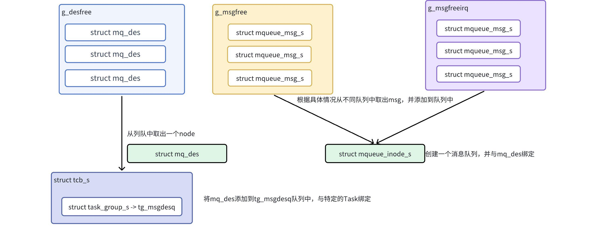

# 消息队列开发指南

\[ [English](../../../../en/device_dev_guide/kernel/IPC/message_queue.md) | 简体中文 \]

## 一、概述

本文档为您介绍如何在 openvela 操作系统中使用 POSIX (Portable Operating System Interface) 消息队列。消息队列是实现任务间可靠、异步通信的关键机制。

openvela OS 遵循 **POSIX** 标准，提供了一套完整的消息队列 API，允许任何任务（Task）或中断服务程序（ISR）安全地发送和接收数据。此标准化的接口确保了代码的良好可移植性。

核心特性：

- **命名队列**： 消息队列通过全局唯一的名称进行标识，允许多个不相关的任务访问同一个队列。
- **优先级消息**： 任务可以为发送的消息指定优先级，高优先级的消息会优先被接收。
- **阻塞与非阻塞操作**： API 支持阻塞、非阻塞和超时三种模式，为不同应用场景提供灵活的同步策略。
- **中断安全**： 您可以在中断服务程序中安全地发送消息。

## 二、前置概念

在源码中，频繁出现几组用于同步和互斥的底层宏/函数，理解它们对于深入分析内核行为至关重要。

### 1、`enter_critical_section/leave_critical_section`

这两个函数用于创建**临界区**，是系统中最强级别的锁。

- **作用**：在单核系统中，它通过**关闭中断**来实现。在多核系统中，它还会结合自旋锁（Spinlock）使用。
- **目的**：保护的不仅仅是多任务间的共享数据，更重要的是保护了任务与中断服务程序 (ISR) 之间的共享数据。因为 `mq_send` 可以在中断中被调用，所以对消息链表、计数值等核心数据的修改，必须在完全禁止并发（包括中断）的环境下进行。
- **使用原则**：临界区应尽可能短，因为关中断会增加系统的中断延迟。

#### 2、`sched_lock/sched_unlock`

这对函数用于锁定/解锁**调度器**。

- **作用**：禁止任务的上下文切换，即禁止任务抢占。
- **与临界区的区别**：它不关闭中断。在调度器被锁住期间，中断仍然可以正常发生和处理，只是中断处理完毕后，系统不会进行任务切换，会继续运行被锁定的任务。
- **目的**：用于保护一段逻辑的原子性，确保它在执行期间不会因为被更高优先级的任务抢占而中断。它的开销比开关中断要小。

#### 3、`enter_cancellation_point/leave_cancellation_point`

这对函数与 POSIX 的线程取消 (Thread Cancellation) 机制相关。

- 作用：定义一个取消点。根据 POSIX 标准，像 `mq_receive`, `read`, `sleep` 等可能永久阻塞的函数都必须是取消点。
- 目的：当一个任务（线程）被其他任务请求取消时（例如通过 `pthread_cancel`），它并不会立即终止，而是会继续运行直到抵达下一个取消点。在取消点，系统会检查该任务是否有待处理的取消请求，如果有，则执行取消操作，使任务退出。这确保了任务可以在一个安全、已知的状态下被终止。

## 三、前提条件

在开始开发前，请在您的代码中包含头文件：

```C++
#include <mqueue.h>
```

## 四、API 参考

我们将 API 按其在消息队列生命周期中的作用进行分类：**生命周期管理**、**数据传输**、**属性与通知**。

### 1、生命周期管理

管理消息队列的创建、打开、关闭和删除。

#### `mq_open()` - 创建或打开消息队列

此函数打开一个已存在的消息队列，或根据 `oflags` 参数创建一个新的队列。成功调用后，它返回一个消息队列描述符 (`mqd_t`)，供后续函数使用。

```C
mqd_t mq_open(FAR const char *mq_name, int oflags, ...)
```

**参数**

| 参数    | 描述                                         |
| ------- | -------------------------------------------- |
| mq_name | 指向消息队列名称的字符串，例如 "/my_queue"。 |
| oflags  | 操作标志位，可使用按位或（\|）组合。         |

`oflags` 的常用值包括：

- 访问模式（三选一）：
    - `O_RDONLY`：以只读方式打开。
    - `O_WRONLY`：以只写方式打开。
    - `O_RDWR`：以读写方式打开。
- 创建标志（可选）：
    - `O_CREAT`：如果队列不存在，则创建它。
        - 使用此标志时，`mq_open` 需要两个额外参数：`mode_t mode` 和 `struct mq_attr *attr`。
    - `O_EXCL`：与 `O_CREAT` 配合使用，如果队列已存在，则调用失败。
    - `O_NONBLOCK`：以非阻塞模式打开。影响后续的 `mq_send()` 和 `mq_receive()` 调用。

#### `mq_close()` - 关闭消息队列

此函数断开调用任务与指定消息队列之间的连接。

```C
int mq_close(mqd_t mqdes)
```

**注意事项**

- 调用 `mq_close()` 并不会销毁消息队列本身，仅释放当前任务持有的描述符。
- 其他任务仍可通过 `mq_open()` 访问该队列。

#### `mq_unlink()` - 删除消息队列

此函数从系统中删除一个消息队列。

```C
int mq_unlink(FAR const char *mq_name)
```

该接口会删除名字为 `mq_name` 的消息队列。当有一个或多个 Task 打开一个消息队列，此时调用 `mq_unlink`，需要等到所有引用该消息队列的 Task 都执行关闭操作后，才会删除消息队列。 

**注意事项**

- 如果调用 `mq_unlink()` 时仍有任务打开了该队列，系统会将队列标记为“待删除”状态。
- 系统会等待所有引用该队列的任务都调用 `mq_close()` 后，才真正释放队列资源。

### 2、数据传输

负责在任务间发送和接收消息。

#### `mq_send()`/`mq_timedsend()` - 发送消息

```C
int mq_send(mqd_t mqdes, const void *msg, size_t msglen, int prio)
int mq_timedsend(mqd_t mqdes, const char *msg, size_t msglen, int prio,
                 const struct timespec *abstime);
```

行为特性

- 队列已满：
    - 如果队列已满且未设置 `O_NONBLOCK`：
        - `mq_send()` 会永久阻塞，直到队列有可用空间。
        - `mq_timedsend()` 会阻塞，直到 `abstime` 指定的绝对时间超时。
    - 如果设置了 `O_NONBLOCK`，函数会立即返回错误，而不会阻塞。
- 消息长度： `msglen` 不能超过队列属性中定义的最大消息长度 (`mq_msgsize`)。

#### `mq_receive()`/`mq_timedreceive()` 接收消息

这两个函数从指定队列中移除并返回优先级最高、等待时间最长的消息。

```C
ssize_t mq_receive(mqd_t mqdes, void *msg, size_t msglen, int *prio);
ssize_t mq_timedreceive(mqd_t mqdes, void *msg, size_t msglen,
                        int *prio, const struct timespec *abstime);
```

行为特性

- 队列为空：
    - 如果队列为空且未设置 `O_NONBLOCK`：
        - `mq_receive()` 会永久阻塞，直到有新消息到达。
        - `mq_timedreceive()` 会阻塞，直到 `abstime` 指定的绝对时间超时。
    - 如果设置了 `O_NONBLOCK`，函数会立即返回错误。
- 多任务等待： 如果有多个任务在等待同一个空队列，当新消息到达时，系统会唤醒等待时间最长且优先级最高的那个任务。
- 缓冲区大小： `msglen` 必须大于或等于队列的最大消息长度 (`mq_msgsize`)。

### 3、属性与通知

用于查询和配置消息队列的高级功能。

#### `mq_getattr()`/`mq_setattr()` - 获取与设置队列属性

这两个函数分别用于查询和修改消息队列的属性。

```C
int mq_getattr(mqd_t mqdes, FAR struct mq_attr *mq_stat);
int mq_setattr(mqd_t mqdes, FAR const struct mq_attr *mq_stat,
               FAR struct mq_attr *oldstat);
```

`struct mq_attr` 结构体包含：

| 成员       | 描述                                           |
| ---------- | ---------------------------------------------- |
| mq_flags   | 队列的标志（例如 O_NONBLOCK）。                |
| mq_maxmsg  | 队列可容纳的最大消息数。                       |
| mq_msgsize | 每条消息的最大字节数。                         |
| mq_curmsgs | 队列中当前的消息数（仅 mq_getattr() 可获取）。 |

#### `mq_notify()` - 注册异步通知

此函数为消息队列注册一个异步事件通知。当一个空队列接收到第一条消息时，系统会向注册的任务发送一个信号。

```C
int mq_notify(mqd_t mqdes, const struct sigevent *notification);
```

工作机制

1. 当输入参数 `notification` 非 `NULL` 时，`mq_notify` 会在当前任务与消息队列建立通知关联。
2. 当一条新消息被放入消息队列时，系统会向该任务发送 `notification` 中定义的信号。
3. 一次性通知： 发送信号后，该注册关系会自动解除。您必须重新调用 `mq_notify()` 才能接收下一次通知。
4. 当 `notification` 为 `NULL` 时，函数会移除已存在的通知关联。

**注意事项**

- 在任何时刻，只有一个任务可以成功注册对某个消息队列的通知。

## 五、数据结构

为了深入理解消息队列的工作机制，本节将介绍其在 openvela OS 内部的实现方式，包括核心数据结构和内存管理策略。

openvela OS 在架构上将每个 POSIX 消息队列实现为一个伪文件系统（Pseudo-filesystem）的 inode 节点。这种设计统一了内核资源模型，使得消息队列可以像文件一样被命名和访问。

其核心实现包含两大关键部分：**消息内存池**和**核心数据结构**。

### 1、消息内存池管理

为保证实时性和内存使用的确定性，openvela OS 采用预分配的内存池来管理消息实体。系统在启动时会创建两个专用的全局消息池。

- `g_msgfree`: 通用消息池。为普通任务（Task）提供消息存储空间。
    - 分配策略：当任务发送消息时，系统首先尝试从该池中获取一个预分配的消息块。
    - 动态扩展：如果该池耗尽，系统会尝试通过 `malloc()` 动态分配内存来创建新的消息块，并标记为 `MQ_ALLOC_DYN`。
    - 释放：消息被接收后，预分配的消息块会归还到 `g_msgfree` 池；动态分配的消息块则通过 `free()` 释放，防止内存泄漏。
- `g_msgfreeirq`: 中断专用消息池。专供中断服务程序（ISR）使用。
    - 分配策略：当中断服务程序发送消息时，系统从该池中获取消息块。
    - 无动态分配：为保证中断处理的快速和确定性，如果该池耗尽，系统将直接返回失败，绝不进行动态内存分配。
    - 释放：消息被接收后，消息块会归还到 `g_msgfreeirq` 池。

这种分离设计确保了即使在通用消息池耗尽或内存碎片化的情况下，中断服务中的关键通信依然能够可靠执行。

### 2、核心数据结构

消息队列的功能由两个核心结构体协同实现：

- `struct mqueue_inode_s` 定义了队列本身。
- `struct mqueue_msg_s` 定义了在队列中传递的消息。

#### 消息队列定义

`mqueue_inode_s` 代表一个完整的消息队列实例，包含了其所有属性和状态。

```C
/* Common prologue of all message queue structures. */

struct mqueue_cmn_s
{
  dq_queue_t waitfornotempty; /* Task list waiting for not empty */
  dq_queue_t waitfornotfull;  /* Task list waiting for not full */
  int16_t nwaitnotfull;       /* Number tasks waiting for not full */
  int16_t nwaitnotempty;      /* Number tasks waiting for not empty */
};

/* This structure defines a message queue */

struct mqueue_inode_s
{
  struct mqueue_cmn_s cmn;    /* Common prologue */
  FAR struct inode *inode;    /* Containing inode */
  struct list_node msglist;   /* Prioritized message list */
  int16_t maxmsgs;            /* Maximum number of messages in the queue */
  int16_t nmsgs;              /* Number of message in the queue */
#if CONFIG_MQ_MAXMSGSIZE < 256
  uint8_t maxmsgsize;         /* Max size of message in message queue */
#else
  uint16_t maxmsgsize;        /* Max size of message in message queue */
#endif
#ifndef CONFIG_DISABLE_MQUEUE_NOTIFICATION
  pid_t ntpid;                /* Notification: Receiving Task's PID */
  struct sigevent ntevent;    /* Notification description */
  struct sigwork_s ntwork;    /* Notification work */
#endif
  FAR struct pollfd *fds[CONFIG_FS_MQUEUE_NPOLLWAITERS];
};
```

**关键成员解析：**

| 成员          | 描述                                                      |
| ------------- | --------------------------------------------------------- |
| msglist       | 一个按优先级排序的链表，用于存储所有待处理的消息。        |
| ntpid/ntevent | 用于实现 mq_notify() 功能，记录哪个任务正在等待异步通知。 |

#### 消息实体

`mqueue_msg_s` 代表一条独立的消息，它作为链表节点存在于 `mqueue_inode_s` 的 `msglist` 中。

```C
enum mqalloc_e
{
  MQ_ALLOC_FIXED = 0,  /* pre-allocated; never freed */
  MQ_ALLOC_DYN,        /* dynamically allocated; free when unused */
  MQ_ALLOC_IRQ         /* Preallocated, reserved for interrupt handling */
};

/* This structure describes one buffered POSIX message. */
struct mqueue_msg_s
{
  FAR struct mqueue_msg_s *next;  /* Forward link to next message */
  uint8_t type;                   /* (Used to manage allocations) */
  uint8_t priority;               /* priority of message */
#if MQ_MAX_BYTES < 256
  uint8_t msglen;                 /* Message data length */
#else
  uint16_t msglen;                /* Message data length */
#endif
  char mail[1];                   /* Message data */
};
```

关键成员解析：

| 成员     | 描述                                                                   |
| -------- | ---------------------------------------------------------------------- |
| type     | 标记该消息块的来源，决定其被接收后是归还到内存池还是通过 free() 释放。 |
| priority | mq_send 时指定，用于将消息插入到队列的正确位置。                       |
| mail     | 消息的实际载荷，其实际大小在分配时确定。                               |

#### 系统初始化

openvela OS 在系统启动过程的 `nx_start()` 函数中调用 `nxmq_initialize()` 来完成消息队列子系统的初始化。

```C
/****************************************************************************
 * Name: nxmq_initialize
 *
 * Description:
 *   This function initializes the message system.  This function must
 *   be called early in the initialization sequence before any of the
 *   other message interfaces execute.
 *
 * Input Parameters:
 *   None
 *
 * Returned Value:
 *   None
 *
 ****************************************************************************/

void nxmq_initialize(void)
{
  FAR void *msg = &g_msgpool;

  sched_trace_begin();

  /* Initialize a block of messages for general use */
#ifndef CONFIG_DISABLE_MQUEUE
  list_initialize(&g_msgfree);

  msg = mq_msgblockinit(&g_msgfree, msg, CONFIG_PREALLOC_MQ_MSGS,
                         MQ_ALLOC_FIXED);

  /* Initialize a block of messages for use exclusively by
   * interrupt handlers
   */
  list_initialize(&g_msgfreeirq);

  msg = mq_msgblockinit(&g_msgfreeirq, msg, CONFIG_PREALLOC_MQ_IRQ_MSGS,
                         MQ_ALLOC_IRQ);
#endif

#ifndef CONFIG_DISABLE_MQUEUE_SYSV
  list_initialize(&g_msgfreelist);

  msg = sysv_msgblockinit(&g_msgfreelist, msg, CONFIG_PREALLOC_MQ_MSGS);
#endif

  sched_trace_end();
}
```

此函数的主要职责是：

1. 初始化 `g_msgfree` 和 `g_msgfreeirq` 两个链表头。
2. 调用 `mq_msgblockinit()` 从系统预留的内存区域 (`g_msgpool`) 中切分出指定数量的消息块，并分别链接到上述两个池中，完成预分配。

至此，消息队列子系统准备就绪，可以响应来自任务和中断的 API 调用。

## 六、实现原理

本节将深入探讨 openvela OS 消息队列的内部工作流。其设计的精髓在于将消息队列抽象为虚拟文件系统（VFS）中的一个 `inode` 节点，从而复用文件系统的命名、查找和权限管理机制。



整个生命周期的核心流程可以概括如下：

- 创建/打开 (`mq_open`): 任务通过一个唯一的名称来访问消息队列。系统会在 VFS 中查找或创建一个对应的 `inode`，并将其与一个新分配的 `mqueue_inode_s` 结构体关联起来。
- 发送/接收 (`mq_send`/`mq_receive`): 数据传输的核心是 `mqueue_msg_s` 结构体，它像一个集装箱。发送时，系统从全局内存池（`g_msgfree` 或 `g_msgfreeirq`）取出一个集装箱，装载数据后，挂入目标队列的 `msglist`。接收时则反之。
- 关闭/删除 (`mq_close`/`mq_unlink`): `mq_close` 会递减 `inode` 的引用计数。当计数归零时，`mq_unlink` 才能真正释放 `inode` 和 `mqueue_inode_s` 占用的资源。

下面，我们以关键 API 为线索，解析其详细实现。

### 1、`mq_open`: 队列的创建与连接

`mq_open` 是所有操作的入口，它负责将一个字符串名称解析并关联到一个内核消息队列对象。

`mq_open`函数会完成以下任务： 

其内部实现逻辑（主要在 `file_mq_vopen` 函数中）可以分解为以下步骤：

1. 路径解析：将用户提供的 `mq_name`（如 `"my_queue"`）与系统预设的挂载点路径（`CONFIG_FS_MQUEUE_VFS_PATH`，通常是 `"/var/mqueue"`）拼接成一个完整的 VFS 路径，例如 `"/var/mqueue/my_queue"`。
2. 原子化查找：进入临界区（`enter_critical_section`）以保证操作的原子性，然后调用 `inode_find()` 在 VFS 中查找该路径对应的 `inode`。
3. 分支处理：

    - 情况 A：消息队列已存在 (`inode_find` 成功)

        - 检查找到的 `inode` 确实是一个消息队列类型。
        - 如果调用者同时指定了 `O_CREAT` 和 `O_EXCL` 标志，则返回 `EEXIST` 错误。
        - 成功，将返回的文件描述符与这个已存在的 `inode` 关联。`inode` 的引用计数加一。

    - 情况 B：消息队列不存在 (`inode_find` 失败)
        - 检查调用者是否指定了 `O_CREAT` 标志，若未指定，则返回 `ENOENT` 错误。
        - 调用 `inode_reserve()` 在 VFS 中为新队列创建一个 `inode` 节点。
        - 调用 `nxmq_alloc_msgq()` 分配并初始化一个 `mqueue_inode_s` 结构体。
        - 将新创建的 `inode` 与 `mqueue_inode_s` 进行绑定：

            - `inode->i_private = msgq;`
            - `msgq->inode = inode;`

        - 设置 `inode` 的初始引用计数为 1。

关键代码如下：

```C
static int file_mq_vopen(FAR struct file *mq, FAR const char *mq_name,
                         int oflags, mode_t umask, va_list ap,
                         FAR int *created)
{
  FAR struct inode *inode;
  FAR struct mqueue_inode_s *msgq;
  FAR struct mq_attr *attr = NULL;
  struct inode_search_s desc;
  char fullpath[MAX_MQUEUE_PATH];
  irqstate_t flags;
  mode_t mode = 0;
  int ret;

  /* Make sure that a non-NULL name is supplied */

  if (!mq || !mq_name || *mq_name == '\0')
    {
      ret = -EINVAL;
      goto errout;
    }

  if (sizeof(CONFIG_FS_MQUEUE_VFS_PATH) + 1 + strlen(mq_name)
      >= MAX_MQUEUE_PATH)
    {
      ret = -ENAMETOOLONG;
      goto errout;
    }

  /* Were we asked to create it? */

  if ((oflags & O_CREAT) != 0)
    {
      /* We have to extract the additional
       * parameters from the variable argument list.
       */

      mode = va_arg(ap, mode_t);
      attr = va_arg(ap, FAR struct mq_attr *);
      if (attr != NULL)
        {
          if (attr->mq_maxmsg <= 0 || attr->mq_msgsize <= 0)
            {
              ret = -EINVAL;
              goto errout;
            }
        }
    }

  mode &= ~umask;

  /* Skip over any leading '/'.  All message queue paths are relative to
   * CONFIG_FS_MQUEUE_VFS_PATH.
   */

  while (*mq_name == '/')
    {
      mq_name++;
    }

  /* Get the full path to the message queue */

  snprintf(fullpath, MAX_MQUEUE_PATH,
           CONFIG_FS_MQUEUE_VFS_PATH "/%s", mq_name);

  /* Make sure that the check for the existence of the message queue
   * and the creation of the message queue are atomic with respect to
   * other processes executing mq_open().  A simple sched_lock() would
   * be sufficient for non-SMP case but critical section is needed for
   * SMP case.
   */

  flags = enter_critical_section();

  /* Get the inode for this mqueue.  This should succeed if the message
   * queue has already been created.  In this case, inode_find() will
   * have incremented the reference count on the inode.
   */

  SETUP_SEARCH(&desc, fullpath, false);

  ret = inode_find(&desc);
  if (ret >= 0)
    {
      /* Something exists at this path.  Get the search results */

      inode = desc.node;

      /* Verify that the inode is a message queue */

      if (!INODE_IS_MQUEUE(inode))
        {
          ret = -ENXIO;
          goto errout_with_inode;
        }

      /* It exists and is a message queue.  Check if the caller wanted to
       * create a new mqueue with this name.
       */

      if ((oflags & (O_CREAT | O_EXCL)) == (O_CREAT | O_EXCL))
        {
          ret = -EEXIST;
          goto errout_with_inode;
        }

      /* Associate the inode with a file structure */

      memset(mq, 0, sizeof(*mq));
      mq->f_oflags = oflags;
      mq->f_inode  = inode;

      if (created)
        {
          *created = 1;
        }
    }
  else
    {
      /* The mqueue does not exists.  Were we asked to create it? */

      if ((oflags & O_CREAT) == 0)
        {
          /* The mqueue does not exist and O_CREAT is not set */

          ret = -ENOENT;
          goto errout_with_lock;
        }

      /* Create an inode in the pseudo-filesystem at this path */

      inode_lock();
      ret = inode_reserve(fullpath, mode, &inode);
      inode_unlock();

      if (ret < 0)
        {
          goto errout_with_lock;
        }

      /* Allocate memory for the new message queue.  The new inode will
       * be created with a reference count of zero.
       */

      ret = nxmq_alloc_msgq(attr, &msgq);
      if (ret < 0)
        {
          goto errout_with_inode;
        }

      /* Associate the inode with a file structure */

      memset(mq, 0, sizeof(*mq));
      mq->f_oflags = oflags;
      mq->f_inode  = inode;

      INODE_SET_MQUEUE(inode);
      inode->u.i_ops    = &g_nxmq_fileops;
      inode->i_private  = msgq;
      msgq->inode       = inode;

      /* Set the initial reference count on this inode to one */

      atomic_fetch_add(&inode->i_crefs, 1);

      if (created)
        {
          *created = 0;
        }
    }

  RELEASE_SEARCH(&desc);
  leave_critical_section(flags);
#ifdef CONFIG_FS_NOTIFY
  notify_open(fullpath, oflags);
#endif
  return OK;

errout_with_inode:
  inode_release(inode);

errout_with_lock:
  RELEASE_SEARCH(&desc);
  leave_critical_section(flags);

errout:
  return ret;
}
```

#### `nxmq_alloc_msgq()`: 消息队列实例的分配

此函数负责创建消息队列的核心数据结构 `mqueue_inode_s`。它的实现相对简单直接：

```C
int nxmq_alloc_msgq(FAR struct mq_attr *attr,
                    FAR struct mqueue_inode_s **pmsgq)
{
  FAR struct mqueue_inode_s *msgq;

  /* Check if the caller is attempting to allocate a message for messages
   * larger than the configured maximum message size.
   */

  DEBUGASSERT((!attr || attr->mq_msgsize <= MQ_MAX_BYTES) && pmsgq);
  if ((attr && attr->mq_msgsize > MQ_MAX_BYTES) || !pmsgq)
    {
      return -EINVAL;
    }

  /* Allocate memory for the new message queue. */

  msgq = (FAR struct mqueue_inode_s *)
    kmm_zalloc(sizeof(struct mqueue_inode_s));

  if (msgq)
    {
      /* Initialize the new named message queue */

      list_initialize(&msgq->msglist);
      if (attr)
        {
          msgq->maxmsgs    = (int16_t)attr->mq_maxmsg;
          msgq->maxmsgsize = (int16_t)attr->mq_msgsize;
        }
      else
        {
          msgq->maxmsgs    = MQ_MAX_MSGS;
          msgq->maxmsgsize = MQ_MAX_BYTES;
        }

#ifndef CONFIG_DISABLE_MQUEUE_NOTIFICATION
      msgq->ntpid = INVALID_PROCESS_ID;
#endif

      dq_init(&msgq->cmn.waitfornotempty);
      dq_init(&msgq->cmn.waitfornotfull);
    }
  else
    {
      return -ENOSPC;
    }

  *pmsgq = msgq;
  return OK;
} 
```

通过这一系列操作，`mq_open` 巧妙地将 POSIX 消息队列无缝集成到了系统的 VFS 框架中，为后续的数据收发奠定了基础。

### 2、`mq_send`: 消息的发送与阻塞

`mq_send` 负责将一条带优先级的消息投递到目标队列。其实现的核心是处理队列已满时的不同策略：立即返回、阻塞等待或超时返回。

其主要逻辑由内部函数 `file_mq_timedsend_internal` 实现，流程可分为以下两大场景：

#### 场景 A: 队列未满

1. 消息预分配：在进入临界区之前，系统首先调用 `nxmq_alloc_msg()` 从全局内存池申请一个 `mqueue_msg_s` 结构体，并用 `memcpy` 将用户数据和优先级填充进去。这种预处理方式减少了在临界区内的工作，提高了效率。
2. 进入临界区：调用 `enter_critical_section()`，确保对队列状态的修改是原子的。
3. 插入消息：调用 `nxmq_add_queue()`，该函数会根据消息的优先级，将其插入到 `msgq->msglist` 链表的正确位置。这是一个按优先级排序的插入操作，保证高优先级的消息总是在链表的前端。
4. 更新队列状态：

    - 将队列的当前消息数 `nmsgs` 加一。
    - 唤醒接收者：如果在此之前队列是空的 (`nmsgs` 从 0 变为 1)，说明可能有任务因队列空而阻塞在 `mq_receive`。此时需要调用 `nxmq_notify_send()` 来唤醒这些等待的接收任务。

5. 退出临界区：`leave_critical_section()`。
6. 成功返回。

#### 场景 B: 队列已满

1. 检查非阻塞条件：当 `msgq->nmsgs >= msgq->maxmsgs` 时，系统首先会判断是否允许阻塞：

    - 中断上下文：如果当前在中断中 (`up_interrupt_context()`)，绝不允许阻塞，立即返回 `-EAGAIN`。
    - 非阻塞模式：如果队列以 `O_NONBLOCK` 标志打开，也立即返回 `-EAGAIN`。

2. 转入等待：如果允许阻塞，则调用 `nxmq_wait_send()` 函数，任务将在此处睡眠，等待队列出现可用空间。
3. 等待返回：

    - 如果 `nxmq_wait_send` 成功返回（即任务被唤醒且队列有空间了），则流程回到**场景 A** 的第 **3** 步，将预分配好的消息插入队列。
    - 如果因超时或信号中断而失败，则调用 `nxmq_free_msg()` 释放之前预分配的消息体，并向上层返回错误码。

关键代码如下：

```C
/****************************************************************************
 * Name: file_mq_timedsend_internal
 *
 * Description:
 *   This is an internal function of file_mq_timedsend()/file_mq_ticksend(),
 *   please refer to the detailed description for more information.
 *
 * Input Parameters:
 *   mq      - Message queue descriptor
 *   msg     - Message to send
 *   msglen  - The length of the message in bytes
 *   prio    - The priority of the message
 *   abstime - the absolute time to wait until a timeout is decleared
 *   ticks   - Ticks to wait from the start time until the semaphore is
 *             posted.
 *
 * Returned Value:
 *   This is an internal OS interface and should not be used by applications.
 *   It follows the NuttX internal error return policy:  Zero (OK) is
 *   returned on success.  A negated errno value is returned on failure.
 *   (see mq_timedsend() for the list list valid return values).
 *
 *   EAGAIN   The queue was empty, and the O_NONBLOCK flag was set for the
 *            message queue description referred to by mq.
 *   EINVAL   Either msg or mq is NULL or the value of prio is invalid.
 *   EBADF    Message queue opened not opened for writing.
 *   EMSGSIZE 'msglen' was greater than the maxmsgsize attribute of the
 *            message queue.
 *   EINTR    The call was interrupted by a signal handler.
 *
 ****************************************************************************/

static
int file_mq_timedsend_internal(FAR struct file *mq, FAR const char *msg,
                               size_t msglen, unsigned int prio,
                               FAR const struct timespec *abstime,
                               sclock_t ticks)
{
  FAR struct mqueue_inode_s *msgq;
  FAR struct mqueue_msg_s *mqmsg;
  irqstate_t flags;
  int ret = 0;

  /* Verify the input parameters */

  if (abstime && (abstime->tv_nsec < 0 || abstime->tv_nsec >= 1000000000))
    {
      return -EINVAL;
    }

  if (mq == NULL)
    {
      return -EINVAL;
    }

#ifdef CONFIG_DEBUG_FEATURES
  /* Verify the input parameters on any failures to verify. */

  ret = nxmq_verify_send(mq, msg, msglen, prio);
  if (ret < 0)
    {
      return ret;
    }
#endif

  msgq = mq->f_inode->i_private;

  /* Pre-allocate a message structure */

  mqmsg = nxmq_alloc_msg(msglen);
  if (!mqmsg)
    {
      return -ENOMEM;
    }

  memcpy(mqmsg->mail, msg, msglen);
  mqmsg->priority = prio;
  mqmsg->msglen   = msglen;

  /* Disable interruption */

  flags = enter_critical_section();

  if (msgq->nmsgs >= msgq->maxmsgs)
    {
      /* Verify that the message is full and we can't wait */

      if ((up_interrupt_context() || (mq->f_oflags & O_NONBLOCK) != 0))
        {
          ret = -EAGAIN;
          goto out;
        }

      /* The message queue is full.  We will need to wait for the message
       * queue to become non-full.
       */

      ret = nxmq_wait_send(msgq, abstime, ticks);
      if (ret < 0)
        {
          goto out;
        }
    }

  /* Add the message to the message queue */

  nxmq_add_queue(msgq, mqmsg, prio);

  /* Increment the count of messages in the queue */

  if (msgq->nmsgs++ == 0)
    {
      nxmq_pollnotify(msgq, POLLIN);
    }

  /* Notify any tasks that are waiting for a message to become available */

  nxmq_notify_send(msgq);

out:
  leave_critical_section(flags);

  if (ret < 0)
    {
      nxmq_free_msg(mqmsg);
    }

  return ret;
}
```

**`nxmq_wait_send`: 等待队列空间**

`nxmq_wait_send` 的功能与 `nxmq_wait_receive` 相互呼应，它负责在队列满时阻塞发送任务。其机制与调度器紧密配合，确保了资源的有效利用。

其核心阻塞逻辑与 `nxmq_wait_receive` 非常相似，区别在于等待的条件和使用的列表不同。

```C
/****************************************************************************
 * Name: nxmq_wait_send
 
 * Description:
 *   This is internal, common logic shared by both [nx]mq_send and
 *   [nx]mq_timesend.  This function waits until the message queue is not
 *   full.
 *
 * Input Parameters:
 *   msgq   - Message queue descriptor
 *   oflags - flags from user set
 *
 * Returned Value:
 *   On success, nxmq_wait_send() returns 0 (OK); a negated errno value is
 *   returned on any failure:
 *
 *   EAGAIN    The queue was full and the O_NONBLOCK flag was set for the
 *             message queue description referred to by msgq.
 *   EINTR     The call was interrupted by a signal handler.
 *   ETIMEDOUT A timeout expired before the message queue became non-full
 *             (mq_timedsend only).
 *
 * Assumptions/restrictions:
 * - The caller has verified the input parameters using nxmq_verify_send().
 * - Executes within a critical section established by the caller.
 *
 ****************************************************************************/

int nxmq_wait_send(FAR struct mqueue_inode_s *msgq, int oflags)
{
  FAR struct tcb_s *rtcb;
  bool switch_needed;

#ifdef CONFIG_CANCELLATION_POINTS
  /* nxmq_wait_send() is not a cancellation point, but may be called via
   * mq_send() or mq_timedsend() which are cancellation points.
   */

  if (check_cancellation_point())
    {
      /* If there is a pending cancellation, then do not perform
       * the wait.  Exit now with ECANCELED.
       */

      return -ECANCELED;
    }
#endif

  /* Verify that the queue is indeed full as the caller thinks */

  /* Loop until there are fewer than max allowable messages in the
   * receiving message queue
   */

  while (msgq->nmsgs >= msgq->maxmsgs)
    {
      /* Should we block until there is sufficient space in the
       * message queue?
       */

      if ((oflags & O_NONBLOCK) != 0)
        {
          /* No... We will return an error to the caller. */

          return -EAGAIN;
        }

      /* Block until the message queue is no longer full.
       * When we are unblocked, we will try again
       */

      rtcb          = this_task();
      rtcb->waitobj = msgq;
      msgq->cmn.nwaitnotfull++;

      /* Initialize the errcode used to communication wake-up error
       * conditions.
       */

      rtcb->errcode = OK;

      /* Make sure this is not the idle task, descheduling that
       * isn't going to end well.
       */

      DEBUGASSERT(!is_idle_task(rtcb));

      /* Remove the tcb task from the ready-to-run list. */

      switch_needed = nxsched_remove_readytorun(rtcb, true);

      /* Add the task to the specified blocked task list */

      rtcb->task_state = TSTATE_WAIT_MQNOTFULL;
      nxsched_add_prioritized(rtcb, MQ_WNFLIST(msgq->cmn));

      /* Now, perform the context switch if one is needed */

      if (switch_needed)
        {
          up_switch_context(this_task(), rtcb);
        }

      /* When we resume at this point, either (1) the message queue
       * is no longer empty, or (2) the wait has been interrupted by
       * a signal.  We can detect the latter case be examining the
       * per-task errno value (should be EINTR or ETIMEDOUT).
       */

      if (rtcb->errcode != OK)
        {
          return -rtcb->errcode;
        }
    }

  return OK;
}
```

### 3、`mq_receive`: 消息的接收与等待

`mq_receive()` 接口是消息发送的逆向操作，负责从队列中安全地取出消息。其核心任务包括：

- 参数验证：调用 `nxmq_verify_receive()` 对传入的缓冲区、长度等参数进行有效性检查。
- 消息获取：尝试从消息队列中获取消息。
- 阻塞处理：当队列为空时，根据队列属性（是否为 `O_NONBLOCK`）决定是立即返回错误，还是调用 `nxmq_wait_receive()` 阻塞当前任务直至新消息到达或超时。
- 数据拷贝与资源释放：成功获取消息后，将其内容拷贝到用户缓冲区，并调用 `nxmq_free_msg()` 释放消息结构体。
- 唤醒发送者：当接收操作使得一个满队列变为空闲时，通过 `nxmq_notify_receive()` 唤醒因队列满而阻塞的发送任务。

其内部实现 `file_mq_timedreceive_internal` 的执行流程可分为如下两大场景。

#### 场景 A: 队列非空

1. 进入临界区：调用 `enter_critical_section()` 锁住调度器，保证后续操作的原子性。
2. 摘取消息：直接从消息链表 `msgq->msglist` 的头部移除一个消息节点 (`list_remove_head`)。由于 `mq_send` 是按优先级插入的，这里取出的总是队列中存在时间最长且优先级最高的消息。
3. 更新队列状态并唤醒发送者：

    - 成功获取消息后，将队列的当前消息数 `nmsgs` 减一。
    - 关键唤醒：检查 `nmsgs` 在减一之前是否等于 `maxmsgs` (`if (msgq->nmsgs-- == msgq->maxmsgs)`）。如果是，说明队列刚刚从满状态变为了非满，此时必须唤醒可能正在等待的发送任务。
    - 调用 `nxmq_notify_receive()`，它会从 `waitfornotfull` 列表中找到一个（或多个）等待的发送任务，并将其移回就绪队列。
    - 同时，通过 `nxmq_pollnotify(msgq, POLLOUT)` 发出 `POLLOUT` 事件，通知 `poll/select` 监视者该队列已可写入。

4. 退出临界区：调用 `leave_critical_section()` 恢复调度。
5. 数据返回与资源回收：

    - 使用 `memcpy` 将消息节点中的数据拷贝到用户提供的缓冲区。
    - 调用 `nxmq_free_msg()` 将消息节点归还给全局内存池。

#### 场景 B: 队列为空

1. 检查非阻塞标志：如果队列为空 (`mqmsg == NULL`)，首先检查 `mq_open` 时是否设置了 `O_NONBLOCK` 标志。

    - 如果设置了，则立即退出临界区并返回 `-EAGAIN` 错误。

2. 转入等待：若允许阻塞，则调用 `nxmq_wait_receive()` 函数，任务将在此处睡眠。
3. 等待返回：`nxmq_wait_receive` 返回后：
    - 如果成功获取到消息（`ret` 为 `OK`，`mqmsg` 指向新消息），则流程回到**场景 A**的第 **3** 步继续执行。
    - 如果因超时或信号中断而失败（`ret` 为负值），则直接退出临界区并返回相应的错误码。

关键代码如下：

```C
/****************************************************************************
 * Name: file_mq_timedreceive_internal
 *
 * Description:
 *   This is an internal function of file_mq_timedreceive()/
 *   file_mq_tickreceive(), please refer to the detailed description for
 *   more information.
 *
 * Input Parameters:
 *   mq      - Message Queue Descriptor
 *   msg     - Buffer to receive the message
 *   msglen  - Size of the buffer in bytes
 *   prio    - If not NULL, the location to store message priority.
 *   abstime - the absolute time to wait until a timeout is declared.
 *
 * Returned Value:
 *   On success, the length of the selected message in bytes is returned.
 *   On failure, -1 (ERROR) is returned and the errno is set appropriately:
 *
 *   EAGAIN    The queue was empty, and the O_NONBLOCK flag was set
 *             for the message queue description referred to by 'mqdes'.
 *   EPERM     Message queue opened not opened for reading.
 *   EMSGSIZE  'msglen' was less than the maxmsgsize attribute of the
 *             message queue.
 *   EINTR     The call was interrupted by a signal handler.
 *   EINVAL    Invalid 'msg' or 'mqdes' or 'abstime'
 *   ETIMEDOUT The call timed out before a message could be transferred.
 *
 ****************************************************************************/

static
ssize_t file_mq_timedreceive_internal(FAR struct file *mq, FAR char *msg,
                                      size_t msglen, FAR unsigned int *prio,
                                      FAR const struct timespec *abstime,
                                      sclock_t ticks)
{
  FAR struct mqueue_inode_s *msgq;
  FAR struct mqueue_msg_s *mqmsg;
  irqstate_t flags;
  ssize_t ret = 0;

  DEBUGASSERT(up_interrupt_context() == false);

  /* Verify the input parameters */

  if (abstime && (abstime->tv_nsec < 0 || abstime->tv_nsec >= 1000000000))
    {
      return -EINVAL;
    }

  if (mq == NULL)
    {
      return -EINVAL;
    }

#ifdef CONFIG_DEBUG_FEATURES
  /* Verify the input parameters and, in case of an error, set
   * errno appropriately.
   */

  ret = nxmq_verify_receive(mq, msg, msglen);
  if (ret < 0)
    {
      return ret;
    }
#endif

  msgq = mq->f_inode->i_private;

  /* Furthermore, nxmq_wait_receive() expects to have interrupts disabled
   * because messages can be sent from interrupt level.
   */

  flags = enter_critical_section();

  /* Get the message from the message queue */

  mqmsg = (FAR struct mqueue_msg_s *)list_remove_head(&msgq->msglist);
  if (mqmsg == NULL)
    {
      if ((mq->f_oflags & O_NONBLOCK) != 0)
        {
          leave_critical_section(flags);
          return -EAGAIN;
        }

      /* Wait & get the message from the message queue */

      ret = nxmq_wait_receive(msgq, &mqmsg, abstime, ticks);
      if (ret < 0)
        {
          leave_critical_section(flags);
          return ret;
        }
    }

  /* If we got message, then decrement the number of messages in
   * the queue while we are still in the critical section
   */

  if (msgq->nmsgs-- == msgq->maxmsgs)
    {
      nxmq_pollnotify(msgq, POLLOUT);
    }

  /* Notify all threads waiting for a message in the message queue */

  nxmq_notify_receive(msgq);

  leave_critical_section(flags);

  /* Return the message to the caller */

  if (prio)
    {
      *prio = mqmsg->priority;
    }

  memcpy(msg, mqmsg->mail, mqmsg->msglen);
  ret = mqmsg->msglen;

  /* Free the message structure */

  nxmq_free_msg(mqmsg);

  return ret;
}
```

**`nxmq_wait_receive`: 任务的阻塞与唤醒**

`nxmq_wait_receive` 是接收机制中与调度器交互的核心，它精确地控制任务的阻塞与唤醒。

```C
/****************************************************************************
 * Name: nxmq_wait_receive
 *
 * Description:
 *   This is internal, common logic shared by both [nx]mq_receive and
 *   [nx]mq_timedreceive.  This function waits for a message to be received
 *   on the specified message queue, removes the message from the queue, and
 *   returns it.
 *
 * Input Parameters:
 *   msgq   - Message queue descriptor
 *   rcvmsg - The caller-provided location in which to return the newly
 *            received message.
 *   abstime - If non-NULL, this is the absolute time to wait until a
 *             message is received.
 *
 * Returned Value:
 *   On success, zero (OK) is returned.  A negated errno value is returned
 *   on any failure.
 *
 * Assumptions:
 * - The caller has provided all validity checking of the input parameters
 *   using nxmq_verify_receive.
 * - Interrupts should be disabled throughout this call.  This is necessary
 *   because messages can be sent from interrupt level processing.
 * - For mq_timedreceive, setting of the timer and this wait must be atomic.
 *
 ****************************************************************************/

int nxmq_wait_receive(FAR struct mqueue_inode_s *msgq,
                      FAR struct mqueue_msg_s **rcvmsg,
                      FAR const struct timespec *abstime,
                      sclock_t ticks)
{
  FAR struct mqueue_msg_s *newmsg;
  FAR struct tcb_s *rtcb = this_task();

#ifdef CONFIG_CANCELLATION_POINTS
  /* nxmq_wait_receive() is not a cancellation point, but it may be called
   * from mq_receive() or mq_timedreceive() which are cancellation point.
   */

  if (check_cancellation_point())
    {
      /* If there is a pending cancellation, then do not perform
       * the wait.  Exit now with ECANCELED.
       */

      return -ECANCELED;
    }
#endif

  if (abstime)
    {
      wd_start_realtime(&rtcb->waitdog, abstime,
                        nxmq_rcvtimeout, (wdparm_t)rtcb);
    }
  else if (ticks >= 0)
    {
      wd_start(&rtcb->waitdog, ticks,
               nxmq_rcvtimeout, (wdparm_t)rtcb);
    }

  /* Get the message from the head of the queue */

  while ((newmsg = (FAR struct mqueue_msg_s *)
                   list_remove_head(&msgq->msglist)) == NULL)
    {
      msgq->cmn.nwaitnotempty++;

      /* Initialize the 'errcode" used to communication wake-up error
       * conditions.
       */

      rtcb->waitobj = msgq;
      rtcb->errcode = OK;

      /* Remove the tcb task from the running list. */

      nxsched_remove_self(rtcb);

      /* Add the task to the specified blocked task list */

      rtcb->task_state = TSTATE_WAIT_MQNOTEMPTY;
      nxsched_add_prioritized(rtcb, MQ_WNELIST(msgq->cmn));

      /* Now, perform the context switch */

      up_switch_context(this_task(), rtcb);

      /* When we resume at this point, either (1) the message queue
       * is no longer empty, or (2) the wait has been interrupted by
       * a signal.  We can detect the latter case be examining the
       * errno value (should be either EINTR or ETIMEDOUT).
       */

      if (rtcb->errcode != OK)
        {
          break;
        }
    }

  if (abstime || ticks >= 0)
    {
      wd_cancel(&rtcb->waitdog);
    }

  *rcvmsg = newmsg;
  return -rtcb->errcode;
}
```

其阻塞与唤醒流程与 `nxmq_wait_send` 形成了完美的对称：

- 阻塞：任务将自己设置为 `TSTATE_WAIT_MQNOTEMPTY` 状态，并挂入 `waitfornotempty` 链表后，进入休眠。
- 唤醒：当 `mq_send` 成功向一个空队列投递消息时，它会从 `waitfornotempty` 链表中取出等待的接收任务，并将其重新放入调度器的就绪列表，从而完成唤醒。

### 4、`mq_close`: 关闭消息队列

`mq_close()` 用于关闭一个已经打开的消息队列描述符，释放与该任务相关的资源。

```C
/****************************************************************************
 * Name: mq_close
 *
 * Description:
 *   This function is used to indicate that the calling task is finished
 *   with the specified message queue mqdes.  The mq_close() deallocates
 *   any system resources allocated by the system for use by this task for
 *   its message queue.
 *
 *   If the calling task has attached a notification to the message queue
 *   via this mqdes, this attachment will be removed and the message queue
 *   is available for another process to attach a notification.
 *
 * Input Parameters:
 *   mqdes - Message queue descriptor.
 *
 * Returned Value:
 *   0 (OK) if the message queue is closed successfully,
 *   otherwise, -1 (ERROR).
 *
 * Assumptions:
 * - The behavior of a task that is blocked on either a [nx]mq_send() or
 *   [nx]mq_receive() is undefined when mq_close() is called.
 * - The results of using this message queue descriptor after a successful
 *   return from mq_close() is undefined.
 *
 ****************************************************************************/

int mq_close(mqd_t mqdes)
{
  return close(mqdes);
}
```

### 5、`mq_unlink`: 销毁消息队列

`mq_unlink()` 的作用是从系统中移除并销毁一个消息队列。这与 `mq_close()` 有本质区别：`mq_close()` 只是关闭一个任务对队列的**连接**（文件描述符），而 `mq_unlink()` 旨在彻底删除队列本身。

其实现依赖于 VFS（虚拟文件系统）的 `inode` 引用计数机制，以确保只有在没有任何任务使用该队列时，才会真正释放其资源。这是一种优雅的延迟销毁（Deferred Deletion）机制。

其核心逻辑由 `file_mq_unlink` 实现，流程如下：

1. 查找 Inode：根据传入的队列名，在 VFS 的 `mqueue` 挂载点（如 `/dev/mqueue/`）下查找对应的 `inode`。`inode` 是文件系统用于描述一个文件或设备的核心数据结构，在这里它代表了整个消息队列。
2. 移除命名：调用 `inode_remove()` 将该 `inode` 从 VFS 的目录树中移除。这意味着此后无法再通过名字 `mq_open` 这个队列。

    - 关键点：如果此时仍有任务打开着该队列（即 `inode` 的引用计数 `i_crefs` > 1），`inode_remove()` 会成功地将名字解绑，但返回 `-EBUSY`，表示 `inode` 本身因被引用而无法立即删除。这是一个符合预期的行为。

3. 释放引用与触发销毁：最后调用 `mq_inode_release()`，这是真正决定是否销毁队列的地方。

总结：`mq_unlink` 标记一个消息队列为**待删除**。系统通过 `inode` 的引用计数来追踪其使用状态。当最后一个使用该队列的任务调用 `mq_close` 后，引用计数减为 1，此时 `mq_inode_release` 中的条件满足，触发 `nxmq_free_msgq` 执行最终的资源回收，包括队列中所有未读的消息。

主要代码如下：

```C
/****************************************************************************
 * Name: file_mq_unlink
 *
 * Description:
 *   This is an internal OS interface.  It is functionally equivalent to
 *   mq_unlink() except that:
 *
 *   - It is not a cancellation point, and
 *   - It does not modify the errno value.
 *
 *  See comments with mq_unlink() for a more complete description of the
 *  behavior of this function
 *
 * Input Parameters:
 *   mq_name - Name of the message queue
 *
 * Returned Value:
 *   This is an internal OS interface and should not be used by applications.
 *   It follows the NuttX internal error return policy:  Zero (OK) is
 *   returned on success. A negated errno value is returned on failure.
 *
 ****************************************************************************/

int file_mq_unlink(FAR const char *mq_name)
{
  FAR struct inode *inode;
  struct inode_search_s desc;
  char fullpath[MAX_MQUEUE_PATH];
  int ret;

  /* Get the full path to the message queue */

  snprintf(fullpath, MAX_MQUEUE_PATH,
           CONFIG_FS_MQUEUE_VFS_PATH "/%s", mq_name);

  /* Get the inode for this message queue. */

  SETUP_SEARCH(&desc, fullpath, false);

  ret = inode_find(&desc);
  if (ret < 0)
    {
      /* There is no inode that includes in this path */

      goto errout_with_search;
    }

  /* Get the search results */

  inode = desc.node;

  /* Verify that what we found is, indeed, a message queue */

  if (!INODE_IS_MQUEUE(inode))
    {
      ret = -ENXIO;
      goto errout_with_inode;
    }

  /* Refuse to unlink the inode if it has children.  I.e., if it is
   * functioning as a directory and the directory is not empty.
   */

  inode_lock();
  if (inode->i_child != NULL)
    {
      ret = -ENOTEMPTY;
      goto errout_with_lock;
    }

  /* Remove the old inode from the tree.  Because we hold a reference count
   * on the inode, it will not be deleted now. This will put reference of
   * inode.
   */

  ret = inode_remove(fullpath);

  /* inode_remove() should always fail with -EBUSY because we hae a reference
   * on the inode.  -EBUSY means that the inode was, indeed, unlinked but
   * thatis could not be freed because there are references.
   */

  DEBUGASSERT(ret >= 0 || ret == -EBUSY);

  /* Now we do not release the reference count in the normal way (by calling
   * inode release.  Rather, we call mq_inode_release().  mq_inode_release
   * will decrement the reference count on the inode.  But it will also free
   * the message queue if that reference count decrements to zero.  Since we
   * hold one reference, that can only occur if the message queue is not
   * in-use.
   */

  inode_unlock();
  mq_inode_release(inode);
  RELEASE_SEARCH(&desc);
#ifdef CONFIG_FS_NOTIFY
  notify_unlink(fullpath);
#endif
  return OK;

errout_with_lock:
  inode_unlock();

errout_with_inode:
  inode_release(inode);

errout_with_search:
  RELEASE_SEARCH(&desc);
  return ret;
}
/****************************************************************************
 * Name: mq_inode_release
 *
 * Description:
 *   Release a reference count on a message queue inode.
 *
 * Input Parameters:
 *   inode - The message queue inode
 *
 * Returned Value:
 *   None
 *
 ****************************************************************************/

static void mq_inode_release(FAR struct inode *inode)
{
  if (atomic_read(&inode->i_crefs) <= 1)
    {
      FAR struct mqueue_inode_s *msgq = inode->i_private;

      if (msgq)
        {
          nxmq_free_msgq(msgq);
          inode->i_private = NULL;
        }
    }

  inode_release(inode);
}
```

### 6、`mq_timedsend`/`mq_timedreceive`: 超时机制

这两个带 `timed` 后缀的接口，其主体逻辑与 `mq_send` / `mq_receive` 完全相同，唯一的区别在于增加了**超时等待**的功能。这个功能是通过内核的 看门狗定时器 (Watchdog Timer) 实现的。

工作原理：

1. 启动定时器：当一个任务调用 `mq_timedsend` 或 `mq_timedreceive` 并因队列满/空而需要阻塞时，在它进入休眠（调用 `up_switch_context`）之前，会为自己启动一个一次性的看门狗定时器。

    - `wd_start()` 会将一个 `watchdog` 结构体添加到系统的定时器链表中，并注册一个超时回调函数。
    - 对于接收超时，回调函数是 `nxmq_rcvtimeout`；对于发送超时，回调函数是 `nxmq_sndtimeout`。

2. **任务阻塞**：任务照常进入休眠，等待被唤醒。
3. **两种唤醒路径**：

    - 正常唤醒：在定时器到期前，队列状态发生改变（如收到新消息），另一个任务将该阻塞任务正常唤醒。被唤醒后，任务会做的第一件事就是调用 `wd_cancel()` 取消之前设置的看门狗定时器，然后正常收发消息。
    - 超时唤醒：如果在指定时间内没有被正常唤醒，系统定时器中断在扫描 `watchdog` 链表时，会发现该任务的定时器已到期。
        - 系统会执行预设的回调函数 (`nxmq_rcvtimeout` 或 `nxmq_sndtimeout`)。
        - 这些回调函数都只做一件事：调用 `nxmq_wait_irq()`。

4. **`nxmq_wait_irq`**：中断上下文中的唤醒处理器 此函数专门用于在中断上下文（如定时器中断）中，安全地唤醒一个因等待 IPC 而阻塞的任务。

代码如下：

```C
/****************************************************************************
 * Name: nxmq_wait_irq
 *
 * Description:
 *   This function is called when a signal or a timeout is received by a
 *   task that is waiting on a message queue -- either for a queue to
 *   becoming not full (on mq_send and friends) or not empty (on mq_receive
 *   and friends).
 *   Note: this function should used within critical_section
 *
 * Input Parameters:
 *   wtcb - A pointer to the TCB of the task that is waiting on a message
 *          queue, but has received a signal instead.
 *
 * Returned Value:
 *   None
 *
 * Assumptions:
 *
 ****************************************************************************/

void nxmq_wait_irq(FAR struct tcb_s *wtcb, int errcode)
{
  FAR struct tcb_s *rtcb = this_task();
  FAR struct mqueue_inode_s *msgq;

  /* It is possible that an interrupt/context switch beat us to the punch and
   * already changed the task's state.  NOTE:  The operations within the if
   * are safe because interrupts are always disabled with the waitobj,
   * nwaitnotempty, and nwaitnotfull fields are modified.
   */

  /* Get the message queue associated with the waiter from the TCB */

  msgq = wtcb->waitobj;
  DEBUGASSERT(msgq);

  /* Decrement the count of waiters and cancel the wait */

  if (wtcb->task_state == TSTATE_WAIT_MQNOTEMPTY)
    {
      DEBUGASSERT(msgq->cmn.nwaitnotempty > 0);
      msgq->cmn.nwaitnotempty--;
      dq_rem((FAR dq_entry_t *)wtcb, MQ_WNELIST(msgq->cmn));
    }
  else
    {
      DEBUGASSERT(msgq->cmn.nwaitnotfull > 0);
      msgq->cmn.nwaitnotfull--;
      dq_rem((FAR dq_entry_t *)wtcb, MQ_WNFLIST(msgq->cmn));
    }

  /* Indicate that the wait is over. */

  wtcb->waitobj = NULL;

  /* Mark the error value for the thread. */

  wtcb->errcode = errcode;

  /* Add the task to ready-to-run task list and
   * perform the context switch if one is needed
   */

  if (nxsched_add_readytorun(wtcb))
    {
      up_switch_context(wtcb, rtcb);
    }
}
```
