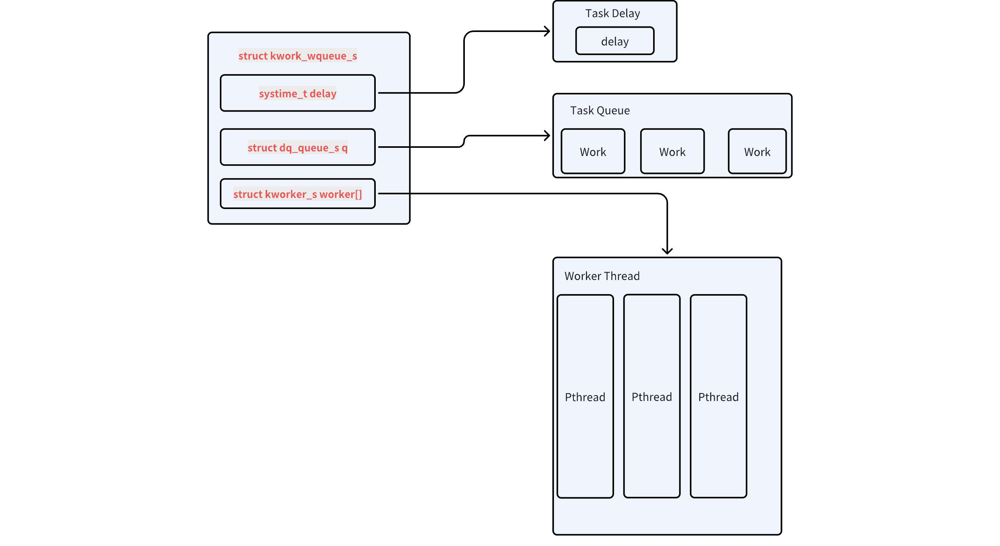
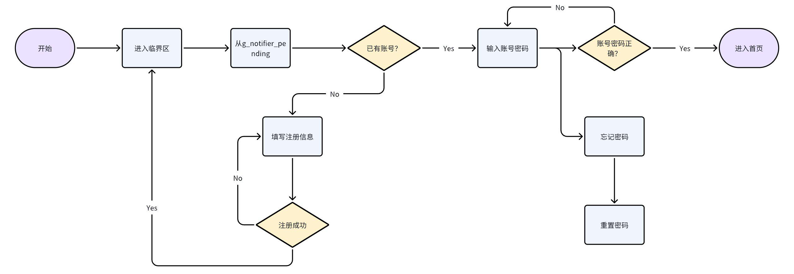

# 工作队列开发指南

\[ [English](../../../../en/device_dev_guide/kernel/IPC/work_queue.md) | 简体中文 \]

## 一、概述

openvela 操作系统提供工作队列（Work Queue）机制，用于将任务（Work）推迟到专用的工作线程上下文中执行。此机制的核心优势在于实现任务的**延迟执行**和**串行执行**。系统将待处理的任务放入一个先进先出（FIFO）的队列中，由工作线程池中的线程按序取出并执行。

openvela 提供三种不同类型的工作队列，以满足不同场景的需求：

- 高优先级（HP）内核工作队列
- 低优先级（LP）内核工作队列
- 用户模式工作队列

## 二、工作队列分类与特性

### 1、高优先级 (HP) 工作队列

高优先级工作队列专为处理紧急且耗时较短的任务设计，尤其适用于中断服务程序 (**ISR**) 的下半部 (Bottom Half) 处理（即从中断上下文中剥离出的、可延迟的清理或处理工作，如内存的延迟释放）。

为确保任务能被近乎实时地处理，该队列的工作线程拥有一个固定的高优先级（默认为 **224**），以便和系统中的其他高优先级任务竞争资源。

当高优先级工作队列被禁用时，其清理工作将按以下顺序降级处理：

1. 由低优先级工作队列处理：如果低优先级工作队列已启用。
2. 由 **IDLE** 线程处理：如果低优先级工作队列未启用。此方式不适用于对处理实时性要求较高的任务。

#### 配置选项

| 配置项                       | 描述                               | 默认值 |
| ---------------------------- | ---------------------------------- | ------ |
| CONFIG_SCHED_HPWORK          | 使能高优先级工作队列               | y      |
| CONFIG_SCHED_HPNTHREADS      | 工作线程数量                       | 1      |
| CONFIG_SCHED_HPWORKPRIORITY  | 工作线程的优先级                   | 224    |
| CONFIG_SCHED_HPWORKSTACKSIZE | 每个工作线程的栈大小（单位：字节） | 2048   |

### 2、低优先级 (LP) 工作队列

低优先级工作队列主要用于处理后台任务和非紧急的应用程序级作业，例如文件系统清理、日志记录、异步 I/O (AIO) 操作等。通过将这些任务调度在较低优先级，可以避免它们干扰关键任务的执行，从而提升系统的整体响应性和稳定性。

#### 优先级继承

低优先级内核工作队列支持优先级继承机制（需开启 `CONFIG_PRIORITY_INHERITANCE`），允许动态调整工作线程的优先级。此功能并非自动触发，开发者需要主动调用以下接口：

- `lpwork_boostpriority()`: 在调度任务前提升工作线程的优先级。
- `lpwork_restorepriority()`: 在任务处理函数（`work handler`）执行完毕后恢复其原始优先级。

目前，仅 openvela 的异步 I/O (AIO) 模块使用此动态优先级特性。

#### 配置选项

| 配置项                       | 描述                               | 默认值 |
| ---------------------------- | ---------------------------------- | ------ |
| CONFIG_SCHED_LPWORK          | 使能低优先级工作队列               | y      |
| CONFIG_SCHED_LPNTHREADS      | 工作线程数量                       | 1      |
| CONFIG_SCHED_LPWORKPRIORITY  | 工作线程的最低优先级               | 100    |
| CONFIG_SCHED_LPWORKPRIOMAX   | 工作线程可提升的最高优先级         | 176    |
| CONFIG_SCHED_LPWORKSTACKSIZE | 每个工作线程的栈大小（单位：字节） | 2048   |

### 3、内核工作队列比较

| 特性     | 高优先级 (HP) 工作队列                                                                             | 低优先级 (LP) 工作队列                                                                                                  |
| -------- | -------------------------------------------------------------------------------------------------- | ----------------------------------------------------------------------------------------------------------------------- |
| 适用场景 | **高实时性任务**：中断下半部处理、紧急数据处理、关键路径上的任务。                                 | **后台或非紧急任务**：日志记录、文件系统清理、内存垃圾回收、异步 I/O。                                                  |
| 优点     | **低延迟**：任务能被迅速处理，保证系统响应速度。  <br> **高实时性**：确保任务在预期时间内完成。    | **资源友好**：在系统负载较低时执行，避免与关键任务竞争。<br> **提升系统稳定性**：隔离非关键任务，保障高优先级服务质量。 |
| 缺点     | **资源竞争**：可能抢占 CPU，导致低优先级任务饥饿。 <br> **过载风险**：大量高优任务可能使系统过载。 | **高延迟**：任务执行时机不确定，可能被长时间推迟。<br>  **不适用于实时场景**：无法保证任务的即时响应。                  |

### 4、用户模式工作队列

在 `protected` 或 `kernel` 构建模式下，用户应用程序无法直接访问内核空间的工作队列。为满足用户态程序的异步执行需求，openvela 提供了用户模式工作队列。

#### 与内核工作队列的差异

- API 一致性：提供与内核工作队列相同的编程接口。
- 功能对等：其功能和行为等效于高优先级（HP）工作队列。
- 实现独立：它在用户空间实现，不依赖内核内部资源，且不设线程池（采用单工作线程模型）。

#### 配置选项

| 配置项                      | 描述                           | 默认值 |
| --------------------------- | ------------------------------ | ------ |
| CONFIG_LIB_USRWORK          | 使能用户模式工作队列           | y      |
| CONFIG_LIB_USRWORKPRIORITY  | 工作线程的优先级               | 100    |
| CONFIG_LIB_USRWORKSTACKSIZE | 工作线程的栈大小（单位：字节） | 2048   |

## 三、原理

### 1、工作队列的组成

工作队列在 openvela 操作系统中由以下三个核心部分组成：

1. **任务队列**：用于存放需要延迟执行的任务。用户通过 `work_queue()` 接口将任务添加到这个队列中。
2. **工作线程**：负责执行任务队列中的任务。内核工作队列中支持多个工作线程并行运行。
3. **延时参数 `delay`**：定义任务轮询的时间间隔，用于判断任务是否已达到需要执行的时间点。

下图展示了工作队列的基本工作原理：



### 2、工作队列的启动流程

在系统启动阶段，openvela 会自动创建并启动所有已配置的工作队列。该过程始于 `nx_start()`，其调用链如下：

```Plain
nx_start()
  └── nx_bringup()
        └── nx_workqueues()
              ├── work_start_highpri()       // 启动高优先级内核工作队列
              ├── work_start_lowpri()        // 启动低优先级内核工作队列
              └── USERSPACE->work_usrstart() // 启动用户模式工作队列
```

如上所示，`nx_workqueues()` 函数是初始化所有类型工作队列的统一入口。

### 3、内核工作队列实现

高优先级和低优先级内核工作队列的工作原理非常相似，以下详细说明了高优先级工作队列的创建和运行机制。

#### 初始化

`work_start_highpri()` 函数负责初始化高优先级工作队列并创建对应的工作线程。

主要功能包括：

- 初始化工作队列数据结构。
- 创建多个高优先级工作线程（`work_thread`）。

```C
#if defined(CONFIG_SCHED_HPWORK)

/* 启动高优先级内核工作线程 */
int work_start_highpri(void)
{
  sinfo("Starting high-priority kernel worker thread(s)\n");

  return work_thread_create(HPWORKNAME, CONFIG_SCHED_HPWORKPRIORITY,
                            CONFIG_SCHED_HPWORKSTACKSIZE,
                            CONFIG_SCHED_HPNTHREADS,
                            (FAR struct kwork_wqueue_s *)&g_hpwork);
}
#endif /* CONFIG_SCHED_HPWORK */
```

#### 创建工作线程

`work_thread_create()` 函数根据配置参数创建一个或多个工作线程，并将它们与工作队列绑定。

```C
/*create nthreads worker*/
static int work_thread_create(FAR const char *name, int priority,
                              int stack_size, int nthread,
                              FAR struct kwork_wqueue_s *wqueue)
{
  FAR char *argv[2];
  char args[32];
  int wndx;
  int pid;

  snprintf(args, sizeof(args), "0x%" PRIxPTR, (uintptr_t)wqueue);
  argv[0] = args;
  argv[1] = NULL;

  /* 在队列完全初始化之前，不允许线程运行 */
  sched_lock();

  for (wndx = 0; wndx < nthread; wndx++)
    {
      pid = kthread_create(name, priority, stack_size,
                           work_thread, argv);

      DEBUGASSERT(pid > 0);
      if (pid < 0)
        {
          serr("ERROR: work_thread_create %d failed: %d\n", wndx, pid);
          sched_unlock();
          return pid;
        }

      wqueue->worker[wndx].pid  = pid;
    }

  sched_unlock();
  return OK;
}
```

#### 工作线程逻辑

工作线程 `work_thread` 的核心任务是从队列中取出任务并执行其绑定的回调函数。线程会持续运行，直到系统关闭。

```C
/****************************************************************************
 * Name: work_thread
 *
 * Description:
 *   These are the worker threads that perform the actions placed on the
 *   high priority work queue.
 *
 *   These, along with the lower priority worker thread(s) are the kernel
 *   mode work queues (also built in the flat build).
 *
 *   All kernel mode worker threads are started by the OS during normal
 *   bring up.  This entry point is referenced by OS internally and should
 *   not be accessed by application logic.
 *
 * Input Parameters:
 *   argc, argv
 *
 * Returned Value:
 *   Does not return
 *
 ****************************************************************************/

static int work_thread(int argc, FAR char *argv[])
{
  FAR struct kwork_wqueue_s *wqueue;
  FAR struct work_s *work;
  worker_t worker;
  irqstate_t flags;
  FAR void *arg;

  /* 获取工作队列的指针 */
  wqueue = (FAR struct kwork_wqueue_s *)
           ((uintptr_t)strtoul(argv[1], NULL, 0));

  flags = enter_critical_section();

  /* 循环处理任务队列 */
  for (; ; )
    {
      /* 等待任务信号量，直到有任务进入队列 */
      nxsem_wait_uninterruptible(&wqueue->sem);

      /* 遍历队列中的任务并执行 */
      while ((work = (FAR struct work_s *)dq_remfirst(&wqueue->q)) != NULL)
        {
          if (work->worker == NULL)
            {
              continue;
            }

          /* 获取回调函数和参数 */
          worker = work->worker;
          arg = work->arg;

          /* 标记任务已完成 */
          work->worker = NULL;

          /* 执行任务回调函数 */
          leave_critical_section(flags);
          CALL_WORKER(worker, arg);
          flags = enter_critical_section();
        }
    }

  leave_critical_section(flags);

  return OK; /* To keep some compilers happy */
}
```

#### 任务进入队列

通过 `work_queue()` 函数可以将任务添加到指定的工作队列中。函数会根据任务的延迟时间（`delay`）决定任务的处理方式：

1. 如果 `delay == 0`，任务会直接插入到工作队列中。
2. 如果 `delay > 0`，任务会启动一个定时器（`wdog`），超时后再插入队列。

```C
/****************************************************************************
 * Name: work_queue
 *
 * Description:
 *   Queue kernel-mode work to be performed at a later time.  All queued
 *   work will be performed on the worker thread of execution (not the
 *   caller's).
 *
 *   The work structure is allocated and must be initialized to all zero by
 *   the caller.  Otherwise, the work structure is completely managed by the
 *   work queue logic.  The caller should never modify the contents of the
 *   work queue structure directly.  If work_queue() is called before the
 *   previous work has been performed and removed from the queue, then any
 *   pending work will be canceled and lost.
 *
 * Input Parameters:
 *   qid    - The work queue ID (index)
 *   work   - The work structure to queue
 *   worker - The worker callback to be invoked.  The callback will be
 *            invoked on the worker thread of execution.
 *   arg    - The argument that will be passed to the worker callback when
 *            it is invoked.
 *   delay  - Delay (in clock ticks) from the time queue until the worker
 *            is invoked. Zero means to perform the work immediately.
 *
 * Returned Value:
 *   Zero on success, a negated errno on failure
 *
 ****************************************************************************/

int work_queue(int qid, FAR struct work_s *work, worker_t worker,
               FAR void *arg, clock_t delay)
{
  if (qid == USRWORK)
    {
      /* Is there already pending work? */

      work_cancel(qid, work);

      return work_qqueue(&g_usrwork, work, worker, arg, delay);
    }
  else
    {
      return -EINVAL;
    }
}
```

### 4、用户模式工作队列实现

用户模式工作队列（User Work Queue）的 API 设计与内核队列保持一致，但其内部实现机制有显著区别，以适应用户空间的资源和限制。它不依赖于内核的看门狗定时器，而是实现了一套自包含的延迟处理逻辑。

#### 创建线程

`work_usrstart()` 函数负责初始化用户队列并创建其唯一的工作线程。根据系统的构建模式，它会选择不同的线程创建方式：

- **保护模式/内核模式构建** (`CONFIG_BUILD_PROTECTED`): 调用 `task_create()` 创建一个用户态任务。
- **扁平模式构建** (`Flat Build`): 调用标准的 `pthread_create()` 创建一个 POSIX 线程，并将其设置为分离状态 (`detach`)。

```C
/****************************************************************************
 * Name: work_usrstart
 *
 * Description:
 *   Start the user mode work queue.
 *
 * Input Parameters:
 *   None
 *
 * Returned Value:
 *   The task ID of the worker thread is returned on success.  A negated
 *   errno value is returned on failure.
 *
 ****************************************************************************/

int work_usrstart(void)
{
  int ret;
#ifndef CONFIG_BUILD_PROTECTED
  pthread_t usrwork;
  pthread_attr_t attr;
  struct sched_param param;
#endif

  /* Initialize the work queue */

  dq_init(&g_usrwork.q);

#ifdef CONFIG_BUILD_PROTECTED

  /* 在保护模式下，创建用户态任务 */
  ret = task_create("uwork",
                    CONFIG_LIBC_USRWORKPRIORITY,
                    CONFIG_LIBC_USRWORKSTACKSIZE,
                    work_usrthread, NULL);
  if (ret < 0)
    {
      int errcode = get_errno();
      DEBUGASSERT(errcode > 0);
      return -errcode;
    }

  return ret;
#else
  /* Start a user-mode worker thread for use by applications. */

  pthread_attr_init(&attr);
  pthread_attr_setstacksize(&attr, CONFIG_LIBC_USRWORKSTACKSIZE);

  pthread_attr_getschedparam(&attr, &param);
  param.sched_priority = CONFIG_LIBC_USRWORKPRIORITY;
  pthread_attr_setschedparam(&attr, &param);

  ret = pthread_create(&usrwork, &attr, work_usrthread, NULL);
  if (ret != 0)
    {
      return -ret;
    }

  /* Detach because the return value and completion status will not be
   * requested.
   */

  pthread_detach(usrwork);

  return (pid_t)usrwork;
#endif
}
```

#### 任务处理循环

用户模式工作队列的核心是 `work_process` 函数，它采用一种基于有序队列和定时休眠的机制，而非内核队列的事件驱动模型。

1. **有序队列 (Ordered Queue)**: 与内核队列的 FIFO（先进先出）不同，用户队列是一个**有序队列**。任务在入队时，会根据其期望的绝对执行时间 (`qtime`) 被插入到队列的合适位置，确保队列始终按任务的到期时间先后顺序排列。
2. **处理与休眠循环**: 工作线程在一个循环中执行以下逻辑。

    1. **检查队首**: 锁定队列后，检查队首任务的到期时间。
    2. **处理到期任务**: 如果队首任务已经到期 (`elapsed >= 0`)，则将其出队并执行其回调函数。由于执行回调时会解锁队列，执行完毕后必须重新从队首开始检查，以处理在任务执行期间可能并发插入的新任务。
    3. **计算休眠时间**: 如果队首任务尚未到期，则说明当前队列中没有需要立即执行的任务。此时，计算距离队首任务到期还需等待的时间 `next`。
    4. **定时或无限期休眠**:

        - 若队列为空 (`next` 为最大值)，则线程调用 `_SEM_WAIT()` 无限期阻塞，等待新任务到来。
        - 若队列中有待处理任务，则线程调用 `_SEM_TIMEDWAIT()` 精确休眠 `next` 时长。如果在休眠期间有新的、更早到期的任务被插入队首，入队函数会唤醒该线程，使其能立即重新计算更短的休眠时间。

这种设计巧妙地在用户空间实现了延迟任务调度，其精度是一种尽力而为的模式，受线程调度延迟的影响。

```C
/****************************************************************************
 * Name: work_process
 *
 * Description:
 *   This is the logic that performs actions placed on any work list.  This
 *   logic is the common underlying logic to all work queues.  This logic is
 *   part of the internal implementation of each work queue; it should not
 *   be called from application level logic.
 *
 * Input Parameters:
 *   wqueue - Describes the work queue to be processed
 *
 * Returned Value:
 *   None
 *
 ****************************************************************************/

static void work_process(FAR struct usr_wqueue_s *wqueue)
{
  volatile FAR struct work_s *work;
  worker_t worker;
  FAR void *arg;
  sclock_t elapsed;
  clock_t next;
  int ret;

  /* Then process queued work.  Lock the work queue while we process items
   * in the work list.
   */
  next = WORK_DELAY_MAX;
  ret = nxmutex_lock(&wqueue->lock);
  if (ret < 0)
    {
      /* Break out earlier if we were awakened by a signal */
      return;
    }

  /* And check each entry in the work queue.  Since we have locked the
   * work queue we know:  (1) we will not be suspended unless we do
   * so ourselves, and (2) there will be no changes to the work queue
   */
  work = (FAR struct work_s *)wqueue->q.head;
  while (work)
    {
      /* Is this work ready? It is ready if there is no delay or if
       * the delay has elapsed.  is the time that the work was added
       * to the work queue. Therefore a delay of equal or less than
       * zero will always execute immediately.
       */
      elapsed = clock() - work->u.s.qtime;

      /* Is this delay work ready? */
      if (elapsed >= 0)
        {
          /* Remove the ready-to-execute work from the list */
          dq_remfirst(&wqueue->q);

          /* Extract the work description from the entry (in case the work
           * instance by the re-used after it has been de-queued).
           */
          worker = work->worker;

          /* Check for a race condition where the work may be nullified
           * before it is removed from the queue.
           */
          if (worker != NULL)
            {
              /* Extract the work argument before unlocking the work queue */
              arg = work->arg;

              /* Mark the work as no longer being queued */
              work->worker = NULL;

              /* Do the work.  Unlock the work queue while the work is being
               * performed... we don't have any idea how long this will take!
               */
              nxmutex_unlock(&wqueue->lock);
              worker(arg);

              /* Now, unfortunately, since we unlocked the work queue we
               * don't know the state of the work list and we will have to
               * start back at the head of the list.
               */

              ret = nxmutex_lock(&wqueue->lock);
              if (ret < 0)
                {
                  /* Break out earlier if we were awakened by a signal */

                  return;
                }
            }

          work = (FAR struct work_s *)wqueue->q.head;
        }
      else
        {
          next = work->u.s.qtime - clock();
          break;
        }
    }

  /* Unlock the work queue before waiting. */
  nxmutex_unlock(&wqueue->lock);

  if (next == WORK_DELAY_MAX)
    {
      /* Wait indefinitely until work_queue has new items */

      _SEM_WAIT(&wqueue->wake);
    }
  else
    {
      struct timespec now;
      struct timespec delay;
      struct timespec rqtp;

      /* Wait awhile to check the work list.  We will wait here until
       * either the time elapses or until we are awakened by a semaphore.
       * Interrupts will be re-enabled while we wait.
       */
      clock_gettime(CLOCK_REALTIME, &now);
      clock_ticks2time(next, &delay);
      clock_timespec_add(&now, &delay, &rqtp);

      _SEM_TIMEDWAIT(&wqueue->wake, &rqtp);
    }
}
```

#### 任务入队 (`work_qqueue`)

为了维护队列的有序性，`work_qqueue()` 的实现比内核队列更为复杂。

1. **计算绝对执行时间**: 首先，根据当前系统节拍 (`clock()`) 和传入的 `delay` 计算出任务的绝对到期时间 `work->u.s.qtime`。
2. **寻找插入点**: 遍历整个队列，找到第一个执行时间晚于新任务的节点，确定新任务的插入位置。
3. **插入任务**: 将新任务插入到找到的位置之前。
4. **唤醒线程 (关键优化)**: 如果新任务被插入到了队首，这意味着来了一个比当前所有待处理任务都更紧急的任务。此时必须调用 `_SEM_POST()` 来唤醒正在休眠的工作线程。这使得工作线程可以中断当前的（可能很长的）等待，并为这个新任务重新计算一个更短的休眠时间，从而保证了系统的响应性。

```C
/****************************************************************************
 * Name: work_qqueue
 *
 * Description:
 *   Queue work to be performed at a later time.  All queued work will be
 *   performed on the worker thread of execution (not the caller's).
 *
 *   The work structure is allocated by caller, but completely managed by
 *   the work queue logic.  The caller should never modify the contents of
 *   the work queue structure; the caller should not call work_qqueue()
 *   again until either (1) the previous work has been performed and removed
 *   from the queue, or (2) work_cancel() has been called to cancel the work
 *   and remove it from the work queue.
 *
 * Input Parameters:
 *   wqueue - The work queue
 *   work   - The work structure to queue
 *   worker - The worker callback to be invoked.  The callback will be
 *            invoked on the worker thread of execution.
 *   arg    - The argument that will be passed to the worker callback when
 *            it is invoked.
 *   delay  - Delay (in clock ticks) from the time queue until the worker
 *            is invoked. Zero means to perform the work immediately.
 *
 * Returned Value:
 *   Zero on success, a negated errno on failure
 *
 ****************************************************************************/

static int work_qqueue(FAR struct usr_wqueue_s *wqueue,
                       FAR struct work_s *work, worker_t worker,
                       FAR void *arg, clock_t delay)
{
  FAR dq_entry_t *prev = NULL;
  FAR dq_entry_t *curr;
  sclock_t delta;
  int semcount;

  /* Get exclusive access to the work queue */
  while (nxmutex_lock(&wqueue->lock) < 0);

  /* Initialize the work structure */

  work->worker = worker;             /* Work callback. non-NULL means queued */
  work->arg    = arg;                /* Callback argument */
  work->u.s.qtime = clock() + delay; /* Delay until work performed */

  /* Do the easy case first -- when the work queue is empty. */
  if (wqueue->q.head == NULL)
    {
      /* Add the watchdog to the head == tail of the queue. */
      dq_addfirst(&work->u.s.dq, &wqueue->q);
      _SEM_POST(&wqueue->wake);
    }

  /* There are other active watchdogs in the timer queue */
  else
    {
      curr = wqueue->q.head;

      /* Check if the new work must be inserted before the curr. */
      do
        {
          delta = work->u.s.qtime - ((FAR struct work_s *)curr)->u.s.qtime;
          if (delta < 0)
            {
              break;
            }

          prev = curr;
          curr = curr->flink;
        }
      while (curr != NULL);

      /* Insert the new watchdog in the list */
      if (prev == NULL)
        {
          /* Insert the watchdog at the head of the list */
          dq_addfirst(&work->u.s.dq, &wqueue->q);
          _SEM_GETVALUE(&wqueue->wake, &semcount);
          if (semcount < 1)
            {
              _SEM_POST(&wqueue->wake);
            }
        }
      else
        {
          /* Insert the watchdog in mid- or end-of-queue */
          dq_addafter(prev, &work->u.s.dq, &wqueue->q);
        }
    }

  nxmutex_unlock(&wqueue->lock);
  return OK;
}
```

## 四、数据结构

openvela 工作队列的核心是围绕 `struct work_s` 结构展开的，它代表一个需要被异步执行的任务。系统通过不同的队列管理结构来组织和调度这些任务。

### 1、核心任务结构 (`struct work_s`)

`struct work_s` 是工作队列机制的**原子单位**，它封装了待执行任务的所有信息。无论是内核队列还是用户队列，调度的基本对象都是它。

```C++
/* 代表一个独立的任务单元 */
struct work_s
{
  /* 联合体，用于根据不同调度方式复用内存 */
  union
    {
      /* 用于用户模式工作队列 */
      struct
        {
          /* 双向链表节点，用于将任务链入有序队列 */
          struct dq_entry_s  dq;
          /* 任务的绝对到期时间（系统节拍），用于排序和判断是否执行 */
          clock_t qtime;
        } s;
      /* 用于内核延迟任务：一个看门狗定时器实例 */
      struct wdog_s timer;
      /* 用于内核周期性任务：一个周期性看门狗定时器实例 */
      struct wdog_period_s ptimer;
    } u;
  /* 指向实际执行任务的回调函数 */
  worker_t worker;
  /* 传递给回调函数的参数 */
  FAR void *arg;
};
```

关键点:

- 联合体 `u`: 为了节省内存，该结构使用联合体来支持不同的调度方式。

    - 对于用户模式队列，使用 `u.s` 成员将任务链接成一个根据 `qtime` 排序的有序队列。
    - 对于内核延迟任务，直接复用为一个看门狗定时器 `u.timer`。

- 生命周期管理: 该结构由调用者分配，但其内部成员由工作队列 API (`work_queue()`) 管理。用户不应在任务入队后直接修改其内容。

### 2、队列与工作者线程结构 (内核)

这些数据结构定义了内核模式工作队列（HPWORK 和 LPWORK）的形态和状态。

```C++
/* 内核工作队列的整体描述 */
struct kwork_wqueue_s
{
  /* 任务队列的头部，使用双向链表实现 */
  struct dq_queue_s q;

  /* 同步信号量，用于实现工作线程的阻塞和唤醒。
   * - 队列为空时，工作线程在此信号量上等待。
   * - 新任务入队时，通过释放此信号量来唤醒一个工作线程。
   */
  sem_t sem;

  /* 工作者线程数组（实际大小由配置决定） */
  struct kworker_s worker[1];
};

/* 代表一个工作者线程的状态 */
struct kworker_s
{
  /* 工作者线程的 PID */
  pid_t pid;

  /* 指向该线程当前正在处理的任务 */
  FAR struct work_s *work;

  /* 控制单个线程等待和唤醒的信号量 (较少使用) */
  sem_t wait;
};

// 全局实例
#ifdef CONFIG_SCHED_HPWORK
/* 内核高优先级工作队列的全局实例 */
extern struct hp_wqueue_s g_hpwork;
#endif
#ifdef CONFIG_SCHED_LPWORK
/* 内核低优先级工作队列的全局实例 */
extern struct lp_wqueue_s g_lpwork;
#endif
```

### 3、用户接口与使用

从用户角度看，与工作队列交互的主要是回调函数类型定义和 `struct work_s` 的使用。

#### 使用说明

用户在使用工作队列时，通常只需定义一个 `struct work_s` 实例（通常作为静态变量或包含在其他结构体中）。其内部成员，如 `worker` 和 `arg`，都通过 `work_queue()` 接口进行填充和管理，用户不应直接操作。

#### 示例

```C
// 1. 定义一个 work 结构体实例
static struct work_s g_my_work;
// 2. 定义具体的工作函数
static void my_work_function(FAR void *arg)
{
  // ... 执行具体任务 ...
}
// 3. 将任务提交到工作队列
void schedule_my_work(void)
{
  // 将 g_my_work 提交到低优先级队列，立即执行
  work_queue(LPWORK, &g_my_work, my_work_function, NULL, 0);
}
```

### 4、通知机制相关结构 (可选)

openvela 在工作队列之上构建了一套通知机制，允许代码**订阅**某些系统事件（如进程消亡）。以下是其相关的数据结构。

```C++
/* work_notifier_s：定义了通知的内容 */
struct work_notifier_s
{
  uint8_t  evtype;      /* 事件类型 */
  uint8_t  qid;         /* 任务被调度的队列 ID */
  FAR void *qualifier;  /* 事件的限定符，如 PID */
  FAR void *arg;        /* 传递给回调的参数 */
  worker_t worker;      /* 事件触发时执行的回调 */
};
/* work_notifier_entry_s：将通知信息封装成一个可被调度的任务 */
struct work_notifier_entry_s
{
  struct dq_entry_s      entry; /* 用于链接到通知链表 */
  struct work_s          work;  /* 用于实际调度的 work 结构 */
  struct work_notifier_s info;  /* 包含的通知信息 */
  int                    key;   /* 用于标识和查找通知的唯一键 */
};
```

## 五、API接口

openvela 工作队列的 API 分布在不同的内核文件中，每个文件都承担着特定的功能。下面我们将按照模块划分，详细解析其核心接口。

### 1、任务调度 (`kwork_queue.c`)

该模块提供了将任务（work）提交到工作队列的核心 API，是开发者最常使用的接口。它支持一次性任务和周期性任务的调度。

```C
int work_queue_wq_period(FAR struct kwork_wqueue_s *wqueue,
                         FAR struct work_s *work, worker_t worker,
                         FAR void *arg, clock_t delay, clock_t period);
int work_queue_period(int qid, FAR struct work_s *work, worker_t worker,
                      FAR void *arg, clock_t delay, clock_t period);
                      
/*accord to qid,determine which queue the work should be add to
 *arg is the parameter of worker
 *delay is determine whether to join immediately
 */
int work_queue(int qid,FAR struct work_s *work, worker_t worker,FAR void    *arg,clock_t delay)

/*Queue a work item into a specific work queue*/
int work_queue_wq(FAR struct kwork_wqueue_s *wqueue,
                  FAR struct work_s *work, worker_t worker,
                  FAR void *arg, clock_t delay)；                      
                                              
```

| 函数 (Function)               | 描述 (Description)                                                                                                                                                                       |
| ----------------------------- | ---------------------------------------------------------------------------------------------------------------------------------------------------------------------------------------- |
| int work_queue(...)           | **通用任务入队接口**： <br> 根据 qid（如 HPWORK 或 LPWORK）将任务提交到指定的全局工作队列。delay 参数指定了从当前时刻起延迟多少个系统节拍后执行。若 delay 为 0，则任务会尽快被调度执行。 |
| int work_queue_wq(...)        | **指定队列的任务入队接口**： 功能同 work_queue，但直接接收一个工作队列实例指针 wqueue，而不是队列 ID。这主要用于操作用户通过 work_queue_create 动态创建的私有工作队列。                  |
| int work_queue_period(...)    | **周期性任务入队接口**： 将一个任务提交到指定 qid 的全局工作队列。任务在首次 delay 延迟后执行，之后会以 period 指定的周期重复执行，直至被取消。                                          |
| int work_queue_wq_period(...) | 功能同 work_queue_period，但直接接收工作队列实例指针 wqueue，用于动态创建的队列。                                                                                                        |

### 2、任务取消 (`kwork_cancel.c`)

该模块提供在任务被执行前，将其从工作队列中移除的机制。

```C
/*cancel a specific work item in the work queue*/
static int work_qcancel(FAR struct kwork_wqueue_s *wqueue, int nthread, FAR struct work_s *work)；

/*cancel a work item in a specific queue*/
int work_cancel(int qid, FAR struct work_s *work);

/*cancel a work item and wait for the cancellation to complete*/
int work_cancel_sync(int qid, FAR struct work_s *work);
```

| 函数 (Function)              | 描述 (Description)                                                                                                                                                                                                |
| ---------------------------- | ----------------------------------------------------------------------------------------------------------------------------------------------------------------------------------------------------------------- |
| int work_cancel(...)         | **异步取消任务**：<br> 从指定 qid 的全局工作队列中尝试移除一个尚未执行的任务。该函数会立即返回，不等待取消操作完成。如果任务已开始执行或已完成，则无法取消。                                                      |
| int work_cancel_sync(...)    | **同步取消任务**：<br> 功能与 work_cancel 类似，但它会阻塞等待，直到任务被成功移除，或者（如果任务已经在运行）直到该任务执行完毕。这确保了在函数返回时，work 结构体已不再被工作队列使用，可以被安全地释放或重用。 |
| static int work_qcancel(...) | work_cancel 和 work_cancel_sync 的内部实现，直接操作工作队列实例，不对外暴露。                                                                                                                                    |

### 3、事件通知机制 (`kwork_notifier.c`)

此模块实现了一套发布-订阅模式的事件通知系统。它允许系统各部分对特定事件（如进程退出）进行**订阅**，当事件被**发布**时，自动触发预设的回调任务并将其放入工作队列异步执行。

#### 核心流程

1. **订阅 (****`work_notifier_setup`****)**: 将一个包含事件类型、回调函数等信息的**通知器**注册到全局待处理列表 `g_notifier_pending`。
2. **发布 (****`work_notifier_signal`****)**: 当事件发生时，系统调用此函数，它会遍历 `g_notifier_pending` 列表，找到所有匹配的通知器。
3. **调度:** 找到的通知器所关联的回调任务将被提交到工作队列中等待执行。
4. **注销 (****`work_notifier_teardown`****)**: 将通知器从 `g_notifier_pending` 列表中移除，停止监听。



#### 接口说明

```C
/*generate a unique key for a work notifier*/
static uint32_t work_notifier_key(void)；
                 
/*According to the key, 
*go to the g_notifier_pending queue to find 
*if there is a corresponding notifier.
*/
static FAR struct work_notifier_entry_s *work_notifier_find(uint32_t key)；

/*whether the notifier is triggered,call its worker,
* this worker is the callback processed when you want 
* the work to be executed.
*/
static void work_notifier_worker(FAR void *arg)；

/*setup a work notifier*/
int work_notifier_setup(FAR struct work_notifier_s *info)；

/*teardown a work notifier,put it from pending queue to free queue*/
void work_notifier_teardown(int key)；

/*based on the evtype and qualifier, find the corresponding notifier
*from g_notifier_pending,remove notifier from g_pending queue
*add this notifier to the workqueue for asynchronous execution.
*/
void work_notifier_signal(enum work_evtype_e evtype, FAR void *qualifier)；
```

| 函数 (Function)                  | 描述 (Description)                                                                                                                       |
| -------------------------------- | ---------------------------------------------------------------------------------------------------------------------------------------- |
| int work_notifier_setup(...)     | 设置/订阅一个通知：<br> 注册一个通知器，成功后返回一个唯一的 key 用于后续操作。                                                          |
| void work_notifier_teardown(...) | 注销一个通知：<br> 根据 key 将之前设置的通知器从待处理队列移动到空闲队列。                                                               |
| void work_notifier_signal(...)   | 触发/发布一个事件：<br> 根据事件类型 evtype 和限定符 qualifier（如 PID），通知所有匹配的订阅者，并将其关联的 work 调度到工作队列执行。   |
| static ... work_notifier_*       | work_notifier_key、work_notifier_find、work_notifier_worker 等均为内部辅助函数，分别用于生成唯一键、查找通知器和作为实际执行的回调封装。 |

### 4、优先级继承 (`kwork_inherit.c`)

该模块专门用于解决**优先级反转**问题，尤其是在低优先级工作队列（LPWORK）中。当高优先级任务需要等待一个由低优先级工作线程处理的结果时，可以通过这些接口临时提升工作线程的优先级，确保关键路径不被阻塞。

```C
/*Raise the priority of a specified low-priority worker thread*/
static void lpwork_boostworker(pid_t wpid, uint8_t reqprio);
/*Restores the original priority of the specified worker thread*/
static void lpwork_restoreworker(pid_t wpid, uint8_t reqprio);
/*Raise the priority of all low-priority work queue threads.*/
void lpwork_boostpriority(uint8_t reqprio);
/*Restore the original priorities of all low-priority work queue threads*/
void lpwork_restorepriority(uint8_t reqprio);
```

| 函数 (Function)                       | 描述 (Description)                                       |
| ------------------------------------- | -------------------------------------------------------- |
| void lpwork_boostpriority(...)        | 将所有低优先级工作线程的优先级提升到指定级别 reqprio。   |
| void lpwork_restorepriority(...)      | 将所有被提升过优先级的低优先级工作线程恢复其原始优先级。 |
| static void lpwork_boostworker(...)   | 内部函数，用于提升单个指定工作线程的优先级。             |
| static void lpwork_restoreworker(...) | 内部函数，用于恢复单个指定工作线程的优先级。             |

### 5、线程与队列管理 (`kwork_thread.c`)

此文件是工作队列的**实现核心**，负责工作线程的创建、主循环逻辑、动态队列的生命周期管理以及任务遍历等底层功能。

```C
/*take out of the work from queue and execute it
*agrc：number of parameters
*argv:parameter list
*/
static int work_thread(int argc,FAR char *argv[])；

/*create a work processing thread*/
static int work_thread_create(FAR const char *name,int priority,int stack_size,int nthread,FAR struct kwork_queue_s *wqueue)；

FAR struct kwork_wqueue_s *work_queue_create(FAR const char *name,
                                             int priority,
                                             FAR void *stack_addr,
                                             int stack_size, int nthreads);
                                             
int work_queue_free(FAR struct kwork_wqueue_s *wqueue);                                             
int work_queue_priority_wq(FAR struct kwork_wqueue_s *wqueue);

/*apply a handler function to each work item in the queue*/
void work_foreach(int qid,work_foreach_t handler,FAR void *arg)；

int work_queue_period(int qid, FAR struct work_s *work, worker_t worker,
                      FAR void *arg, clock_t delay, clock_t period);
```

| 函数 (Function)                    | 描述 (Description)                                                                                                                                  |
| ---------------------------------- | --------------------------------------------------------------------------------------------------------------------------------------------------- |
| work_queue_create(...)             | **动态创建一个新的工作队列**：<br> 允许用户自定义队列名称、工作线程数量、优先级和栈大小。内部会调用 work_thread_create 来创建工作线程。             |
| int work_queue_free(...)           | **释放一个动态创建的工作队列**： <br> 会停止并清理所有关联的工作线程，然后释放队列本身占用的内存。                                                  |
| void work_foreach(...)             | **遍历队列中的任务**：<br> 对指定 qid 队列中的每一个 work 项执行一次 handler 回调函数，常用于调试或状态检查。                                       |
| static int work_thread(...)        | **工作线程的主函数**：<br> 每个工作线程都运行此函数，它在一个无限循环中等待任务信号，然后从队列中取出任务并执行它。这是工作队列能够消费任务的根本。 |
| static int work_thread_create(...) | 内部接口，被 work_queue_create 调用，负责使用指定的参数来创建并启动一个具体的工作线程。                                                             |
| int work_queue_priority_wq(...)    | 获取指定工作队列 wqueue 中工作线程的当前调度优先级。                                                                                                |

## 六、总结

Openvela 的工作队列（Work Queue）是一个强大且灵活的后台任务处理框架，其核心目标是将耗时或非紧急的任务从关键执行路径（如中断处理程序、高优先级任务）中剥离，交由专用的低优先级线程异步执行，从而提高系统的响应能力和稳定性。

**其核心思想可以概括为：**

- **任务延迟与异步化**：提供标准接口，允许开发者将一个函数调用（`work`）提交给系统，并指定其在未来某个时间点（立即、延迟或周期性）被执行。
- **生产者-消费者模型**：应用程序或内核子系统作为生产者，通过 API 将任务放入共享的队列中；一组预先创建的工作者线程作为消费者，不断从队列中取出任务并执行。

**从架构与实现上看，该机制具有以下关键特点：**

1. **多样化的队列类型**：系统提供了多种预设的工作队列，以满足不同场景的需求：

    - **内核高优先级队列 (HPWORK)**：用于处理时间敏感、需要快速响应的内核级任务。
    - **内核低优先级队列 (LPWORK)**：是通用的后台任务处理队列，用于绝大多数不需要立即执行的常规任务。
    - 除此之外，还支持**用户模式工作队列**，提供了极大的灵活性。

2. **功能丰富的** **API**：提供了一套完整的 API，覆盖了任务的调度 (`work_queue`)、取消 (`work_cancel`)、事件订阅/发布 (`work_notifier_setup`/`signal`) 以及动态管理 (`work_queue_create`)，能够满足复杂的应用需求。
3. **简洁一致的设计**：在 openvela OS 中，尽管存在不同类型的队列，但其底层实现遵循着统一和简洁的设计哲学。每种队列都由一个任务队列和一组工作线程构成，由内核统一调度。这种一致性降低了系统的复杂度和开发者的使用门槛。
