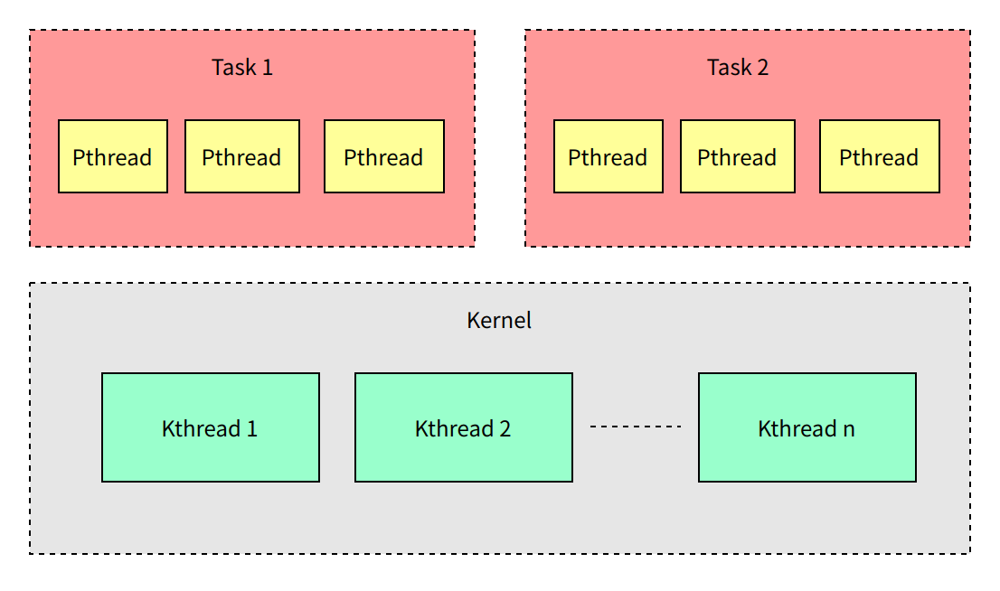

# 内核开发概述

\[ [English](../../../en/device_dev_guide/kernel/KernelDev.md) | 简体中文 \]

## 一、概述

openvela 内核基于 NuttX 实时操作系统内核构建，作为符合 POSIX 标准的嵌入式实时操作系统，具备以下核心能力：

### 1、实时任务处理能力

- 支持多线程与多进程并发执行。
- 提供信号量、消息队列、定时器等实时同步机制。
- 确保低延迟的任务调度与响应。

### 2、存储与通信能力

- 兼容多种嵌入式文件系统（如 NxFFS, LittleFS）。
- 支持主流网络协议栈（包括 TCP/IP, UDP）。
- 提供稳定的数据存储和网络通信解决方案。

### 3、驱动与接口兼容性

- 采用 Linux/xBSD 标准驱动接口。
- 支持通用 Linux 用户程序移植。
- 实现模块化组件的复用和互操作。

这些特性使 openvela 能够在资源受限的嵌入式平台上实现高效可靠的实时操作。

## 二、支持的处理器架构

openvela 能够适应不同的硬件平台，因此可广泛应用于从低功耗的小型设备到高性能嵌入式计算系统的各类场景。通过支持多个主流嵌入式设备的硬件平台，openvela 使得开发者可以在不同的架构之间进行迁移和部署，从而大大提高了开发效率和系统的兼容性。

### 1、CPU 架构

openvela 支持多种处理器架构，且覆盖了多种主流嵌入式设备的硬件平台，包括以下架构：


### 2、多处理器支持

openvela 同时支持以下多处理器模式，旨在提供灵活的处理器调度和优化的并行处理能力，以满足不同应用场景的需求。

#### SMP（Symmetric Multiprocessing）

拥有多个 CPU，每个 CPU 采用相同的架构，多个 CPU 共享同一内存空间。操作系统运行在这多个 CPU 上，并将工作负载分摊给各个 CPU。


#### AMP（Asymmetric Multiprocessing）

拥有多个 CPU，每个 CPU 可能采用不同的架构，每个 CPU 拥有独立内存空间。每个 CPU 上都运行一个独立的操作系统，CPU 之间通过核间通信实现协作。


## 三、代码目录结构

openvela 的内核代码目录结构如下：

```Bash
.
|-- Documentation
|-- arch               #各CPU架构层目录，包含了所有支持的CPU架构
|   |-- arm            #arm架构
|   |-- arm64          #arm64架构
|   |-- ...
|   `-- z80            #z80架构
|-- audio              #Audio组件代码
|-- binfmt             #binfmt组件代码
|-- boards             #各CPU架构下的板级驱动及配置
|   |-- arm            #arm架构板级代码
|   |-- arm64          #arm64架构板级代码
|   |-- ...
|   `-- z80            #z80架构板级代码
|-- cmake              #cmake脚本
|-- crypto             #Crypto组件代码
|-- drivers            #驱动框架代码
|-- dummy
|-- fs                 #文件系统代码
|-- graphics           #Graphics框架代码
|-- include            #openvela头文件
|-- libs               #lib库代码
|-- mm                 #内存管理组件代码
|-- net                #网络组件代码
|-- openamp            #openamp组件代码
|-- pass1
|-- sched              #内核关键组件代码，如task、资源同步、进程通信组件
|   |-- addrenv        #task address environment管理
|   |-- clock          #clock驱动
|   |-- environ        #环境变量代码
|   |-- event          #event代码
|   |-- group          #task group代码
|   |-- init           #内核启动代码
|   |-- instrument     #instrument功能
|   |-- irq            #中断接口函数
|   |-- misc           #其他杂项如assert
|   |-- module         #elf动态加载
|   |-- mqueue         #消息队列
|   |-- paging         #mmu paging
|   |-- pthread        #内核pthread代码
|   |-- sched          #内核调度相关代码
|   |-- semaphore      #信号量代码
|   |-- signal         #信号代码
|   |-- task           #任务相关代码
|   |-- timer          #timer驱动框架
|   |-- tls            #tls接口
|   |-- wdog           #wdog驱动代码
|   `-- wqueue         #工作队列代码
|-- syscall            #syscall框架代码
|-- tools              #openvela工具
|-- video              #video组件代码
`-- wireless           #wireless组件代码
```

开发者可以通过以下代码仓库获取 openvela 内核的相关代码和资源：

- [openvela NuttX 仓库](../../../../../../../open-vela/nuttx/)

## 四、系统特性

### 1、标准兼容

- **POSIX** **兼容**：NuttX 强调 POSIX 标准的兼容性，确保良好的可移植性和标准化的接口。
- **ANSI 标准**：支持 ANSI C 标准，为开发者提供标准的编程接口。

### 2、可扩展性

- **从 8 位到 64 位**：NuttX 可扩展到从 8 位到 64 位的微控制器环境，适应各种嵌入式系统需求。
- **模块化设计**：内核采用模块化设计，易于扩展和定制。

### 3、实时性

- **实时调度**：支持实时调度算法，满足实时系统的需求。
- **优先级调度**：支持基于优先级的任务调度，确保高优先级任务优先执行。

## 五、线程与进程管理

### 1、线程调度概述

线程调度是操作系统管理多个线程的核心过程，决定线程的执行顺序和时机。调度策略依赖以下关键因素：

- **优先级**：高优先级线程优先执行。
- **时间片**：分配 CPU 执行时间窗口。
- **资源需求**：如 I/O 等待、同步锁等。

### 2、openvela 任务分类

openvela 将任务/线程划分为三类（关系见示意图）：



#### 内核线程 (Kthread)

内核线程在**内核空间**运行，具有以下特点：

- 所有 Kthread 共享同一内存空间。
- 主要用于管理硬件资源和执行系统级任务。
- 不直接与用户应用程序交互。

##### 创建内核线程

使用 `kthread_create()` 函数创建内核线程：

```C
int kthread_create(FAR const char *name, int priority, int stack_size,
                   main_t entry, FAR char * const argv[]);
```

参数说明：

- `name`：线程名称。
- `priority`：线程优先级。
- `stack_size`：栈大小（字节）。
- `entry`：入口函数。
- `argv`：传递给入口函数的参数数组。

#### 用户线程 (Pthread)

Pthread 遵循 POSIX 线程接口标准，具有以下特点：

- 在**用户空间**运行。
- 适合处理不涉及直接硬件交互的高层任务。
- 提供标准化的线程编程接口。

##### 创建用户线程

使用 `pthread_create()` 函数创建用户线程：

```C
int pthread_create(FAR pthread_t *thread, FAR const pthread_attr_t *attr,
                   pthread_startroutine_t startroutine, pthread_addr_t arg);
```

参数说明：

- `thread`：存储新创建线程 ID 的指针。
- `attr`：线程属性。
- `startroutine`：线程执行的函数。
- `arg`：传递给线程函数的参数。

#### 用户任务 (Task)

Task 在 openvela 中类似于 Linux 中的进程，具有以下特点：

- 在**用户空间**运行。
- 不同 Task 之间地址空间相互隔离。
- 一个 Task 可以创建多个 Pthread。

##### 任务组概念

主 Task 及其创建的所有 Pthread 共同组成一个任务组，用于模拟 POSIX 进程。任务组成员共享以下资源：

- 环境变量
- 文件描述符
- 文件流（FILE streams）
- 套接字
- pthread 键
- 打开的消息队列

##### 创建用户任务

使用 `posix_spawn()` 函数创建用户任务：

```C
int posix_spawn(FAR pid_t *pid, FAR const char *path,
      FAR const posix_spawn_file_actions_t *file_actions,
      FAR const posix_spawnattr_t *attr,
      FAR char * const argv[], FAR char * const envp[]);
```

参数说明：

- `pid`：存储新创建任务 ID 的指针。
- `path`：可执行文件路径。
- `file_actions`：文件操作动作。
- `attr`：任务属性。
- `argv`：命令行参数数组。
- `envp`：环境变量数组。

### 3、调度算法

openvela 以线程为调度单位，采用以下调度策略：

#### 优先级调度

对于不同优先级的线程，openvela 严格执行优先级调度，高优先级线程优先获得CPU资源。

#### 同优先级线程调度

对于相同优先级的线程，openvela 支持两种调度算法：

1. **先进先出** **(****FIFO****)**

    - 相同优先级的线程按创建顺序执行。
    - 当前线程必须主动放弃 CPU 或阻塞才会切换到下一个线程。
    - 可能导致后创建的线程响应延迟较大。
    - 系统**默认使用此算法**。

2. **时间片轮转 (****Round Robin****)**

    - 相同优先级的线程轮流获得 CPU 时间。
    - 每个线程获得固定时长的执行时间（时间片）。
    - 时间片耗尽后自动切换到下一个同优先级线程。
    - 通过 `CONFIG_RR_INTERVAL` 配置时间片长度（毫秒）。
    - 仅当 `CONFIG_RR_INTERVAL > 0` 时启用。

## 六、资源同步

openvela 提供多种资源同步机制，以确保多线程环境下的数据一致性和安全访问。本章详细介绍各种同步机制的特点、使用场景和注意事项。

### 1、信号量

信号量是一种睡眠锁，用于控制对共享资源的访问。

#### 工作原理

当线程尝试获取不可用的信号量时：

1. 信号量将线程加入等待队列。
2. 当前线程进入睡眠状态。
3. CPU 调度其他线程执行。
4. 信号量可用后，等待线程被唤醒。

#### 注意事项

- 适用场景：适合**锁被长时间持有**的情况。
- 使用限制：**只能在线程上下文中使用，不能在中断上下文中使用。**
- 锁交互：持有信号量时**不能同时持有自旋锁**，否则可能导致死锁。
- 并发安全：多线程获取同一信号量不会导致死锁。
- 推荐接口：使用 `nxsem_wait_uninterruptible()` 函数等待信号量。

#### 参考

- 信号量的详细说明请参见[信号量机制](./resource_sync/semaphore_mechanism.md)。
- 相关实现代码请参见 [openvela semaphore](../../../../../../../open-vela/nuttx/tree/dev-ai-contest-2026/sched/semaphore)。

### 2、互斥体

互斥体是一种可睡眠的强制互斥锁，在 openvela 中实现为计数值为 1 的信号量。

#### 特点

- 支持递归互斥锁。
- 任何时刻只有一个任务可持有互斥体。

#### 注意事项

- 责任原则：给互斥体上锁的线程必须负责解锁。
- 使用限制：不能在中断上下文中使用。
- 最佳实践：进行互斥保护时，推荐使用互斥体而非信号量。

#### 参考

相关实现代码可参考 [openvela mutex](../../../../../../../open-vela/nuttx/tree/dev-ai-contest-2026/libs/libc/misc/lib_mutex.c)。

### 3、自旋锁（SpinLock）

自旋锁是一种非阻塞锁，当锁被占用时，请求线程会持续循环检查锁的状态。

#### 工作原理

- 线程尝试获取已被占用的自旋锁时不会进入睡眠状态。
- 现场不断循环检查锁是否已被释放。

#### 注意事项

- 持有时间：不应长时间持有，适合短时间轻量级加锁。
- 避免切换：持有自旋锁时不应调用引起上下文切换的 API，防止死锁。
- 递归限制：**不支持递归调用**。
- 推荐接口：使用 **`spin_lock_irqsave()`** 和 **`spin_unlock_irqrestore()`** 而非直接使用 `spin_lock()` 和 `spin_unlock()`。

#### 参考

相关实现代码可参考 [openvela spinlock](../../../../../../../open-vela/nuttx/tree/dev-ai-contest-2026/include/nuttx/spinlock.h)。

### 4、原子操作

原子操作保证指令以不可分割的方式执行，执行过程不会被打断。

#### 优势

- 系统开销最小。
- 无需显式锁机制。

#### 注意事项

- 架构支持：使用前确保当前 CPU 架构支持原子指令。
- 避免 ABA 问题：多线程操作时推荐使用 CAS（比较并交换）原子操作。

#### 参考

- 原子操作的详细说明，请参见[原子操作接口](./resource_sync/atomic_operation.md)。
- 相关接口代码请参见 [openvela atomic](../../../../../../../open-vela/nuttx/tree/dev-ai-contest-2026/include/nuttx/atomic.h)。

### 5、开关中断（IRQ Control）

通过开关中断实现同步，防止任务执行临界代码被中断打断。

#### 实现方式

openvela 通过 `up_irq_xxx()` 实现对本 CPU 的中断屏蔽控制，这些函数通常由 **`spin_lock_irqsave()`** 和 **`spin_unlock_irqrestore()`** 封装调用。

#### 注意事项

- 范围限制：只能关闭本 CPU 中断，无法关闭全部 CPU 中断。
- 调度影响：允许在开关中断期间进行任务切换。

#### 参考

- 中断系统适配详情请参考[中断系统适配指南](./../../chip_porting/Interrupt_System_Adaptation_Guide.md)。
- 接口代码请参考 [openvela irq 接口](../../../../../../../open-vela/nuttx/tree/dev-ai-contest-2026/include/nuttx/irq.h)。

### 6、开关调度（Scheduler Control）

openvela 通过 `sched_lock()` 和 `sched_unlock()` 实现调度控制，暂停内核调度过程。

#### 工作原理

- 关调度后，调用引起任务切换的 API 不会生效。
- 仅当当前任务主动调用 `sched_unlock()` 或让出调度时才会发生任务切换。

#### 使用场景示例

如下面代码所示，创建子线程并等待其完成时，可使用开关调度防止子线程抢占：

```C
int nsh_builtin(FAR struct nsh_vtbl_s *vtbl, FAR const char *cmd,
                FAR char **argv,
                FAR const struct nsh_param_s *param)
{
  /* Lock the scheduler in an attempt to prevent the application from
   * running until waitpid() has been called.
   */

  sched_lock();

  /* Try to find and execute the command within the list of builtin
   * applications.
   */

  ret = exec_builtin(cmd, argv, param);
  if (ret >= 0)
    {
#ifdef CONFIG_SCHED_WAITPID

      /* CONFIG_SCHED_WAITPID is selected, so we may run the command in
       * foreground unless we were specifically requested to run the command
       * in background (and running commands in background is enabled).
       */

#  ifndef CONFIG_NSH_DISABLEBG
      if (vtbl->np.np_bg == false)
#  endif /* CONFIG_NSH_DISABLEBG */
        {
          /* Wait for the application to exit.  We did lock the scheduler
           * above, but that does not guarantee that the application did not
           * already run to completion in the case where I/O was redirected.
           * Here the scheduler will be unlocked while waitpid is waiting
           * and if the application has not yet run, it will now be able to
           * do so.
           *
           * Also, if CONFIG_SCHED_HAVE_PARENT is defined waitpid() might
           * fail even if task is still active:  If the I/O was re-directed
           * by a proxy task, then the ask is a child of the proxy, and not
           * this task. waitpid() fails with ECHILD in either case.
           *
           * NOTE: WUNTRACED does nothing in the default case, but in the
           * case the where CONFIG_SIG_SIGSTOP_ACTION=y, the built-in app
           * may also be stopped.  In that case WUNTRACED will force
           * waitpid() to return with ECHILD.
           */

          ret = waitpid(ret, &rc, WUNTRACED);
        }
#endif /* !CONFIG_SCHED_WAITPID || !CONFIG_NSH_DISABLEBG */
    }

  sched_unlock();

  return ret;
}
```

#### 注意事项

- 中断影响：关调度过程中中断不受影响，需要关中断时需主动调用关中断函数。
- 嵌套使用：支持嵌套使用。

#### 参考

实现代码请参考 [openvela sched lock](../../../../../../../open-vela/nuttx/tree/dev-ai-contest-2026/sched/sched/sched_lock.c) 和 [openvela sched unlock](../../../../../../../open-vela/nuttx/tree/dev-ai-contest-2026/sched/sched/sched_unlock.c)。

### 7、Pthread 互斥锁（Pthread Mutex）

POSIX 线程标准提供的互斥锁机制，仅用于 Pthread 线程。

#### 相关接口

- 互斥锁：`pthread_mutex_lock()`, `pthread_mutex_unlock()` [] ([man page](https://linux.die.net/man/3/pthread_mutex_lock))
- 读写锁：`pthread_rwlock_rdlock()`, `pthread_rwlock_wrlock()` ([man page](https://linux.die.net/man/3/pthread_rwlock_rdlock))
- 自旋锁：`pthread_spin_lock()`, `pthread_spin_trylock()` ([man page](https://linux.die.net/man/3/pthread_spin_trylock))
- 屏障：`pthread_barrier_init()`, `pthread_barrier_wait()` ([man page](https://linux.die.net/man/3/pthread_barrier_init))
- 一次性初始化：`pthread_once()` ([man page](https://linux.die.net/man/3/pthread_once))

#### 参考

实现代码请参考 [openvela pthread](../../../../../../../open-vela/nuttx/tree/dev-ai-contest-2026/libs/libc/pthread)。

### 8、同步机制的选择

#### 开销比较（从低到高）

| **开销顺序** | **同步机制**   | **使用范围**   | **中断上下文使用** | **调用任务调度API** |
| :----------- | :------------- | :------------- | :----------------- | :------------------ |
| 0            | 原子操作       | 内核和用户空间 | 支持               | 支持                |
| 1            | 自旋锁         | 内核和用户空间 | 支持               | 不支持              |
| 2            | 开关调度       | 内核和用户空间 | 无效               | 支持                |
| 3            | 互斥体         | 内核和用户空间 | 不支持             | 支持                |
| 4            | Pthread 互斥锁 | 仅用户空间     | 不支持             | 支持                |

#### 场景推荐

| **需求**       | **推荐同步机制** |
| :------------- | :--------------- |
| 简单整数操作   | 使用原子操作     |
| 低开销加锁     | 优先使用自旋锁   |
| 短期锁定       | 优先使用自旋锁   |
| 中断上下文加锁 | 使用自旋锁       |
| 长期锁定       | 优先使用互斥体   |
| 持有锁需要睡眠 | 使用互斥体       |

## 七、线程通信

openvela 操作系统提供多种线程和进程间通信机制，使开发者能够实现高效的任务协作。本章详细介绍主要的通信机制及其选择原则。

### 1、工作队列（Work Queue）

工作队列是一种任务调度机制，允许将任务加入队列由专用线程执行，实现任务的**延迟处理**和**串行执行**。

#### 工作原理

工作队列系统由以下组件构成：

- 任务队列：存储待执行的工作项。
- 工作线程：从队列取出工作项并执行。
- 调度器：管理工作项的调度和执行。

#### 工作队列类型

openvela 支持三种工作队列类型，各具不同特性：

| 类型                     | 优先级 | 主要用途                               |
| :----------------------- | :----- | :------------------------------------- |
| **高优先级内核工作队列** | 高     | 中断下半部分处理，时间敏感任务。       |
| **低优先级内核工作队列** | 低     | 后台任务，如日志记录、周期性数据处理。 |
| **用户模式工作队列**     | 可配置 | 用户空间应用程序使用。                 |

#### 使用场景

工作队列特别适合以下场景：

- 中断处理程序中需要延迟执行的任务。
- 需要在线程上下文中执行但不需要独立线程的操作。
- 需要周期性执行的后台任务。

#### 参考

- 工作队列的详细说明，可参考[工作队列](./IPC/work_queue.md)。
- 实现代码请查看 [openvela wqueue](../../../../../../../open-vela/nuttx/tree/dev-ai-contest-2026/sched/wqueue)。

### 2、消息队列

消息队列是一种结构化的通信机制，允许任务间传递带类型和优先级的消息。

#### 工作原理

消息队列系统实现了以下功能：

- 消息发送：任务可将数据打包为消息并发送到队列。
- 消息接收：任务可从队列获取消息并处理。
- 优先级排序：支持按消息优先级排序。
- 阻塞操作：支持发送和接收时的阻塞等待。

#### 使用场景

消息队列特别适合以下场景：

- 需要结构化数据交换的任务间通信。
- 需要消息优先级支持的应用。
- 需要实现生产者消费者模式的系统。

#### 参考

- 消息队列的详细说明请参考[消息队列](./IPC/message_queue.md)。
- 实现代码请参考 [openvela mqueue](../../../../../../../open-vela/nuttx/tree/dev-ai-contest-2026/sched/mqueue) 源码。

### 3、通信方案的选择

#### 线程创建原则

不要随意创建线程。单核系统中，多线程并不会提高系统性能，反而会增加栈空间开销和上下文切换成本。

#### 通信方案比较

当需要使用多线程时应如果进行选择，下面列出了几种常用的方案：

| **方案**      | **开销**                                                   | **优势**                                     | **劣势**                       |
| :------------ | :--------------------------------------------------------- | :------------------------------------------- | :----------------------------- |
| 工作队列      | 框架 1KB <br> 线程栈 2KB * n（可配置）                     | 集中处理中断下半部可节省系统资源适合延迟操作 | 仅支持 FIFO，无优先级策略。    |
| 线程+信号量   | 线程栈 2KB                                                 | 线程完全独立线程优先级可配置实现简单直观     | 仅适合简单同步不支持数据传递   |
| 线程+消息队列 | 消息队列框架 1.5KB <br> 线程栈 2KB <br> 消息预分配空间 1KB | 线程完全独立线程优先级可配置消息优先级可配置 | 配置参数复杂使用场景需仔细评估 |

## 八、示例分享

[异步编程开发示例](./async_samples.md)
