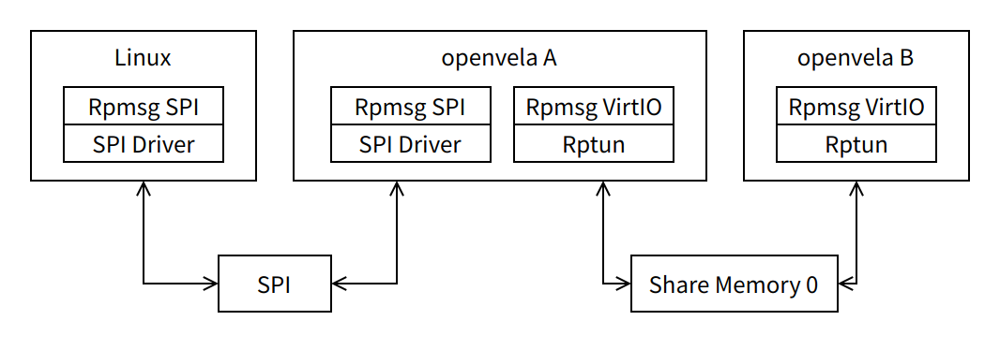
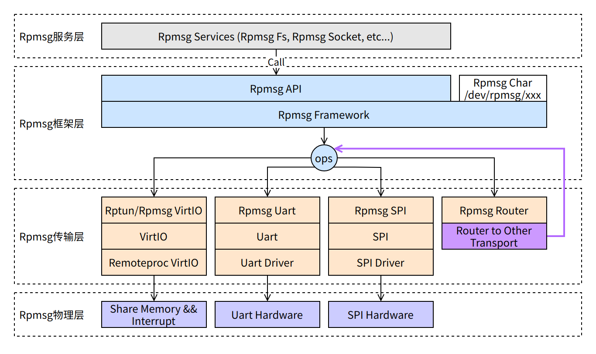
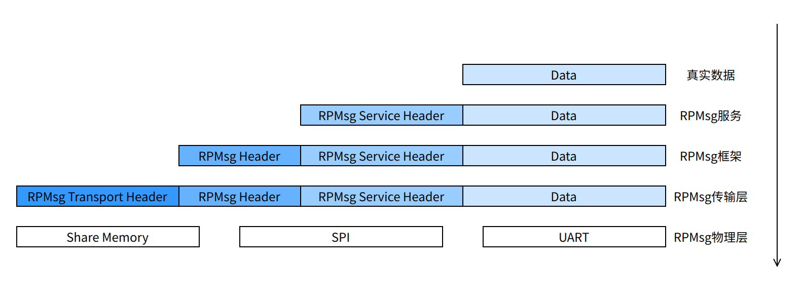
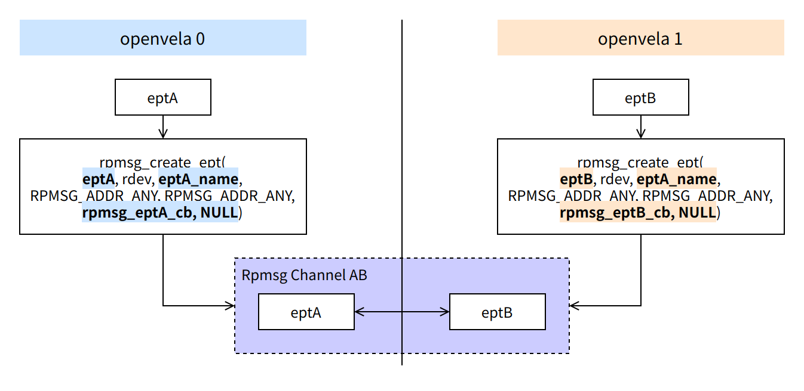
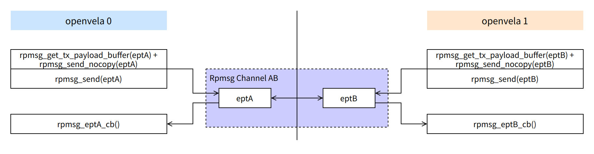
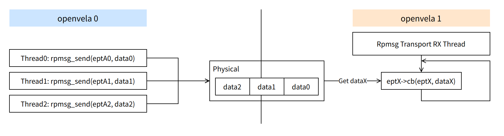

# RPMsg 核心概念与工作原理

\[ [English](../../../../../en/device_dev_guide/kernel/inter_processor_communication/RPMsg/RPMsg.md) | 简体中文 \]

## 一、概述

**远程处理器消息传递**（Remote Processor Messaging, RPMsg）是一个轻量级的消息传递框架，专为异构多核系统中的核间通信而设计。它定义了一套标准的二进制接口，使运行不同操作系统（如 Linux）或实时操作系统（Real-Time Operating System, RTOS）的处理器核心能够高效、可靠地交换数据。

RPMsg 主要应用于**非对称多处理（Asymmetric Multiprocessing，AMP**）架构，是构建复杂嵌入式系统的关键组件。本文档旨在介绍 RPMsg 的核心概念、分层架构、工作流程及在实践中的应用。

## 二、典型应用场景

RPMsg 框架支持多种硬件拓扑和通信介质，以下是两种典型的应用场景。

### 1、异构 AMP 系统（大小核）

在一个包含高性能核心（大核）和低功耗核心（小核）的系统中，RPMsg 可以实现它们之间的协同工作。

- **场景描述**：一个运行 Linux 的应用处理器（大核）需要与一个运行 RTOS（如 openvela）的微控制器（小核 A）通信，同时该微控制器（小核 A）还需与另一个微控制器（小核 B）通信。
- **实现方式**：
    - 大核与小核 A 之间：通过 RPMsg over SPI 进行跨芯片通信。
    - 小核 A 与小核 B 之间：通过基于共享内存的 RPMsg over VirtIO 进行片内通信。

如下图所示：



### 2、同构 AMP 系统（纯小核）

在一个由多个同类型低功耗核心组成的系统中，RPMsg 同样可以作为高效的通信总线。

- **场景描述**：三个运行 RTOS（如 openvela）的对等核心需要相互通信，以完成复杂的协作任务。
- **实现方式**：所有核心之间均通过基于共享内存的 RPMsg over VirtIO 进行通信，利用共享内存实现高速、低延迟的数据交换。


## 三、核心架构

RPMsg 采用分层架构，类似于网络协议栈，将通信功能模块化。这使得上层应用可以忽略底层物理实现的差异。

### 1、分层架构



RPMsg 采用模块化的分层架构，其设计思想类似于网络协议栈。这种分层设计将应用逻辑与底层物理传输解耦，提高了代码的可移植性和可维护性。该架构自顶向下包含四个核心层次：

1. **服务层 (Services Layer)**

    在 RPMsg 框架之上，为应用程序提供标准化的、易于使用的通信服务。该层将底层的消息收发抽象为更高层级的应用接口。详情请参见[RPMsg 服务]()。
    - **关键服务包括**：
        - **RPMsg Socket**：提供类 BSD Socket 的 API，使网络应用或需要流式通信的应用可以轻松地进行跨核通信。
        - **RPMsg FS**：通过虚拟文件系统（Virtual File System, VFS）提供文件操作接口，允许一个核心像访问本地文件一样访问另一个核心上的资源。

2. **框架层 (Framework Layer)**

    作为 RPMsg 的核心，该层负责管理通信端点（Endpoint）、通道（Channel）以及消息的路由。它整合了 OpenAMP 的标准实现，并向上层提供核心 API。详情请参见[RPMsg 框架]()。
    - **主要职责**：
        - 端点和通道的生命周期管理。
        - 基于名称或地址的服务发现与匹配。
        - 向 VFS 注册字符设备，允许用户空间应用通过标准文件操作（如 `open`, `read`, `write`）进行核间通信。

3. **传输层 (Transport Layer)**

    定义并实现消息在处理器之间的具体传输方式。开发者可以根据系统的物理连接和性能要求，选择或定制不同的传输层。详情请参见[RPMsg 传输层]()。
    - **主要实现**：
        - **Rptun / RPMsg VirtIO**：基于共享内存和中断的片内通信方案，遵循 VirtIO 标准，性能高效。它包含两个版本：
            - **Rptun**：作为 VirtIO 的功能增强版，它支持更复杂的系统特性，是 openvela 系统中推荐的首选传输层。
            - **RPMsg VirtIO**：轻量级实现，适用于资源受限的设备或简单的通信场景。
        - **RPMsg UART**：使用通用异步收发器（UART）作为物理介质，适用于低速的板级跨芯片通信。
        - **RPMsg SPI**：使用串行外设接口（SPI）作为物理介质，相比 UART 能提供更高的带宽，同样支持板级跨芯片通信。
        - **RPMsg Router**：一个逻辑传输层，其本身不执行物理数据传输。它的核心功能是作为消息路由器，根据目标地址将消息转发到其他物理传输层，从而实现跨不同通信域的无缝路由。
4. **物理层 (Physical Layer)**

    直接与硬件交互，负责执行传输层下发的具体操作。该层的实现与目标硬件平台紧密相关。
    - **主要职责**：
        - 配置共享内存（Shared Memory）区域。
        - 初始化并控制直接内存访问（Direct Memory Access, DMA）控制器。
        - 操作 SPI、UART 等硬件控制器的寄存器。
        - 管理和响应底层硬件中断。

### 2、消息封装



RPMsg 消息在从服务层传递到物理层的过程中，每一层都会添加自己的头部信息。这个过程与网络数据包的封装类似，确保每一层都能获得处理消息所需的上下文信息（如源/目标地址、长度等），最终形成一个完整的数据帧在物理介质上传输。

## 四、工作流程与核心机制

RPMsg 的消息传输功能通过一套定义明确的工作流程来实现，该流程涵盖了从建立通信链路到收发数据的完整生命周期。

### 1、建立通信通道

RPMsg 通信的基本逻辑单元是通道 (Channel)，它代表了两个处理器核心上的一对端点 (Endpoint) 之间的双向连接。应用程序通过调用 `rpmsg_create_ept()` 函数来创建端点并触发通道的建立过程。

```C
/**
 * @brief Create rpmsg endpoint and register it to rpmsg device
 *
 * Create a RPMsg endpoint, initialize it with a name, source address,
 * remoteproc address, endpoint callback, and destroy endpoint callback,
 * and register it to the RPMsg device.
 *
 * In essence, an rpmsg endpoint represents a listener on the rpmsg bus, as
 * it binds an rpmsg address with an rx callback handler.
 *
 * Rpmsg client should create an endpoint to discuss with remote. rpmsg client
 * provide at least a channel name, a callback for message notification and by
 * default endpoint source address should be set to RPMSG_ADDR_ANY.
 *
 * As an option Some rpmsg clients can specify an endpoint with a specific
 * source address.
 *
 * @param ept           Pointer to rpmsg endpoint
 * @param rdev          RPMsg device associated with the endpoint
 * @param name          Service name associated to the endpoint (maximum size \ref RPMSG_NAME_SIZE)
 * @param src           Local address of the endpoint
 * @param dest          Target address of the endpoint
 * @param cb            Endpoint callback
 * @param ns_unbind_cb  Endpoint service unbind callback, called when remote
 *                      ept is destroyed.
 *
 * @return 0 on success, or negative error value on failure.
 */
int rpmsg_create_ept(struct rpmsg_endpoint *ept, struct rpmsg_device *rdev,
                     const char *name, uint32_t src, uint32_t dest,
                     rpmsg_ept_cb cb, rpmsg_ns_unbind_cb ns_unbind_cb);
```

框架支持以下两种通道建立的匹配方式：

- **按名称匹配 (动态地址)**：两端在创建端点时提供相同的 `name` 字符串，并将 `src` 和 `dest` 地址均设置为 `RPMSG_ADDR_ANY`。RPMsg 框架会自动进行服务宣告和发现，协商并分配唯一的地址来建立通道。这是最常用和灵活的方式。
- **按地址匹配 (静态地址)**：两端使用预先定义好的静态地址。一端创建的端点 `src` 地址必须与另一端端点的 `dest` 地址完全匹配，反之亦然。这种方式适用于地址在设计阶段就已固化的简单系统。



### 2、发送消息

应用程序通过 RPMsg 框架层提供的 API 发送数据。框架提供了两种主要的发送方式：

- **标准发送**： 通过调用 `rpmsg_send()` 函数，应用程序可以直接发送一个数据缓冲区。这种方式简单直接，但通常涉及至少一次内存拷贝，将应用数据复制到 RPMsg 的内部发送缓冲区。

- **零拷贝发送**： 为了追求极致性能并最小化 CPU 开销，推荐使用零拷贝发送机制。该过程分为两步：

    - **获取缓冲区**：调用 `rpmsg_get_tx_payload_buffer()` 从传输层直接获取一个可用的发送缓冲区。
    - **发送数据**：应用程序将数据直接填充到该缓冲区后，调用 `rpmsg_send_nocopy()` 将其发送出去。 这种方法避免了数据在应用层和框架层之间的拷贝，显著提升了大数据量传输的效率。

### 3、接收与处理消息

如下图所示，消息的接收流程可分解为以下几个关键步骤：



该流程展示了两个核心（openvela 0 和 openvela 1）通过一个 RPMsg 通道进行通信的场景。

1. 发送方 (openvela 0)：应用调用 `rpmsg_send()`。数据经过 RPMsg 框架和传输层，最终通过物理介质（如共享内存）发送给 openvela 1。
2. 接收方 (openvela 1)：传输层通过中断感知到数据到达。中断唤醒一个专用的接收线程（RX Thread），该线程从共享内存中取出消息，并交由 RPMsg 框架处理。
3. 回调执行：RPMsg 框架根据消息的目标地址，找到对应的端点 B，并调用其注册的回调函数 `eptB->cb()`。

下图描绘了消息在接收端的处理路径：



1. 中断触发：远端核心发送的消息到达后，在接收端触发硬件中断。
2. RX 线程唤醒：中断服务程序（ISR）的任务非常轻量，通常只是唤醒一个专用于处理该远端核心消息的接收（RX）线程。
3. 串行处理：该 RX 线程在一个循环中，不断地从共享内存的环形缓冲区（vring）中取出消息。
4. 回调派发：每取出一个消息，RPMsg 框架就会解析其目标端点，并立即调用该端点注册的回调函数。

#### 4、关键特性与设计考量

- **顺序保证 (FIFO Order)：**

    在由同一个 RX 线程处理的单个通信链路中，消息的处理严格遵循先进先出 (First-In, First-Out) 原则。这意味着先发送的消息总是先被接收端的回调函数处理，保证了时序性。

- **阻塞风险**

    由于来自同一个远端核心的所有消息都在**同一个 RX 线程中串行执行**，因此回调函数的执行效率至关重要。如果某个回调函数执行了耗时操作（如同步 I/O、复杂计算或等待锁），它将**阻塞该线程**，导致后续所有消息（即使是发往不同端点的消息）都无法得到及时处理。

    - **影响**：可能导致数据在接收缓冲区积压、系统响应延迟，甚至因缓冲区溢出而丢包。
    - **设计原则与对策**：

        - 保持回调简短：回调函数应只做最必要的数据解析和分发，并尽快返回。
        - 任务卸载 (Offloading)：将所有耗时操作从回调函数中移出，交由专门的工作者线程（Worker Thread）池来异步处理。
        - 使用多实例/多通道：对于需要隔离或不同优先级的业务流，可以创建多个并行的 RPMsg 通道。每个通道可以有独立的资源，从而避免相互影响。
        - 优先级方案：在更复杂的系统中，可以考虑在框架层或应用层实现消息优先级调度机制，确保高优先级消息被优先处理。

## 五、诊断与调试：查看跨核通道

在 openvela 操作系统中，可以通过检查系统运行的线程来快速诊断 RPMsg 的连接状态。通常，本地核心与每一个远端核心建立的 RPMsg 链路，都会对应一个专用的 RX 线程。

例如，在某项目的主控核心（AP）上，通过 `ps` 或 `tasks` 命令看到以下线程列表：


这个输出清晰地表明：

- AP 核心正在通过 `rptun` (RPMsg over VirtIO) 传输层与三个远端核心进行通信。
- 这三个远端核心分别是 `sensor`、`cp` (通信处理器) 和 `audio` (音频 DSP)。
- 每个通信链路都有一个独立的 RX 线程负责处理消息，这印证了上一节提到的消息处理模型。
