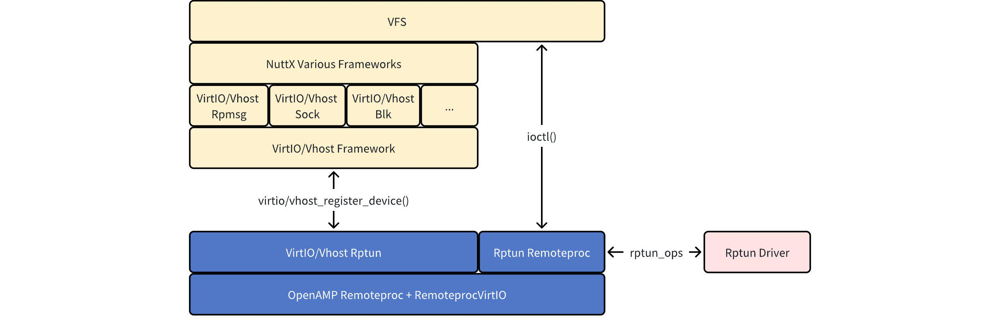
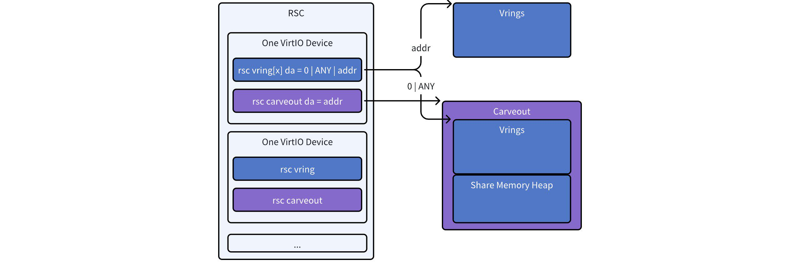
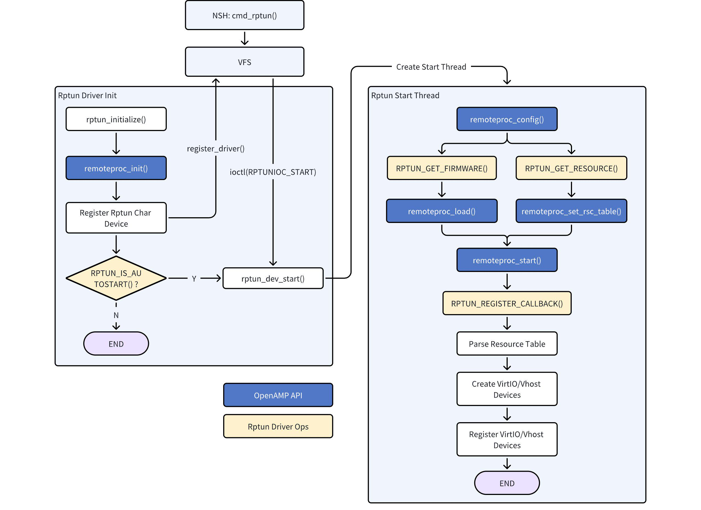
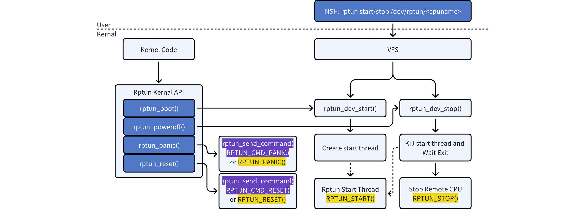
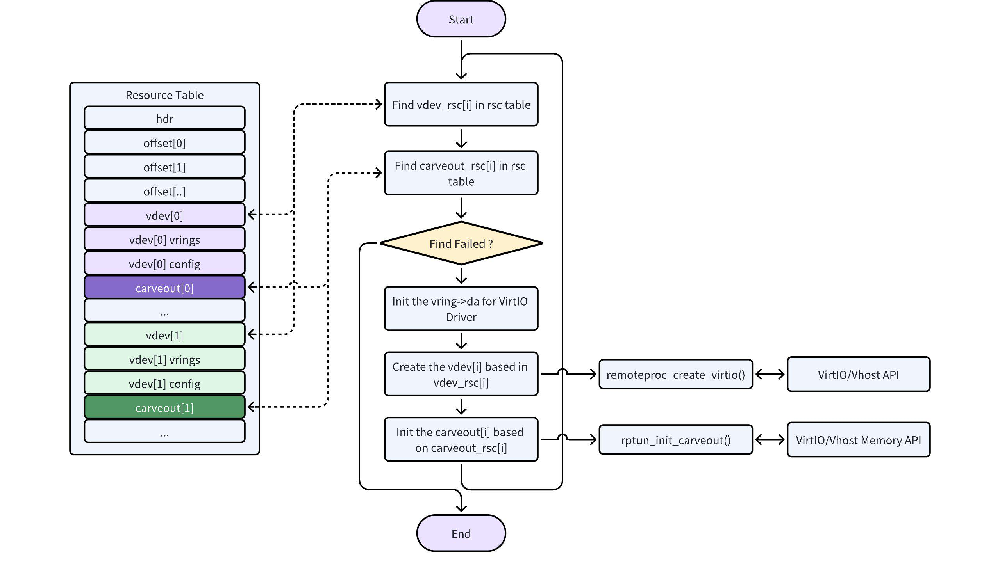

# Rptun 框架技术指南

## 一、概述

Rptun (Remoteproc Tunnel) 是 `openvela` 中一套基于 OpenAMP 的高效跨核通信框架。它主要解决在非对称多核处理器（Asymmetric Multiprocessing, AMP）架构中，主核（Host Core，如运行 openvela）对远端核（Remote Core）的生命周期管理和数据交换问题。

Rptun 框架由两大核心组件构成：

- **Rptun Remoteproc**：负责管理远端核的生命周期，包括启动、停止和复位。
- **VirtIO/Vhost Rptun**：作为 VirtIO 的传输层，使标准的 VirtIO/Vhost 设备能够跨越物理核心进行通信。

此外，Rptun 向用户空间导出标准字符设备接口，方便开发者通过命令行或应用程序进行调试和控制。

### 目标读者

本文档面向需要在 `openvela` 环境下进行多核开发和移植的嵌入式系统工程师，包括：

- 需要使用 Rptun 进行跨核通信的应用开发者。
- 需要在新硬件平台（BSP）上适配 Rptun 的驱动开发者。

## 二、架构

Rptun 位于系统底层，桥接了上层 VirtIO/Vhost 驱动与底层的 OpenAMP 框架，其整体架构如下：



**架构组件解析：**

- **Rptun Remoteproc**:

    - **功能**: 实现对远端 CPU 的生命周期管理（启动、停止、复位等）。
    - **实现**: 基于 OpenAMP 的 Remoteproc 功能，并抽象出标准操作接口。
    - **适配要求**: 依赖底层驱动（Rptun Driver）提供特定于芯片的电源管理和通知机制。
    - **用户接口**: 通过虚拟文件系统（VFS, Virtual File System）注册字符设备，允许用户空间使用 `ioctl()` 系统调用或 NuttShell (NSH) 命令进行控制。

- **VirtIO/Vhost Rptun**:

    - **功能**: 作为 VirtIO/Vhost 框架的后端传输层，实现跨核 Virtqueue 通信。
    - **实现**: 利用 Remoteproc 提供的共享内存和跨核中断能力。
    - **交互**: VirtIO/Vhost 设备通过 `virtio/vhost_register_device()` 接口与 Rptun 关联。

- **RptunDriver(驱动适配层)**:

    - **功能**: 提供平台相关的具体实现，是 Rptun 框架与硬件之间的桥梁。
    - **职责**:
        - 提供共享内存区域（地址和大小）。
        - 实现跨核中断的发送（`notify`）与接收处理。
        - 提供 CPU 物理地址到虚拟地址的转换表。

## 三、核心概念

### 1、Resource Table (资源表)

Resource Table 是一个定义在共享内存中的关键数据结构。它向 Rptun 框架描述了可用的系统资源，是实现跨核通信的基础。其主要内容包括：

- **VirtIO 设备 (vdev resource)**：定义了远端核上运行的 VirtIO 设备的类型、ID 和特性。
- **共享内存区域 (carveout resource)**：定义了用于 Virtqueue 和数据缓冲区的共享内存物理地址和大小。
- **Vring 信息**：定义了 Virtqueue 使用的环形缓冲区的对齐方式、大小和地址。

### 2、共享内存布局

Rptun 框架依赖驱动程序在 Resource Table 中声明一块连续的共享内存。Rptun 会在这块内存上建立以下结构：



- **Resource Table (RSC)**: 描述所有共享资源，其地址由驱动直接提供给 Rptun 框架。RSC 内部包含一个或多个 VirtIO 设备的描述。每个 VirtIO 设备由一个 `vdev` 资源和一个 `carveout` 资源共同表示。

- **Vrings 内存**: 用于 VirtIO Virtqueue 的环形缓冲区。其地址分配规则如下：

    - **动态分配**：若 Resource Table 中 `vring.da` (device address) 字段为 `0` 或 `ANY`，Rptun 框架会从 `carveout` 区域中自动划分一块内存用于 Vrings。
    - **静态指定**：若 `vring.da` 为一个有效地址，则表示驱动已静态指定了 Vrings 的内存位置，框架将直接使用该地址。

- **Carveout 内存 (共享内存堆)**:

    - 每个 VirtIO 设备必须对应一个 `carveout` 资源，用于提供动态分配的共享内存。
    - Rptun 框架会利用 `carveout` 区域（减去可能已分配给 Vrings 的部分）初始化一个独立的共享内存堆（Heap）。
    - 上层的 VirtIO/Vhost 驱动可通过此堆动态申请和释放在 Vring 中传输的数据缓冲区（Vring Buffer），从而实现灵活的内存管理。

### 3、地址转换

在 AMP 架构中，不同核心访问同一块共享内存的物理地址或虚拟地址可能不同。为保证指针在对端核心的有效性，必须进行地址转换。Rptun 框架通过 `rptun_ops` 中的 `get_addrenv()` 接口来获取地址转换表。驱动适配时，若存在地址不一致的情况，必须实现此接口。

## 四、工作流程

### 1、Rptun 初始化与启动



1. **驱动调用初始化**:

    - 平台驱动调用 `rptun_initialize()` 来创建并注册一个 Rptun 实例。每个实例管理一个与远端 CPU 通信的通道。每个通道的名称可以通过适配 `rptun_ops->get_cpuname()` 接口进行指定，若需与多个远端核通信，则需创建多个 Rptun 实例。

2. **启动核心服务**:

    - Rptun 的核心服务通过 `rptun_dev_start()` 启动。此函数会创建一个内核线程来执行耗时任务。启动时机分为两种：
        - **自动启动**: 如果驱动配置为自动启动（`RPTUN_IS_AUTOSTART()` 返回 `true`），`rptun_initialize()` 会立即调用 `rptun_dev_start()`。
        - **手动启动**: 驱动初始化后，可通过 NSH 命令 `rptun start /dev/rptun/<cpuname>` 或 `ioctl()` 调用来手动触发启动流程。

3. **核心初始化任务**:

    - 在启动线程中，Rptun 会执行以下关键操作：
        - 配置 Remoteproc。
        - 解析 Resource Table。
        - 基于 Resource Table 中的信息创建 VirtIO/Vhost 设备。
        - 将创建的设备注册到 VirtIO/Vhost 总线。
        - 通过 `ops->register_callback()` 注册中断回调函数 `rptun_callback()`，用于响应远端核的通知。

### 2、远端 CPU 生命周期管理



Rptun Remoteproc 为用户和内核代码提供了两种方式来管理远端 CPU：

- **用户空间接口**:

    - **NSH 命令**: 通过 `rptun start <dev>` 和 `rptun stop <dev>` 等命令。
    - **字符设备**: 打开设备文件 `/dev/rptun/<cpuname>`，然后使用 `ioctl()` 发送 `RPTUNIOC_START` 或 `RPTUNIOC_STOP` 等控制码。

- **内核空间API**:

    - 内核模块可以直接调用 Rptun 提供的 [API 函数](#1内核-api)来控制远端 CPU。

### 3、VirtIO/Vhost 通信流程

- **设备初始化** 在 Rptun 核心服务启动期间，会为 Resource Table 中定义的每个 VirtIO 设备执行初始化流程，这是后续通信的前提。主要步骤如下：

    

    1. **解析资源**：Rptun 框架解析 Resource Table，查找所有 `vdev` 和 `carveout` 资源。
    2. **创建设备实例**：根据找到的 `vdev` 资源信息，调用 OpenAMP 接口 `remoteproc_create_virtio()` 来创建 VirtIO 设备实例。
    3. **初始化共享内存堆**：根据对应的 `carveout` 资源，初始化一个独立的共享内存堆（Heap）。此堆专用于该 VirtIO 设备，为其动态管理数据缓冲区。
    4. **注册设备**：将初始化完成的 VirtIO/Vhost 设备注册到系统中，使其对上层应用可见。
    5. **循环处理**：重复以上步骤，直到 Resource Table 中所有的 VirtIO 设备均被创建和注册。

- **中断处理**

    - **中断回调 (对端到本端)**: 当 Rptun 驱动收到远端核发来的跨核中断时，它会调用已注册的 `rptun_callback()` 函数。该函数内部会进一步调用 `remoteproc_get_notification()`，最终触发与该 Virtqueue 关联的 VirtIO/Vhost 驱动的回调函数，以处理接收到的数据。
    - **中断通知 (本端到对端)**: 当 VirtIO/Vhost 驱动需要通知对端时（例如，已将数据放入 Virtqueue），它会调用 `virtqueue_kick()`。此调用最终会通过 Rptun 框架路由到驱动适配层实现的 `ops->notify()` 函数，由该函数触发硬件发送跨核中断。

## 五、驱动适配接口概述

Rptun 框架被设计为可移植的，它通过一组定义在 `rptun_ops` 结构体中的回调函数与特定硬件平台解耦。要在新的硬件平台上支持 Rptun，平台驱动开发者必须实现以下核心接口，以满足框架的运行要求。

**驱动核心职责 (Interface Requirements):**

1. **提供资源信息**:

    - 驱动必须定义共享内存区域，并在其中正确填充 **Resource Table (资源表)**。
    - 驱动需通过 `get_resource()` 和 `get_firmware()` 接口，向 Rptun 框架提供 Resource Table 和远端固件的地址。

2. **实现核心操作接口 (`rptun_ops`)**:

    - **生命周期管理**: 提供启动 (`start`)、停止 (`stop`) 远端核的底层实现。
    - **跨核通信**:
        - `notify`: 实现向远端核发送通知（通常是触发一个硬件中断）的逻辑。
        - `register_callback`: 注册一个回调函数，当接收到远端核的中断时，由底层中断服务程序调用此回调。
    - **地址空间转换**: 若主核与远端核的地址空间不一致，必须实现 `get_addrenv()` 接口提供地址转换表。

3. **关联硬件中断**:

    - 在平台的中断服务程序 (ISR) 中，必须能够识别来自远端核的硬件中断，并准确调用通过 `register_callback` 注册的回调函数。

> **注意**: 本章节仅概述了驱动适配的接口要求。关于如何编写代码、配置内存、调试中断等详细的实现步骤和最佳实践，请参阅 [Rptun 驱动适配指南]()。

## 六、API 与命令参考

### 1、内核 API

```C
/* 启动远端 CPU */
int rptun_boot(FAR const char *cpuname);

/* 停止远端 CPU */
int rptun_poweroff(FAR const char *cpuname);

/* 重启远端 CPU */
int rptun_reset(FAR const char *cpuname, int value);

/* 使远端 CPU 进入 Panic 状态 */
int rptun_panic(FAR const char *cpuname);
```

### 2、NSH 命令

```bash
# 启动名为 "M33" 的远端核
rptun start /dev/rptun/M33

# 停止名为 "M33" 的远端核
rptun stop /dev/rptun/M33
```

## 七、代码路径

- **框架核心实现**: `nuttx/drivers/rptun/rptun.c`
- **公共头文件**: `nuttx/include/nuttx/rptun/rptun.h`

## 八、参考文档

- Resoucre Table 的详细说明可以参考 [OpenAMP介绍]()。
- [Rptun 驱动适配指南]()。