# VirtIO 简介

\[ [English](../../../../../en/device_dev_guide/kernel/inter_processor_communication/VirtIO/introduction_to_virtio.md) | 简体中文 \]

## 一、概述

### 1、背景

VirtIO 是一种用于半虚拟化的设备抽象层，与全虚拟化的设备模拟形成对比。随着技术的演进，VirtIO 在多核、虚拟机和模拟器之间的通信架构中得到了广泛应用，逐渐成为系统间（包括核间）通信的事实标准。

VirtIO 于 2008 年提出，当时 Linux 系统中针对不同虚拟化平台（如 KVM、XEN 和 lguest）有各自独立的驱动程序（如 block、net、console 等）。VirtIO 的目标是为 Linux 提供一套统一的虚拟化驱动程序（前端），而 hypervisor 只需实现设备的后端部分。通过这种方式，Linux 系统的虚拟化驱动得以统一，而新的 hypervisor 只需实现后端即可兼容。

### 2、VirtIO 的核心机制

为实现上述目标，VirtIO 提出了以下两种核心机制：

1. 特性扩展机制。

    - 提供适用于所有驱动的 feature 扩展机制，便于扩展 VirtIO driver 的功能。
    - 支持 feature 的协商，确保向前和向后兼容性。

2. Buffer 传输机制（vring/virtqueue）。

    - 适用于所有驱动，设计简单，支持零拷贝和无锁操作。

### 3、本文结构

本文档将分为以下两部分对 VirtIO 进行详细介绍：

1. 第一部分：

    - 介绍 Virtqueue 的数据结构、两端的数据发送流程，以及为性能优化设计的高级特性。

2. 第二部分：

    - 说明 VirtIO Device 的基础概念。

本文档所有代码基于 OpenAMP 实现进行说明。其他操作系统（如 FreeBSD 和 Linux）的实现可能略有差异，但整体思路类似。

### 4、openvela VirtIO 框架图



openvela 的 VirtIO 框架从上到下可以分为三层：

1. VirtIO Drivers Layer：符合 VirtIO 标准的各类 VirtIO 驱动。
2. VirtIO Framework Layer：基于 OpenAMP 实现的 VirtIO 框架层。
3. VirtIO Transport Layer：符合 VirtIO 标准的两个传输层 VirtIO-MMIO 和 VirtIO-PCI，以及用于跨核通讯的传输层VirtIO-Remoteproc。

## 二、Vring/Virtqueue

### 1、Virtqueue 概述

Virtqueue 是一块由 guest 申请的共享内存区域，guest 和 host 可以在这块内存中进行读写操作。一端将数据填充到共享内存中，另一端消费这些数据，从而实现数据传递。

Virtqueue 有两种类型：

1. Split Virtqueue 初始的 VirtIO queue 实现方式，每个 vring 分为三部分：

    - Descriptor Table
    - Available Ring
    - Used Ring

2. Packed Virtqueue 在 VirtIO v1.1 中提出，将 Split Virtqueue 的Descriptor Table、Available Ring 和Used Ring 合并为一个结构，对缓存和硬件更加友好。

> 说明
>
> 本文仅介绍 Split Virtqueue，因为 OpenAMP 当前仅实现了这一种。

### 2、Split Virtqueue 数据流示意图

以下是 Split Virtqueue 的数据流示意图：



### 3、Split Virtqueue 结构

Split Virtqueue 的结构如下：

1. Descriptor Table

    Descriptor Table用于描述 Driver 和 Device 交互的数据 buffer，包含以下信息：

    - Buffer 地址
    - Buffer 长度
    - 标志位（用于实现额外功能）

2. Available Ring 和 Used Ring

    Available Ring和Used Ring用于管理数据的发送和接收流程：

    - Driver 发送数据：

        - Driver 将包含发送数据的 Descriptor Table索引放置在 Available Ring 中，供 Device 获取。
        - Device 收到数据后，将 Descriptor Table索引放置在 Used Ring 中，表示数据已归还给 Driver。

    - Driver 接收数据：

        - Driver 将包含空白内存的 Descriptor Table 索引放置在 Available Ring 中，供后端驱动获取。
        - 后端驱动将要发送的数据填充到空白内存中，并将索引放置在 Used Ring 中。
        - Driver 从 Used Ring 中获取对应的Descriptor Table，从而获取到数据。

### 4、数据结构

#### 4.1 Descriptor Table

Descriptor Table 是 Virtqueue 的核心数据结构，用于描述数据 buffer 的地址、长度、标志位以及链表关系。以下是其定义和关键字段说明。

##### 数据结构定义

```C
/* This marks a buffer as continuing via the next field. */
#define VIRTQ_DESC_F_NEXT 1
/* This marks a buffer as device write-only (otherwise device read-only). */
#define VIRTQ_DESC_F_WRITE 2
/* This means the buffer contains a list of buffer descriptors. */
#define VIRTQ_DESC_F_INDIRECT 4

struct virtq_desc {
    /* Address (guest-physical).*/
    uint64_t addr;
    /* Length. */
    uint32_t len;
    /* The flags as indicated above. */
    uint16_t flags;
    /* Next field if (flags & NEXT) is active */
    uint16_t next;
};

struct indirect_descriptor_table {
    /* The actual descriptors (16 bytes each) */
    struct virtq_desc desc[len / 16];
};
```

##### 字段说明

1. addr：
    - buffer 的物理地址。
2. len：
    - buffer 的长度。
3. flags：
    - VIRTQ_DESC_F_NEXT： 如果置位，表示当前 buffer 是链表的一部分，`next` 字段指向下一个 buffer 在 Descriptor Table 中的位置。
    - VIRTQ_DESC_F_WRITE： 如果置位，表示该 buffer 为设备可写；如果未置位，表示该 buffer 为设备只读。
    - VIRTQ_DESC_F_INDIRECT： 如果置位，表示使用间接Descriptor Table（二级表）来传输 buffer。
4. next：
    - 如果 `flags & VIRTQ_DESC_F_NEXT` 为真，表示下一个 buffer 在 Descriptor Table 中的位置。

##### Descriptor Table 示例



#### 4.2 Available Ring

Available Ring 是 Virtqueue 的关键数据结构之一，用于管理 Driver 向 Device 提供的可用描述符索引。以下是其定义和关键字段说明。

##### 数据结构定义

```C
#define VIRTQ_AVAIL_F_NO_INTERRUPT 1

struct virtq_avail {
    uint16_t flags;
    uint16_t idx;
    uint16_t ring[ /* Queue Size */ ];
    uint16_t used_event; /* Only if VIRTIO_F_EVENT_IDX */
};
```

##### 字段说明

1. flags：

    - VIRTQ_AVAIL_F_NO_INTERRUPT： 如果置位，Device 不会向 Driver 发送中断通知（notification）。

2. idx：

    - 指向 `virtq_avail.ring[]` 的有效边界，表示当前可用描述符的数量。

3. ring：

    - Descriptor Table 的索引数组。
    - Driver 将 Descriptor Table 的索引存储在 `ring[]` 中，Device 通过 `desc_table[ring[x]]` 获取对应的 buffer 信息。

4. used_event：

    - 当启用 VIRTIO_F_EVENT_IDX 特性时，`flags` 中的 VIRTQ_AVAIL_F_NO_INTERRUPT 无效。
    - Device 的通知行为由 `avail.used_event` 决定：

        - 当 Device 写入 used ring 时，如果 `used_ring.idx == used_event`，则发送通知；否则不发送。

    - 该机制用于控制 Device 通知的节奏，减少不必要的中断。

##### Available Ring 示例



#### 4.3 Used Ring

Used Ring 是 Virtqueue 的关键数据结构之一，用于管理 Device 向 Driver 返回的已用描述符信息。以下是其定义和关键字段说明。

##### 数据结构定义

```C
#define VIRTQ_USED_F_NO_NOTIFY 1

/* uint32_t is used here for ids for padding reasons. */
struct virtq_used_elem {
    union {
        uint16_t event;
        /* Index of start of used descriptor chain. */
        uint32_t id;
    };
    /*
    * The number of bytes written into the device writable portion of
    * the buffer described by the descriptor chain.
    */
    uint32_t len;
};

struct virtq_used {
    /** Flag which determines whether device notifications are required */
    uint16_t flags;
    /**
     * Indicates where the driver puts the next descriptor entry in the
     * ring (modulo the queue size)
     */
    uint16_t idx;
    /** The ring of descriptors */
    struct virtq_used_elem ring[ /* Queue Size */];
    uint16_t avail_event; /* Only if VIRTIO_F_EVENT_IDX */
};
```

##### 字段说明

1. flags：

    - VIRTQ_USED_F_NO_NOTIFY： 如果置位，Driver 不会向 Device 发送中断通知（notification）。

2. idx：

    - 指向 `virtq_used.ring[]` 的有效边界，表示当前已用描述符的数量。

3. ring：

    - id：Descriptor Table 的索引，Driver 可通过 `desc_table[ring[x].id]` 获取对应的 buffer 信息。
    - len：Device 写入到可写 buffer（即 `VIRTQ_DESC_F_WRITE`）中的字节数，支持 buffer 链。

4. avail_event：

    - 当启用 VIRTIO_F_EVENT_IDX 特性时，`flags` 中的 VIRTQ_USED_F_NO_NOTIFY 无效。
    - Driver 的通知行为由 `avail_event` 决定：
        - 当 Driver 写入 Available Ring 时，如果 `avail_ring.idx == avail_event`，则发送通知；否则不发送。
    - 该机制用于控制 Driver 通知的节奏，减少不必要的中断。

##### Used Ring 示例


#### 4.4 Vring

Vring 是 Virtqueue 的核心结构，用于组织和管理 Descriptor Table、Available Ring 和 Used Ring。它定义了 Virtqueue 的整体布局，并通过共享内存实现 Driver 和 Device 的数据交互。

##### 数据结构定义

```C
struct vring {
    /**
     * The maximum number of buffer descriptors in the virtqueue.
     * The value is always a power of 2.
     */
    unsigned int num;
    /** The actual buffer descriptors, 16 bytes each */
    struct virtq_desc *desc;
    /** A ring of available descriptor heads with free-running index */
    struct virtq_avail *avail;
    /** A ring of used descriptor heads with free-running index */
    struct virtq_used *used;
};
```

##### 字段说明

1. num：
    - Virtqueue 的长度，表示Descriptor Table、Available Ring 和 Used Ring 的大小。
    - `num` 的值始终为 2 的幂。
2. desc：
    - Descriptor Table 的数组地址。
3. avail：
    - Available Ring 的地址。
    - 用于存储 Driver 提供的可用描述符索引。
4. used：
    - Used Ring 的地址。
    - 用于存储 Device 返回的已用描述符索引。

##### Vring 数据结构图



#### 4.5 Virtqueue

Virtqueue 是 VirtIO 的核心组件之一，负责管理数据的传输队列。它通过与 Vring 结构的结合，实现 Driver 和 Device 之间的高效通信。以下是 Virtqueue 的定义和关键字段说明。

##### 数据结构定义

```C
struct vq_desc_extra {
    void *cookie;
    uint16_t ndescs;
};

struct virtqueue {
        /** Associated virtio device. */
        struct virtio_device *vq_dev;

        /** Name of the virtio queue. */
        const char *vq_name;

        /** Index of the virtio queue. */
        uint16_t vq_queue_index;

        /** Max number of buffers in the virtio queue. */
        uint16_t vq_nentries;

        /** Function to invoke, when message is available on the virtio queue. */
        void (*callback)(struct virtqueue *vq);

        /** Private data associated to the virtio queue. */
        void *priv;

        /** Function to invoke, to inform the other side about an update in the virtio queue. */
        void (*notify)(struct virtqueue *vq);

        /** Associated virtio ring. */
        struct vring vq_ring;

        /** Number of free descriptor in the virtio ring. */
        uint16_t vq_free_cnt;

        /** Number of queued buffer in the virtio ring. */
        uint16_t vq_queued_cnt;

        /**
         * Metal I/O region of the buffers.
         * This structure is used for conversion between virtual and physical addresses.
         */
        struct metal_io_region *shm_io;

        /**
         * Head of the free chain in the descriptor table. If there are no free descriptors,
         * this will be set to VQ_RING_DESC_CHAIN_END.
         */
        uint16_t vq_desc_head_idx;

        /** Last consumed descriptor in the used table, trails vq_ring.used->idx. */
        uint16_t vq_used_cons_idx;

        /** Last consumed descriptor in the available table, used by the consumer side. */
        uint16_t vq_available_idx;

#ifdef VQUEUE_DEBUG
        /** Debug counter for virtqueue reentrance check. */
        bool vq_inuse;
#endif

        /**
         * Used by the host side during callback. Cookie holds the address of
         * buffer received from other side. Other fields in this structure are not
         * used currently.
         */
        struct vq_desc_extra vq_descx[0];
};
```

##### 字段说明

1. vq_name：
    - 当前 Virtqueue 的名称，用于标识 Virtqueue。
2. vq_queue_index：
    - Virtqueue 的索引号。一个 VirtIO Driver 可以包含多个 Virtqueue，通过该字段区分。
3. vq_nentries：
    - Virtqueue 的最大容量，表示队列中可容纳的 buffer 数量。
4. callback：
    - 当 Virtqueue 收到消息时触发的回调函数，类似于中断机制。
5. priv：
    - Virtqueue 的私有数据。虽然当前未使用，但在 OpenAMP 社区的 MMIO 传输层中有应用。
6. notify：
    - 用于通知对端更新 Virtqueue 的函数。调用后，对端的 Virtqueue 的回调函数会被触发。
7. vring：
    - 关联的 vring 结构，负责管理 Descriptor Table、Available Ring 和 Used Ring。
8. vq_free_cnt：
    - 当前 Virtqueue 中空闲描述符的数量，表示队列的剩余容量。
9. vq_queued_cnt：
    - 当前 Virtqueue 中已使用的描述符数量，表示队列中已占用的容量。
10. vq_desc_head_idx：
    - 未使用的 Descriptor Table 的头索引。所有空闲描述符会形成一个链表，该字段指向链表的头部。
11. vq_used_cons_idx：
    - Used Ring 中最后一个被消费的描述符索引。与共享内存中的 `used.idx` 相减可得未消费的 buffer 数量。
12. vq_available_idx：
    - Available Ring 中最后一个被消费的描述符索引。与共享内存中的 `avail.idx` 相减可得未使用的 buffer 数量。
13. vq_inuse：
    - 表示当前 Virtqueue 是否正在被使用，用于检查并发访问问题。
14. vq_descx：
    - 存储 VirtIO Driver 端的 cookie 数据，其容量与 `vq_nentries` 相同，确保每个描述符都能对应一个 cookie。

##### Virtqueue 数据结构图



### 5、收发流程

#### 5.1 数据交互图



#### 5.2 Driver 发送与 Device 接收

在 Driver 发送数据与 Device 接收数据的过程中，双方通过 Descriptor Table、Available Ring 和 Used Ring 进行协作。以下是具体步骤：

1. Driver 准备数据：

    - Driver 将数据 buffer 填充到 Descriptor Table 中，并更新对应 `tx virtqueue` 的 `avail_ring.idx`，表示有新的数据可用。

2. Driver 通知 Device：

    - Driver 调用向 Device 发送中断，告知有新的数据可用。

3. Device 获取数据：
    - Device 从 Available Ring 中获取描述符索引（`desc[avail.ring[last_avail_idx + 1]]`），并找到对应的 buffer。

4. Device 处理数据：

    - Device 根据描述符信息读取只读区域并填充可写区域。
    - 数据处理方式因设备类型和特性而异。

5. Device 归还数据：

    - Device 将处理完成的数据通过 Used Ring 归还给 Driver，并更新 `rx virtqueue` 的 `used_ring.idx`，表示有新的数据已归还。

6. Device 通知 Driver：

    - Device 调用通知函数，向 Driver 发送中断，告知有新的数据已归还。

7. Driver 获取数据：

    - Driver 从 Used Ring 中获取描述符索引（`desc[used.ring[last_used_idx + 1].id]`），并找到对应的 buffer。

8. Driver 处理数据：

    - Driver 根据接收到的数据执行相应的处理。具体处理方式因设备类型和特性而异。

#### 5.3 Device 发送与 Driver 接收

Device 发送 / Driver 接收数据的流程，与 Driver 发送 / Device 接收的流程基本一致，唯一的区别在于：

- Buffer 管理：
    - 所有 buffer 均由 Driver 管理。Device 发送的数据来自于 Driver 预先填充到 Available Ring 中。

### 6、收发的无锁实现

Virtqueue 采用无锁设计以提升性能。通过明确划分 Driver 和 Device 对共享数据结构的访问权限，避免了锁的使用，从而实现高效的数据交互。以下分别介绍 Driver 和 Device 在无锁设计中的关键实现。

#### 6.1 访问权限划分

| Role   | Descriptor Table                     | Available Ring                       | Used Ring                             | desc_head_idx                       | last_avail_idx                        | last_used_idx                       |
| ------ | ------------------------------------ | ------------------------------------ | ------------------------------------- | ----------------------------------- | ------------------------------------- | ----------------------------------- |
| Driver | <span style="color:blue;">RW</span>  | <span style="color:blue;">RW</span>  | <span style="color:blue;">R</span>    | <span style="color:blue;">RW</span> | ×                                     | <span style="color:blue;">RW</span> |
| Device | <span style="color:orange;">R</span> | <span style="color:orange;">R</span> | <span style="color:orange;">RW</span> | ×                                   | <span style="color:orange;">RW</span> | ×                                   |

- 蓝色部分：由 Driver 维护。
- 橙色部分：由 Device 维护。

#### 6.2 Driver 发送与 Device 接收

Driver 在发送数据时，主要通过以下步骤完成对 Descriptor Table 和 Available Ring 的更新，同时通知 Device 处理数据。以下是关键代码实现及其说明。

##### Driver 发送

Driver 通过 `virtqueue_add_buffer` 函数将 buffer 添加到 Descriptor Table，并更新 Available Ring，通知 Device 处理数据。以下是 Driver 发送 buffer 的关键实现。

```C
int virtqueue_add_buffer(struct virtqueue *vq, struct virtqueue_buf *buf_list,
                         int readable, int writable, void *cookie)
{
        struct vq_desc_extra *dxp = NULL;
        int status = VQUEUE_SUCCESS;
        uint16_t head_idx;
        uint16_t idx;
        int needed;

        needed = readable + writable;

        VQ_PARAM_CHK(vq == NULL, status, ERROR_VQUEUE_INVLD_PARAM);
        VQ_PARAM_CHK(needed < 1, status, ERROR_VQUEUE_INVLD_PARAM);
        VQ_PARAM_CHK(vq->vq_free_cnt < needed, status, ERROR_VRING_FULL);

        VQUEUE_BUSY(vq);

        if (status == VQUEUE_SUCCESS) {
                VQASSERT(vq, cookie != NULL, "enqueuing with no cookie");

                head_idx = vq->vq_desc_head_idx;
                VQ_RING_ASSERT_VALID_IDX(vq, head_idx);
                dxp = &vq->vq_descx[head_idx];

                VQASSERT(vq, dxp->cookie == NULL,
                         "cookie already exists for index");

                dxp->cookie = cookie;
                dxp->ndescs = needed;

                /* Enqueue buffer onto the ring. */
                idx = vq_ring_add_buffer(vq, vq->vq_ring.desc, head_idx,
                                         buf_list, readable, writable);

                vq->vq_desc_head_idx = idx;
                vq->vq_free_cnt -= needed;

                if (vq->vq_free_cnt == 0) {
                        VQ_RING_ASSERT_CHAIN_TERM(vq);
                } else {
                        VQ_RING_ASSERT_VALID_IDX(vq, idx);
                }

                /*
                 * Update vring_avail control block fields so that other
                 * side can get buffer using it.
                 */
                vq_ring_update_avail(vq, head_idx);
        }

        VQUEUE_IDLE(vq);

        return status;
}

static uint16_t vq_ring_add_buffer(struct virtqueue *vq,
                                   struct vring_desc *desc, uint16_t head_idx,
                                   struct virtqueue_buf *buf_list, int readable,
                                   int writable)
{
        struct vring_desc *dp;
        int i, needed;
        uint16_t idx;

        (void)vq;

        needed = readable + writable;

        for (i = 0, idx = head_idx; i < needed; i++, idx = dp->next) {
                VQASSERT(vq, idx != VQ_RING_DESC_CHAIN_END,
                         "premature end of free desc chain");

                /* CACHE: No need to invalidate desc because it is only written by driver */
                dp = &desc[idx];
                dp->addr = virtqueue_virt_to_phys(vq, buf_list[i].buf);
                dp->len = buf_list[i].len;
                dp->flags = 0;

                if (i < needed - 1)
                        dp->flags |= VRING_DESC_F_NEXT;

                /*
                 * Readable buffers are inserted  into vring before the
                 * writable buffers.
                 */
                if (i >= readable)
                        dp->flags |= VRING_DESC_F_WRITE;

                /*
                 * Instead of flushing the whole desc region, we flush only the
                 * single entry hopefully saving some cycles
                 */
                VRING_FLUSH(&desc[idx], sizeof(desc[idx]));

        }

        return idx;
}
```

##### Device 接收

Device 通过 `avail.idx` 和 `last_avail_idx` 从 Available Ring 获取 buffer 的信息，并根据 Descriptor Table 找到对应的 buffer 进行处理。以下是 Device 接收 buffer 的关键实现。

```C
void *virtqueue_get_available_buffer(struct virtqueue *vq, uint16_t *avail_idx,
                                     uint32_t *len)
{
        uint16_t head_idx = 0;
        void *buffer;

        atomic_thread_fence(memory_order_seq_cst);

        /* Avail.idx is updated by driver, invalidate it */
        VRING_INVALIDATE(&vq->vq_ring.avail->idx, sizeof(vq->vq_ring.avail->idx));
        if (vq->vq_available_idx == vq->vq_ring.avail->idx) {
                return NULL;
        }

        VQUEUE_BUSY(vq);

        head_idx = vq->vq_available_idx++ & (vq->vq_nentries - 1);

        /* Avail.ring is updated by driver, invalidate it */
        VRING_INVALIDATE(&vq->vq_ring.avail->ring[head_idx],
                         sizeof(vq->vq_ring.avail->ring[head_idx]));
        *avail_idx = vq->vq_ring.avail->ring[head_idx];

        buffer = virtqueue_get_buffer_addr(vq, *avail_idx);
        *len = virtqueue_get_buffer_length(vq, *avail_idx);

        VQUEUE_IDLE(vq);

        return buffer;
}
```

#### 6.2 Device 发送与 Driver 接收

##### Device 发送

Device 将 Driver 传过来的 buffer 填充好后，通过 Used Ring 返回到Driver。

```C
int virtqueue_add_consumed_buffer(struct virtqueue *vq, uint16_t head_idx,
                                  uint32_t len)
{
        struct vring_used_elem *used_desc = NULL;
        uint16_t used_idx;

        if (head_idx >= vq->vq_nentries) {
                return ERROR_VRING_NO_BUFF;
        }

        VQUEUE_BUSY(vq);

        /* CACHE: used is never written by driver, so it's safe to directly access it */
        used_idx = vq->vq_ring.used->idx & (vq->vq_nentries - 1);
        used_desc = &vq->vq_ring.used->ring[used_idx];
        used_desc->id = head_idx;
        used_desc->len = len;

        /* We still need to flush it because this is read by driver */
        VRING_FLUSH(&vq->vq_ring.used->ring[used_idx],
                    sizeof(vq->vq_ring.used->ring[used_idx]));

        atomic_thread_fence(memory_order_seq_cst);

        vq->vq_ring.used->idx++;

        /* Used.idx is read by driver, so we need to flush it */
        VRING_FLUSH(&vq->vq_ring.used->idx, sizeof(vq->vq_ring.used->idx));

        /* Keep pending count until virtqueue_notify(). */
        vq->vq_queued_cnt++;

        VQUEUE_IDLE(vq);

        return VQUEUE_SUCCESS;
}
```

##### Driver 接收

Driver 从 Used Ring 中获取 Device 返回的已处理 buffer，并释放对应的描述符链。以下是关键实现：

```C
void *virtqueue_get_buffer(struct virtqueue *vq, uint32_t *len, uint16_t *idx)
{
        struct vring_used_elem *uep;
        void *cookie;
        uint16_t used_idx, desc_idx;

        /* Used.idx is updated by the virtio device, so we need to invalidate */
        VRING_INVALIDATE(&vq->vq_ring.used->idx, sizeof(vq->vq_ring.used->idx));

        if (!vq || vq->vq_used_cons_idx == vq->vq_ring.used->idx)
                return NULL;

        VQUEUE_BUSY(vq);

        used_idx = vq->vq_used_cons_idx++ & (vq->vq_nentries - 1);
        uep = &vq->vq_ring.used->ring[used_idx];

        atomic_thread_fence(memory_order_seq_cst);

        /* Used.ring is written by remote, invalidate it */
        VRING_INVALIDATE(&vq->vq_ring.used->ring[used_idx],
                         sizeof(vq->vq_ring.used->ring[used_idx]));

        desc_idx = (uint16_t)uep->id;
        if (len)
                *len = uep->len;

        vq_ring_free_chain(vq, desc_idx);

        cookie = vq->vq_descx[desc_idx].cookie;
        vq->vq_descx[desc_idx].cookie = NULL;

        if (idx)
                *idx = used_idx;
        VQUEUE_IDLE(vq);

        return cookie;
}

static void vq_ring_free_chain(struct virtqueue *vq, uint16_t desc_idx)
{
        struct vring_desc *dp;
        struct vq_desc_extra *dxp;

        /* CACHE: desc is never written by remote, no need to invalidate */
        VQ_RING_ASSERT_VALID_IDX(vq, desc_idx);
        dp = &vq->vq_ring.desc[desc_idx];
        dxp = &vq->vq_descx[desc_idx];

        if (vq->vq_free_cnt == 0) {
                VQ_RING_ASSERT_CHAIN_TERM(vq);
        }

        vq->vq_free_cnt += dxp->ndescs;
        dxp->ndescs--;

        if ((dp->flags & VRING_DESC_F_INDIRECT) == 0) {
                while (dp->flags & VRING_DESC_F_NEXT) {
                        VQ_RING_ASSERT_VALID_IDX(vq, dp->next);
                        dp = &vq->vq_ring.desc[dp->next];
                        dxp->ndescs--;
                }
        }

        VQASSERT(vq, dxp->ndescs == 0,
                 "failed to free entire desc chain, remaining");

        /*
         * We must append the existing free chain, if any, to the end of
         * newly freed chain. If the virtqueue was completely used, then
         * head would be VQ_RING_DESC_CHAIN_END (ASSERTed above).
         *
         * CACHE: desc.next is never read by remote, no need to flush it.
         */
        dp->next = vq->vq_desc_head_idx;
        vq->vq_desc_head_idx = desc_idx;
}
```

### 7、不连续内存的数据传输

VirtIO 支持将不连续的内存作为一个整体进行发送，无需将分散的数据重组为一个连续的大块后再发送。这种设计极大地提高了数据传输的效率，尤其是在处理分散内存的场景中。

#### 7.1 应用场景

在 VirtIO 的典型应用中，例如 `virtio-net` 驱动，当协议栈使用的 `IOB_BUFFERSIZE` 小于 1512 字节时，VirtIO 可以直接将多个非连续的 buffer 作为一个整体发送，而无需在 Driver 内部将这些 buffer 合成为一个连续的 buffer 后再发送。

#### 7.2 工作流程



### 8、通知抑制和批量提交

在 Virtqueue 的实现中，通过通知抑制和批量提交机制，可以减少不必要的中断和通知，从而提高系统性能。以下是详细说明。

#### 8.1 通知抑制

在未使能 `VIRTIO_RING_F_EVENT_IDX` 的情况下，Driver 和 Device 可以通过设置对应的标志位来抑制通知或中断。

##### Driver 端通知抑制

如果 Driver 不希望接收 RX 中断，可以设置以下标志位：

```Plain
rxvq.ring.avail.flags |= VIRTQ_AVAIL_F_NO_INTERRUPT
```

作用：Device 在发送中断前会检查 `txvq.ring.avail.flags`，如果 `VIRTQ_AVAIL_F_NO_INTERRUPT` 被置位，则不会发送中断。

##### Device 端通知抑制

如果 Device 不希望在接收到数据后立刻被通知，可以设置以下标志位：

```Plain
rxvq.ring.used.flags |= VIRTQ_USED_F_NO_NOTIFY
```

作用：Driver 在发送通知前会检查 `txvq.ring.used.flags`，如果 `VIRTQ_USED_F_NO_NOTIFY` 被置位，则不会发送通知。

##### OpenAMP 接口

在 OpenAMP 中，可以通过以下接口方便地启用或禁用通知：

- 启用通知：`virtqueue_enable_cb(VQ)`
- 禁用通知：`virtqueue_disable_cb(VQ)`

#### 8.2 批量提交

在常规情况下，Driver 在向 Device 发送数据后会调用 `virtqueue_kick()`，通知 Device 有数据需要处理。但每次添加 buffer 都发送通知会导致效率低下。更理想的做法是：

- 批量提交： 仅在 Virtqueue 已满或没有更多 buffer 需要发送时，调用 `virtqueue_kick()`。示例代码如下：

    ```C
    /* 批量提交：添加足够多的buffer后调用virtqueue_kick()通知对端 */
    void xxx_transimit()
    {
        ...
        for (; ; ) {
          ...
          virtqueue_add_buffer(...);
        }
    
        if (virtqueue full or no more buffer need transimit)
            virtqueue_kick();
    }
    
    /* 非批量提交：每次添加buffer后都调用virtqueue_kick()通知对端 */
    void xxx_transimit()
    {
        ...
        virtqueue_add_buffer(...);
        virtqueue_kick();
    }
    ```

## 三、VirtIO Device

VirtIO Device 是 VirtIO 框架中的核心组件，负责与 Driver 进行交互。以下是 VirtIO Device 的关键功能和实现。

### 1、Device ID

Device 端通过 `Device ID` 提供设备的类型信息，Driver 端通过读取 `Device ID` 来识别设备类型。

```C
#define VIRTIO_ID_NETWORK      1UL
#define VIRTIO_ID_BLOCK        2UL
#define VIRTIO_ID_CONSOLE      3UL
#define VIRTIO_ID_ENTROPY      4UL
#define VIRTIO_ID_BALLOON      5UL
#define VIRTIO_ID_IOMEMORY     6UL
#define VIRTIO_ID_RPMSG        7UL
#define VIRTIO_ID_SCSI         8UL
#define VIRTIO_ID_9P           9UL
#define VIRTIO_ID_RPROC_SERIAL 11UL
#define VIRTIO_ID_GPU          16UL
#define VIRTIO_ID_INPUT        18UL
#define VIRTIO_ID_VSOCK        19UL
#define VIRTIO_ID_CRYPTO       20UL
#define VIRTIO_ID_IOMMU        23UL
#define VIRTIO_ID_MEM          24UL
#define VIRTIO_ID_SOUND        25UL
#define VIRTIO_ID_FS           26UL
#define VIRTIO_ID_PMEM         27UL
#define VIRTIO_ID_RPMB         28UL
#define VIRTIO_ID_SCMI         32UL
#define VIRTIO_ID_I2C_ADAPTER  34UL
#define VIRTIO_ID_BT           40UL
#define VIRTIO_ID_GPIO         41UL
```

### 2、Device 状态字段

Device 状态字段是一块共享内存区域，用于存储设备的状态信息。Guest OS 和 Host OS 均可访问该字段，通过状态字段完成设备的初始化和错误处理。

- ACKNOWLEDGE (1)： 表示 Guest OS 已发现设备，并将其识别为有效的 VirtIO 设备。
- DRIVER (2)： 表示 Guest OS 知道如何驱动该设备。
- FAILED (128)： 表示 Guest OS 发生错误并放弃了设备。这可能是内部错误、Driver 不支持设备，或设备运行期间发生了致命错误。
- FEATURES_OK (8)： 表示 Driver 已确认所有支持的功能，功能协商完成。
- DRIVER_OK (4)： 表示 Driver 已完成设置并准备好驱动设备。
- DEVICE_NEEDS_RESET (64)： 表示设备发生了无法恢复的错误，需要重置。

设备状态字段初始值为0，并在设备重置期间重新初始化为0。

### 3、Feature 协商

Feature 协商通过共享内存区域完成，用于存储 Device 端支持的功能（`dfeature`）以及最终协商确定的功能（`gfeature`）。每个 bit 位表示一种功能。

#### 示例：块设备的 Feature 定义

- 只读设备： `1 << VIRTIO_BLK_F_RO (5)` 表示设备是只读的。
- 支持 Flush 命令：`1 << VIRTIO_BLK_F_FLUSH (9)` 表示块设备支持 Flush 命令。

#### Feature 协商流程图


1. Device 写入自己的 Feature：

    Device 将自身支持的 Feature 写入 `device feature`。

2. Driver 读取并计算最终 Feature：

    Driver 读取 `device feature`，与自身支持的 Feature 进行按位与操作，得到最终的 Feature Bit，并写入到 `gfeature`。

3. Device 读取最终 Feature：

    Device 读取 `gfeature`，完成 Feature 协商。此时，Device 和 Driver 都只使用双方均支持的特性（`gfeature`）进行交互。

通过上述机制，实现了 Feature 的协商、扩展和前后兼容。

### 4、读写配置信息

某些复杂的 VirtIO 设备可能包含配置信息（通常与支持的 Feature 相关）。Driver 通过读取这些配置信息来完成设备的初始化和运行过程。配置信息的获取方式与传输层实现有关。

#### 配置结构示例

以下是 VirtIO 网络设备的配置结构示例：

```C
struct virtio_net_config
{
    u8 mac[6];
    uint16_t status;
    uint16_t max_virtqueue_pairs;
    uint16_t mtu;
    uint32_t speed;
    u8 duplex;
    u8 rss_max_key_size;
    uint16_t rss_max_indirection_table_length;
    uint32_t supported_hash_types;
};
```

## 四、VirtIO 传输层

VirtIO 的传输层定义了 Driver 和 Device 之间的通信方式。以下是两种常见的传输层实现：

- VirtIO PCI
- VirtIO MMIO

## 五、参考文档

- [Virtual I/O Device (VIRTIO) Version 1.2](https://docs.oasis-open.org/virtio/virtio/v1.2/csd01/virtio-v1.2-csd01.pdf) (VIRTIO 官方标准 v1.2)
- [Virtio: A De-Facto Standard For Virtual I/O Devices](https://ozlabs.org/~rusty/virtio-spec/virtio-paper.pdf) (由 Rusty Russell 撰写的原始论文)