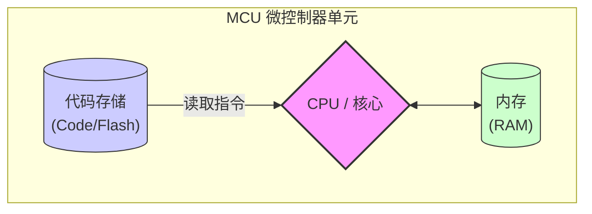
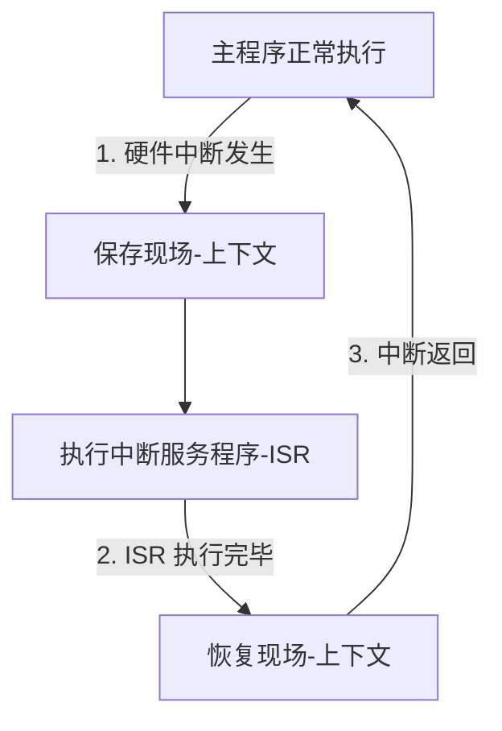
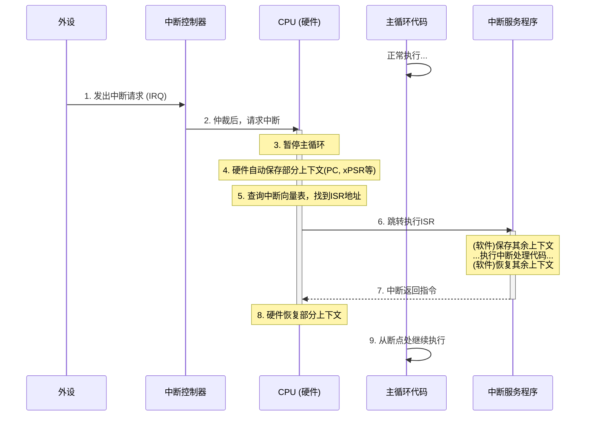
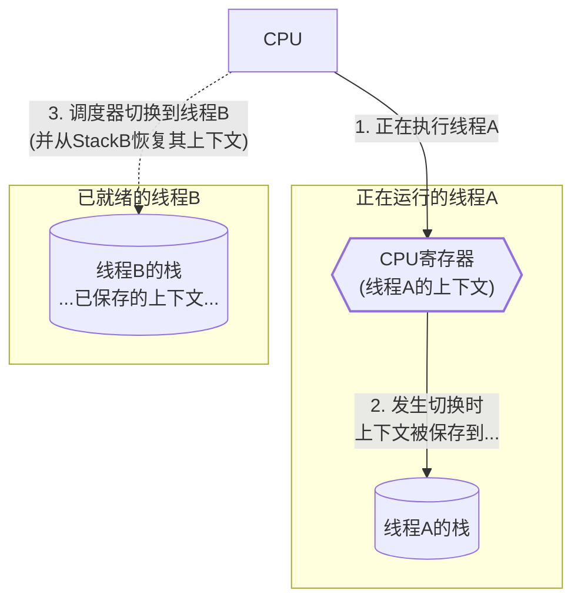
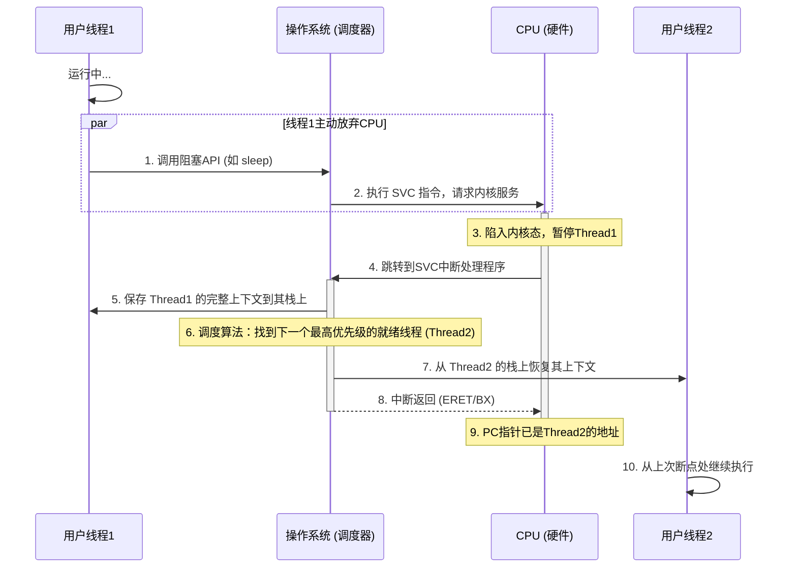

# 从零开始的 RTOS 探索：从单任务循环到多线程抢占

\[ [English](../../../en/device_dev_guide/kernel/rtos_from_scratch.md) | 简体中文 \]

本文面向操作系统初学者，旨在用最简单易懂的方式，带您探索计算机是如何从一次只能做一件事，演进到能够同时处理多个任务的。我们将一起揭开**多线程**、**中断**和**上下文切换**这些核心概念的神秘面纱。

读完本文，您将理解：

- 为什么现代操作系统需要多线程？
- 什么是中断？它如何让 CPU 变得“耳聪目明”？
- “上下文切换”究竟切换的是什么？它如何实现任务的“无缝衔接”？

## 一、程序如何运行：CPU 的基本工作原理

想象一下，计算机的大脑是一个非常勤奋但头脑简单的工人，我们通常称它为**中央处理器（CPU）**。它的工作就是严格按照一本“指令”手册来干活。

在很多我们身边的电子设备中，比如智能手环、遥控器等，这个“大脑”通常是一个高度集成的芯片，叫做**微控制器单元（MCU，Microcontroller Unit）**。你可以把 MCU 看作一个迷你电脑，它把 CPU 核心、存放指令的**代码存储 (Code)** 和存放临时数据的**内存 (RAM)** 都集成在了一起。

无论是通用的 CPU 还是集成的 MCU，要让它工作，都离不开这几样东西：

- **指令 (Code)**：告诉处理器下一步该做什么。
- **数据 (Data)**：处理器在工作中需要读写的原材料。
- **寄存器 (Registers)**：处理器自带的“高速口袋”，用于临时存放正在处理的指令地址或数据。



它的工作流程非常朴素：**MCU/CPU 从代码存储中取出一条指令，执行它，再取出下一条，周而复始。** 这就是程序运行的最基本形态。

## 二、最初的尝试：在裸机上运行单个任务

在没有操作系统的硬件上直接运行程序，我们称之为“裸机”（Bare-metal）编程。一个最简单的裸机程序，可能就是一个无限循环：

<details>
<summary>点击展开代码</summary>

```C
// 伪代码：一个简单的裸机程序
void main() {
    // 1. 初始化硬件 (如时钟、内存)
    // 2. 准备 C 语言运行环境
    // 3. 初始化串口 (UART) 驱动，用于打印信息

    while (1) {
        printf("Hello, I am a bare-metal program!\n");
    }
}
```

</details>

---

如果觉得打印太快，我们可能会想让 CPU “等一等”。但在没有操作系统的情况下，我们没有 `sleep()` 这样的函数。最直接的办法是让 CPU 做一些无用功来消耗时间，这被称为“忙等待”（Busy Wait）。

<details>
<summary>点击展开代码</summary>

```C
void udelay(int microseconds) {
    // 让 CPU 在一个循环里空转，消耗掉指定的时间
    for (int i = 0; i < (microseconds * SOME_MAGIC_NUMBER); i++) {
        // Do nothing
    }
}

while (1) {
    printf("Hello, I am a bare-metal program!\n");
    udelay(1000000); // 忙等待 1 秒
}
```

</details>

---

**关键问题**：这种方式虽然能“慢下来”，但 CPU 始终在 100% 运行，非常耗电且低效。

## 三、向多任务迈进：朴素的超级循环

现在，我们的裸机程序不再满足于只做一件事了。假设我们希望它能同时**闪烁一个 LED 灯**，并且**检测一个按键是否被按下**。

最直观的想法，就是把这些任务在 `while(1)` 循环里一个接一个地执行。这种结构在嵌入式领域通常被称为“超级循环”（Super-loop）。

### 1、最初的尝试：阻塞式轮询

我们把每个任务写成一个函数，然后在主循环里依次调用它们：

<details>
<summary>点击展开代码</summary>

```C
// 伪代码：阻塞式的超级循环

void task_blink_led() {
    // 翻转LED状态、打印日志等
    printf("LED toggled!\n");
    // 使用之前的忙等待来延时1秒
    udelay(1000000); 
}

void task_check_button() {
    if (is_button_pressed()) {
        printf("Button was pressed!\n");
    }
}

void main() {
    // ... 初始化 ...
    while (1) {
        task_blink_led();
        task_check_button();
    }
}
```

</details>

---

这种方式简单直接，但很快就会暴露出致命问题：

> **关键问题：**
>
> 1. **阻塞 (Blocking)**：`task_blink_led()` 函数包含了一个长达 1 秒的延时 `udelay()`。在这 1 秒内，CPU 被完全占用，`task_check_button()` 根本没有机会执行。这意味着，用户必须在 LED 恰好熄灭或点亮的那一瞬间按下按键，才有可能被检测到，这几乎是不可能的。整个系统响应变得极慢。
> 2. **无优先级**：即使有些任务更紧急（比如处理用户输入），它们也必须乖乖排队，等待前面的任务执行完毕。
> 3. **CPU 持续空转**：无论是执行有效任务还是在 `udelay` 中空转，CPU 始终是 100% 繁忙的，效率极低。

### 2、改进：合作式调度（非阻塞）

为了解决“阻塞”问题，我们需要转变思想：**任何任务都不应该长时间霸占 CPU。**

每个任务都应该被拆分成许多微小的步骤，执行一小步后立刻返回，把 CPU 控制权“让”给其他任务。这就像一个懂礼貌的团队，每个人都主动“合作”，而不是一个人干到死。这种模式也常被称为“状态机”。

<details>
<summary>点击展开代码</summary>

```C
// 伪代码：非阻塞的合作式调度

// 全局变量，用于任务间通信
long long last_led_toggle_time = 0;

// LED任务现在只做判断和执行，不再等待
void task_blink_led_nonblocking() {
    if (get_current_time() - last_led_toggle_time > 1000) {
        // 时间到了，翻转LED并更新时间
        toggle_led();
        last_led_toggle_time = get_current_time();
    }
    // 如果时间没到，立刻返回
}

void task_check_button_nonblocking() {
    if (is_button_pressed()) {
        printf("Button was pressed!\n");
    }
}

void main() {
    // ... 初始化 ...
    while (1) {
        task_blink_led_nonblocking();
        task_check_button_nonblocking();
        // 理论上可以有 task_c, task_d...
    }
}
```

</details>

---

**优点**：

- 解决了阻塞问题！`task_blink_led` 不再有 `udelay`，它每次被调用时只是检查一下时间，如果不满足条件就立刻返回，让 `task_check_button` 有机会执行。系统的响应性大大提高。

**新的缺点**：

1. **仍然没有抢占**：如果某个任务（比如 `task_c`）是一个复杂的计算，需要花费很长时间，那么它依然会阻塞其他所有任务。高优先级的任务（如按键处理）仍然无法“插队”。
2. **CPU 仍在空转**：当所有任务都没什么可做时（LED还没到翻转时间，用户也没按键），`while(1)` 循环还在疯狂地执行，一遍遍地调用每个任务函数，做着无意义的检查。
3. **任务必须“自觉”**：这种模式的成败，完全依赖于程序员的自觉，必须保证每个任务都不能执行太久。一个“不守规矩”的任务就会拖垮整个系统。

> **引出的核心矛盾：** 我们希望系统在有事做的时候能快速响应，没事做的时候能**停下来休息**以节省功耗。
>
> 那么，当所有任务都没准备好时，我们能在 `while(1)` 的最后加上 `sleep()` 吗？
>
> `sleep()` 多久合适呢？
>
> - 睡得太久，会错过下一个需要处理的事件（比如用户按下了按键）。
> - 睡得太短，和不睡差别不大，依然在频繁唤醒、检查、继续睡，浪费能源。
>
> 我们需要一种机制，让 CPU 能够**一直睡，直到有事件发生时再被唤醒**。

### 3、通向最终答案：事件驱动模型

这个矛盾并非无解。在现代操作系统和像 `libuv` 这样的高级库中，早已有了非常成熟的解决方案。其核心思想可以用您提供的这段经典伪代码来表示：

<details>
<summary>点击展开代码</summary>

```C++
// 伪代码：经典的事件循环模型 (Event Loop)

while (1) {
    // 1. 等待任何一个感兴趣的事件发生
    poll(all_event_sources); 

    // 2. 唤醒后，检查是哪个事件就绪，并处理它
    if (event_source_0_is_ready()) {
        process_event_0();
    }
    if (event_source_1_is_ready()) {
        process_event_1();
    }
    // ...
}
```

</details>

---

让我们来剖析这个模型的精髓：

- **`poll(all_event_sources)`**：这是整个模型的心脏。它不再是让 CPU 在 `while` 循环里空转，而是执行一个特殊的“等待”操作。这个操作会告诉系统内核：**请把我挂起（暂停），直到我关心的这些事件源（`all_event_sources`）中有任何一个发生了事情。在我等待期间，请让 CPU 去休眠或服务其他程序。**
- **唤醒与处理**：当某个事件（比如网络数据到达、定时器到期）真的发生了，系统会“唤醒”这个 `poll` 函数。程序从 `poll` 返回后，继续往下执行，检查到底是哪个事件发生了，并调用相应的处理函数。

这个模型优雅地解决了之前的所有问题：CPU 不再空转，实现了高效的等待；系统响应及时，因为任何一个事件的发生都能立刻唤醒程序。

#### 从 `poll` 到裸机

现在，我们把这个完美的思想应用到我们的裸机环境中。

在裸机里，我们没有操作系统内核，也没有“文件描述符(fd)”，但我们有它们的硬件等价物：

| **概念 (OS/高级库)**  | **对应概念 (裸机硬件)**                                |
| :-------------------- | :----------------------------------------------------- |
| 事件源 (Event Source) | **硬件模块** (如定时器、GPIO、UART串口)                |
| 等待 `poll()`         | **CPU休眠指令** (如 ARM 的 `WFI` - Wait For Interrupt) |
| 事件发生，唤醒`poll`  | **硬件中断信号**                                       |

所以，上面那个经典的事件循环，在我们的裸机世界里，就“翻译”成了这样：

<details>
<summary>点击展开代码</summary>

```C
// 伪代码：裸机环境下的事件驱动模型

void main() {
    // ... 初始化硬件模块，并“告诉”它们在完成时触发中断 ...

    while (1) {
        // 1. 执行 WFI 指令，让 CPU 进入低功耗休眠模式
        //    CPU 会一直“睡”在这里，直到一个中断发生。
        WFI(); 

        // 2. 当中断发生，CPU 被硬件唤醒，从 WFI 的下一行开始继续执行。
        //    中断服务程序（ISR）通常已经处理了紧急的部分，并设置了标志位。
        
        // 3. 在主循环中，处理非紧急的后续任务。
        if (g_timer_expired_flag == true) {
            process_led_task();
            g_timer_expired_flag = false; // 清除标志
        }
        if (g_button_pressed_flag == true) {
            process_button_task();
            g_button_pressed_flag = false; // 清除标志
        }
    }
}
```

</details>

---

这个最终形态引出了两个终极的硬件问题，也正是我们即将揭晓的答案：

1. **CPU 如何“休眠”？** -> 通过 `WFI` 指令。
2. **谁来唤醒沉睡的 CPU？** -> 一个独立于 CPU 正常执行流程之外的硬件信号。

这个能“打断”CPU 当前状态（无论是沉睡还是正在执行其他代码），强制它去处理紧急事件的硬件机制，就是我们接下来要隆重介绍的主角—**中断 (Interrupt)**。

## 四、中断：唤醒沉睡 CPU 的关键

我们已经明确了目标：让 CPU 在空闲时通过 `WFI` 指令休眠，并在事件发生时被唤醒。但谁来扮演这个“叫醒服务”的角色呢？答案是一个由硬件直接支持的强大机制——**中断（Interrupt）**。

### 1、什么是中断



**中断**：是 CPU 响应系统中发生的某个异步事件时的一种机制。它会暂停当前正在执行的任务，保存工作状态，然后跳转去处理该事件。处理完成后，再精确地返回到刚才暂停的地方，恢复状态，继续执行。

这个定义可能有些抽象，让我们用一个经典的例子来理解它：

想象你正在专心阅读一本书（CPU 在执行主程序），这时门铃突然响了（一个硬件事件，如按键按下）。

- **暂停与标记**：你不会立刻把书扔掉。你会记住你读到了第几页第几行，或者插上一枚书签（CPU **保存上下文**）。
- **处理事件**：你起身去开门，看看是谁，并处理相应的事情（CPU 跳转执行**中断服务程序 ISR**）。
- **返回与继续**：事情处理完后，你回到座位，根据书签找到原来的位置，继续阅读（CPU **恢复上下文**，返回主程序）。

整个过程无缝衔接，你既没有错过门口的紧急事件，也没有丢失看书的进度。中断，就是这样一个由硬件保障的、高效的事件处理流程。

### 2、中断的执行流程



这个“接电话”的过程，在硬件和软件层面是一场精确的协同工作。其详细步骤如下：

1. **中断请求 (IRQ)**：一个外设（如 UART 串口）完成了它的工作（比如收到了一个数据字节），便向**中断控制器（如 ARM Cortex-M 中的 NVIC）** 发出一个“我需要关注”的信号。
2. **仲裁与派发**：中断控制器像一个总调度员，它根据这个中断请求的优先级，决定是否要打扰 CPU。
3. **CPU 响应**：在执行完当前指令后，CPU 会检查中断控制器的信号。一旦发现有合法的请求，它就会暂停当前任务。
4. **上下文保存 (硬件)**：CPU 会自动将程序计数器（PC）、状态寄存器等核心现场信息压入当前任务的栈中。这个动作由硬件完成，以确保速度和原子性。
5. **查找处理函数**：CPU 从中断控制器得知是哪个中断源触发了事件（即“中断号”），然后以此为索引，在**中断向量表**中找到对应的处理函数地址。这张表就像一个预设的紧急联系簿。
6. **跳转至 ISR**：CPU 跳转到该地址，开始执行为该中断编写的**中断服务程序（ISR）**。为确保 ISR 不会“污染”主程序的运行环境，程序员通常会在 ISR 的开头，用软件手动保存一些可能会用到的通用寄存器。
7. **执行中断处理**：在这里，我们执行真正的事件处理代码。这里有一条黄金法则：**保持 ISR 简短、快速**。因为在 ISR 运行时，更低优先级的中断是被屏蔽的，过长的 ISR 会降低整个系统的响应能力。
8. **上下文恢复**：ISR 的结尾，软件手动恢复第 6 步保存的通用寄存器。
9. **中断返回**：执行一条特殊的中断返回指令，CPU 硬件会自动从栈中弹出第 4 步保存的核心现场，程序指针（PC）指回被打断的地方，主程序继续执行，仿佛一切都未曾发生。

### 3、 中断驱动的新模型

有了中断，我们的 `while(1)` 循环终于可以安心地休眠了。基于中断，我们演化出两种典型的编程模型。

#### 模型 1：ISR 置位标志，主循环处理（推荐范式）

这是嵌入式系统中最稳健、最常用的架构，它将中断处理清晰地分为“上半部”和“下半部”。

- **上半部 (Top-Half)**：即 ISR，只做最紧急的事：清除中断标志、读取数据、设置一个全局标志位，然后迅速退出。
- **下半部 (Bottom-Half)**：即主循环，在被 `WFI` 唤醒后，轮流检查这些标志位，执行那些不那么紧急、但可能更耗时的业务逻辑。

<details>
<summary>点击展开代码</summary>

```C
volatile bool g_task0_ready = false;
volatile bool g_task1_ready = false;

// ISR (上半部) - 简短快速
void task0_irq_handler() {
    g_task0_ready = true;
}

void task1_irq_handler() {
    g_task1_ready = true;
}

void main() {
    // ... 初始化硬件和中断 ...
    while (1) {
        // 进入休眠，等待任何中断唤醒
        WFI();

        // 下半部 - 醒来后处理任务
        if (g_task0_ready) {
            g_task0_ready = false;
            task0_func();
        }
        if (g_task1_ready) {
            g_task1_ready = false;
            task1_func();
        }
    }
}
```

</details>

#### 模型 2：在 ISR 中完成所有工作（应避免）

这个模型将所有任务逻辑都放在 ISR 里。

<details>
<summary>点击展开代码</summary>

```C
void task0_irq_handler() {
    task0_func(); // 在中断里执行完整任务
}

void main() {
    // ... 初始化 ...
    while (1) {
        WFI(); // 主循环只负责睡觉
    }
}
```

</details>

---

**为何模型 1 是更优的选择？** 因为系统的实时性取决于对最高优先级事件的响应速度。如果在一个冗长的 ISR（如模型 2 的 `task0_irq_handler`）中执行时，一个更紧急的中断（如电源掉电）发生，系统将无法及时响应。因此，保证 ISR 的短小是保证系统稳定可靠的基石。

### 4、新的挑战

中断机制极大地提升了系统的效率和响应能力，但当我们试图用它来构建一个更复杂的系统时，一系列新的、更高维度的问题也随之浮现：

1. **高优先级任务被阻塞**：在主循环的 `if-else` 结构中，任务的执行顺序是固定的。一个高优先级的任务，即使被中断唤醒，也可能要排队等待一个低优先级的长任务执行完毕。我们实现了**中断抢占**，但主循环中的**任务逻辑**仍然是顺序执行，无法抢占。
2. **编程模型不直观**：为了使用中断，我们不得不将一个线性的业务逻辑（如 `读取->处理->发送`）拆散成状态机和标志位，这让代码变得复杂和难以维护。
3. **缺乏公平调度**：当有多个同优先级的任务准备就绪时，简单的 `if` 判断无法保证它们能公平地分享 CPU 时间。
4. **系统脆弱**：所有任务都在一个共享的地址空间中运行，没有隔离。一个任务的 bug（如死循环、栈溢出）足以让整个系统崩溃。

我们解决了一个底层问题，却引出了一系列上层应用层面的挑战。这些关于**任务调度、抢占、同步与通信、资源管理**的复杂问题，已经超出了简单 `while(1)` + 中断所能优雅处理的范畴。

是时候引入一个专业的“系统管家”了。这，正是**实时操作系统（RTOS）**将要登场的舞台。

## 五、RTOS 的核心：多线程与上下文切换

我们终于来到了 RTOS 的大门前。前文遇到的任务优先级错乱、编程模型复杂等一系列问题，都将被这个新引入的“系统管家”所解决。而 RTOS 施展魔法的核心技巧，就是**多线程（Multithreading）**。

### 1、多线程，究竟多了什么

当我们说“多线程”时，并不仅仅指有多个任务函数。`while(1)` 里的多个 `if` 分支也像是多个任务，但它们共享着同一个运行环境。多线程的精髓在于，**每个线程都拥有自己独立的运行环境**，当它们之间切换时，彼此的运行状态不会互相干扰。

这个独立的运行环境，在操作系统中被称为**上下文（Context）**。

让我们通过一个具体的例子来理解“上下文”到底是什么。假设我们有两个线程，`task0` 和 `task1`：

<details>
<summary>点击展开代码</summary>

```C
// 全局变量，所有线程共享
int g_global = 5;

// 线程 1
void task0() {
   int i = 0;          // 局部变量，task0 私有
   char *p0 = malloc(8); // 堆内存，理论上全局共享
   while (1) {
     // ... task0 的工作 ...
   }
}

// 线程 2
void task1() {
   int j = 3;          // 局部变量，task1 私有
   char *p1 = malloc(8); // 堆内存，理论上全局共享
   while (1) {
     // ... task1 的工作 ...
   }
}
```

</details>

---

当操作系统决定将 CPU 从 `task0` 切换给 `task1` 时，需要保存哪些东西，才能在未来切回 `task0` 时让它完美续上呢？

- **保存代码**？不需要。代码段是只读的，所有线程共享。
- **保存全局变量 `g_global`**？不需要。它不属于任何一个特定线程，是公共财产。
- **保存堆（Heap）内存**？不需要。`malloc` 分配的内存由内存管理器统一管理，属于全局资源池。
- **保存局部变量 `i`,`j`？需要！** `i` 是 `task0` 的私人财产，`j` 是 `task1` 的。它们通常存储在各自的栈（Stack）上。所以，每个线程必须有自己独立的栈空间。

最关键的是，CPU 在那一瞬间的“思维状态”——**寄存器**。这包括：

- **通用寄存器**：存放着计算的中间结果。
- **程序计数器 (PC)**：记录着下一条要执行的指令地址（即“我执行到哪里了”）。
- **栈指针 (SP)**：指向当前线程的栈顶。
- **特殊寄存器**：如浮点运算寄存器 (FPU) 等。

**结论：** 线程的**上下文**，本质上就是 **CPU 核心寄存器集合**的快照。每个线程真正独有的私有财产，是它自己的**栈空间**，以及在被换出时保存在栈上的那份**上下文副本**。



### 2、上下文切换流程

**上下文切换（Context Switch）** 就是 RTOS 调度器执行的“换人”操作。它远比普通的中断处理要复杂，因为中断返回时是回到**同一个任务**，而上下文切换后是去执行一个**全新的任务**。

现代 RTOS 通常将这个核心操作统一在中断处理流程中完成，以确保原子性和一致性。一个典型的（由线程主动发起的）切换流程如下：



1. **发起切换**：`Thread1` 在执行中调用了 `wait()` 或 `sleep()` 等会引起阻塞的 API。
2. **陷入内核**：这个 API 会通过一条**软件中断**指令（如 ARM 架构的 `SVC`）请求操作系统服务。这是受控地从用户态进入内核态的“官方通道”。
3. **CPU 响应**：CPU 暂停 `Thread1`，跳转到 `SVC` 中断的处理入口。
4. **保存旧上下文**：**RTOS 调度器**开始工作。它首先将 `Thread1` 的完整上下文（所有需要保存的寄存器）**保存到** **`Thread1`** **的私有栈上**。
5. **寻找新任务**：调度器根据调度算法（如优先级），找到下一个最应该运行的线程，即 `Thread2`。
6. **切换栈指针**：调度器将 CPU 的栈指针（SP）指向 `Thread2` 的私有栈。（可能先切换到中断栈，再操作，保证安全）
7. **恢复新上下文**：调度器从 `Thread2` 的栈上，**恢复** **`Thread2`** **上一次被换出时保存的上下文**到 CPU 的寄存器中。
8. **中断返回**：执行中断返回指令。此时，由于 PC、SP 等所有寄存器都已经是 `Thread2` 的了，程序会从 `Thread2` 上次被中断的地方，继续执行下去，仿佛什么都没发生过。

对于 CPU 而言，它只是感觉执行了一次中断；但对于用户程序而言，执行流已经神奇地从一个函数“跳”到了另一个函数。

### 3、切换时机：主动让出与被动抢占

上下文切换的发生，分为两种情况：

#### 主动切换（Cooperative）

线程自己调用 `sleep()`, `wait()`, `sched_yield()` (主动让出) 等 API，自愿放弃 CPU。这是一种协作式的调度，需要线程“自觉”。

#### 被动切换（Preemptive）

这才是保证系统**实时性**的关键。切换由外部硬件中断触发，不由当前运行的线程决定，实现了“抢占”。

我们来看一个经典场景：一个低优先级的日志线程（`LOG`）正在运行，此时一个高优先级的音频线程（`AUDIO`）需要的数据已经由 DMA 准备好了。

1. `LOG` 线程正在 `while(1)` 中运行。
2. DMA 控制器完成数据传输，触发一次**硬件中断**。
3. CPU 立即暂停 `LOG` 线程，跳转到 DMA 的中断服务程序（ISR）。
4. 在 ISR 中，驱动程序唤醒了正在等待数据的 `AUDIO` 线程（例如通过 `post` 一个信号量）。
5. **ISR 返回前**，调度器介入检查。它发现一个更高优先级的 `AUDIO` 线程已经就绪。
6. 调度器**立即决定进行上下文切换**：保存 `LOG` 的上下文，恢复 `AUDIO` 的上下文。
7. 中断返回后，CPU 开始执行的是高优先级的 `AUDIO` 线程，而不是回到之前的 `LOG` 线程。

**如果没有被动切换（抢占）会怎样？** 如果系统不支持抢占，那么即使 `AUDIO` 线程被唤醒，它也必须等到 `LOG` 线程主动放弃 CPU 后才能运行。如果 `LOG` 线程是一个忙等循环，`AUDIO` 线程将永远无法执行，导致严重的实时性问题（如音频卡顿）。

**实战剖析：模拟器中的“假”中断与 API 的演进**

- **模拟抢占**：在 PC 上的仿真环境（SIM）中，模拟真实的硬件中断非常困难。早期的仿真器没有中断抢占，导致一个现象：一个低优先级的 `while(1)` 忙等循环，能“饿死”一个高优先级的 Shell 线程。解决方案是引入 `CONFIG_SIM_WALLTIME_SIGNAL`，它利用宿主机的定时器，周期性地向仿真进程发送 `signal`。仿真进程捕获这个 `signal`，并**在** **`signal`** **的处理函数中执行一次调度**，从而模拟了“时钟节拍中断（Tick）”，强制实现了抢占。
- **统一切换**：在早期的 openvela 版本中，主动切换（直接调用汇编）和被动切换（在中断中处理）的实现是分开的。这导致维护困难，常常改了一处忘了另一处。因此，在后续的迭代中，**主动切换也被统一为通过触发软中断** **`SVC`** **来进入中断路径完成**，确保了所有上下文切换都走同一套核心代码，大大提升了系统的一致性和可维护性。

### 4、保护共享资源：临界区与调度锁

多线程带来了并行的便利，也带来了访问冲突的风险。当多个线程需要访问同一个资源（如一个全局变量、一个外设）时，必须进行保护。RTOS 提供了不同粒度的保护机制：

- **禁止/允许调度 (`sched_lock()`/`sched_unlock()`)**

    - **作用**：在这对函数之间，调度器不会进行线程切换。
    - **特点**：它只是“劝告”调度器不要换人，但**并不能阻止硬件中断的发生**。ISR 依然会执行。这是一种较轻量级的锁，用于保护不希望被其他线程打断的短小代码片段。

- **临界区 (`enter_critical_section()`/`leave_critical_section()`)**

    - **作用**：在单核 CPU 上，这通常通过**关闭全局中断**来实现。
    - **特点**：这是最强的保护。一旦进入临界区，不仅线程切换被禁止，所有（可屏蔽的）硬件中断也都被屏蔽了。这能保证一小段代码的绝对原子性，但必须极快地执行并退出，否则会严重影响系统响应。

- **自旋锁 (`spin_lock_irqsave()`/`spin_unlock_irqrestore()`)**

    - **作用**：在多核系统中，它能防止其他核心同时进入临界区；在单核系统中，其效果等同于临界区（关中断）。
    - **核心原则**：持有任何一种锁，尤其是在临界区内，**绝不能执行任何可能引起休眠或阻塞的操作**（如 `sleep`, `wait`），否则极易导致系统死锁。

> **开发者视角：API 与底层实现**
>
> 在单核 CPU 上，`enter_critical_section()` 和 `spin_lock_irqsave()` 这两组 API 的最终效果是等价的，它们都依赖于底层的关中断操作，通常由 `up_irq_save()` / `up_irq_restore()` 这样的函数实现。
>
> 尽管功能上等价，但我们应该**尽量使用** **`enter_critical_section`** **或** **`spin_lock`** **这样更高级别的抽象，而不是直接调用** **`up_irq_save`**。因为上层 API 语义更清晰，且具备更好的可移植性。

### 5、 线程是越多越好吗

既然线程这么好用，我们是不是该为每个功能模块都创建一个线程？比如一个音频播放器 `decoder + resample + filter + output`，是否应该创建 4 个线程？

答案是：**否定**的。线程并非“免费的午餐”，其数量需要权衡。

- **开销增加**：每个线程都需要独立的栈空间，消耗宝贵的 RAM。上下文切换本身也需要消耗 CPU 时间。
- **同步复杂**：线程越多，它们之间需要同步和通信的地方就越多，使用的锁、信号量也越多，增加了代码复杂度和死锁的风险。
- **维护困难**：过多的线程会让系统的数据流和控制流变得难以追踪和调试。

合理的线程设计是一种艺术。通常，我们会将**功能内聚、耦合度高**的模块放在一个线程里，而为**独立的、需要并行执行或有不同实时性要求**的功能创建不同的线程。例如，将 `decoder` 和 `resample` 放在一个线程，而将 `output`（与硬件直接交互）放在另一个高优先级线程中，可能是一种更优的设计。

### 6、隔离的边界：从线程到进程

多线程为我们提供了任务隔离的初步手段，每个线程关心自己的逻辑。但这层隔离非常薄弱，因为在大多数 MCU 的 RTOS 中：

- 所有线程共享同一个内存地址空间。
- 一个线程的非法内存访问（如数组越界、野指针）可以轻易地破坏另一个线程的数据，甚至内核本身，导致整个系统崩溃。

为了实现更强的隔离，操作系统引入了进程（Process）的概念。不同操作系统对进程和线程的实现和隔离程度有很大差异，尤其取决于是否存在内存管理单元（MMU）。

下面这个表格清晰地展示了 openvela (无 MMU) 和 Linux (有 MMU) 的区别：

| **系统**             | **进程**                                  | **同一进程内的线程**                                    | **API**                                                |
| :------------------- | :---------------------------------------- | :------------------------------------------------------ | :----------------------------------------------------- |
| **openvela (无MMU)** | 地址空间共享<br> 全局变量共享             | FD 共享<br> Signal 共享<br> ENV 共享<br> 局部变量不共享 | **进程**：`task_create`<br> **线程**：`pthread_create` |
| **Linux (有MMU)**    | **地址空间不共享**<br> **全局变量不共享** | FD 共享<br> Signal 共享<br> ENV 共享<br> 局部变量不共享 | **进程**：`fork`<br> **线程**：`pthread_create`        |

从表中可以看出：

- 在有 MMU 的 Linux 系统上，进程拥有独立的虚拟地址空间，实现了硬件级别的内存隔离，一个进程崩溃不会影响其他进程，健壮性极高。
- 而在没有 MMU 的 openvela 上，“进程”是一个“软”概念。`task_create` 创建的“进程”和 `pthread_create` 创建的“线程”仍然共享同一个物理地址空间。它们的主要区别在于资源所有权（如文件描述符表是否独立）的划分，隔离性远弱于 Linux 进程。

## 六、RTOS 的内存基石：线程栈、中断栈与 Idle 栈

上一章我们了解到，每个线程的独立性来自于它私有的上下文，而这个上下文就保存在它自己的栈上。在 RTOS 中，栈的管理是一门必修课，它直接关系到系统的稳定性和内存使用效率。一个典型的 RTOS 环境中，主要存在三种不同角色的栈。

### 1、线程栈

这是我们最熟悉的栈。系统中的每一个线程（或任务）都必须拥有一个独立的栈空间。

- **作用**：

    - 存储函数调用时的局部变量、参数和返回地址。
    - 在线程被切换出去时，用于保存其完整的上下文（CPU 寄存器快照）。

- **来源**：线程栈的内存从哪里来？通常有两种方式：

    - **由调用者提供 (静态/预分配)**：开发者预先分配一块内存（例如一个全局数组，位于 `.data` 或 `.bss` 段），然后将其地址和大小传递给线程创建函数。
        1. **openvela API**: `task_create_with_stack()`
        2. **POSIX API**: `pthread_create()`，需在 `pthread_attr_t` 属性中设置 `stackaddr` 字段。
    - **由系统动态分配**：调用者只指定需要的栈大小，由操作系统在创建线程时从堆（Heap）中 `malloc` 一块内存作为线程栈。
        1. **openvela API**: `task_create()`
        2. **POSIX API**: `pthread_create()`， `pthread_attr_t` 属性中的 `stackaddr` 字段为 `NULL`。

- **挑战**：为线程分配合理大小的栈是嵌入式开发中的一个经典难题。栈太小会导致“栈溢出”，这是最隐蔽也最致命的 bug 之一；栈太大则会浪费宝贵的 RAM 资源。

### 2、Idle 线程与 Idle 栈

每个 RTOS 都有一个特殊的“空闲线程” (Idle Thread)，它也被认为是系统中的“最后一个线程”。

- **作用**：当就绪队列中没有任何用户线程可以运行时，调度器就会选择 Idle 线程来执行。它标志着 CPU 当前“无事可做”。
- **特性**：

    - **最低优先级**：Idle 线程的优先级总是被设置为系统中的最低级，确保任何一个用户线程只要就绪，就能立即抢占它。
    - **永不阻塞**：Idle 线程是一个永不休眠、永不等待任何资源的 `while(1)` 循环。**因此，绝不允许在 Idle 线程中调用** **`wait`/`sleep`** **等任何可能引起阻塞的 API**。
    - **节能**：一个设计良好的 Idle 线程并不会在 `while(1)` 中空转浪费 CPU，而是会执行 `WFI` (Wait For Interrupt) 这样的指令，让 CPU 进入低功耗的睡眠状态，直到下一次硬件中断将其唤醒。

    ```C
    // 一个极简的 Idle 线程核心逻辑
    void idle_thread_entry(void) {
        while (1) {
            // 将 CPU 置于低功耗状态，等待下一次中断
            asm("WFI");
        }
    }
    ```

- **Idle 栈**：作为系统启动后创建的第一个线程（在 openvela 中，由 `nx_start` 函数演变而来），Idle 线程同样需要自己的栈空间。这个栈通常不大，且为了保证系统最基本的功能可以运行，它和中断栈一样，都是通过**链接脚本**在编译时就静态分配好的。

### 3、中断栈 (Interrupt Stack)

这是一个非常关键但容易被忽视的概念。

- **问题**：想象一个场景，一个线程 A 的栈空间只剩几十个字节了，此时突然发生一个中断。中断服务程序（ISR）本身也需要栈空间来运行，如果这个 ISR 嵌套层级较深或定义了较大的局部变量，它压栈时就会轻易地“踩过界”，摧毁线程 A 的栈数据，导致系统在中断返回后行为异常甚至崩溃。
- **解决方案**：为了彻底隔离中断处理和线程执行，RTOS 引入了**中断栈**。这是一个系统级的、所有中断共享的、独立的栈空间。
- **工作模式**：

    - **使用独立中断栈 (推荐)**：通过配置项（如 `CONFIG_ARCH_INTERRUPTSTACK=2048`）启用并指定大小。当任何硬件中断发生时，CPU 在执行 ISR 之前，会先自动（或由内核辅助）将栈指针（SP）切换到这个预留的中断栈。中断处理完成后，再切回原来的线程栈。
    - **复用被中断的线程栈**：如果配置项为 `CONFIG_ARCH_INTERRUPTSTACK=0`，系统将不设独立的中断栈。中断发生时，ISR 会直接使用当前被中断线程的栈。

- **优势**：使用独立中断栈的好处是巨大的。它使得计算每个线程的栈大小时，**无需再考虑最坏情况下中断嵌套所需的栈空间**，大大简化了栈大小的估算，并从根本上杜绝了中断压栈“踩坏”线程栈的风险，极大地提升了系统稳定性。与 Idle 栈一样，中断栈也是一块静态预留的内存，必须在链接脚本中明确为其指定位置和大小。

## 七、疑难解析：深入调度与上下文细节

本章我们以问答的形式，解答一些关于 RTOS 内部机制的常见深度问题，帮助您将理论知识与具体的代码实现联系起来。

### Q1: 中断是不是只有一个单独的栈空间，所有任务和线程都共用？

**答**：这个问题可以分解为三个清晰的要点：

1. **线程栈是私有的**：每个线程（Task 或 Thread）都有自己独立的栈，它们之间不共享。这是线程独立运行的基础。
2. **中断栈是唯一的（如果启用）**：当系统配置了独立中断栈时（例如，通过 `CONFIG_ARCH_INTERRUPTSTACK` 配置），这个中断栈在整个系统中**只有一个**。所有的硬件中断（无论中断源是什么，也无论当时哪个线程正在运行）在响应时，都会切换到**这同一个**中断栈上进行处理。它是一个系统级的公共安全区。
3. **这是可配置的**：开发者可以根据项目需求，选择是否启用独立中断栈。

    1. **启用 (主流选择)**：这是绝大多数项目的推荐做法。它能从根本上杜绝中断处理“踩坏”线程栈的风险，极大地提升了系统稳定性，并简化了开发者对每个线程栈大小的估算。
    2. **不启用（复用线程栈）**：当中断发生时，中断服务程序会直接使用**当前被中断线程**的栈。这种方式可以节省一块静态分配的 RAM，但它将中断嵌套可能导致的栈溢出风险转嫁给了每个线程，对线程栈大小的估算要求变得极为苛刻和复杂。

### Q2: 以 ARMv8-M 架构为例，硬件不是会自动压栈吗？为什么 `exception_common` 这样的中断入口函数里还需要对 R2, R3 等寄存器进行操作？

**答**：这个问题触及了硬件和软件协同完成上下文切换的核心。

首先，您说得对，ARM Cortex-M 架构的 CPU 硬件在响应异常（包括中断）时，会自动将一部分寄存器（如 `xPSR`, `PC`, `LR`, `R12`, `R3-R0`）压入当前线程的栈中，这被称为“硬件自动保存的上下文”。

但是，这并不完整！一个线程的完整上下文还包括 `R4-R11` 等通用寄存器以及 `BASEPRI` 等特殊功能寄存器。硬件只做了“一半”的工作，剩下的一半必须由**操作系统在中断处理函数中通过软件来完成**。

在 `exception_common` 这样的通用异常处理入口，您看到的对 `R2`, `R3` 等寄存器的操作，并非是重复压栈，而是**巧妙地利用这些已被硬件保存的寄存器作为“临时工”，去完成保存“另一半”上下文的工作**。

例如：

- 在进入 `exception_common` 时，`R2` 和 `R3` 的原始值已经被硬件安全地保存在了栈上。
- 此时，软件代码可以放心地**覆盖** `R2` 和 `R3` 的当前值，用它们来执行保存任务。比如，用 `R2` 来读取并暂存 `BASEPRI` 寄存器的值，用 `R3` 来获取正确的栈指针地址（`R13`/`SP`）。
- 然后，软件再将 `R4-R11` 以及 `R2`, `R3` 中暂存的 `BASEPRI` 等值，一并存入到线程栈上预留的完整上下文区域。

所以，这些指令是**软件保存上下文流程的一部分**，是完成完整上下文切换所必需的步骤，而非硬件行为的冗余。

### Q3: 调度器的时间片轮转（Round-Robin）是如何实现的？

**答**：时间片轮转是为了保证**相同优先级的多个线程**能够公平地分享 CPU 时间，防止一个“劳模”线程永久霸占 CPU，而“饿死”同级的其他线程。

其核心实现非常巧妙，可以概括为一次**“出队再入队”**的操作，具体流程如下：

1. **时钟中断触发**：系统的时钟节拍中断（Tick）周期性地发生。在时钟中断的 ISR 中，当前运行线程的时间片计数器会减一。
2. **时间片耗尽**：当一个线程的时间片耗尽时（计数器减到 0），调度器会启动一次 round-robin 调度，例如调用 `nxsched_process_roundrobin()`。
3. **重新排队**：这个函数会调用更底层的 `nxsched_reprioritize_rtr()`，其核心逻辑是（正如您的笔记所描述）：

    - 将当前这个时间片耗尽的线程，从它所在优先级的就绪队列的**头部**移除 (`rm task from ready queue`)。
    - 再将它添加到**同一个优先级**就绪队列的**尾部** (`add task to ready queue 同优先级Task的后面插入`)。

4. **切换到新线程**：完成重新排队后，调度器会自然地选择当前优先级队列头部的新线程来执行。

通过这个简单的“队头拿到队尾”的操作，就保证了该优先级下的所有线程都能轮流获得执行机会，实现了公平调度。
