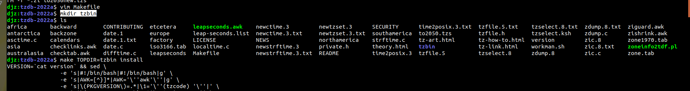

# 时间系统

\[ [English](../../../en/device_dev_guide/kernel/time_system.md) | 简体中文 \]

## 一、概述

本文档提供了时间系统的概述，包括关键时间概念、时间类型、API 和管理时间及时区的命令。

## 二、前置概念

### 1、世界标准时间（UTC）

- 定义：UTC 是全球统一的时间标准。
- 与北京时间（CST）的关系：北京时间比 UTC 快 8 小时，即 UTC+8。

### 2、日历时间（Calendar Time）

- 定义：日历时间是一种相对时间，用秒数表示从某个标准时间点到当前时刻的时间间隔。
- 特点:

    - 统一性：无论在哪个时区，同一时刻的日历时间相对于同一标准时间点始终一致。
    - 标准时间点：通常以 UTC 时间 1970-01-01 00:00:00 为基准时间点（即 Unix 时间纪元）。
    - 表示方式：以秒数形式表示，常用于计算机系统中作为时间戳。

## 三、`localtime` 在 openvela 中的实现说明

### 两种实现方式

- 打开 `CONFIG_LIBC_LOCALTIME`：

    - `localtime` 的实现依赖 `zoneinfo`，可以根据时区正确转换时间。
    - 优点：支持时区转换，功能更完善。
    - 缺点：会增加代码体积， **增加约 6.4KB**。

        

- 未打开 `CONFIG_LIBC_LOCALTIME`：

    - `localtime` 和 `gmtime` 的效果相同，直接返回 UTC 时间，不进行时区转换。
    - 优点：节省空间，无额外开销。
    - 缺点：不支持时区转换。

## 四、设置时区

**`tzset` 函数**

从环境变量 `TZ` 获取时区信息，初始化以下内容：

- `timezone` ：当前时区相对于 UTC 的偏移（以秒为单位）。
- `daylight` ：是否启用夏令时（非零表示启用）。

### 1、TZ 环境变量格式

#### 字符串格式

`TZ` 环境变量支持以下格式：

```Bash
std offset[dst[offset][,start[/time],end[/time]]]
```

**参数说明**

1. std

    表示时区缩写，由三个或三个以上的字符组成。例如：

    - CST：中国标准时间。
    - EST：东部标准时间。

2. offset

    - 当前时区与 UTC 的偏移量。
    - 格式为 `±hh:mm:ss`，例如 `+8:00:00` 表示东八区（UTC+8）。

3. dst（可选）

    表示夏令时时区缩写。

4. offset（可选）

    - 夏令时相对于 UTC 的偏移量。
    - 如果省略，默认比标准时间提前 1 小时。

5. start[/time]，end[/time]（可选）

    表示夏令时开始和结束规则：

    - 格式为 `M<month>.<week>.<day>`：

        - `M10.1.0`：10 月的第一周的星期天。
        - `M3.3.0`：3 月的第三周的星期天。

    - `/time` 表示具体时间（可选）。

#### 文件路径格式

`TZ` 环境变量支持通过文件路径指定时区信息，格式如下：

1. 路径格式。

    - `Asia/Shanghai`：相对路径，表示系统时区目录（由 `CONFIG_LIBC_TZDIR` 指定）下的文件。
    - `/Asia/Shanghai`：绝对路径，表示直接指定时区文件的完整路径。
    - `:Asia/Shanghai`：同时支持绝对路径和系统时区目录下的相对路径。

2. 解析规则：找到时区文件后，会根据 `tzfile` 格式解析文件内容，加载对应的时区信息。

### 2、`zoneinfo` 制作与挂载说明

#### `zoneinfo` 制作流程

1. `tzfile` 格式

    `zoneinfo` 使用 `tzfile` 格式存储时区信息，具体格式请参考 [tzfile文档](https://man7.org/linux/man-pages/man5/tzfile.5.html)。

2. 数据库下载。

    从 [时区数据库](https://www.iana.org/time-zones) 下载最新的时区数据。

3. 生成 `tzbin`目录。

    使用下载的时区数据，生成包含 `zoneinfo` 文件的 `tzbin` 目录，如下图所示：

    

4. 生成 `romfs` 文件。

    - 使用 Linux 工具 `genromfs` 将 `tzbin` 目录打包为 `romfs` 格式的镜像文件。
    - 该镜像文件可挂载到设备上，供程序使用。

#### 在模拟器和板子上的挂载方式

##### 在模拟器（sim）中挂载

1. 创建 RAM 磁盘。

    ```Bash
    mkrd -m 10 -s 512 102400
    ```

    - `-m 10`：指定 RAM 设备号为 `/dev/ram10`。
    - `-s 512`：设置块大小为 512 字节。
    - `102400`：设置磁盘大小为 102400 个块。

2. 挂载 `hostfs` 文件系统。

    在当前路径下存放 `romfs.img` 文件，然后挂载：

    ```Bash
    mount -t hostfs fs=. /data
    ```

3. 将 `romfs.img` 写入 RAM 磁盘。

    ```Bash
    dd if=/data/romfs.img of=/dev/ram10
    ```

4. 挂载 `romfs` 文件系统。

    ```Bash
    mount -t romfs /dev/ram10
    ```

##### 在板子上挂载

1. 找到文件分区起始地址。

    - 使用下载工具，将 `romfs` 镜像文件烧录到对应的物理分区地址。

2. 挂载分区。

    - 挂载后即可使用时区文件。

#### `zoneinfo` 制作工具

1. 自动生成。

    - 在 `libs/libc/zoneinfo/` 目录下的 `Makefile` 可自动下载时区数据库，并将其打包为 `romfs` 镜像文件，对应 `config` 如下：

        

    - 运行 `Makefile` 后，生成 `romfs_zoneinfo.img` 文件。

        

2. 挂载生成的镜像文件。

    在模拟器中挂载：

    ```Bash
    mkrd -m 10 -s 512 800  
    dd if=data/romfs_zoneinfo.img of=/dev/ram10  
    mount -t romfs /dev/ram10 zoneinfo
    ```

#### 指定时区文件位置

如果需要指定 `zoneinfo` 文件的位置，可以设置宏：

```Makefile
CONFIG_LIBC_TZDIR=/zoneinfo
```

### 3、设置时区的方法

#### 通过启动脚本设置时区

在 `rcS` 启动脚本中设置环境变量（在调用 `tzset` 之后生效）：

```Bash
# 设置为上海时区  
set TZ Asia/Shanghai  

# 中国标准时间（无夏令时）  
set TZ CST+08:00:00  

# 设置为奥克兰时区  
set TZ :Pacific/Auckland  

# 设置为查塔姆时区  
set TZ :Pacific/Chatham  

# 新西兰标准时和夏令时  
set TZ "NZST-12:00:00NZDT-13:00:00,M10.1.0,M3.3.0"
```

#### 动态设置时区

通过代码动态设置时区：

1. 调用 `setenv` ：设置环境变量 `TZ`。

    每个任务（`task`）都有独立的环境变量，因此可以持有不同的时区信息。

2. 调用 `tzset` ：同步时区信息。

#### 命令行设置时区

使用命令行工具设置时区：

```Bash
# 设置为东京时区  
timedatectl set-timezone Asia/Tokyo
```

## 五、多核时区设置说明

在多核系统中，openvela 建议：

1. **UI 显示的核**：负责设置时区信息，用于本地时间显示。
2. **其他核**：始终使用 UTC 时间，避免设置时区。

**原因：**

- 每个核的 `tzset` 是独立的，无法自动同步。
- 如果需要要多个核保持相同的时区信息，需要在每个核上单独调用 `tzset`设置时区。

**建议：**

- 除负责 UI 显示的核外，其他核尽量避免使用 `localtime`，统一使用 UTC 时间（即 `gmtime`）。
- 多核系统中打印日志统一采用 UTC 时间，保持一致性。

**特殊情况：**

- 如果多核需要访问 `zoneinfo` 文件：
    - 当资源存储在 eMMC 中，其他核需要通过 `rpmsgfs` 才能访问 `tzfile` 信息。

## 六、时间类型

**`time_t`**

- **描述**：存储从 1970 年 1 月 1 日 00:00:00 到现在经过的秒数。
- **实现**：在 openvela 中，`time_t` 实现为 `uint32_t` 或 `int64_t`。

**`struct timeval`**

- 描述：提供秒和微秒单位，最高精度是微秒。
- 结构：

    ```C
    struct timeval
    {
    time_t tv_sec; // 自 1970-01-01 00:00:00 起的秒数  
    long tv_usec;  // 微秒  
    };
    ```

**`struct timespec`**

- 描述：提供秒和纳秒单位，最高精度是纳秒。
- 结构：

    ```C
    struct timespec
    {
    time_t tv_sec;  
    long   tv_nsec; 
    };
    ```

**`stuct tm`**

- 描述：提供详细的日期和时间信息。
- 结构：

    ```C
    struct tm
    {
    int  tm_sec;         /* Seconds (0-61, allows for leap seconds) */
    int  tm_min;         /* Minutes (0-59) */
    int  tm_hour;        /* Hours (0-23) */
    int  tm_mday;        /* Day of the month (1-31) */
    int  tm_mon;         /* Month (0-11) */
    int  tm_year;        /* Years since 1900 */
    int  tm_wday;        /* Day of the week (0-6) */
    int  tm_yday;        /* Day of the year (0-365) */
    int  tm_isdst;       /* Non-0 if daylight savings time is in effect */
    long tm_gmtoff;      /* Offset from UTC in seconds */
    const char *tm_zone; /* Timezone abbreviation. */
    };
    ```

## 七、时间 API

### 1、常用时间 API

`time_t time(FAR time_t *timep)`

- 描述：获取或设置当前日历时间。
- 参数：指向存储日历时间的指针。如果为 `NULL`，则函数返回当前日历时间。
- 返回值：返回当前日历时间，类型为 `time_t`。
- 示例：
  
    ```C
    time_t current_time;  
    current_time = time(NULL); // 获取当前日历时间  
    printf("Current time: %ld\n", current_time);
    ```

`int clock_gettime(clockid_t clockid, FAR struct timespec *tp)`

- 描述：获取指定时钟的当前时间。
- 参数：

    - `clockid`： 要获取时间的时钟。常见值：`CLOCK_REALTIME`、`CLOCK_MONOTONIC`。
    - `tp`： 指向 `struct timespec` 的指针，用于存储获取的时间。
    - 返回值：成功返回 `0`，失败返回 `-1`。
    - 示例：

        ```C
        struct timespec ts;  
        clock_gettime(CLOCK_REALTIME, &ts);  
        printf("Seconds: %ld, Nanoseconds: %ld\n", ts.tv_sec, ts.tv_nsec);
        ```

`int clock_settime(clockid_t clock_id, FAR const struct timespec *tp)`

- 描述：设置指定时钟的时间。当 `clockid` 为 `CLOCK_REALTIME` 时，用于设置 UTC 时间。

`int clock_getres(clockid_t clk_id, struct timespec *res)`

- 描述：用于获取时钟精度，最高精度是纳秒。

### 2、时间转换 API

1. `time_t timegm(FAR struct tm *tmp)`

    - 描述：将 `struct tm` 转换为从 `1970-01-01 00:00:00` 至今的秒数（UTC 时间）。

2. `FAR struct tm *gmtime(FAR const time_t *timep)`

    - 描述：将从 `1970-01-01 00:00:00` 至今的秒数转换为 `struct tm` 格式的时间，并用 UTC 时间表示。

    - 说明：`gmtime_r` 是线程安全版本。

3. `time_t mktime(FAR struct tm *tp)`

    描述：将 `struct tm` 转换为依据本地时区的秒数。

4. `FAR struct tm *localtime(FAR const time_t *timep)`

    - 描述：将从 `1970-01-01 00:00:00` 至今的秒数转换为 `struct tm` 格式的时间，并用本地时区表示。
    - 说明：`localtime_r` 是线程安全版本。

5. `FAR char *asctime(FAR const struct tm *tp)`

    - 描述：将日期和时间格式化为字符串并返回。
    - 说明：`asctime_r` 是线程安全版本。

6. `size_t strftime(FAR char *s, size_t max, FAR const char *format, FAR const struct tm *tm)`

    - 描述：将 `struct tm` 中的数据按照 `format` 的格式填充到字符串 `s` 中，长度最长为 `max`。

7. `FAR char *strptime(FAR const char *s, FAR const char *format, FAR struct tm *tm)`

    描述：将字符串 `s` 按照 `format` 的格式解析，并初始化 `struct tm` 结构体。

8. `FAR char *ctime(FAR const time_t *timep)`

    - 描述：返回一个表示当地时间（`localtime`）的字符串。
    - 说明：`ctime_r` 是线程安全版本。

9. `double difftime(time_t time2, time_t time1)`

    描述：返回两次时间的差值，单位为秒。

### 3、高精度时间 API

1. `int gettimeofday(FAR struct timeval *tv, FAR struct timezone *tz)`

    - **描述**：返回当前时间，包含自 `1970-01-01 00:00:00` 起的秒数和微秒数。

    - **参数**

        - `tv`：指向 `struct timeval` 的指针，用于存储秒数和微秒数。
        - `tz`：时区信息，通常传入 `NULL`。

    - **示例**：

        ```C
        struct timeval tv;  
        gettimeofday(&tv, NULL);  
        printf("Seconds: %ld, Microseconds: %ld\n", tv.tv_sec, tv.tv_usec);
        ```

2. `int settimeofday(FAR const struct timeval *tv, FAR struct timezone *tz)`

    描述：设置系统时间（UTC）。

3. `int clock_systime_timespec(FAR struct timespec *ts)`

    描述：获取系统的运行时间（内核版 API）。

## 八、命令说明

### 1、查看系统运行时间

```Bash
ap> uptime
14:11:37 up 3 days, 16:49, load average: 0.07, 0.07, 0.07
```

### 2、设置时区

```Bash
ap> timedatectl set-timezone Asia/Tokyo
```

### 3、设置时间

```Bash
ap> date -s "May 11 11:11:21 2022"
```

### 4、查看本地时间

默认显示 localtime，无时区时显示 UTC。

```Bash
ap> date
Wed, Oct 22 14:11:54 2104
```

### 5、查看 UTC 时间

```Bash
ap> date -u
Wed, Oct 22 14:13:21 2104
```

### 6、查看时间和时区信息

```Bash
ap> timedatectl
      TimeZone: CST, 28800
    Local time: Mon, Oct 17 16:23:46 2022 CST
 Universal time: Mon, Oct 17 08:23:46 2022 UTC
      RTC time: Mon, Oct 17 08:23:47 2022
```
