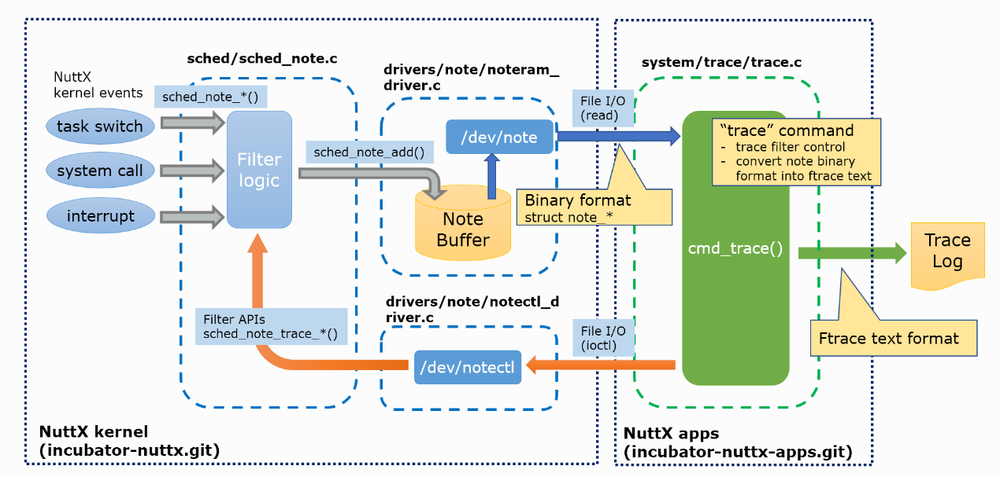
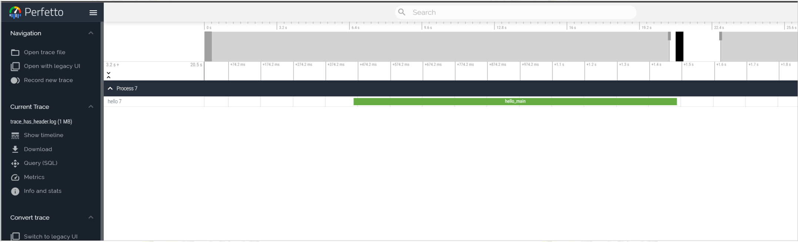

# Trace 系统

\[ [English](../../../en/device_dev_guide/kernel/trace_system.md) | 简体中文 \]

## 一、Trace 简介

Trace 是一种用于跟踪和记录系统活动的工具，能够详细捕获内核（`Kernel`）、内核扩展程序（`Kernel Extension`）和用户程序（`User Program`）的行为，尤其是以下事件：

- 系统调用（`System Call`）
- 内核服务（`Kernel Service`）
- 中断处理（`Interrupt Handlers`）
- 线程切换 （`Context Switch`）

Trace 以微秒为单位记录事件，并按时间顺序排列，提供精确的系统运行日志。

### 1、核心原理

Trace 系统通过在系统运行的关键点插桩来收集事件数据。例如：

- 在任务启动时调用 `sched_note_start`。
- 在中断函数中调用 `sched_note_irqhandle`。

### 2、支持的事件类型

Trace 工具支持以下事件的跟踪和记录：

1. 任务的执行、终止和切换。
2. 系统调用的进入和离开。
3. 中断处理程序的进入和离开。
4. 应用代码中主动插桩的事件。

此外，Trace 工具可以将收集到的事件数据以图形化方式展示，帮助用户直观分析系统行为。

## 二、配置说明

在系统编译时，可以通过 `/drivers/note/Kconfig` 配置需要记录或跟踪的 `Kernel Events` 和可选的 `Channel`。

### 1、配置 Kernel Events

以下是可选择配置的 `Kernel Events`，用于记录和跟踪系统中的关键事件：

```Makefile
# 内核埋点总配置
CONFIG_SCHED_INSTRUMENTATION=y
# 开启任务调度埋点，常用
SCHED_INSTRUMENTATION_SWITCH   
# 中断处理，常用
SCHED_INSTRUMENTATION_IRQHANDLER
# 用户自定义trace，常用
SCHED_INSTRUMENTATION_DUMP

# 调度锁
SCHED_INSTRUMENTATION_PREEMPTION
# 临界区
SCHED_INSTRUMENTATION_CSECTION
# 自旋锁
SCHED_INSTRUMENTATION_SPINLOCKS
# 系统调用
SCHED_INSTRUMENTATION_SYSCALL
```

### 2、使用 API 添加自定义 Trace 的配置

如果仅使用 API 添加自定义 Trace，请启用以下配置项：

```Makefile
# 以下配置必须打开, 使用 API 添加自定义 trace 时只开以下配置即可
CONFIG_SCHED_INSTRUMENTATION=y
CONFIG_SCHED_INSTRUMENTATION_FILTER_DEFAULT_MODE=0x3e
CONFIG_SCHED_INSTRUMENTATION_FILTER=y
CONFIG_SCHED_INSTRUMENTATION_DUMP=y
CONFIG_DRIVERS_NOTE=y
CONFIG_DRIVERS_NOTERAM=y
CONFIG_DRIVERS_NOTECTL=y
CONFIG_SYSTEM_TRACE=y
CONFIG_SYSTEM_TRACE_STACKSIZE=4096
CONFIG_ARCH_PERF_EVENTS=y
CONFIG_PERF_OVERFLOW_CORRECTION=y

# 默认的 Trace Buffer 大小为 2K。建议根据需求调整为更大的值，例如 2M：
CONFIG_DRIVERS_NOTERAM_BUFSIZE=204800
```

##### 指定 Buffer 所在的 Section

如有需要，可以指定 Buffer 的存储位置：

```Makefile
# 需要时可以指定buffer所在section
CONFIG_DRIVERS_NOTERAM_SECTION=".bss.xxx"
```

##### 增加 Trace 数据量的配置

以下配置项为可选项，启用后会显著增加 Trace 数据量：

- 任务切换

    ```Makefile
    CONFIG_SCHED_INSTRUMENTATION_SWITCH=y
    ```

- 中断处理程序进入/离开

    ```Makefile
    CONFIG_SCHED_INSTRUMENTATION_IRQHANDLER=y
    ```

##### 非必要配置

以下配置项通常不建议开启：

- 调度锁

    ```Makefile
    # 调度锁
    SCHED_INSTRUMENTATION_PREEMPTION
    ```

- 临界区

    ```Makefile
    # 临界区
    SCHED_INSTRUMENTATION_CSECTION
    ```

- 自旋锁

    ```Makefile
    # 自旋锁
    SCHED_INSTRUMENTATION_SPINLOCKS
    ```

##### 其他配置

- 系统调用进入/离开

    如需记录系统调用的进入和离开，可启用以下配置：

    ```Makefile
    # 开启系统调用进入/离开
    CONFIG_SCHED_INSTRUMENTATION_SYSCALL=y
    ```

- 函数名显示问题

    如果运行时未显示函数名，请启用以下配置：

    ```Makefile
    # 如果运行时，未显示函数名，需要开启下面配置
    CONFIG_ALLSYMS=y
    ```

## 三、打点时间精度配置

系统打点工具通过 `perf_gettime` API 获取时钟源，可配置为以下三种时钟源，推荐使用第一种方案：

### 方案一 （推荐）使用硬件 PMU 作为时钟源

硬件 PMU 提供高精度（纳秒级）的时间精度，并支持处理时间回滚问题。

```Bash
# 使能硬件 PMU 时钟源
CONFIG_ARCH_PERF_EVENTS=y
# 处理 perf 时钟溢出，关闭后时间可能发生回滚
CONFIG_PERF_OVERFLOW_CORRECTION=y
```

### 方案二 使用硬件定时器作为时钟源

使用硬件定时器作为时钟源，时钟精度和 `oneshot timer` 一致，并支持处理时间回滚问题。

```Bash
# 关闭硬件 PMU 时钟源，使用定时器作为 perf 时钟源
CONFIG_ARCH_PERF_EVENTS=n
```

### 方案三 使用系统滴答时钟作为时钟源

关闭下面配置，将默认使用系统 systick 作为时钟源， 时钟精度与 `CONFIG_USEC_PER_TICK` 配置一致，默认 10ms 。

```Bash
# 所有配置均关闭后，自动使用系统时间作为时钟源
CONFIG_ALARM_ARCH=n
CONFIG_TIMER_ARCH=n
CONFIG_ARCH_PERF_EVENTS=n
```

## 四、Trace 系统原理

Trace 系统的核心原理是在系统运行的关键点进行插桩，以收集系统运行数据。例如：

- 在任务启动时调用 `sched_note_start`。
- 在中断函数中调用 `sched_note_irqhandle`。



### 1、数据收集与分发

Trace 系统通过插桩 API 收集系统运行数据，并将数据分发到不同的 Channel。每个 Channel 可输出到不同的后端。目前支持的后端包括：

- RAM
- Syslog
- RTT
- SysView
- RPMsg
- ITM

## 五、API 使用说明

### 1、内核打点函数/宏

以下 API 用于在内核代码中添加固定插桩代码。

> 说明
>
> 通常情况下，无需直接调用这些 API，除非有特殊需求。

#### 任务相关 API

- 任务开始与结束

    ```C
    // 任务开始结束，始终开启
    void sched_note_start(FAR struct tcb_s *tcb);
    void sched_note_stop(FAR struct tcb_s *tcb);
    ```

- 任务调度（需启用 `CONFIG_SCHED_INSTRUMENTATION_SWITCH`）

    ```C
    // 任务调度, CONFIG_SCHED_INSTRUMENTATION_SWITCH
    void sched_note_suspend(FAR struct tcb_s *tcb);
    void sched_note_resume(FAR struct tcb_s *tcb);
    ```

- 多核任务调度（需启用 `CONFIG_SMP` 和 `CONFIG_SCHED_INSTRUMENTATION_SWITCH`）

    ```C
    // 多核任务调度, CONFIG_SMP && CONFIG_SCHED_INSTRUMENTATION_SWITCH
    void sched_note_cpu_start(FAR struct tcb_s *tcb, int cpu);
    void sched_note_cpu_started(FAR struct tcb_s *tcb);
    void sched_note_cpu_pause(FAR struct tcb_s *tcb, int cpu);
    void sched_note_cpu_paused(FAR struct tcb_s *tcb);
    void sched_note_cpu_resume(FAR struct tcb_s *tcb, int cpu);
    void sched_note_cpu_resumed(FAR struct tcb_s *tcb);
    ```

#### 锁相关 API

- 调度锁（需启用 `CONFIG_SCHED_INSTRUMENTATION_PREEMPTION`）

    ```C
    // 调度锁，CONFIG_SCHED_INSTRUMENTATION_PREEMPTION
    void sched_note_premption(FAR struct tcb_s *tcb, bool locked);
    ```

- 临界区（需启用 `CONFIG_SCHED_INSTRUMENTATION_CSECTION`）

    ```C
    // 临界区， CONFIG_SCHED_INSTRUMENTATION_CSECTION
    void sched_note_csection(FAR struct tcb_s *tcb, bool enter);
    ```

- 自旋锁（需启用 `CONFIG_SCHED_INSTRUMENTATION_SPINLOCK`）

    ```C
    // 自旋锁，CONFIG_SCHED_INSTRUMENTATION_SPINLOCK
    void sched_note_spinlock(FAR struct tcb_s *tcb, FAR volatile spinlock_t *spinlock, int type);
    ```

#### 中断与系统调用相关 API

- 中断处理（需启用 `CONFIG_SCHED_INSTRUMENTATION_IRQHANDLER`）

    ```C
    void sched_note_irqhandler(int irq, FAR void *handler, bool enter);  
    ```

- 系统调用（需启用 `CONFIG_SCHED_INSTRUMENTATION_SYSCALL`）

    ```C
    void sched_note_syscall_enter(int nr, int argc, ...);  
    void sched_note_syscall_leave(int nr, uintptr_t result);  
    ```

### 2、自定义打点 API

`sched_note` 的扩展部分可用于在应用代码中添加打点功能。通过配置宏 `CONFIG_SCHED_INSTRUMENTATION_DUMP` 可启用该功能。

#### API 列表

以下是 `sched_note` 提供的 API 列表及其功能说明：

- 输出事件信息：记录事件信息，用于调试和性能分析。

    ```C
    //#include <nuttx/sched_note.h>
    
    // 输出事件信息
    #define sched_note_event(tag, event, buf, len)
    #define sched_note_vprintf(tag, fmt, va) 
    #define sched_note_printf(tag, fmt, ...) 
    ```

- 函数打点（多次使用）：在函数中添加打点，可在不同函数中多次使用。

    ```C
    //#include <nuttx/sched_note.h>
    
    // 在函数中打点，可在不同的函数中打点，无限制
    #define sched_note_beginex(tag, str) 
    #define sched_note_endex(tag, str) 
    ```

- 函数打点（单次使用）

    ```C
    //#include <nuttx/sched_note.h>
    
    // 在函数中打点，一个函数中只能使用一次
    #define sched_note_begin(tag) 
    #define sched_note_end(tag)
    ```

- 标记事件和计数器

    ```C
    //#include <nuttx/sched_note.h>
    
    #define sched_note_mark(tag, str)
    
    #define sched_note_counter(tag, name, value)
    ```

    

#### Tag 参数说明

###### Tag 参数功能

`Tag` 参数用于指定 trace 输出所在的模块。可选以下参数：

- `NOTE_TAG_ALWAYS`：表示始终输出。

###### Tag 参数枚举定义

以下是 `note_tag_e` 枚举的完整定义：

```C
enum note_tag_e
{
  NOTE_TAG_ALWAYS = 0,
  NOTE_TAG_LOG,
  NOTE_TAG_LOG_EMERG = NOTE_TAG_LOG,
  NOTE_TAG_LOG_ALERT,
  NOTE_TAG_LOG_CRIT,
  NOTE_TAG_LOG_ERR,
  NOTE_TAG_LOG_WARNING,
  NOTE_TAG_LOG_NOTICE,
  NOTE_TAG_LOG_INFO,
  NOTE_TAG_LOG_DEBUG,
  NOTE_TAG_APP,
  NOTE_TAG_ARCH,
  NOTE_TAG_AUDIO,
  NOTE_TAG_BOARDS,
  NOTE_TAG_CRYPTO,
  NOTE_TAG_DRIVERS,
  NOTE_TAG_FS,
  NOTE_TAG_GRAPHICS,
  NOTE_TAG_INPUT,
  NOTE_TAG_LIBS,
  NOTE_TAG_MM,
  NOTE_TAG_NET,
  NOTE_TAG_SCHED,
  NOTE_TAG_VIDEO,
  NOTE_TAG_WIRLESS,

  /* Always last */

  NOTE_TAG_LAST,
  NOTE_TAG_MAX = NOTE_TAG_LAST + 16
};
```

###### 自定义事件

- `Event`：支持自定义事件 ID，可结合上述枚举值使用，以便更精确地标识和分类事件。

### 3、自定义 Trace Buffer

如果内核模块需要自定义一个 buffer 来存放私有事件，可通过以下方法注册一个 `noteram` 驱动，并指定需要关注的事件类型。

#### 必要配置

使用自定义 `trace buffer` 时，需启用以下配置项：

```Bash
# 启用自定义打点功能
CONFIG_SCHED_INSTRUMENTATION_DUMP=y
# 启用 noteram 驱动
CONFIG_DRIVERS_NOTERAM=y
# 设置支持的最大驱动数量（根据实际需求配置）
CONFIG_DRIVERS_NOTE_MAX=3
# 启用过滤功能（未启用时，所有数据都会记录到 buffer 中）
CONFIG_SCHED_INSTRUMENTATION_FILTER=y
```

#### 示例

以下示例展示了如何为 `rpmsg` 模块创建一个自定义 trace buffer。

```C
// 注册一个 noteram 驱动  
// devpath: 设备名（通常为 /dev/note/xxx，/dev/note 是所有相关驱动的公共目录）  
// bufsize: trace buffer 的大小  
// overwrite: 是否启用循环覆盖模式  
// 返回值: 对应驱动的 handle  
FAR struct note_driver_s *
noteram_initialize(FAR const char *devpath, size_t bufsize, bool overwrite);

void note_rpmsg_initialize(void)
{
  static FAR struct note_driver_s *drv = NULL;

  if (drv == NULL)
    {
      // 1. 注册一个专用的 trace buffer，大小为 16K，启用循环覆盖模式  
      drv = noteram_initialize("/dev/note/rpmsg", 16384, true);
      
      // 2. 设置过滤器，指定需要关注的事件
      // NOTE_FILTER_TAGMASK_ZERO 清空所有事件
      NOTE_FILTER_TAGMASK_ZERO(&drv->filter.tag_mask);
      // NOTE_FILTER_TAGMASK_SET 设置关注的tag, 未匹配的事件不会记录到buffer中
      NOTE_FILTER_TAGMASK_SET(NOTE_TAG_RPMSG, &drv->filter.tag_mask);
      // 3. 启用驱动，开始记录数据
      // NOTE_FILTER_MODE_FLAG_ENABLE 启用驱动
      // NOTE_FILTER_MODE_FLAG_DUMP 启用自定义数据类型
      drv->filter.mode.flag = NOTE_FILTER_MODE_FLAG_ENABLE | NOTE_FILTER_MODE_FLAG_DUMP;
    }

  // 4. 在模块代码中添加埋点，并指定对应的tag
  static int count = 0;
  sched_note_begin(NOTE_TAG_RPMSG);
  sched_note_printf(NOTE_TAG_RPMSG, "rpmsg send count: %d\n", count++);
  usleep(10000);
  sched_note_mark(NOTE_TAG_RPMSG, "rpmsg evnet trigger");
  usleep(10000);
  sched_note_end(NOTE_TAG_RPMSG);
}
```

### 4、使用示例

#### 功能说明

- 内核调度 `Hook` 函数。
  
    内核调度的 `Hook` 函数已在代码中默认添加完成，使用时无需额外添加。只需在 `menuconfig` 中修改相关配置即可启用。
- 应用打点。

    应用打点是 `sched_note` 的扩展部分，可用于应用代码中的打点功能。通过宏 `CONFIG_SCHED_INSTRUMENTATION_DUMP` 进行配置（该功能主要参考 ATRACE 的应用打点实现）。

#### 示例代码

以下是一个完整的示例代码，展示了如何在应用中使用 `sched_note` 进行打点：

```C
#include <nuttx/config.h>
#include <stdio.h>
#include <nuttx/sched_note.h>

int main(int argc, FAR char *argv[])
{
  printf("Hello, World!!\n");
  sched_note_begin(0);
  
  sleep(5);

  sched_note_beginex(0, "=============================");
  sleep(5);//task
  sched_note_endex(0, "============================"); 

  char *str = "shced note test string";

  sched_note_beginex(0, "sleep");
  sleep(1);
  sched_note_endex(0, "sleep"); 

  sched_note_vprintf(0, "sched note test vprintf", 1);

  sched_note_printf(0,"sched note test printf"); 
  int count = 0;
  sched_note_printf(NOTE_TAG_ALWAYS,
                        "sched note test count = %d.", count++); 
  
  
  sched_note_beginex(0, "sched note test beginex");
  sched_note_endex(0, "sched note test endex"); 
    
  sched_note_end(0);

  printf("test\n");

  return 0;
}
```

#### Trace日志抓取

1. 生成 Trace 文件。

    ```Bash
    ap> trace start 
    ap> hello
    ap> trace dump
    ap> trace dump /data/trace.txt   # vendor/sim/boards/vela/resource/trace.txt
    ```

    

    > 说明
    >
    > 生成 trace 日志文件名为trace.txt。

2. 上传文件。

    在 Chrome 浏览器中访问 [Perfetto](https://ui.perfetto.dev/)，将 `trace.txt` 文件拖到界面中。

3. 分析数据。

    通过 [Perfetto](https://ui.perfetto.dev/) 的交互式界面查看和分析性能数据，例如 CPU 活动、线程调度、内存使用等。

## 六、ATRACE 使用

### 1、功能概述

ATRACE 是一种用于性能分析和调试的工具，提供了一系列宏，用于记录不同类型的事件和上下文信息。例如，ATRACE 可以用于跟踪函数执行时间、异步事件、瞬时事件以及整数计数器的变化。

### 2、ATRACE 宏说明

以下是 ATRACE 提供的主要宏及其功能描述：

```C
// #include <cutils/trace.h>

ATRACE_ENABLED()

/**
 * Trace the beginning of a context.  name is used to identify the context.
 * This is often used to time function execution.
 */
ATRACE_BEGIN(name)

/**
 * Trace the end of a context.
 * This should match up (and occur after) a corresponding ATRACE_BEGIN.
 */
ATRACE_END() 

/**
 * Trace the beginning of an asynchronous event. Unlike ATRACE_BEGIN/ATRACE_END
 * contexts, asynchronous events do not need to be nested. The name describes
 * the event, and the cookie provides a unique identifier for distinguishing
 * simultaneous events. The name and cookie used to begin an event must be
 * used to end it.
 */
ATRACE_ASYNC_BEGIN(name, cookie)

/**
 * Trace the end of an asynchronous event.
 * This should have a corresponding ATRACE_ASYNC_BEGIN.
 */
ATRACE_ASYNC_END(name, cookie)

/**
 * Trace the beginning of an asynchronous event. In addition to the name and a
 * cookie as in ATRACE_ASYNC_BEGIN/ATRACE_ASYNC_END, a track name argument is
 * provided, which is the name of the row where this async event should be
 * recorded. The track name, name, and cookie used to begin an event must be
 * used to end it.
 */
ATRACE_ASYNC_FOR_TRACK_BEGIN(track_name, name, cookie) 

/**
 * Trace the end of an asynchronous event.
 * This should correspond to a previous ATRACE_ASYNC_FOR_TRACK_BEGIN.
 */
ATRACE_ASYNC_FOR_TRACK_END(track_name,cookie)

/**
 * Trace an instantaneous context. name is used to identify the context.
 *
 * An "instant" is an event with no defined duration. Visually is displayed like a single marker
 * in the timeline (rather than a span, in the case of begin/end events).
 *
 * By default, instant events are added into a dedicated track that has the same name of the event.
 * Use atrace_instant_for_track to put different instant events into the same timeline track/row.
 */
ATRACE_INSTANT(name)

/**
 * Trace an instantaneous context. name is used to identify the context.
 * track_name is the name of the row where the event should be recorded.
 *
 * An "instant" is an event with no defined duration. Visually is displayed like a single marker
 * in the timeline (rather than a span, in the case of begin/end events).
 */
ATRACE_INSTANT_FOR_TRACK(name)

/**
 * Traces an integer counter value.  name is used to identify the counter.
 * This can be used to track how a value changes over time.
 */
ATRACE_INT(name, value)

/**
 * Traces a 64-bit integer counter value.  name is used to identify the
 * counter. This can be used to track how a value changes over time.
 */
ATRACE_INT64(name, value)
```

```C
// utils/Trace.h

// ATRACE_NAME traces from its location until the end of its enclosing scope.
#define _PASTE(x, y) x ## y
#define PASTE(x, y) _PASTE(x,y)
#define ATRACE_NAME(name) ::android::ScopedTrace PASTE(___tracer, __LINE__)(ATRACE_TAG, name)

// ATRACE_CALL is an ATRACE_NAME that uses the current function name.
#define ATRACE_CALL() ATRACE_NAME(__FUNCTION__)

namespace android {

class ScopedTrace {
public:
    inline ScopedTrace(uint64_t tag, const char* name) : mTag(tag) {
        atrace_begin(mTag, name);
    }

    inline ~ScopedTrace() {
        atrace_end(mTag);
    }

private:
    uint64_t mTag;
};
```

### 3、ATrace TAG

```C
#define ATRACE_TAG_NEVER            0       // This tag is never enabled.
#define ATRACE_TAG_ALWAYS           (1<<0)  // This tag is always enabled.
#define ATRACE_TAG_GRAPHICS         (1<<1)
#define ATRACE_TAG_INPUT            (1<<2)
#define ATRACE_TAG_VIEW             (1<<3)
#define ATRACE_TAG_WEBVIEW          (1<<4)
#define ATRACE_TAG_WINDOW_MANAGER   (1<<5)
#define ATRACE_TAG_ACTIVITY_MANAGER (1<<6)
#define ATRACE_TAG_SYNC_MANAGER     (1<<7)
#define ATRACE_TAG_AUDIO            (1<<8)
#define ATRACE_TAG_VIDEO            (1<<9)
#define ATRACE_TAG_CAMERA           (1<<10)
#define ATRACE_TAG_HAL              (1<<11)
#define ATRACE_TAG_APP              (1<<12)
#define ATRACE_TAG_RESOURCES        (1<<13)
#define ATRACE_TAG_DALVIK           (1<<14)
#define ATRACE_TAG_RS               (1<<15)
#define ATRACE_TAG_BIONIC           (1<<16)
#define ATRACE_TAG_POWER            (1<<17)
#define ATRACE_TAG_PACKAGE_MANAGER  (1<<18)
#define ATRACE_TAG_SYSTEM_SERVER    (1<<19)
#define ATRACE_TAG_DATABASE         (1<<20)
#define ATRACE_TAG_NETWORK          (1<<21)
#define ATRACE_TAG_ADB              (1<<22)
#define ATRACE_TAG_VIBRATOR         (1<<23)
#define ATRACE_TAG_AIDL             (1<<24)
#define ATRACE_TAG_NNAPI            (1<<25)
#define ATRACE_TAG_RRO              (1<<26)
#define ATRACE_TAG_THERMAL          (1 << 27)
#define ATRACE_TAG_LAST             ATRACE_TAG_THERMAL
```

### 4、使用示例

1. 在代码中插桩。

    ATRACE 提供了一种简单的方式在代码中插桩，用于性能分析和调试。以下示例展示了如何在 C 和 C++ 中使用 ATRACE 进行插桩。

    ```C
    // 必须定义ATRACE_TAG，并添加头文件
    #define ATRACE_TAG ATRACE_TAG_ALWAYS
    #include <cutils/trace.h>

    int main(int argc, char *argv[])
    {
        // 对当前函数进行插桩
        ATRACE_BEGIN("hello_main");
        
        // 模拟任务
        sleep(1);
        
        // 记录瞬时事件
        ATRACE_INSTANT("printf");
        printf("hello world!");
        
        // 结束插桩
        ATRACE_END();
        return 0;
    }
    ```

    ```C++
    // 添加头文件
    #include <utils/Trace.h>

    int fun1(void)
    {
        // 对当前函数进行插桩
        ATRACE_CALL();
        
        // 模拟任务
        sleep(1);
        printf("entry fun1!");
        return 0;
    }

    int fun2(void)
    {
        // 对当前函数进行插桩
        ATRACE_CALL();
        printf("entry fun2!");
        return 0;
    }
      ```

2. 输出结果示例。

    以下是使用 `trace dump` 命令后的输出结果示例：

    ```C
    hello-7   [0]   3.187400000: sched_wakeup_new: comm=hello pid=7 target_cpu=0
    hello-7   [0]   3.187400000: tracing_mark_write: B|7|hello_main
    hello-7   [0]   4.197700000: tracing_mark_write: I|7|printf
    hello-7   [0]   4.187700000: tracing_mark_write: E|7|hello_main
    ```

3. 查看时序图。

    使用 [Perfetto](http://ui.perfetto.dev) 可查看 trace 的时序图。
    

## 七、函数自动插桩

### 1、原理介绍

通过 `__cyg_profile_func_enter` 和 `__cyg_profile_func_exit` 函数，自动记录函数的开始和结束信息。结合编译选项，用户可以为指定模块启用自动插桩功能，同时排除特定文件或函数。以下是插桩函数的实现代码：

```C
/****************************************************************************
 * Name: __cyg_profile_func_enter
 ****************************************************************************/

void noinstrument_function
__cyg_profile_func_enter(void *this_fn, void *call_site)
{
  sched_note_string_ip(NOTE_TAG_ALWAYS, (uintptr_t)this_fn, "B");
}

/****************************************************************************
 * Name: __cyg_profile_func_exit
 ****************************************************************************/

void noinstrument_function
__cyg_profile_func_exit(void *this_fn, void *call_site)
{
  sched_note_string_ip(NOTE_TAG_ALWAYS, (uintptr_t)this_fn, "E");
}
```

### 2、使用方法

1. 启用功能选项。 在 `menuconfig` 中启用以下配置项：

    ```Makefile
    CONFIG_SCHED_INSTRUMENTATION_FUNCTION 
    ```

2. 为模块启用插桩。 在目标模块的 `Makefile` 中添加以下编译选项：

    ```Makefile
    CFLAGS += -finstrument-functions 
    ```

    此选项会为模块中的所有函数自动插桩，记录函数开始和结束信息。

3. 排除特定文件或函数。
    在 `Makefile` 中添加以下参数，可以排除指定文件或函数的插桩：

    ```Makefile
    // 排除所有以函数名中包含 up 或 mm 的函数
    CFLAGS += -finstrument-functions-exclude-function-list=up,mm

    // 排除路径中包含 arch 或 board 的文件
    CFLAGS += -finstrument-functions-exclude-file-list=arch,board
    ```
