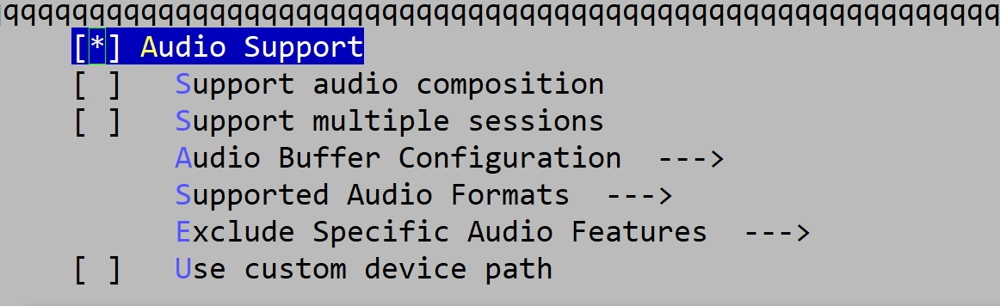
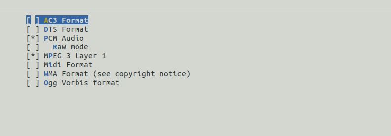

# Audio Driver 配置说明

\[ [English](../../../../en/device_dev_guide/media/audio/Audio_Driver_Cfg_Guide.md) | 简体中文 \]

## 一、打开配置界面

1. 打开 `menuconfig`。
2. 搜索关键字 **audio**。
3. 找到 **Audio Support** 配置项，界面如下图所示（UI 配色可能有所变化）。

   

## 二、配置项说明

### Audio Support

- 功能：启用音频设备驱动。
    - 除特定模组品类外，其余品类均需启用此选项。

### Support audio composition

- 功能：支持组合节点。
    - 组合节点详细说明请参见 [Audio Driver 原理说明](./Audio_Driver_Prin_desc.md)。

### Support multiple sessions

- 功能：支持多会话，
    - 默认情况下，此选项通常为 **disable**。

### Audio Buffer Configuration

- 功能：配置音频缓冲区（Buffer）。
    - 缓冲区用于应用程序与音频驱动之间的数据流转。

### Support Audio Buffers with greater than 65K samples


- 功能：支持大于 65K 样本的缓冲区。

    - 默认情况下，缓冲区大小通过 `uint16_t` 定义，最大支持 32K 样本。启用此选项后，缓冲区大小通过 `uint32_t` 定义，最大支持 65K 样本。

    - 代码示例：

        ```C
        #ifdef CONFIG_AUDIO_LARGE_BUFFERS
        typedef uint32_t apb_samp_t;
        #else
        typedef uint16_t apb_samp_t;
        #endif
        ```

### Number of buffers for audio processing

- 功能：设置音频处理的缓冲区数量。
    - 默认值为 2。

### Size of each audio buffer for audio processing

- 功能：设置每个缓冲区的大小。
    - 默认值为 8192。

### Support for Driver specified buffer sizes

- 功能：支持自定义缓冲区大小和数量。

### Supported Audio Formats



- 功能：配置音频设备支持的格式。
    - 支持的格式包括：
        - PCM Audio：支持 PCM 格式。
        - MPEG 3 Layer 1：支持音频压缩设备，可根据设备能力选择其他格式。

### Exclude Specific Audio Features

- 剔除特定音频功能。

### Use custom device path

- 功能：自定义音频设备节点的注册路径。
    - 默认注册路径为 `/dev/audio`。

## 三、示例配置

以下提供了两种典型的音频配置示例：**Simulator 环境**和**某硬件平台**。用户可根据实际需求参考配置。

### 1、Simulator 环境

以下是适用于 **Simulator 环境** 的音频配置示例：

```Makefile
#
# Audio Support
#
CONFIG_AUDIO=y
# CONFIG_AUDIO_COMP is not set
# CONFIG_AUDIO_MULTI_SESSION is not set

#
# Audio Buffer Configuration
#
# CONFIG_AUDIO_LARGE_BUFFERS is not set
CONFIG_AUDIO_NUM_BUFFERS=2
CONFIG_AUDIO_BUFFER_NUMBYTES=8192
# CONFIG_AUDIO_DRIVER_SPECIFIC_BUFFERS is not set

#
# Supported Audio Formats
#
# CONFIG_AUDIO_FORMAT_AC3 is not set
# CONFIG_AUDIO_FORMAT_DTS is not set
CONFIG_AUDIO_FORMAT_PCM=y
# CONFIG_AUDIO_FORMAT_RAW is not set
CONFIG_AUDIO_FORMAT_MP3=y
# CONFIG_AUDIO_FORMAT_MIDI is not set
# CONFIG_AUDIO_FORMAT_WMA is not set
# CONFIG_AUDIO_FORMAT_OGG_VORBIS is not set

#
# Exclude Specific Audio Features
#
# CONFIG_AUDIO_EXCLUDE_VOLUME is not set
# CONFIG_AUDIO_EXCLUDE_BALANCE is not set
CONFIG_AUDIO_EXCLUDE_EQUALIZER=y
# CONFIG_AUDIO_EXCLUDE_TONE is not set
# CONFIG_AUDIO_EXCLUDE_PAUSE_RESUME is not set
# CONFIG_AUDIO_EXCLUDE_STOP is not set
# CONFIG_AUDIO_EXCLUDE_FFORWARD is not set
CONFIG_AUDIO_EXCLUDE_REWIND=y
# CONFIG_AUDIO_CUSTOM_DEV_PATH is not set
```

### 2、某硬件平台

以下是适用于**某硬件平台**的音频配置示例：

```Makefile
#
# Audio Support
#
CONFIG_AUDIO=y
# CONFIG_AUDIO_COMP is not set
# CONFIG_AUDIO_MULTI_SESSION is not set

#
# Audio Buffer Configuration
#
# CONFIG_AUDIO_LARGE_BUFFERS is not set
CONFIG_AUDIO_NUM_BUFFERS=2
CONFIG_AUDIO_BUFFER_NUMBYTES=8192
CONFIG_AUDIO_DRIVER_SPECIFIC_BUFFERS=y

#
# Supported Audio Formats
#
# CONFIG_AUDIO_FORMAT_AC3 is not set
# CONFIG_AUDIO_FORMAT_DTS is not set
CONFIG_AUDIO_FORMAT_PCM=y
# CONFIG_AUDIO_FORMAT_RAW is not set
# CONFIG_AUDIO_FORMAT_MP3 is not set
# CONFIG_AUDIO_FORMAT_MIDI is not set
# CONFIG_AUDIO_FORMAT_WMA is not set
# CONFIG_AUDIO_FORMAT_OGG_VORBIS is not set

#
# Exclude Specific Audio Features
#
# CONFIG_AUDIO_EXCLUDE_VOLUME is not set
# CONFIG_AUDIO_EXCLUDE_BALANCE is not set
CONFIG_AUDIO_EXCLUDE_EQUALIZER=y
# CONFIG_AUDIO_EXCLUDE_TONE is not set
# CONFIG_AUDIO_EXCLUDE_PAUSE_RESUME is not set
# CONFIG_AUDIO_EXCLUDE_STOP is not set
# CONFIG_AUDIO_EXCLUDE_FFORWARD is not set
CONFIG_AUDIO_EXCLUDE_REWIND=y
# CONFIG_AUDIO_CUSTOM_DEV_PATH is not set
```
