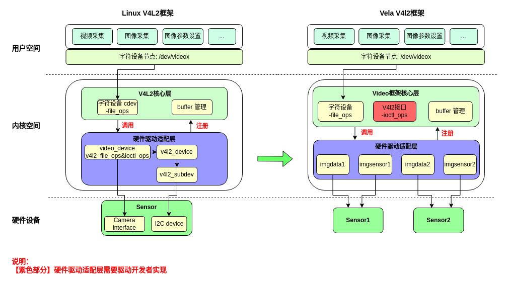
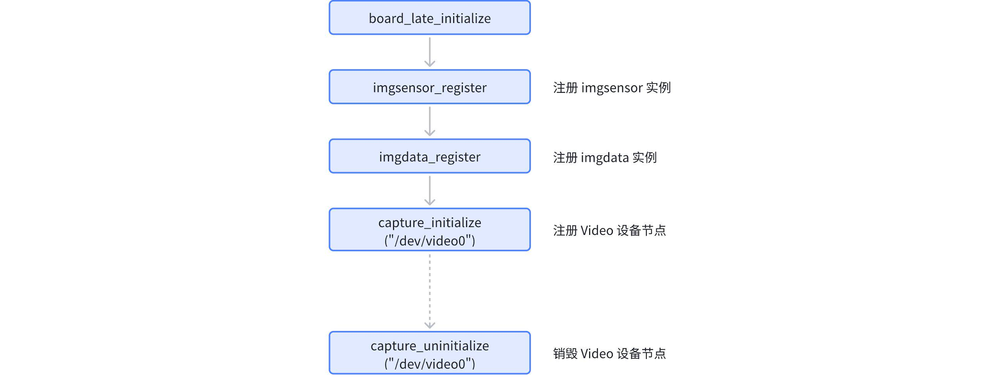
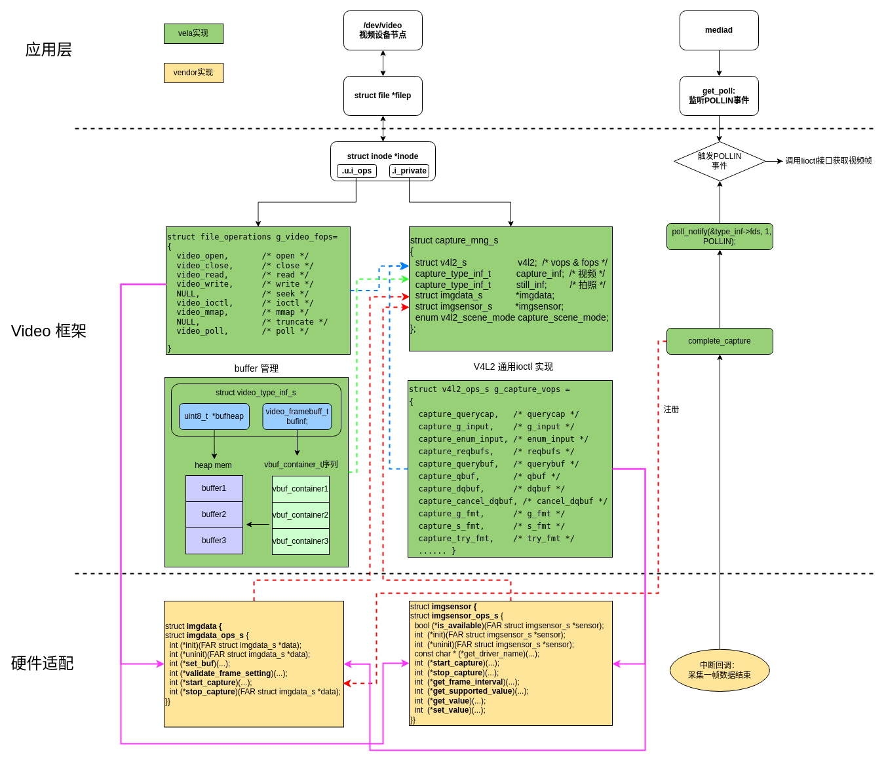

# Camera 驱动框架指南

\[ [English](../../../../en/device_dev_guide/media/camera/Camera_Driver.md) | 简体中文 \]

## 一、概述

openvela 操作系统实现了一个受 Video for Linux 2 (V4L2) 启发的视频驱动框架。该框架使应用层开发者可以沿用标准的 V4L2 操作流程，例如：打开设备节点、通过 `ioctl` 命令设置格式 (`VIDIOC_S_FMT`)、请求缓冲区 (`VIDIOC_REQBUFS`)、将缓冲区入队 (`VIDIOC_QBUF`) 以及出队以获取和处理数据 (`VIDIOC_DQBUF`)。



与标准 Linux 框架相比，openvela Camera 驱动框架的核心区别在于**简化了驱动适配逻辑**。在 openvela 平台上，适配一个新的 Camera 驱动，其核心工作聚焦于实现 `struct imgdata_s` 和 `struct imgsensor_s` 这两个抽象层的操作接口，从而显著降低了驱动开发的复杂度。

## 二、系统配置

### 1、启用 Video 框架

在项目的 Kconfig 文件中，启用以下配置项以使能 Video 框架。

```Makefile
# 通用配置
CONFIG_VIDEO=y
CONFIG_VIDEO_STREAM=y

# Simulator环境下Host宿主机对应的驱动路径
CONFIG_HOST_CAMERA_DEV_PATH="/dev/video0"
# Simulator 环境下 openvela 实际注册的设备节点
CONFIG_SIM_CAMERA_DEV_PATH="/dev/video"
```

- 在 Linux Simulator 环境中，当 `CONFIG_VIDEO=y` 时，系统会自动选中 `CONFIG_SIM_CAMERA`，即启用了视频部分。
- `CONFIG_HOST_CAMERA_DEV_PATH` 变量应指向宿主机上要使用的 video 设备路径，默认为 `/dev/video0`。

### 2、启用 Framebuffer

如果应用需要渲染视频图像，请启用 Framebuffer 功能。

```Makefile
# 通用配置
CONFIG_VIDEO_FB=y

# Simulator 环境配置
CONFIG_SIM_X11FB=y
CONFIG_SIM_FBHEIGHT=480
CONFIG_SIM_FBWIDTH=640
```

## 三、源码目录结构

- 框架核心逻辑:

    ```C++
    nuttx/drivers/video/v4l2_cap.c
    nuttx/drivers/video/v4l2_core.c
    ```

- 物理设备驱动示例:

    ```C++
    nuttx/drivers/video/isx012.c
    nuttx/drivers/video/isx019.c
    ```

- Simulator 驱动源码:

    ```C++
    nuttx/arch/sim/src/sim/sim_camera.c
    nuttx/arch/sim/src/sim/posix/sim_host_v4l2.c
    ```

## 四、驱动初始化与注册

### 1、注册设备节点

openvela 提供了两套驱动注册接口：一套是支持多实例设备的推荐接口，另一套是用于单实例设备的旧版接口。

#### 多实例注册接口（推荐）

`capture_register` 接口是推荐的注册方式。它支持将多个 `imgsensor` 实例挂载到一个 `imgdata` 实例上，并允许在系统中注册多个独立的 Camera 设备。代码如下：

```C++
/* New API to register capture driver.
 *
 *  param [in] devpath: path to capture device
 *  param [in] data: provide imgdata ops
 *  param [in] sensor: provide imgsensor ops array
 *  param [in] sensor_num: the number of imgsensor ops array
 *
 *  Return on success, 0 is returned. On failure,
 *  negative value is returned.
 */

int capture_register(FAR const char *devpath,
                     FAR struct imgdata_s *data,
                     FAR struct imgsensor_s **sensors,
                     size_t sensor_num);

/* New API to Unregister capture driver.
 *
 *  param [in] devpath: path to capture device
 *
 *  Return on success, 0 is returned. On failure,
 *  negative value is returned.
 */

int capture_unregister(FAR const char *devpath);
```

##### 调用流程


##### 核心步骤

1. 完成 `imgdata` 和 `imgsensor` 适配。
2. 调用 **`capture_register`** 接口，传入对应的 `imgdata`，`imgsensor` 以及设备节点名称`(/dev/videox)`，完成设备节点注册。
3. 如果需要注册多个设备节点，可以多次调用 **`capture_register`** 接口，进行注册。
4. 最后如需要卸载设备节点，可以调用 **`capture_unregister`** 传入指定设备节点进行销毁。

#### 单实例注册接口（不推荐）

这组接口依赖全局变量来保存实例，因此一个系统中**只能注册一个** Camera 设备。新开发的驱动程序应避免使用。

##### 调用流程



##### 核心步骤

1. 完成 `imgdata` 和 `imgsensor`适配。
2. 调用 `imgsensor_register` 注册 `imgsensor` 对象。
3. 调用 `imgdata_register` 注册 `imgdata` 对象。
4. 调用 `capture_initialize` 接口，传入设备节点名称(`/dev/videox`)，完成设备节点注册。

##### 对外接口

```C++
/* Register image sensor operations. */

int imgsensor_register(FAR struct imgsensor_s *sensor);

/* Register image data operations. */

void imgdata_register(FAR struct imgdata_s *data);

/* Initialize capture driver.
 *
 *  param [in] devpath: path to capture device
 *
 *  Return on success, 0 is returned. On failure,
 *  negative value is returned.
 */

int capture_initialize(FAR const char *devpath);

/* Uninitialize capture driver.
 *
 *  Return on success, 0 is returned. On failure,
 *  negative value is returned.
 */

int capture_uninitialize(FAR const char *devpath);
```

## 五、应用层接口

### 1、`ioctl` 命令

openvela Video 驱动为用户提供了与 Linux V4L2 兼容的 `ioctl` 接口，包含标准接口和平台专用接口。

#### 标准接口

系统已支持覆盖绝大多数应用场景的 V4L2 标准接口。

```C++
#define VIDIOC_QUERYCAP               _VIDIOC(0x0000)

/* Enumerate the formats supported by device */

#define VIDIOC_ENUM_FMT               _VIDIOC(0x0002)

/* Get the data format */

#define VIDIOC_G_FMT                  _VIDIOC(0x0004)

/* Set the data format */

#define VIDIOC_S_FMT                  _VIDIOC(0x0005)

/* Initiate user pointer I/O */

#define VIDIOC_REQBUFS                _VIDIOC(0x0008)

/* ... (其他标准 ioctl 定义同原文) ... */
```

#### 专用接口

openvela 平台扩展了专用 `ioctl` 接口，以支持拍照、场景参数设置等高级功能。

```C
/* Cancel DQBUF
 *  enum #v4l2_buf_type
 */

#define VIDIOC_CANCEL_DQBUF           _VIDIOC(0x00c1)

/* Do halfpush */

#define VIDIOC_DO_HALFPUSH            _VIDIOC(0x00c2)

/* ... (其他专用 ioctl 定义同原文) ... */
```

### 2、API 调用流程

在 openvela 平台上使用 V4L2 接口的流程与标准 Linux 流程一致，如下所述：

1. 打开设备：

    ```C
    int fd=open("/dev/video", O_RDWR);
    ```

2. 查询设备：取得设备能力，检查是否为视频设备，可读取 `V4L2_CAP_VIDEO_CAPTURE` 进行测试。

     ```C
    ioctl(fd, VIDIOC_QUERYCAP, &cap);
    ```

3. 设置视频帧格式：包括像素格式，宽度和高度等。

    ```C
    ioctl(fd, VIDIOC_S_FMT, &fmt);
    ```

4. 设置视频帧率：

    ```C
    ioctl(fd, VIDIOC_S_PARM, &parm);
    ```

5. 向驱动申请帧缓冲：不超过 `V4L2_REQBUFS_COUNT_MAX`（默认 3）个。

    ```C
    ioctl(fd, VIDIOC_REQBUFS, &req);
    ```

    **缓冲类型说明**：此时可选择 `V4L2_MEMORY_MMAP` (由驱动管理内存) 或 `V4L2_MEMORY_USERPTR` (由用户自行分配和管理内存)。若使用 `USERPTR`，则跳过步骤 6 和 7。

6. （MMAP 模式）查询帧缓冲区在内核空间中的长度和偏移量：

    ```C
    ioctl(fd, VIDIOC_QUERYBUF, &buf);
    ```

7. （MMAP 模式）将申请到的帧缓冲映射到用户空间 mmap：可直接操作采集到的帧，无需复制。

    ```C
    buffers[i].start = mmap (NULL, buffers[i].length, PROT_READ | PROT_WRITE, 
                            MAP_SHARED,fd, buffers[i].offset); 
    ```

8. 将申请到的帧缓冲全部入队列：以存放采集到的数据。

    ```C
    ioctl(fd, VIDIOC_QBUF, &buf);
    ```

9. 开始视频采集：

    ```C
    ioctl(fd, VIDIOC_STREAMON, &type);
    ```

10. 循环处理数据:

    - 出队列以取得已采集数据的帧缓冲，取得原始采集数据。

        ```C
          ioctl(fd, VIDIOC_DQBUF, &buf);
          ```

    - 处理数据。

    - 处理完后， 将该帧缓冲重新入队列尾，这样可以循环采集，直到停止采集。

11. 停止视频的采集。

    ```C
    ioctl (fd, VIDIOC_STREAMOFF, &type);
    ```

12. 释放申请的视频帧缓冲区（MMAP 模式），关闭视频设备。

    ```C
    unmap(buffers[i].start, buffers[i].length); /* MMAP */
    close(fd);
    ```

## 六、驱动适配指南

驱动适配的核心是实现 `imgdata_ops_s` 和 `imgsensor_ops_s` 这两个操作函数集，它们共同定义了 Camera 驱动的行为。

**头文件路径：**

```C++
include/nuttx/video/imgdata.h
include/nuttx/video/imgsensor.h
```

### 1、核心概念：`imgdata` 与 `imgsensor` 的职责划分

openvela Camera 框架通过将驱动逻辑解耦为**平台数据接口层 (`imgdata`)** 和**传感器设备层 (`imgsensor`)**，极大地提升了驱动的可移植性和复用性。



| **数据结构**  | **功能描述**                                                                                                                              | **用法**                                                                                                          |
| ------------- | ----------------------------------------------------------------------------------------------------------------------------------------- | ----------------------------------------------------------------------------------------------------------------- |
| **imgdata**   | 实现**主控**上对 Camera 操作的**通用**功能。一个 `imgdata` 可以对应多个不同的 `imgsensor`。                                               | 调用 SoC 的接口，初始化与 Sensor 对接的逻辑。完成 MIPI，I2C 等外设参数的设置以及主控 sensor模块的初始化相关逻辑。 |
| **imgsensor** | 通过**读写 Sensor* 的寄存器**方式，实现对**具体 Sensor 操作**的功能。因为每个 Sensor 的寄存器配置会有差异，通过该接口可以屏蔽不同的差异。 | 调用 I2C 接口，配置 Sensor 的寄存器，实现 Sensor 图像参数设置，图像采集开启和停止控制。                           |

### 2、核心数据结构定义

```C++
struct imgdata_s
{
  FAR const struct imgdata_ops_s *ops;
};

// 平台数据接口层操作函数集
struct imgdata_ops_s
{
  // 设备初始化和反初始化
  CODE int (*init)(FAR struct imgdata_s *data);
  CODE int (*uninit)(FAR struct imgdata_s *data);
  
  // 设置buffer地址，用于驱动将采集的数据填充到指定buffer中
  CODE int (*set_buf)(FAR struct imgdata_s *data,
                      uint8_t nr_datafmts,
                      FAR imgdata_format_t *datafmts,
                      uint8_t *addr, uint32_t size);
                      
  // 设置驱动的分辨率，pix_fmt 以及 帧率参数
  CODE int (*validate_frame_setting)(FAR struct imgdata_s *data,
                                     uint8_t nr_datafmts,
                                     FAR imgdata_format_t *datafmts,
                                     FAR imgdata_interval_t *interval);
                                     
  // 开启取流，设置complete 回调函数
  CODE int (*start_capture)(FAR struct imgdata_s *data,
                            uint8_t nr_datafmts,
                            FAR imgdata_format_t *datafmts,
                            FAR imgdata_interval_t *interval,
                            FAR imgdata_capture_t callback,
                            FAR void *arg);
  // 停止取流
  CODE int (*stop_capture)(FAR struct imgdata_s *data);
  
  // 可选，driver自定义buffer，某些driver需要使用特定类型的buffer（比如：uncached）可以通过该接口   自定义
  CODE void *(*alloc)(FAR struct imgdata_s *data, uint32_t align_size, uint32_t size);
  CODE void (*free)(FAR struct imgdata_s *data, void *addr);
};
```

```C++
struct imgsensor_s
{
  // 定义sensor相关的operation接口
  FAR const struct imgsensor_ops_s *ops;
  // 定义sensor支持的图像格式,分辨率，帧率参数
  size_t fmtdescs_num;
  FAR const struct v4l2_fmtdesc *fmtdescs;
  size_t frmsizes_num;
  FAR const struct v4l2_frmsizeenum *frmsizes;
  size_t frmintervals_num;
  FAR const struct v4l2_frmivalenum *frmintervals;
};

/* 传感器设备层操作函数集 */
struct imgsensor_ops_s
{
  // 判断当前sensor是否可用
  CODE bool (*is_available)(FAR struct imgsensor_s *sensor);
  // sensor初始化和反初始化
  CODE int  (*init)(FAR struct imgsensor_s *sensor);
  CODE int  (*uninit)(FAR struct imgsensor_s *sensor);
  // 获取driver名称
  CODE const char * (*get_driver_name)(FAR struct imgsensor_s *sensor);
  // 设置sensor的分辨率，图像格式以及帧率参数
  CODE int  (*validate_frame_setting)(FAR struct imgsensor_s *sensor,
                                      imgsensor_stream_type_t type,
                                      uint8_t nr_datafmts,
                                      FAR imgsensor_format_t *datafmts,
                                      FAR imgsensor_interval_t *interval);
  // 开启取流
  CODE int  (*start_capture)(FAR struct imgsensor_s *sensor,
                             imgsensor_stream_type_t type,
                             uint8_t nr_datafmts,
                             FAR imgsensor_format_t *datafmts,
                             FAR imgsensor_interval_t *interval);
  // 停止取流
  CODE int  (*stop_capture)(FAR struct imgsensor_s *sensor,
                            imgsensor_stream_type_t type);
  // 获取sensor帧率
  CODE int  (*get_frame_interval)(FAR struct imgsensor_s *sensor,
                                  imgsensor_stream_type_t type,
                                  FAR imgsensor_interval_t *interval);

  // 获取sensor 支持的图像参数，比如：亮度，对比度，保活度等。
  CODE int  (*get_supported_value)(FAR struct imgsensor_s *sensor,
                                   uint32_t id,
                                   FAR imgsensor_supported_value_t *value);
  // 获取sensor的参数
  CODE int  (*get_value)(FAR struct imgsensor_s *sensor,
                         uint32_t id, uint32_t size,
                         FAR imgsensor_value_t *value);
  // 设置sensor的参数，比如：亮度，对比度等参数。
  CODE int  (*set_value)(FAR struct imgsensor_s *sensor,
                         uint32_t id, uint32_t size,
                         imgsensor_value_t value);
};
```

### 3、`imgdata_ops_s` 接口详解

| **接口名称**                   | **主要逻辑**                                                                                                                |
| ------------------------------ | --------------------------------------------------------------------------------------------------------------------------- |
| `init`/`uninit`                | **设备初始化/反初始化**。<br> 在设备节点被 `open` / `close` 时调用。                                                        |
| `validate_frame_setting`       | **检查帧格式**。<br>  在 `VIDIOC_TRY_FMT`, `VIDIOC_S_PARM` 等 `ioctl` 中被调用，用于检查平台（SoC）是否支持上层请求的参数。 |
| `set_buf`                      | **设置下一帧缓冲区地址。** <br> 在开始传输时和每一帧捕获结束，由驱动侧调用。`complete_capture` 回调时调用。                 |
| `start_capture`/`stop_capture` | **开始/停止捕获。** <br>在视频流状态切换（`VIDIOC_STREAMON`/`OFF`）时被调用。                                               |
| `alloc`/`free`                 | **(可选) 自定义内存分配/释放**。<br> 在应用请求缓冲区时调用，当驱动适配了 `alloc` 接口，会调用该接口分配视频帧 buffer。     |

### 4、`imgsensor_ops_s` 接口详解 

| **接口名称**                   | **主要逻辑**                                                                                                          |
| ------------------------------ | --------------------------------------------------------------------------------------------------------------------- |
| `is_available`                 | **检查 sensor 是否可用。**  <br> 在注册设备节点时候调用，即在 `capture_register` 接口中调用。                         |
| `init`/`uninit`                | **Sensor 初始化/反初始化**。  <br> 设备 `open` / `close` 时调用，通常在此完成对 Sensor 的上电、复位和寄存器初始化。   |
| `get_driver_name`              | **获取驱动名称。** <br> 在 `VIDIOC_QUERYCAP` 等 `ioctl` 中调用，用于返回设备信息。                                    |
| `validate_frame_setting`       | **检查帧格式。** <br> 在 `VIDIOC_TRY_FMT` 等 `ioctl` 中调用，用于检查 Sensor 是否支持上层请求的分辨率、格式、帧率等。 |
| `start_capture`/`stop_capture` | **开始/停止捕获。** <br>在视频流状态切换时调用。                                                                      |
| `get_frame_interval`           | **获取帧率参数。** <br>在 `g_parm` 接口中调用。                                                                       |
| `get_supported_value`          | **获取支持的图像参数**。<br> 在 `querymenu` 等接口中调用。                                                            |
| `get_value`/`set_value`        | **获取/设置图像参数**。                                                                                               |

## 七、驱动实现示例

本节通过 Simulator 和真实硬件（cxd56xx）两个案例，详解驱动适配的流程与关键技术点。

### 1、Simulator Camera 驱动

Simulator 平台的 Camera 驱动借助 Host 主机的 V4L2 框架来模拟真实硬件。其设计清晰地体现了 `imgdata` 与 `imgsensor` 的职责划分。

- 代码路径：

    ```C++
    nuttx/arch/sim/src/sim/sim_camera.c
    nuttx/arch/sim/src/sim/posix/sim_host_v4l2.c
    ```

- 实现特点：

    - `imgdata` 负责平台交互：`imgdata_ops_s` 的实现封装了对 Host 主机 `/dev/videoX` 节点的 `open`、`ioctl` 等操作。这部分逻辑是平台（Simulator）相关的通用功能。
    - `imgsensor` 作为逻辑占位：由于没有真实的 Sensor 硬件，`imgsensor_ops_s` 中的大部分函数为空实现，仅 `get_driver_name` 返回一个虚拟名称。
    - 静态能力定义：Sensor 的能力（如支持 `640x480` 分辨率）被硬编码在 `imgsensor_s` 实例的静态数组成员中，供上层查询。

- 示例代码：

    ```C++
    // sim 环境下 imgsensor 适配的接口都为空，只有get_driver_name 返回了实际值
    static const struct imgsensor_ops_s g_sim_camera_ops =
    {
      .is_available           = sim_camera_is_available,
      .init                   = sim_camera_init,
      .uninit                 = sim_camera_uninit,
      .get_driver_name        = sim_camera_get_driver_name,
      .validate_frame_setting = sim_camera_validate_frame_setting,
      .start_capture          = sim_camera_start_capture,
      .stop_capture           = sim_camera_stop_capture,
    };
    
    static const char *sim_camera_get_driver_name(struct imgsensor_s *sensor)
    {
      return "V4L2 NuttX Sim Driver";
    }
    
    /* imgsensor 主要负责定义静态能力和名称 */
    static const struct v4l2_frmsizeenum g_frmsizes[] =
    {
      {
        .type = V4L2_FRMSIZE_TYPE_DISCRETE,
        .discrete =
        {
          .width = 640,
          .height = 480,
        }
      }
    };
    
    struct imgsensor_s sensor =
    {
        .ops = &g_sim_camera_ops, // ops大多为空实现
        .frmsizes_num = 1,   // 指定sensor的分辨率
        .frmsizes = g_frmsizes, // 指向分辨率定义的静态数组
    }
    ```

    ```C++
    // imgdata 负责所有与 Host V4L2 交互的实际工作
    static const struct imgdata_ops_s g_sim_camera_data_ops =
    {
      .init                   = sim_camera_data_init,  // 打开host video设备节点
      .uninit                 = sim_camera_data_uninit,// 关闭host video设备节点
      .set_buf                = sim_camera_data_set_buf,// 设置buffer 地址
      .validate_frame_setting = sim_camera_data_validate_frame_setting, // 设置格式和帧率信息
      .start_capture          = sim_camera_data_start_capture, // 开启取流，初始化buffer，并发送VIDIOC_STREAMON 指令
      .stop_capture           = sim_camera_data_stop_capture,  // 停止取流，发送VIDIOC_STREAMOFF 指令
    };
    ```

### 2、硬件 Camera 驱动 (以 cxd56xx 为例)

Sony cxd56xx 平台为两款不同的 Sensor（isx012 和 isx019）提供了驱动。该案例的精髓在于，它们**共享一套 `imgdata` 实现**，但各有**独立的 `imgsensor` 实现**，完美诠释了框架的解耦思想。

#### 参考代码

```C
// 驱动注册与初始化入口
boards/arm/cxd56xx/spresense/src/cxd56_bringup.c
// imgdata(平台层)适配代码
arch/arm/src/cxd56xx/cxd56_cisif.c
// imgsensor(设备层)适配代码
nuttx/drivers/video/isx012.c
nuttx/drivers/video/isx019.c
int cxd56_bringup(void)
{
    ...
#ifdef CONFIG_VIDEO_ISX019
  // 注册isx019 imgsensor
  ret = isx019_initialize();
  if (ret < 0)
    {
      _err("ERROR: Failed to initialize ISX019 board. %d\n", errno);
    }
#endif /* CONFIG_VIDEO_ISX019 */

#ifdef CONFIG_VIDEO_ISX012
  // 注册isx012 imgsensor
  ret = isx012_initialize();
  if (ret < 0)
    {
      _err("ERROR: Failed to initialize ISX012 board. %d\n", errno);
    }
#endif /* CONFIG_VIDEO_ISX012 */

#ifdef CONFIG_CXD56_CISIF
  // 注册cxd56 board imgdata
  ret = cxd56_cisif_initialize();
  if (ret < 0)
    {
      _err("ERROR: Failed to initialize CISIF. %d\n", errno);
      ret = ERROR;
    }
#endif /* CONFIG_CXD56_CISIF */
    ...
}
static const struct imgdata_ops_s g_cxd56_cisif_ops =
{
  .init                   = cxd56_cisif_init,
  .uninit                 = cxd56_cisif_uninit,
  .set_buf                = cxd56_cisif_set_buf,
  .validate_frame_setting = cxd56_cisif_validate_frame_setting,
  .start_capture          = cxd56_cisif_start_capture,
  .stop_capture           = cxd56_cisif_stop_capture,
};

static struct imgdata_s g_cxd56_cisif =
{
  &g_cxd56_cisif_ops
};
static const struct imgsensor_ops_s g_isx012_ops =
{
  isx012_is_available,                  /* is HW available */
  isx012_init,                          /* init */
  isx012_uninit,                        /* uninit */
  isx012_get_driver_name,               /* get driver name */
  isx012_validate_frame_setting,        /* validate_frame_setting */
  isx012_start_capture,                 /* start_capture */
  isx012_stop_capture,                  /* stop_capture */
  NULL,                                 /* get_frame_interval */
  isx012_get_supported_value,           /* get_supported_value */
  isx012_get_value,                     /* get_value */
  isx012_set_value                      /* set_value */
};

static isx012_dev_t g_isx012_private =
{
  {
    &g_isx012_ops,
  },
  NXMUTEX_INITIALIZER,
};
static const struct imgsensor_ops_s g_isx019_ops =
{
  isx019_is_available,
  isx019_init,
  isx019_uninit,
  isx019_get_driver_name,
  isx019_validate_frame_setting,
  isx019_start_capture,
  isx019_stop_capture,
  isx019_get_frame_interval,
  isx019_get_supported_value,
  isx019_get_value,
  isx019_set_value,
};

static isx019_dev_t g_isx019_private =
{
  {
    &g_isx019_ops
  },
  NXMUTEX_INITIALIZER,
  NXMUTEX_INITIALIZER,
};
```

#### 实现要点

1. 职责分离 (Responsibility Separation)，`imgdata->init` 和 `imgsensor->init` 的实现清晰地划分了平台与设备的职责：

    - `cxd56_cisif_init` (`imgdata->init`) 负责平台侧操作，如注册中断处理函数，使能中断。

    - `isx012_init` (`imgsensor->init`) 负责 Sensor 侧操作，如使能 Sensor 并初始化相关寄存器。

    ```C++
    static int cxd56_cisif_init(struct imgdata_s *data)
    {
    if (g_state != STATE_STANDBY)
        {
        return -EPERM;
        }
    
    CXD56_PIN_CONFIGS(PINCONFS_IS);
    
    /* enable CISIF clock */
    
    cxd56_img_cisif_clock_enable();
    
    /* disable CISIF interrupt */
    
    cisif_reg_write(CISIF_INTR_DISABLE, ALL_CLEAR_INT);
    cisif_reg_write(CISIF_INTR_CLEAR, ALL_CLEAR_INT);
    
    /* attach interrupt handler */
    
    irq_attach(CXD56_IRQ_CISIF, cisif_intc_handler, NULL);
    
    /* enable CISIF irq  */
    
    up_enable_irq(CXD56_IRQ_CISIF);
    
    #ifdef CISIF_INTR_TRACE
    cisif_reg_write(CISIF_INTR_ENABLE, VS_INT);
    #endif
    
    g_state = STATE_READY;
    return OK;
    }
    
    static int isx012_init(FAR struct imgsensor_s *sensor)
    {
    FAR isx012_dev_t *priv = (FAR isx012_dev_t *)sensor;
    int ret = 0;
    
    priv->i2c               = board_isx012_initialize();
    priv->i2c_cfg.address   = ISX012_I2C_SLV_ADDR;
    priv->i2c_cfg.addrlen   = 7;
    priv->i2c_cfg.frequency = I2CFREQ_STANDARD;
    
    ret = board_isx012_power_on();
    if (ret < 0)
        {
        verr("Failed to power on %d\n", ret);
        return ret;
        }
    
    ret = init_isx012(priv);
    if (ret < 0)
        {
        verr("Failed to init_isx012 %d\n", ret);
        board_isx012_set_reset();
        board_isx012_power_off();
        return ret;
        }
    
    return ret;
    }
    ```

2. `imgdata` 支持自定义内存管理 (Custom Memory Management)。

    若硬件（如 DMA 控制器）要求使用 `uncached` 等特殊类型的内存以保证数据一致性，驱动可以通过实现 `imgdata_ops_s` 的 `alloc` 和 `free` 接口来指定自定义的内存分配器。

    ```C++
    /* 在 imgdata 操作集中注册自定义内存分配函数 */
    const struct imgdata_ops_s dcam_ops = {
            .init    = dcam_init,
            .uninit  = dcam_uninit,
            .set_buf = dcam_set_buf,
            .validate_frame_setting = dcam_validate_frame_setting,
            .start_capture = dcam_start_capture,
            .stop_capture  = dcam_stop_capture,
    #ifdef CONFIG_DCAM_UNCACHE_MEM
            .alloc = dcam_malloc,
            .free  = dcam_free,
    #endif
    };
    
    void *dcam_malloc(FAR struct imgdata_s *data, uint32_t align_size, uint32_t size)
    {
        return uncache_memalign(align_size, size);
    }
    
    void dcam_free(FAR struct imgdata_s *data, void *heap)
    {
        uncache_free(heap);
    }
    ```

3. 静态能力定义 (Static Capability Definition)。

    - Sensor 支持的分辨率、帧率等固定能力，通常在 `imgsensor_s` 结构体中以静态数组的形式定义，供 V4L2 核心层在响应 `ioctl` 查询时使用。

## 八、Driver测试

摄像头驱动适配完毕后，可以使用 openvela 提供的 nxcamera 工具进行测试，详见 [Camera 功能测试指南](./Camera_Testing.md)。
