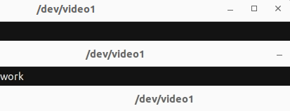
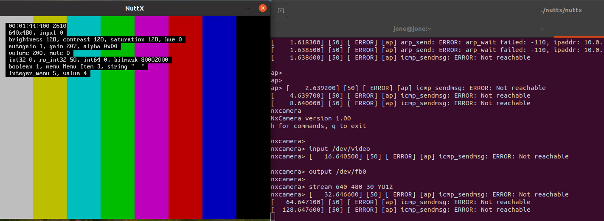

# Camera 功能测试指南

\[ [English](../../../../en/device_dev_guide/media/camera/Camera_Testing.md) | 简体中文 \]

本文档详细介绍如何在 openvela 实时操作系统中测试 Camera 功能。您可以使用 `nxcamera` 应用程序，配合物理摄像头或虚拟摄像头，完成从环境配置到功能验证的全过程。

## 一、环境准备

在开始测试前，您需要先在 openvela 系统中准备好摄像头设备。您可以选择使用物理 USB 摄像头，或者在没有物理设备时，使用 Linux 系统提供的虚拟摄像头。

### 方案 1：使用物理摄像头

1. 识别设备节点。

    在您的 Linux 主机上连接 USB 摄像头，然后执行以下命令，查找其设备节点。

    ```Bash
    ls /dev/video*
    ```

    系统将列出所有可用的视频设备，例如：

    ```bash
    /dev/video0  /dev/video1  /dev/video2  /dev/video3
    /dev/video4  /dev/video5
    ```

2. 配置 openvela 系统。

    选择一个设备节点（例如 `/dev/video0`），然后在 `menuconfig` 中启用以下配置，将该设备透传给 `openvela` 系统。

    ```Makefile
    CONFIG_VIDEO=y
    CONFIG_VIDEO_STREAM=y
    CONFIG_HOST_CAMERA_DEV_PATH="/dev/video0"
    ```

### 方案 2：使用虚拟摄像头

如果您的开发环境没有物理摄像头，`openvela` 支持使用虚拟摄像头进行测试。我们推荐在 Linux 主机上采用以下两种方法创建 V4L2（Video4Linux2）虚拟摄像头。

#### 方法一：使用 Vivid 驱动

Vivid 是 Linux 内核自带的虚拟视频驱动，能够模拟多种视频设备功能，是进行测试的便捷选择。

1. 加载 **Vivid** 驱动。

    执行以下命令加载驱动模块。

    ```Bash
    # 加载
    sudo modprobe vivid
    ```

2. 验证虚拟设备。

    加载成功后，系统通常会创建 4 个 `/dev/video*` 设备节点。默认情况下，`/dev/video0` 为可用的视频采集设备。您可以使用 `ffplay` 命令来验证它是否正常工作。

    ```Bash
    ffplay /dev/video0
    ```

    如果看到一个彩条或测试图案的视频窗口，则证明虚拟摄像头已成功创建。

    

3. (可选)卸载 **Vivid** 驱动 测试结束后，如果需要，可以使用以下命令卸载驱动。

    ```Bash
    # 卸载
    sudo modprobe -r vivid
    ```

#### 方法二：使用 v4l2loopback 和 FFmpeg

此方法允许您将视频文件、屏幕捕获或任何 FFmpeg 支持的视频源作为虚拟摄像头的输入，提供了更高的自定义能力。

1. 安装 v4l2loopback 模块。

    在基于 Debian/Ubuntu 的系统上，执行以下命令进行安装。对于其他 Linux 发行版，请使用相应的包管理器。

    ```Bash
    sudo apt-get -y install v4l2loopback-dkms
    ```

2. 加载 v4l2loopback 模块。

    ```bash
    sudo modprobe v4l2loopback
    ```

3. (可选)在 Ubuntu 20.04+ 上禁用 Secure Boot。

    如果模块因签名问题加载失败，您可能需要禁用 Secure Boot。请执行如下命令：

    ```bash
    sudo apt install mokutil
    sudo mokutil --disable-validation
    
    reboot
    ```

    重启后，在 MOK 管理界面中选择 `change secure boot state`，输入提示的密码字符，然后选择 `Disable Secure Boot` 并确认。

4. 验证模块加载。

    执行 `lsmod | grep v4l2loopback` 命令，如果看到类似下面的输出，则表明模块已成功加载。

    ```bash
    v4l2loopback           57344  2
    videodev              315392  6 videobuf2_v4l2,v4l2loopback,uvcvideo,videobuf2_common
    ```

5. 安装 FFmpeg 并推流至虚拟设备。

    首先，安装 FFmpeg。

    ```Bash
    sudo apt install ffmpeg
    ```

    然后，使用 FFmpeg 捕获桌面并将其作为视频流推送到 `/dev/video0` 设备。

    ```Bash
    ffmpeg -f x11grab -r 30 -s 640x480 -i $DISPLAY -vcodec rawvideo -pix_fmt yuv420p -threads 0 -f v4l2 /dev/video0
    ```

    **说明**：该命令捕获分辨率为 640x480、帧率为 30fps 的屏幕内容，并将其转换为 `yuv420p` (YU12) 格式推流。

6. 验证虚拟摄像头。

    打开一个新的终端，使用 `ffplay` 播放虚拟设备节点。

    ```Bash
    ffplay -i /dev/video0
    ```

    如果您能看到实时屏幕捕获的画面，证明虚拟摄像头工作正常。

    

## 二、使用 nxcamera 进行测试

`nxcamera` 是 `openvela` 系统中用于摄像头功能验证的命令行应用程序。

### 步骤 1：配置与编译

1. 启用相关组件。

    在 `menuconfig` 中，您需要启用 `nxcamera` 应用程序和 `libyuv` 库。`libyuv` 用于将摄像头采集的 YUV 原始数据转换为 Framebuffer 所需的 RGB 格式。

    ```Makefile
    CONFIG_LIBYUV=y
    CONFIG_SYSTEM_NXCAMERA=y
    ```

2. 重新编译系统。

    保存配置并重新编译 openvela 固件。

### 步骤 2：运行与验证

1. 启动 nxcamera。

    在 `openvela` 的 shell (Nsh) 中，执行 `nxcamera` 命令启动应用程序。

    ```Shell
    nsh> nxcamera
    ```

2. 执行测试命令。

    依次输入以下命令，配置视频输入源、输出目标，并启动视频流。

    - 指定输入设备：

        ```Shell
        nxcamera> input /dev/video
        ```

    - 指定输出设备：

        ```Shell
        nxcamera> output /dev/fb0
        ```

    - 启动视频流：

        ```Shell
        nxcamera> stream 640 480 30 YU12
        ```

        或者

        ```Shell
        nxcamera> stream 640 480 30 YUYV
        ```

3. 解读命令参数。

    - `input`: 指定 `openvela` 系统内的视频输入设备路径。
    - `output`: 指定 `openvela` 系统内的 Framebuffer 设备路径。
    - `stream`: 依次设置视频流的宽度、高度、帧率和视频格式。

        - 该参数为 [FourCC](https://en.wikipedia.org/wiki/FourCC) 码。目前 `nxcamera` **默认仅支持** **`YUYV`** **和** **`YU12`** **两种格式**。请确保此格式与您摄像头（物理或虚拟）输出的格式匹配。
        - `nxcamera` 的源代码位于 `apps/system/nxcamera` 目录。如果在调试过程中遇到视频格式不支持的问题，您可以修改源码，调用 `libyuv` 库中丰富的格式转换函数来支持更多输入格式。

4. 查看结果。

    命令执行后，您将看到视频流成功启动的日志。

    ```Bash
    nxcamera> input /dev/video
    nxcamera> 
    nxcamera> output /dev/fb0
    nxcamera> 
    nxcamera> stream 640 480 30 YUYV
    nxcamera_stream: ==============================
    nxcamera_stream: streaming video
    nxcamera_stream: ==============================
    nxcamera_loopthread: Entry
    nxcamera> 
    ```

    此时，在 `openvela` 模拟的 Framebuffer 显示设备上，您应该能看到来自摄像头（物理或虚拟）的实时图像。

    - 物理摄像头在 Framebuffer 上的效果图：

        

    - Vivid 虚拟驱动在 Framebuffer 上的效果图：

        
