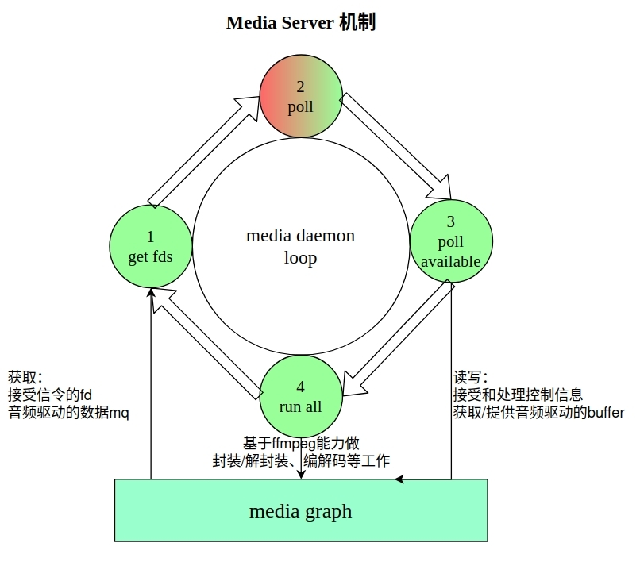

# Media Server 开发指南

[[English](../../../../en/device_dev_guide/media/server/media_server.md) | 简体中文]

## 一、概述

 Media Server 提供了一套全面的功能，基于事件循环模型，处理各种媒体事件以及客户端交互，为用户提供音频和视频播放、录制音视频、焦点管理、策略执行以及会话控制等功能。

## 二、项目目录

```tree
.
├── focus_stack.c
├── focus_stack.h
├── media_daemon.c
├── media_focus.c
├── media_graph.c
├── media_policy.c
├── media_server.c
├── media_server.h
├── media_session.c
├── media_stub.c
└── README.md
```

## 三、模块介绍

### 1、Media Daemon

Media Daemon 是 Media Server的核心，负责创建和管理 Media 的各个模块，如 `Media Focus`、`Media Graph`、`Media Session`、`Media Policy` 等。`Medid Daemon` 的核心原理是使用 `poll` 函数, 监听 `RPC socket fd`，和音视频设备驱动注册的 `message queue fd`，处理 RPC 命令并触发 FFmpeg 工作。



Media Daemon 的主要工作在一个循环中进行，大体步骤如下：

- 初始化创各个模块实例，Media Focus 等。
- 获取事件 fd，通过 `media_get_pollfds` 接口获取各个模块的事件 fd。
- 使用 `poll` 阻塞等待事件，当监听到有事件发生，则 `poll` 返回。
- 处理事件，当 `poll` 返回，调用 `media_poll_available` 处理事件。
- 执行 `run once`（主要是 FFmpeg），确保资源的有效管理和调度。

### 2、Media Focus

Media Focus 模块是 Media Server 的一个重要组成部分，目的是给多个音频流混合一起播放场景提供播放策略，协助实现同一时间内只有一个音频作为主音频内容被放送，其他音频变为次要音频或暂停输出的使用场景。Media Focus 的机制为合作抢占型，不使用 Media Focus 应用依旧可以播放音乐，但无法接入到音频焦点管理体系，此时出现的非策略性声音混合可能会对用户使用体验造成影响。

- 默认声音事件类型交互的配置文件位于 `/etc/media`。
- 声音事件类型的输入以 `media wrapper` 中的不同 `MEDIA_SCENARIO_XXX` 宏为准。目前包含 11 种类型的声音事件。
- 支持应用发起**焦点请求**、**放弃焦点请求**、**焦点改变通知**等功能。

### 3、Media Graph

Media Graph 的原理是将音视频相关的 `filter` 的 `inputs`，`outputs` 链接在一起，构成播放和录制的链路。主要策略如下：

- 加载 `graph` 配置文件创建和配置 Media Graph 及相应的 `filter`。
- 提供一系列函数处理 `filter` 的命令和事件，包括**打开**、**关闭**、**播放**、**暂停**、**停止**、**设置事件回调**、**处理命令队列**等操作。
- 封装 Media Player 和 Media Recoder 的操作接口，调用 FFmpeg 库，实现播放和录制功能。

### 4、Media Policy

Server 端的 Media Policy 模块，提供了一系列函数来处理媒体策略的设置、获取和通知等操作，在不同的项目中向 APP 提供统一的接口，把用户的**路由和音量的控制信息转化成对设备驱动的控制命令**；在不同的项目中，Policy 会使用不同的配置文件来处理 Policy 接口的控制命令的映射关系。 Media Policy 的策略通过配置文件实现：

- 修改 FFmpeg `filter graph` 配置文件，通过 Policy 控制 `graph` 的 `filter`，进行音量和链路控制。
- 编写 `pfw` 配置文件实现插件扩展等。

### 5、Media Server

Media Server 模块通过监听不同类型的 socket，接收来自 Client 的连接请求，并使用回调函数处理接收的数据。支持下述功能：

- 创建服务器实例、销毁服务器实例。
- `media_server_get_pollfds` 接口获取用于轮询的文件描述符列表。
- `media_server_poll_available` 处理文件描述符事件。
- `media_server_notify` 向特定连接发送通知和管理连接数据等。

### 6、Media Session

Server 端的 Media Session 模块在媒体框架中扮演着关键角色。通过控制者受控者的架构设计，实现了对媒体播放的高效管理和准确的状态通知。

- 控制者：负责管理其他流，包括接收状态变化通知或查询信息，但不负责流的创建和销毁。
- 受控者：掌握某些流的播放状态，负责这些流的创建、销毁和播放功能，同时需要及时更新自身的状态信息。

以下是一个使用音响播放手机音乐的场景：

- 控制者：UI 是控制者，负责与用户交互并发出播放命令。
- 受控者：蓝牙模块是受控者，负责建立与手机的音频通道，管理音乐播放，并维护自身状态。
